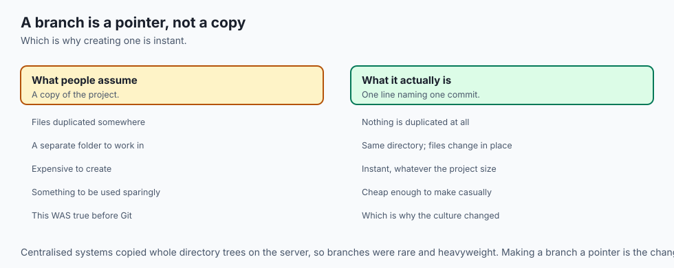
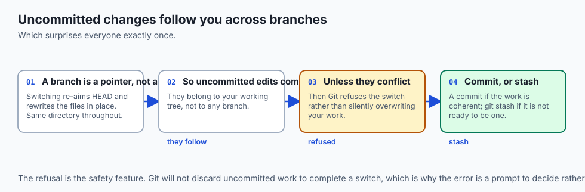
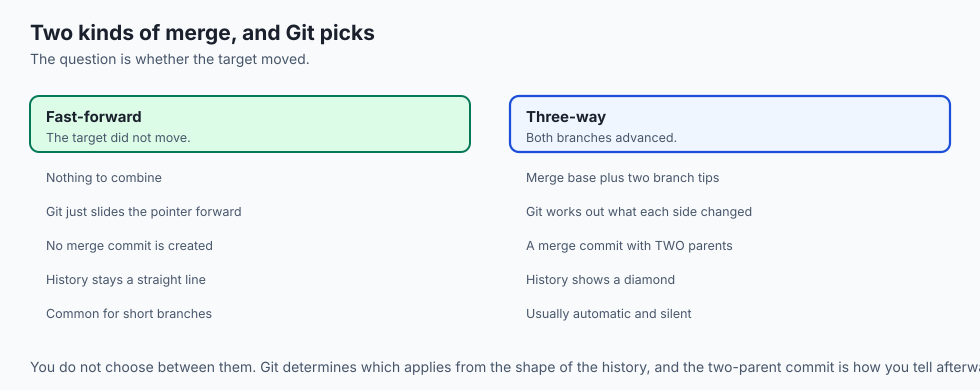
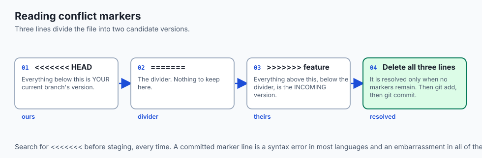
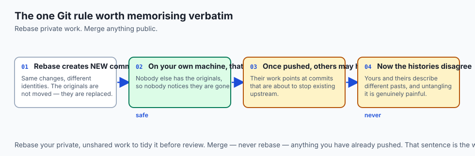
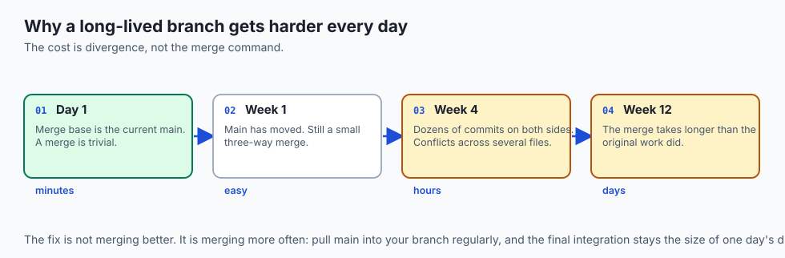
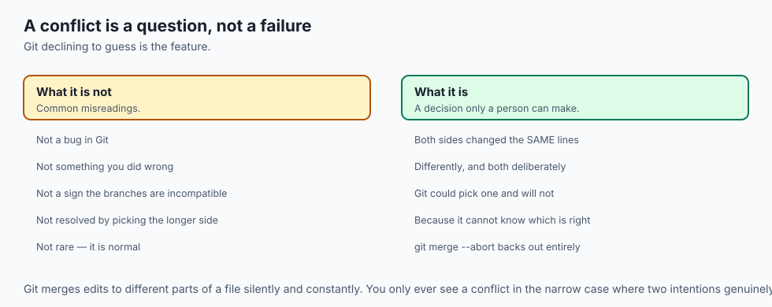
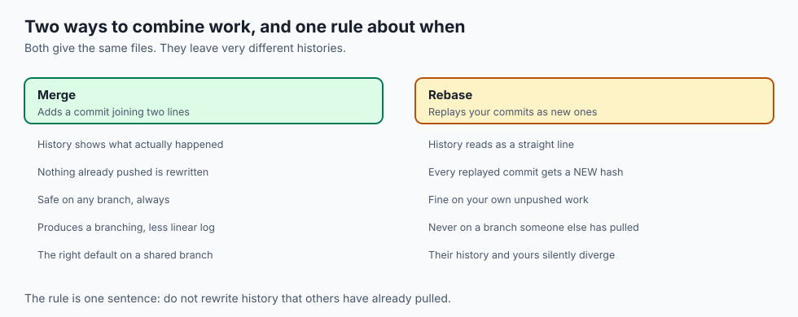
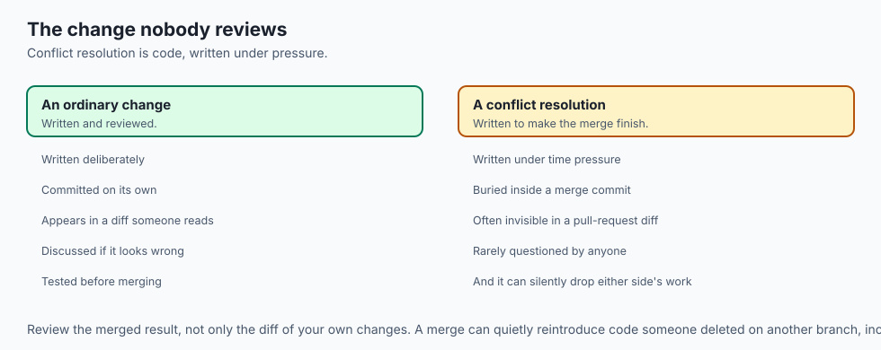
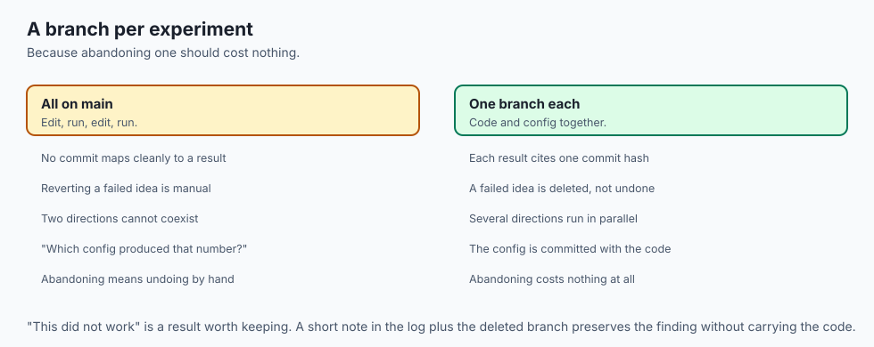

## Why this matters

- **Branching is what makes experiments safe.** An abandoned idea costs nothing and
  leaves the main line untouched.
- **Every AI project runs parallel experiments**, and a branch per experiment is the
  simplest way to keep them apart.
- **Merge conflicts are not errors.** They are Git refusing to guess, and knowing that
  removes most of the fear.
- **The rebase rule has real consequences** for other people, and it is the one Git
  rule worth memorising verbatim.
- **Cheap branching changed how software is written**, because it made trying things
  free.

---

## The idea in plain language



- **A branch is a pointer to a commit**, and nothing more. Creating one is instant
  because it writes a single line.
- **HEAD marks which branch you are on.** Committing moves the branch pointer and HEAD
  forward together.
- **Switching branches re-aims HEAD** and refreshes your working files. Nothing else
  moves.
- **Merging combines two lines**, usually automatically, sometimes with a question for
  you.
- **A conflict means both sides changed the same lines differently**, and Git will not
  pick a winner.

---

## Historical background

- **Branching was expensive before Git**, because centralised systems copied whole
  directory trees on the server.
- **So branches were rare and heavyweight** — used for releases, not for a day's work.
- **Git made a branch a pointer**, which is why creating one is instantaneous and why
  the whole culture of software changed around it.
- **The pull-request workflow followed**, and is entirely built on branches being
  cheap enough to make casually.
- **`git switch` and `git restore` arrived in 2019** to split up `checkout`, which had
  accumulated too many unrelated jobs.
- **The old spellings still work**, and you will see both in every tutorial you read.

---

## What it is — and what it is not

**A branch is:**

- A movable pointer to one commit in the graph.
- Cheap to create, cheap to abandon.
- The unit of parallel work, and of review.

**It is not:**

- **Not a copy of your files.** Nothing is duplicated; only a pointer is written.
- **Not a folder.** Switching branches changes the files in place, in the same
  directory.
- **Not permanent.** Deleting a merged branch loses nothing; the commits live on in the
  history.
- **Not isolated from your working directory.** Uncommitted changes come with you when
  you switch, which surprises people once.

---

## Why it was created and what problems it solves

- **Isolation.** Work in progress does not disturb the main line, so main stays
  releasable.
- **Parallelism.** Several people, or several ideas, can proceed at once.
- **Reviewability.** A branch is a coherent unit someone else can read and comment on.
- **Safe experimentation.** Abandoning a branch costs nothing, which is what makes
  trying things cheap.
- **Deliberate integration.** Merging is a decision you make at a moment you choose,
  rather than a continuous scramble.

---

## How it works

### The model


- **Every commit points to its parent**, so history is a graph.
- **A branch is a pointer to one commit** in that graph; HEAD marks which branch you
  are on.
- **Committing creates a commit whose parent is the current one**, then slides the
  branch pointer and HEAD forward. Nothing else moves.
- **Read the diagram left to right.** The dark line is `main` (C1, C2, C3). At C2 a
  `feature` branch was created and given two commits (F1, F2) without disturbing main.
- **M is the merge commit** — a commit with *two* parents, C3 and F2. That two-parent
  commit is the visible signature of a merge.

### Creating and switching



| Task | Modern | Classic |
| --- | --- | --- |
| List branches | `git branch` | `git branch` |
| Create, stay put | `git branch feature-x` | `git branch feature-x` |
| Create and move onto it | `git switch -c feature-x` | `git checkout -b feature-x` |
| Move to an existing branch | `git switch feature-x` | `git checkout feature-x` |
| Merge into the current branch | `git merge feature-x` | `git merge feature-x` |
| Delete a merged branch | `git branch -d feature-x` | `git branch -d feature-x` |

- **Prefer `switch` for new habits.** It exists precisely because `checkout` did too
  many unrelated jobs.

### Fast-forward and three-way merges



- **Git first finds the merge base** — the most recent commit both branches share.
- **If the target has not advanced since the split**, there is nothing to combine. Git
  slides the pointer forward: a **fast-forward**, with no merge commit, and the history
  stays a straight line.
- **If both branches advanced**, Git performs a **three-way merge**: the merge base
  plus the two branch tips, working out what each side changed relative to the base.
- **Most of the time this is automatic and silent.**

### Conflicts



- **A conflict arises only when both sides changed the same lines differently.**
- **Git combines edits to different parts of a file** with no trouble at all.

```text
<<<<<<< HEAD
milk: 1 cup buttermilk
=======
milk: 2 cups
>>>>>>> feature
```

- **Read it as three parts.** Between `<<<<<<<` and `=======` is your current branch
  ("ours"). Between `=======` and `>>>>>>>` is the incoming branch ("theirs").
- **To resolve it, edit the file to read how you want** — keep one side, the other, or
  blend them — and **delete all three marker lines**.
- **It is resolved only when no markers remain.**
- **Then `git add` the file** (telling Git it is handled) and `git commit`. That commit
  *is* the merge commit.
- **`git merge --abort` backs out entirely**, returning everything to the state before
  you started.


### Rebase, and the one rule



- **A rebase replays your commits on top of another branch**, one at a time, as if you
  had started from its latest commit all along.
- **The result is linear** — no merge commit, and a tidy sequence.
- **It does not preserve the original commits.** It creates new ones with the same
  changes and different identities, rewriting that slice of history.
- **That rewriting is both the appeal and the danger.**
- **The golden rule: never rebase commits you have already shared.** Rebase your
  private work to tidy it; merge anything public.
- **If you rebase commits others have built on**, you replace the commits they were
  working against, and your repositories disagree about what history is.

| Aspect | Merge | Rebase |
| --- | --- | --- |
| What it does | Combines with a merge commit | Replays your commits elsewhere |
| History shape | Preserves the branch structure | Rewrites into a straight line |
| Merge commit? | Yes, for a three-way | No |
| Original commits kept? | Yes | No — new ones replace them |
| Safe on shared history? | Always | **Never** |
| Best for | Finished work; anything public | Tidying your own private branch |

### Branch hygiene



- **Short, descriptive names.** `fix-login-bug`, not `stuff`.
- **One task per branch**, so it merges cleanly and reviews easily.
- **Keep it short-lived.** The longer a branch lives, the further main drifts and the
  harder the merge.
- **Delete it once merged.** Fifty stale branches is a desk buried in old drafts.

---

## An everyday analogy

Two cooks adapting the same recipe.

| The kitchen | Branching |
| --- | --- |
| The original recipe card | `main` |
| Your copy, being adapted | A feature branch |
| Their copy, also being adapted | Another branch |
| Combining both sets of notes | A merge |
| Both changed the same ingredient | A conflict |
| Deciding which amount to use | Resolving it |
| Rewriting your notes as if you had started from theirs | A rebase |

- **Different sections combine effortlessly.** Your change to the method and their
  change to the oven temperature do not collide.
- **The same line, changed twice, needs a person.** No system should silently pick one
  cook's buttermilk over the other's.
- **Rewriting your notes is fine while they are yours.** Do it after someone has
  copied them and their copy no longer matches anything.

---

## Examples in practice





- **A fast-forward merge** on a short branch nobody else touched — no merge commit,
  because none was needed.
- **A three-way merge** producing a two-parent commit, which is what a diamond in the
  history graph is.
- **A conflict in a lock file**, which is the most common conflict in practice and
  usually resolved by regenerating rather than editing.
- **A rebased branch that broke a colleague's work**, because it had already been
  pushed.
- **A branch six weeks old** whose merge took longer than the original work.

---

## Implications: security, privacy, performance, scalability, and cost



- **Security: a merge can silently reintroduce removed code**, including a
  vulnerability someone deleted on another branch. Review the merged result, not only
  the diff of your own changes.
- **Resolving a conflict is a code change**, made under time pressure and rarely
  reviewed. That is a real place bugs enter.
- **Performance: branching is free**, because it writes one pointer. There is no
  reason to hesitate.
- **Merging is expensive in proportion to divergence.** The cost is not in the command;
  it is in how far apart the branches drifted.
- **Cost: a long-lived branch is a debt accruing interest.** Every day main advances,
  the eventual merge gets harder.
- **Cost of the rebase rule broken: hours of confusion for everyone downstream**, and
  it is entirely avoidable.

---

## Alternatives: free, open source, and commercial

| Approach | Type | Where it fits |
| --- | --- | --- |
| `git merge` | Free, built in | Combining finished work; anything already shared |
| `git rebase` | Free, built in | Tidying your own private branch before sharing |
| `git rebase -i` | Free, built in | Squashing and reordering your own commits |
| `git cherry-pick` | Free, built in | Taking one commit from another branch |
| Trunk-based development | A practice | Very short branches, merged daily; avoids drift entirely |
| Merge tools (`meld`, editor UIs) | Free | Three-way conflict resolution, side by side |

- **Configure a merge tool before you need one.** Resolving a conflict in a three-pane
  view is far easier than reading markers in a plain file.
- **Trunk-based development is worth knowing about.** Much of merge pain is a symptom
  of branches living too long, and the cure is merging more often rather than merging
  better.

---

## Comparison with related concepts

| Term | What it actually is |
| --- | --- |
| **Branch** | A movable pointer to a commit |
| **HEAD** | Which branch, and therefore which commit, you are on |
| **Merge base** | The most recent common ancestor of two branches |
| **Fast-forward** | Sliding a pointer forward; no merge commit needed |
| **Three-way merge** | Combining two tips relative to their base |
| **Conflict** | Both sides changed the same lines differently |
| **Rebase** | Replaying commits elsewhere as new commits |

---

## When to use it — and when not to

- **Branch for anything you might abandon**, which is most experiments.
- **Branch per task**, not per day and not per person.
- **Merge main into your branch regularly** while working, so the final merge is small.
- **Rebase your own unshared commits** to tidy them before opening them for review.
- **Never rebase anything you have pushed** and someone else may have.
- **Do not let a branch live for weeks.** If it must, merge main into it often.
- **Do not resolve a conflict by taking one side blindly.** Read both; the point of
  the pause is that a person must decide.

---

## The AI connection



- **A branch per experiment** keeps a promising direction and a failed one clearly
  separate, with commit hashes to cite for each.
- **Config changes belong on the branch with the code**, so a result maps to one
  reproducible state.
- **Notebook conflicts are painful** because the file format is JSON with embedded
  output — another argument for stripping outputs before committing.
- **Long-running training branches drift badly.** Merge main in weekly, or the
  eventual integration costs more than the experiment did.
- **Abandoning a branch is a result too.** "This did not work" is worth recording, and
  a deleted branch with a note in the log preserves that.

---

## Knowledge check

```yaml
quiz:
  question: "A developer rebases a feature branch that they had pushed two days earlier, then force-pushes it. A colleague who had already based work on that branch is now in difficulty. Why?"
  options:
    - "Rebasing replaced the shared commits with new ones, so the colleague's work is based on commits that no longer exist upstream"
    - "Force-pushing deleted the colleague's commits from the remote repository"
    - "Rebasing removed the merge base, so no future merge between the branches is possible"
    - "The colleague's local branch was automatically reset to match the rewritten history"
  answer_index: 0
  explanation: "A rebase does not move commits; it creates new ones with the same changes and different identities. The colleague's work still points at the originals, which are no longer on the branch upstream, so the two histories now disagree about what happened."
```

---

## Hands-on exercise

Create a conflict deliberately and resolve it. Worked through fully in the Day 31
lab directory.

| What you are doing | Command |
| --- | --- |
| Create and move onto a branch | `git switch -c feature-x` |
| Commit there | edit, `git add`, `git commit` |
| Return to main and commit differently | `git switch main`, edit the same line, commit |
| Merge and hit the conflict | `git merge feature-x` |
| See the markers | open the file |
| Resolve and complete | edit, `git add <file>`, `git commit` |
| Read the shape | `git log --oneline --graph --all` |
| Tidy up | `git branch -d feature-x` |

### Expected output

```text
Auto-merging recipe.md
CONFLICT (content): Merge conflict in recipe.md
Automatic merge failed; fix conflicts and then commit the result.
*   9a3f1c2 Merge branch 'feature-x'
|\
| * 4b2e7d1 Use two cups of milk
* | 7c5a0f3 Use buttermilk
|/
* 1d0c8b4 Add recipe
```

- **The `*` with two lines below it is the merge commit** — the two-parent shape.
- **The diverging and rejoining lines are the branch**, drawn exactly as in the
  diagram.

### Validate your work

- [ ] You produced a fast-forward merge and a three-way merge, and can tell which was
      which from the log
- [ ] You created a conflict deliberately and resolved it by editing
- [ ] You removed all three marker lines before staging
- [ ] You used `git merge --abort` once, to see that it works
- [ ] You deleted a merged branch
- [ ] `bash tests/run_tests.sh` reports 0 failures

### Troubleshooting

- **`git commit` refuses after resolving.** You did not `git add` the resolved file.
- **Markers still in the committed file.** You missed one. Search for `<<<<<<<` before
  staging.
- **`git branch -d` refuses.** The branch is not merged. Check, then use `-D` only if
  you genuinely mean to discard it.
- **Switching branches complains about local changes.** Commit them, or stash them —
  uncommitted work follows you across branches.

### Common mistakes

- **Resolving a conflict by keeping whichever side is longer.**
- **Committing the marker lines.**
- **Rebasing a branch that has been pushed.**
- **Letting a branch live long enough that main becomes unrecognisable.**

---

## Practice assignment

- **Create three branches from one starting point**, make conflicting changes on each,
  and merge them one at a time, resolving as you go.
- **Produce a fast-forward and a three-way merge deliberately**, and describe from the
  log alone which happened.
- **Rebase a private branch** onto an advanced main, and compare the resulting history
  with the same work merged instead.
- **Configure a three-way merge tool** and resolve one conflict with it rather than by
  editing markers.

---

## Extension challenge

- **Recover from a bad merge.** Complete a merge, decide it was wrong, and undo it —
  first with the merge still local, then after it has been committed. The two cases
  need different tools.
- **Use `git rebase -i`** to squash five messy commits into two coherent ones on a
  private branch, and read the resulting history.
- **Simulate the rebase rule being broken** with two clones of the same repository, and
  work out how you would recover.
- **Measure merge cost against divergence.** Merge a one-day-old branch and a
  four-week-old one, and time the conflict resolution for each.

---

