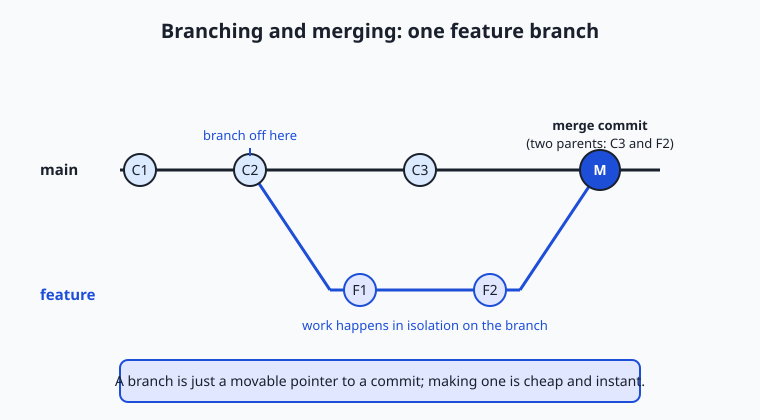

## Why this matters

Yesterday you learned to save a project's history one commit at a time, marching forward in a single line. That works until the moment real work begins — because real work is never a single line. You want to try a risky idea without breaking the version that works. A teammate wants to fix a bug while you add a feature. You want three variants of the same experiment side by side so you can compare them and keep the best. A straight line of commits cannot hold parallel efforts; you need a way to split off, work in isolation, and rejoin. That way is branching and merging, and it is the feature that turns Git from a backup tool into a collaboration engine.

The stakes are concrete. Without branches, "try something risky" means editing the one copy everyone depends on, so a half-finished idea can break the working version for you and everyone else. With branches, a risky idea lives on its own line until it is ready — and if it fails, you delete the branch and the mistake vanishes without a trace. When you build things that involve lots of experimentation — many variants of a feature, many versions of a prompt, many candidate models — this ability to run experiments in parallel and merge only the winner is not a convenience; it is the whole workflow. Learn it now on a toy recipe file, and it will be muscle memory when the stakes are a production system.

Today you will learn what a branch actually is (far simpler and cheaper than most people assume), how to create and switch between branches, how to merge them back together, what happens when two branches disagree — a *merge conflict* — and how to resolve one calmly instead of panicking. You will also meet `rebase`, a second way to combine work, and learn the one rule that keeps it from causing chaos.

## The idea in plain language

A **branch** is a separate line of development: a set of commits that grew from some point in your history but does not affect the main line until you decide to combine them. Picture your commit history as a growing tree. Most of the time everyone builds along one trunk. A branch is when you step off the trunk, make a few commits of your own on a private limb, and later either graft that limb back onto the trunk or cut it off.

Here is the part that surprises people: in Git a branch is not a copy of your files. It is just a **movable pointer to a commit** — a tiny label, a few dozen bytes on disk, naming "the latest commit on this line of work." Creating a branch does not duplicate anything; it writes one small file. That is why Git branches are instant and weightless, and why experienced users make them constantly, for anything from a one-line typo fix to a month-long feature.

**Merging** is the reverse move: taking the commits from one branch and combining them into another, so the target branch now contains both lines of work. Most merges are effortless — Git figures out how to weave the changes together automatically. Occasionally two branches changed the *same lines* in *different ways*, and Git cannot know which you meant. That is a **merge conflict**: Git stops, marks the disputed spot, and asks you to decide. Resolving it is a small, mechanical task once you have seen it once, which is exactly what today's lab gives you.

## Historical background

Version control existed for decades before branching became cheap. Early systems tracked one file at a time: RCS (the Revision Control System, released by Walter Tichy in 1982) versioned individual files. CVS (the Concurrent Versions System, 1990) extended this to whole projects and let several people work at once. Subversion arrived in 2000 as a cleaner successor. In all of these, branching was *possible* but expensive and awkward — a branch was often a heavyweight copy on a central server, and merging branches back was notoriously painful, so teams avoided it. Branching had a bad reputation because the tools made it hurt.

Git changed that, and it was born from a crisis. From 2002 the Linux kernel project — thousands of developers, an enormous codebase — used a commercial distributed system called BitKeeper under a free-of-charge license. In April 2005 that arrangement collapsed after the license was withdrawn, leaving the kernel with no tool that met its needs. Linus Torvalds, the creator of Linux, wrote a replacement in a matter of weeks; the first version of Git appeared in April 2005, and Junio Hamano took over as maintainer soon after and has led it ever since. Torvalds designed Git around the assumption that branching and merging should be so cheap and reliable that developers do them constantly — the opposite of the tools before it.

The technical key was the design you met yesterday: each commit records a snapshot plus a pointer to its parent commit, so history is a chain (more precisely, a directed graph). Given that structure, a branch need only be a pointer to one commit, and merging two branches becomes a matter of finding their common ancestor and combining the changes each made since. Git is a **distributed** system — every clone holds the full history — but the branching model at its heart is what made teams fall in love with it, and it is now the near-universal foundation of modern software collaboration.

## What it is — and what it is not

A branch is a named, movable pointer to a commit, and "the current branch" is simply the pointer that moves forward when you make a new commit. Git tracks which branch you are on with a special reference called **HEAD** — think of HEAD as "you are here." When you commit, the current branch's pointer advances to the new commit, and HEAD comes along with it. Switching branches means pointing HEAD at a different branch and updating your working files to match that branch's latest commit.

It helps to be clear about what branching is *not*. It is not copying your project folder — a mistake beginners make is to duplicate a directory ("project-v2") to try something; Git branches replace that habit entirely and track the relationship between versions, which a folder copy cannot. A branch is not a fork of the whole repository, and it is not permanent: most branches are short-lived, created for one task and deleted after merging. Merging is not "overwriting" one branch with another; it *combines* them, preserving the history of both. And a merge conflict is not an error or a bug — it is Git correctly refusing to guess when two changes genuinely disagree, handing the decision to the one entity qualified to make it: you.

| Common misconception | The reality |
| --- | --- |
| "Creating a branch copies all my files." | A branch is a tiny pointer to a commit; nothing is duplicated, so it is instant. |
| "A merge conflict means I broke something." | It means two branches changed the same lines differently; Git is asking you to choose, not reporting a bug. |
| "Merging overwrites one branch with the other." | Merging combines both lines of work and keeps the history of each. |
| "You should avoid branches to keep things simple." | Cheap branching is the point of Git; isolating work on branches is simpler and safer than editing one shared line. |
| "Rebase and merge are interchangeable." | Both combine work, but merge preserves the branch shape while rebase rewrites history into a straight line — with different trade-offs. |

## Why it was created and what problems it solves

Branching solves one core problem: **parallel work that must not interfere until it is ready.** Software is built by many people (and by one person wearing many hats) doing different things at once — adding a feature, fixing an urgent bug, cleaning up old code, running an experiment. If all of that happened on one line, every unfinished change would be tangled with every other, and the project would rarely be in a working state. Branches give each effort a quarantined lane. The bug fix can go out today from its own branch even though the big feature on another branch is weeks from done.

Isolation is the deeper gift. On a branch you can commit freely — messy, half-working, exploratory commits — without endangering the version everyone else relies on, because none of it touches the main line until you merge. This makes experimentation cheap and safe: try an approach, and if it does not pan out, abandon the branch and lose nothing but the branch. Merging then solves the complementary problem of *reunification*: once an effort is ready, its commits must fold back into the shared line cleanly, keeping a record of what came from where. Together, branch and merge let a team diverge to work and converge to ship, over and over, without chaos — which is why essentially every software project on earth now works this way.

## How it works

Start with the mental model, then the commands. Every commit points to its parent, so your history is a graph of commits. A branch is a pointer to one commit in that graph; the special pointer **HEAD** marks which branch you are currently on. Making a commit creates a new commit whose parent is the current one, then slides the current branch's pointer (and HEAD) forward to it. Nothing else moves. Switching branches just re-aims HEAD and refreshes your working files.



Read the diagram left to right. The dark line is `main`, growing commit by commit (C1, C2, C3). At C2 someone created a branch called `feature` and made two commits on it (F1, F2) without disturbing `main`. Finally the branch is merged back, producing the merge commit M — a special commit with *two* parents (C3 and F2) that ties the two lines together. That two-parent commit is the visible signature of a merge.

### Creating and switching branches

Two commands create branches, and they differ in one useful way. `git branch NAME` creates a branch but leaves you where you are; `git switch -c NAME` (read "switch, creating") makes the branch *and* moves you onto it in one step, which is what you usually want. To move between existing branches, use `git switch NAME`. You will also see the older `git checkout` spelling: `git checkout -b NAME` to create-and-switch, `git checkout NAME` to switch. Both work, but `git switch` (added in Git 2.23, in 2019) exists precisely because `checkout` did too many unrelated jobs and confused people; prefer `switch` for new habits.

| Task | Modern command | Classic equivalent |
| --- | --- | --- |
| List branches (current one marked) | `git branch` | `git branch` |
| Create a branch, stay put | `git branch feature-x` | `git branch feature-x` |
| Create a branch and move onto it | `git switch -c feature-x` | `git checkout -b feature-x` |
| Move onto an existing branch | `git switch feature-x` | `git checkout feature-x` |
| Merge another branch into this one | `git merge feature-x` | `git merge feature-x` |
| Delete a merged branch | `git branch -d feature-x` | `git branch -d feature-x` |

### Merging: fast-forward versus three-way

When you merge, Git first looks for the **merge base** — the most recent commit both branches share, their common ancestor. What happens next depends on whether the target branch moved since the split.

If the target branch has *not* advanced since you branched off it, there is nothing to combine: the branch you are merging simply continues past where the target sits. Git performs a **fast-forward** — it slides the target's pointer forward to the branch's latest commit. No merge commit is created because none is needed; the history stays a straight line. This is the common case for a short feature branch when no one touched `main` meanwhile.

If *both* branches advanced after the split — the target got new commits and so did your branch — Git cannot just slide a pointer. It performs a **three-way merge**: it takes the merge base plus the two branch tips (three commits, hence the name), works out what each side changed relative to the base, and combines those changes into a new merge commit with two parents. Most of the time this is automatic and silent. The two-parent merge commit M in the diagram above is exactly this case.

### Merge conflicts: why they happen and how to resolve them

A three-way merge only needs your help when the two sides changed the **same lines** in **different ways**. Git can combine edits to different parts of a file with no trouble, but if `main` changed line 3 to one thing and `feature` changed line 3 to another, Git will not silently pick a winner. It pauses the merge, leaves the file in a special conflicted state, and rewrites the disputed region with **conflict markers** so you can see both versions:

```text
<<<<<<< HEAD
milk: 1 cup buttermilk
=======
milk: 2 cups
>>>>>>> feature
```

Read it as three parts. Everything between `<<<<<<< HEAD` and `=======` is the version on your current branch (called "ours" — here `main`'s buttermilk). Everything between `=======` and `>>>>>>> feature` is the version coming from the branch you are merging ("theirs" — the feature's two cups). To resolve the conflict you **edit the file** so it reads exactly how you want — keep one side, keep the other, or blend them — and then **delete all three marker lines**. The conflict is resolved only when no `<<<<<<<`, `=======`, or `>>>>>>>` lines remain. Then you stage the fixed file with `git add` (which tells Git "this one is handled") and run `git commit` to complete the merge. That final commit *is* the merge commit.



The flowchart traces the whole path: two branches edit the same line, `git merge` reports a conflict and writes the markers, you edit the file down to the version you want with the markers removed, and `git add` plus `git commit` seals the resolution into a merge commit. If you ever want to back out entirely mid-conflict, `git merge --abort` returns everything to the state before you started the merge — a safety net worth remembering.

### Rebasing, and the one rule you must not break

There is a second way to combine work: **rebase**. Where a merge ties two lines together with a merge commit, a rebase *replays* your branch's commits on top of another branch, one at a time, as if you had started your work from the other branch's latest commit all along. The result is a straight, linear history with no merge commit — it looks like you did your work after everyone else's, in a tidy sequence. Rebasing does not preserve the original commits; it creates new ones with the same changes but different identities, effectively rewriting that slice of history.

That rewriting is the source of both rebase's appeal and its danger. A clean linear history is easier to read, which is why many teams rebase a feature branch onto the latest `main` before merging. But rewriting history is safe *only* for commits that live solely on your own machine. **The golden rule of rebasing: never rebase commits you have already shared with others.** If you rebase commits that teammates have already based their own work on, you replace the commits they were building against with new ones, and their repositories and yours disagree about what history is — a genuinely confusing mess to untangle. Rebase your private, un-shared work to tidy it; merge (never rebase) anything public. You will meet remotes and sharing tomorrow; hold onto this rule until then.

| Aspect | Merge | Rebase |
| --- | --- | --- |
| What it does | Combines branches with a new merge commit | Replays your commits on top of another branch |
| History shape | Preserves the branch structure (a diamond) | Rewrites into a straight, linear line |
| Merge commit created? | Yes (for a three-way merge) | No |
| Original commits kept? | Yes | No — new commits replace them |
| Safe on shared history? | Yes, always | No — never rebase commits others have |
| Best for | Combining finished work; anything public | Tidying your own private branch before merging |

### Branch hygiene

Because branches are cheap, the discipline is not in creating them but in keeping the set tidy. A few habits: give branches short, descriptive names (`fix-login-bug`, not `stuff`); keep a branch focused on one task so it merges cleanly and reviews easily; keep it short-lived — the longer a branch lives, the more `main` drifts away from it and the harder the eventual merge; and **delete a branch once it is merged** (`git branch -d NAME`) so your branch list reflects only live work. A repository with fifty stale branches is as confusing as a desk buried in old drafts.

## An everyday analogy

Think of a shared manuscript for a cookbook that several authors are editing together. The master copy — the agreed-upon current text — is `main`. Rather than scribble directly on the master (where a half-formed idea would confuse everyone), each author takes a **photocopy** of the current chapter and works on that. Taking the photocopy is making a branch: it is quick, it costs almost nothing, and your edits on it are invisible to everyone else until you hand them in.

You revise your photocopy freely — that is committing on your branch. When your changes are ready, you give them back to the editor to fold into the master: that is **merging**. Often it is trivial: you rewrote the dessert section, nobody else touched it, so the editor simply drops your pages in — a **fast-forward**, no fuss. Sometimes, though, while you were editing your photocopy, another author changed the very same sentence on their own copy, and both were handed in. Now the editor holds two different versions of one line and cannot know which the book should use. That is a **merge conflict**. The editor marks the disputed sentence with both versions side by side and asks a human to decide — keep yours, keep theirs, or write a new sentence combining both — and then erases the markers. That decision, and erasing the markers, is exactly what resolving a conflict means.

And **rebasing**? That is recopying your edits neatly onto a fresh printout of the latest master, so the final record reads as one clean sequence of revisions rather than showing the messy parallel work. Tidy — but you would never do it to pages other authors have already started building on, because then their copies would reference sentences that no longer exist. The manuscript holds the whole model: cheap photocopies, independent edits, reunification, the occasional human decision, and the tidy-up you only do to your own drafts.

## Examples in practice

Here is the full loop in commands, the same one you will run in today's lab. Begin on `main` with a file, create a branch, and make a change on it:

```text
git switch -c feature-blueberries      # create the branch and move onto it
# ...edit recipe.txt: change "milk: 1 cup" to "milk: 2 cups"...
git commit -am "feature: use 2 cups of milk"
```

Now return to `main` and change the *same line* differently, so the branches will disagree:

```text
git switch main
# ...edit recipe.txt: change "milk: 1 cup" to "milk: 1 cup buttermilk"...
git commit -am "main: switch to buttermilk"
```

Merge the feature branch into `main`, and Git reports a conflict because both touched line 3:

```text
git merge feature-blueberries
# Auto-merging recipe.txt
# CONFLICT (content): Merge conflict in recipe.txt
# Automatic merge failed; fix conflicts and then commit the result.
```

Open `recipe.txt`, and Git has written the markers shown earlier. You decide to keep both ideas — buttermilk *and* more of it — so you edit line 3 to read `milk: 2 cups buttermilk`, delete the three marker lines, and finish the merge:

```text
git add recipe.txt      # mark the conflict resolved
git commit              # create the merge commit
```

Finally, inspect the shape of what you built:

```text
git log --graph --oneline
# *   7c522b2 Merge branch 'feature-blueberries'
# |\
# | * 84e0a3a feature: use 2 cups of milk
# * | fe77868 main: switch to buttermilk
# |/
# * 493ba6c Add base pancake recipe
```

The diamond is the whole story at a glance: a common starting commit at the bottom, two lines that diverged in the middle, and a merge commit at the top rejoining them. For contrast, when you branch off, add a brand-new file that touches nothing on `main`, and merge back while `main` has not moved, Git prints `Fast-forward` and the history stays a single straight line — no diamond, no merge commit. Seeing both cases side by side is the fastest way to internalize the difference.

## Implications: security, privacy, performance, scalability, and cost

**Security.** Branching is itself a safety mechanism: untrusted or experimental changes can be quarantined on a branch and reviewed before they ever reach the main line, which is the backbone of how teams gate what gets shipped. But a branch is not a secret — anyone with the repository has all branches and their full history — so a branch you delete locally may still exist in copies elsewhere, and a secret accidentally committed on any branch is not erased by switching away from it. Treat every commit on every branch as part of the record.

**Privacy.** Every commit records an author name and email (the identity you configured in Git) and a timestamp, on branches as much as on `main`. In today's lab you set a throwaway local identity precisely so the exercise does not stamp your real details onto practice commits. When you begin sharing repositories, remember that branch names and commit messages are visible to everyone with access, so avoid embedding sensitive information in them.

**Performance.** This is where Git's design shines. Because a branch is just a pointer, creating, switching, and deleting branches are effectively instant regardless of project size — operations that were slow and dreaded in older systems. Merging is fast too; the only slow part is the human work of resolving conflicts, which is why keeping branches small and short-lived (so they diverge less) is the real performance lever.

**Scalability.** The branching model is what lets thousands of contributors work on one codebase without constant collisions: each works on their own branches, and merges reconcile the results. It scales down just as well — a solo learner branching for each experiment gets the same isolation. The one thing that does not scale is a long-lived branch that drifts far from `main`; the further it drifts, the more painful the eventual merge, so scale favors frequent, small merges over rare, giant ones.

**Cost.** Branches cost almost nothing to create and store — a few bytes each — so the direct cost is negligible. The real cost is *coordination*: time spent resolving conflicts and reconciling divergent work. That cost rises with how long branches live and how much they overlap, which is why the cheapest workflow is many small, focused, quickly-merged branches rather than a few sprawling ones.

## Alternatives: free, open source, and commercial

Branching and merging are features of your version control system, and the practical "alternatives" are the different ways to *perform and visualize* them. The commands are the same everywhere; what varies is whether you drive them from the terminal or through a graphical view.

| Tool | Type | What it offers for branching | Cost |
| --- | --- | --- | --- |
| `git` command line | Free, open source | The full, authoritative interface; every branch/merge/rebase operation | Free |
| `git log --graph --oneline` | Free, built in | A text diagram of your branch and merge history, no extra install | Free |
| VS Code (with built-in Git) | Free | Visual branch switching, staging, and a clear conflict-resolution editor with "Accept Current/Incoming/Both" buttons | Free |
| GitKraken | Commercial (free tier) | A polished visual graph of branches and merges; drag-to-merge; conflict tools | Free for public repos and personal use; paid for private/team features |
| Sourcetree | Free (proprietary) | A free graphical Git client with a visual branch graph and merge helpers | Free |

Two recommendations. First, learn the command line even if you later use a graphical tool — every visual client is a front end for the same Git commands, and understanding them means you are never stuck when the buttons do something surprising. Second, a visual conflict editor genuinely helps when you are new: VS Code's built-in resolver shows the two versions with one-click choices and highlights every remaining marker, which makes the mechanical part of resolving conflicts far less error-prone while you build intuition. `git log --graph` costs nothing and is the fastest way to *see* what a merge did — reach for it whenever the history feels tangled.

## Comparison with related concepts

| Concept A | Concept B | Key difference |
| --- | --- | --- |
| Branch | Commit | A commit is one saved snapshot; a branch is a movable pointer naming the latest commit on a line of work |
| Merge | Rebase | Merge combines branches with a two-parent merge commit; rebase replays commits into a straight line, rewriting them |
| Fast-forward merge | Three-way merge | Fast-forward just slides a pointer when the target has not moved; a three-way merge builds a merge commit when both branches advanced |
| Merge conflict | Merge (clean) | A clean merge combines non-overlapping changes automatically; a conflict is when the same lines changed differently and Git asks you to choose |
| Branch | HEAD | A branch points to a commit; HEAD points to the branch you are currently on — "you are here" |
| `git switch` | `git checkout` | `switch` moves between branches only; `checkout` is the older command that also does unrelated jobs, hence the split |

## When to use it — and when not to

Reach for a branch almost any time you start a distinct piece of work: a feature, a bug fix, an experiment, a spike you might throw away. The rule of thumb from professionals is "branch for anything you would be sad to lose or unhappy to ship half-done." Because branches are free, the bias should be toward creating one rather than editing `main` directly — a fresh branch per task keeps `main` always shippable and your experiments always reversible. Use `git log --graph` whenever you need to understand how lines of work relate, and use a merge to combine finished work back into the main line.

Know the limits too. Do not let branches live so long that they drift far from `main`; long-lived branches accumulate painful conflicts and are a classic source of merge misery — merge or rebase frequently to stay close. Do not rebase anything you have shared with others (the golden rule). And do not over-branch trivially: for a tiny solo tweak you intend to commit immediately, a branch can be ceremony you do not need, though even then it rarely hurts. The professional habit is simple — isolate real work on branches, keep them small and short-lived, merge often, and delete them when done.

The connection to building things that involve heavy experimentation is direct and worth making explicit. When you iterate on a system — trying variant after variant of a feature, tuning many versions of a prompt, comparing several candidate models — each attempt is a natural branch: isolated, committed freely, comparable side by side, and either merged in when it wins or deleted when it loses. Isolating a risky change on its own branch means you can push an idea hard without endangering the version that works, and merging the winning approach folds only the successful experiment back into the main line. That loop — branch to explore, merge the winner, delete the rest — is exactly how disciplined iteration works, and everything you practice today on a recipe file is the same motion you will use to iterate on real systems.

## Knowledge check

Try these from memory before looking back:

1. In one sentence, what *is* a branch in Git, and why does creating one cost almost nothing?
2. Explain the difference between a fast-forward merge and a three-way merge, and what in the history tells you which one happened.
3. You run `git merge feature` and see `CONFLICT (content)`. Describe, in order, exactly what you do next to finish the merge.
4. In a conflict marked with `<<<<<<< HEAD`, `=======`, and `>>>>>>> feature`, which version is "yours" and which is "theirs", and what must be true of those marker lines before you commit?
5. State the golden rule of rebasing and explain in one sentence why breaking it causes problems for teammates.

## Hands-on exercise

Time to make a real conflict and resolve it. In the Day 31 lab you will build a throwaway Git repository in a temporary directory, create a feature branch, force two branches to disagree about the same line, merge them into a genuine conflict, resolve it, and view the result as a graph — then watch a clean fast-forward merge for contrast. Everything is local: no network, no GitHub, nothing written outside a temp folder that is deleted when the script finishes.

From the lab directory, first watch the whole story run end to end, then open the starter and complete its five exercises:

```bash
bash examples/branch_merge.sh
bash starter/branch_merge.sh
```

The starter builds the repository and makes the base commit for you; your five exercises are the branching moves themselves — create and switch to a branch (`git switch -c feature-blueberries`), switch back to `main` (`git switch main`), merge the branch (`git merge --no-edit feature-blueberries`), write the resolved file so no conflict markers remain, and finish with `git add recipe.txt` then `git commit --no-edit`. Each exercise comment names the exact command to type.

### Expected output

The moment that matters is the conflict Git reports, and the diamond the merge leaves in the history. A real run prints (commit hashes will differ on your machine):

```text
--- Step 4: merge feature-blueberries into main (expect a conflict) ---
Auto-merging recipe.txt
CONFLICT (content): Merge conflict in recipe.txt
Automatic merge failed; fix conflicts and then commit the result.

Git rewrote recipe.txt with conflict markers:
# Pancakes
flour: 1 cup
<<<<<<< HEAD
milk: 1 cup buttermilk
=======
milk: 2 cups
>>>>>>> feature-blueberries
eggs: 1

--- Step 6: history graph (the merge commit ties both lines together) ---
*   7c522b2 Merge branch 'feature-blueberries'
|\
| * 84e0a3a feature: use 2 cups of milk
* | fe77868 main: switch to buttermilk
|/
* 493ba6c Add base pancake recipe
```

### Validate your work

You are done when you can check every box:

- [ ] You created a branch and confirmed you were on it (`git branch` marks the current branch with `*`).
- [ ] Your merge produced a real conflict (`CONFLICT (content): Merge conflict in recipe.txt`).
- [ ] You can point to the three marker lines and say which side is "ours" (HEAD/`main`) and which is "theirs" (the feature branch).
- [ ] Your resolved file contains no `<<<<<<<`, `=======`, or `>>>>>>>` lines.
- [ ] After committing, `git status` reports a clean working tree.
- [ ] `git log --graph --oneline` shows a merge commit with the `|\` diamond joining the two lines.

### Troubleshooting

- **`git: 'switch' is not a git command`.** Your Git predates version 2.23. Use the classic spellings: `git checkout -b NAME` to create-and-switch, `git checkout NAME` to switch.
- **The merge succeeded with no conflict.** The two branches did not change the *same* line. Make sure both edits target line 3 of `recipe.txt`.
- **`You have not concluded your merge`.** A merge is still in progress. Finish it (`git add` the file, then `git commit`) or cancel it with `git merge --abort`.
- **You want to start the conflict over.** Run `git merge --abort` to return the working tree to exactly how it was before the merge — nothing is lost.

### Common mistakes

- **Panicking at the word CONFLICT.** A conflict is not an error or damage; it is Git asking a question. The repository is safe, and `git merge --abort` undoes the whole thing if you want a fresh start.
- **Committing with markers still in the file.** If any `<<<<<<<`, `=======`, or `>>>>>>>` line remains, the conflict is not resolved — those lines will end up committed as literal text. Search the file (`grep -n '<<<<<<<' recipe.txt`) before you commit.
- **Editing the wrong lines.** Resolve *only* the region between the markers, then remove the markers; leaving the surrounding text alone keeps the rest of the file intact.
- **Forgetting to `git add` after resolving.** Editing the file is not enough — you must stage it with `git add` so Git knows the conflict is handled, then `git commit` to complete the merge.

## Practice assignment

Open `starter/branching-worksheet.md` in the lab and fill it in completely from your own run: record the branch names you created and the command you used, state whether your merge was a fast-forward or a three-way merge and how you can tell, and paste the exact conflict block Git wrote (the three marker lines and the two competing versions), noting which side came from which branch and which resolution you chose. Then, in a fresh temporary directory of your own, repeat the whole loop by hand — `git init`, a base commit, a branch, a competing edit, a conflicting merge, a resolution, and `git commit` — typing every command yourself rather than running the script, so the moves become memory. Keep the worksheet; Week 5's project (a versioned notes repository with a merged branch and a resolved conflict) builds directly on it.

## Extension challenge

Go one step further and explore the two ideas the lab only touched. First, **abort a merge**: reproduce the conflict, but instead of resolving it, run `git merge --abort` and confirm with `git status` and `git log --graph` that the repository returned exactly to its pre-merge state — proof that a conflict is always reversible until you commit it. Second, **try a rebase on private work**: on a fresh feature branch make two commits, then run `git rebase main` and compare `git log --graph --oneline` before and after — notice that the history is now a straight line with no merge commit, and that the rebased commits have different hashes than the originals because rebase rewrote them. Finally, write three or four sentences explaining, in your own words, when you would choose a merge over a rebase, and restate the golden rule of rebasing and why it exists. You have now used both ways to combine work — and understand why one of them must never touch shared history.
