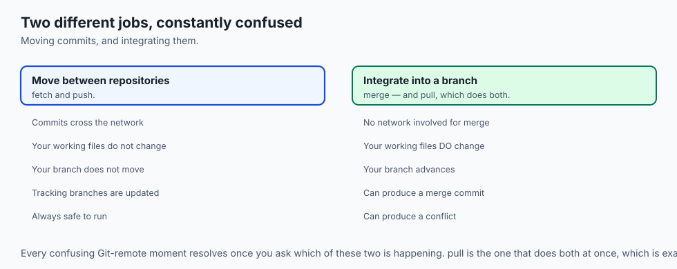
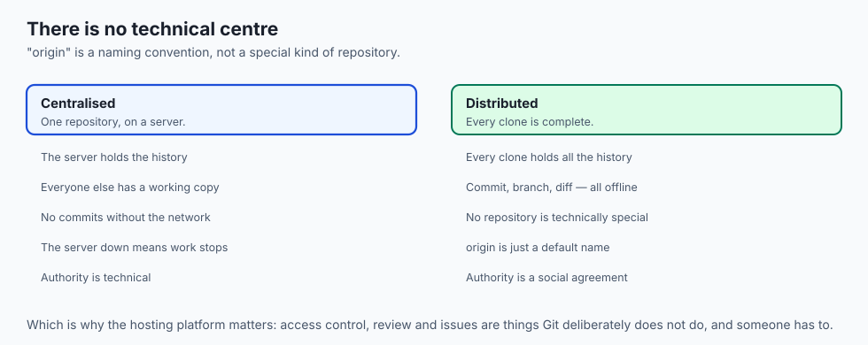
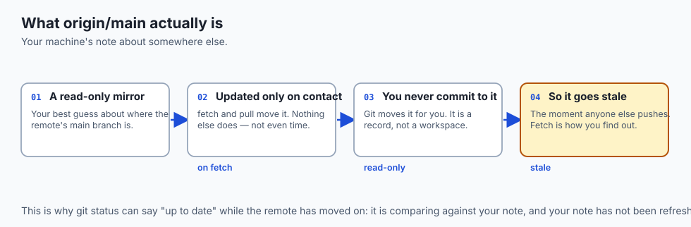
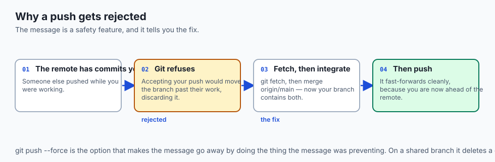
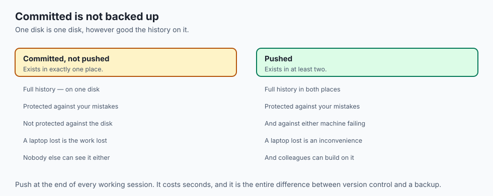
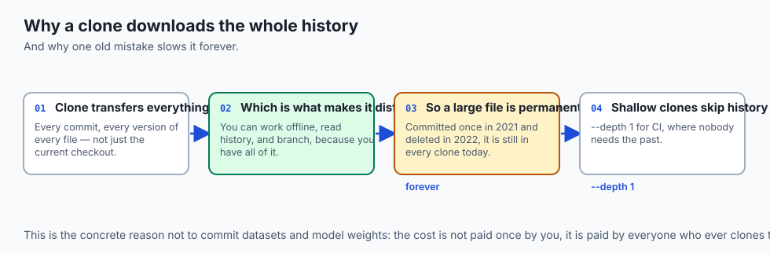
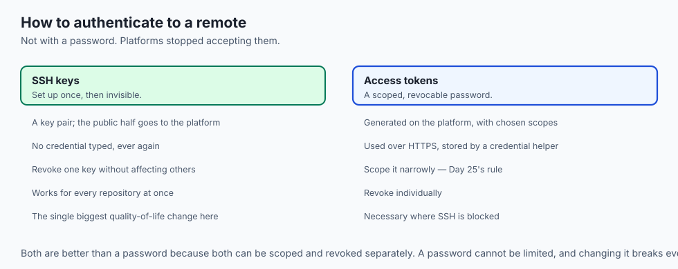
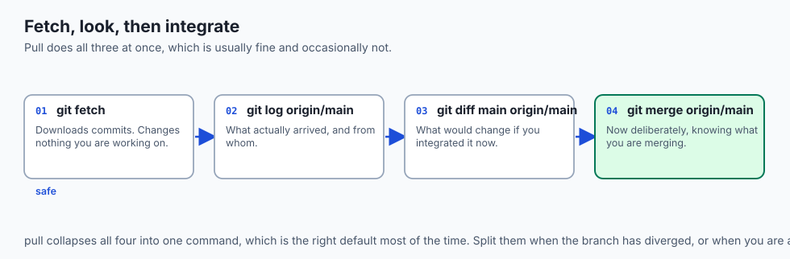
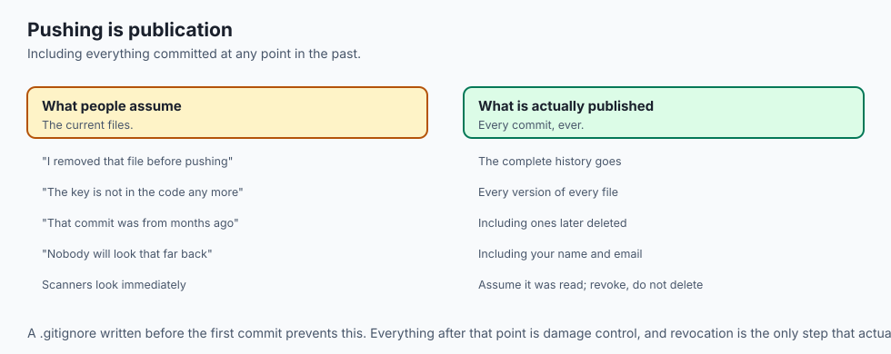

## Why this matters

- **A repository on one disk is one failure from gone.** A remote is the second place
  it lives.
- **Every model, dataset and framework you use** was obtained by cloning from a remote.
- **Collaboration begins here.** Everything before today worked alone.
- **`git push` being rejected is a safety feature**, and understanding why turns a
  frustrating message into an obvious one.
- **A public repository is your portfolio**, and it is how shared work — including
  trained models — reaches anyone.

---

## The idea in plain language



- **A remote is another copy of the repository**, somewhere you can reach.
- **It is a name paired with a URL**, stored in your repository's configuration.
  `origin` is the conventional name for the one you cloned from.
- **Fetch and push move commits between repositories.** Pull and merge integrate them
  into a working branch.
- **Every confusing remote moment resolves** once you know which of those two things
  is happening.
- **Nothing is automatic.** Git never contacts a remote unless you tell it to.

---

## Historical background



- **Centralised systems had one repository**, on a server, and everyone else had a
  working copy. You could not commit offline.
- **Git inverted that.** Every clone is a full repository, so there is no technical
  centre at all.
- **The "central" repository is a social convention**, not a technical one. `origin` is
  a default name, not a special kind of thing.
- **Hosting platforms added what Git deliberately lacks**: access control, an issue
  tracker, code review, and automation.
- **The pull-request workflow was invented on those platforms**, not in Git, and it is
  what made open-source contribution from strangers practical.
- **The vocabulary stuck.** "Origin", "upstream" and "fork" all come from that era and
  none of them are Git concepts.

---

## What it is — and what it is not

**A remote is:**

- A named URL pointing at another copy of the repository.
- A destination for pushes and a source for fetches.
- Entirely optional. Git works completely without one.

**It is not:**

- **Not the "real" repository.** Yours is just as complete, and there is no technical
  hierarchy.
- **Not a backup by itself**, unless you actually push. An unpushed commit exists on
  one disk.
- **Not automatically synchronised.** Nothing crosses the network until you ask.
- **Not the same as the hosting platform.** Issues, reviews and permissions are the
  platform's; the remote is just a repository.

---

## Why it was created and what problems it solves

- **Backup and durability.** A repository on one disk is one spilled coffee from gone.
  Pushing means the full history lives in at least two places.
- **Collaboration.** Before distributed version control, teams shared a server and
  effectively took turns; if it was down, or you were offline, you were stuck.
- **Working apart.** Everyone holds a complete repository and synchronises when
  convenient, so two people can work from different continents on different schedules
  and reconcile afterwards.
- **Publication.** A remote on a public platform is an address others can clone from.
- **Distribution.** This is how open source spreads, how a portfolio is seen, and how
  shared models and datasets reach the people who need them.

---

## How it works

### The two halves




- **Git stores a small list of remotes** in its configuration — each a name paired with
  a URL. Cloning writes the `origin` entry automatically.
- **Your local `main` is the branch you edit and commit to.**
- **`origin/main` is a remote-tracking branch**: your machine's best guess about where
  the remote's `main` is.
- **It is a read-only mirror**, updated only when you communicate with the remote. You
  never commit to it; Git moves it during fetch and pull.
- **A local branch paired with a remote branch has an *upstream***, and once set,
  plain `git push` and `git pull` know where to go.

### The four operations


- **Clone** copies the entire history to a new local repository and sets up `origin`
  and tracking branches in one step. Once per machine.
- **Fetch** downloads commits you do not have and advances `origin/main`. Your own
  `main` does not move and no working file changes — it is the safe "show me what is
  new" command.
- **Pull** is exactly a fetch followed by a merge of `origin/main` into your current
  branch. Which means it can produce a merge, and occasionally a conflict, like any
  other merge.
- **Push** sends your commits up and advances the remote's branch to match. Git
  refuses if the remote has commits you do not — that rejection is a safety feature,
  telling you to fetch and integrate first so you never silently overwrite someone
  else's work.

- **The key model: fetch and push move commits *between* repositories; pull and merge
  integrate them *into* a working branch.**

### The commands

| Command | What it does | Direction |
| --- | --- | --- |
| `git remote -v` | Lists remotes and their URLs | local inspection |
| `git remote add <name> <url>` | Registers a new remote | local config |
| `git clone <url>` | Copies a remote, sets up `origin` | remote → new local repo |
| `git fetch <remote>` | Downloads commits; updates tracking branches | remote → local, no merge |
| `git pull` | Fetches, then merges upstream into your branch | remote → your branch |
| `git push` | Uploads your commits | your branch → remote |
| `git push -u origin main` | Pushes and sets the upstream | your branch → remote |
| `git branch -vv` | Each branch, its upstream, and how far ahead or behind | local inspection |

---

## An everyday analogy

Two people keeping the same notebook.

| The notebooks | Git remotes |
| --- | --- |
| Your own complete notebook | Your local repository |
| The shared copy in the office | `origin` |
| Your note of what the office copy said | `origin/main` |
| Going to read the office copy | Fetch |
| Copying its new pages into yours | Merge |
| Doing both in one trip | Pull |
| Writing your new pages into it | Push |

- **Your note of what the office copy said** goes stale the moment someone else writes
  in it. That is why fetch exists.
- **You cannot write your pages in** if someone added pages you have not read — you
  would overwrite them. That refusal is the point.
- **Both notebooks are complete.** Neither is the original.

---

## Examples in practice



- **`Updates were rejected because the remote contains work that you do not have`** —
  fetch, integrate, then push. This is the message the safety feature produces.
- **`git fetch` showing new commits** while `git status` says you are up to date,
  because fetch updated the tracking branch and not your branch.
- **A pull that produces a merge commit** you did not expect, because the branch had
  diverged.
- **A push that succeeded to the wrong remote**, because a fork and an upstream were
  both configured.
- **A clone that took ten minutes** because someone committed a dataset years ago and
  every clone still carries it.

---

## Implications: security, privacy, performance, scalability, and cost



- **Security: pushing publishes.** Everything in the history goes, including anything
  committed by mistake at any point in the past.
- **A secret pushed to a public repository is found in minutes** by automated scanners.
  Revoke it; do not merely remove it.
- **Use SSH keys or a token, never a password.** Platform tokens can be scoped and
  revoked individually.
- **Privacy: your commits carry your name and email**, and they become public with the
  repository. Configure them deliberately.
- **Performance: clone cost is the whole history**, not the current files, which is why
  one large binary committed once slows every clone forever.
- **`git fetch` is cheap; `git clone` is not.** Shallow clones exist for CI, where the
  history is not needed.
- **Cost: an unpushed commit is not backed up.** The habit of pushing at the end of a
  session is the whole of the insurance.

---

## Alternatives: free, open source, and commercial



| Option | Type | Where it fits |
| --- | --- | --- |
| A hosting platform | Free tiers, commercial | Collaboration, review, issues, automation |
| A self-hosted server | Free, open source | Full control; you also run the backups |
| A bare repository on any server | Free | A remote needs nothing but SSH access and a directory |
| A second local clone | Free | A genuine remote, useful for practice and for a spare disk |
| Git LFS | Free, open source | Large binaries kept out of the main history |
| SSH keys / platform tokens | Free | How you authenticate; prefer either to a password |

- **A remote does not require a platform.** Any machine you can reach over SSH can hold
  one, which is worth knowing when a platform is not an option.
- **Set up SSH keys once** and stop typing credentials. It is the single largest
  quality-of-life improvement in this lesson.

---

## Comparison with related concepts



| Term | What it actually is |
| --- | --- |
| **Remote** | A named URL for another copy of the repository |
| **`origin`** | The conventional name for the one you cloned from |
| **Remote-tracking branch** | Your read-only mirror of a remote branch |
| **Upstream** | The remote branch your local branch is paired with |
| **Fetch** | Download commits; change nothing you are working on |
| **Pull** | Fetch, then merge |
| **Fork** | A platform feature: your own server-side copy |

---

## When to use it — and when not to



- **Push at the end of every working session.** An unpushed commit is not backed up.
- **Prefer `fetch` then look, over `pull`**, when you want to know what changed before
  integrating it.
- **Use `git push -u` the first time** so later pushes need no arguments.
- **Read a push rejection rather than forcing past it.** It is telling you someone
  else's work is at risk.
- **Do not force-push a shared branch.** That is Day 31's rebase rule, arriving with
  consequences.
- **Do not commit large files** into a repository that others will clone.
- **Do not assume pushed means reviewed.** Pushing is publication, not approval.

---

## The AI connection



- **Cloning a model repository** is how you get weights, configs and tokenizer files —
  and why some of them take a very long time.
- **Model hubs are Git remotes with large-file support**, which is why the workflow
  feels familiar and the download does not.
- **Push your experiment code before a long training run**, so the state that produced
  the result exists somewhere other than the machine running it.
- **A public repository is how your work is found.** For AI work specifically, a
  readable repository is worth more than a described one.
- **Never push a `.env` or a checkpoint directory.** Both are common, both are
  expensive, and both are prevented by a `.gitignore` written on Day 30.

---

## Knowledge check

```yaml
quiz:
  question: "You run `git fetch` and it reports new commits, but `git status` still says your branch is up to date with nothing to merge. What happened?"
  options:
    - "Fetch updated the remote-tracking branch only; your local branch has not moved and needs a merge"
    - "The fetched commits belong to a different branch and are not relevant to yours"
    - "Fetch downloaded the commits but they were rejected because your branch has diverged"
    - "git status compares against the last commit, not against the remote"
  answer_index: 0
  explanation: "Fetch moves origin/main and touches nothing else — that is exactly what makes it safe. Your own branch is unchanged until you merge, which is what pull would have done in the same step."
```

---

## Hands-on exercise

Create a remote, push to it, and provoke a rejection. Worked through fully in the
Day 32 lab directory.

| What you are doing | Command |
| --- | --- |
| Make a bare repository to act as a remote | `git init --bare ../remote.git` |
| Register it | `git remote add origin ../remote.git` |
| Inspect the remotes | `git remote -v` |
| Push and set upstream | `git push -u origin main` |
| See branch tracking state | `git branch -vv` |
| Clone it elsewhere and commit | `git clone ../remote.git other && cd other` |
| Provoke a rejection | Commit in both clones, push from both |
| Recover | `git fetch` then `git merge origin/main`, then push |

### Expected output

```text
origin  ../remote.git (fetch)
origin  ../remote.git (push)
* main 712412c [origin/main] Add request handler
 ! [rejected]        main -> main (fetch first)
error: failed to push some refs
hint: Updates were rejected because the remote contains work that you do not have
```

- **`[origin/main]`** in `branch -vv` is the upstream pairing.
- **The rejection is the safety feature.** Fetch, integrate, then push — never force.

### Validate your work

- [ ] You created a remote without any hosting platform
- [ ] You pushed and confirmed the upstream was set
- [ ] You cloned into a second directory and committed there
- [ ] You provoked a push rejection and recovered from it correctly
- [ ] You can explain what `git fetch` changed and what it did not
- [ ] `bash tests/run_tests.sh` reports 0 failures

### Troubleshooting

- **`src refspec main does not match any`.** You have no commits yet. Commit first.
- **`no upstream branch`.** Use `git push -u origin main` once; after that plain
  `git push` works.
- **A pull produced a merge commit you did not want.** The branches had diverged.
  `git pull --rebase` is the alternative — subject to Day 31's rule.
- **Authentication fails.** Use an SSH key or a platform token, not a password.

### Common mistakes

- **Forcing past a rejection**, which discards someone else's commits.
- **Committing but never pushing**, and calling it backed up.
- **Confusing `origin/main` with `main`.** One is a mirror; the other is yours.
- **Pushing a `.env`** that a `.gitignore` should have excluded.

---

## Practice assignment

- **Set up a remote and two clones**, and simulate two people working: commit in both,
  push from both, and resolve the rejection properly.
- **Use `git fetch` followed by `git log origin/main`** to inspect incoming work before
  integrating it, and describe what changed before merging.
- **Configure SSH keys** for a hosting platform and confirm you no longer type
  credentials.
- **Find a repository whose clone is slow** and identify what is making it large.

---

## Extension challenge

- **Add a second remote** — an upstream as well as your own fork — and practise
  fetching from one and pushing to the other. This is the standard open-source shape.
- **Make a shallow clone** with `--depth 1` and compare its size and clone time with a
  full one. Then find out what you cannot do with it.
- **Recover a commit that only existed locally** on a machine you then wiped — or prove
  to yourself that you cannot, which is the more useful lesson about pushing.
- **Inspect what a push actually sends** with `GIT_TRACE=1`, and confirm that only
  missing objects cross the network.

---

