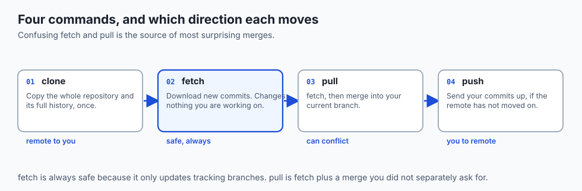

## Why this matters

For the last three days your Git work has been a private conversation between you and your laptop: you initialised a repository, staged changes, made commits, branched, and merged — all on one machine. That is enough to give you a time machine for your own files, but it is not yet a way to work with anyone, or from anywhere. The moment you want a teammate to see your code, a second computer to check it out, or a safe copy that survives a dead hard drive, you need your repository to exist in more than one place. Today you learn how Git connects one copy of a repository to another, and what platforms like GitHub add on top of that connection.

This is the day version control stops being a personal habit and becomes a collaboration system. It matters concretely for the work ahead. When you want to reuse a machine-learning model someone else trained, you will download it from a model hub with the very same `git clone` you will learn today — the Hugging Face Hub, the most popular home for shared models and datasets, is built directly on Git. When you build a project you are proud of, you will publish it by pushing it to a remote so an employer can read it. And this course itself lives on a remote: the files you are reading were written on one machine and shared through exactly the mechanism this lesson explains.

Get remotes wrong and the failures are memorable: work that lives only on a laptop that then dies; a push that is rejected with a wall of red text you do not understand; an authentication prompt that will not accept your password no matter how carefully you type it. Get them right and you gain the ability to collaborate, back up, and publish — the difference between code that only you can run and code the world can build on.

## The idea in plain language

A **remote** is a copy of your repository that lives somewhere else — on a server, on another computer, or even in another folder on the same machine — together with a short name your Git uses to refer to it. When you clone a repository, Git automatically records one remote and gives it the conventional name **origin**, meaning "the place this repository came from." From then on, instead of typing out a long address every time, you just say `origin`.

Because a remote is a full copy, syncing is a two-way street with four verbs. **Clone** makes your first local copy of a remote and wires up the `origin` name for you. **Fetch** downloads any new commits from the remote but leaves your own working branch exactly as it was — it updates Git's private notion of "what the remote looks like." **Pull** does a fetch and then merges those new commits into the branch you are on, so your working files actually change. **Push** sends your commits up to the remote so other people (and other machines) can see them. That is the whole grammar of distributed Git: four commands, moving commits between copies.

Git by itself only knows how to move commits between repositories. Everything else you associate with "GitHub" — the web page showing your files, the issue tracker, the review discussions, the automated test runs, the little green squares — is a *hosting platform* built around a Git remote. Git is the engine; GitHub, GitLab, and Bitbucket are cars built around that engine, adding a website, permissions, and collaboration tools. Keeping that distinction clear is the single most clarifying idea in this lesson.

## Historical background

Git itself was born in 2005. The Linux kernel project, led by Linus Torvalds, had been using a proprietary version-control system called BitKeeper under a free licence; when that licence arrangement broke down, the kernel community suddenly needed its own tool. Torvalds wrote the first version of Git in a matter of weeks, with a deliberate design goal that no earlier mainstream system had prioritised: it should be *distributed*. Every clone was to be a complete repository with the full history, not a thin checkout dependent on a central server. That decision is why remotes work the way they do today — there is no privileged "master" copy baked into Git, only copies that agree to synchronise with one another.

Hosting platforms arrived next to make those copies easy to share. GitHub launched in 2008, wrapping a Git remote in a friendly website and adding the pull request — a structured way to propose and discuss changes before merging — which became its signature feature and turned Git into a social activity. Bitbucket, also launched in 2008, initially hosted the rival Mercurial system before adding Git support and finding a home among teams already using other developer tools. GitLab followed in 2011 with an emphasis on being self-hostable and eventually an "everything in one place" platform that bundled issue tracking and automated pipelines. Alongside the commercial platforms, lightweight open-source servers such as Gitea (a community fork that began in 2016) let anyone run their own hosting on a small machine. The through-line across two decades is that Git supplied the distributed engine, and platform after platform competed on what to build around it.

## What it is — and what it is not

A remote *is* a named reference to another copy of your repository, stored in your repository's own configuration. Run one command and you can see the list; each entry is just a label like `origin` paired with an address (a web address, a network path, or a plain folder path). A remote *is not* a special server, a cloud account, or a synchronised drive. Nothing about a remote requires the internet, a company, or a login — a remote can be a directory sitting next to your project, which is exactly how you will prove it works in today's lab.

GitHub *is* a hosting platform: a website and a set of services wrapped around Git remotes. GitHub *is not* Git, and Git *is not* GitHub. You can use Git for years with no GitHub account, and you can host the same repository on GitHub, GitLab, and your own server at once, because each is simply one more remote. This matters because beginners often believe they are learning "GitHub" when they type `git commit`; in fact they are learning Git, and the platform is an optional — if extremely useful — layer on top.

| Common misconception | The reality |
| --- | --- |
| "A remote is the cloud." | A remote is any other copy of the repo — a server, a peer machine, or a local folder. |
| "Git and GitHub are the same thing." | Git is the version-control tool; GitHub is one platform that hosts Git remotes and adds a website and services. |
| "`git pull` just downloads changes." | Pull downloads *and merges* into your branch; `git fetch` is the download-only step. |
| "Pushing sends my uncommitted edits." | Push moves *commits*; anything unstaged or uncommitted stays on your machine. |
| "`origin` is a keyword Git requires." | `origin` is only a default name; a remote can be called anything, and you can have several. |

## Why it was created and what problems it solves

Remotes solve three problems at once, and it is worth naming them separately. The first is **backup and durability**. A repository that exists on a single disk is one spilled coffee away from gone. Pushing to a remote means the full history lives in at least two places, so no single failure erases your work.

The second is **collaboration**. Before distributed version control, teams shared a central server and effectively took turns; if the server was down or you were offline, you were stuck. Git's model lets everyone hold a complete repository and synchronise through remotes when convenient, so two people can work on the same project from different continents, on different schedules, and reconcile their histories afterwards. The remote is the neutral meeting point their separate copies agree on.

The third is **publication and reuse**. A remote on a public hosting platform is an address other people can clone from. This is how open-source software spreads, how you show a portfolio to an employer, and how shared resources — including trained models and datasets — reach the people who need them. The problem being solved is distribution: turning "code on my machine" into "code anyone can obtain, inspect, and build on."

## How it works

Picture the two halves of the system side by side: your local repository, and a remote it knows as `origin`.



Inside your repository, Git stores a small list of remotes in its configuration — each a name paired with a URL. When you clone, Git writes the `origin` entry automatically. You can inspect the list at any time.

Your local `main` branch is the one you edit and commit to. Alongside it, Git quietly keeps a **remote-tracking branch** called `origin/main`. Think of `origin/main` as your machine's best guess about where the remote's `main` branch is — a read-only mirror that Git updates only when you communicate with the remote. You never commit to `origin/main` directly; Git moves it for you during fetch and pull. A local branch that is paired with a remote branch this way is said to have an **upstream**, and once that pairing is set, plain `git push` and `git pull` know where to go without you naming the remote every time.

Now watch the four operations move data across that gap.



- **Clone** copies the remote's entire history to a new local repository and sets up `origin` and the tracking branches in one step. You do it once per machine.
- **Fetch** contacts `origin`, downloads any commits you do not have, and advances `origin/main` to match. Your own `main` does not move, and no working file changes — fetch is the safe "show me what is new" command.
- **Pull** is exactly a fetch followed by a merge of `origin/main` into your current branch. It is a convenience that combines "download" and "integrate" — which also means it can produce a merge, and occasionally a merge conflict, just like the merges you learned yesterday.
- **Push** sends your local commits up to `origin` and advances the remote's branch to match yours. Git refuses to push if the remote has commits you do not — that rejection is a safety feature, telling you to fetch and integrate first so you never silently overwrite someone else's work.

The key mental model: fetch and push move commits *between* repositories; pull and merge integrate them *into* a working branch. Every confusing Git-remote moment resolves once you know which of those two things is happening.

### The commands, at a glance

| Command | What it does | Direction |
| --- | --- | --- |
| `git remote -v` | Lists the remotes this repo knows, with their URLs | none (local inspection) |
| `git remote add <name> <url>` | Registers a new remote under a chosen name | none (local config) |
| `git clone <url>` | Creates a local copy of a remote and sets up `origin` | remote → new local repo |
| `git fetch <remote>` | Downloads new commits; updates `origin/…` tracking branches | remote → local (no merge) |
| `git pull` | Fetches, then merges the upstream branch into your branch | remote → your branch |
| `git push` | Uploads your commits to the remote branch | your branch → remote |
| `git push -u origin main` | Pushes and sets `main`'s upstream to `origin/main` | your branch → remote |
| `git branch -vv` | Shows each branch, its upstream, and how far ahead/behind it is | none (local inspection) |

## An everyday analogy

Imagine a shared office with a big filing cabinet, and a labelled drawer marked "origin" that holds the master set of a project's documents. Everyone on the team also has their own desk with their own working folder. The drawer is the remote; each desk is a local repository.

When you join the project, you set up your desk by photocopying the entire drawer into your working folder — that is **clone**. As you work, you write new pages and file them neatly at your own desk (your commits). When your pages are ready to share, you add copies of them to the shared drawer so everyone can see them — that is **push**.

Meanwhile the drawer keeps changing as teammates add their pages. You keep a small tray on the corner of your desk that mirrors what is currently in the drawer — that tray is `origin/main`, your tracking branch. Walking over to the cabinet and photocopying any new pages into that tray, without yet weaving them into your working folder, is **fetch**: now you can see what changed, but your own work is untouched. Doing that *and* then merging those pages into your working folder, reconciling any that clash with your own edits, is **pull**.

The analogy also explains the rejected push. If someone added pages to the drawer after your last visit and you try to slot your version in on top, the office rule stops you: "someone changed this since you last looked — go photocopy the latest pages, reconcile them with yours, then file." That is Git telling you to fetch and merge before you push. The whole point of the shared drawer is that no one's pages silently vanish.

## Examples in practice

Here is the everyday shape of the work. You find a project you want and make a local copy:

```bash
git clone <repository-url>
cd project
git remote -v
```

The last command prints the remote Git set up for you — one line for fetching and one for pushing, both named `origin`. You make a change, commit it as you learned this week, and share it:

```bash
git add notes.md
git commit -m "Add setup notes"
git push
```

Later, a collaborator has pushed their own work. You bring it in:

```bash
git fetch origin
git branch -vv
git pull
```

The `git fetch` updates `origin/main` without touching your files; `git branch -vv` shows a line like `main ... [origin/main: behind 2]`, telling you the remote has two commits you lack; and `git pull` merges them into your branch. Starting a brand-new project the other direction — local first, remote second — looks like this:

```bash
git init
git add .
git commit -m "Initial commit"
git remote add origin <repository-url>
git push -u origin main
```

That `-u` (short for `--set-upstream`) is worth its weight: it records that your `main` tracks `origin/main`, so from then on a bare `git push` and `git pull` know exactly where to go. In today's lab you will run every one of these commands for real — but against a remote that is just a folder on your own disk, so you need no account, no network, and no password to prove the whole cycle works.

## Implications: security, privacy, performance, scalability, and cost

**Security and authentication.** Because a remote can accept your commits, it must know you are allowed to push. Git offers two main ways to prove it over a network, and they work quite differently.

The first is **HTTPS with a personal access token**. You clone from a web address beginning with `https://`, and when you push, the platform asks for a username and a secret. Modern platforms no longer accept your account password here; instead you generate a **personal access token** — a long, random, revocable string that acts as a scoped password for Git. It is easy to set up, works through almost every firewall, and can be limited to specific permissions and given an expiry date. If a token leaks, you revoke that one token without touching your account password.

The second is **SSH keys**. You generate a *key pair*: a private key that never leaves your machine and a public key you upload to the platform once. When you connect to an address beginning with `git@`, your computer proves it holds the matching private key through a cryptographic handshake — no secret is typed or sent. After the one-time setup, pushing and pulling need no prompt at all, which is why many people prefer SSH for daily work. The trade-off is that the initial setup is fiddlier and some restrictive networks block the SSH port.

| Aspect | HTTPS + personal access token | SSH key pair |
| --- | --- | --- |
| Address form | `https://…` | `git@…` |
| What you present | A username plus a revocable token | A private key proven by a handshake |
| One-time setup | Generate a token, paste when prompted | Generate a key pair, upload the public key |
| Daily friction | May prompt unless a credential helper caches the token | No prompt after setup |
| Firewall friendliness | Very high (uses the standard web port) | Sometimes blocked on restrictive networks |
| Best for | Beginners, locked-down networks, quick one-off clones | Frequent contributors on a machine they control |
| If it leaks | Revoke that single token | Remove that public key; regenerate the pair |

The unbreakable rule underneath both: **never put a password or token directly in a remote URL**, and never commit one into your repository. A secret written into a URL ends up in your shell history and Git config in plain text; a secret committed to history is effectively published. Tokens belong in a credential helper or environment; keys belong in your machine's key store.

**Privacy.** A repository can be **public** — anyone may view and clone it — or **private**, visible only to accounts you grant access. Public is right for open-source work and portfolios; private is right for anything with secrets, unpublished research, or client code. The choice is reversible, but with a catch worth remembering: making a repository public even briefly can mean its contents were copied, so treat "was this ever public?" as "assume someone has it."

**Performance and scalability.** Because every clone is a complete repository, most of your work is local and instant — you only wait on the network when you fetch or push. That is what lets thousands of contributors collaborate on one project: they synchronise through a shared remote but do their real work on their own machines. **Forking** — making your own server-side copy of someone else's repository so you can push to it freely — scales this further, letting strangers propose changes to a project they have no write access to.

**Cost.** Git and every platform named here have a free tier generous enough for learning and for most personal and open-source work. You typically start paying only for large teams, many private repositories, heavy automated build minutes, or self-hosting at scale. For everything in this course, the free tiers are more than enough.

## Alternatives: free, open source, and commercial

The hosting layer is where the real choice lives, because the Git layer underneath is identical everywhere. Here are the leading platforms and when each makes sense.

| Platform | Type | Free tier | When to choose it |
| --- | --- | --- | --- |
| GitHub | Commercial, cloud-hosted | Unlimited public and private repos; generous automation minutes | The default for open source and portfolios; largest community, so shared projects and models are most often here |
| GitLab | Commercial, cloud or self-hosted | Free cloud tier; the core server is open-source and self-hostable | Teams that want issues, review, and built-in automated pipelines in one tool, or who need to run their own server |
| Bitbucket | Commercial, cloud-hosted | Free for small teams and private repos | Teams already using the same vendor's project-tracking and chat tools |
| Gitea | Open source, self-hosted | Free software; you provide the machine | Running a tiny, fast, fully self-owned host on your own hardware with no external dependency |

How to use any of them follows the same shape: create an account (or install the server, for a self-hosted one), create a repository through the website, then add it as a remote and push. On the cloud platforms you sign up, click "new repository," and copy the address they give you; with Gitea you install the single binary on a server first, then do the same. The commands you type against the remote afterwards — `clone`, `fetch`, `pull`, `push` — are byte-for-byte the same, which is the entire point of Git being the shared engine. Free versus paid is almost never about the Git features and almost always about scale: number of collaborators, private-repository limits, automated build minutes, and support.

If you want the largest ecosystem and the smoothest path to sharing your work, start with GitHub. If you want to own your infrastructure end to end, GitLab (self-hosted) or Gitea will do it. You lose nothing on the Git side by choosing differently, and you can mirror one repository to several platforms at once.

## Comparison with related concepts

| Concept A | Concept B | Key difference |
| --- | --- | --- |
| Git | GitHub | Git is the version-control tool that runs on your machine; GitHub is a website and service that hosts Git remotes and adds collaboration features |
| `git fetch` | `git pull` | Fetch only downloads and updates tracking branches; pull downloads *and* merges into your working branch |
| Clone | Fork | Clone copies a repo to your local machine; fork copies it to *your own* account on the hosting platform so you can push to it |
| Remote-tracking branch (`origin/main`) | Local branch (`main`) | The tracking branch is a read-only mirror of the remote that Git moves for you; the local branch is the one you commit to |
| HTTPS + token | SSH key | Both authenticate a network remote; HTTPS presents a revocable token over the web port, SSH proves a private key through a handshake |
| Public repository | Private repository | A public repo is visible and cloneable by anyone; a private one is limited to accounts you explicitly grant access |

## When to use it — and when not to

Reach for a remote the moment your work needs to exist in more than one place: as soon as a project matters enough to back up, the instant a second person is involved, and whenever you want to publish or reuse code. Push early and often on shared projects — small, frequent pushes keep everyone's copies close together and make the occasional merge trivial rather than terrifying. Prefer `git fetch` when you just want to *see* what changed without disturbing your work, and `git pull` when you are ready to integrate. Use SSH keys once you are contributing regularly from a machine you control, and HTTPS tokens when you are getting started or working through a locked-down network.

Know equally when a remote is not the answer. A private scratch repository or a quick experiment you will delete tomorrow needs no remote at all — Git is fully useful with zero remotes. Never treat a remote as a place to stash secrets, credentials, or large binary blobs it was not built for; API keys belong in ignored configuration, not in history. And do not reflexively `git pull` when you have uncommitted work you are unsure about — commit or stash first, so the merge that pull performs has a clean starting point. The professional habit is to keep your local history tidy and to synchronise with the remote deliberately, not frantically.

To close the thread this course keeps pulling: remotes are how modern machine-learning work moves. You will `git clone` a pre-trained model or a dataset from a hub built on Git — the Hugging Face Hub treats every model and dataset as a Git repository, so cloning one uses the exact command from today's lab. You will `git push` your own projects to a remote so collaborators and prospective employers can run them. And when you join a team, the shared remote is where your separate machines meet — the neutral drawer in the shared office that keeps everyone's work in sync. The distributed model you learned today is not a Git detail; it is the shape of how software, and the models built with it, are shared across the world.

## Knowledge check

Try these from memory before looking back:

1. In one sentence each, define *remote*, *origin*, and *upstream*, and explain how the three relate.
2. A teammate says "just `git pull` to get my changes." Explain what pull actually does in two steps, and when you might prefer `git fetch` instead.
3. Your `git push` is rejected with a message about the remote containing work you do not have. What happened, and what is the correct sequence of commands to fix it safely?
4. Compare HTTPS-with-a-token and SSH-key authentication: how does each prove who you are, and give one situation where you would pick each.
5. Explain the difference between cloning a repository and forking it, and why an open-source contributor without write access needs the fork.

## Hands-on exercise

Time to make a remote real. In the Day 32 lab you will simulate the entire fetch/pull/push cycle **without any network or account** by using a local *bare* repository as the remote — a repository with history but no working files, which is exactly what a server-side remote is. You will create that bare repo in a temporary folder, add it as `origin`, push to it, clone it a second time, push a change from the clone, and pull that change back into the first copy. Every command is the same one you would run against a real hosting platform; only the address is a folder path instead of a web address.

Work through it in the lab directory, where the full script, starter exercises, and tests live. The core of what you will run looks like this (the lab wraps it in a safe, self-cleaning script):

```bash
# Create a "remote" that is just a bare repository in a temp folder
git init --bare /tmp/day32-origin.git

# In your working repo, register it and push
git remote add origin /tmp/day32-origin.git
git push -u origin main

# Clone it elsewhere, make a commit, push
git clone /tmp/day32-origin.git /tmp/day32-clone
# (commit something in the clone, then)
git push

# Back in the first repo, pull the new commit
git pull
```

### Expected output

A successful `git push -u origin main` prints lines confirming the branch was created on the remote and its upstream set — for example:

```text
Enumerating objects: 3, done.
Counting objects: 100% (3/3), done.
Writing objects: 100% (3/3), done.
To /tmp/day32-origin.git
 * [new branch]      main -> main
branch 'main' set up to track 'origin/main'.
```

A later `git pull` that brings in one new commit reports a fast-forward and the file that changed:

```text
Updating a1b2c3d..e4f5a6b
Fast-forward
 shared.txt | 1 +
 1 file changed, 1 insertion(+)
```

Your commit hashes will differ — that is expected. The lab's `expected-output/` folder holds a full captured run.

### Validate your work

You are done when you can check every box:

- [ ] `git remote -v` in your working repo lists `origin` pointing at the bare repository's path.
- [ ] `git push -u origin main` succeeds and reports the upstream being set.
- [ ] A second `git clone` of the bare repo produces a working copy with your commit present.
- [ ] A commit pushed from that clone appears in the first repo after `git pull`.
- [ ] `git branch -vv` shows `main` tracking `origin/main`.

### Troubleshooting

- **`fatal: remote origin already exists`.** You added `origin` twice; either remove it (`git remote remove origin`) and re-add, or update it (`git remote set-url origin <path>`).
- **`error: failed to push some refs`.** The remote has commits you do not — run `git pull` (or `git fetch` then merge) to integrate, then push again. This is the rejected-push safety feature working as intended.
- **`src refspec main does not match any`.** You have not committed yet, so there is no `main` to push — make at least one commit first.
- **Pushing seems to do nothing.** Confirm you actually committed (`git status` should say "nothing to commit"); push moves commits, never uncommitted edits.

### Common mistakes

- **Confusing fetch with pull.** Fetch updates `origin/main` but leaves your files unchanged; if your working files did not update, you fetched when you meant to pull.
- **Authentication confusion (on real platforms).** Typing your account password when the platform wants a token — generate a personal access token, or set up an SSH key, and use that instead.
- **Pushing to the wrong remote or branch.** With several remotes, a bare `git push` can go somewhere you did not intend; check `git remote -v` and `git branch -vv` first, and set an upstream with `-u` so the default is unambiguous.

## Practice assignment

Open the worksheet in the lab's starter directory and complete the full local-remote cycle for yourself, recording as you go: the name and path of the remote you created, the exact push and pull commands you ran, and — in your own words — how a single change travelled from one clone, up to the shared bare repository, and down into the other clone. Then write one short paragraph (4–6 sentences) explaining to a beginner why Git refuses a push when the remote is ahead, using the shared-drawer analogy or your own. Keep the worksheet; the Week 5 project builds a real repository on a hosting platform and will reuse exactly this vocabulary.

## Extension challenge

Go one step further and prove the distributed model with *two* remotes. In a fresh working repository, create **two** separate bare repositories in temporary folders and add them under different names — for example `origin` and `backup`. Push your `main` branch to both, then make a new commit and push it to only one of them. Now run `git remote -v` and `git branch -vv`, and use `git log` on each bare repository (clone each into a scratch folder to read it) to confirm they hold different histories. Write two or three sentences on what this demonstrates: that a repository can synchronise with many remotes independently, that there is no single privileged copy, and that "the truth" of a project is simply whichever remote a team agrees to treat as shared. You have just reasoned about the exact model that lets thousands of people collaborate on one codebase — using nothing but folders on your own disk.
