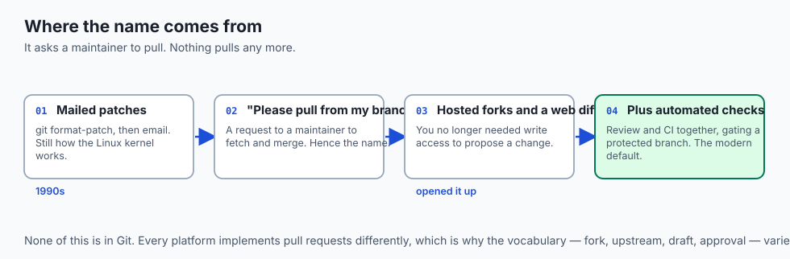
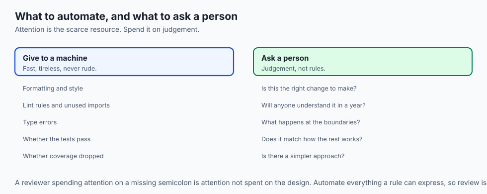
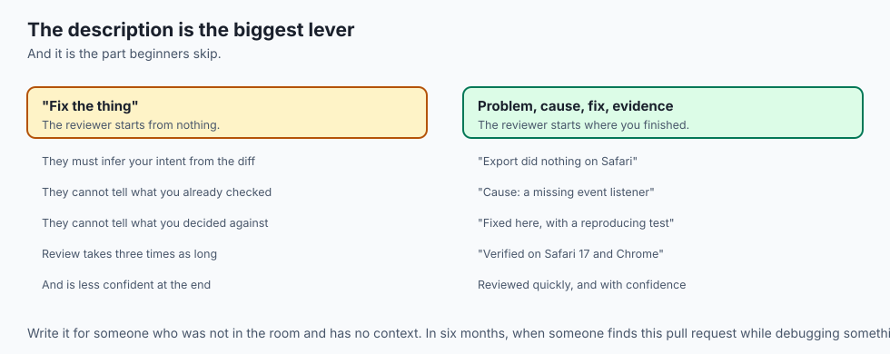
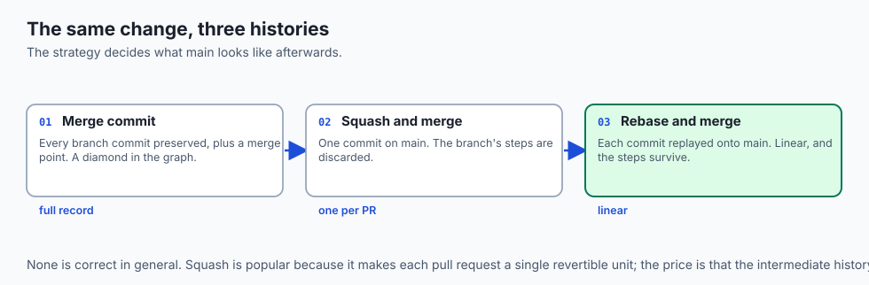
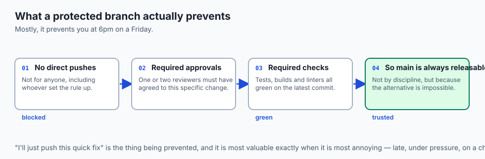
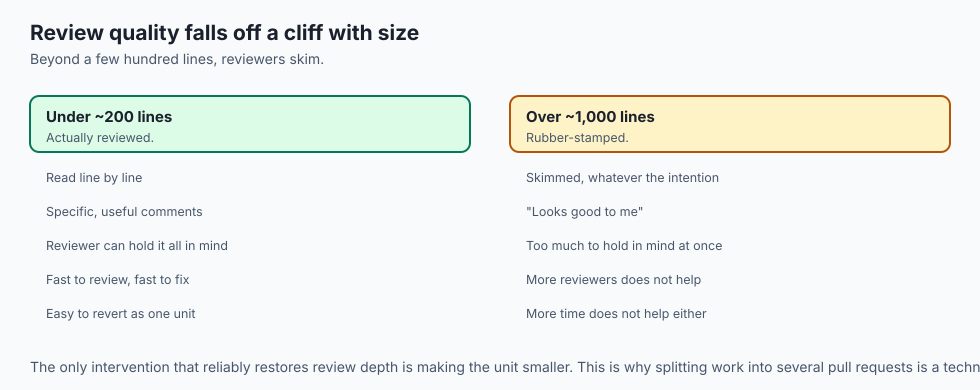
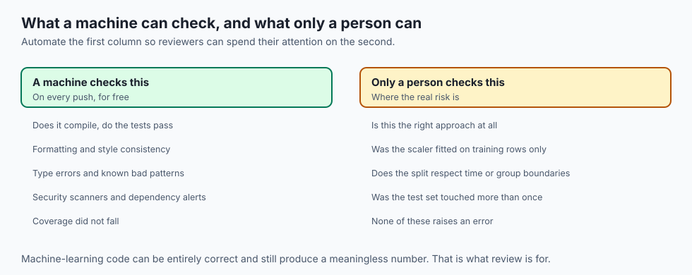
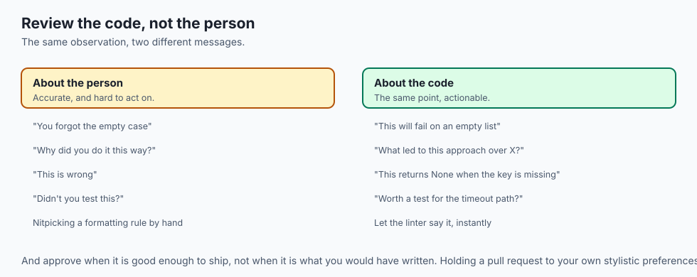
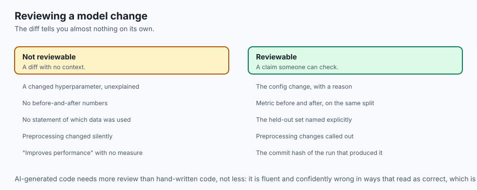

## Why this matters

- **Every contribution you make to someone else's project** arrives as a pull request.
- **Every job that involves code involves review**, and being good at it is more
  visible than being good at writing code alone.
- **A protected main branch is how a team trusts** that main is always releasable.
- **Review catches what tests cannot**: whether the change is the right change, and
  whether anyone else can maintain it.
- **The description is the single biggest lever** on review quality, and it is the part
  beginners skip.

---

## The idea in plain language

- **A pull request proposes changes** from one branch into another, and opens a
  conversation about them.
- **It ties three things together**: a source branch with your commits, a target
  branch, and a discussion layered over the diff between them.
- **It is a living object.** Push a commit and the diff and the checks update
  automatically.
- **Two things happen in parallel**: humans review, and machines run checks.
- **Merging becomes available** only when both are satisfied.

---

## Historical background



- **Git has no concept of a pull request.** It is entirely a hosting-platform
  invention.
- **The original workflow was email.** You produced patches with `git format-patch` and
  mailed them to a maintainer, which is still how the Linux kernel works.
- **The pull request made contribution from strangers practical** by giving the
  discussion, the diff and the merge one address.
- **Fork-and-pull-request opened up open source**, because you no longer needed write
  access to propose a change.
- **Continuous integration was bolted on afterwards**, and the combination — automated
  checks plus human review, gating a protected branch — became the industry default.
- **The name is a leftover.** It asks a maintainer to `git pull` from your branch,
  which is not what happens any more.

---

## What it is — and what it is not

**It is:**

- A proposal, with a diff and a conversation attached.
- A gate: nothing enters a protected branch except through one.
- A permanent record of why a change was made, and who agreed.

**It is not:**

- **Not a Git feature.** Different platforms implement it differently, and none of it
  is in Git itself.
- **Not a substitute for tests.** Review and CI catch different things, which is why
  both run.
- **Not a formality.** A rubber-stamp approval is worse than no review, because it
  creates false confidence.
- **Not the place for design discussion.** By the time code exists, the design decision
  has been made — that conversation belongs earlier.

---

## Why it was created and what problems it solves



- **Catching mistakes before they ship**, when they are cheapest to fix.
- **Spreading knowledge.** A reviewer learns the code, so no part of the system has
  exactly one person who understands it.
- **Making changes discussable.** A diff with comments attached is a conversation with
  a shared reference.
- **Creating a record.** Six months later, the pull request explains why the code is
  the way it is.
- **Letting strangers contribute** without being trusted with write access.

---

## How it works

### The lifecycle


- **You branch off main and commit** your work.
- **Opening the pull request starts two things in parallel**: human review, and
  automated checks — builds, tests and linters that run on every push.
- **Both feed back into iteration.** A reviewer asks for a change or a check fails, you
  push a fix, and everything re-runs.
- **Merge becomes available** only with the required approvals *and* green checks.
- **After merging, the branch is deleted** and its commits live on in main, with the
  whole discussion preserved.

### What a reviewer actually sees




| Component | What it does |
| --- | --- |
| Title and description | What the change does and why — the first thing read |
| Diff | The line-by-line comparison; the substance of the review |
| Inline comments | Feedback attached to specific lines, where it applies |
| Checks | Builds, tests and linters, reporting before a human has to |
| Reviewers and state | Who was asked, and whether each approved or requested changes |
| Merge button | Enabled only when the branch's rules are satisfied |

- **The description is the biggest lever, and it is the part people skip.**
- **"Fix the thing"** forces a reviewer to reverse-engineer your intent from the diff.
- **"Users reported the export button did nothing on Safari; the cause was a missing
  event listener, fixed here, with a test that reproduces the failure"** can be
  reviewed in a fraction of the time, with far more confidence.

### The sequence

1. **Branch** from an up-to-date main: `git switch -c fix-export-button`.
2. **Commit** one focused change with a clear message. One fix or one feature, not
   five unrelated things.
3. **Push and open**, filling in a real title and description.
4. **Review.** Teammates read the diff and comment; CI runs meanwhile.
5. **Iterate.** Push more commits to the same branch. Each push updates the PR and
   re-runs the checks.
6. **Merge**, choosing a strategy, and delete the branch.

- **The loop between 4 and 5 is the heart of it.** Revision is not failure; it is the
  process working.

### Merge strategies



| Strategy | What it does | History | Best when |
| --- | --- | --- | --- |
| Merge commit | Joins the branch in, preserving every commit | Branching, with a merge point | You want the full record of how the branch developed |
| Squash and merge | Combines everything into one commit | Flat and linear; one commit per PR | The intermediate commits are noise |
| Rebase and merge | Replays each commit onto main | Linear, preserving individual commits | You want a straight line and value the steps |

- **There is no universally correct choice.**
- **Squash is popular** because it keeps main clean and makes each PR a single
  revertible unit; the price is discarding the branch's step-by-step history.
- **Many teams simply pick one and apply it everywhere**, for consistency.

### Protected branches



- **A protected branch refuses direct pushes.** The only way in is a pull request that
  meets the rules.
- **Typical rules**: one or two approving reviews, all checks passing, the branch up to
  date with main, and no unresolved comments.
- **With main protected, "I'll just push this quick fix" becomes impossible.**
- **This is not bureaucracy.** It is what lets a team trust that main is always in a
  releasable state.

---

## An everyday analogy

Submitting an article to an editor.

| The publication | The pull request |
| --- | --- |
| Your draft | The source branch |
| The published edition | The target branch |
| The submission | Opening the PR |
| The covering note | The description |
| Margin notes on specific lines | Inline comments |
| The spell-checker | Automated checks |
| "Approved" or "revise and resubmit" | Review state |
| Going to print | The merge |

- **A covering note explaining the piece** gets a faster, better edit than a bare
  manuscript.
- **Margin notes beat a vague "this needs work"**, because the writer knows exactly
  where.
- **Revision is the process, not a rejection.**

---

## Examples in practice





- **A pull request with a one-word description**, which takes three times as long to
  review as it should.
- **A 2,000-line PR that gets "looks good to me"**, because nobody can meaningfully
  review that much at once.
- **A check that fails on a formatting rule**, which is exactly the kind of thing a
  human should never spend attention on.
- **An inline comment that catches a subtle bug** the tests did not cover, because a
  person understood the intent.
- **A protected branch preventing a "quick fix"** at 6pm on a Friday, which is the
  moment it is most valuable.

---

## Implications: security, privacy, performance, scalability, and cost

- **Security: review is where a malicious or careless change is caught.** A
  supply-chain attack via a dependency update is exactly what a careful reviewer
  notices.
- **Protected branches prevent a compromised account** from pushing directly to main.
- **CI running on untrusted pull requests is a real risk.** A fork's code running with
  your secrets available is how tokens leak; platforms restrict this deliberately.
- **Performance: review is the bottleneck in most teams**, and small pull requests are
  the fix. A 100-line PR gets a real review; a 2,000-line one gets a rubber stamp.
- **Cost: the cheapest bug is the one caught in review.** The same bug found in
  production costs orders of magnitude more.
- **Cost of over-process is real too.** Requiring three approvals for a typo fix trains
  people to route around the process.

---

## Alternatives: free, open source, and commercial

| Approach | Type | Where it fits |
| --- | --- | --- |
| Platform pull requests | Free tiers, commercial | The default for almost every team |
| `gh` / `glab` CLI | Free, open source | Opening and reviewing PRs without leaving the terminal |
| Email patches | Free, built into Git | The Linux kernel; genuinely scalable, with a steep entry cost |
| Gerrit | Free, open source | Change-by-change review, heavier and very rigorous |
| Pair programming | A practice | Review happening continuously instead of afterwards |
| Trunk-based with post-merge review | A practice | Speed over gating; needs strong tests and trust |

- **Learn `gh pr create` and `gh pr checkout`.** Reviewing a branch locally, where you
  can run it, catches things reading a diff never will.
- **Pair programming is a real alternative**, not a supplement. Work reviewed as it is
  written does not need reviewing again.

---

## Comparison with related concepts

| Term | What it actually is |
| --- | --- |
| **Pull request** | A proposal to merge one branch into another, with discussion |
| **Source branch** | Where your commits are |
| **Target branch** | Where you want them to end up |
| **Check** | An automated build, test or lint run on the change |
| **Protected branch** | One that refuses direct pushes |
| **Approval** | A reviewer's recorded agreement |
| **Squash** | Combining a branch's commits into one on merge |

---

## When to use it — and when not to



- **Keep pull requests small.** Under a few hundred lines is the difference between a
  review and a rubber stamp.
- **Write the description for someone who was not in the room** — because in six
  months, that is you.
- **Review the code, not the person.** "This will fail on an empty list" rather than
  "you forgot the empty case".
- **Approve when it is good enough to ship**, not when it is what you would have
  written.
- **Do not use review to catch formatting.** A linter does that, instantly and without
  hurt feelings.
- **Do not open a PR to start a design discussion.** By then the code exists, and
  people defend what they have written.
- **Do not require so much process** that people learn to route around it.

---

## The AI connection



- **Model and dataset changes deserve review** as much as code does: a changed
  preprocessing step alters every result downstream.
- **Review the config diff especially.** A hyperparameter change with no explanation is
  the commonest unreviewed source of "why did the numbers move?"
- **Notebook pull requests are hard to review** because the diff is unreadable — which
  is the practical argument for stripping outputs.
- **AI-generated code needs more review, not less.** It is fluent and confidently
  wrong in ways that read as correct.
- **A pull request is where you state what you verified.** "I ran this on the held-out
  set and the metric moved from X to Y" is the sentence that makes a model change
  reviewable at all.

---

## Knowledge check

```yaml
quiz:
  question: "A team notices that large pull requests consistently receive shorter, less useful reviews than small ones. What is the most effective response?"
  options:
    - "Split work into smaller pull requests, since review quality falls sharply with size"
    - "Require more approvers on large pull requests to increase total scrutiny"
    - "Extend the review deadline so reviewers have more time for large changes"
    - "Add more automated checks so reviewers can focus only on the largest files"
  answer_index: 0
  explanation: "Review attention does not scale with size — beyond a few hundred lines, reviewers skim regardless of how long they are given or how many of them there are. Making the unit of review smaller is the only change that reliably restores the depth of the review."
```

---

## Hands-on exercise

Simulate the whole flow locally, then compare merge strategies. Worked through fully
in the Day 33 lab directory.

| What you are doing | Command |
| --- | --- |
| Branch and commit | `git switch -c fix-export` then commit |
| Review your own diff | `git diff main...fix-export` |
| See it as a reviewer would | `git log main..fix-export --oneline` |
| Merge preserving history | `git switch main && git merge --no-ff fix-export` |
| Try again, squashed | on a second branch: `git merge --squash` then commit |
| Compare the two shapes | `git log --oneline --graph --all` |
| Open a real one, if you have a remote | `gh pr create --fill` |

### Expected output

```text
*   3f9a2c1 Merge branch 'fix-export'
|\
| * 8b1d4e7 Add test for Safari event listener
| * 2c7f0a9 Attach missing click handler
|/
* 1a0b9c8 Initial import
* 5d3e8f2 Squashed: fix export button on Safari
```

- **The first shape preserves both commits** and records that a branch existed.
- **The second is one commit** with no evidence of the branch — the same change, a
  different history.

### Validate your work

- [ ] You produced both a merge-commit merge and a squash merge and can see the
      difference in the graph
- [ ] You wrote a description that explains why, not only what
- [ ] You reviewed a diff and left at least one specific, line-level comment
- [ ] You can name two things review catches that checks cannot
- [ ] You can explain what a protected branch prevents
- [ ] `bash tests/run_tests.sh` reports 0 failures

### Troubleshooting

- **`git diff main..branch` shows too much.** Use three dots — `main...branch` — which
  compares against the merge base rather than the tip.
- **A merge fast-forwarded and left no merge commit.** Use `--no-ff` when you want the
  branch recorded.
- **`gh` is not authenticated.** Run `gh auth login` once.
- **The squash merge left nothing staged.** `--squash` stages the changes; you still
  have to commit.

### Common mistakes

- **A pull request that does five unrelated things.**
- **A description that repeats the title.**
- **Reviewing only the diff**, when checking out the branch and running it would have
  taken two minutes.
- **Approving to be agreeable**, which is worse than not reviewing.

---

## Practice assignment

- **Open a pull request against your own repository**, review it yourself a day later,
  and note what you missed the first time.
- **Take one large change and split it into three pull requests**, and compare how long
  each takes to review.
- **Write three descriptions** for real changes, each stating the problem, the cause,
  the fix and what you verified.
- **Review someone else's open-source pull request** and leave one specific, useful
  comment.

---

## Extension challenge

- **Set up branch protection** on a repository you own and try to push directly to
  main. Being refused by your own rule is instructive.
- **Add a CI check** that runs your tests on every pull request, and watch the PR go
  red then green.
- **Review a change you disagree with** and write feedback that is specific, kind, and
  about the code. This is a harder skill than any command in this course.
- **Compare review outcomes.** Track the size and review time of ten pull requests, and
  find the size at which review quality visibly drops.

---

