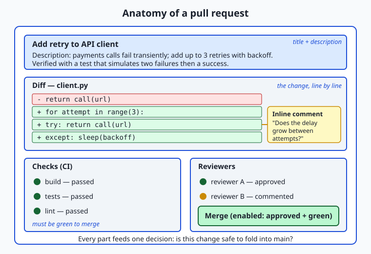

## Why this matters

You now know how to make a branch, commit work, and push it to a shared remote. But on any team larger than one, pushing straight into the main line of work is reckless: your half-finished idea would immediately become everyone else's problem, and a single typo could break the project for the whole group. Teams need a way to *propose* a change, let others look at it, and only fold it in once it has been checked. That mechanism is the pull request, and learning it is the moment you stop being a solo tinkerer and start being a collaborator.

This matters directly for the AI work ahead of you. Every serious model, prompt template, data pipeline, and evaluation script that reaches production reaches it the same way: someone opens a pull request, teammates review the change, automated checks run, and only then is it merged. A change to which model version answers customer questions, a tweak to a prompt that goes out millions of times a day, a new filter on training data — none of these ship because one person felt like it. They ship because a reviewed, approved, tested pull request said they could. The pull request is the gate between "I changed something on my laptop" and "this is now live for real users."

There are concrete consequences to getting this right. A good review catches the bug before it costs money in production instead of after. It spreads knowledge, so you are not the only person who understands the payment code or the ranking logic. It leaves a written record of *why* a change was made, which the version-control history alone never captures. And it is where you build a reputation: the developer who writes small, clear, well-described pull requests and gives kind, useful reviews is the one people want to work with. Today you learn both halves of that skill — proposing changes well, and reviewing them well.

## The idea in plain language

A pull request (PR) is a formal proposal to merge the commits on one branch into another. You do your work on a feature branch, push it, and then open a pull request that says, in effect, "here is a set of changes; please look at them and, if they are good, merge them into `main`." The name comes from the underlying action: you are asking the project to *pull* your changes in. GitLab calls the same thing a merge request (MR), which is arguably the clearer name, but the two mean exactly the same workflow.

The pull request is not just a button that merges branches. It is a page where a conversation happens. It shows the **diff** — the exact lines your change adds, removes, and modifies — so reviewers can see precisely what you are proposing. It lets reviewers leave comments, including comments attached to specific lines of code. It records their verdict: approve the change, ask for changes, or just leave a comment. It runs automated checks and shows whether they passed. And it holds a description you write explaining what the change does and why. Nothing merges until the proposal has cleared whatever bar the project sets.

The rhythm is: branch, push, open the PR, discuss and revise, pass the checks, get approval, merge. You almost never get it perfect on the first try, and that is expected. A reviewer spots something, you push another commit to the same branch, the PR updates automatically, and the loop continues until everyone is satisfied. Then the change merges, the branch is deleted, and the history of the whole discussion stays attached to the commit forever.

## Historical background

Code review is far older than pull requests. In the 1970s, Michael Fagan at IBM formalized the "software inspection," a structured meeting where a small group read through code line by line looking for defects; his 1976 paper made the case with hard numbers that inspection found bugs far more cheaply than testing did. For decades review meant meetings, printouts, and email threads with patches attached.

The distributed version-control tools of the 2000s changed the mechanics. Git, created by Linus Torvalds in 2005 to manage Linux kernel development, made it trivial to produce a self-contained bundle of changes — a patch series — and mail it to a mailing list. The Linux kernel still works this way: contributors send patches by email, maintainers review them in replies, and revised versions are sent as "v2," "v3," and so on. This is code review in its rawest form, and the pull request is a friendlier interface over the same idea.

The web-based pull request as most developers know it arrived with GitHub, which launched in 2008 and popularized the term. Bitbucket and GitLab followed with their own versions, GitLab naming it the merge request. In parallel, Google had built and open-sourced Gerrit, a review tool centered on individual commits with strict scoring, which became common in large engineering organizations and Android development. By the mid-2010s, the pull-request-and-review loop had become the default way software teams collaborate almost everywhere, from two-person side projects to the largest companies on earth. What was once a formal meeting is now a web page that anyone can open in a minute.

## What it is — and what it is not

A pull request is a request to integrate a branch, wrapped in a review conversation and a set of gates. It is a proposal, a discussion thread, a diff viewer, a checklist of automated results, and a record of who approved what — bound together and attached to a specific pair of branches.

It is *not* the merge itself; it is the proposal to merge, and it can be closed without merging if the change is abandoned. It is *not* a Git feature — Git knows nothing about pull requests. Git gives you branches and merges; the pull request is a layer that hosting platforms (GitHub, GitLab, and others) build on top of Git to manage the human process around a merge. This distinction matters: you can practice the entire logic of a pull request with local branches and diffs alone, which is exactly what today's lab has you do.

| Common misconception | The reality |
| --- | --- |
| "A pull request is a Git command." | Git has no `pull-request` command; PRs are a feature of hosting platforms layered on top of Git's branches and merges. |
| "Review is about catching your mistakes." | Catching bugs is one benefit; review also spreads knowledge, records intent, and improves design — it is collaboration, not an exam. |
| "Bigger pull requests are more efficient." | Large PRs get shallower reviews and hide bugs; small, focused PRs get read carefully and merge faster. |
| "Approval means the code is perfect." | Approval means a reviewer judged it good enough to merge, not that it is flawless — review reduces risk, it does not eliminate it. |
| "Requesting changes is a rejection." | It is a normal step in a conversation; almost every good pull request goes through at least one round of revision. |

## Why it was created and what problems it solves

The pull request exists to solve a specific tension: teams want to move fast *and* keep the shared codebase working. Without a gate, every push risks breaking the build for everyone, and mistakes are discovered only after they have already spread. With a heavyweight process — say, a mandatory meeting for every change — teams move too slowly to compete. The pull request is the compromise that stuck: lightweight enough to open in seconds, structured enough to catch problems before they land.

It solves several problems at once. It gives change a **checkpoint** where a second pair of eyes can catch bugs, security holes, and design mistakes while they are still cheap to fix. It creates **shared ownership**, so knowledge of any part of the system lives in more than one head — critical when someone is on vacation or leaves the company. It produces a **written trail**: the description and the review comments explain why a change was made, which the diff alone can never tell you. And it enables **safe openness**: an open-source project can accept a contribution from a total stranger precisely because the maintainers review it before merging, letting millions of people improve a shared codebase without chaos.

## How it works

Let us walk the full life of a pull request, then look closely at what a reviewer actually sees.

### Internal architecture

A pull request ties together three things: a **source branch** (yours, with the new commits), a **target branch** (usually `main`, where you want the change to end up), and a **conversation** layered over the comparison between them. When you open a PR, the platform computes the diff between the two branches and renders it, groups the commits, and starts an empty discussion thread. From then on, the PR is a living object: push a new commit to the source branch and the diff and checks update automatically; leave a comment and it joins the thread; run the checks and their pass/fail status attaches to the latest commit.



Read the flow left to right. You branch off `main` and commit your work. You open the pull request, which kicks off two parallel activities: human **review** and automated **checks** (continuous integration, or CI — automated builds and tests that run on every push, previewed here and covered in depth later). Review and checks feed back into iteration: a reviewer asks for a change or a check fails, you push a fix, and the PR re-runs everything. Only when the change has the required approvals *and* the checks are green does the **merge** become available. After merging, the source branch is deleted and its commits live on in `main`, with the whole discussion preserved.

### Important components

What does a reviewer actually look at? The pull request page is built from a handful of parts, each doing a specific job.



| Component | What it does |
| --- | --- |
| Title and description | A one-line summary plus a written explanation of what the change does and why; the first thing a reviewer reads |
| Diff | The line-by-line comparison of source and target, additions in one colour and removals in another — the substance of the review |
| Inline comments | Notes attached to specific lines, so feedback lands exactly where it applies instead of in a vague general remark |
| Checks (CI) | Automated builds, tests, and linters that run on the change and report pass or fail before a human has to |
| Reviewers and their state | Who has been asked to review and whether each has approved, requested changes, or only commented |
| Merge button | Enabled only when the branch's rules are satisfied; offers the merge strategy the project allows |

The description deserves special attention because beginners skip it, and it is the single biggest lever on review quality. A reviewer who reads "Fix the thing" has to reverse-engineer your intent from the diff; a reviewer who reads "Users reported the export button did nothing on Safari; the cause was a missing event listener, fixed here, with a test that reproduces the failure" can review in a fraction of the time and with far more confidence.

### Step by step: opening and merging a pull request

Here is the concrete sequence, the same one the lab simulates with local branches:

1. **Branch.** From an up-to-date `main`, create a feature branch: `git switch -c fix-export-button`. All your work happens here, isolated from `main`.
2. **Commit.** Make one focused change and commit it with a clear message. Keep the change small — one fix or one feature, not five unrelated things.
3. **Push and open.** Push the branch to the remote and open a pull request targeting `main`, filling in a title and description. On a hosted platform this is a web form or a single `gh pr create` command.
4. **Review.** Teammates read the diff, leave inline comments, and set their state to approve, comment, or request changes. Meanwhile CI runs the tests.
5. **Iterate.** You address the feedback by pushing more commits to the same branch. Each push updates the PR and re-runs the checks. This repeats until reviewers are satisfied.
6. **Merge.** Once you have the required approvals and green checks, you merge — choosing a merge strategy (below) — and delete the branch.

The loop between steps 4 and 5 is the heart of it. Revision is not failure; it is the process working.

### Merge strategies

When a pull request is approved, you choose *how* its commits enter the target branch. Platforms offer three strategies, and the choice shapes what your project's history looks like.

| Strategy | What it does | History it produces | Best when |
| --- | --- | --- | --- |
| Merge commit | Creates a new commit joining the branch into `main`, preserving every commit on the branch | Full, branching history with a merge point | You want the complete record of how the branch developed |
| Squash and merge | Combines all the branch's commits into one new commit on `main` | Flat, linear history — one commit per pull request | The branch's intermediate commits are noise ("wip", "fix typo") and you want `main` tidy |
| Rebase and merge | Replays the branch's commits one by one onto `main`, with no merge commit | Linear history preserving each individual commit | You want a clean straight line but value the individual commits |

There is no universally correct choice. Squash-and-merge is popular because it keeps `main` clean and makes each pull request a single, revertible unit; the price is that the branch's step-by-step history is discarded. A merge commit preserves everything at the cost of a busier history. Many teams simply pick one and apply it to every PR for consistency. The lab has you perform both a merge-commit merge and a squash merge on local branches so you can see the difference in the commit graph with your own eyes.

### Protected branches and required reviews

The gate only works if it cannot be bypassed. A **protected branch** is a branch the platform refuses to let anyone push to directly; the only way in is through a pull request that meets the branch's rules. Typical rules include: at least one (or two) approving reviews, all CI checks passing, the branch being up to date with `main`, and no unresolved review comments. With `main` protected, "I'll just push this quick fix" becomes impossible — every change, from everyone, goes through the same reviewed door. This is not bureaucracy for its own sake; it is what lets a team trust that `main` is always in a releasable state.

## An everyday analogy

Think of a community cookbook that a whole neighbourhood shares and cooks from every night. The master copy lives in the town hall, and it must always be reliable — a wrong ingredient or a missing step means someone's dinner is ruined. So the neighbourhood has a rule: nobody writes directly in the master copy.

When you want to add your grandmother's soup recipe, you make a photocopy of the relevant section, write your recipe on the copy, and hand it to the editorial committee with a cover note: "Adding lentil soup to the soups chapter — tested it twice, serves four." That copy-with-a-cover-note is your **pull request**. The committee members read it, and in the margins they write notes: "great, but specify the lentil type," "step 3 is unclear." Those margin notes are **inline comments**. One editor might sign off — an **approval** — while another writes "please fix step 3 before this goes in," which is **requesting changes**. You revise your copy and hand it back; that is **iterating** on the branch.

Meanwhile, a proofreader runs a spell-check and confirms the measurements add up — the automated **CI checks**. Only when an editor has approved *and* the proofreader's checks pass does the head editor copy your recipe into the master book: the **merge**. The master book being kept under lock, editable only through this process, is the **protected branch**. And how the recipe is transcribed in — copied verbatim with all your crossings-out preserved, or rewritten cleanly as a single polished entry — is the choice of **merge strategy**. Keep this cookbook in mind and every part of a pull request has a place.

## Examples in practice

A first, small example shows why focus matters. Suppose you fix a broken login button and, while you are in there, also rename twenty variables you found ugly. You open one pull request with both. The reviewer now faces a diff where the one important line — the login fix — is buried among two hundred cosmetic changes. They either rubber-stamp it without really reading (defeating the point) or spend an hour untangling what actually matters. Split into two pull requests — "fix login button" and "rename variables in auth module" — each is reviewed in minutes, and if the rename turns out to cause a problem, it can be reverted without touching the login fix.

Now a realistic review exchange. A junior developer opens a PR titled "Add retry to API client." The description reads: "Our calls to the payments API sometimes fail transiently; this adds up to three retries with a short delay. Added a test that simulates two failures then a success." A reviewer reads the diff and leaves an inline comment on the retry loop: "What happens if the request times out every time — do we retry forever?" The author realizes the delay never increases and could hammer a struggling server, pushes a commit adding a backoff and a hard cap, and replies "Good catch — added exponential backoff, capped at 3 attempts." The reviewer approves. This is the whole value of review in one exchange: a real bug, caught and fixed before it ever touched production, and two people who now both understand the retry logic.

Finally, the command-line path. The `gh` command-line tool lets you drive pull requests without leaving the terminal. After pushing a branch, `gh pr create --title "Fix export button" --body "..."` opens the PR; `gh pr status` shows the state of yours; `gh pr checks` reports whether CI passed; `gh pr review --approve` records an approval; and `gh pr merge --squash` merges it. For developers who live in the terminal, this is faster than clicking through a web page, and it scriptable — the same commands run in automation. Today's lab stays entirely local and uses plain Git, so you can rehearse the *logic* of every one of these steps with no account and no network.

## Implications: security, privacy, performance, scalability, and cost

### Security

The pull request is a primary security control. Requiring review means no single person — including one whose account has been compromised — can slip malicious or careless code into `main` unseen. Reviewers are a human check for leaked secrets (an API key accidentally committed), for dependencies pulled from untrustworthy sources, and for logic that mishandles user data. Protected branches enforce this: even an administrator's change must pass through the reviewed door if the rules are set that way. For open-source projects accepting code from strangers, review is the *only* thing standing between the project and hostile contributions.

### Privacy

A pull request is a record, and records leak. The diff, the description, and every comment are stored and often visible to everyone with repository access — on public repositories, to the entire world. It is easy to paste a real customer email into a comment to illustrate a bug, or to commit a configuration file with a live credential, and now that private data lives permanently in the history where even deleting the branch does not remove it. The discipline is to treat everything in a pull request as potentially permanent and public: never put secrets or personal data in a diff or a comment.

### Performance

Here "performance" is about the flow of work. A pile of large, slow-to-review pull requests is a bottleneck: work piles up waiting for review, branches drift out of date, and merge conflicts multiply. Small, focused pull requests reviewed promptly keep work flowing. The most important performance lever a team has is *review latency* — how long a PR waits for its first review. Teams that review within hours ship far faster than teams where PRs sit for days, even with identical coding speed, because unreviewed work is work that is done but not yet delivering any value.

### Scalability

The pull-request model scales from two people to tens of thousands precisely because it decentralizes judgment. No central gatekeeper reads every change; instead, rules (required approvals, code owners for specific directories, passing checks) route each change to the right reviewers automatically. This is why the largest software projects on the planet — operating systems, browsers, cloud platforms — run on this model. It also scales *down* gracefully: a solo developer can open pull requests to review their own work against `main`, catching mistakes and keeping a clean history even with no one else involved.

### Cost

Review costs reviewer time, and that time is not free — a thorough review of a substantial change can take an experienced engineer an hour. But the alternative is far more expensive. A bug caught in review costs minutes; the same bug caught in production can cost an outage, a security incident, lost customer trust, and days of frantic debugging. Studies of software defects consistently find that the later a defect is caught, the more it costs to fix, by orders of magnitude. Review is cheap insurance against expensive failures, which is why even fast-moving teams keep it.

## Alternatives: free, open source, and commercial

The pull-request-and-review workflow is available through several tools, differing in interface, philosophy, and price. The core Git operations underneath are identical; the tools differ in how they wrap the human process.

| Tool | Type | How review works | Cost |
| --- | --- | --- | --- |
| GitHub pull requests | Commercial platform (free tier) | Branch-based PRs with inline comments, required reviews, protected branches, and integrated CI | Free for public and small private repos; paid tiers for organizations |
| GitLab merge requests | Commercial platform, open-source core | Branch-based MRs with approval rules, an open-source self-hostable edition, and built-in CI/CD | Free tier and free self-hosted Community Edition; paid tiers add features |
| Gerrit | Open source | Commit-centric review with numeric scores (e.g. +2 to approve); enforces one-change-per-commit rigorously | Free and open source; self-hosted |
| `gh` CLI | Open-source command-line tool | Drives GitHub pull requests from the terminal: create, review, check, and merge without a browser | Free and open source |
| Plain Git (patches by email) | Open source | Contributors email patch series; maintainers review in replies and merge revised versions | Free; the original model, still used by the Linux kernel |

Choosing among them: if your team is small and wants the least friction, a hosted platform's pull requests are the default. If you need to self-host for control or compliance, GitLab's Community Edition or Gerrit are the open-source routes. If you prefer the keyboard, the `gh` CLI layers over a hosted platform without changing where the code lives. And if you want to understand the model at its most fundamental, the email-patch workflow — where a "pull request" is literally a bundle of commits attached to a message — is worth trying once, because everything else is a friendlier skin over it.

## Comparison with related concepts

| Concept A | Concept B | Key difference |
| --- | --- | --- |
| Pull request | Merge (the Git operation) | A merge combines two branches; a pull request is the reviewed *proposal* that leads to a merge, plus the discussion around it |
| Pull request | Merge request | Different names for the same thing — "pull request" on GitHub and others, "merge request" on GitLab |
| Code review | Pair programming | Review is asynchronous, after code is written; pair programming is two people writing code together in real time |
| Requesting changes | Commenting | Requesting changes formally blocks the merge until addressed; a plain comment is feedback that does not block |
| Draft pull request | Ready-for-review pull request | A draft signals "work in progress, not ready to merge yet"; marking it ready opens it for formal review and approval |
| Protected branch | Ordinary branch | A protected branch refuses direct pushes and enforces rules; an ordinary branch accepts any push from anyone with access |

## When to use it — and when not to

Use a pull request for essentially every change to shared code on a team: features, bug fixes, configuration changes, and documentation. The moment more than one person depends on a codebase, the pull request is how changes should enter it, and protecting `main` so that nothing bypasses review is standard practice. Even alone, opening pull requests against your own `main` is a worthwhile habit — it forces you to read your own diff before merging, catches embarrassing mistakes, and keeps a tidy, revertible history. For learning, deliberately routing your work through PRs builds the muscle memory you will use every working day.

Know the edges, too. For a genuinely private, throwaway repository that only you will ever touch, the ceremony of pull requests may be more overhead than it is worth — commit to `main` and move on. In a true emergency — production is down and a one-line fix will restore it — many teams allow a break-glass path that merges without the usual waiting, on the understanding that the change is reviewed retroactively; this should be rare and logged, not a habit. And a pull request is a poor place to have a long design argument: if a change provokes deep disagreement about direction, that conversation belongs in a design discussion *before* the code is written, not in review comments after. The rule of thumb is that review catches problems in *this change*; it is not the right tool for deciding whether the change should exist at all.

The AI thread runs straight through this lesson. The models, prompts, and data pipelines behind AI products ship exactly like any other code: on a branch, through a pull request, past review and automated checks, into a protected `main` that deployment watches. A change to which model version serves users, or to a prompt that will run millions of times a day, is gated by an approved pull request just as a login fix is — because these changes carry real risk and demand a second pair of eyes. As you go further, you will meet a newer challenge: reviewing code that was generated for you rather than typed by hand. That is a distinct and increasingly important skill — reading a proposed change critically, testing its claims, and never merging what you have not understood — and it is built on exactly the review habits you are learning today. The pull request is where every change, however it was authored, has to prove itself before it becomes real.

## Knowledge check

Try these from memory before looking back:

1. Explain, in two sentences, the difference between a pull request and a Git merge, and why one is not a Git command.
2. A teammate opens a pull request that fixes one bug but also reformats four hundred lines of unrelated code. Explain why this is harder to review well than two separate pull requests.
3. Name the three merge strategies and, for each, say in one sentence what the resulting history on `main` looks like.
4. What is a protected branch, and what does protecting `main` prevent someone from doing?
5. A reviewer sets their state to "request changes" on your pull request. Explain why this is a normal part of the process rather than a rejection, and what you do next.

## Hands-on exercise

Time to build the pull-request loop with your own hands — no account and no network needed. Because a pull request is just review and gates wrapped around Git branches and merges, you can rehearse the entire logic locally. In the Day 33 lab you will create a throwaway repository, make a change on a `feature` branch, produce the exact diff and commit log a pull request would show, simulate a round of review with a follow-up commit, and then merge two different ways to compare strategies.

Open your terminal and follow the lab's `examples/pr_flow.sh`, which runs the whole flow end to end in a temporary directory. The essential moves, which you will also do by hand in the starter, are:

```bash
git switch -c feature          # branch off main, like starting a PR
# ...make a focused change and commit it...
git diff main..feature         # the "PR": exactly what you are proposing
git log main..feature          # the commits the PR would show
```

After committing a follow-up "addressed feedback" change on the same branch, you merge it into `main` preserving the branch's history:

```bash
git switch main
git merge --no-ff feature      # a merge commit, like a PR merge
git log --graph --oneline      # see the merge point in the history
```

Then, on a second branch, you contrast the squash strategy, which collapses the whole branch into a single commit on `main`:

```bash
git merge --squash feature2    # stage the combined change
git commit -m "Add feature2 (squashed)"
```

### Expected output

A `git log --graph --oneline` after the no-fast-forward merge shows the branch diverging and rejoining at a merge commit — the visual signature of a merge-commit strategy:

```text
*   9f3c1a2 Merge branch 'feature'
|\
| * 4b8e7d1 Address review: clarify wording
| * 2a1f9c0 Add greeting line to notes
|/
* 7e0d6b5 Initial notes
```

Reading it: `main` started at `7e0d6b5`; the `feature` branch added two commits (the original change and the "addressed feedback" commit); and `git merge --no-ff` joined them back with the merge commit `9f3c1a2`. The two-parent merge commit is exactly what a pull-request merge produces on a hosted platform. By contrast, after a squash merge the same work appears as a single new commit on `main` with no branch structure at all — the visible difference between the two strategies.

### Validate your work

You are done when you can check every box:

- [ ] You created a `feature` branch and made a focused commit on it.
- [ ] `git diff main..feature` shows exactly the lines your change touched — the content of the "pull request."
- [ ] `git log main..feature` lists the commits the pull request would contain, including your follow-up "addressed feedback" commit.
- [ ] A `git merge --no-ff` produced a merge commit visible in `git log --graph`.
- [ ] A second branch merged with `git merge --squash` produced a single combined commit, letting you contrast the two strategies.

### Troubleshooting

- **`fatal: not a git repository`.** You are not inside the throwaway repo. `cd` into the temporary directory the script created (it prints the path), or run `examples/pr_flow.sh`, which handles this for you.
- **`Please tell me who you are` / identity errors.** The repo has no commit identity. Set one *locally* in the temp repo: `git config user.email you@example.com` and `git config user.name "Your Name"` — the lab does this automatically so it never touches your global config.
- **`git switch: not a known command`.** Your Git predates `switch` (added in 2.23). Use `git checkout -b feature` to create a branch and `git checkout main` to move between them; the effect is identical.
- **The merge did not create a merge commit.** You omitted `--no-ff`, so Git "fast-forwarded" instead. Redo the merge with `git merge --no-ff feature` to force a real merge commit like a pull request produces.

### Common mistakes

- **Confusing the diff direction.** `git diff main..feature` shows what `feature` adds relative to `main` — the proposal. Reversing it (`feature..main`) shows the opposite and will confuse you; match the order to "what am I proposing to add to main."
- **Merging without `--no-ff` and expecting a merge commit.** When `main` has not moved, a plain merge fast-forwards and leaves no merge commit. Pull-request merges use the equivalent of `--no-ff` so the merge point is always recorded.
- **Editing files on `main` instead of the branch.** The whole point is that `main` stays untouched until the merge. If you commit your change directly on `main`, there is nothing to propose. Always branch first.

## Practice assignment

Open the `pr-worksheet.md` file in the lab's starter directory and complete it for the change you made in the hands-on exercise. Write a proper pull-request description for your `feature` branch: a one-line title, a paragraph explaining what the change does and *why*, and a note on how you verified it. Then record which files and lines the diff shows (copy the output of `git diff main..feature`), and state which merge strategy you used to bring the branch into `main` and why that strategy fit this change. Keep the worksheet — writing clear pull-request descriptions is a skill that compounds, and a good description you can point to is worth more than any advice about writing them.

## Extension challenge

Go one step deeper into the review loop. On your `feature` branch, before merging, use `git log main..feature --stat` to see not just the commits but the per-file line counts a reviewer would scan — this is the "how big is this change" signal reviewers use to decide how carefully to read. Then deliberately create a conflict: on `main`, change the same line your `feature` branch changed, commit it, and attempt the merge. Git will stop and mark the conflict, exactly as a hosted platform reports "this branch has conflicts that must be resolved." Resolve it by editing the file to the version you want, `git add` the file, and complete the merge. Write two or three sentences on why a pull request that cannot merge cleanly is a signal to the author — not the reviewer — to update their branch first, and how keeping pull requests small makes such conflicts rarer. You have now handled the one situation that trips up more newcomers to pull requests than any other.
