## Why this matters

- **The fear of breaking something is what stops people using Git properly**, and
  today removes it.
- **Almost nothing in Git is unrecoverable**, and knowing exactly which things are is
  the whole of the confidence.
- **`git reflog` resolves the great majority of Git panics**, and most people never
  learn it exists.
- **Reset for private history, revert for shared** is the second rule worth memorising
  verbatim, after the rebase one.
- **A failed experiment should be cheap to discard**, and that is a version-control
  skill before it is a research one.

---

## The idea in plain language

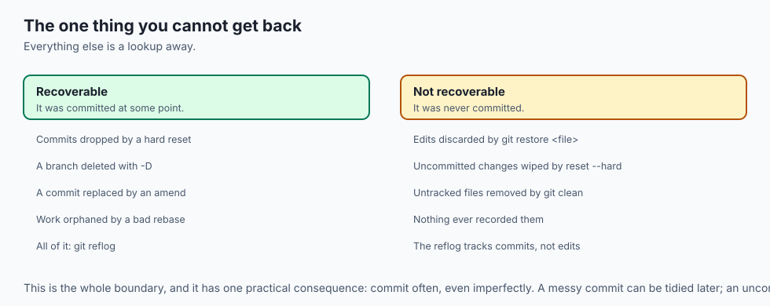

- **Undoing means moving changes between three places**, or moving one pointer. That
  is the entire trick.
- **The working tree is your files on disk.** The index is the proposed next snapshot.
  `HEAD` points at your latest commit.
- **`git add` moves a change from the working tree into the index.** The undo commands
  move things the other way, or slide `HEAD`.
- **Reset rewrites history; revert adds to it.** Which you want depends entirely on
  whether anyone else has the commits.
- **The reflog records everywhere `HEAD` has been**, which is why a "lost" commit
  usually is not.

---

## Historical background

- **Git's undo commands accumulated rather than being designed**, which is why they
  overlap confusingly.
- **`checkout` in particular did too many unrelated jobs** — switching branches,
  restoring files, inspecting commits — with wildly different consequences.
- **`git switch` and `git restore` arrived in 2019** to split it, and are the
  commands to learn now.
- **The reflog was added early and quietly**, as an internal safety mechanism rather
  than a feature.
- **It turned out to be the most valuable recovery tool in the system**, and it is
  still barely mentioned in most introductions.
- **The design principle underneath is consistent**: commits are immutable and
  content-addressed, so "removing" one only ever unreferences it.

---

## What it is — and what it is not

**These commands are:**

- Ways of moving content between the working tree, the index and `HEAD`.
- Mostly reversible, because commits are not deleted when they stop being referenced.
- Distinguished by *reach*: how far into the three areas each one goes.

**They are not:**

- **Not uniformly safe.** `git reset --hard` and `git restore <file>` genuinely destroy
  uncommitted work.
- **Not interchangeable.** Reset and revert produce different histories and have
  different consequences for other people.
- **Not able to recover what was never committed.** The reflog tracks commits; it knows
  nothing about edits you never staged.
- **Not permanent in their destruction of commits**, at least for a while. An
  unreferenced commit survives until garbage collection.

---

## Why it was created and what problems it solves

- **Mistakes are normal.** A system with no undo is a system people are afraid of.
- **Commits are made too early.** Amend and soft reset exist because you notice things
  a second after committing.
- **Shared history cannot be rewritten** without hurting others, so an additive undo
  was necessary.
- **Experiments need a clean exit.** Hard reset is how you return to a known state
  after a direction fails.
- **Recovery needed a mechanism.** The reflog exists so that "I destroyed my work" is
  almost always false.

---

## How it works

### The three trees

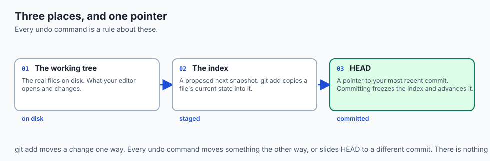

- **The working tree** is the real files on disk, the ones your editor opens.
- **The index** (staging area) is a proposed next snapshot. `git add file.py` copies
  that file's current state into it.
- **`HEAD`** points at your most recent commit on the current branch.
- **A commit freezes the index into a new snapshot** and advances `HEAD` to it.
- **Undo commands move changes between these areas, or move `HEAD`.** Keep the three
  in mind and every command below stops being magic.

### Fixing the last commit

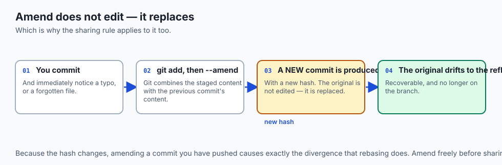

```bash
git commit --amend -m "Fix typo in the data loader"
```

- **Git combines the staged content with the previous commit** and produces a *new*
  commit replacing the last one.
- **Forgot a file?** `git add` it first, then amend, and it folds into the same commit.
- **The original is not edited — it is replaced**, with a new hash, and the old one
  drifts into the reflog.
- **So the rule is the same as for reset**: amend only what you have not shared.

### Un-staging and discarding

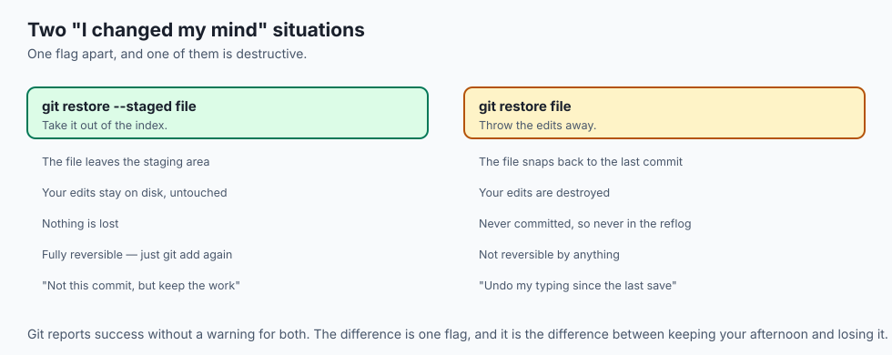

```bash
git restore --staged notes.md   # un-stage, keep the edits
git restore notes.md            # discard the edits entirely
```

- **The first takes the file out of the index** while your edits stay on disk.
- **The second is destructive to uncommitted work.** The edits are gone, because they
  were never committed and never in the reflog.
- **Git prints a warning-free success.** Respect the command.
- **The older equivalents still work**: `git reset HEAD <file>` and
  `git checkout -- <file>`.

### Reset in depth

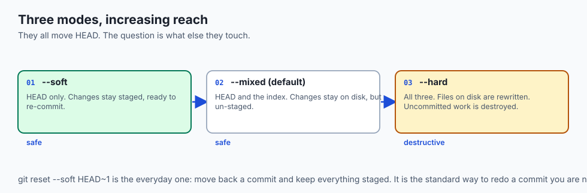

`git reset <commit>` always moves the branch pointer. The modes differ in how far the
change reaches.

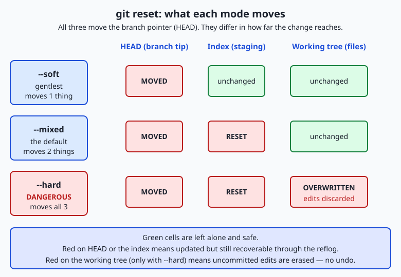

| Mode | Moves HEAD | Resets index | Resets working tree | Typical use |
| --- | --- | --- | --- | --- |
| `--soft` | yes | no | no | Redo or combine the last commit, keeping every change staged |
| `--mixed` (default) | yes | yes | no | Un-commit and un-stage, to re-stage differently |
| `--hard` | yes | yes | yes | Discard commits *and* uncommitted work, to return to a known state |

- **`git reset --soft HEAD~1`** is the everyday one: move back a commit, keep
  everything staged.
- **`HEAD~1` means one commit before `HEAD`**; `HEAD~2` means two.
- **`--hard` is the dangerous mode.** Right for wiping a failed experiment, wrong any
  time you have working changes you might still want.

### Undoing a shared commit

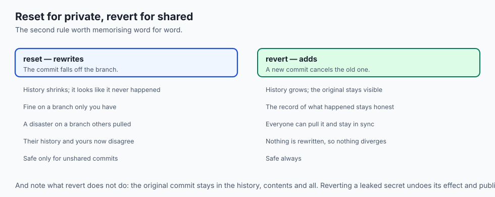

```bash
git revert a1b2c3d
```

- **Git computes the exact inverse** — every line added becomes a line removed — and
  records it as a brand-new commit on top of your branch.
- **The original stays in history**, and the new commit cancels its effect.
- **Because you only added a commit**, everyone else can pull your revert and stay in
  sync.

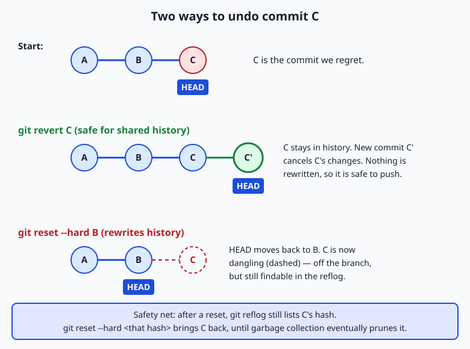

- **Down the revert path**, commit C remains and C' undoes it — history grows.
- **Down the reset path**, `HEAD` slides back to B and C falls off into a dangling
  state — history is rewritten.
- **The rule: reset for private history, revert for shared history.**

### The safety net: reflog

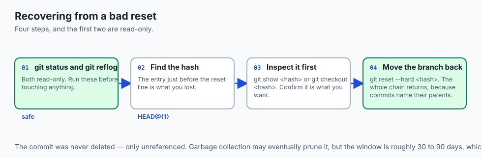

```bash
git reflog
```

- **Every time `HEAD` moves** — commit, checkout, reset, rebase, amend, merge — Git
  appends a line recording where it went.
- **You get entries like** `a1b2c3d HEAD@{0}: commit: add feature` and
  `9f8e7d6 HEAD@{1}: reset: moving to HEAD~2`.
- **After a reset drops a commit, its hash is still there.** Move your branch back with
  `git reset --hard <hash>`, or inspect it first with `git checkout <hash>`.
- **The commit was never gone; it was only unreferenced.**
- **The reflog is local and private.** It never travels to a remote and records only
  your own actions.
- **It is not eternal.** Roughly 90 days for reachable commits and at least 30 for
  unreachable ones, after which garbage collection may prune them.
- **That window is enormous compared to how fast you notice a mistake**, which is why
  "check the reflog" resolves most Git panics.

---

## An everyday analogy

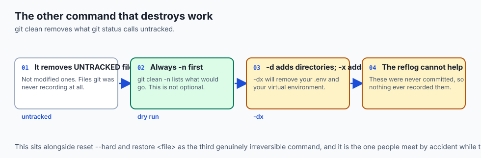

A word processor with three levels of undo.

| Writing | Git |
| --- | --- |
| The text on screen | The working tree |
| Text selected, ready to save | The index |
| The last saved version | `HEAD` |
| Correcting the file name you just saved under | `--amend` |
| Deselecting without deleting | `restore --staged` |
| Undoing your typing since the last save | `restore <file>` — destructive |
| Publishing a correction notice | `revert` |
| Pretending the last chapter was never written | `reset` |
| The application's crash-recovery log | The reflog |

- **A correction notice and quietly reprinting the book** are different acts. One is
  honest to readers who already have a copy; the other is not.
- **The crash-recovery log is the thing nobody knows about** until the day it saves
  them.

---

## Examples in practice

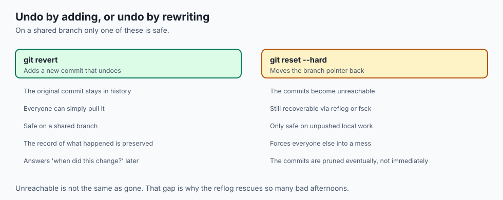

- **A typo in a commit message**, fixed with `--amend` seconds later.
- **Three messy commits squashed into one** with `git reset --soft HEAD~3` and a fresh
  commit.
- **A bad deploy reverted on main**, additively, so everyone's clone stays consistent.
- **A hard reset that destroyed an afternoon of uncommitted edits**, which the reflog
  could not help with because they were never committed.
- **A "lost" branch recovered from the reflog** twenty minutes after it was deleted.

---

## Implications: security, privacy, performance, scalability, and cost

- **Security: reverting a leaked secret does not remove it.** The original commit stays
  in history, readable. Revoke it — the same conclusion as Days 25, 29 and 32.
- **Rewriting history to remove a secret** requires rewriting every subsequent commit,
  and every clone that already exists still has the original.
- **Privacy: the reflog is local**, which means a colleague cannot see your false
  starts — and also that it protects nobody but you.
- **Performance: all of these are local and instant**, however large the history.
- **Cost: the only unrecoverable losses are uncommitted.** Committing often, even
  imperfectly, is what makes everything else reversible.
- **Cost of the wrong choice on a shared branch** is hours of confusion for everyone
  downstream, and it is entirely avoidable by preferring revert.

---

## Alternatives: free, open source, and commercial

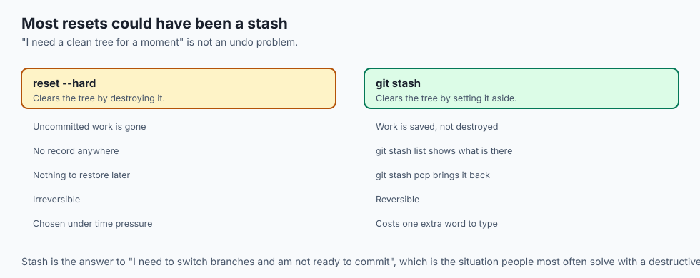

| Tool | Type | Where it fits |
| --- | --- | --- |
| `git revert` | Free, built in | Anything already shared. The safe default. |
| `git reset` | Free, built in | Your own unshared commits |
| `git restore` | Free, built in | Files, staged or unstaged |
| `git stash` | Free, built in | Setting changes aside without committing |
| `git reflog` | Free, built in | Recovery, when something has gone wrong |
| `git fsck --lost-found` | Free, built in | Finding dangling commits the reflog missed |

- **Learn `git stash` alongside these.** It is the answer to "I need to switch branches
  and I am not ready to commit", and it avoids most of the situations where you would
  reach for a reset.
- **`git reflog` is the one to memorise.** It is the difference between a bad ten
  minutes and a bad day.

---

## Comparison with related concepts

| Term | What it actually is |
| --- | --- |
| **Working tree** | The files on disk |
| **Index** | The proposed next snapshot |
| **`HEAD`** | A pointer to your latest commit |
| **Amend** | Replacing the last commit with a new one |
| **Reset** | Moving the branch pointer, with varying reach |
| **Revert** | A new commit that inverts an old one |
| **Reflog** | A local log of everywhere `HEAD` has been |

---

## When to use it — and when not to

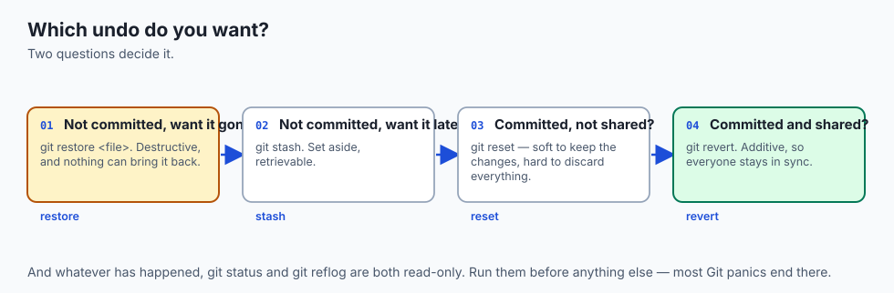

- **Use `revert` for anything you have pushed.** It is additive, and everyone stays in
  sync.
- **Use `reset --soft` to redo a commit** you are not happy with, keeping the changes.
- **Use `reset --hard` only to abandon work deliberately**, and check `git status`
  first.
- **Use `git stash`** rather than a reset when you simply need the working tree clean
  for a moment.
- **Do not `reset --hard` with uncommitted changes** you have not looked at. The reflog
  cannot bring those back.
- **Do not amend or reset anything you have shared.** That is Day 31's rule, and it
  applies to every history-rewriting command.
- **Do not panic and start trying commands.** Run `git reflog` and `git status` first;
  they are both read-only.

---

## The AI connection

- **A failed experiment should be cheap to abandon**, and `reset --hard` on an
  experiment branch is exactly that.
- **`reset --soft` is how you tidy a messy experiment** into commits someone could read
  — before you share it, never after.
- **Reverting a bad model config on main** keeps everyone's clone consistent, which
  matters more the more people are running training jobs.
- **The reflog has recovered many a "deleted" experiment branch**, which is a genuinely
  common panic.
- **None of this recovers a model checkpoint**, because those are not in Git. That is
  what artifact storage is for, and it needs its own discipline.

---

## Knowledge check

```yaml
quiz:
  question: "After `git reset --hard HEAD~2`, a developer realises the two dropped commits were needed. They also had uncommitted edits to a third file. What can be recovered?"
  options:
    - "The two commits, from the reflog; the uncommitted edits are gone permanently"
    - "Both the commits and the edits, since --hard preserves the working tree in the reflog"
    - "Neither, because a hard reset removes commits from the object database"
    - "The uncommitted edits only, since dropped commits are garbage collected immediately"
  answer_index: 0
  explanation: "The commits were unreferenced rather than deleted, and their hashes are in the reflog. The uncommitted edits were never committed, so nothing ever recorded them — which is exactly why --hard is dangerous when the working tree is not clean."
```

---

## Hands-on exercise

Break a throwaway repository on purpose, then bring it back. Worked through fully in
the Day 34 lab directory. Because you build a fresh repository just for this, there
is nothing of value to lose — so be fearless.

```bash
mkdir /tmp/undo-practice && cd /tmp/undo-practice
git init
git config user.email "you@example.com"
git config user.name "Undo Practice"
echo "line 1" > notes.txt
git add notes.txt
git commit -m "Frist commit"
```

| What you are doing | Command |
| --- | --- |
| Fix the misspelled message | `git commit --amend -m "First commit"` |
| Confirm the hash changed | `git log --oneline` |
| Make two more commits | edit, add, commit — twice |
| Simulate the disaster | `git reset --hard HEAD~2` |
| Find what was lost | `git reflog` |
| Bring it back | `git reset --hard <hash from the reflog>` |

### Expected output

```text
[main 8c1d2e3] First commit
HEAD is now at 8c1d2e3 First commit
5a6b7c8 HEAD@{0}: reset: moving to HEAD~2
2f3e4d5 HEAD@{1}: commit: Third commit
9a8b7c6 HEAD@{2}: commit: Second commit
8c1d2e3 HEAD@{3}: commit (amend): First commit
2f3e4d5 Third commit
9a8b7c6 Second commit
8c1d2e3 First commit
```

- **All three commits are back.** The two the hard reset "removed" were in the reflog
  the whole time.
- **Pointing the branch at the newest one restored the entire chain**, because each
  commit points to its parent.

### Validate your work

- [ ] You amended a commit and confirmed its hash changed
- [ ] You used all three reset modes and can state what each moved
- [ ] You recovered dropped commits from the reflog
- [ ] You reverted a commit and can explain why the original is still in the log
- [ ] You can state which single thing in this lesson is genuinely unrecoverable
- [ ] `bash tests/run_tests.sh` reports 0 failures

### Troubleshooting

- **`git reflog` is empty.** It is per-repository and per-clone. A fresh clone has no
  record of what you did elsewhere.
- **`checkout <hash>` warns about a detached HEAD.** Expected — you are on a commit,
  not a branch. Create a branch there if you want to keep it.
- **The reflog entry you want has scrolled past.** `git reflog | head -40`, or
  `git fsck --lost-found` for dangling commits.
- **Amend refuses on a merge commit.** Different situation, different tools.

### Common mistakes

- **`reset --hard` without running `git status` first.**
- **Reverting a secret and considering it handled.**
- **Rewriting shared history**, then force-pushing over it.
- **Panicking and running commands** before running the two read-only ones.

---

## Practice assignment

- **Practise each undo on a throwaway repository** until you can predict what
  `git status` will say before running it.
- **Deliberately lose a commit and recover it**, three times, until the reflog is the
  first thing you reach for rather than the last.
- **Revert a commit on a branch you have pushed**, and confirm a second clone stays in
  sync after pulling.
- **Try to recover uncommitted changes after a `--hard`**, and confirm for yourself
  that you cannot. That is the boundary worth knowing exactly.

---

## Extension challenge

- **Recover a deleted branch** from the reflog after `git branch -D`, and explain why
  the commits survived the branch being removed.
- **Use `git fsck --lost-found`** to find a dangling commit that is not in the reflog,
  and work out how it got there.
- **Squash five commits two different ways** — `reset --soft` and `rebase -i` — and
  compare the resulting histories and hashes.
- **Set up `git stash` in your workflow** for a week, and count how many resets it made
  unnecessary.

---

