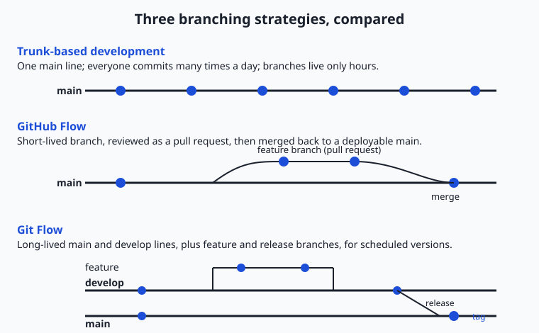

## Why this matters

You now know how to make commits, branch, merge, push to a remote, open a pull request, and undo mistakes. Those are the notes of the language. This lesson is where you learn to speak it in sentences — to use git the way a working team uses it, so that a repository stays understandable, releasable, and safe with ten people committing to it instead of one.

The stakes are concrete, and they are not abstract "good practice." A tangled history is where debugging goes to die: when a model's accuracy silently drops next Tuesday, the fastest way to find the cause is `git bisect` across a clean, atomic history — and that only works if each commit does one thing. A missing release tag is why a colleague cannot reproduce the exact code and data that produced last month's published result. A 2 GB dataset committed straight into the repository is why every teammate's clone now takes twenty minutes and your storage bill quietly climbs. A vague commit message — "fixes" — is the difference between a five-minute review and an hour of confused questions. The habits in this lesson are what separate a repository that a team can move fast in from one that everyone is quietly afraid to touch.

Throughout, keep one picture in mind: a **publishing house** producing a book that is edited by many writers at once. The master manuscript lives in a binder on a shelf, and it must always be print-ready. Writers take photocopies to their desks to draft changes, editors review marked-up pages before anything goes back into the binder, and the day a finished edition ships to the printer, someone photographs the exact manuscript and labels it "first edition." Git is that binder, those photocopies, that editorial desk, and that archive — all at once.

## The idea in plain language

A *workflow* is the shared set of rules a team agrees on for how changes flow from an idea to the main line of the project. Git itself is unopinionated: it will let you commit anything, anywhere, in any order. A workflow adds the discipline that git leaves out — where work happens (which branches), how it gets reviewed (pull requests), how often it merges (continuously, or in big batches), and how finished versions are marked (tags).

Most teams converge on a small number of named workflows. **Trunk-based development** keeps everyone committing to one main branch (the "trunk") many times a day, with branches that live for hours, not weeks. **GitHub Flow** is a lightweight version: branch off main, open a pull request, get it reviewed, merge, deploy — and main is always deployable. **Git Flow** is a heavier scheme with long-lived `develop` and `release` branches, suited to software that ships in scheduled versions rather than continuously. None is universally "best"; each fits a different release rhythm.

Around whatever branching model you choose sit a handful of hygiene habits that matter regardless: writing **atomic commits** (one logical change each) with clear messages; **tagging** releases with a version number that means something; keeping the history clean enough to read; telling git to **ignore** files that should never be committed; and keeping enormous files out of the repository's normal storage. Learn these once and they transfer to every project you ever touch.

## Historical background

Version control is older than git. In 1972 at Bell Labs, Marc Rochkind built the Source Code Control System (SCCS), which tracked revisions of individual files. The Revision Control System (RCS), by Walter Tichy in 1982, refined the idea. These were file-at-a-time tools with no notion of a project-wide snapshot. Centralized systems followed — CVS in 1990, then Apache Subversion (SVN) in 2000 — which stored history on a single central server that every developer talked to. They worked, but branching was expensive and slow, and the central server was a single point of failure.

The distributed generation changed the model: every clone holds the full history. BitKeeper, a commercial distributed tool, was used by the Linux kernel project in the early 2000s. When the free-of-charge arrangement for kernel developers ended in 2005, Linus Torvalds wrote git in a matter of weeks to replace it, prioritizing speed, a fully distributed design, and strong integrity guarantees for the kernel's enormous, fast-moving codebase. Git's first release was in April 2005.

The *workflows* came later, as conventions layered on top of the tool. In 2010 Vincent Driessen published a blog post titled "A successful Git branching model," which the community came to call **Git Flow** — the first widely adopted branching discipline. As continuous deployment spread, lighter models pushed back: GitHub described its own simpler **GitHub Flow**, and the long-running practice of **trunk-based development** (with roots in decades of continuous-integration thinking) was documented and championed as teams moved to shipping many times a day. In 2013 Tom Preston-Werner published **Semantic Versioning 2.0.0**, giving version numbers a precise meaning, and the **Conventional Commits** specification (v1.0.0) later standardized commit-message structure so that both humans and tools could read a project's history. The tool is old; the shared etiquette around it is what this lesson teaches.

## What it is — and what it is not

A git workflow *is* a social agreement encoded in a few technical conventions: which branches exist and what each is for, how a change earns its way into the main line, and how released versions are labeled and preserved. It is a set of promises a team makes to itself so that any member can pick up any part of the project and understand its state.

A workflow is *not* a feature of git you turn on. Git has no built-in concept of "GitHub Flow" or "a release" — these are patterns you enact with ordinary branches, merges, and tags. It is also not a fixed rulebook handed down from on high: a solo hobby project and a hundred-person product need very different amounts of ceremony, and choosing more process than your project needs is itself a mistake. And a workflow is not a substitute for communication — it makes collaboration legible, but it cannot replace talking to your teammates about what you are building.

| Misconception | The reality |
| --- | --- |
| "There is one correct git workflow." | The right workflow depends on release rhythm and team size; trunk-based, GitHub Flow, and Git Flow each fit different situations. |
| "More branches means more organized." | Long-lived branches drift apart and cause painful merges; most healthy teams keep branches short and merge often. |
| "A commit message just needs to exist." | Messages are documentation read far more often than written; a vague message costs every future reader time. |
| "Tags and branches are basically the same." | A branch is a moving pointer that advances with new commits; a tag is a fixed label pinned to one commit forever. |
| "Rebasing is a more powerful merge." | Rebase rewrites history; it is for tidying *local* work, and rewriting shared history breaks everyone else's clone. |

## Why it was created and what problems it solves

When more than one person edits the same project, four problems appear immediately, and workflows exist to answer each. The first is *coordination*: if everyone commits directly to one line with no review, mistakes reach the main branch unchecked and the branch stops being trustworthy. Pull requests and branching models solve this by giving every change a place to be seen before it lands.

The second is *reproducibility*: months later, someone needs the exact code that produced a specific released result — a shipped app version, a published benchmark, a trained model. Tags solve this by pinning an immutable, human-readable name to one commit, so "give me `v1.4.0`" is an exact request. The third is *legibility*: a history of five hundred commits called "wip" and "fix" is useless for finding when a bug entered or writing release notes, whereas atomic commits with structured messages turn the log into a searchable record. The fourth is *scale of content*: repositories are optimized for text that changes line by line, and large binary files (datasets, model checkpoints, images, video) bloat them badly — Git LFS and clear `.gitignore` rules solve this by keeping the wrong kind of file out of the wrong kind of storage. Every convention below is an answer to one of these four pressures.

## How it works

Let us walk through the machinery in the order a team actually uses it: choose a branching model, commit cleanly into it, review and merge, then tag what you release.

### Branching strategies, compared

A branching strategy answers one question: where does work-in-progress live before it becomes part of the finished project? The three common answers trade speed against structure.



**Trunk-based development** keeps a single `main` branch that everyone commits to, ideally several times a day. Branches, when used at all, live for a few hours before merging. Because everyone integrates constantly, changes never drift far apart and merge conflicts stay tiny — but it demands strong automated testing on every commit, because there is no long review buffer. In the publishing analogy, every writer works on small edits and slips them back into the master binder the same afternoon, so no two photocopies ever diverge for long.

**GitHub Flow** adds one light layer: create a short-lived branch off `main`, do your work, open a pull request, get it reviewed, then merge back to `main` — which is always kept deployable. It is trunk-based development with a review gate, and it is the default for a huge number of teams because it is simple and keeps `main` releasable at all times. The writer takes a photocopy of one chapter to their desk, the editor reviews the marked-up pages, and only then do they go into the binder.

**Git Flow** is heavier. It maintains two long-lived branches — `main` (only ever holds released versions) and `develop` (the integration line) — plus temporary `feature/*`, `release/*`, and `hotfix/*` branches. Work merges into `develop`; when a version is ready, a `release/*` branch stabilizes it before merging to `main` and tagging. This suits software with scheduled, versioned releases (installed desktop apps, libraries with support windows) but is often too much ceremony for something that deploys continuously. It is a publishing house that maintains a separate "next edition" working binder and only moves finished editions to the archive shelf.

**Release branches** are the piece Git Flow formalizes but any model can borrow: when you are preparing version 2.0, you cut a `release/2.0` branch so that last-minute bug fixes for 2.0 can happen while ongoing work continues on `main`. It lets you support an old version without freezing new development.

| Workflow | Branch structure | Merges to main | Best for | Cost |
| --- | --- | --- | --- | --- |
| Trunk-based development | One `main`; branches live hours | Many times a day | Teams with strong automated tests deploying continuously | Requires excellent test automation; little review buffer |
| GitHub Flow | Short-lived branch per change + pull request | Per reviewed change | Most web apps and services; small-to-medium teams | Very low; needs a review culture |
| Git Flow | Long-lived `main` + `develop`, plus `feature`/`release`/`hotfix` | Only at release time | Versioned/installed software with scheduled releases | Heavy; many branches to track |
| Release branches | A `release/x.y` branch cut per version | Fixes cherry-picked in | Supporting multiple live versions at once | Extra maintenance per supported version |

### Commit hygiene

A commit is the atom of history, and its quality determines how usable that history is. An **atomic commit** contains exactly one logical change — one bug fix, one feature increment, one refactor — and nothing else. Atomic commits make three powerful tools possible: reverting one change without disturbing others, reviewing a change in isolation, and using `git bisect` to binary-search history for the commit that introduced a bug. The opposite — a "sloppy" commit that mixes a bug fix, a formatting sweep, and half a new feature — cannot be reverted cleanly, is exhausting to review, and hides which line actually mattered.

A good commit *message* explains the change to a future reader. The widely used shape is a short imperative subject line (about 50 characters, "Add retry to upload," not "Added" or "Adds"), a blank line, then a body that explains *why* the change was made — the code already shows *what* changed. **Conventional Commits** formalizes the subject line into `type(scope): description`, where `type` is a small vocabulary: `feat` (a new feature), `fix` (a bug fix), `docs`, `refactor`, `test`, `chore`, and a few more. A `feat:` or `fix:` marks user-facing change; adding `!` or a `BREAKING CHANGE:` footer marks an incompatible one. The payoff is that tools can read the log — counting `feat:` and `fix:` commits to suggest the next version number, or generating a changelog automatically — while humans get a scannable, consistent history.

### Tags and semantic versioning

A **tag** is a fixed name pinned to one specific commit. Unlike a branch, it never moves. Tags come in two kinds: a *lightweight* tag is just a name pointing at a commit, while an *annotated* tag (created with `git tag -a`) is a full object storing the tagger, date, and a message — and annotated tags are what you use for releases, because they carry a record of who cut the release and when.

The name you give a release tag should mean something, which is what **Semantic Versioning** provides. A semver version is `MAJOR.MINOR.PATCH` — for example `2.4.1`. You increment `PATCH` for backward-compatible bug fixes, `MINOR` for backward-compatible new features, and `MAJOR` for changes that break compatibility. So a user reading `1.4.0 → 1.5.0` knows to expect new features but no breakage, while `1.5.0 → 2.0.0` warns them that something they depend on may have changed. Optional suffixes like `-alpha.1` or `-rc.2` mark pre-releases. This is the numbering rule the publishing house uses for its editions.

The two conventions connect: a Conventional Commit's type tells you which semver part to bump, which is exactly how automated release tools decide the next version. This table maps the common commit types to their meaning and their effect on the version number:

| Conventional Commit type | Meaning | Semver bump | Example version step |
| --- | --- | --- | --- |
| `fix:` | A backward-compatible bug fix | PATCH | `1.4.2 → 1.4.3` |
| `feat:` | A backward-compatible new feature | MINOR | `1.4.2 → 1.5.0` |
| `feat!:` / `BREAKING CHANGE:` | An incompatible change | MAJOR | `1.4.2 → 2.0.0` |
| `docs:` / `test:` / `chore:` / `refactor:` | Internal or non-user-facing change | none | `1.4.2` (unchanged) |



### Keeping history clean — and when not to

Two tools tidy history: **squash** and **rebase**. Squashing combines several commits into one — useful when a feature branch accumulated ten "wip" commits that should reach `main` as a single clean change. Rebasing replays your commits on top of the latest `main`, producing a straight line instead of a merge bubble. Both make history easier to read.

Both also *rewrite* history — they create new commits with new identities — and that is the source of the one rule you must never break: **do not rewrite history that others have already pulled.** Rebasing or squashing your own local, unpushed commits is safe and encouraged. Rebasing a shared branch that teammates have based work on rewrites the commits under their feet, and their next pull turns into a mess. The safe habit: tidy your own branch before it is reviewed; never rewrite `main` or any branch others share.

### Repo hygiene: .gitignore, large files, and repo shape

A **`.gitignore`** file lists path patterns git should never track — build outputs, dependency folders (`node_modules/`), secret files (`.env`), editor cruft (`.DS_Store`), and large generated artifacts. Ignoring them keeps the repository small, avoids leaking secrets, and stops noisy diffs. It is the scratch paper the writers use but never file into the binder.

Some files *must* be versioned but are far too large for git's line-by-line storage — datasets, model checkpoints, images, audio. **Git LFS (Large File Storage)** solves this: it stores a tiny text pointer in the repository and keeps the real bytes in a separate store, so cloning does not drag every version of a multi-gigabyte file. In the analogy, the giant cover-art posters go in a flat-file drawer, and only a reference slip sits in the binder.

At the largest scale, teams choose a repository *shape*. A **monorepo** holds many projects in one repository (one giant binder for the whole imprint); a **polyrepo** setup gives each project its own repository (one binder per book). Monorepos make cross-project changes atomic and simplify shared tooling but need scale-aware tools; polyrepos keep each project independent but make coordinated changes harder. Most beginners start with one repository per project and rarely need to decide this early.

### Hooks: automation before a commit lands

A **git hook** is a script git runs automatically at a point in its lifecycle. The most useful for hygiene is `pre-commit`, which runs before a commit is recorded and can reject it — running a formatter, a linter, a secret scanner, or a quick test. This is the copy-desk checklist that runs automatically before any change is accepted into the binder, catching mistakes before they ever reach review. You will build real hooks in Week 6; today you only need to know the concept exists and that it is where commit-time automation lives.

## An everyday analogy

Hold the whole publishing house in view, because every piece of this lesson maps onto it cleanly. The **master manuscript** in its binder on the shelf is `main`: it must always be print-ready, because at any moment someone might send it to the printer. A **writer's photocopy** carried to their desk is a feature branch — a private place to draft without disturbing the master. The **editor's review of marked-up pages**, before they are filed back into the binder, is the pull request; nothing enters the master without that review.

A **standardized note clipped to each change** ("fix: corrected the dosage table," "feat: added a chapter on stocks") is the Conventional Commit message, so anyone flipping through the change log understands each edit at a glance. When a finished edition ships, someone **photographs the exact manuscript and labels the photo "First edition, v1.0.0"** — that immutable snapshot is an annotated tag, and the numbering follows the house's edition rules (semantic versioning). **Tidying your own desk notes** into a clean stack before handing them to the editor is squashing and rebasing your local commits — perfectly fine — but you would never sneak into the shared binder and secretly re-write pages other writers are already quoting, which is why rewriting shared history is forbidden. The **scratch paper** you never file is `.gitignore`; the **cover posters in the flat-file drawer** are Git LFS; and the **copy-desk checklist run automatically** before any change is accepted is the pre-commit hook. Different houses run different processes — a small zine needs almost none, a multi-volume encyclopedia needs a strict one — and that choice is exactly picking a branching strategy.

## Examples in practice

Here is GitHub Flow as a real sequence of commands, the same flow you run for a genuine team change. You branch, make two atomic commits with Conventional Commit messages, then merge back with a merge commit that preserves the fact that this was a reviewed unit of work:

```bash
# Start from an up-to-date main
git switch main
git switch -c feat/add-search       # short-lived feature branch

# ... edit files ...
git add search.py
git commit -m "feat: add case-insensitive note search"

# ... fix a small bug you noticed ...
git add search.py
git commit -m "fix: handle empty query without crashing"

# Merge back as a reviewed unit (like merging a pull request)
git switch main
git merge --no-ff feat/add-search   # --no-ff keeps a merge commit as a record
```

The `--no-ff` flag ("no fast-forward") forces git to create a merge commit even when it could just slide `main` forward, so the history permanently records that these commits arrived together as one reviewed change — exactly what a merged pull request looks like. Now you cut a release:

```bash
git tag -a v1.0.0 -m "First release: note search"
git tag                              # lists: v1.0.0
git log --oneline --decorate        # shows the tag pinned to the merge commit
```

The `-a` makes it an annotated tag with your name, the date, and that message baked in. The version `v1.0.0` is a deliberate semver choice: this is the first stable public release, so `MAJOR` is 1, with no features or fixes on top yet, so `MINOR` and `PATCH` are 0. When you later add a backward-compatible feature it becomes `v1.1.0`; a bug-fix-only follow-up would be `v1.0.1`; a breaking change would jump to `v2.0.0`.

Now the atomic-versus-sloppy contrast in practice. Suppose you fixed a crash *and* reformatted a file *and* started a new feature. The sloppy version is one commit:

```bash
git commit -m "stuff"        # a crash fix, a reformat, and half a feature, all at once
```

Six weeks later a bug appears and you want to revert just the reformat — you cannot, because reverting this commit also rips out the crash fix and the half-feature. The atomic version keeps them separate:

```bash
git add crash.py && git commit -m "fix: guard against missing config file"
git add -p format.py && git commit -m "refactor: reformat parser for readability"
git add feature.py && git commit -m "feat: begin CSV export (parser only)"
```

Now each change can be reviewed, reverted, or bisected independently. The extra thirty seconds at commit time buys you hours later — this is the single highest-leverage habit in the lesson.

This lesson closes the "Git and GitHub" category (Days 29–35), and every day built toward this one. Day 29 asked *why version control exists*; Day 30 gave you the core mechanics of repositories, staging, and commits; Day 31 added branching and merging; Day 32 connected your work to remotes; Day 33 introduced pull requests and code review; Day 34 taught you to undo things safely with reset, revert, and reflog. Today those pieces become a single disciplined practice. They come together in this week's project, the **Versioned Notes Repository** — a repository for your course notes with real branches, a merged pull request, a resolved conflict, and a clean, tagged history — which is exactly the workflow you have now assembled end to end.

## Implications: security, privacy, performance, scalability, and cost

**Security.** The most common repository security failure is committing a secret — an API key, a password, a token — into history, where it lives forever even after you "delete" it, because every clone still holds the old commit. A `.gitignore` that excludes `.env` and credential files, combined with a pre-commit secret scanner, prevents this at the source. Signed, annotated tags let a team verify that a release came from who it claims to.

**Privacy.** Git history records the author name and email on every commit and the exact content of every change. Contributors should decide deliberately what identity to commit under, and teams should know that anything ever committed — including a file deleted in a later commit — remains recoverable in history unless the history is deliberately rewritten and re-pushed.

**Performance.** Repository performance degrades mainly from large binary files bloating history; keeping them out (via `.gitignore`) or in Git LFS keeps clones fast. Short-lived branches also perform better socially: they produce small, fast merges instead of the slow, conflict-heavy merges that long-lived branches accumulate.

**Scalability.** Workflow choice is fundamentally a scaling decision. A workflow that works for two people (commit straight to main, talk across the desk) breaks at twenty (you need review gates and a branching model), and a monorepo that is fine at ten projects needs specialized tooling at a thousand. The right amount of process grows with the team.

**Cost.** Cost shows up as time and storage. Time: a clean, atomic history with good messages makes debugging, review, and onboarding dramatically cheaper — a tangled history is a recurring tax paid by everyone who touches the repo. Storage: bloated repositories cost real money to host and slow to clone, and hosted Git LFS storage and bandwidth are commonly metered, so the shape of your repository shows up on a bill.

## Alternatives: free, open source, and commercial

The tooling around workflows is almost entirely free and open source. The following are the leading options, when to reach for each, and how they are used.

The **git command-line interface** is the foundation — every workflow in this lesson is expressed in ordinary `git` commands (`switch`, `commit`, `merge`, `tag`, `log`). It is free, open source, and installed everywhere; learn it first, because every graphical tool is a wrapper over it. The **pre-commit framework** is a widely used tool for managing `pre-commit` hooks from a single config file: you list the checks you want (formatters, linters, secret scanners) and it installs and runs them automatically before each commit. Reach for it the moment a project has more than one contributor; it is free and open source. **Conventional Commits tooling** turns your structured messages into automation: a message *linter* (such as commitlint) can reject commits that do not follow the convention, and a *changelog generator* can read the `feat:`/`fix:` history and produce release notes and suggest the next semantic version automatically. These are free and open source, and worth adopting once a project cuts real releases.

On workflow choice itself, the two live alternatives for most teams are **GitHub Flow** and **Git Flow**. Choose GitHub Flow (branch, pull request, merge, deploy; `main` always deployable) when you deploy frequently and want minimal ceremony — this covers most web services and small teams. Choose Git Flow (long-lived `develop` and `release` branches) when you ship discrete, versioned releases that must be stabilized and supported over time, such as installed applications or libraries with multiple maintained versions. Trunk-based development sits at the low-ceremony extreme and is excellent when your automated tests are strong enough to catch problems without a review buffer. All of these are conventions, not products, so all are free; the only "commercial" element is the hosting platform you push to, which typically offers a free tier for individuals and small teams.

## Comparison with related concepts

| Concept A | Concept B | Key difference |
| --- | --- | --- |
| Branch | Tag | A branch is a moving pointer that advances with each new commit; a tag is a fixed label pinned to one commit forever |
| Merge (`--no-ff`) | Rebase | A merge preserves both histories and records where they joined; a rebase rewrites your commits onto a new base for a straight, linear history |
| Squash | Merge | Squashing collapses many commits into one before it lands; a plain merge keeps every commit as-is |
| GitHub Flow | Git Flow | GitHub Flow has one main line and short-lived branches; Git Flow adds long-lived `develop` and `release` branches for scheduled versions |
| `.gitignore` | Git LFS | `.gitignore` keeps files *out* of the repository entirely; Git LFS keeps large files *in* the project but stores their bytes separately |
| Lightweight tag | Annotated tag | A lightweight tag is just a name on a commit; an annotated tag also stores the tagger, date, and a message, and is what releases use |

## When to use it — and when not to

Reach for a defined workflow the moment more than one person touches a repository, or the moment a solo project starts producing releases other people depend on. Pick GitHub Flow as a sensible default: it is simple, keeps `main` releasable, and its pull-request gate scales from two contributors to many. Reach for tags and semantic versioning whenever you ship anything a colleague or user will refer to by version — a released tool, a published result, a dataset snapshot. Reach for atomic commits and clear messages *always*; they cost seconds and save hours, and they are the habit that most distinguishes a professional history from an amateur one.

Know when *less* process is right. A solo experiment you will throw away next week does not need a branching model, release tags, or a changelog — committing to `main` with reasonable messages is entirely appropriate, and imposing Git Flow on it is pure friction. Do not adopt Git Flow's long-lived branches for something that deploys continuously; you will fight merge conflicts for no benefit. Do not rewrite shared history to make it "prettier"; the cost to your teammates dwarfs the tidiness. And do not put large binaries or secrets into the repository at all — that is a `.gitignore` or Git LFS decision, not a "we'll clean it up later" one, because in git, later is often too late. The professional instinct is to match the ceremony to the project: enough discipline that the repository stays legible and releasable, and not one rule more.

The through-line for your work ahead is reproducibility. Machine-learning projects live or die on being able to reproduce a result, and that is a git-workflow problem before it is anything else: the code is versioned in ordinary commits, experiments run in short-lived branches merged through pull requests with automated checks on every one, and each meaningful release — of code, of a dataset, of a trained model — is pinned with a semantic-versioned tag, with the multi-gigabyte artifacts kept in Git LFS rather than bloating the repository. When someone asks "which exact code and data produced this number?", a disciplined workflow answers in one command, and a tangled one answers "we're not sure." Everything you have built across this category exists so that your future answer is the first one.

## Knowledge check

Try these from memory before looking back:

1. Describe GitHub Flow as a sequence of steps, and explain what "main is always deployable" means in practice.
2. Your teammate committed a bug fix, a formatting change, and a new feature in one commit called "updates." Name two specific things this makes harder, and how atomic commits would have prevented each.
3. Given a project currently at `v1.4.2`, state the next version for (a) a backward-compatible bug fix, (b) a backward-compatible new feature, and (c) a change that breaks compatibility — and explain the rule.
4. When is it safe to rebase or squash, and when is it forbidden? Give the one-sentence rule.
5. A colleague wants to commit a 3 GB dataset and a `.env` file containing an API key. What should happen to each, and why?

## Hands-on exercise

Time to run a complete workflow end to end — all on your own machine, no network, no account. In the Day 35 lab you will create a throwaway repository with a local "origin," branch off `main`, make atomic commits with Conventional Commit messages, merge back with `--no-ff` as if merging a pull request, tag a `v1.0.0` release with an annotated tag, and inspect the result. Work through the lab's README; the commands below are the heart of it.

From the lab directory, run the completed demonstration first to see the whole workflow execute:

```bash
bash examples/workflow_demo.sh
```

It creates a temporary repository with its own local git identity, adds a `.gitignore`, makes a `feat:` and a `fix:` commit on a feature branch, merges to `main` with `--no-ff`, tags `v1.0.0` with `git tag -a`, and prints `git tag` and `git log --oneline --decorate` so you can read the shape of the history you built. Then open `starter/workflow_demo.sh` and complete its five numbered exercises yourself, recording your branch, merge, and tag steps — and the semver you chose and why — in `starter/workflow-worksheet.md`. Finally, check your work:

```bash
bash tests/run_tests.sh
```

### Expected output

The completed demo ends with output like this (dates, hashes, and your temp path will differ):

```text
=== Tags ===
v1.0.0
=== History (main) ===
*   9f3a1c2 (HEAD -> main, tag: v1.0.0) Merge branch 'feat/notes-search'
|\
| * 4b7e0d1 fix: handle empty query without crashing
| * 2a1c8f5 feat: add case-insensitive note search
|/
* 0e5d3b9 chore: initialize notes repository with .gitignore
=== Workflow demo complete ===
```

The merge commit sits on top with the `v1.0.0` tag pinned to it, the two feature-branch commits appear underneath with their Conventional Commit messages, and the initial commit is at the base. That branching shape — a merge bubble joining a short-lived branch back into `main` — is a merged pull request rendered in the log.

### Validate your work

You are done when you can check every box:

- [ ] A feature branch was created, committed to, and merged into `main` with `--no-ff` (you can see the merge commit in the log).
- [ ] At least one `feat:` and one `fix:` commit exist, following Conventional Commits.
- [ ] An annotated `v1.0.0` tag exists and `git tag` lists it.
- [ ] `git log --oneline --decorate` shows the tag pinned to the merge commit.
- [ ] A `.gitignore` is committed and the ignored file does not appear in `git status`.
- [ ] `bash tests/run_tests.sh` prints `0 failure(s)` and exits 0.

### Troubleshooting

- **`Author identity unknown` or a commit is refused.** Git needs a name and email. The lab sets a *local* identity inside the temp repo with `git config user.name`/`user.email`, so it never touches your global config — make sure those lines ran before the first commit.
- **`fatal: not a git repository`.** You are running a git command outside the temp repo. The scripts `cd` into the temporary directory first; run them as written rather than copying individual lines out of order.
- **The merge fast-forwards and no merge commit appears.** You omitted `--no-ff`. Without it, git slides `main` forward and the branch shape vanishes; always pass `--no-ff` when you want the merge recorded.
- **`git tag` shows nothing.** A lightweight tag created in a subshell or a typo in the tag name is the usual cause; re-run `git tag -a v1.0.0 -m "..."` and confirm with `git tag`.

### Common mistakes

- **Forgetting `-a` on the tag.** `git tag v1.0.0` makes a lightweight tag with no author, date, or message; releases should use `git tag -a` so the tag records who cut it and when.
- **Non-atomic commits.** Staging everything with `git add -A` and committing it as one blob mixes unrelated changes. Stage per change (`git add <file>` or `git add -p`) and commit each logical unit separately.
- **Wrong semver bump.** Calling a new-feature release `v2.0.0` when nothing broke, or a breaking change `v1.0.1`, misleads everyone downstream. Match the bump to the change: PATCH for fixes, MINOR for compatible features, MAJOR for breaking changes.
- **Committing history you should rewrite locally instead.** Ten "wip" commits do not belong on `main`; squash them on your branch *before* it is reviewed, never after others have pulled it.

## Practice assignment

Open `starter/workflow-worksheet.md` in the Day 35 lab and complete a full GitHub Flow cycle in the throwaway repository, recording every step: the exact name of the feature branch you created, the two or more Conventional Commit messages you wrote (at least one `feat:` and one `fix:`), the `--no-ff` merge command, and the annotated tag you created. Then write two to four sentences justifying the semantic version you chose — why that MAJOR, MINOR, and PATCH — as if explaining it to a teammate who will depend on the number. Keep the worksheet; the Versioned Notes Repository project reuses exactly this workflow.

## Extension challenge

Go one step further and make the workflow tell its own story. First, add a second feature branch to your repository, merge it with `--no-ff`, and cut a `v1.1.0` tag — then explain in one sentence why the bump is MINOR and not PATCH or MAJOR. Second, generate a simple changelog by hand from your Conventional Commit history: run `git log --oneline` and group the commits under **Features** (`feat:`) and **Fixes** (`fix:`) headings, exactly as automated changelog tools do by reading those prefixes. Finally, write three sentences on how this same discipline — short-lived branches, reviewed merges, and semantic-versioned tags — would let a teammate reproduce the precise state of a project at any released version. You have just performed by hand what release-automation tooling does, and reasoned about reproducibility from first principles.
