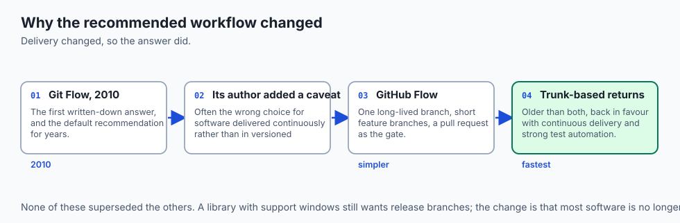
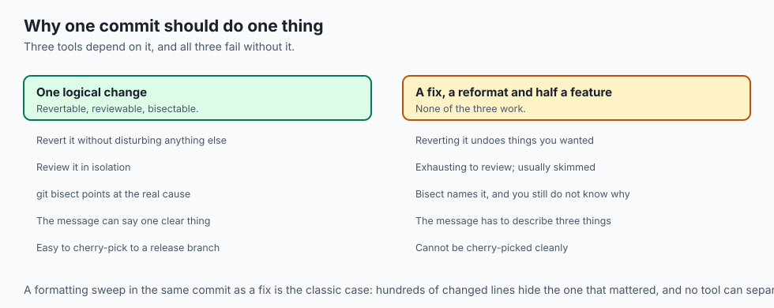
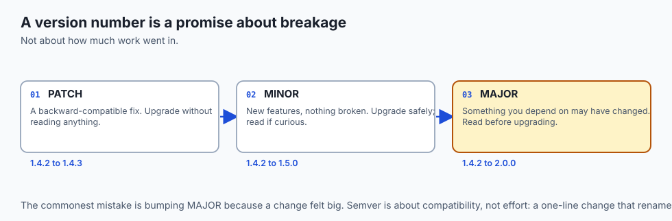
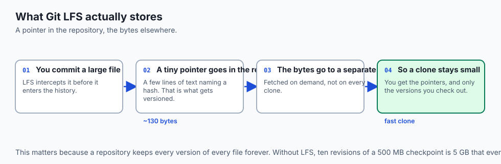
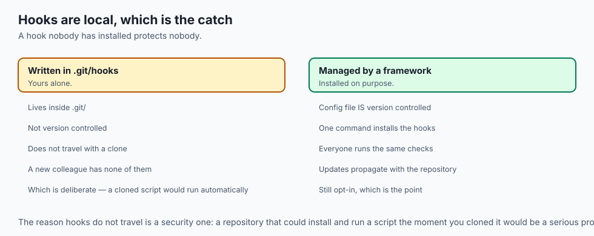
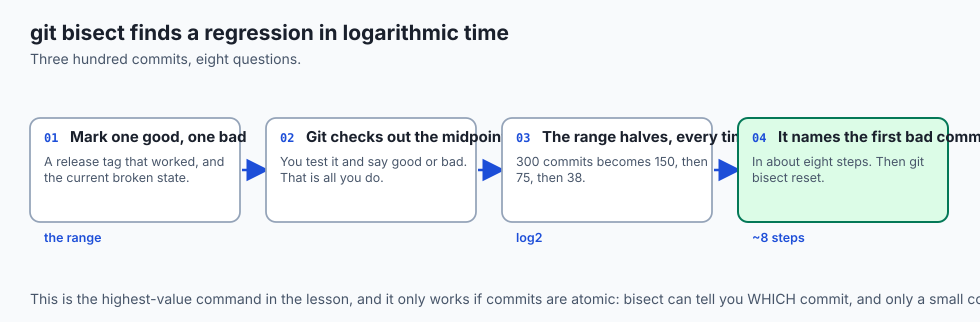
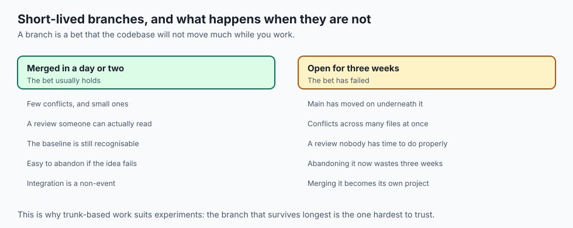
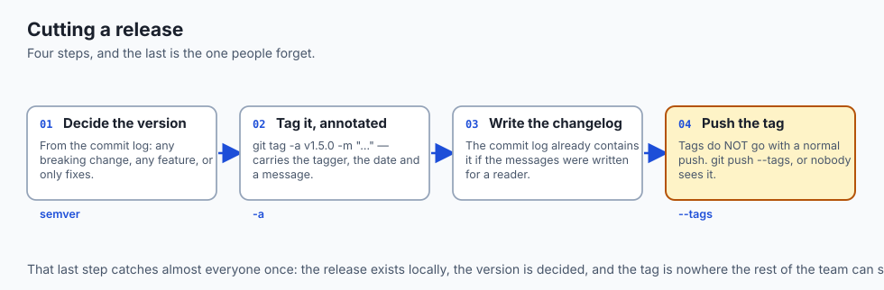
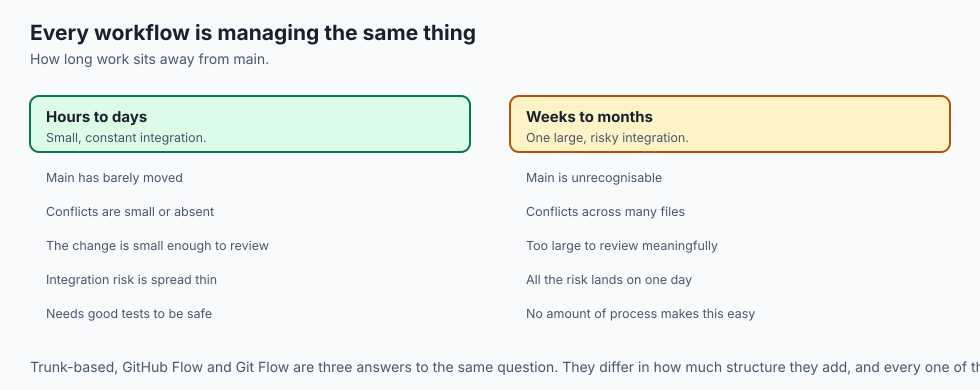
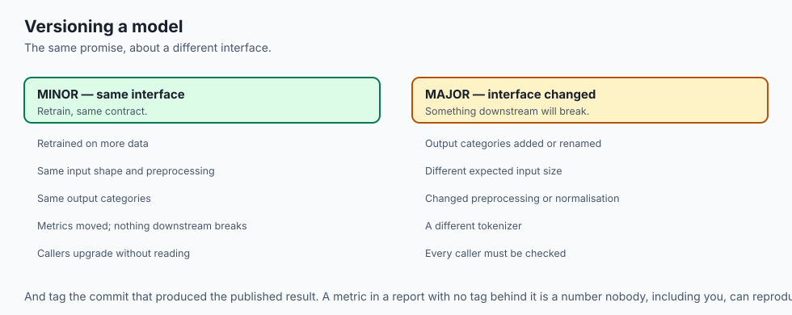

## Why this matters

- **A workflow is a team's agreement**, and the disagreements are what cost time — not
  the tool.
- **Every open-source project you contribute to has one**, stated or not, and reading
  it is the first thing to do.
- **Atomic commits are what make `git bisect` possible**, which is the fastest
  debugging technique in this course.
- **A version number is a promise to your users** about what will break, and semantic
  versioning is how that promise is expressed.
- **This closes Week 5.** Tomorrow the tooling week begins.

---

## The idea in plain language

- **A branching strategy answers one question**: where does work-in-progress live
  before it becomes part of the finished project?
- **The three common answers trade speed against structure.**
- **A commit is the atom of history**, and its quality decides how usable that history
  is.
- **A tag is a fixed name pinned to one commit**, and never moves.
- **Semantic versioning makes the tag mean something** to the people who depend on you.

---

## Historical background



- **Git Flow was published in 2010** and became the default recommendation for years,
  largely because it was the first written-down answer.
- **Its author later added a note** saying it is often the wrong choice — specifically
  for software delivered continuously rather than in versioned releases.
- **GitHub Flow was the reaction**: one long-lived branch, short-lived feature
  branches, and a pull request as the gate.
- **Trunk-based development is older than both** and returned to prominence with
  continuous delivery and strong automated testing.
- **Semantic versioning was formalised in 2011**, mainly to solve dependency
  management: package managers needed version numbers to *mean* something.
- **Conventional Commits followed**, turning the commit log into something machines
  could read to determine the next version.

---

## What it is — and what it is not

**A workflow is:**

- A shared agreement about branches, review and release.
- A choice matched to how the software is delivered.
- Mostly convention. Git enforces almost none of it.

**It is not:**

- **Not a Git feature.** Git has branches; everything else here is a team decision.
- **Not one right answer.** The correct workflow for a continuously deployed service is
  wrong for a library with support windows.
- **Not permanent.** Teams change workflow as they grow and as their delivery changes.
- **Not a substitute for testing.** Trunk-based development in particular fails badly
  without it.

---

## Why it was created and what problems it solves

- **Coordination.** Several people changing one codebase need to agree where work
  lives.
- **Keeping main releasable**, so a deployment is never blocked waiting for someone's
  half-finished work.
- **Supporting old versions** while new work continues, which is what release branches
  are for.
- **Making history usable.** Atomic commits and clear messages are what let you find
  and revert one change later.
- **Communicating change.** A version number tells users what to expect before they
  upgrade.

---

## How it works

### Branching strategies


| Workflow | Structure | Merges to main | Best for | Cost |
| --- | --- | --- | --- | --- |
| Trunk-based | One `main`; branches live hours | Many times a day | Strong test automation, continuous deployment | Little review buffer |
| GitHub Flow | Short branch per change, plus a PR | Per reviewed change | Most web apps and services | Very low; needs a review culture |
| Git Flow | `main` + `develop`, plus feature/release/hotfix | Only at release | Versioned, installed software | Heavy; many branches |
| Release branches | A `release/x.y` per version | Fixes cherry-picked in | Supporting several live versions | Maintenance per version |

- **Trunk-based keeps everyone integrating constantly**, so changes never drift far
  apart and conflicts stay tiny — but there is no long review buffer, so the tests must
  be excellent.
- **GitHub Flow is trunk-based with a review gate**, and is the default for a huge
  number of teams because it is simple and keeps main deployable.
- **Git Flow suits scheduled, versioned releases** and is usually too much ceremony for
  something that deploys continuously. Its own author has said so.
- **Release branches let you fix version 2.0** while work continues on main.

### Commit hygiene



- **An atomic commit contains exactly one logical change** — one fix, one feature
  increment, one refactor — and nothing else.
- **Atomic commits make three things possible**: reverting one change cleanly,
  reviewing it in isolation, and using `git bisect` to binary-search for the commit
  that introduced a bug.
- **A sloppy commit mixing a fix, a formatting sweep and half a feature** cannot be
  reverted cleanly and hides which line mattered.
- **The message shape**: a short imperative subject (about 50 characters — "Add retry
  to upload", not "Added"), a blank line, then *why*. The code already shows what.

### Conventional commits and semantic versioning



- **`type(scope): description`**, where type comes from a small vocabulary: `feat`,
  `fix`, `docs`, `refactor`, `test`, `chore`.
- **A version is `MAJOR.MINOR.PATCH`.** Increment PATCH for backward-compatible fixes,
  MINOR for backward-compatible features, MAJOR for anything that breaks compatibility.
- **So `1.4.0 → 1.5.0` promises new features and no breakage**, while `1.5.0 → 2.0.0`
  warns that something you depend on may have changed.

| Commit type | Meaning | Version bump | Example |
| --- | --- | --- | --- |
| `fix:` | Backward-compatible bug fix | PATCH | `1.4.2 → 1.4.3` |
| `feat:` | Backward-compatible feature | MINOR | `1.4.2 → 1.5.0` |
| `feat!:` / `BREAKING CHANGE:` | Incompatible change | MAJOR | `1.4.2 → 2.0.0` |
| `docs:` / `test:` / `chore:` | Not user-facing | none | `1.4.2` |


- **A tag never moves**, unlike a branch.
- **A lightweight tag is just a name**; an **annotated** tag (`git tag -a`) is a full
  object storing the tagger, date and message — which is what you use for releases.
- **The two conventions connect**: the commit type tells you which version part to
  bump, which is exactly how automated release tools decide.

### Repository hygiene



- **`.gitignore`** keeps build outputs, dependency folders, secrets and editor cruft
  out of the repository — smaller, safer, and with quieter diffs.
- **Git LFS** stores a small pointer in the repository and the real bytes elsewhere, so
  cloning does not drag every version of a multi-gigabyte file.
- **A monorepo holds many projects**; a polyrepo gives each its own. Monorepos make
  cross-project changes atomic and need scale-aware tooling; polyrepos keep projects
  independent and make coordinated change harder.
- **Most people start with one repository per project** and rarely need to decide this
  early.

### Hooks



- **A hook is a script Git runs automatically** at a point in its lifecycle.
- **`pre-commit` runs before a commit is recorded** and can reject it — running a
  formatter, a linter, a secret scanner, or a quick test.
- **This is where commit-time automation lives**, and it catches mistakes before they
  ever reach review.

---

## An everyday analogy

A publishing house.

| Publishing | Git workflow |
| --- | --- |
| The master binder | `main` |
| A photocopied chapter on your desk | A feature branch |
| The copy desk | Review and checks |
| Filing the edited pages back | The merge |
| "Third edition" on the spine | An annotated tag |
| The edition numbering rule | Semantic versioning |
| Scratch paper never filed | `.gitignore` |
| The flat-file drawer for posters | Git LFS |

- **The longer a chapter sits on your desk**, the more the binder has changed
  underneath it.
- **The edition number tells a reader what to expect** before they buy it. That is the
  whole job of a version number.

---

## Examples in practice





- **A team on Git Flow deploying daily**, maintaining `develop` and `release/*`
  branches that never earn their keep.
- **A `2.0.0` release** because one function signature changed, which is semver working
  exactly as intended.
- **A six-week feature branch** whose merge takes longer than the feature did.
- **`git bisect` finding a regression in eight steps** across 300 commits, because the
  commits were atomic.
- **A pre-commit hook rejecting a commit** containing an API key, which is the cheapest
  possible place to catch it.

---

## Implications: security, privacy, performance, scalability, and cost

- **Security: `pre-commit` hooks are the only control that acts before the mistake.**
  Everything else in this course is damage control after a secret is committed.
- **Hooks are local and not shared by default**, which is why teams use a framework to
  install them consistently — a hook nobody has installed protects nobody.
- **A protected branch plus required checks** is what makes the workflow enforceable
  rather than aspirational.
- **Performance: repository size is a workflow outcome.** LFS and a good `.gitignore`
  decide whether a clone takes ten seconds or ten minutes.
- **Cost: ceremony has a price.** A heavyweight workflow on a small team spends more
  time on process than it saves in mistakes.
- **Cost: so does no ceremony.** A team with no agreement rediscovers the same
  arguments every week.

---

## Alternatives: free, open source, and commercial



| Tool | Type | What it does |
| --- | --- | --- |
| `pre-commit` | Free, open source | Manages and installs hooks consistently across a team |
| `commitlint` | Free, open source | Enforces Conventional Commits |
| `semantic-release` | Free, open source | Reads the log, decides the version, tags and publishes |
| `git bisect` | Free, built in | Binary search through history for a regression |
| Git LFS | Free, open source | Large files outside the main history |
| DVC | Free, open source | Datasets and models versioned alongside code |

- **`git bisect` is the highest-value command in this lesson.** It finds the commit
  that broke something in a logarithmic number of steps, and it only works if commits
  are atomic.
- **Automate the version bump.** Deciding it by hand is the step people get wrong, and
  the commit log already contains the answer.

---

## Comparison with related concepts

| Term | What it actually is |
| --- | --- |
| **Workflow** | A team's agreement about branches, review and release |
| **Atomic commit** | Exactly one logical change |
| **Tag** | A fixed name pinned to one commit |
| **Annotated tag** | A tag object with tagger, date and message |
| **Semantic versioning** | `MAJOR.MINOR.PATCH`, with defined meanings |
| **Hook** | A script Git runs at a lifecycle point |
| **Monorepo** | Many projects in one repository |

---

## When to use it — and when not to



- **Start with GitHub Flow.** It is simple, it keeps main releasable, and it suits
  almost everything.
- **Move to trunk-based only with strong automated tests**, because they replace the
  review buffer.
- **Use Git Flow when you genuinely ship versioned releases** with support windows.
- **Tag every release**, annotated, so there is a fixed name for what you shipped.
- **Do not adopt a workflow because it is well known.** Match it to how you deliver.
- **Do not let a branch outlive its usefulness.** Long-lived branches are the cost
  every workflow is trying to manage.
- **Do not rewrite history others have pulled**, whichever workflow you use. That rule
  survives every change of process.

---

## The AI connection



- **Experiment branches are naturally short-lived**, which makes GitHub Flow a
  comfortable fit for research code.
- **Tag the commit that produced a published result.** A number in a paper without a
  tag is a number nobody can reproduce.
- **Semantic versioning applies to models too.** A retrained model with the same
  interface is a MINOR change; one with different output categories is MAJOR.
- **`pre-commit` hooks that strip notebook outputs** solve the single most annoying
  version-control problem in AI work.
- **DVC gives datasets and checkpoints the same discipline** the code already has,
  which is what makes a whole experiment reproducible rather than just its code.

---

## Knowledge check

```yaml
quiz:
  question: "A team deploys to production several times a day and adopts Git Flow, maintaining `main`, `develop`, and release branches. Why is this likely to cost more than it delivers?"
  options:
    - "Git Flow is built around scheduled versioned releases, so its release machinery adds ceremony a continuously deploying team never uses"
    - "Git Flow does not support hotfix branches, which continuous deployment requires"
    - "Maintaining two long-lived branches makes automated testing impossible"
    - "Git Flow requires rewriting history on every merge, which is unsafe for shared branches"
  answer_index: 0
  explanation: "Git Flow's develop and release branches exist to stabilise a version before it ships on a schedule. A team that ships continuously has no such window, so those branches carry maintenance cost while providing a buffer nobody uses — which its own author has acknowledged."
```

---

## Hands-on exercise

Practise the whole release path on a local repository. Worked through fully in the
Day 35 lab directory.

| What you are doing | Command |
| --- | --- |
| Make an atomic commit | `git commit -m "fix: handle empty response body"` |
| Tag a release properly | `git tag -a v1.0.0 -m "First release"` |
| See tags | `git tag` and `git show v1.0.0` |
| Find a bug by bisecting | `git bisect start`, `git bisect bad`, `git bisect good <tag>` |
| Mark each step | `git bisect good` or `git bisect bad`, then `git bisect reset` |
| Add a pre-commit hook | write `.git/hooks/pre-commit`, then `chmod +x` |
| Prove it blocks a commit | try to commit something the hook rejects |

### Expected output

```text
Bisecting: 4 revisions left to test after this (roughly 2 steps)
9a8b7c6 is the first bad commit
tag v1.0.0
Tagger: Your Name
    First release
pre-commit: found a possible credential — commit rejected
```

- **Bisect found the commit in three steps** across a dozen, which is the payoff for
  atomic commits.
- **The hook rejected the commit** before it existed, which is the only point in this
  course where a secret is prevented rather than handled.

### Validate your work

- [ ] You made three atomic commits with Conventional Commit subjects
- [ ] You created an annotated tag and read its metadata
- [ ] You found a deliberately introduced bug with `git bisect`
- [ ] You wrote a `pre-commit` hook and confirmed it can reject a commit
- [ ] You can state which version part a `feat!:` commit bumps
- [ ] `bash tests/run_tests.sh` reports 0 failures

### Troubleshooting

- **`git tag` shows nothing.** Tags are not pushed by default. `git push --tags`.
- **Bisect gives a confusing answer.** A commit in the range does not build. Use
  `git bisect skip` for those.
- **Your hook does not run.** It needs the exact name `pre-commit`, no extension, and
  the execute bit.
- **The hook is not there after cloning.** Hooks live in `.git/` and are not version
  controlled — which is why teams use a framework to install them.

### Common mistakes

- **Commits that do three things**, which defeat bisect and cannot be reverted cleanly.
- **A lightweight tag for a release**, losing the tagger and the message.
- **Bumping MAJOR for a big change** rather than a breaking one. Semver is about
  compatibility, not effort.
- **Assuming hooks are shared.** They are not.

---

## Practice assignment

- **Write ten commits in Conventional Commit form** over a real piece of work, and use
  them to decide the next version number by hand.
- **Introduce a bug deliberately** ten commits back, then find it with `git bisect` and
  count the steps.
- **Tag three releases** and write a changelog from the commit log alone.
- **Set up `pre-commit`** with a formatter and a secret scanner on a project you own.

---

## Extension challenge

- **Automate a release.** Configure a tool to read the commit log, decide the version,
  create the tag and generate a changelog — then check its choice against your own.
- **Convert a repository to Git LFS** and measure the clone size and time before and
  after.
- **Try trunk-based development for a week** on a solo project: no branch lives longer
  than a day. Note what it forces you to do about testing.
- **Bisect a real open-source repository** to find when a behaviour you can reproduce
  changed. Doing it on someone else's history is the version that convinces you.

---

