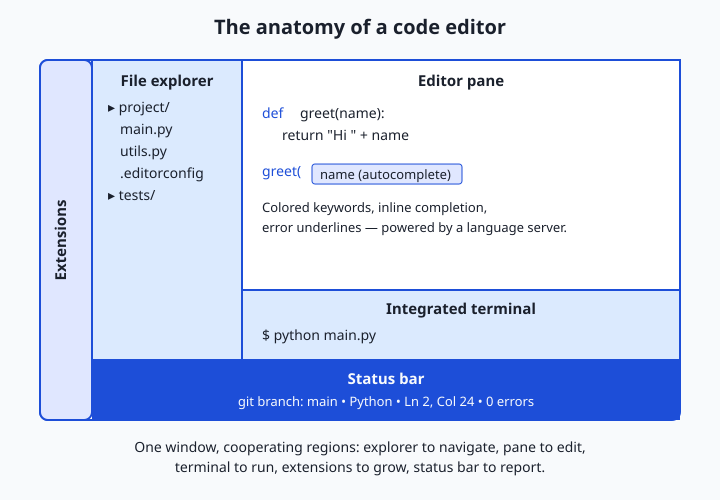

## Why this matters

You are about to spend the next several hundred days reading, writing, and untangling code, and you will do almost all of it inside one program: your editor. It is the cockpit for everything ahead — the terminal you met earlier, the git commands you just learned, the API calls you will write, and eventually the AI projects this course is building toward. A carpenter who ignores the state of their workbench pays for it on every single cut. The same is true here: a well-chosen, well-configured editor quietly saves you seconds thousands of times a day, and a badly configured one taxes you just as often.

The stakes are concrete. A missing bracket that your editor highlights in red the instant you type it costs you two seconds; the same mistake, discovered when a program crashes an hour later, can cost you thirty minutes of hunting. When you paste a config file and half your team uses tabs while the other half uses spaces, a "one-character" change balloons into a messy, unreviewable diff — and reviewers stop trusting your pull requests. When you are wiring up an AI project and your editor's autocomplete knows the exact name of a function's parameter, you write it correctly the first time instead of flipping to documentation.

Here is the part that matters most for where you are headed. AI coding assistants — the tools that suggest whole lines and answer questions about your code — do not run in some separate app. They live *inside* your editor, reading the file you have open and the project around it. An editor you have configured well is the foundation those assistants stand on; a fast, well-organized workspace makes you faster at every AI project you build in this course. Today you choose your primary tool and learn to shape it to your hand.

## The idea in plain language

A **code editor** is a program for writing and editing source code — the plain-text files that make up software. At its simplest it is a text box, but a real code editor understands that the text is *code*: it colors the different parts, points out mistakes, completes names as you type, and lets you jump around a large project quickly.

Three families of tools sit on a spectrum. A **plain text editor** (think of the basic Notepad-style app that ships with every operating system) just stores characters; it has no idea whether you are writing a grocery list or a program. A **code editor** adds a thick layer of programming-aware features on top of plain text — coloring, completion, search across a whole project, a built-in terminal — and grows through add-ons called extensions. An **IDE** — an Integrated Development Environment — bundles an editor together with the heavier machinery of building, running, and debugging a specific language or platform, all preconfigured, in one package.

The key modern idea is that the line between "editor" and "IDE" has blurred. Today's leading code editors start lightweight but, once you install a few extensions, gain most of what an IDE offers. That flexibility is why one editor can serve you across the wildly different topics in this course — shell scripts today, web code next month, AI models later — instead of forcing you to learn a new tool for each. You configure it once and it follows you everywhere.

## Historical background

Editing text with a computer is older than the screen. In the 1970s, programmers used **line editors** such as `ed` (written by Ken Thompson at Bell Labs in 1969) that showed one line at a time on a printing terminal. When video terminals arrived, **screen editors** became possible: Bill Joy wrote `vi` in 1976 at the University of California, Berkeley, letting a programmer see and move around a whole screenful of text. Around the same time, Richard Stallman and Guy Steele developed **Emacs** (1976), an editor famous for being endlessly extensible through its own built-in programming language. Vi and Emacs are still in daily use today, nearly half a century later — a remarkable testament to how well their core ideas held up.

The 1990s and 2000s brought graphical editors aimed at productivity: **Sublime Text** (first released in 2008) set a high bar for speed and a clean interface, and **TextMate** on macOS popularized the idea of community-contributed language "bundles."

The most consequential recent shift came from a standard, not a single program. In 2016, Microsoft introduced the **Language Server Protocol** (LSP), a common language that lets any editor talk to a separate "language server" that understands a particular programming language. Before LSP, every editor had to build deep support for every language on its own — an impossible amount of duplicated work. After LSP, one Python language server could power completion and error-checking in dozens of different editors. That same year Microsoft released **Visual Studio Code**, a free, open-source editor built on web technology and designed around extensions and LSP. It grew to become, by wide margins in developer surveys, the most popular editor in the world. The current wave — editors with built-in AI assistance — is the next chapter of this same story, and you will study it in depth later in the course.

## What it is — and what it is not

A code editor is a tool for manipulating text files that happen to be source code, enriched with an understanding of programming languages. That understanding is the dividing line. A word processor formats text for humans to read on a page; a code editor leaves the text exactly as typed (because a program is defined by its precise characters) and instead helps you *reason* about that text — where a name is defined, whether a bracket is balanced, what a function expects.

Several things a code editor is *not*. It is **not** the thing that runs your code — that is the language's interpreter or compiler, which the editor merely calls out to. It is **not** a word processor; there is no hidden formatting, no bold-versus-plain, only characters and the meaning your language gives them. And an editor is **not** magic intelligence: when it completes a name or flags an error, a language server or a well-defined rule is doing that work by analyzing the code's structure, not by understanding your intent.

| Common misconception | The reality |
| --- | --- |
| "A code editor and a word processor are basically the same." | A word processor stores hidden formatting; a code editor stores exact plain-text characters, because code's meaning lives in those characters. |
| "An IDE is always better than an editor." | An IDE bundles more, but a code editor plus a few extensions often matches it while staying faster and lighter. |
| "The editor runs my program." | The editor edits and can *launch* your program, but a separate interpreter or compiler actually runs it. |
| "Syntax highlighting changes my file." | Coloring is a display effect only; the bytes on disk are unchanged. |
| "I should master every feature before writing code." | You need a handful of features to start; the rest you add as real work reveals the need. |

## Why it was created and what problems it solves

Code editors exist because raw source code is hostile to the naked eye. A page of same-colored text, with meaning packed into tiny symbols like `{`, `;`, and `=`, is exhausting to scan and easy to get wrong. Every feature of a code editor is an answer to a specific, repeated pain.

Consider the problems in order. *"I cannot see the structure."* — solved by **syntax highlighting**, which colors keywords, strings, and comments differently so the shape of the code jumps out. *"I keep misspelling names and forgetting what functions need."* — solved by **autocomplete** (Microsoft's branded version is called IntelliSense), which offers valid names and shows what a function expects as you type. *"I found the bug an hour too late."* — solved by inline error checking that underlines problems the moment you write them. *"I need to change the same word in forty places."* — solved by **multi-cursor** editing and project-wide **search and replace**. *"I keep switching windows to run commands."* — solved by the **integrated terminal**, a shell living inside the editor. *"I lost track of what I changed."* — solved by **git integration** that marks edited lines and stages commits without leaving the editor.

Underneath the last two decades of this progress is one deeper problem the Language Server Protocol solved: intelligence about a language (completion, go-to-definition, error checking) used to be trapped inside whichever editor built it. LSP freed that intelligence into reusable servers, so choosing an editor no longer means giving up smarts for any given language. That is the quiet reason a single lightweight editor can now feel expert in dozens of languages at once.

## How it works

A modern code editor is best understood as a small window divided into cooperating regions, with a network of helpers behind them.



Read the window from left to right. The **file explorer** on the left shows your project as a tree of folders and files, so you can move around a codebase of hundreds of files without touching the terminal. The large center region is the **editor pane**, where the file you are working on is shown and edited — often split so you can see two files side by side. Docked at the bottom is the **integrated terminal**, a full command-line shell (the same one you learned earlier) running inside the editor, so you can run tests or git commands without switching windows. Running down one edge is the **extensions** area, where add-ons that teach the editor new languages and tricks are installed and managed. And along the very bottom sits the **status bar**, a thin strip reporting the current git branch, the file's language, cursor position, and any errors — the editor's dashboard.

Behind these visible parts, the real intelligence flows through the **Language Server Protocol**. When you open a Python file, the editor launches a Python language server in the background and sends it messages: "the user opened this file," "they just typed here — what completions apply?", "is anything wrong?" The server analyzes the code and answers, and the editor renders those answers as completion popups, red underlines, and hover tips. The same editor speaks the same protocol to a completely different server for a completely different language. This is why one editor can be fluent everywhere: it is not fluent itself; it is a skilled *interpreter* between you and a stable of language experts.

Three more mechanisms are worth knowing because you will configure all of them today. **Settings** are a list of preferences (font size, tab width, whether to trim stray spaces on save) that the editor reads at startup, usually stored as a plain-text file you can edit and share. **Keybindings** map keystrokes to actions, so frequent operations become muscle memory rather than menu hunts. And **EditorConfig** is a small standard — a file named `.editorconfig` placed in a project — that many editors read automatically to agree on basic formatting like indentation, so an entire team's files come out consistent regardless of which editor each person uses.

## An everyday analogy

Picture a carpenter's workbench. When they buy it, the bench is a bare, sturdy surface — that is a **plain text editor**: solid, but it does nothing for the work beyond holding it.

Now the carpenter outfits the bench. They mount a vice, hang their chisels within arm's reach, clamp a good light overhead, and lay a ruler along the front edge. Each addition is an **extension**, and the outfitted bench is a **code editor**: still the same surface, but now the tools you reach for constantly are exactly where your hand expects them. The way the carpenter *arranges* it all — this drawer for saws, that rail for clamps, everything in its habitual spot — is the **settings and keybindings**. Muscle memory does the rest; a seasoned carpenter grabs the right tool without looking, the way you will hit a keybinding without thinking.

A fully equipped professional workshop with heavy machinery bolted to the floor — a table saw, a lathe, dust extraction all plumbed together — is the **IDE**: enormously capable for the projects it was built for, but large, and overkill when you just need to shave one edge.

Two more pieces complete the picture. The shop rule that everyone cuts to the same measurements so parts fit together no matter who made them is **EditorConfig** — a shared agreement that keeps the whole team's work consistent. And a knowledgeable assistant standing beside the bench, who hands you the right chisel and warns "that joint will not hold" before you glue it, is the **language server**: not doing the work for you, but making you faster and catching mistakes early. Keep this workshop in mind and every feature below has an obvious home.

## Examples in practice

Let's make the abstract features concrete, then meet the leading editors — each with when to choose it, how to start, and a one-line configuration.

**Configuring a setting.** Almost every editor stores settings as plain text. In VS Code, opening the settings file and adding these lines makes indentation two spaces and cleans up stray whitespace every time you save:

```json
{
  "editor.tabSize": 2,
  "files.trimTrailingWhitespace": true
}
```

**A team-wide rule with EditorConfig.** Drop a file named `.editorconfig` at the root of a project and most editors obey it automatically — no per-person setup:

```ini
root = true

[*]
indent_style = space
indent_size = 2
end_of_line = lf
insert_final_newline = true
trim_trailing_whitespace = true
charset = utf-8
```

Now the leading editors. Free versus paid is stated for each.

**Visual Studio Code (free, open source).** The popular default and the safe first choice: free, cross-platform, huge extension library, and gentle for beginners. *When to choose it:* almost always, when you want one flexible editor that handles every topic in this course. *How to start:* install it, add the extension for your language, open a folder. *One-line config:* set your indent with `"editor.tabSize": 2` in its settings file.

**The JetBrains IDEs (paid, with free tiers).** A family of language-specific IDEs — **PyCharm** for Python, IntelliJ IDEA for Java, WebStorm for web work — with the deepest built-in refactoring and analysis for their target language. PyCharm and IntelliJ IDEA offer a free Community Edition; the full editions and some others are paid (with free licenses for students and open-source work). *When to choose it:* large, single-language projects where heavyweight refactoring earns its keep. *How to start:* install the IDE for your language and open your project; most tooling is preconfigured. *One-line config:* set indentation under Settings, "Code Style."

**Vim / Neovim (free, open source).** Keyboard-driven editors descended from the 1976 `vi`, controlled almost entirely without a mouse. Steep to learn, extremely fast once fluent, and available on virtually every server you will ever log into. *When to choose it:* remote work over a terminal, or once you want top editing speed and enjoy the investment. *How to start:* run `vim` (or `nvim`), and learn to press `i` to type and `Esc` then `:wq` to save and quit. *One-line config:* put `set tabstop=2` in the config file (`~/.vimrc` for Vim).

**Zed and Sublime Text (Zed free/open source; Sublime paid, free to evaluate).** Two editors that prize raw speed. **Zed** is a newer, free, open-source editor built for performance and collaboration; **Sublime Text** is a long-loved, very fast editor that is paid software but free to try indefinitely. *When to choose them:* when responsiveness on large files matters most and you want fewer moving parts than a full IDE. *How to start:* install, open a folder, add a package for your language. *One-line config:* both keep settings in a plain-text file — set `"tab_size": 2` in Sublime's user settings.

**The AI-assisted editors (a preview).** A recent category builds AI coding assistance directly into the editing surface. **Cursor** is an editor (built on VS Code's open-source base) with assistance woven throughout, and Copilot-style assistants add the same kind of help as an extension to editors you already use. These deserve their own careful treatment, which this course gives them in Course 7; for now, simply note where they sit — inside the editor, reading your open project.

## Implications: security, privacy, performance, scalability, and cost

**Security.** An editor is powerful software that opens untrusted files and runs extensions written by strangers, which makes it a target. A malicious extension can, in principle, read your files or run commands. Practise basic hygiene: install extensions from official marketplaces, prefer popular and actively maintained ones, and be cautious opening code from unknown sources — some editors deliberately open unfamiliar folders in a restricted mode until you confirm you trust them.

**Privacy.** Editors and their extensions may send usage telemetry, and cloud-connected features (settings sync, and especially AI assistants) transmit data off your machine. When an assistant reads your open file to make a suggestion, that content leaves your computer for a server. This is not sinister, but it is worth knowing: check what telemetry an editor collects, whether you can turn it off, and — for anything sensitive — what a connected feature sends where.

**Performance.** A fast editor is invisible; a slow one interrupts your thinking on every keystroke. Two things dominate: how many extensions you have loaded (each adds startup time and memory) and how large the files and projects are. The practical rule is to install only extensions you use, and to reach for a lighter editor when working with very large files. Editor speed compounds — a stutter you feel a thousand times a day is a real tax on attention.

**Scalability.** "Scaling" for an editor means staying usable as a project grows from one file to ten thousand. This is where the file explorer, project-wide search, go-to-definition, and language servers prove their worth: they let you navigate a codebase far too large to hold in your head. A plain text editor does not scale past a handful of files; a code editor with these features scales to enormous projects.

**Cost.** The headline is that you can equip yourself completely for free. VS Code, Vim, Neovim, and Zed cost nothing, and PyCharm and IntelliJ IDEA have free Community Editions. The paid options (JetBrains' full editions, Sublime Text) sell polish, depth, and support, and many offer free licenses to students and open-source contributors. Nothing in this course requires a paid editor. The real cost of an editor is not money but the time to learn it well — which is exactly why choosing one and configuring it deliberately, as you do today, pays off for years.

## Alternatives: free, open source, and commercial

For a tooling lesson, the "alternatives" are the editors themselves and the ways to learn them. The table gathers the options with their licensing and the situation each suits.

| Editor | Type / cost | Best for | Free? |
| --- | --- | --- | --- |
| Visual Studio Code | Free, open source | A flexible default across every topic in this course | Yes |
| PyCharm / IntelliJ IDEA (JetBrains) | Commercial, with free Community Editions | Deep, single-language work with heavy refactoring | Community tiers free; full editions paid |
| Vim / Neovim | Free, open source | Terminal and remote work; maximum editing speed | Yes |
| Zed | Free, open source | Speed on large files; lightweight collaboration | Yes |
| Sublime Text | Commercial; free to evaluate indefinitely | Very fast, minimal editing | Free to try; license paid |

The honest recommendation for a beginner is simple: start with **VS Code**. It is free, forgiving, works on every operating system, and hands you a single tool for everything ahead. Learn one editor deeply before shopping for a second; fluency in any good editor transfers to the next. If curiosity or a specific job pulls you toward Vim's speed or PyCharm's depth later, that is a fine day to switch — but not before you can navigate, search, and edit a project quickly in the editor you already have.

## Comparison with related concepts

The three families of editing tools are easy to blur together, so the diagram traces what each layer adds to the one before it.



Read it left to right. A **plain text editor** stores characters and nothing more. Add syntax highlighting, autocomplete, an integrated terminal, git integration, and extensions, and it becomes a **code editor** — the same text surface, now aware that the text is code. Bundle in a preconfigured compiler or interpreter, a debugger, and build tools for a particular language, and you have a **full IDE** — the most capable and the heaviest.

| Concept A | Concept B | Key difference |
| --- | --- | --- |
| Code editor | IDE | An editor is lightweight and grows through extensions; an IDE bundles building, running, and debugging for a language out of the box |
| Code editor | Plain text editor | A code editor understands programming languages (coloring, completion, errors); a plain editor only stores characters |
| Settings | EditorConfig | Settings are your personal, editor-specific preferences; EditorConfig is a shared, editor-agnostic file so a whole team formats code the same way |
| Extension | Language server | An extension is any add-on that expands the editor; a language server is a specific helper that provides completion and error-checking for one language, often via LSP |
| Syntax highlighting | Autocomplete | Highlighting colors code so structure is visible; autocomplete suggests and completes names as you type |

## When to use it — and when not to

Reach for a full-featured code editor whenever you are writing more than a throwaway line or two — which, from here on, is nearly always. The moment you are editing real source files, navigating a project, running commands, and tracking changes in git, the editor's features stop being luxuries and become the difference between fluent work and constant friction. And reach for **EditorConfig** the moment more than one person (your future self included) touches a project: a shared `.editorconfig` prevents the maddening indentation-and-whitespace churn that pollutes diffs and hides real changes.

Know when *not* to over-invest, too. For a two-line edit to a config file, the plain editor already open is fine — launching a heavyweight IDE would waste more time than it saves. Resist the urge to install dozens of extensions "just in case"; each one costs startup time and memory, and a cluttered editor is slower and more distracting than a lean one. And do not fall into endless configuration for its own sake — tuning your setup can become a comfortable substitute for doing the actual work. The professional habit is to pick a capable editor, configure the handful of settings that genuinely help, learn a few keybindings well, and then get on with writing code, adjusting only when real work reveals a real need.

Here is where today connects to everything ahead. Every AI project in this course — every script that calls a model, every notebook that trains one, every app you deploy — is written and debugged inside your editor. The AI coding assistants you will study later read the very file you have open and the project structure around it, so a clean, well-organized, well-configured workspace makes those assistants sharper and you faster. In Course 7 you will work inside an AI-native editor, and the muscle memory, settings, and habits you build today are exactly the foundation that experience stands on. Configure your primary tool now, and every day that follows is a little lighter.

## The AI connection

The editor is where AI assistance meets your actual work, and the configuration
choices from today decide how useful that assistance is. An assistant reads your
open file and your project; a cluttered, inconsistent workspace produces worse
suggestions, because the context it draws on is worse.

The Language Server Protocol from today is the specific mechanism, and it becomes
important again on Day 302: the same index that powers go-to-definition gives a
coding agent deterministic code intelligence rather than guesses. `.editorconfig`
matters for a related reason — when formatting is consistent, a diff shows what
changed rather than whose editor last touched the file, which is what makes
review of generated code practical at all. The extension warning holds too: each
one costs startup time and memory, and an editor that takes twenty seconds to
open is an editor you avoid.

---

## Knowledge check

Try these from memory before looking back:

1. In one sentence each, distinguish a plain text editor, a code editor, and an IDE, and give the single feature that separates the first from the second.
2. Explain what the Language Server Protocol is and why it means one editor can feel expert in many programming languages at once.
3. Your teammate's pull request shows hundreds of changed lines, but they insist they only edited one function. Using something from this lesson, give the most likely cause and the fix that prevents it.
4. Name three features a code editor adds on top of storing plain text, and state the specific problem each one solves.
5. A beginner asks which editor to install and whether they need to pay. Give your recommendation in two or three sentences, including the cost.

## Hands-on exercise

Time to shape your own tool. In the Day 36 lab you will create an `.editorconfig` file — the editor-agnostic standard that keeps formatting consistent — and run a small checker that reports which files obey it and which break the rules. The lab is pure command-line work that runs the same on macOS and Linux, so you learn what an `.editorconfig` actually enforces even before wiring it into your editor.

Open a terminal and change into the lab's starter directory:

```bash
cd labs/sections/computing-foundations/day-036-choosing-and-configuring-a-code-editor
```

First, run the completed demonstration to see the whole flow — it builds a small sample project with deliberately messy files, writes an `.editorconfig`, and reports every violation:

```bash
bash examples/editorconfig_demo.sh
```

Then open `starter/editorconfig_demo.sh` in the editor you are choosing today and complete its four numbered exercises: write an `.editorconfig` rule, check a file against it, fix a violation, and verify the fix. Finally, fill in `starter/editor-worksheet.md` with the editor you settled on and the settings you configured.

### Expected output

The completed demonstration prints a report like this (paths and counts are from a real run; yours will match closely):

```text
=== EditorConfig demo ===
Created sample project in: /tmp/editorconfig-demo.XXXX
Wrote .editorconfig with 6 rules.

Checking files against .editorconfig ...
  clean.py ............ OK
  tabs.py ............. VIOLATION: uses tabs (indent_style = space)
  trailing.py ......... VIOLATION: trailing whitespace on 2 line(s)
  no_newline.py ....... VIOLATION: missing final newline

3 file(s) with violations, 1 clean.
Cleaning up temporary project.
```

Each `VIOLATION` line names the file and the exact rule it breaks, so the report reads like the assistant at your workbench pointing at the joint that will not hold.

### Validate your work

You are done when you can check every box:

- [ ] Running `bash examples/editorconfig_demo.sh` prints the report and exits without error.
- [ ] Your completed `starter/editorconfig_demo.sh` writes an `.editorconfig` containing `indent_style`, `indent_size`, `end_of_line`, `insert_final_newline`, `trim_trailing_whitespace`, and `charset`.
- [ ] The checker flags the tab-indented file, the trailing-whitespace file, and the missing-final-newline file, and passes the clean file.
- [ ] Running `bash tests/run_tests.sh` ends with `checks, 0 failure(s).` and exits 0.
- [ ] Your `editor-worksheet.md` names your chosen editor, three settings you configured and why, and what your `.editorconfig` enforces.

### Troubleshooting

- **`No such file or directory` for the script.** You are not in the lab directory. Run the `cd` command from the exercise above first, then the `bash ...` command.
- **`Permission denied` when running a script.** Run it through bash explicitly — `bash examples/editorconfig_demo.sh` — rather than `./examples/...`; that avoids needing the executable bit.
- **The checker reports no violations at all.** Your `.editorconfig` was not written or the sample files were not created; re-run the demo from a clean state, and confirm the script reached the "Wrote .editorconfig" line.
- **`command not found: awk` or `grep`.** These ship with macOS and every mainstream Linux distribution; if one is missing you are on an unusually stripped-down system — install the base utilities and retry.

### Common mistakes

- **Confusing settings with EditorConfig.** Your editor's own settings are personal and editor-specific; `.editorconfig` is a shared, editor-agnostic file for the whole team. Putting team formatting rules only in your personal settings means teammates never get them.
- **Forgetting the final newline.** Many tools expect every text file to end with a newline character; `insert_final_newline = true` enforces it, and its absence is one of the most common `.editorconfig` violations — exactly what the lab's checker catches.
- **Mixing tabs and spaces.** The single most common formatting bug. Pick one (`indent_style = space` is a safe default) and let `.editorconfig` and your editor enforce it, rather than trusting yourself to remember.

## Practice assignment

Install and configure your primary editor for real. Choose one editor (VS Code is the recommended default), install it, and open the course repository folder in it. Then complete the worksheet in the lab's `starter/` directory: record which editor you chose and why, list three settings you changed and the concrete reason for each (for example, setting the tab size to match this course's `.editorconfig`, or turning on "trim trailing whitespace on save"), and describe what your project's `.editorconfig` enforces. Finally, use your newly configured editor to open the lab's completed script, use its search feature to find where the `.editorconfig` is written, and its multi-cursor or find-and-replace to rename one variable consistently — then write two or three sentences on how those features felt compared with editing the same file in a plain text editor. Keep the worksheet; a later lesson on debuggers and linters builds on the editor you set up today.

## Extension challenge

Go one layer deeper into the standard that makes editors interoperable. First, extend the lab's `.editorconfig` with a **section-specific rule**: add a `[*.md]` block that sets `trim_trailing_whitespace = false` (Markdown uses two trailing spaces to mean a line break, so the general rule should not apply to it), and confirm your checker or editor now treats Markdown files differently from code files. Then research and answer, in a short paragraph, two questions: how does an editor decide which `.editorconfig` file applies when a project has several in nested folders, and what does the special line `root = true` do at the top of the file? Verify your answers against the official EditorConfig documentation listed in this lesson's sources, and add a note to your worksheet explaining, in your own words, why a team standard that every editor understands is more robust than asking everyone to configure their editor identically by hand. You have just reasoned about developer tooling the way a team lead does — designing the shared rules that keep many people's work consistent.
