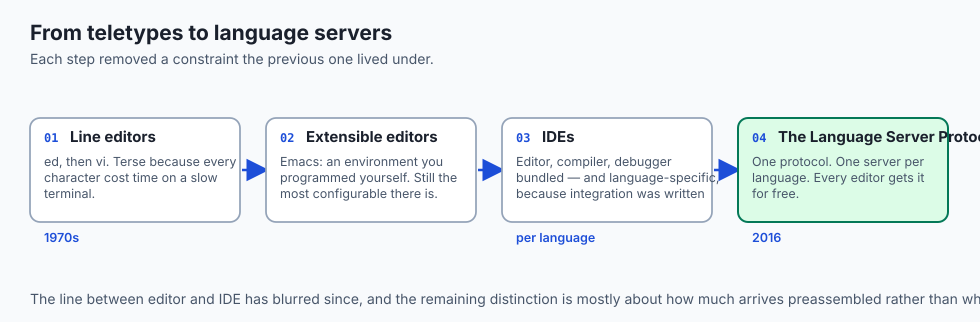
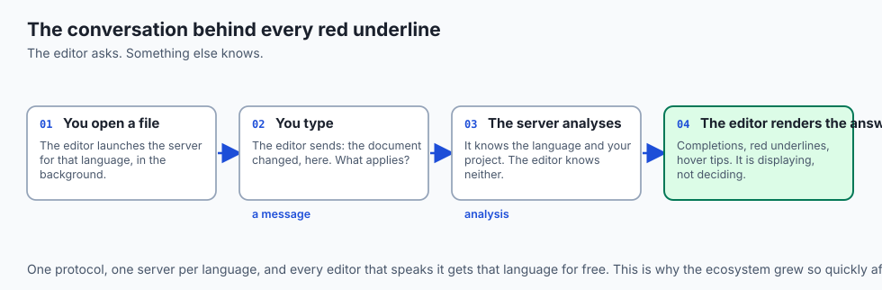
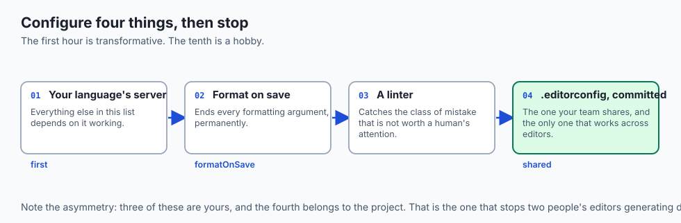
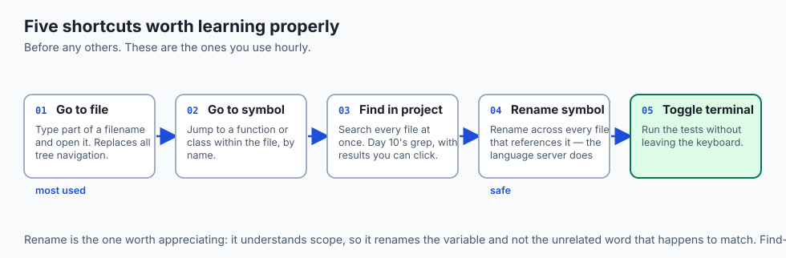
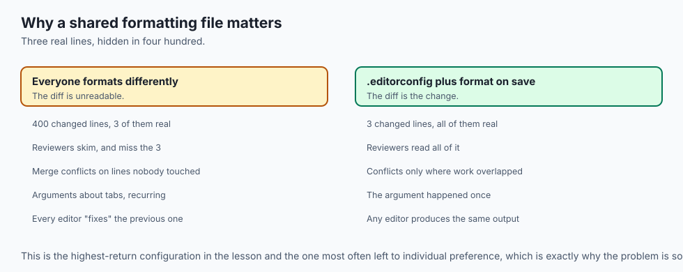
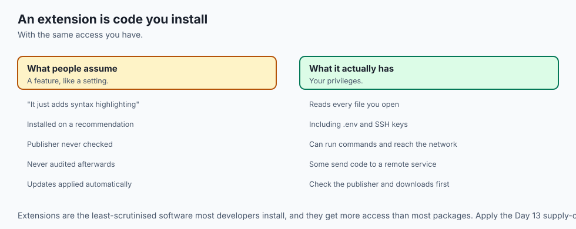
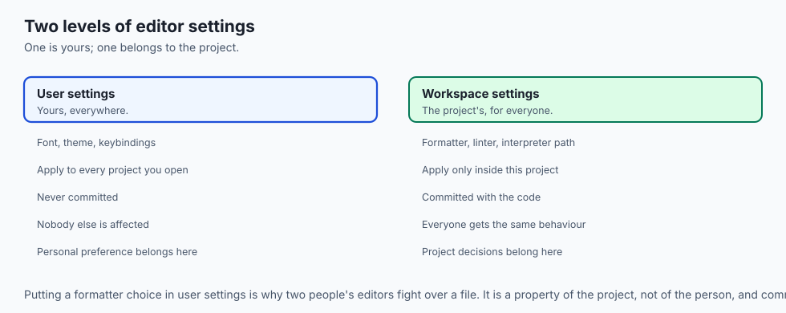
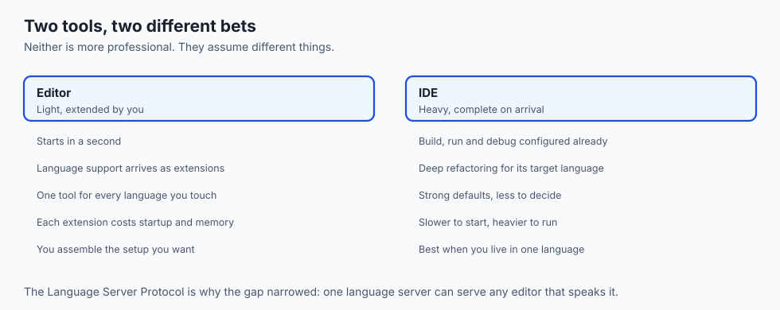
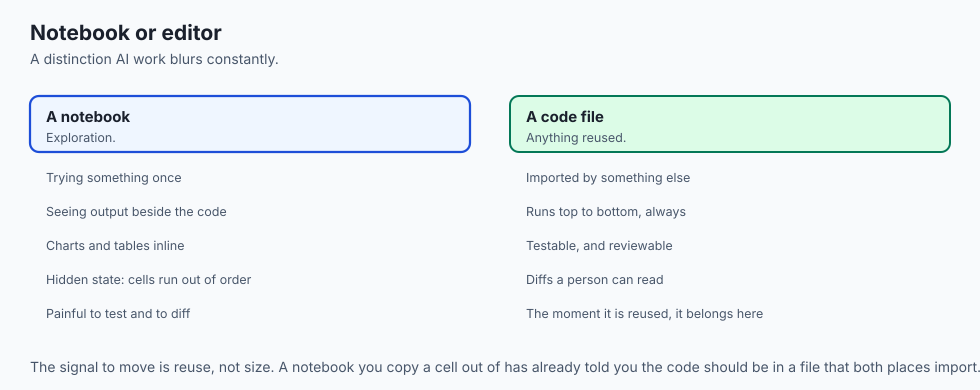

## Why this matters

- **You will spend more hours in an editor than in any other tool**, and small
  frictions compound over a year.
- **The language server is why one editor is fluent everywhere**, and knowing that
  explains most of what you configure.
- **Format on save ends every formatting argument**, permanently, for a team.
- **Editor extensions run with your privileges**, which makes installing one a trust
  decision people make far too casually.
- **AI assistance lives in the editor now**, and its usefulness depends on the same
  configuration everything else does.

---

## The idea in plain language

- **A code editor is a text editor that understands code** — or rather, one that knows
  how to ask something else.
- **The window is a few cooperating regions**: files on the left, your code in the
  middle, a terminal below, a status bar underneath.
- **The intelligence comes from language servers**, separate programs that analyse your
  code and answer the editor's questions.
- **Settings, keybindings and EditorConfig** are the three things you configure, and
  the third is the one your team shares.
- **The editor is not fluent in any language.** It is a skilled interpreter between you
  and a stable of experts.

---

## Historical background



- **`ed` and then `vi` came from an era of teletypes and slow terminals**, which is why
  their key sequences are so terse — every character cost time.
- **Emacs took the opposite approach**: an extensible environment you programmed
  yourself, and it is still the most configurable editor in existence.
- **IDEs arrived to bundle everything** — editor, compiler, debugger, builder — and
  were language-specific because integration was written per language.
- **The Language Server Protocol, 2016, ended that.** One protocol meant a language
  needed one server, and every editor speaking the protocol got support for free.
- **That is why a modern editor supports fifty languages** without knowing anything
  about any of them.
- **The line between editor and IDE has blurred since**, and the distinction is now
  about how much arrives preassembled.

---

## What it is — and what it is not

**A code editor is:**

- A text editor with structural awareness of code.
- A host for extensions and language servers.
- Configurable, and worth configuring — but not endlessly.

**It is not:**

- **Not the intelligence.** The completions and errors come from language servers; the
  editor renders them.
- **Not a requirement for anything.** Every task in this course can be done with a
  plain editor and a terminal.
- **Not neutral about your data.** Extensions can read every file you open, and some
  send code elsewhere.
- **Not a productivity system.** An hour spent configuring is an hour not spent
  writing, and the returns diminish fast.

---

## Why it was created and what problems it solves

- **Navigation.** Moving around a codebase of hundreds of files without a tree is slow.
- **Immediate feedback.** Seeing an error as you type beats discovering it when you run
  the program.
- **Context switching.** An integrated terminal removes the window-swapping tax from
  every test run.
- **Consistency.** Formatting on save means nobody argues about it, ever again.
- **Language independence.** One protocol meant the editor stopped needing to know
  anything about the languages it supports.

---

## How it works

### The window


- **The file explorer** shows your project as a tree, so you can move around hundreds
  of files without the terminal.
- **The editor pane** is the large centre region, often split to show two files side by
  side.
- **The integrated terminal** is a full shell — the one you learned in Week 2 — running
  inside the editor, so tests and Git commands need no window switch.
- **The extensions area** is where add-ons that teach the editor new languages and
  tricks are installed.
- **The status bar** reports the current branch, the file's language, the cursor
  position and any errors. It is the dashboard.

### The Language Server Protocol



- **Open a Python file and the editor launches a Python language server** in the
  background.
- **It sends the server messages**: the user opened this file; they typed here, what
  completions apply; is anything wrong?
- **The server analyses and answers**, and the editor renders those answers as
  completion popups, red underlines and hover tips.
- **The same editor speaks the same protocol** to a completely different server for a
  completely different language.
- **This is why one editor is fluent everywhere.** It is not fluent itself; it is an
  interpreter between you and a stable of language experts.

### The three things you configure



- **Settings** are preferences — font size, tab width, whether to trim trailing
  whitespace on save — read at startup, usually from a plain text file you can edit and
  share.
- **Keybindings** map keystrokes to actions, turning frequent operations into muscle
  memory rather than menu hunts.
- **EditorConfig** is a small standard: a `.editorconfig` file in a project, which many
  editors read automatically, agreeing on indentation and line endings.
- **The third is the one that matters for a team**, because it works regardless of
  which editor each person uses.

---

## An everyday analogy



A well-organised workshop.

| The workshop | The editor |
| --- | --- |
| The plan chest of drawings | The file explorer |
| The bench you work at | The editor pane |
| The tools within arm's reach | The integrated terminal |
| A specialist consultant on call | A language server |
| Tools laid out how you like them | Keybindings |
| The house standard for joint sizes | EditorConfig |
| A gauge that checks as you cut | Format on save |

- **The bench is where the work happens.** Everything else exists to keep you at it.
- **The consultant knows the material; you know the job.** You do not become a
  metallurgist to ask whether the steel will hold.
- **A house standard removes an argument** rather than winning it.

---

## Examples in practice




- **Red underlines appearing a second after you type**, which is the language server
  answering.
- **A diff of 400 lines** where three are yours, because someone's editor reformatted
  the file on save with different settings.
- **`.editorconfig` in a repository** ending that problem for everyone, whatever editor
  they use.
- **An extension that stopped working** after an update, which is the ongoing cost of a
  heavily customised setup.
- **Ten minutes lost to a menu hunt** for something a keybinding would have done
  instantly — twice a day, every day.

---

## Implications: security, privacy, performance, scalability, and cost



- **Security: an extension runs with your privileges** and can read every file you
  open, including `.env` files and SSH keys.
- **Extensions are the least-scrutinised software most developers install.** Check the
  publisher and the download count before installing, exactly as you would a package.
- **Privacy: some extensions send code to a remote service.** AI assistants
  necessarily do. Know which of yours do, and what your employer's policy is.
- **Performance: language servers are separate processes** and can be genuinely
  expensive on a large project. A slow editor is usually one misbehaving server.
- **Cost: configuration has diminishing returns fast.** The first hour is
  transformative; the tenth is a hobby.
- **Cost of inconsistency is real.** Two people with different formatting settings
  generate diffs nobody can review.

---

## Alternatives: free, open source, and commercial



| Tool | Type | Where it fits |
| --- | --- | --- |
| VS Code | Free | The default; enormous extension ecosystem |
| Neovim | Free, open source | Fast, keyboard-driven, deeply configurable; steep start |
| JetBrains IDEs | Commercial, free tiers | Deepest language-specific tooling, especially refactoring |
| Zed, Helix | Free, open source | Newer, fast, opinionated |
| Jupyter / notebook editors | Free, open source | Exploratory analysis; not for building software |
| `nano` | Free, built in | Editing a config file on a server, and nothing more |

- **Learn enough `vi` to edit a file and quit.** Every server has it, and one day you
  will be on one that has nothing else.
- **The best editor is the one you stop thinking about.** Switching has a real cost;
  make it once, deliberately, then stop shopping.

---

## Comparison with related concepts



| Term | What it actually is |
| --- | --- |
| **Text editor** | Edits characters; knows nothing about code |
| **Code editor** | Adds structure, extensions and language servers |
| **IDE** | The same, with build, debug and refactoring preassembled |
| **Language server** | A separate program that analyses one language |
| **Extension** | An add-on that teaches the editor something |
| **EditorConfig** | A shared file agreeing basic formatting |
| **Format on save** | Running a formatter automatically on every write |

---

## When to use it — and when not to



- **Configure four things and stop**: format on save, a linter, your language's server,
  and `.editorconfig` in every project.
- **Learn five keyboard shortcuts properly** — go to file, go to symbol, find in
  project, rename symbol, toggle terminal — before learning any others.
- **Commit `.editorconfig`** so the agreement travels with the project.
- **Do not install extensions casually.** Each one is code running with your access.
- **Do not spend a weekend on your configuration.** The returns fall off a cliff after
  the first hour.
- **Do not build software in a notebook.** Notebooks are for exploration; the moment
  code is reused, it belongs in a file.
- **Do not rely on the editor to run things.** Know the terminal command underneath, or
  you cannot debug it on a server.

---

## The AI connection

- **AI assistance lives in the editor now**, and its suggestions are only as good as
  the context it can see — which is why project structure matters more than it used to.
- **Assistants send your code to a service.** That is how they work, and it is a
  decision to make deliberately rather than by accepting a default.
- **Generated code needs the same review as any other**, and an editor that shows type
  errors immediately is the cheapest first check there is.
- **Notebooks remain the right tool for exploration** and the wrong one for anything
  that will be reused, which is a distinction AI work blurs constantly.
- **The language server catches what a model does not**: it knows your actual codebase,
  where the model is guessing from patterns.

---

## Knowledge check

```yaml
quiz:
  question: "One editor supports dozens of languages with autocompletion and error checking, yet its developers do not know most of those languages. How?"
  options:
    - "It speaks the Language Server Protocol to a separate server written by each language's community"
    - "It downloads a language definition file describing the syntax of each language"
    - "It runs each language's compiler in the background and parses the output"
    - "Its extensions each reimplement the analysis inside the editor itself"
  answer_index: 0
  explanation: "The protocol separates the editor from language knowledge entirely. Each language community writes one server; every editor that speaks the protocol gets that language's support without its authors knowing anything about it — which is precisely why the ecosystem grew so fast after 2016."
```

---

## Hands-on exercise

Configure the four things that matter, then verify each. Worked through fully in the
Day 36 lab directory.

| What you are doing | Where |
| --- | --- |
| Install your language's extension | The extensions panel |
| Confirm the language server started | The status bar, or the output panel |
| Turn on format on save | Settings, `editor.formatOnSave` |
| Write an `.editorconfig` | The project root |
| Prove it works | Open a file with the wrong indentation and save |
| Learn five shortcuts | Go to file, go to symbol, find in project, rename, terminal |
| Open the integrated terminal | And run your tests from inside the editor |

### Expected output

```text
[Info] Python language server started (pylsp 1.10.0)
root = true

[*]
indent_style = space
indent_size = 4
end_of_line = lf
insert_final_newline = true
```

- **The status bar names the running server**, which is how you check it started.
- **`.editorconfig` is read automatically** by most editors, with no extension needed.

### Validate your work

- [ ] Your editor shows an error before you run the code
- [ ] Format on save is on, and you watched it reformat a file
- [ ] `.editorconfig` is committed and takes effect
- [ ] You can go to a file by name without touching the mouse
- [ ] You ran your tests from the integrated terminal
- [ ] `bash tests/run_tests.sh` reports 0 failures

### Troubleshooting

- **No completions.** The language server did not start. Check the output panel; it is
  usually a missing interpreter or a wrong path.
- **Format on save does nothing.** No formatter is configured for that language, or two
  are and neither is the default.
- **`.editorconfig` is ignored.** Some editors need an extension for it. Confirm which
  yours does.
- **The editor is slow.** Usually one language server on a large project. Find it in
  the process list before blaming the editor.

### Common mistakes

- **Installing twenty extensions on day one**, then not knowing which one broke things.
- **Configuring formatting per person** instead of per project.
- **Never learning the keyboard shortcuts**, and paying a small tax thousands of times.
- **Trusting an extension** you have not looked at the publisher of.

---

## Practice assignment

- **Set up a project from scratch** with `.editorconfig`, format on save, and a linter,
  and confirm a badly formatted file is fixed on save.
- **Use only the keyboard for an hour**, and note every time you reach for the mouse.
  Those are the shortcuts worth learning.
- **Audit your installed extensions.** Remove the ones you have not used this month,
  and check the publisher of the ones you keep.
- **Edit a file with `nano` or `vi` on a remote machine**, so the day you must, you
  can.

---

## Extension challenge

- **Watch the protocol.** Enable language server tracing and read the messages between
  the editor and the server as you type. It demystifies the whole thing in ten minutes.
- **Write a tiny extension** that adds one command you want. Understanding the
  extension model is what lets you judge whether to trust one.
- **Set up a fully keyboard-driven workflow** for a week and measure whether it was
  worth it. The honest answer varies by person, which is the point.
- **Compare a language server's analysis with an AI assistant's suggestion** on the
  same code, and note which one knows your codebase and which is pattern-matching.

---

