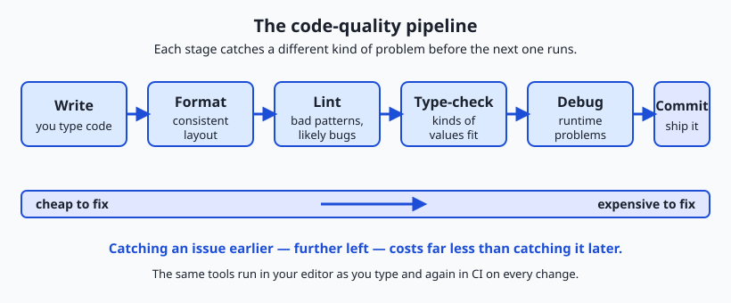
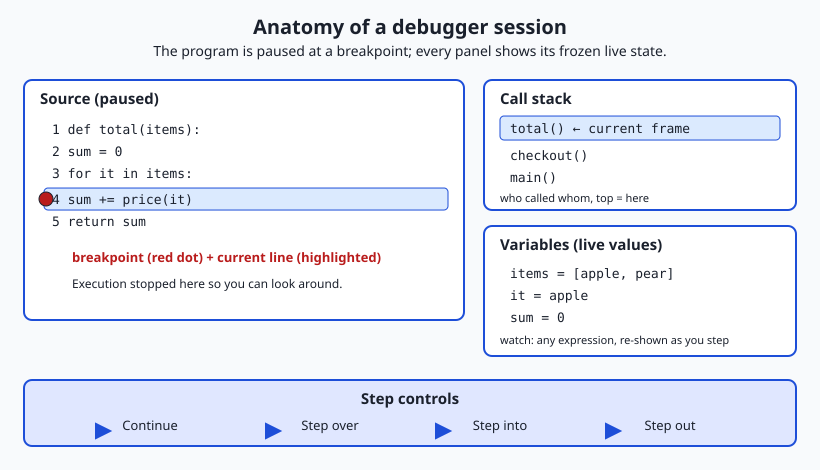

## Why this matters

Yesterday you set up a code editor. Today you meet the three tools that stand between your code and the two questions every professional asks of it: *is it correct?* and *is it consistent?* Debuggers, linters, and formatters answer those questions faster and more reliably than you ever could by rereading the file. They are the difference between staring at a screen wondering why a program misbehaves and watching, line by line, exactly what it does — and between a codebase that reads like one careful author wrote it and one that reads like a shouting match about tabs versus spaces.

This matters for your AI goal in a very direct, money-and-time way. When you start assembling AI systems, most of your effort will not be writing brand-new logic; it will be reading, reviewing, and repairing code — some of it yours, much of it produced quickly and needing a careful second pass. A linter reads that code without running it and flags the mistakes a tired human skims past: a variable used before it is set, a comparison that will silently fail, a shell script that breaks the moment a filename contains a space. A formatter rewrites the whole file to one house style in a fraction of a second, so nobody wastes a code review arguing about layout. And when something still goes wrong at runtime — the model loads the wrong config, the data pipeline produces empty batches — a debugger lets you freeze the program mid-run and inspect its insides, instead of sprinkling print statements and guessing.

The concrete payoff is that these tools catch problems *early*, and early is cheap. A bug a linter flags while you type costs seconds; the same bug caught by a colleague in review costs an afternoon; caught in production, at 2 a.m., during a training run that has already burned real GPU-hours, it costs far more. Today you learn what each tool does, when to reach for it, and how they chain together into a quality pipeline that runs on your machine and again automatically on every change. By the end you will have linted and formatted a real (deliberately broken) script with your own hands.

## The idea in plain language

Think of three distinct jobs, each done by a different kind of tool.

A **formatter** rewrites your code's *appearance* — indentation, spacing, line breaks, quote style — into one consistent layout, without changing what the code does. You save the file; the formatter reflows it. It never asks your opinion, which is exactly the point: it ends every debate about style by making style automatic and identical for everyone on the team.

A **linter** reads your code *without running it* and reports likely mistakes and bad patterns: a variable you defined but never used, a condition that can never be true, an unquoted value that will misbehave, a function called with the wrong number of arguments. This reading-without-running is called **static analysis** — "static" because the program sits still on disk rather than executing. A linter is a tireless proofreader who has memorized thousands of ways code commonly goes wrong.

A **debugger** is for when the code *does* run but behaves wrongly. It lets you pause a running program at a chosen line — a **breakpoint** — and then look around: inspect the current value of every variable, walk the chain of function calls that led here (the **call stack**), and advance one line at a time to watch exactly where reality diverges from your expectation. It replaces the crude habit of adding print statements everywhere with a live, interactive window into the machine.

A fourth tool, the **type checker**, sits between the linter and the debugger: it verifies, again without running the code, that the *kinds* of values fit together — that you are not passing a piece of text where a number is required, or reading a field off something that might be missing. Together these four form a pipeline: format so it reads cleanly, lint and type-check so obvious errors are gone before it ever runs, and debug the subtler problems that only appear in motion.

## Historical background

The word "lint" is not a metaphor invented by programmers for fun; it comes from an actual program. In 1978, Stephen C. Johnson at Bell Labs — the same lab that had produced the transistor three decades earlier — wrote a tool called `lint` to examine C source code for bugs and non-portable constructs that the C compiler of the day let slide. He named it after the bits of fluff a clothes dryer's lint trap catches: small, individually harmless, collectively worth removing. The name stuck so thoroughly that "to lint" and "a linter" are now ordinary verbs and nouns across every language, most of which never touch C.

Debuggers are older still, and so is the folklore around the word "bug." Engineers had used "bug" for a fault in machinery since at least the nineteenth century, and Thomas Edison used it in that sense in the 1870s. The most famous anecdote comes from 1947, when operators of the Harvard Mark II computer found a moth trapped in a relay, removed it, and taped it into the logbook with the note "first actual case of bug being found." The moth did not coin the term, but it perfectly captured it. Interactive debuggers — programs that let you halt another program and inspect it — grew up alongside time-sharing systems in the 1960s and matured into the graphical, breakpoint-driven tools you use today.

Automatic formatting arrived later and won its argument decisively only in the 2010s. Earlier "pretty-printers" existed, but they were optional and configurable, which meant teams still argued about the configuration. The turning point was tools that were deliberately *opinionated* — offering few or no options — so there was nothing left to argue about. Go shipped `gofmt` with the language in 2009 and made a single canonical style non-negotiable; the JavaScript formatter Prettier, first released in 2017, brought the same philosophy to the wider world. The lesson the industry learned is that the value of a formatter comes precisely from *removing* choices, not offering them.

## What it is — and what it is not

A debugger is a program that controls the execution of another program: it can start it, stop it at specified points, read and sometimes change its memory, and resume it. It is *not* a bug-finder in the sense of telling you where your logic is wrong — it shows you what the program is actually doing, and you supply the judgment about what is wrong. A debugger with no hypothesis to test is just a slow way to watch code run.

A linter is a static-analysis tool that inspects source code against a set of rules and reports violations. It is *not* a guarantee of correctness: it catches *patterns* known to be error-prone, not every possible mistake. A program can pass every lint rule and still be completely wrong, and a linter will occasionally flag something you did on purpose (a "false positive"). It is a smoke detector, not a fire marshal.

A formatter rewrites code's layout while preserving its behavior exactly. It is *not* a linter and does not judge correctness — it will happily format a program that is broken. Keeping these straight matters, because their failure modes differ.

| Common misconception | The reality |
| --- | --- |
| "A debugger finds bugs for me." | It shows you the program's live state; you still diagnose the fault. Its power is observation, not diagnosis. |
| "Linting means my code is correct." | Linting catches known bad patterns, not logic errors. Passing lint means "no obvious smells," not "works." |
| "A formatter and a linter do the same thing." | A formatter changes layout only; a linter judges patterns and can change meaning if you apply its fixes. |
| "Print statements are just as good as a debugger." | Prints show a few values at fixed points; a debugger lets you inspect *anything* live and change what you look at without editing code. |
| "These tools are for big teams, not beginners." | They help beginners most, catching the mistakes you don't yet know to look for and teaching you as they explain each one. |

## Why it was created and what problems it solves

Each tool exists because a specific kind of human failure is predictable and expensive. Formatters exist because humans are inconsistent and easily provoked into arguing about consistency. Two programmers will indent differently, break lines differently, and quote strings differently, and when their code meets in one file the differences show up as noise in every review — noise that hides the changes that actually matter. A formatter deletes this entire category of problem by making layout a settled, automatic fact.

Linters exist because humans skim. The eye slides past a variable named `resluts`, a comparison that uses assignment by accident, an unquoted shell variable that will shatter on the first path with a space. These mistakes are individually obvious once pointed out and collectively responsible for a huge share of real defects. A linter never skims: it applies the same thousands of checks to every line, every time, at a speed no reviewer can match.

Debuggers exist because the gap between what code *says* and what it *does* is where the hardest bugs live, and that gap is invisible in the source. When a program's behavior surprises you, reading the code again often just re-confirms your wrong mental model. A debugger breaks the loop by showing you the ground truth — the real value in that variable, the real path the program took — so you reason from evidence instead of assumption. Type checkers exist for a related reason: a large class of bugs are simple mismatches of kind (text where a number was meant, a missing value read as if present), and catching those before the program runs is far cheaper than discovering them mid-execution.

## How it works

Let's take each tool in turn, then see how they fit an editor and a continuous-integration (CI) system.

### How a linter and formatter read your code

A formatter and a linter both begin the same way: they *parse* your source into a structured, tree-shaped representation of its meaning, called an abstract syntax tree. Parsing means reading the raw characters and recognizing their grammar — "this is a function definition, this is its body, this is an `if` whose condition is a comparison." Once the code is a tree rather than a wall of text, the tools can work on structure instead of guessing with text search.

A **formatter** throws away your original spacing entirely and prints the tree back out according to fixed rules: this much indentation per level, a line break here, single quotes there. Because it regenerates the layout from the meaning, the result is identical no matter how messy the input was — that is why a formatter is deterministic and why running it twice changes nothing the second time.

A **linter** walks the same tree looking for shapes that match its rules. A rule like "no unused variables" is, concretely, "find every variable declaration, then check whether any later node reads it; if not, report the declaration." Some linters go further with **data-flow analysis**, tracing how values move through the program to catch a variable used before it is assigned, or a branch that can never execute. The output is a list of findings, each with a file, a line, and a short message naming the rule.



Read the pipeline left to right. You **write** code; a **formatter** makes it consistent on save; a **linter** flags bad patterns; a **type checker** confirms the kinds of values line up; a **debugger** helps you resolve the runtime problems that survive all of the above; and only then do you **commit**. The arrow beneath carries the whole moral of the day: a defect caught at the left edge costs seconds, and the same defect caught at the right edge — or past it, in production — costs orders of magnitude more. Every tool in the chain is a bet that moving detection leftward saves time and money, and it is a bet that pays.

### How a debugger controls a running program

A debugger works by inserting itself between your program and the machine. When you set a breakpoint on a line, the debugger arranges for the program to stop when execution reaches it — historically by temporarily replacing that instruction with a special "trap" that hands control back to the debugger. While the program is paused, its entire state is frozen and available for inspection.

The controls you will use every day are few:

- A **breakpoint** pauses execution at a chosen line. You can make it *conditional* — "stop here only when `count` is zero" — so you skip the thousand uninteresting iterations and stop on the one that matters.
- **Stepping** advances the paused program in small increments. **Step over** runs the next line and stops again, treating a function call as a single step. **Step into** descends into that called function to watch it line by line. **Step out** finishes the current function and stops at the line that called it.
- **Inspecting state** shows the current value of every variable in scope. A **watch expression** is a value you ask the debugger to keep re-evaluating and displaying as you step, so you can watch a single quantity evolve.
- The **call stack** is the ordered list of function calls that led to the current line — who called whom, all the way down. When a program stops deep inside a helper, the call stack tells you how it got there, and you can click up and down it to inspect each caller's variables.



The diagram lays out a paused session. The source panel shows a red breakpoint marker and a highlighted current line; the call stack panel lists the chain of calls with the current function on top; the variables panel shows each name and its live value; and the step controls — continue, step over, step into, step out — drive execution forward. This is the whole instrument. Everything else a debugger offers is a refinement of *stop here, look at this, move forward by that much.*

### How they fit an editor and CI

These tools live in two places, and both matter. In your **editor**, they run continuously as you type: the formatter reflows on save, the linter underlines problems in place, the type checker flags mismatches, and the debugger attaches to a running program with a click. This is the fast, private feedback loop — mistakes surface in seconds, before anyone else sees them.

In **CI** — an automated system that runs checks on a shared server every time code is pushed — the *same* linters and formatters run again, this time as a gate. CI re-formats and re-lints and, if anything is out of line, refuses the change until it is fixed. The editor loop is a courtesy to you; the CI loop is a guarantee to everyone else that nothing unformatted or lint-failing ever lands. Running identical tools in both places is deliberate: what you see locally is exactly what the gate enforces.

## An everyday analogy

Imagine preparing a manuscript for publication at a serious press. Four people touch it, each with a distinct job, and they map cleanly onto today's tools.

First the **typesetter** applies the house style: consistent margins, one space after each period, curly quotes throughout, chapters starting on the right-hand page. The typesetter does not judge whether the book is *good* — only that it *looks* uniform. Hand in a chapter typed in five different fonts and it comes back in one. That is your formatter: it never touches meaning, only appearance, and it makes every page look like the same hand set it.

Next the **copyeditor** reads for problems without staging the play in their head: a character introduced twice, a pronoun with no clear antecedent, a sentence that contradicts an earlier one, a word that is almost certainly a typo. The copyeditor works statically — reading the page, not performing it — and marks each issue with a note. That is your linter: static analysis, a checklist of known problems, a finding for each.

Then the **continuity editor** checks that references line up: a character called a doctor in chapter one is not a lawyer in chapter nine, and every mention of a place matches. That is your type checker, confirming the *kinds* of things agree before the story is set in motion.

Finally, when a scene still reads wrong despite clean copy, an editor sits beside the author and reads the passage *aloud together*, ready to stop at any sentence — "wait, here, what did you mean the character to be feeling?" — back up, and go forward one line at a time, examining exactly what is on the page at that moment. That live, pause-anywhere, inspect-anything reading is your debugger. Scribbling a note in the margin to check later is a print statement; stopping the read to look closely, together, at one exact moment is the debugger's power.

## Examples in practice

Here is a real shell script with three classic mistakes — the kind you will meet again in today's lab:

```bash
#!/bin/bash
name=$1
greeting="Hello there"
if [ $name = "admin" ]; then
  echo "Welcome, boss"
fi
echo "Hi, $name"
```

Read it as a linter would. First, `greeting` is assigned but never used — dead code that hints at an unfinished edit. Second, `$name` is *unquoted* on the `if` line: if you run the script with no argument, `$name` expands to nothing and the test becomes `[ = "admin" ]`, which is a syntax error; if the argument contains a space, the test breaks into multiple words and misbehaves. Third, single-bracket `[ ]` is the old, fragile test command, where unquoted empty values cause exactly these failures; the modern double-bracket `[[ ]]` handles them safely. A shell linter flags all three in under a second, each with a message and a line number. None of these is a syntax error the shell would refuse outright — the script "runs" — which is precisely why a linter earns its keep: it catches what merely running the code does not.

Now the same script through a **formatter**: the layout would be normalized (consistent indentation, spacing around the brackets, a blank line policy), but note what a formatter would *not* do — it would not fix the unquoted variable or the unused assignment, because those are *behavior* and *pattern* issues, not layout. This is the division of labor in action: the formatter makes it neat; the linter makes it sound.

Finally, imagine this script were longer and behaved wrongly at runtime — it printed "Welcome, boss" for the wrong user. Rereading might not reveal why. In a debugger you would set a breakpoint on the `if` line, run the script with a test argument, and inspect the live value of `name` at that exact moment. Seeing `name` hold `" admin"` with a stray leading space — invisible in the source — would explain the whole mystery in one look. That is the difference between guessing and seeing.

## Implications: security, privacy, performance, scalability, and cost

**Security.** Linters are a frontline security tool. Many catch dangerous patterns directly — a shell script that uses an unquoted variable an attacker could stuff with extra commands, code that builds a database query by pasting user input into a string. Specialized security linters (a practice called static application security testing) scan specifically for such patterns. Catching an injection flaw as a lint warning while you type is immeasurably cheaper than discovering it after a breach.

**Privacy.** These tools run locally and read only the files you point them at; the debugger and linter in your editor do not phone home with your source. That is worth verifying for any tool you adopt, because your code — and any secrets carelessly embedded in it — is sensitive. A good practice these tools enable is a linter rule that flags hard-coded credentials before they are ever committed.

**Performance.** Formatters and linters must be fast enough to run on every save without breaking your concentration, which is why the newest generation is written in fast systems languages and can check thousands of files in seconds. Debuggers have a different cost: a program runs noticeably slower under a debugger, and heavily used breakpoints add overhead, so you debug a focused scenario rather than a full production load.

**Scalability.** The real scaling story is CI. On a large project with many contributors, the only way to keep a codebase consistent and lint-clean is to enforce it automatically on every change; no amount of reviewer diligence scales to thousands of commits. Running the same formatter and linter in CI that everyone runs locally is what lets a large team's code keep reading as though one careful person wrote it.

**Cost.** The economics are the whole point of the pipeline diagram: the cost of a defect grows by orders of magnitude the later it is caught. A lint warning costs seconds; a bug found in review costs a person an afternoon; a bug found in production can cost outages, wasted compute, and lost trust. Every one of these tools is a mechanism for shifting detection earlier, and because they are free, the return is nearly all upside.

## Alternatives: free, open source, and commercial

The essential tools in this space are overwhelmingly free and open source. Here are the leading ones, what they do, and when to reach for each.

| Tool | Job | Language | When to use it | Cost |
| --- | --- | --- | --- | --- |
| ShellCheck | Linter | Shell / Bash | On every shell script — it catches quoting, test, and portability bugs that silently break scripts | Free, open source |
| ESLint | Linter | JavaScript / TypeScript | The standard JS linter; configurable rules for bugs and style | Free, open source |
| Prettier | Formatter | JS, CSS, HTML, and more | When you want layout settled automatically with near-zero configuration | Free, open source |
| Ruff | Linter (+ formatter) | Python | A very fast, all-in-one Python linter and formatter; increasingly the default | Free, open source |
| Black | Formatter | Python | The opinionated Python formatter that ended most style debates | Free, open source |
| flake8 | Linter | Python | A long-standing, widely taught Python linter | Free, open source |
| Debug Adapter Protocol (DAP) | Debugger interface | Any (via adapters) | The shared protocol that lets one editor debug many languages | Free, open standard |

A few notes on choosing. **ShellCheck** is the one you will use today: point it at any `.sh` file and it explains, with a code and a link, exactly what is fragile and why. For **Python**, the modern default is increasingly **Ruff**, which rolls linting and formatting into one fast tool, though the long-established pairing of **flake8** (lint) with **Black** (format) is still everywhere and worth recognizing. For **JavaScript**, the near-universal pairing is **ESLint** (lint) with **Prettier** (format) — ESLint judges patterns, Prettier owns layout, and keeping the two jobs separate avoids conflicts. For **debuggers**, most languages ship one (Python's is built in), and modern editors talk to all of them through the **Debug Adapter Protocol**, a shared standard so a single debugger user interface can drive many languages. Commercial options exist — richer profilers, enterprise security scanners, integrated development environments with advanced debuggers — but for everything in this lesson, the free tools are the standard the professionals actually use.

## Comparison with related concepts

It is easy to blur these tools together; the differences are what make them useful.

| Aspect | Linter | Formatter | Type checker |
| --- | --- | --- | --- |
| Runs the code? | No (static) | No (static) | No (static) |
| Changes your code? | Only if you apply its fixes | Yes — rewrites layout | No — reports only |
| What it catches | Bad patterns, likely bugs | Inconsistent style | Mismatched kinds of values |
| Can it be wrong? | Yes — false positives happen | No — it only reflows layout | Rarely, but can be over-strict |
| Typical verdict | "This looks risky" | "This is now consistent" | "These types don't fit" |

And the sharpest distinction of all — the linter family versus the debugger:

| | Linter / formatter / type checker | Debugger |
| --- | --- | --- |
| When it works | Before the code runs (static) | While the code runs (dynamic) |
| What it needs | Just the source on disk | A running program and a scenario |
| What it finds | Broad classes of known problems | The specific cause of one live problem |
| Effort | Automatic, on every file | Interactive, aimed at one bug |
| Best at | Preventing whole categories of mistakes | Explaining a mystery you can reproduce |

The takeaway: static tools cast a wide, cheap, automatic net to prevent common failures; a debugger is a precise, hands-on instrument for the one stubborn failure that slipped through. You want both, at different moments.

### Debugger versus logging

Since you will constantly weigh "should I add a print statement or open a debugger?", here is the trade-off head to head:

| | Print / logging | Debugger |
| --- | --- | --- |
| Setup | Edit code, add a print, re-run | Set a breakpoint, run under the debugger |
| What you see | Only the values you thought to print | Any variable, live, and you can change your mind |
| Time travel | Re-run to see more | Step forward, inspect the call stack, back up a frame |
| Good for | Rare or hard-to-reproduce events; production; long-running jobs | A reproducible bug you can trigger on demand |
| Leaves a trace | A permanent log line (useful later) | Nothing persists after the session |

Neither wins outright. Reach for the debugger when you can reproduce a bug on demand and want to explore. Reach for logging when the problem is rare, happens in production where you cannot attach a debugger, or when you want a durable record of what happened. Experienced developers use both fluidly.

## When to use it — and when not to

Run a **formatter** always and everywhere — on every file, on every save, with no exceptions. Its whole value comes from being universal and automatic; a formatter used "sometimes" just adds a new inconsistency. Configure it once for the project and forget it.

Run a **linter** on everything too, but treat its findings as advice, not gospel. Fix the true positives promptly; for the occasional false positive, use the linter's mechanism to suppress that one rule on that one line, with a brief note explaining why — never disable a whole rule across the project to silence a single complaint you don't understand. The linter is a colleague worth listening to, not a tyrant.

Reach for a **debugger** when you have a bug you can *reproduce* and your mental model of the code has failed you — when rereading the source keeps confirming an assumption that must be false. The debugger's superpower is turning assumption into evidence. Do *not* reach for it as a substitute for thinking: a debugger with no hypothesis is an aimless tour of a running program. And do not use it where logging fits better — for rare production events or long unattended jobs, a well-placed log line is the right tool. The professional habit is to prevent with static tools, observe with logs, and investigate with the debugger, choosing by the shape of the problem in front of you.

## The AI connection

A great deal of the code you will handle — configuration, data loading, model glue
— arrives quickly and needs a rigorous second pass. Generated code is no
exception, and it fails in a particular way: it is plausible-looking and subtly
wrong, which is precisely what a linter is built to catch.

Running a formatter and a linter over code before trusting it turns "looks fine"
into "checked". It also makes the whole codebase read consistently regardless of
who or what produced each line, which is what makes review of generated code
practical at all — a diff then shows what changed rather than whose tool last
touched the file.

When something still misbehaves at run time, the debugger is how you find out why
by looking rather than guessing. On a serious project these three tools are not
busywork around the real work; they are a large part of how the real work gets
done correctly.

---

## Knowledge check

Try these from memory before looking back:

1. In one sentence each, state the distinct job of a formatter, a linter, and a debugger, and say which one changes the layout of your code.
2. Explain the difference between "step over" and "step into" when debugging, and describe a moment you would want each.
3. A shell script passes the shell's own syntax check (`bash -n`) but a linter still complains about an unquoted variable. How can both be true, and why does the linter's complaint matter?
4. Your program prints "Welcome, boss" for the wrong user, and you can reproduce it every time. Would you reach for logging or a debugger, and what would you inspect first?
5. Why do teams run the *same* linter and formatter in CI that developers already run locally, instead of trusting the local runs alone?

## Hands-on exercise

Time to run these tools on real, broken code. In the Day 37 lab you will take a deliberately flawed shell script and put it through a small quality gate: a syntax check, a lint pass with ShellCheck, and a formatting check — the same layered pipeline this lesson describes, in miniature.

From the lab directory, first look at the flawed sample and confirm the shell itself accepts it:

```bash
cat examples/samples/buggy.sh
bash -n examples/samples/buggy.sh
```

`bash -n` reads the script and checks its *syntax* without running it — the shell's own tiny built-in linter. A clean script produces no output and exits 0. Now run the full quality check the lab provides:

```bash
bash examples/quality_check.sh examples/samples/buggy.sh
```

This script runs the syntax check, then runs ShellCheck on the sample *if ShellCheck is installed* — and if it is not, it says so clearly and describes what ShellCheck would catch, rather than failing. Finally it does a simple, editor-agnostic formatting check with `grep`, flagging trailing whitespace and stray tabs. Read every line of its output against the lesson: which findings are *syntax*, which are *lint* (pattern) issues, and which are *formatting*?

### Expected output

Running the quality check on the buggy sample, on a machine **without** ShellCheck installed, produces output of this shape (captured from a real run):

```text
=== Quality check: examples/samples/buggy.sh ===

[1/3] Syntax check (bash -n)...
  ok: script is syntactically valid.

[2/3] Lint check (shellcheck)...
  SKIP: shellcheck is not installed on this machine.
        Install it (free) to catch bugs like:
        - SC2086: unquoted $variable may word-split or glob
        - SC2034: variable appears unused
        - using [ ] where [[ ]] is safer
        See requirements/README.md for install instructions.

[3/3] Formatting check (trailing whitespace / tabs)...
  FAIL: found 1 line(s) with trailing whitespace.
    13:echo "Hi, $name"   
  FAIL: found 1 line(s) containing tab indentation.
    14:	echo "all done"

Summary: syntax OK; lint skipped (shellcheck absent); formatting issues found.
```

On a machine *with* ShellCheck installed, step 2 instead prints ShellCheck's real findings (SC2086, SC2034, and the test-command warning) with line numbers. Either way the script exits 0 — it is a report, not a gate that stops your work. Your values may differ slightly if you edit the sample.

### Validate your work

You are done when you can check every box:

- [ ] You ran `bash -n` on the sample and can say whether it reported a syntax error.
- [ ] You ran `examples/quality_check.sh` and read all three sections of its output.
- [ ] You can name at least one issue the syntax check catches and one the formatting check catches.
- [ ] You can name at least one issue ShellCheck catches (or *would* catch, if it is not installed on your machine).
- [ ] You completed the four numbered exercises in `starter/quality_check.sh`.
- [ ] You filled in `starter/quality-worksheet.md` with one syntax issue, one lint issue, and one formatting issue.
- [ ] `bash tests/run_tests.sh` passes (final line reports 0 failures).

### Troubleshooting

- **`bash -n` printed nothing.** That is success — no output and exit 0 means the syntax is valid. Check the exit code with `echo $?` if you want confirmation.
- **`shellcheck: command not found`.** ShellCheck is optional. The lab's quality check detects its absence and degrades gracefully; you lose only the lint step. To gain it, see `requirements/README.md` (install is free — `brew install shellcheck` on macOS, `apt install shellcheck` on Debian/Ubuntu).
- **The formatting check flags nothing on your own script.** Good — that means no trailing whitespace or tabs. To see it fire, add a space at the end of a line and re-run.
- **`Permission denied` running a script.** Run it through bash explicitly, e.g. `bash examples/quality_check.sh ...`, rather than `./`.

### Common mistakes

- **Assuming "it runs" means "it's fine."** The buggy sample runs without a syntax error, yet ShellCheck flags real bugs in it. Running is a low bar; passing the linter is a higher one.
- **Expecting the formatter check to fix quoting.** The formatting step only looks at whitespace and tabs — layout. The quoting and unused-variable problems are the linter's department, not the formatter's. Keep the two jobs straight.
- **Silencing a warning instead of understanding it.** If a check flags something, read the message and the rule before you suppress it. The point is to learn what is fragile, not to make the report quiet.

## Practice assignment

Open `starter/quality-worksheet.md` in the lab and complete it for the buggy sample. Record, with line numbers: one issue that `bash -n` catches (you may need to introduce a syntax error to see it fire, then undo it), one issue that ShellCheck catches or would catch (name the SC code if you have ShellCheck installed; otherwise describe the bug from the lesson), and one formatting issue the whitespace check reports. Then write one short paragraph (4–6 sentences) explaining, in your own words, why a script can pass the syntax check yet still be full of the bugs a linter finds — tie it back to the difference between "the shell can parse this" and "this will behave correctly." Keep the worksheet; it is the seed of the Week 6 project, in which formatting and linting run automatically on every commit.

## Extension challenge

Install ShellCheck (it is free and open source: `brew install shellcheck` on macOS, `sudo apt install shellcheck` on Debian/Ubuntu) and re-run the lab's quality check on the buggy sample. Read ShellCheck's real output and look up two of the rule codes it reports (for example `SC2086` and `SC2034`) — each code links to a wiki page explaining the bug and the fix. Then fix the sample: quote the variables, remove or use the unused variable, and switch the fragile `[ ]` test to `[[ ]]`. Re-run the quality check and confirm ShellCheck now reports nothing. Finally, add a trailing space to one line on purpose and watch the formatting check catch it while ShellCheck stays silent — a concrete demonstration that the formatter and the linter police different things. Write two or three sentences on what each tool did and did not catch, and why that division of labor is exactly what you want.
