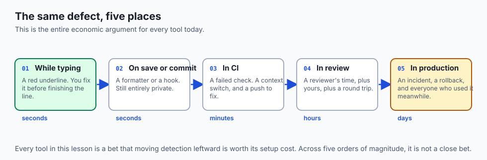
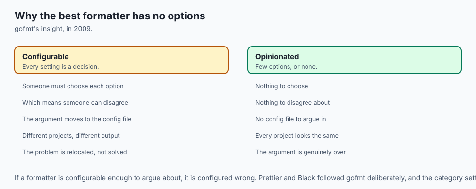
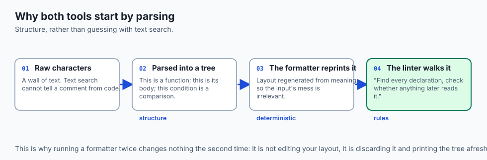
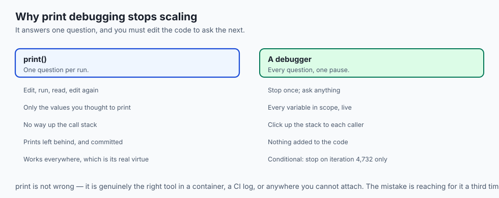
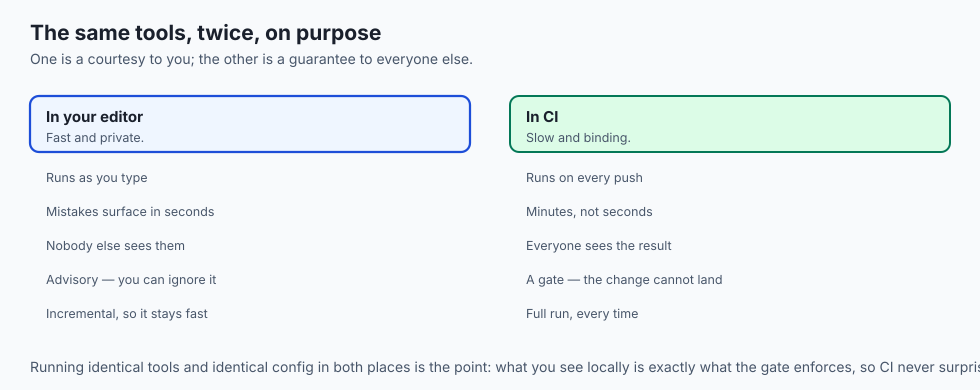
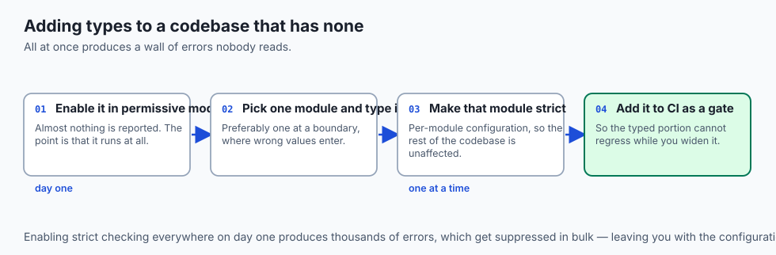
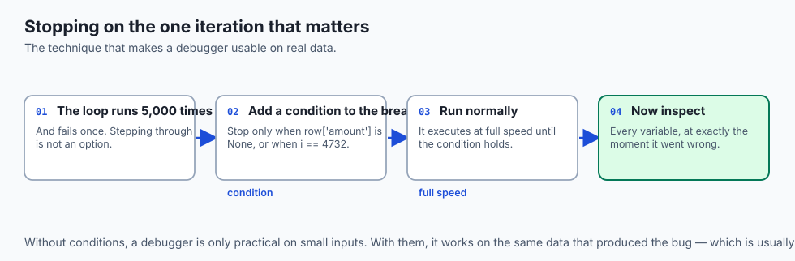
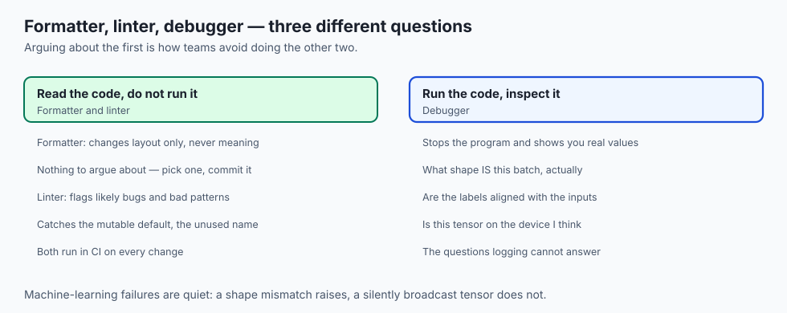
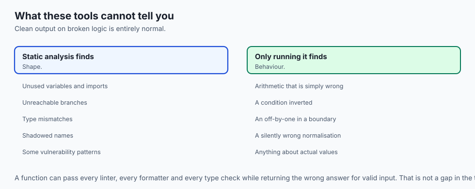
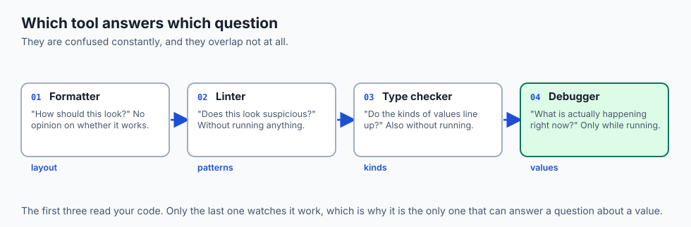

## Why this matters

- **A defect caught while typing costs seconds.** The same defect in production costs
  orders of magnitude more, and every tool today is a bet on moving detection leftward.

- **`print` debugging works and does not scale.** A debugger shows you every variable
  at once, without editing the program.

- **Formatting arguments end permanently** the day a formatter runs on save.
- **A linter catches the class of mistake not worth a human's attention**, which frees
  review for the things that are.

- **AI-generated code needs these tools more, not less**, because it is fluent and
  confidently wrong in ways that read as correct.

---

## The idea in plain language



- **Three tools, three different jobs**, and people confuse them constantly.
- **A formatter decides how code looks.** It has no opinion about whether it works.
- **A linter finds suspicious patterns** without running anything.
- **A debugger pauses a running program** so you can look at its actual state.
- **The first two are automatic and opinionated; the third is a microscope you drive.**

---

## Historical background



- **`lint` was written in 1978** for C, to catch what the compiler let through. The name
  became the whole category.

- **Early debuggers were part of the machine**, not the language — you stepped through
  instructions, not statements.

- **`gdb`, 1986, made source-level debugging standard**: breakpoints on lines you
  wrote, not addresses.

- **Formatters were a late arrival**, and the change was `gofmt` in 2009: no options at
  all, so there was nothing left to argue about.

- **That decision was the insight.** A formatter with settings recreates the argument
  it was meant to end.

- **Prettier and Black followed the same philosophy**, and the category settled into
  "opinionated, deterministic, non-negotiable".

---

## What it is — and what it is not

**These tools are:**

- Automated readers of your code, at three different depths.
- Complementary. Each catches things the others cannot.
- Cheap to run and worth running constantly.

**They are not:**

- **Not interchangeable.** A linter cannot tell you why a value is wrong at runtime; a
  debugger cannot tell you a variable is unused.

- **Not a substitute for tests.** They check shape and let you inspect state; tests
  check behaviour.

- **Not proof of correctness.** Clean lint output on broken logic is entirely normal.
- **Not worth arguing with.** A formatter's output is the point; if it is configurable
  enough to argue about, it is configured wrong.

---

## Why it was created and what problems it solves

- **Consistency without conversation.** Formatting is a real cost only while it is
  negotiable.

- **Catching the mechanical mistakes** — unused variables, unreachable branches,
  shadowed names — before a person reads the code.

- **Understanding a running program.** `print` statements answer one question at a
  time and require editing the code to ask the next.

- **Reducing review load.** Every issue a machine catches is attention freed for
  design.

- **Making detection early rather than late**, which is the whole economic argument.

---

## How it works

### How a linter and a formatter read your code



- **Both begin by parsing your source into a tree** — an abstract syntax tree — that
  represents its meaning: this is a function definition, this is its body, this is an
  `if` whose condition is a comparison.

- **Once code is a tree rather than a wall of text**, the tools work on structure
  rather than guessing with text search.

- **A formatter throws away your original spacing entirely** and prints the tree back
  out by fixed rules.

- **Because it regenerates layout from meaning**, the result is identical however
  messy the input — which is why it is deterministic and why running it twice changes
  nothing.

- **A linter walks the same tree looking for shapes.** "No unused variables" is
  concretely: find every declaration, check whether any later node reads it, report if
  not.

- **Some go further with data-flow analysis**, tracing how values move to catch a
  variable used before assignment, or a branch that can never execute.

### The pipeline


- **You write; a formatter makes it consistent on save; a linter flags bad patterns; a
  type checker confirms the kinds line up; a debugger resolves what survives; then you
  commit.**

- **The arrow underneath carries the moral**: a defect caught at the left edge costs
  seconds, and the same defect at the right edge — or past it, in production — costs
  orders of magnitude more.

### How a debugger controls a running program



- **It inserts itself between your program and the machine.** A breakpoint arranges for
  execution to stop at a chosen line — historically by replacing that instruction with
  a trap that hands control back.

- **While paused, the entire state is frozen** and available for inspection.
- **A breakpoint can be conditional** — "stop only when `count` is zero" — so you skip
  the thousand uninteresting iterations.

- **Step over** runs the next line, treating a call as one step. **Step into** descends
  into the call. **Step out** finishes the current function and stops at its caller.

- **A watch expression** is a value the debugger re-evaluates as you step, so you can
  watch one quantity evolve.

- **The call stack is the chain of calls** that led here. When a program stops deep in
  a helper, it tells you how it got there, and you can click up it to inspect each
  caller's variables.


- **That is the whole instrument.** Everything else is a refinement of *stop here, look
  at this, move forward by that much.*

### Where they live



- **In your editor** they run as you type: format on save, lint underlines, type
  mismatches flagged, the debugger a click away. Fast, private feedback.

- **In CI** the *same* tools run again as a gate, refusing the change until it passes.
- **The editor loop is a courtesy to you; the CI loop is a guarantee to everyone
  else.**

- **Running identical tools in both places is deliberate**, so what you see locally is
  exactly what the gate enforces.

---

## An everyday analogy



Producing a manuscript.

| Publishing | The tools |
| --- | --- |
| The house typesetting standard | A formatter |
| A copy-editor marking suspicious phrasing | A linter |
| Checking that names and dates are consistent | A type checker |
| Reading aloud to find where it stops making sense | A debugger |
| The proof stage before printing | CI |

- **The typesetter does not argue about margins.** There is a standard, and it is
  applied.

- **The copy-editor flags what looks wrong** without knowing whether the argument is
  true.

- **Reading aloud is the only one that requires the thing to actually run**, and it is
  the one that finds what the others cannot.

---

## Examples in practice





- **A pull request with 400 changed lines** because two people's formatters disagreed.
- **A linter catching a variable assigned and never used**, which was a typo in the name
  it should have been assigned to.

- **A conditional breakpoint on iteration 4,732**, which is the case that fails, without
  stepping through the first 4,731.

- **A call stack revealing an unexpected caller**, which is usually the moment a
  confusing bug becomes obvious.

- **Clean lint output on completely broken logic**, which is the reminder that these
  tools check shape, not correctness.

---

## Implications: security, privacy, performance, scalability, and cost



- **Security: linters catch real vulnerability classes** — string-built SQL, unsafe
  deserialisation, hard-coded credentials — and security-specific linters catch more.

- **A secret-scanning linter in a pre-commit hook** is the only control in this course
  that acts before the mistake, as Day 35 established.

- **Privacy: some hosted analysis tools upload your code.** Know which of yours do.
- **Performance: linters and type checkers cost real time on a large codebase**, which
  is why editors run them incrementally and CI runs them fully.

- **Cost: the economics are the whole argument.** Seconds in the editor, minutes in CI,
  hours in review, days in production — for the same defect.

- **Cost of over-configuration is real.** A linter with two hundred custom rules trains
  people to suppress warnings without reading them.

---

## Alternatives: free, open source, and commercial

| Tool | Type | What it does |
| --- | --- | --- |
| Black, Prettier, `gofmt` | Free, open source | Formatters with few or no options, by design |
| Ruff, ESLint, Pylint | Free, open source | Linters; Ruff is fast enough to run on every keystroke |
| mypy, Pyright, TypeScript | Free, open source | Type checkers, which catch a different class again |
| `pdb`, `debugpy`, editor debuggers | Free, built in | Breakpoints and stepping |
| `pre-commit` | Free, open source | Runs all of them before a commit lands |
| Bandit, Semgrep | Free, open source | Security-focused linting |

- **Choose the opinionated formatter.** The one with fewer settings is the one that
  ends the argument.

- **Learn your language's debugger before your next hard bug**, not during it. Ten
  minutes when calm is worth an hour when stuck.

---

## Comparison with related concepts

| Term | What it actually is |
| --- | --- |
| **Formatter** | Rewrites layout; never changes behaviour |
| **Linter** | Flags suspicious patterns without running the code |
| **Type checker** | Verifies the kinds of values line up |
| **Debugger** | Pauses a running program so you can inspect it |
| **Breakpoint** | A line where execution stops |
| **Call stack** | The chain of calls that reached this line |
| **CI** | The same checks, run as a gate on every push |

---

## When to use it — and when not to



- **Run the formatter on save, always.** Never think about it again.
- **Run the linter continuously**, and fix findings rather than suppressing them.
- **Reach for the debugger the second time a `print` does not answer the question.**
- **Use a conditional breakpoint** whenever the failure is in one iteration of many.
- **Run identical tools locally and in CI**, so the gate never surprises you.
- **Do not configure a formatter extensively.** Its whole value is that nobody argues
  with it.

- **Do not suppress a lint warning without reading it.** The rules exist because
  someone was bitten.

- **Do not use a debugger for something a test would catch permanently.**

---

## The AI connection

- **AI-generated code needs these tools more than hand-written code**, because it is
  fluent, plausible, and wrong in ways that read as correct.

- **A type checker catches the commonest failure**: a call with plausible arguments in
  the wrong order or of the wrong kind.

- **Debugging a training loop means inspecting tensor shapes**, and a conditional
  breakpoint on the batch that fails saves stepping through thousands.

- **Numerical bugs are the hard case.** A shape mismatch raises; a silently wrong
  normalisation does not, and only inspecting values finds it.

- **Consistent formatting matters more with generated code**, because you will read far
  more of it than you write.

---

## Knowledge check

```yaml
quiz:
  question: "A codebase passes its linter and its formatter cleanly, yet a function returns the wrong result for valid input. Why did neither tool catch it?"
  options:
    - "Both analyse the code's structure without running it, so neither can evaluate what a function actually computes"
    - "The linter's rules for that language do not cover return values"
    - "The formatter reformatted the function and obscured the defect from the linter"
    - "Static analysis runs before the code compiles, so runtime paths are not visible"
  answer_index: 0
  explanation: "Linters and formatters work on a parsed representation of the source and never execute it. They can tell you a variable is unused or a branch is unreachable; they cannot tell you the arithmetic inside is wrong, which is what tests and a debugger are for."
```

---

## Hands-on exercise

Run all three on real code, and find a bug with the debugger rather than with prints.
Worked through fully in the Day 37 lab directory.

| What you are doing | Command |
| --- | --- |
| Format a messy file | `black messy.py` or `prettier --write messy.js` |
| Confirm it is deterministic | Run it twice; the second run changes nothing |
| Lint it | `ruff check .` or `eslint .` |
| Fix what it finds | And note which finding was a real bug |
| Type check | `mypy .` or `pyright` |
| Debug with a breakpoint | `python3 -m pdb script.py`, or your editor's debugger |
| Set a conditional breakpoint | Stop only when the failing input arrives |

### Expected output

```text
reformatted messy.py
All done! 1 file reformatted.
messy.py:14:5: F841 local variable 'reuslt' is assigned to but never used
messy.py:22: error: Argument 1 has incompatible type "str"; expected "int"
> /project/script.py(31)process()
-> total = total + row['amount']
(Pdb) p row
{'amount': None, 'id': 4732}
```

- **`reuslt` is a typo**, caught by "assigned but never used" — a linter finding that
  is a real bug.

- **`p row` showed the actual value** at the moment it failed: `amount` is `None`, which
  no amount of reading the code would have told you.

### Validate your work

- [ ] You formatted a file and confirmed a second run changed nothing
- [ ] You found at least one lint warning that was a genuine bug
- [ ] You ran a type checker and can name a class of error it catches that the linter
      does not

- [ ] You set a breakpoint and inspected a variable's actual value
- [ ] You used a conditional breakpoint to stop on a specific iteration
- [ ] `bash tests/run_tests.sh` reports 0 failures

### Troubleshooting

- **The formatter and the linter disagree.** Configure the linter to defer on
  formatting rules; most have a preset for exactly this.

- **The debugger will not attach.** Usually the wrong interpreter or working directory
  in the launch configuration.

- **The breakpoint is never hit.** That line is not being executed. That is itself the
  finding.

- **The type checker floods you with errors** on an untyped codebase. Enable it
  gradually, module by module.

### Common mistakes

- **Suppressing warnings without reading them.**
- **Configuring the formatter** instead of accepting it.
- **Using `print` for the third time** on the same bug.
- **Believing clean lint output means correct code.**

---

## Practice assignment

- **Set up all three tools** on a project you own, plus a pre-commit hook that runs
  them.

- **Fix every lint warning in one file**, and record which were style and which were
  real bugs. The ratio is usually surprising.

- **Debug one bug entirely without `print`**, using breakpoints and the variables panel.
- **Read a call stack from a real exception** and identify the caller that passed the
  bad value.

---

## Extension challenge

- **Write a custom lint rule** for a mistake your project makes repeatedly. Encoding a
  team's hard-won knowledge as a rule is the most durable form of code review.

- **Debug a program you did not write**, using only the call stack and breakpoints to
  understand its flow. This is the skill that makes an unfamiliar codebase approachable.

- **Measure the pipeline economics.** Track where ten real defects were caught —
  editor, CI, review, or production — and how long each took to fix.

- **Attach a debugger to a running process** rather than starting one under it. It is
  the technique for problems that only happen in a long-running job.

---

