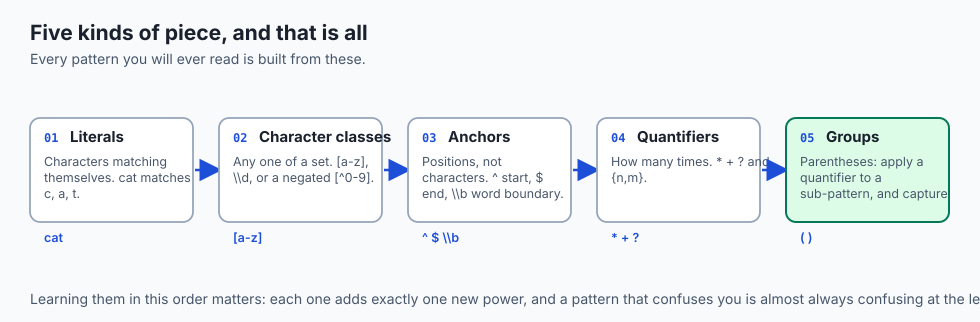
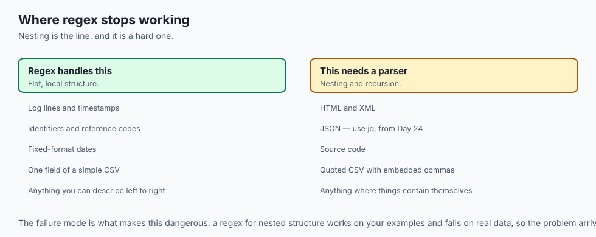
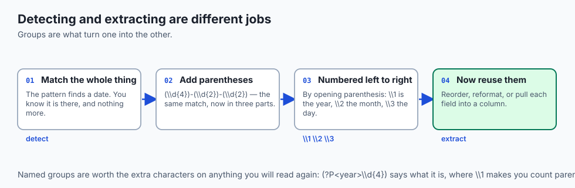
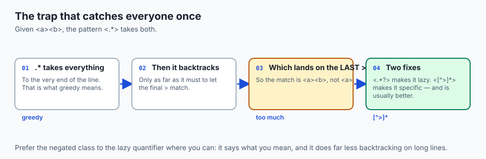
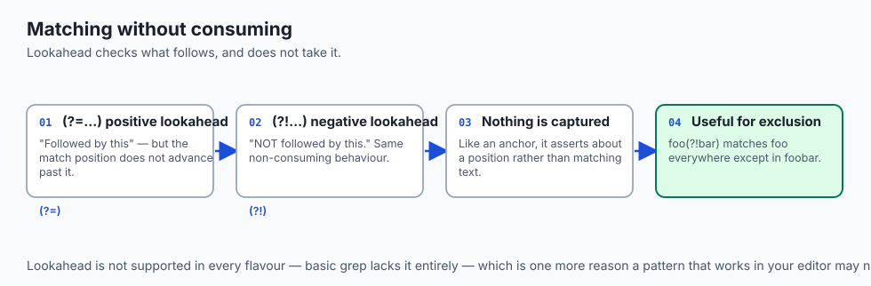
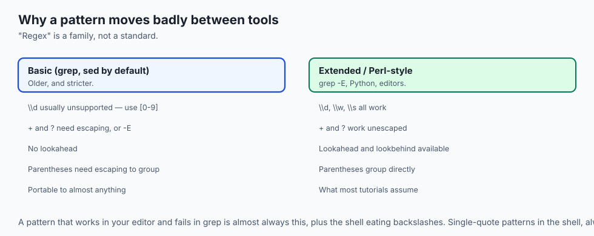
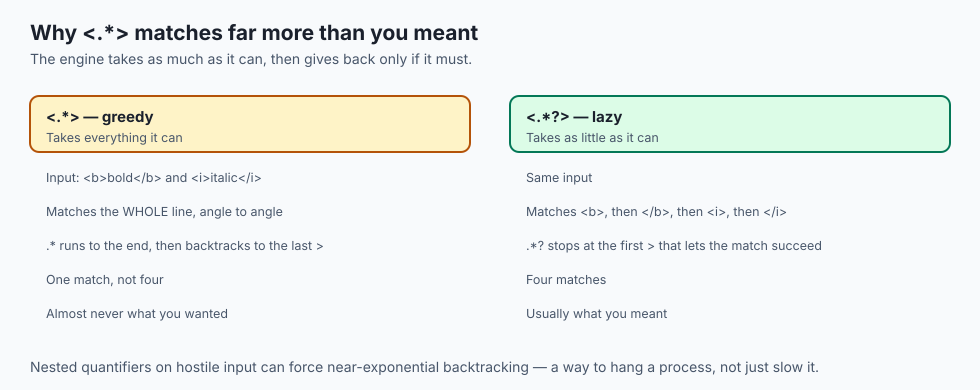
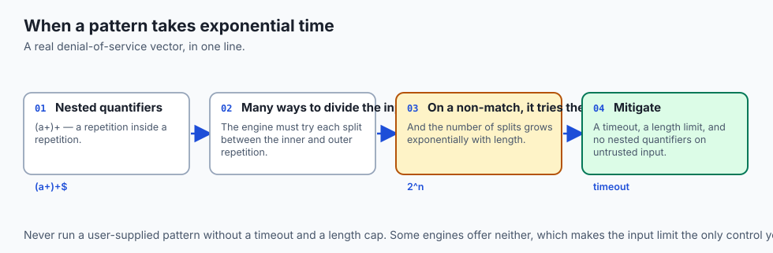
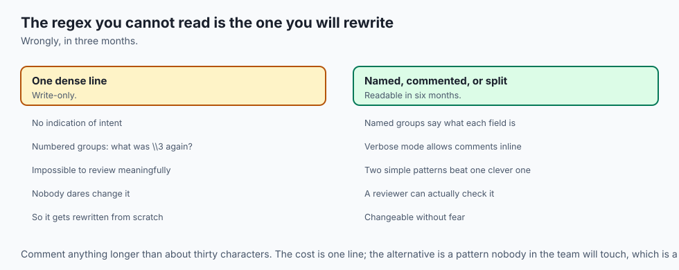
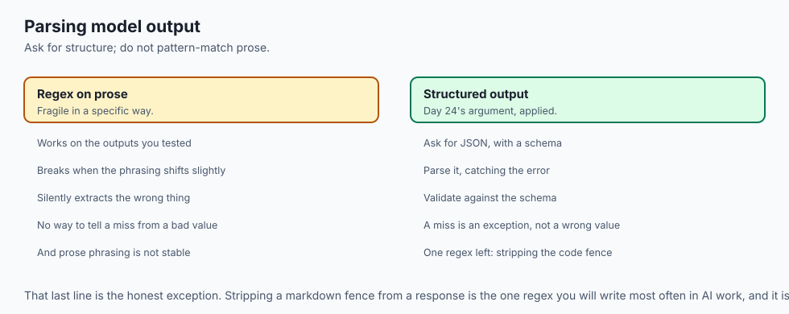

## Why this matters

- **Regex is the pattern language embedded in everything** — `grep`, `sed`, your
  editor, every programming language, log tools, and validation everywhere.
- **Data cleaning is mostly pattern matching**, and that is most of the work before any
  model sees anything.
- **The greedy-versus-lazy trap catches everyone once**, and knowing it saves the same
  hour repeatedly.
- **Catastrophic backtracking is a real denial-of-service vector**, and a regex on
  untrusted input is a security decision.
- **Day 10 gave you a taste.** Today is the whole thing.

---

## The idea in plain language



- **A regular expression describes a shape that text might have**, rather than the text
  itself.
- **You build patterns from a few kinds of piece**: literals, character classes,
  anchors, quantifiers and groups.
- **The engine scans left to right**, trying the whole pattern at each position until
  something fits.
- **Groups capture**, which is how you extract parts rather than merely detect a match.
- **Quantifiers are greedy by default** — they take as much as they can — and that
  single fact explains most surprising results.

---

## Historical background

- **Regular expressions come from mathematics**, formalised by Stephen Kleene in the
  1950s as a way of describing sets of strings.
- **Ken Thompson put them into a text editor in 1968**, and the notation has barely
  changed since.
- **`grep` is named after the editor command** `g/re/p` — globally search a regular
  expression and print.
- **Perl extended the syntax substantially in the 1980s and 90s**, adding lookahead,
  backreferences and lazy quantifiers.
- **Those extensions are why "regex" now means two different things**: the
  mathematical regular languages, and the far more powerful engines everyone actually
  uses.
- **The extra power came at a cost**: backreferences in particular make the worst case
  exponential, which is where catastrophic backtracking comes from.

---

## What it is — and what it is not



**A regex is:**

- A compact language for describing text patterns.
- Available in essentially every tool and language you will use.
- Excellent at line-oriented, locally-structured text.

**It is not:**

- **Not a parser.** Nested structure — HTML, JSON, source code — is beyond what it can
  reliably do, and attempts produce something that works on your examples and fails on
  real data.
- **Not the same everywhere.** Flavours differ in escaping, lookahead support and
  shorthand meanings; the differences bite exactly when you copy a pattern between
  tools.
- **Not free.** A badly formed pattern on hostile input can take exponential time.
- **Not self-documenting.** A regex you wrote three months ago is a puzzle unless you
  commented it.

---

## Why it was created and what problems it solves

- **Describing a class of strings** rather than enumerating them.
- **Search beyond exact text.** "Any date", "any address", "any line starting with
  Error" are not literals.
- **Extraction.** Capture groups pull structured fields out of unstructured text.
- **Validation.** A single expression can state what a well-formed input looks like.
- **Portability of the idea.** Learn it once and it works in your editor, your shell,
  your language, and your log tool.

---

## How it works

### Building blocks

- **Literals** match themselves: `cat` matches those three letters in a row.
- **A character class** matches any one of several: `[abc]` is one `a`, `b` or `c`.
- **A hyphen makes a range**: `[a-z]`, `[0-9]`, `[A-Za-z0-9]`.
- **A leading caret negates**: `[^0-9]` is any single character that is *not* a digit.
- **Shorthands**: `\d` is a digit, `\w` a word character (letters, digits,
  underscore), `\s` whitespace. Capitals invert them — `\D`, `\W`, `\S`.
- **A lone `.` matches any character except a newline** — the widest net there is, and
  a common source of over-matching.

### Anchors

- **Anchors match positions, not characters**, and consume nothing.
- **`^` is the start of the line; `$` is the end.** So `^cat` matches only at the start,
  `cat$` only at the end, and `^cat$` only on a line that is exactly `cat`.
- **`\b` is a word boundary** — the position between a word character and a non-word
  character.
- **`\bcat\b` matches the word `cat`** but not the `cat` inside `category` or
  `concatenate`, which is exactly what whole-word search means.

### Quantifiers

| Quantifier | Meaning | Example | Matches | Does not match |
| --- | --- | --- | --- | --- |
| `*` | zero or more | `ab*c` | `ac`, `abc`, `abbbc` | `adc` |
| `+` | one or more | `ab+c` | `abc`, `abbc` | `ac` |
| `?` | zero or one | `ab?c` | `ac`, `abc` | `abbc` |
| `{n}` | exactly n | `a{3}` | `aaa` | `aa` |
| `{n,}` | n or more | `a{2,}` | `aa`, `aaaa` | `a` |
| `{n,m}` | between n and m | `a{2,4}` | `aa`, `aaa`, `aaaa` | `a` |

- **A quantifier attaches to whatever immediately precedes it** — a character, a class,
  or a group.
- **`colou?r` matches both spellings**; `\d{4}` is exactly four digits.

### Groups, alternation and backreferences



- **Parentheses create a group**, which does two jobs.
- **First, a quantifier can apply to a whole sub-pattern**: `(ab)+` matches `ab`,
  `abab`, `ababab`.
- **Second, a group captures.** The engine remembers what it matched, numbered left to
  right by opening parenthesis.
- **Capturing is how you extract**: match a whole date, capture year, month and day
  separately.
- **`|` is alternation** — `cat|dog`, or `gr(a|e)y`.
- **A backreference demands the same text again**: `(\w+) \1` matches a doubled word,
  turning `the the` into a match and leaving `the cat` alone.


- **Read `^(\d{4})-(\d{2})-(\d{2})$` as a labelled specimen**: anchors pin it to a
  whole line, each `(\d{...})` is a capture group of fixed length, and the `-` is a
  literal hyphen. Every regex is some assembly of these same parts.

### Greedy versus lazy



- **Quantifiers are greedy by default**: they match as much as they can while still
  letting the whole pattern succeed.
- **Given `<a><b>` and the pattern `<.*>`**, you might expect `<a>`. You get the whole
  `<a><b>`, because `.*` swallowed everything up to the *last* `>`.
- **Adding `?` makes a quantifier lazy**: `<.*?>` matches just `<a>`.
- **This is the single most common reason a pattern matches too much**, and the fix is
  either a `?` or a more specific class — `[^>]*` instead of `.*`.

### How the engine scans


- **It tries the whole pattern starting at position one.**
- **When a quantifier could match different amounts**, it tries the greedy or lazy
  choice and, if a later part fails, **backtracks** — undoing that choice and trying a
  different amount.
- **If nothing fits at position one, it advances** and tries again, to the end of the
  text.
- **On success it records the span of the whole match** and the span of each capture
  group.

---

## An everyday analogy



Describing a person to someone meeting them at a station.

| The description | The regex |
| --- | --- |
| "Wearing a red coat" | A literal |
| "Red, blue or green" | A character class |
| "First person off the train" | An anchor |
| "Carrying one or more bags" | A quantifier |
| "Note their name and their platform" | Capture groups |
| "As many bags as they can hold" | Greedy |
| "At least one bag, no more" | Lazy |

- **You are describing a shape**, not naming a person. Anyone matching it will do.
- **"As many as possible" is the default**, and it is why you sometimes collect the
  wrong person entirely.

---

## Examples in practice





- **`grep -E '^Error' app.log`** — lines beginning with Error, and not the ones
  mentioning it midway.
- **`\b\d{4}-\d{2}-\d{2}\b`** — ISO dates anywhere in a line, without matching the
  digits inside a longer number.
- **`<.*>` swallowing an entire line of HTML**, which is the greedy trap in its most
  common form.
- **An email-validating regex that rejects valid addresses**, because the real
  specification is far more permissive than anyone expects.
- **A pattern that works in your editor and fails in `grep`**, because one supports
  `\d` and the other needs `[0-9]` without `-E`.

---

## Implications: security, privacy, performance, scalability, and cost



- **Security: catastrophic backtracking is a real denial-of-service vector.** A pattern
  like `(a+)+$` against a long non-matching string takes exponential time.
- **Never run a user-supplied regex** without a timeout and a length limit. Some engines
  offer neither.
- **Prefer specific classes to `.`**, which reduces both over-matching and backtracking.
- **Privacy: a regex is how personal data gets found**, and also how it gets redacted.
  Both uses are common and neither is reliable alone.
- **Performance: a well-formed pattern is fast**, often faster than the string
  operations people write to avoid it.
- **Cost: an unreadable regex is a maintenance liability.** The one you cannot read in
  three months will be rewritten from scratch, wrongly.

---

## Alternatives: free, open source, and commercial

| Approach | Type | Where it fits |
| --- | --- | --- |
| Regex | Built in everywhere | Line-oriented, locally structured text |
| `jq` | Free, open source | JSON — where regex should never be used |
| An HTML or XML parser | Free, open source | Nested markup, which regex genuinely cannot do |
| `str.split` / `startswith` | Built in | Simple cases; often clearer than a pattern |
| A proper parser or grammar | Free, open source | Anything with nesting or recursion |
| regex101 and similar | Free | Explaining a pattern piece by piece as you build it |

- **Use a visualiser while learning.** Seeing which part of the pattern matched which
  part of the text collapses the learning curve.
- **Reach for the simpler tool when it fits.** `line.startswith("Error")` is clearer
  than `^Error` to most readers, and clarity is the scarce resource.

---

## Comparison with related concepts

| Term | What it actually is |
| --- | --- |
| **Literal** | A character matching itself |
| **Character class** | Any one of a set |
| **Anchor** | A position, matching no characters |
| **Quantifier** | How many times the previous thing repeats |
| **Group** | A sub-pattern, usually capturing what it matched |
| **Greedy** | Takes as much as possible; the default |
| **Backtracking** | Undoing a choice to try another |

---

## When to use it — and when not to



- **Use regex for line-oriented text with local structure** — logs, CSV fields,
  identifiers, dates.
- **Use capture groups to extract**, not just to detect.
- **Use `[^x]*` rather than `.*?`** where you can. It is clearer and it backtracks less.
- **Comment any pattern longer than about thirty characters**, or use your language's
  verbose mode.
- **Do not parse nested structures.** HTML, JSON and source code need parsers, and the
  regex will work on your examples and fail on real input.
- **Do not write a regex to validate an email address.** Check for an `@`, then send a
  confirmation. That is what everyone who has tried the alternative concludes.
- **Do not run untrusted patterns** without a timeout.

---

## The AI connection



- **Data cleaning is mostly pattern matching**: stripping markup, normalising
  whitespace, finding malformed rows, extracting fields.
- **Redaction before training is a regex problem** — and an imperfect one, which is
  exactly why it needs review rather than trust.
- **Parsing model output with regex is common and fragile.** Ask for JSON and validate
  it, as Day 24 argued, rather than pattern-matching prose.
- **Stripping markdown fences from a model response** is the one regex you will write
  most often in AI work.
- **Tokenizers use regex for pre-tokenisation**, which is one reason whitespace and
  punctuation handling differs subtly between models.

---

## Knowledge check

```yaml
quiz:
  question: "The pattern `<.*>` applied to the text `<a><b>` matches the whole string rather than just `<a>`. Why?"
  options:
    - "Quantifiers are greedy by default, so `.*` consumes as much as possible while still allowing a final `>`"
    - "The dot matches the angle brackets, so the pattern cannot distinguish them"
    - "The engine scans right to left and finds the last `>` first"
    - "Without anchors the pattern is applied to the whole string as a single unit"
  answer_index: 0
  explanation: "`.*` first takes everything to the end, then backtracks only as far as it must to let the final `>` match — which lands on the last one. Making it lazy with `<.*?>`, or specific with `<[^>]*>`, matches just `<a>`."
```

---

## Hands-on exercise

Build one pattern piece by piece, then fall into the greedy trap deliberately. Worked
through fully in the Day 38 lab directory.

| What you are doing | Command |
| --- | --- |
| Match literally | `grep -E 'error' app.log` |
| Anchor it | `grep -E '^Error' app.log` |
| Whole words only | `grep -E '\bcat\b' words.txt` |
| Match a date | `grep -Eo '\d{4}-\d{2}-\d{2}' app.log` |
| Capture and reorder | `sed -E 's/(\d{4})-(\d{2})-(\d{2})/\3\/\2\/\1/'` |
| Fall into the greedy trap | `echo '<a><b>' \| grep -Eo '<.*>'` |
| Then fix it | `echo '<a><b>' \| grep -Eo '<[^>]*>'` |

### Expected output

```text
2026-07-12
12/07/2026
<a><b>
<a>
<b>
```

- **The capture groups let `sed` reorder the parts**, which is extraction rather than
  detection.
- **The greedy pattern took both tags**; the specific class took each one separately.

### Validate your work

- [ ] You built a pattern incrementally, checking each addition
- [ ] You used anchors and word boundaries and can say how they differ
- [ ] You extracted three fields with capture groups
- [ ] You reproduced the greedy trap and fixed it two ways
- [ ] You can explain what backtracking is doing
- [ ] `bash tests/run_tests.sh` reports 0 failures

### Troubleshooting

- **`\d` does not work in `grep`.** Basic `grep` does not support it. Use `grep -E`
  with `[0-9]`, or `grep -P` where available.
- **Your pattern works in a tester and not in your shell.** The shell is consuming
  backslashes. Single-quote the pattern.
- **`+` and `?` are treated literally.** You are in basic regex mode. Add `-E`.
- **The pattern matches far too much.** Greedy quantifier. Add `?`, or use a negated
  class.

### Common mistakes

- **`.` where you meant a specific class.**
- **Forgetting that `*` allows zero**, so a pattern matches an empty string
  unexpectedly.
- **Not anchoring a validation pattern**, so it matches somewhere inside a longer
  string.
- **Writing one enormous pattern** instead of two readable ones.

---

## Practice assignment

- **Extract every date, address and identifier** from a real log file, one pattern at a
  time.
- **Write the same pattern in three tools** — `grep`, your editor, and Python — and note
  every difference in escaping.
- **Take a regex you did not write** and explain each part of it in plain words. This
  is the skill that matters most in practice.
- **Deliberately write a pattern that over-matches**, then fix it two different ways.

---

## Extension challenge

- **Demonstrate catastrophic backtracking.** Time `(a+)+$` against strings of `a`
  characters of increasing length, ending with one that cannot match. The curve is the
  argument for timeouts.
- **Write a pattern with named groups** and use them in your language of choice; named
  groups are what make a long pattern readable months later.
- **Try to parse nested HTML with a regex**, then find the input that breaks it. Doing
  this once ends the temptation permanently.
- **Use verbose mode** to write a genuinely complex pattern across several commented
  lines, and compare its readability with the one-line version.

---

