## Why this matters

Almost everything you will do with data begins as text you did not get to choose the shape of: a log file with a million lines, a spreadsheet someone exported badly, the raw output a program printed to your terminal, a folder of files named by five different conventions. Before any of it becomes clean columns or tidy records, someone has to describe the patterns hiding inside the mess — "pull out every email address," "find the lines with a timestamp," "keep only the ones that look like a valid postal code." A regular expression, or regex, is the small, dense language for writing exactly those descriptions, and once you can write them you stop doing by hand what the machine will do in a millisecond.

This matters to your goal directly. Preparing data is the unglamorous majority of real machine-learning and data work, and a huge fraction of it is pattern matching over text: stripping junk out of scraped web pages, splitting a raw string into tokens, validating that a field really is a date, extracting the one number you need from a wall of output, or scanning gigabytes of server logs for the requests that failed. The people who move fastest are not the ones who write the cleverest models; they are the ones who can reach for a five-character pattern and reshape a file instead of editing it line by line. A regex that takes thirty seconds to write can replace an afternoon of manual cleanup — and, just as often, catch the one malformed row that would have quietly poisoned everything downstream.

There is a cost to learning it: regex is famously terse, and a pattern like `^\d{4}-\d{2}-\d{2}$` looks like a cat walked across the keyboard. Today we defuse that. We build the syntax up one piece at a time, from plain letters to the full toolkit, so that by the end you can read a pattern the way you read a sentence — and write your own with confidence about what it will and will not match.

## The idea in plain language

A regular expression is a pattern that describes a *set* of strings rather than one specific string. When you search for the literal word `cat`, you find exactly `cat`. When you write a regex, you are instead describing a shape: "a `c`, then an `a`, then a `t`" is the boring case, but "any digit, repeated four times, then a dash" is where the power appears. The pattern does not name the text you want; it names the *rules* the text must satisfy.

A tool called a regex *engine* takes your pattern and a piece of text and answers one question: does the text (or some part of it) fit the pattern? If it does, the engine reports *where* the match is, and — if you asked it to remember certain pieces — hands back those captured pieces too. Every search box that supports "advanced" matching, every `grep` on the command line, and the text-processing library of nearly every programming language is running an engine like this underneath.

Here is the mental model to carry through the day. Imagine handing a description to a tireless, hyper-literal assistant and asking them to scan a page. You say "find me anything that is four digits, a dash, two digits, a dash, two digits." The assistant starts at the first character and drags a finger along the line, checking at each position whether the description fits starting *there*. Where it fits, they underline it; if you bracketed part of your description, they also photocopy that bracketed part for you. That is the whole game. The syntax we are about to learn is simply the vocabulary you use to write the description — what counts as "a digit," what "four times" looks like, how to say "at the start of the line," and how to mark the part you want photocopied.

## Historical background

Regular expressions did not begin with programming. In 1951 the mathematician Stephen Cole Kleene, working on models of neural events, formalized "regular sets" — a way of describing which sequences of symbols a simple machine could recognize. His notation gave us the star operator still called the *Kleene star* today: `a*` means "zero or more `a`s." This was pure theory, part of the mathematics of what abstract machines can and cannot compute.

The idea crossed into practical software in the mid-1960s. Ken Thompson, later a co-creator of Unix, built Kleene's notation into a text editor and described, in a 1968 paper, how to compile a regular expression into code that searches text efficiently. That work flowed directly into Unix tools. The command `grep` — whose name comes from an old editor command, `g/re/p`, meaning "globally search for a regular expression and print" — shipped in the early 1970s and made regex a daily tool for anyone using the system.

For years different tools spoke slightly different regex dialects, which made patterns frustratingly non-portable. Two developments organized the landscape. The POSIX standard, in the 1980s and 1990s, defined "basic" and "extended" regular expressions so that command-line tools could agree on a baseline. Separately, Larry Wall's Perl language, first released in 1987, grew an especially rich and expressive regex syntax; it became so influential that a widely used C library, PCRE (Perl Compatible Regular Expressions), was created in 1997 to bring Perl's style everywhere. Today most programming languages — Python, JavaScript, Java, and others — use engines in the PCRE-influenced tradition, while the classic Unix tools follow the POSIX lineage. Knowing which family you are in explains most of the small syntax surprises you will hit.

## What it is — and what it is not

A regular expression is a compact string of characters that specifies a pattern for matching text. Most characters in a pattern are *literals* that match themselves — in the pattern `dog`, each letter matches that exact letter. The power comes from *metacharacters*: characters like `.`, `*`, `+`, `?`, `[`, `]`, `(`, `)`, `^`, `$`, `|`, and `\` that have special meaning and let you describe classes of characters, repetition, position, and structure. Learning regex is mostly learning what each metacharacter does and how they combine.

It is just as important to be clear about what a regex is *not*. A regex is not a parser for nested or recursive structure. The classic regular expressions of theory provably cannot match arbitrarily nested brackets or the full grammar of HTML, JSON, or a programming language — those need a real parser that understands hierarchy. Modern engines add features that bend this rule, but the lesson stands: reaching for a regex to "parse HTML" or validate deeply nested data is a well-known trap that produces patterns that are fragile, unreadable, and wrong on the cases you did not think of. A regex is a scalpel for finding and extracting *flat* patterns in text; it is not a substitute for a format-aware library when one exists.

| Common misconception | The reality |
| --- | --- |
| "A regex matches one specific string." | It describes a whole set of strings that share a shape; `\d+` matches `7`, `42`, and `1000000` alike. |
| "You can validate any format with enough regex." | Nested or recursive formats (HTML, JSON, source code) need a real parser; regex handles flat patterns. |
| "One pattern works in every tool." | Dialects differ — grep, sed, Python, and JavaScript disagree on small but real details. |
| "`.` matches any character." | It matches any character *except a newline* by default, which surprises people scanning multi-line text. |
| "Regex is only for programmers." | It lives in editors, search boxes, spreadsheets, and log tools — anyone who wrangles text can use it. |

## Why it was created and what problems it solves

The problem regex solves is old and constant: text almost never arrives in the shape you need. A program logs "user 4821 failed login from 192.168.1.44 at 08:31:02" as a sentence, but you want just the failed-login IP addresses. A dataset has phone numbers written five ways. A colleague sends a file where every date is `2026/07/12` and your tool wants `2026-07-12`. Doing this by hand does not scale past a few dozen rows, and writing a custom loop for each little transformation is slow and error-prone.

Regex was created so you can describe the *shape* of what you want once, precisely, and let an engine apply that description across any amount of text in an instant. Its three core jobs are **searching** (does this text contain something matching the pattern, and where?), **extracting** (pull out the parts that match, or the sub-parts you bracketed), and **replacing** (find everything matching the pattern and substitute something else, often built from the captured pieces). Those three verbs — search, extract, replace — cover an enormous share of everyday text work.

The deeper reason it endures is leverage. A regex is a tiny, declarative specification: you say *what* the text looks like, not *how* to scan for it character by character, and the engine handles the how. That is the same trade you make every time you climb an abstraction layer, and it is why a fluent regex user can reshape a file with a one-line command while someone without it opens the file and starts editing by hand.

## How it works

Let's build the syntax up in the order you would actually learn it, each piece adding one new power, then see how the engine puts them together.

### Building blocks: literals, character classes, and shorthands

The simplest pattern is a run of **literals**: `cat` matches the three letters `c`, `a`, `t` in a row, anywhere they appear. To match "any one of several characters" you use a **character class**, written in square brackets: `[abc]` matches a single `a`, `b`, or `c`. Inside a class a hyphen makes a range, so `[a-z]` is any lowercase letter, `[0-9]` any digit, and `[A-Za-z0-9]` any letter or digit. Put a caret first to *negate* the class: `[^0-9]` matches any single character that is *not* a digit.

Because a few classes come up constantly, regex provides **shorthands**: `\d` means "a digit" (the same as `[0-9]`), `\w` means "a word character" (letters, digits, or underscore), and `\s` means "whitespace" (space, tab, newline). Their capitalized forms invert them: `\D` is "not a digit," `\W` "not a word character," `\S` "not whitespace." A lone `.` (dot) matches *any single character except a newline* — the widest net there is, and a common source of over-matching.

### Anchors: matching by position

The tools above match characters; **anchors** match *positions* between characters, and match nothing themselves. `^` means "the start of the line" and `$` means "the end of the line." So `^cat` matches `cat` only when it begins a line, `cat$` only when it ends one, and `^cat$` only on a line that is exactly `cat` and nothing else. A subtler anchor is `\b`, a **word boundary**: the position between a word character and a non-word character. The pattern `\bcat\b` matches the word `cat` but not the `cat` inside `category` or `concatenate`, which is exactly what you want when searching for whole words.

### Quantifiers: matching repetition

**Quantifiers** say how many times the thing before them may repeat. There are four you must know cold, shown in full in the table below: `*` (zero or more), `+` (one or more), `?` (zero or one — "optional"), and `{n,m}` (between `n` and `m` times). So `\d+` is "one or more digits," `colou?r` matches both `color` and `colour`, and `\d{4}` is "exactly four digits." A quantifier attaches to whatever immediately precedes it — a single character, a character class, or a group.

| Quantifier | Meaning | Example pattern | Matches | Does not match |
| --- | --- | --- | --- | --- |
| `*` | zero or more | `ab*c` | `ac`, `abc`, `abbbc` | `adc` |
| `+` | one or more | `ab+c` | `abc`, `abbc` | `ac` |
| `?` | zero or one (optional) | `ab?c` | `ac`, `abc` | `abbc` |
| `{n}` | exactly n | `a{3}` | `aaa` | `aa`, `aaaa` (as a whole match) |
| `{n,}` | n or more | `a{2,}` | `aa`, `aaaa` | `a` |
| `{n,m}` | between n and m | `a{2,4}` | `aa`, `aaa`, `aaaa` | `a`, `aaaaa` (as a whole match) |

### Groups, alternation, capturing, and backreferences

Parentheses `( )` create a **group**, which does two jobs. First, it lets a quantifier apply to a whole sub-pattern: `(ab)+` matches `ab`, `abab`, `ababab`. Second, a plain group is a **capture group** — the engine remembers the exact text that the group matched so you can retrieve it afterward, numbered left to right by opening parenthesis (`\1`, `\2`, and so on). Capturing is how you *extract*: match a whole date but capture the year, month, and day separately, and you can pull each field out.

Inside or across groups, the pipe `|` means **alternation** — "this or that." `cat|dog` matches `cat` or `dog`; `gr(a|e)y` matches `gray` or `grey`. A **backreference** lets a later part of the pattern refer to what an earlier group captured: `(\w+) \1` matches a doubled word, because `\1` demands the *same* text the first group matched — it turns `the the` into a match but leaves `the cat` alone.



Read the diagram above as a labelled specimen. The pattern `^(\d{4})-(\d{2})-(\d{2})$` describes an ISO date: the `^` and `$` anchors pin it to a whole line, each `(\d{...})` is a capture group holding a run of digits of a fixed length, the `{4}` and `{2}` are quantifiers, and the `-` between them is a literal hyphen. Every regex you meet is some assembly of these same parts.

### Greedy versus lazy matching

One behavior trips up nearly everyone. By default quantifiers are **greedy**: they match as much text as they possibly can while still letting the overall pattern succeed. Suppose the text is `<a><b>` and your pattern is `<.*>`. You might expect it to match just `<a>`, but `.*` is greedy, so it swallows everything up to the *last* `>` and matches the entire `<a><b>`. Adding a `?` after a quantifier makes it **lazy** (also called non-greedy): it matches as *little* as possible. So `<.*?>` matches just `<a>`, then `<b>` on the next attempt. Greedy-versus-lazy is the single most common reason a pattern "matches too much," and knowing the fix — add a `?`, or use a more specific class like `[^>]*` instead of `.*` — will save you repeatedly.

### How the engine actually scans

Put it together and the engine's job is mechanical. It starts at the first position in the text and tries to match your whole pattern beginning there. If the pattern includes a quantifier that could match different amounts, the engine tries the greedy (or lazy) choice and, when a later part of the pattern fails, *backtracks* — undoes its last choice and tries a different amount — until either the whole pattern fits or every option is exhausted. If nothing fits at position one, it advances to position two and tries again, and so on to the end of the text. When it succeeds, it records the span of the overall match and the span of each capture group. That underlining-and-photocopying assistant from earlier is doing exactly this, just very fast.



The diagram traces one scan. The engine tries the pattern at each position, fails at the leading characters, and succeeds where the date begins; it then reports the whole matched span and hands back the three parenthesised groups — `2026`, `07`, and `12` — ready to extract or reassemble.

## An everyday analogy

Keep the tireless, hyper-literal library assistant in mind and every piece of syntax has a plain meaning. You hand the assistant a written description of what to underline on each page, and they scan strictly left to right, checking at every position whether your description fits *starting there*.

A **literal** is you writing an exact word: "underline the word *invoice*." A **character class** is you offering choices: "underline any single vowel" is `[aeiou]`; "any character that is *not* a space" is `[^ ]`. A **shorthand** is a common instruction with a short name — "a digit" is `\d`, the way a proofreader has agreed shorthand marks. An **anchor** is an instruction about *where* on the line rather than *what*: "only if it is at the very start of the line" is `^`, and "only if it stands as a whole word, not buried inside a longer one" is `\b`. A **quantifier** tells the assistant how many of the previous thing to expect: "exactly four digits" is `\d{4}`, "one or more" is `+`, "optional" is `?`.

Parentheses are you drawing a box around part of the description and saying "and photocopy whatever lands in this box" — that is a **capture group**. **Alternation**, the `|`, is you saying "either this wording or that one is fine." **Greedy** matching is an eager assistant who, told to underline "from a quote mark to a quote mark," grabs everything up to the last quote on the line; adding the lazy `?` is you telling them "stop at the *first* closing quote." The analogy holds all the way down because a regex really is just a precise description handed to a mechanical reader — the syntax is only the agreed vocabulary for writing that description unambiguously.

## Examples in practice

Let's write real patterns against text you would actually meet, with the honest caveats each one deserves.

**An email-ish address.** A pattern that works well for everyday extraction is `[\w.+-]+@[\w-]+\.[\w.-]+`. Read it left to right: one or more word characters, dots, plus, or hyphens (the local part); a literal `@`; one or more word characters or hyphens (the domain name); a literal dot (note the `\.` — an unescaped `.` would match *any* character); and one or more word, dot, or hyphen characters (the rest of the domain). The honest caveat: the official specification for what counts as a valid email address is famously baroque, and no short regex captures it exactly. That is fine — for pulling addresses out of a log or a form, a practical pattern like this is the right tool; for guaranteeing deliverability, sending a confirmation message is the only real validation.

**A `YYYY-MM-DD` date.** The pattern `\b\d{4}-\d{2}-\d{2}\b` finds ISO-style dates: a word boundary, four digits, a hyphen, two digits, a hyphen, two digits, a word boundary. It happily matches `2026-07-12`. Note what it does *not* check: `2026-19-45` matches the shape even though month 19 and day 45 are impossible. Regex describes *format*, not *meaning*; enforcing that a month is 01–12 is possible but ugly, and validating a real calendar date (leap years, days per month) is a job for a date library, not a pattern.

**A log line, extracting fields.** Suppose lines look like `192.168.1.44 - - [12/Jul/2026:08:31:02] "GET /health" 200`. To capture the IP address and the status code, you write a pattern with two groups: `^(\d{1,3}\.\d{1,3}\.\d{1,3}\.\d{1,3}) .* (\d{3})$`. Group 1 is four one-to-three-digit numbers joined by *escaped* dots — an IP-ish shape; the `.*` skips the middle; group 2 is the trailing three-digit status code anchored to the end of the line. Run this over a log and you can pull out, for every line, the client IP and whether the request succeeded. The caveat again: `\d{1,3}` also matches `999`, which is not a valid IP octet — good enough to extract from logs you trust, not good enough to validate untrusted input.

**Reformatting with a backreference.** Say a file has dates as `2026/07/12` and you want `2026-07-12`. In a search-and-replace tool you match `(\d{4})/(\d{2})/(\d{2})` and replace with `\1-\2-\3`: capture the three numbers, then rebuild them with hyphens. This is the single most useful everyday regex move — capture the pieces you want to keep, throw away the punctuation, and reassemble. You will do it constantly, and you will do it in the lab today.

## Implications: security, privacy, performance, scalability, and cost

**Security.** The headline risk has a name: *catastrophic backtracking*, sometimes called a regular-expression denial of service (ReDoS). Certain patterns with nested quantifiers — a classic shape is `(a+)+$` run against a long string of `a`s followed by a non-matching character — force a backtracking engine to try an exponential number of combinations, and a single request can pin a CPU for seconds or minutes. If you ever run user-supplied text through a regex, or run a user-supplied pattern, this is a real attack surface. The defenses are practical: avoid nested quantifiers over overlapping classes, prefer specific classes (`[^"]*`) to broad ones (`.*`), test patterns against long adversarial inputs, and use an engine with a timeout or a non-backtracking design where available.

**Privacy.** Regex is a double-edged tool for personal data. It is superb for *finding* sensitive strings — sweeping logs for anything shaped like an email address, a credit-card number, or a national ID so you can redact them before sharing a dataset. But precisely because format is not meaning, a redaction regex that is too loose will miss real cases and too tight will leak them, so redaction patterns deserve careful testing against real examples. Treat "we scrub it with a regex" as a starting point that must be verified, not a guarantee.

**Performance.** For the everyday case, regex is fast — a well-written pattern scans large files in linear time, which is why command-line tools handle multi-gigabyte logs comfortably. The performance cliffs are specific: broad `.*` with backtracking, alternations with many overlapping options, and the ReDoS shapes above. The practical habit is to make patterns as specific as the data allows; a narrow class matches faster and more safely than a wide one.

**Scalability.** Because a regex is a small string, it scales trivially in one sense — the same pattern runs over one line or a billion, and streaming tools apply it line by line without loading the whole file into memory. The thing that does not scale is *pattern complexity*: a monster regex that tries to handle every edge case in one expression becomes unmaintainable. At that scale the right move is to split the work into several simple, testable patterns, or step up to a real parser.

**Cost.** Regex is free — the engines ship with your operating system and every programming language — and its cost is entirely human: the time to write a pattern and the risk of a subtle bug. A pattern that is too loose silently lets bad data through; one that is too tight silently drops good data. The cheapest insurance is to test every non-trivial pattern against known inputs, including the tricky ones, which is exactly what a test suite in a data pipeline does.

## Alternatives: free, open source, and commercial

For most flat-text jobs, regex is the right tool, but it has neighbors worth knowing — and the "alternatives" here are also the different engines you will actually type patterns into.

| Tool or approach | Type | What it offers | Cost |
| --- | --- | --- | --- |
| `grep` / `grep -E` (GNU or BSD) | Free, preinstalled | Search files and streams for lines matching a pattern; the daily workhorse | Free |
| `sed -E` | Free, preinstalled | Stream editor: match and *replace* with backreferences, transform text in place | Free |
| Python `re` module | Free, open source | Full PCRE-style regex inside a real programming language, for extraction into data structures | Free |
| JavaScript `RegExp` | Free, built in | Regex in the browser and in server-side runtimes; slightly different flavor | Free |
| regex101 and similar testers | Free web tool | Interactive pattern building with a live explanation of every token and match | Free tier; optional paid features |
| A format-specific parser (JSON, CSV, HTML libraries) | Free, open source | Understands nested structure a regex cannot — the correct tool for those formats | Free |
| String methods (`split`, `replace`, `contains`) | Free, built in | For fixed, simple substrings, often clearer and faster than a regex | Free |

The judgment call is this: reach for a **string method** when the target is a fixed literal (splitting on a known comma is not a regex job). Reach for a **regex** when the target has a *shape* — variable digits, optional pieces, alternatives. Reach for a **real parser** the moment the format is nested or recursive. And whenever a pattern is non-trivial, build it in a **tester** first, where a tool like regex101 explains each token and shows matches live, before you commit it to a script.

## Comparison with related concepts

| Concept A | Concept B | Key difference |
| --- | --- | --- |
| Regular expression | Glob (shell wildcard) | Globs (`*.txt`, `file?.log`) are a much simpler pattern language for *filenames*; `*` in a glob means "any characters," not "zero or more of the previous" |
| Regex | Literal string search | A literal search finds one exact substring; a regex finds a whole family of strings matching a shape |
| Basic (POSIX BRE) | Extended (POSIX ERE) | In BRE (`grep`), `+`, `?`, `|`, and `()` must be backslash-escaped to be special; in ERE (`grep -E`) they are special by default |
| Greedy quantifier | Lazy quantifier | Greedy (`.*`) matches as much as possible; lazy (`.*?`) matches as little as possible |
| Capturing group `( )` | Non-capturing group `(?: )` | Both group for quantifiers; only the capturing form remembers its text for extraction or backreference |
| Regex matching | Parsing | Matching finds flat patterns; parsing understands nested, hierarchical structure (and is what HTML/JSON require) |

## When to use it — and when not to

Reach for a regex when your target has a *shape* rather than a fixed value: extracting fields from log lines, validating that a string looks like an email or a date, finding and replacing a punctuation pattern, splitting on a variable delimiter, or sweeping a large body of text for anything matching a description. These are the jobs regex was built for, and a short pattern will beat any amount of hand-editing. It shines especially in the command line, where `grep -E` and `sed -E` turn a pipeline into a text-transformation assembly line.

Know equally when to put it down. Do not parse nested or recursive formats with regex — use a JSON, XML, HTML, or CSV library, which understands the structure and will not break on the first edge case. Do not use a regex for a fixed substring when a plain `contains` or `split` is clearer. Be wary of running untrusted patterns or untrusted input through a backtracking engine without a timeout. And when a pattern grows into an unreadable monster that you patch every time new data breaks it, that is the signal to split it into smaller patterns or move up to a parser. The professional instinct is the same as with any sharp tool: reach for it deliberately for the jobs it fits, and recognize the jobs it does not.

Here is where the thread ties to your goal. Preparing data for any modeling task is, in large part, text pattern work: tokenizing raw strings into pieces, cleaning scraped or logged text, validating that fields have the right format, redacting sensitive values, and pulling structured fields out of the semi-structured output that programs and services emit. You will write regex constantly in that work, often dozens of small patterns in a single cleaning script. The engineers who prepare data quickly are the ones fluent in this language — able to describe a shape in five characters, test it against real examples, and reshape a file in one line. Today you started building that fluency; the lab makes it muscle memory.

## Knowledge check

Try these from memory before looking back:

1. Explain, in one sentence each, the difference between a literal, a character class, an anchor, and a quantifier, giving one example of each.
2. The pattern `<.*>` matches too much on the text `<a><b>`. Explain why, and give two different fixes.
3. What does a capture group do that a non-capturing group does not, and why would you use each?
4. Why can a regex not reliably parse HTML, and what should you use instead?
5. Write a pattern that matches a `YYYY-MM-DD` date as a whole word, and state one thing about dates it does *not* verify.

## Hands-on exercise

Time to run patterns against real text. In the Day 38 lab directory you will use `grep -E` and `sed -E` on a small, clearly synthetic sample file that mixes emails, dates, phone-ish numbers, and log lines with IP addresses and status codes. Everything runs offline with tools already on your machine.

Open a terminal in the lab directory and try these against the committed sample:

```bash
grep -E -o '[[:alnum:]._%+-]+@[[:alnum:].-]+\.[[:alpha:]]{2,}' examples/samples/data.txt
```

`grep -E` turns on extended regex; `-o` prints only the matched part of each line rather than the whole line. The pattern extracts every email-ish address. (On the command line the POSIX class `[[:alnum:]]` is the portable way to say "a letter or digit," since `\d` and `\w` are not supported by every `grep`.)

```bash
grep -E -c '[0-9]{4}-[0-9]{2}-[0-9]{2}' examples/samples/data.txt
```

`-c` counts matching *lines* instead of printing them — here, how many lines contain a `YYYY-MM-DD` date.

```bash
grep -E -o '([0-9]{1,3}\.){3}[0-9]{1,3}' examples/samples/data.txt
```

This pulls out IP-ish addresses: a group of "one to three digits then a dot" repeated three times, followed by a final one-to-three-digit number.

```bash
echo '2026/07/12' | sed -E 's#([0-9]{4})/([0-9]{2})/([0-9]{2})#\1-\2-\3#'
```

`sed -E 's#pattern#replacement#'` finds the pattern and substitutes the replacement; the three capture groups are rebuilt as `\1-\2-\3`, turning slashes into hyphens. (Using `#` as the delimiter instead of the usual `/` keeps the slashes in the date from clashing with `sed`'s syntax.)

### Expected output

Running the four commands above on the committed sample produces output of this shape (your sample's exact addresses are synthetic and fixed in the file):

```text
$ grep -E -o '[[:alnum:]._%+-]+@[[:alnum:].-]+\.[[:alpha:]]{2,}' examples/samples/data.txt
ada.lovelace@example.com
grace.hopper@example.org
alan.turing@example.net
...

$ grep -E -c '[0-9]{4}-[0-9]{2}-[0-9]{2}' examples/samples/data.txt
6

$ grep -E -o '([0-9]{1,3}\.){3}[0-9]{1,3}' examples/samples/data.txt
192.168.1.44
10.0.0.7
...

$ echo '2026/07/12' | sed -E 's#([0-9]{4})/([0-9]{2})/([0-9]{2})#\1-\2-\3#'
2026-07-12
```

The exact counts (how many emails, how many dated lines, how many IPs) are fixed by the sample file and checked by the lab's test script, so you can confirm your patterns are right by matching those numbers.

### Validate your work

You are done when you can check every box:

- [ ] You extracted every email address from the sample with `grep -E -o`.
- [ ] You counted the lines containing a `YYYY-MM-DD` date and got the number the tests expect.
- [ ] You pulled out every IP-ish address.
- [ ] You reformatted a `YYYY/MM/DD` date to `YYYY-MM-DD` using a `sed -E` backreference.
- [ ] You can explain, for each pattern, what every metacharacter in it does.

### Troubleshooting

- **`grep: invalid option` or the pattern is treated literally.** You omitted `-E`. Basic `grep` needs backslashes before `+`, `?`, `{`, `(`, and `|`; `grep -E` (extended) treats them as special directly. Use `-E` for the patterns in this lab.
- **`sed` complains about the expression on macOS.** BSD `sed` (macOS) and GNU `sed` (Linux) differ. Both accept `-E` for extended regex, but some GNU-only shorthands (`\+`, `\d`) do not work in BSD `sed`. Stick to `[0-9]` and explicit `{n}` counts, as this lab does, and both behave the same.
- **`\d` matches nothing.** Many command-line tools do not support `\d`; use `[0-9]` (or `[[:digit:]]`) instead. The PCRE shorthands live in Python and JavaScript, not in every `grep`/`sed`.
- **The email pattern grabs a trailing dot or bracket.** Character classes are greedy about what you let in; tighten the trailing class or add an anchor. This is the "too loose" failure mode — test against your real sample.

### Common mistakes

- **Forgetting to escape the dot.** In `192.168.1.44`, an unescaped `.` matches *any* character, so `192.168` also matches `192x168`. Write `\.` when you mean a literal dot.
- **Greedy `.*` swallowing too much.** On a line with several fields, `.*` grabs as much as it can; use a specific class like `[^ ]*` or make the quantifier lazy with `.*?`.
- **Assuming one dialect works everywhere.** A pattern that runs in Python may need adjustment for `grep`. When in doubt, prefer POSIX classes (`[[:digit:]]`) and explicit counts on the command line.

## Practice assignment

Open `starter/regex_drills.sh` and `starter/regex-worksheet.md` in the Day 38 lab. The drills file has four numbered exercises: write a pattern to match all phone-ish numbers in the sample, extract just the status codes from the log lines, count how many lines are *not* comments, and reformat one field with a capture group. Fill each in using `grep -E` or `sed -E`, run the script, and confirm the counts. Then complete the worksheet: write the pattern for an email address, the pattern for a `YYYY-MM-DD` date, and — using `grep -E -c` — record how many lines of the sample match a pattern you choose. Keep the worksheet; a later data-cleaning lesson builds on it.

## Extension challenge

Go one level deeper into the greedy-versus-lazy distinction, because it is the concept that most often bites in real work. Create a one-line file containing `<a href="one"> and <b href="two">` and run two patterns against it with `grep -E -o`: first `<.*>`, then `<[^>]*>`. Observe that the first grabs the whole line as one match (greedy `.*` runs to the final `>`) while the second yields two separate tag matches (the negated class refuses to cross a `>`). Write two or three sentences explaining, in terms of how the engine scans and backtracks, why the negated character class is both safer and faster than the broad `.*` here. Then find one pattern in your own drills where a `.*` could be replaced by a narrower class, make the change, and confirm the counts still match. You have just practiced the single most valuable habit in writing robust patterns: make them as specific as the data allows.
