## Why this matters

- **Every AI system stores four kinds of thing** — datasets, model weights, metadata
  and predictions — and they want different stores.

- **Choosing wrongly is expensive to undo.** Data outlives the code that wrote it.
- **A dataset in a database and a database in a bucket** are both common mistakes, and
  both are slow in ways that look like something else.

- **Caching is the Day 3 memory hierarchy** moved up a level, and it is the cheapest
  performance win available.

- **Cost differences here are orders of magnitude**, not percentages.

---

## The idea in plain language

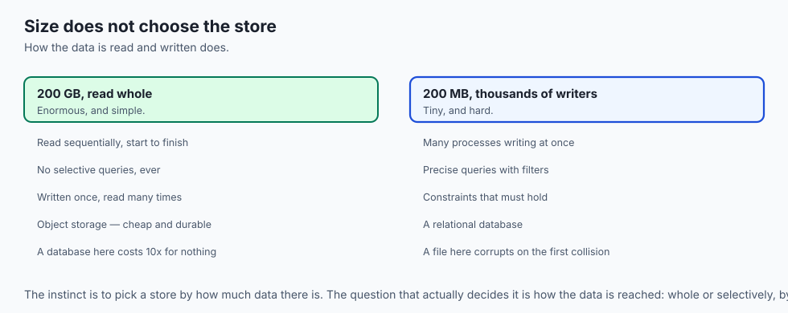

- **Four shapes cover almost everything**: files, relational databases, object storage
  and caches.

- **The right one follows from your access pattern**, not from the size of the data.
- **A file is the simplest thing that works**, and simplicity is a feature.
- **A database earns its complexity** when you need precise queries or many concurrent
  writers.

- **Object storage is for large blobs**; a cache is for the hot subset of anything else.

---

## Historical background

- **Files came first**, and the hierarchical filesystem of the 1960s is essentially
  what you use today.

- **The relational model was proposed by Edgar Codd in 1970**, and its insight was to
  separate *what* you want from *how* to fetch it — which is what SQL expresses.

- **That separation is why databases could get faster** for decades without anyone
  rewriting their queries.

- **NoSQL emerged in the 2000s** when web-scale workloads outgrew what one relational
  machine could do, trading guarantees for scale.

- **Object storage arrived with cloud computing**, discarding the folder tree entirely
  in exchange for effectively unlimited, cheap, durable capacity.

- **The pendulum has swung back somewhat.** Relational databases now handle scales that
  once justified abandoning them, and "start relational" is sound advice again.

---

## What it is — and what it is not

**These are:**

- Four different shapes for holding data, with different access patterns.
- Complementary. A real system uses several at once.
- Chosen by how the data is read and written, more than by how much of it there is.

**They are not:**

- **Not a hierarchy.** Object storage is not "better files"; it is a different shape
  with different trade-offs.

- **Not interchangeable.** A bucket cannot answer a query; a database is a poor place
  for a 5 GB file.

- **Not permanent decisions in principle, but usually in practice.** Migrating data is
  far harder than changing code.

- **Not about size alone.** A tiny dataset with thousands of concurrent writers needs a
  database; a huge one read whole needs a bucket.

---

## Why it was created and what problems it solves

- **Concurrent writers.** A file breaks down the moment several processes write it at
  once; a database exists to make that safe.

- **Precise queries.** "The total per customer in Ohio" is a database question, and
  answering it by reading a whole file does not scale.

- **Durability at scale.** Object storage keeps multiple copies across machines, which
  a single disk cannot.

- **Cost.** Storing terabytes in a database costs far more than storing them in a
  bucket, for no benefit if you only read them whole.

- **Speed.** A cache exists because the same small subset of data is requested
  repeatedly, and RAM is far faster than anything else.

---

## How it works

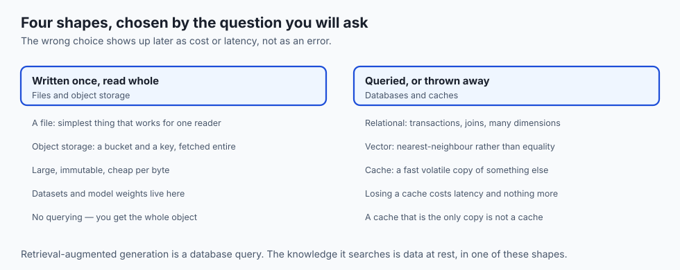

### Files and filesystems

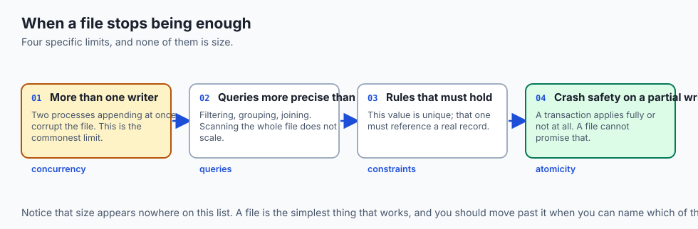

- **A filesystem organises a disk into named files in a tree**, tracking where each
  file's bytes physically live.

- **Unstructured files are opaque blobs** — a JPEG, an MP4, a compiled program — whose
  bytes mean something only to the program that reads them.

- **Structured files impose a parseable format**: CSV, JSON, YAML.
- **A file is often enough.** For configuration, a small dataset, a log — anything read
  far more than written, by one program at a time.

- **You reach past files when you hit their limits**: many concurrent writers, or
  queries more precise than "read the whole thing".

### Relational databases

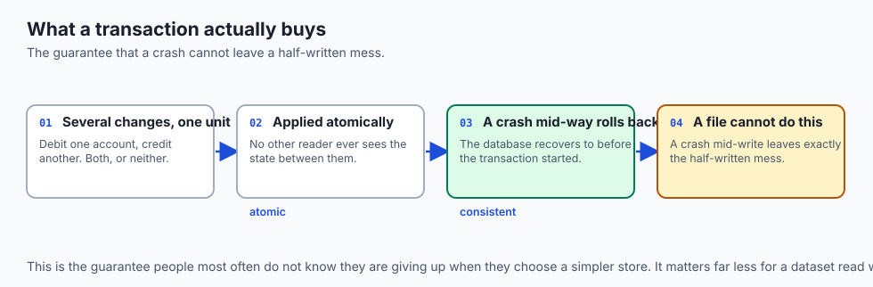

- **Data lives in tables** with fixed, typed columns; each row is one record.
- **A schema is the declared structure** — which tables, which columns, which rules
  hold.

```sql
SELECT customer, SUM(amount) AS total
FROM orders
WHERE state = 'OH'
GROUP BY customer;
```

- **Behind that one statement**, the database uses indexes to find matching rows fast,
  runs the aggregate, and wraps writes in a transaction so a crash mid-update never
  leaves a half-written mess.

### Three storage shapes, often confused

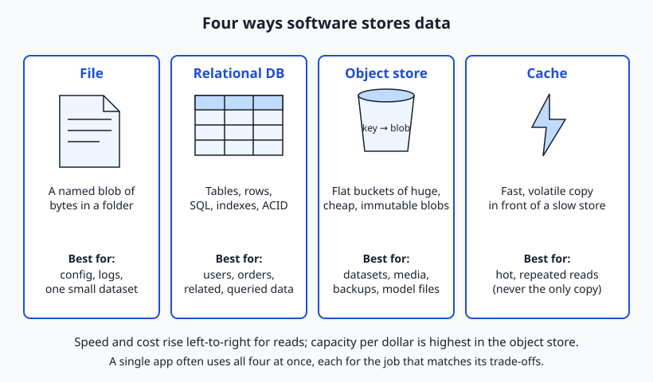

- **Block storage** is a raw disk carved into fixed-size blocks — what your SSD
  presents, what a cloud volume gives a virtual machine. It is the fast foundation
  everything else is built on.

- **File storage** is a filesystem: blocks organised into the named-files-in-folders
  tree, shareable over a network.

- **Object storage** is neither: a flat pool of whole objects addressed by key.

### NoSQL families

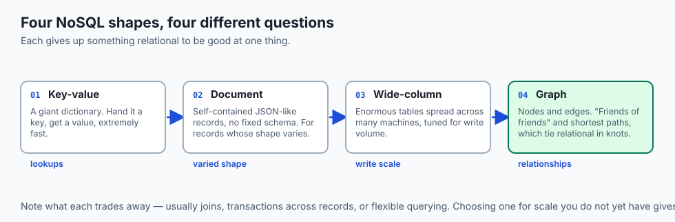

- **A key-value store** is a giant dictionary — hand it a key, get a value, extremely
  fast. Sessions, caches, simple lookups.

- **A document store** keeps self-contained JSON-like documents with no fixed schema,
  which suits records whose shape varies.

- **A wide-column store** spreads enormous tables across many machines, tuned for
  massive write volumes.

- **A graph database** stores nodes and edges, making "friends of friends" and
  "shortest path" natural — questions that tie a relational database in knots.

### Object storage

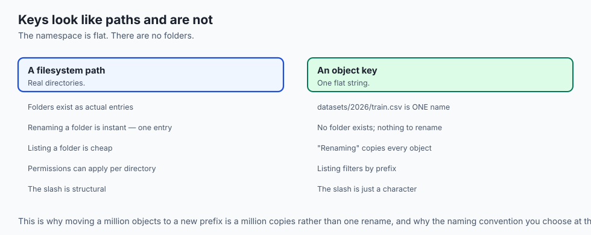

- **You create a bucket**, and store each object under a **key**, a string name.
- **An object is an immutable blob plus a little metadata.** You `PUT` it and later
  `GET` it by key.

- **Keys often look like paths** — `datasets/2026/train.csv` — but that is a naming
  convention. The namespace is flat; there are no real folders.

- **Objects are cheap, highly durable and effectively unlimited**, which is why buckets
  are the natural home for datasets, media, backups and large model files.

- **The trade-off**: you replace objects wholesale rather than editing in place, and you
  cannot run SQL over their contents.

### Caches

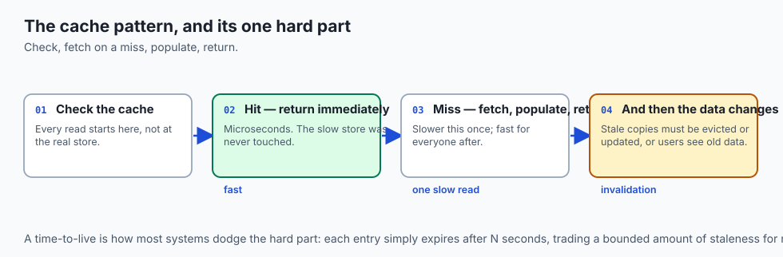

- **A cache sits in front of a slower store**, holding the hottest data in RAM so most
  reads never reach the slow store.

- **The pattern**: check the cache; on a **hit**, return immediately; on a **miss**,
  fetch from the real store, put a copy in the cache, and return it.

- **This is Day 3's memory hierarchy** — fast-and-small in front of slow-and-large —
  moved up a level.

- **The hard part is invalidation.** When the underlying data changes, stale copies must
  be updated or evicted, or users see old data.

- **A time-to-live is the common tactic**: each entry expires after a set number of
  seconds, trading a little staleness for a great deal of simplicity.

---

## An everyday analogy

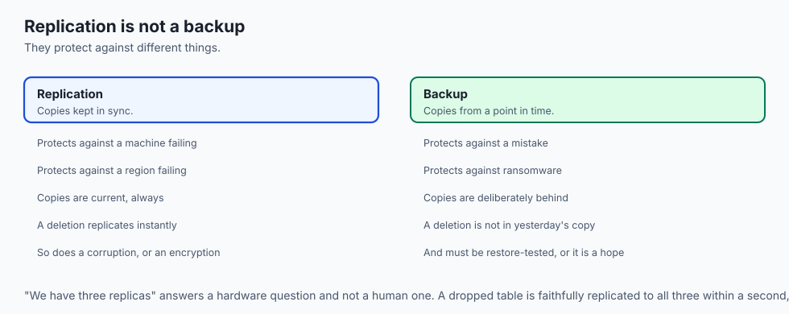

Storing things in a building.

| The building | The store |
| --- | --- |
| A labelled box on a shelf | A file |
| A filing system with an index and rules | A relational database |
| A vast warehouse, everything by ticket number | Object storage |
| The tray on your desk | A cache |
| The floor and the shelving | Block storage |

- **A box is fine until several people need to write in it at once.**
- **The warehouse is cheap and enormous**, and you cannot ask it "how many blue ones
  are there?" — only "fetch ticket 4,812".

- **The tray holds what you keep reaching for.** Its whole problem is remembering to
  update it when the real thing changes.

---

## Examples in practice


- **A 200 GB dataset stored as rows in a database**, when it is only ever read whole —
  slow, and expensive by an order of magnitude.

- **Model checkpoints in a bucket** with the run's commit hash in the key, which is how
  a result stays traceable.

- **A cache with no expiry** serving three-day-old prices, which is invalidation
  failing exactly as predicted.

- **A CSV that worked perfectly** until two processes appended to it simultaneously.
- **A graph query that ran for an hour** in a relational database and in milliseconds
  in a graph one.

---

## Implications: security, privacy, performance, scalability, and cost

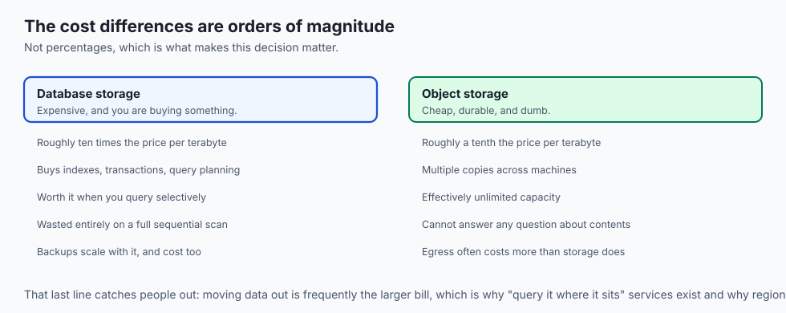

- **Security: a public bucket is the most common cloud data breach there is.** Default
  to private, and check.

- **Encrypt at rest and in transit**, which is usually one setting each and is expected
  of anything holding personal data.

- **Privacy: data outlives the code.** Deletion requirements apply to backups, caches
  and object versions, all of which are easy to forget.

- **Performance: the access pattern decides everything.** Random small reads and
  sequential whole-file reads want opposite stores.

- **Scalability: caches fail in a specific way.** If the cache empties and every request
  hits the real store at once, the store falls over — a stampede, and the same shape as
  Day 27's thundering herd.

- **Cost: object storage is roughly an order of magnitude cheaper** per terabyte than
  database storage, and egress usually costs more than storage does.

---

## Alternatives: free, open source, and commercial

| Option | Type | Where it fits |
| --- | --- | --- |
| SQLite | Free, open source | A whole relational database in one file. Start here far more often than people do. |
| PostgreSQL | Free, open source | The default relational choice; handles JSON and vectors too |
| Redis | Free, open source | Caching, sessions, queues |
| S3-compatible object storage | Commercial, free tiers | Datasets, media, checkpoints, backups |
| Parquet on object storage | Free format | Large analytical datasets, columnar and compressed |
| Vector databases | Free and commercial | Similarity search over embeddings |

- **SQLite is underrated.** It is a real relational database in a single file, with no
  server, and it is the right answer for a great many projects that reach for
  PostgreSQL.

- **PostgreSQL now covers what NoSQL was once needed for** — documents, and vectors —
  which makes "start relational" sound advice again.

---

## Comparison with related concepts

| Term | What it actually is |
| --- | --- |
| **Block storage** | Raw fixed-size blocks; the foundation |
| **File storage** | Named files in a folder tree |
| **Object storage** | A flat pool of blobs addressed by key |
| **Schema** | The declared structure of a database |
| **Transaction** | A group of changes that all apply or none do |
| **Index** | A structure making lookups fast |
| **TTL** | How long a cached entry stays valid |

---

## When to use it — and when not to

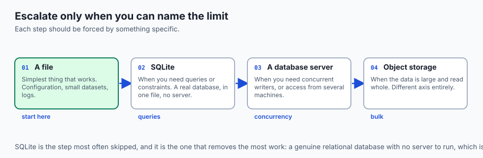

- **Start with a file.** Move on when you can name the limit you have hit.
- **Use a relational database when you need queries, constraints or concurrent
  writers.** Start with SQLite; move to PostgreSQL when you need a server.

- **Use object storage for anything large and read whole** — datasets, media,
  checkpoints, backups.

- **Add a cache only after measuring**, and always with an expiry.
- **Do not put large blobs in a database.** It works, it is expensive, and it makes
  backups painful.

- **Do not put queryable data in object storage** and then write code to scan every
  object. That code is a slow database.

- **Do not choose NoSQL for scale you do not have.** You give up real guarantees for a
  problem you may never meet.

---

## The AI connection

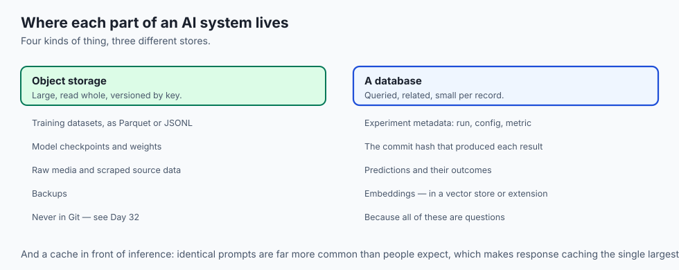

- **Training data belongs in object storage**, as Parquet or JSONL — cheap, durable and
  read sequentially, which is exactly the access pattern.

- **Model weights belong in object storage too**, versioned by key, never in Git.
- **Experiment metadata belongs in a relational database**: which run, which config,
  which metric, which commit hash. Those are queries.

- **Embeddings need a vector store**, whether a dedicated one or PostgreSQL with an
  extension, because similarity search is not a query a normal index can serve.

- **Caching model responses is the single biggest cost saving available** for a
  deployed AI system, since identical prompts are far more common than people expect.

---

## Knowledge check

```yaml
quiz:
  question: "A team stores a 200 GB training dataset as rows in a relational database. It is only ever read in full, sequentially, for training. What is the main problem?"
  options:
    - "They are paying database prices and overhead for an access pattern object storage serves better and far more cheaply"
    - "Relational databases cannot store datasets larger than a few gigabytes"
    - "Sequential reads are impossible in a relational database, so training will fail"
    - "The data must be normalised into multiple tables before it can be queried"
  answer_index: 0
  explanation: "The database's indexes, transactions and query planning all exist to serve selective access, and none of them helps a full sequential scan. The workload wants cheap bulk storage read whole, which is precisely what object storage is for — at roughly a tenth of the cost."
```

---

## Hands-on exercise

Store the same data four ways and measure the difference. Worked through fully in the
Day 39 lab directory.

| What you are doing | Command |
| --- | --- |
| Query a file | `python3 -c "import csv,sys; ..."` over a CSV |
| Load it into SQLite | `sqlite3 data.db ".import data.csv orders"` |
| Query with SQL | `sqlite3 data.db "SELECT customer, SUM(amount) ... GROUP BY customer"` |
| Add an index and re-time | `CREATE INDEX idx_state ON orders(state);` |
| Store a blob by key | The lab's local object-store stand-in |
| Cache a result | Store it in a dictionary with a timestamp, and expire it |
| Compare | Time all four for the same question |

### Expected output

```text
scan whole CSV:        1.84s
sqlite, no index:      0.42s
sqlite, with index:    0.008s
cache hit:             0.00002s
```

- **The index is the whole reason a database is faster**, and it changed nothing about
  the query you wrote.

- **The cache is another two orders of magnitude**, and it is only correct while the
  underlying data has not changed.

### Validate your work

- [ ] You answered the same question against a file and a database and timed both
- [ ] You added an index and measured the difference
- [ ] You stored and retrieved a blob by key
- [ ] You implemented a cache with an expiry and demonstrated both a hit and a miss
- [ ] You can name the access pattern each of the four shapes suits
- [ ] `bash tests/run_tests.sh` reports 0 failures

### Troubleshooting

- **The index made no difference.** The query does not filter on that column, or the
  table is small enough to scan regardless.

- **SQLite refuses concurrent writes.** That is the limit being demonstrated; it allows
  one writer at a time.

- **Your cache returns stale data.** That is invalidation, and it is the hard part. Add
  an expiry.

- **The CSV parse is the slow part, not the query.** Which is itself the finding.

### Common mistakes

- **Reaching for a database before hitting a file's limits.**
- **Caching without an expiry.**
- **Storing large blobs as database rows.**
- **Assuming object-storage keys are folders.** They are one flat string.

---

## Practice assignment

- **Take one dataset and store it four ways**, then write down which question each
  store answers best.

- **Find the size at which scanning a file becomes slower than a query**, on your own
  machine, for your own data.

- **Implement a cache with a TTL** and deliberately let it serve stale data, so you have
  seen the failure mode.

- **Cost out one terabyte** in a managed database and in object storage, using current
  public prices. The ratio is the argument.

---

## Extension challenge

- **Reproduce a cache stampede**: empty the cache while many requests are in flight, and
  watch every one of them hit the slow store at once. Then fix it, and note that the fix
  is the same shape as Day 27's.

- **Compare CSV against Parquet** on a million rows: file size, full-scan time, and time
  to read one column.

- **Query object storage without downloading it** — several services can run SQL over
  objects in place — and compare that with loading it into a database first.

- **Build a tiny vector search** over a few thousand embeddings, first by brute force and
  then with an index, and measure where brute force stops being acceptable.

---

