## Why this matters

- **A deployed model fails silently.** It does not crash; it returns worse answers, and
  nothing tells you.

- **Averages lie about tails.** A 200 ms average can hide one user in twenty waiting
  four seconds, and that user is the one who leaves.

- **Alerting on causes rather than symptoms** is how teams learn to ignore their alerts.
- **Traces are how you find which step is slow** in a system made of several services,
  instead of guessing.

- **AI systems need a fourth signal** the classic three do not cover: whether the output
  is any good.

---

## The idea in plain language

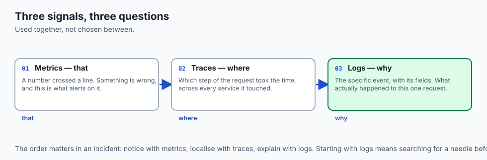

- **Three kinds of signal**, answering three different questions.
- **Metrics tell you *that* something is wrong** — a number crossed a line.
- **Traces tell you *where*** — which step in the request took the time.
- **Logs tell you *why*** — the specific event, with its details.
- **Dashboards are for humans watching; alerts are for humans not watching.**

---

## Historical background

- **Logging is as old as programs**, and for decades it was the only signal.
- **Metrics came from operations**, where the question was capacity rather than
  correctness — is the machine full?

- **Distributed tracing was invented at Google** and described in the Dapper paper in
  2010, because a request crossing dozens of services could not be understood from any
  one machine's logs.

- **"Observability" arrived as a borrowed control-theory term**: can you determine the
  internal state from the outputs?

- **The distinction from monitoring is real.** Monitoring answers questions you thought
  to ask in advance; observability lets you ask new ones after the fact.

- **OpenTelemetry standardised the instrumentation in 2019**, so the signals are no
  longer tied to a vendor.

---

## What it is — and what it is not

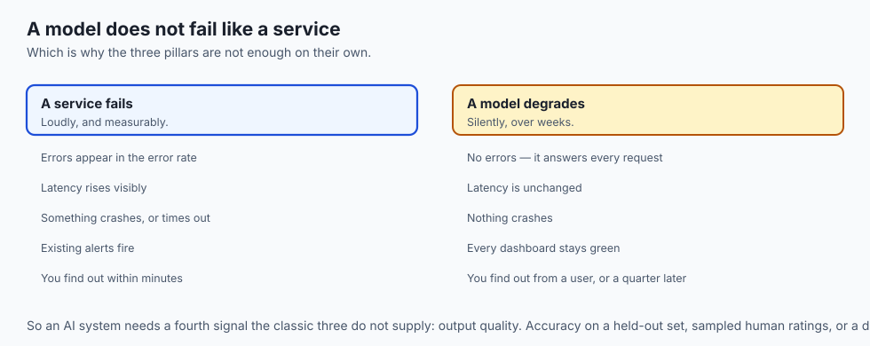

**Observability is:**

- The property of being able to understand a system's internal state from its outputs.
- Three complementary signals, used together rather than chosen between.
- Something built in, not added afterwards.

**It is not:**

- **Not monitoring.** Monitoring checks known conditions; observability lets you
  investigate unknown ones.

- **Not more data.** Ten dashboards nobody reads is worse than one that is trusted.
- **Not free.** Every signal costs storage, and high-cardinality metrics can cost more
  than the system they measure.

- **Not a substitute for testing.** It tells you what happened in production, not what
  will happen.

---

## Why it was created and what problems it solves

- **Systems became too distributed to reason about** from one machine's logs.
- **Failures became partial.** Not "the server is down" but "4% of requests to one
  region are slow".

- **Averages hid the problems.** A summary statistic that looks fine while a minority
  suffers is worse than no statistic.

- **Debugging in production is not optional.** Some failures only exist under real
  traffic, real data and real concurrency.

- **Someone must be woken up, and only sometimes.** Alerting exists to make that
  decision reliably.

---

## How it works

### Logs

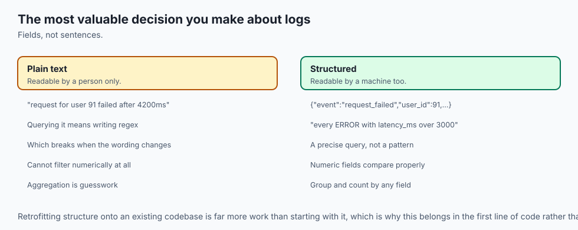

- **Discrete, timestamped events.**
- **Emit them structured** — machine-readable key-value data, usually JSON — not
  free-form prose. This is the single most valuable decision you will make about logs.

```text
Plain:      2026-07-12 14:32:07 ERROR request for user 91 failed after 4200ms
Structured: {"ts":"2026-07-12T14:32:07Z","level":"ERROR","event":"request_failed","user_id":91,"latency_ms":4200}
```

- **Both are readable by a person; only the second is readable by a machine** without
  fragile text parsing.

- **With structure you can ask** "every ERROR with `latency_ms` over 3000" as a precise
  query. Without it you are writing regular expressions and hoping the format never
  changes.

- **Levels — DEBUG, INFO, WARN, ERROR, FATAL —** let you record richly and filter to
  the serious lines when a system is under stress.

### Metrics

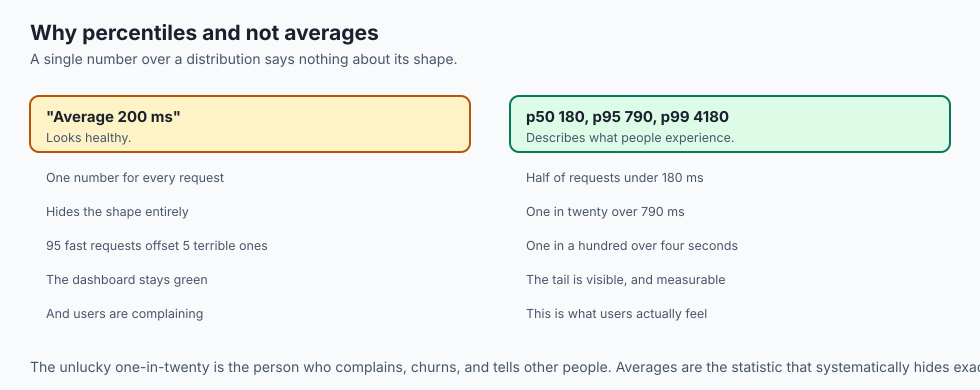

| Type | What it measures | Direction | Example | Question it answers |
| --- | --- | --- | --- | --- |
| Counter | A running total | Up only | Total requests served | "How many per second?" — its rate |
| Gauge | A value that rises and falls | Either | Queue length, memory in use | "How full is it right now?" |
| Histogram | A distribution across buckets | Up per bucket | Request latencies | "What is the p95?" |

- **From a counter you compute a rate**, which is almost always more useful than the
  total. "40 requests per second" says more than "18,203,113 since Tuesday".

- **From a histogram you compute percentiles.** A p95 latency of 800 ms means 95 of
  every 100 requests finished faster, and 5 did not.

- **Percentiles matter because averages lie about tails.** A service can average 200 ms
  while one user in twenty waits four seconds — and it is that user who complains and
  leaves.

### Traces

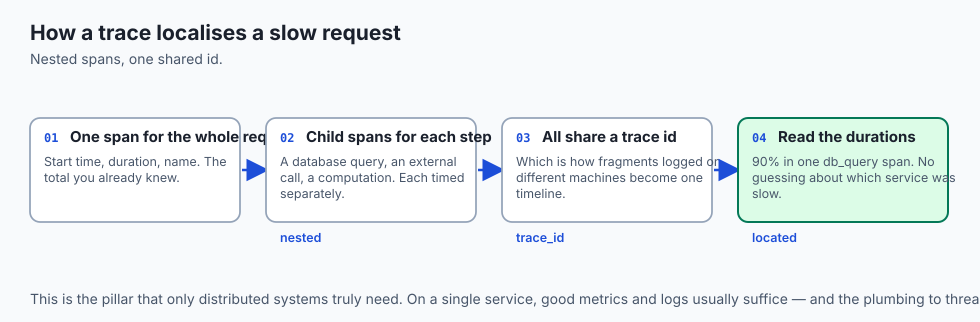

- **A trace follows one request end to end.**
- **Each unit of work is a span** — a database query, a call to another service, a
  computation — with a start time, a duration and a name.

- **Spans nest.** The top-level span contains child spans for each step, which may
  contain their own.

- **Every span shares a trace ID**, which is how fragments logged on different machines
  are stitched into one timeline.

- **When a request is slow, the trace shows which span ate the time** — the database,
  the external API, your own code — instead of leaving you to guess.


- **Your services emit all three; a collector gathers them**; they flow into dashboards
  you watch and alerts that page you.

- **They are complementary, not competing**: metrics to notice *that*, traces to find
  *where*, logs to learn *why*.

### Dashboards, alerting and service levels

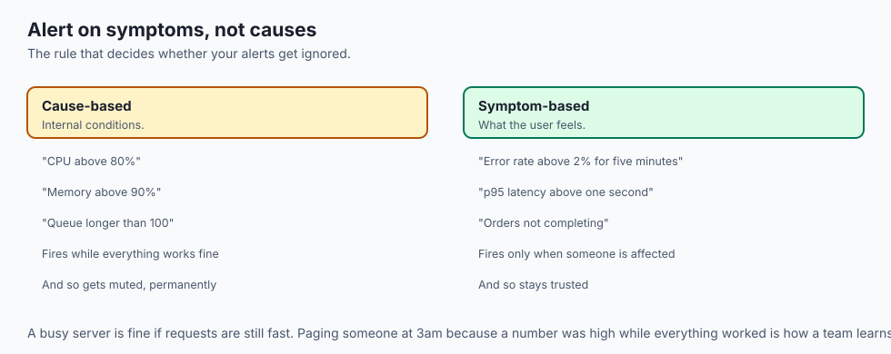

- **A dashboard is the system's vital signs at a glance**: request rate, error rate,
  latency percentiles, resource use.

- **An alert is a rule** — "page someone if the error rate exceeds 2% for five minutes"
  — turning a threshold crossing into a notification.

- **The single most valuable rule of alerting: alert on symptoms, not causes.**
- **Alert on what the user feels** — errors, slowness, orders not completing — rather
  than internal conditions like high CPU that may be hurting nobody.

- **A busy server is fine if requests are still fast.** Paging someone at 3am because
  CPU hit 80% while everything worked is how teams learn to ignore alerts.

- **An SLI is a precise measurement of user experience** — the percentage of requests
  succeeding under 300 ms.

- **An SLO is the target you commit to** — 99.9% over a rolling 30 days.
- **Together they give alerting a principled basis**: you page when the objective
  representing real user happiness is at risk, not when an arbitrary number twitches.

---

## An everyday analogy

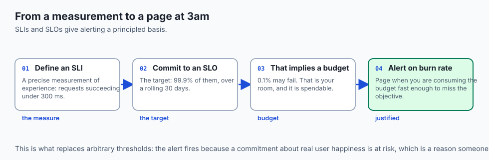

A hospital.

| The hospital | Observability |
| --- | --- |
| The patient's chart | Logs |
| The vital-signs monitor | Metrics |
| Following one patient through every department | A trace |
| The nurses' station display | A dashboard |
| The alarm at the bedside | An alert |
| "Temperature above 39" | An SLI and its threshold |

- **The monitor tells you something is wrong.** The chart tells you what happened. The
  journey tells you where the delay was.

- **An alarm that sounds constantly is turned off**, and then it does not sound when it
  matters. That is alert fatigue, and it is the real failure mode.

- **Averaging every patient's temperature** tells you nothing about the one with a
  fever.

---

## Examples in practice

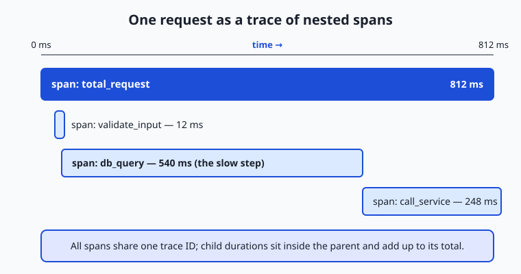

- **A p99 of four seconds behind a 200 ms average**, which is one user in a hundred
  having a bad time and no average revealing it.

- **A trace showing 90% of a request in one database call**, ending an argument about
  which service was slow.

- **A log line that cannot be queried** because it was written as a sentence rather than
  as fields.

- **An alert on CPU that fired at 3am** while every request succeeded, and was
  subsequently ignored for six months.

- **A model whose accuracy drifted over a quarter**, with every system metric perfectly
  green throughout.

---

## Implications: security, privacy, performance, scalability, and cost

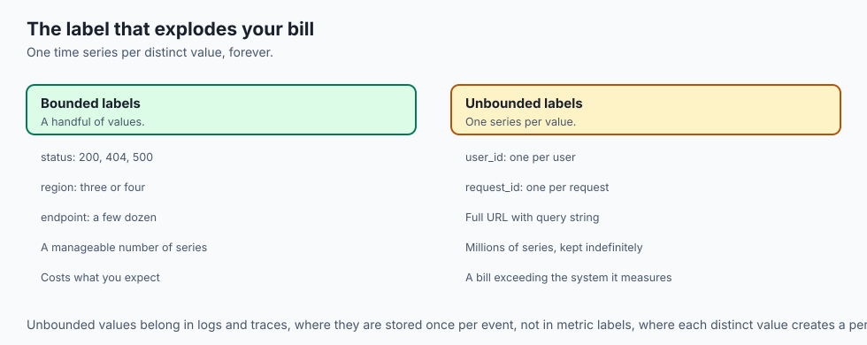

- **Security: logs are an audit trail**, and they are also a target. An attacker who can
  edit them can hide.

- **Never log credentials, tokens or personal data.** It happens constantly, usually by
  logging a whole request object without looking at what is in it.

- **Privacy: retention is a policy decision.** Logs containing personal data are subject
  to deletion requirements like any other store.

- **Performance: instrumentation costs something**, though far less than people fear.
  The expensive mistake is logging at DEBUG in production.

- **Cost: high-cardinality metrics explode.** A label with a user ID in it creates one
  time series per user, and that bill can exceed the system's.

- **Cost of not having it: you debug production by guessing**, which is slower than any
  instrumentation overhead by orders of magnitude.

---

## Alternatives: free, open source, and commercial

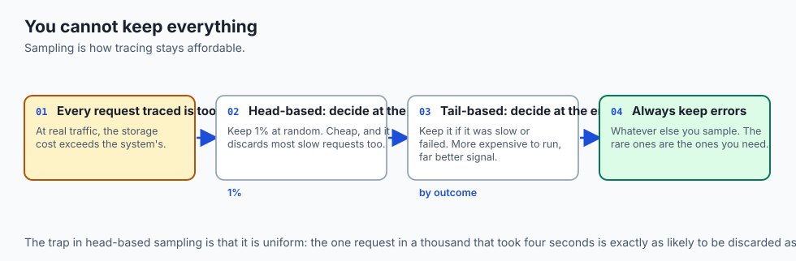

| Tool | Type | What it does |
| --- | --- | --- |
| OpenTelemetry | Free, open source | Vendor-neutral instrumentation for all three signals |
| Prometheus + Grafana | Free, open source | Metrics collection and dashboards; the common default |
| Loki, Elasticsearch | Free, open source | Log aggregation and search |
| Jaeger, Tempo | Free, open source | Trace storage and exploration |
| Datadog, Honeycomb, New Relic | Commercial | All three, hosted, with a real bill |
| `structlog`, `zap` | Free, open source | Structured logging in your language |

- **Instrument with OpenTelemetry**, whatever backend you use. It decouples the
  instrumentation from the vendor, which is the decision you cannot easily revisit.

- **Start with structured logs and three metrics.** Rate, errors, and latency
  percentiles answer most questions, and everything else is refinement.

---

## Comparison with related concepts

| Term | What it actually is |
| --- | --- |
| **Log** | A discrete timestamped event |
| **Metric** | A number sampled over time |
| **Trace** | One request's path, as nested spans |
| **Span** | One unit of work, with a duration |
| **Cardinality** | How many distinct values a label can take |
| **SLI** | A measurement of user experience |
| **SLO** | The target you commit to for an SLI |

---

## When to use it — and when not to

- **Emit structured logs from the first line of code.** Retrofitting them is far more
  work than starting with them.

- **Instrument rate, errors and latency** before anything else. Those three answer most
  questions.

- **Alert on symptoms**, and on SLO burn rather than on instantaneous thresholds.
- **Add tracing when you have more than one service**, and not particularly before.
- **Do not put unbounded values in metric labels.** User IDs and request IDs belong in
  logs and traces, never in a metric label.

- **Do not build a dashboard nobody has agreed to watch.** An unwatched dashboard is a
  cost with no benefit.

- **Do not log at DEBUG in production** and expect either the bill or the signal-to-noise
  ratio to be acceptable.

---

## The AI connection

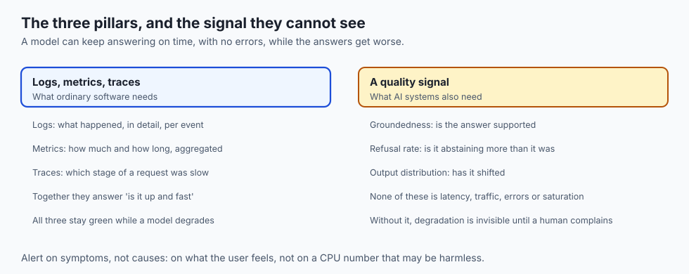

- **A model fails differently from a service.** It does not crash; it gets quietly
  worse, and every system metric stays green.

- **So AI systems need a fourth signal**: output quality. Accuracy on a held-out set,
  human ratings, or a downstream business measure.

- **Track input distribution too.** Drift in what arrives is usually the first
  detectable sign, and it precedes the accuracy drop.

- **Log the prompt, the model version and the token counts** for every call, structured
  — that is how you attribute both cost and quality later.

- **Trace a retrieval-augmented request** and the spans tell you immediately whether the
  time went to retrieval or to generation, which need entirely different fixes.

---

## Knowledge check

```yaml
quiz:
  question: "A service reports a 200 ms average latency and users complain it is slow. What should you look at first?"
  options:
    - "The latency percentiles, since an average can hide a slow tail affecting a minority of requests"
    - "The total request count, to confirm the service is receiving the expected traffic"
    - "The CPU and memory gauges, since resource exhaustion is the usual cause of slowness"
    - "The error rate, since users may be describing failures rather than slowness"
  answer_index: 0
  explanation: "An average is a single number over a distribution and says nothing about its shape. A p95 or p99 reveals whether a minority of requests are far slower — and those users are the ones who notice, complain and leave, which is exactly why percentiles rather than averages describe real experience."
```

---

## Hands-on exercise

Emit all three signals from a small service, then find a bug with them. Worked through
fully in the Day 40 lab directory.

| What you are doing | Command or code |
| --- | --- |
| Log structurally | Emit JSON with `ts`, `level`, `event` and fields |
| Query the logs | `jq 'select(.level=="ERROR" and .latency_ms > 3000)' app.jsonl` |
| Count by field | `jq -r .event app.jsonl \| sort \| uniq -c \| sort -rn` |
| Compute a rate | Count over a window, divided by its length |
| Compute percentiles | Sort the latencies; take the value at 95% |
| Add a trace ID | One id per request, on every line it produces |
| Follow one request | `jq 'select(.trace_id=="abc123")' app.jsonl` |

### Expected output

```text
count  event
  842  request_ok
   37  request_failed
mean latency: 204ms
p50: 180ms   p95: 790ms   p99: 4180ms
{"trace_id":"abc123","span":"db_query","ms":3980}
```

- **The mean and the p99 disagree by a factor of twenty**, which is the entire argument
  for percentiles.

- **The trace found the slow span** — a database query — in one command.

### Validate your work

- [ ] Your logs are structured and queryable with `jq`
- [ ] You computed a rate from a counter and percentiles from a set of latencies
- [ ] You can state the difference between a counter, a gauge and a histogram
- [ ] You added a trace id and followed one request across several log lines
- [ ] You wrote one alert rule based on a symptom rather than a cause
- [ ] `bash tests/run_tests.sh` reports 0 failures

### Troubleshooting

- **`jq` fails on your log file.** One malformed line. Process line by line, as with
  JSONL on Day 24.

- **Your percentiles look wrong.** Check whether you sorted numerically or as strings —
  Day 10's `sort -n`.

- **Every log line looks identical.** You are logging a message and not fields. Add the
  values you will want to filter by.

- **The trace id is missing on some lines.** It has to be threaded through every
  function that logs; that plumbing is what tracing libraries do for you.

### Common mistakes

- **Logging prose instead of fields.**
- **Reporting an average latency** and believing it.
- **Alerting on CPU.**
- **Logging an entire request object**, credentials included.

---

## Practice assignment

- **Instrument a small service** with structured logs, three metrics and a trace id, and
  answer three questions about it using only those signals.

- **Compare the mean and the p99** of a real latency distribution, and write one sentence
  about what the mean concealed.

- **Write three alert rules**, then decide for each whether it is a symptom or a cause,
  and delete the causes.

- **Deliberately log something you should not**, notice it in a review, and write down
  the rule that would have caught it.

---

## Extension challenge

- **Instrument with OpenTelemetry** and send the same signals to two different backends,
  to see what vendor neutrality actually buys.

- **Build a cardinality explosion on purpose**: add a user id as a metric label in a test
  environment and watch the series count grow. The number is more persuasive than the
  warning.

- **Define an SLI and an SLO** for something you run, then alert on the burn rate rather
  than on an instantaneous threshold, and compare how often each would have paged you.

- **Add a quality signal to a model endpoint** — a sampled human rating, or accuracy on a
  held-out set — and watch it alongside the system metrics for a week.

---

