## Why this matters

For six weeks you have been collecting tools: shell scripts, cron schedules, git, editors, linters, formatters, storage, and logs. Each solved a problem on its own. Today you learn the mindset that turns a pile of tools into a machine that works while you sleep — automation — and it is the single habit that most separates practitioners who ship reliable systems from those who firefight forever.

Here is why this matters for the work ahead. Training or serving a model is never one command. You pull data, clean it, split it, run a training job, measure quality, and push the result somewhere it can be used — and you do this over and over as data and code change. If every one of those steps is a thing you remember to type by hand, three predictable failures follow. You will forget a step and get a result you cannot trust. You will run the steps slightly differently each time, so when something breaks you cannot tell what changed. And you will waste hours per week on toil that a computer would do for free, forever, without a typo. Money, correctness, and your own time are all on the line.

The professionals who avoid those failures share one reflex: when a task is worth repeating, they teach the computer to repeat it, and they wire a check in front of anything that could go wrong. By the end of today you will know when that reflex pays off and when it does not, the five rungs of leverage you can climb from a manual command to a full pipeline, and how to install a real quality gate that refuses to let a broken change through. Nothing here is exotic; it is the connective tissue that makes everything else you have learned dependable.

## The idea in plain language

Automation means capturing a task as instructions a computer can carry out on its own, so that the task runs the same way every time without a human driving it. That is the whole idea. A shell script is automation. A scheduled job is automation. A check that runs when you commit code is automation. A server that lints, tests, and builds your project every time you push is automation. They differ only in what triggers them and where they run.

There is a natural progression of leverage. At the bottom, you do everything by hand. One step up, you put the steps in a script so you run one command instead of ten. Above that, you let a scheduler run the script on a clock, so it happens even when you are not there. Above that, you attach the script to an event — like making a commit — so it runs exactly when it is relevant. At the top, a shared server runs a sequence of checks on every change, for everyone on the team, in a clean environment. Each rung reuses the work of the rung below; you never throw away the script when you add a schedule or a hook.

The second big idea is the pipeline: a task broken into ordered stages, where each stage must pass before the next begins. A typical software pipeline is lint, then test, then build, then deploy. If linting fails, there is no point testing; if tests fail, there is no point building. Stopping at the first failure is called failing fast, and it is what keeps a pipeline cheap and honest. Automation is the engine; the pipeline is the shape you pour it into.

## Historical background

Automating repetitive computer work is almost as old as computing itself. In the earliest Unix systems of the 1970s at Bell Labs, the shell was designed from the start to be programmable: you could put a list of commands in a file and run it as a script, so a sequence typed once could be replayed forever. Alongside it came `cron`, a daemon that runs commands on a schedule, which has kept the same simple table format — minute, hour, day, month, weekday — for decades. The philosophy was small tools you could chain and automate, and it still shapes how systems are built today.

Build automation matured next. In 1976 Stuart Feldman, then at Bell Labs, wrote `make` to solve a maddening problem: rebuilding a program by hand meant remembering exactly which files depended on which, and a single forgotten step produced a broken binary. `make` let you declare the steps and their dependencies once, then rebuild correctly with a single command. That idea — describe the task, let the tool run it reliably — is the ancestor of every task runner and pipeline since.

Version control brought automation to the moment of change. Git, created by Linus Torvalds in 2005 for Linux kernel development, shipped with hooks: scripts git runs automatically at points in its workflow, such as just before a commit is recorded. Around the same time the practice of continuous integration spread through the software industry. The term and discipline were popularized in the agile movement around 2000, notably by Martin Fowler and colleagues, with the core rule that everyone integrates their work frequently and an automated build verifies each integration so that broken code is caught in minutes, not weeks. Dedicated CI servers followed, and by the 2010s hosted services could run your checks on every push without you maintaining any server at all. The through-line from a 1970s shell script to a modern pipeline is unbroken: capture the task, then move the trigger closer to the moment it matters.

## What it is — and what it is not

Automation is the practice of encoding a repeatable task so a computer performs it without manual intervention, on a defined trigger, producing the same result each time. Every part of that carries weight. *Repeatable task*: automation pays off on things you do more than once. *Without manual intervention*: once triggered, it runs to completion on its own. *Defined trigger*: a person running a command, a clock, an event like a commit or push, or another program. *Same result each time*: the payoff is consistency, not just speed.

It helps to be clear about what automation is not. It is not a guarantee of correctness — an automated process runs your instructions faithfully, so if the instructions are wrong, it will produce the wrong result faster and more consistently than you ever could by hand. It is not only about saving time; often the bigger prize is removing human variability, so that a task done at 2 a.m. by a tired person matches the task done at noon. And it is not all-or-nothing. You do not have to build a pipeline to benefit; a five-line script that replaces a fumble-prone sequence is real automation with real returns. The mistake to avoid is treating automation as a badge of sophistication rather than a tool with a cost and a payoff.

| Common misconception | The reality |
| --- | --- |
| "Automation means building a big pipeline." | Most automation is a short script or a single hook; you climb the ladder only as far as the task justifies. |
| "If it is automated, it must be correct." | Automation faithfully repeats your instructions — bugs included; it removes variance, not the need to be right. |
| "Automate everything to look professional." | Automating a rare or fast-changing task costs more to build and maintain than it ever saves. |
| "A git hook and a CI check are the same thing." | A hook runs locally on your machine and can be skipped; a CI check runs on a shared server and cannot be bypassed by one developer. |
| "Automation is set-and-forget." | Automated jobs fail silently unless you make them observable; unwatched automation is a future outage. |

## Why it was created and what problems it solves

Automation exists to solve three problems that grow worse the more a task is repeated: forgetting, drift, and toil. Forgetting is the missed step — you run nine of ten commands and ship a subtly broken result. Drift is the slow divergence that comes from a task being done a little differently each time, by different people or the same person on different days, until "it works on my machine" becomes an unsolvable mystery because no two runs were the same. Toil is the raw cost of human time spent on work a computer would do for free, which does not scale: double the commits and you double the manual checking.

Capturing a task as a script kills all three at once. The script cannot forget a step, because the steps are written down. It cannot drift, because everyone runs the identical file. And it does not consume your attention, because the computer runs it. Moving the trigger closer to the moment of change — from "when I remember" to "on a schedule" to "on every commit" — closes the last gap, the gap where a human has to decide to run the thing. The whole discipline is a campaign against the unreliability of human memory and attention, applied to work that a machine can do perfectly. That is why it became the backbone of professional software: not because it is clever, but because it makes correctness the default instead of a thing you have to remember.

## How it works

Let us walk the building blocks from the bottom of the ladder to the top, then see how they compose into a pipeline. You have met most of these pieces already; today they click together.



### The building blocks, rung by rung

**Scripts (from Week 2).** The foundation. A shell script is a file of commands that runs top to bottom. The moment you have typed the same three commands twice, they belong in a script with a clear name. Everything above this rung reuses the script — you never replace it, you just change what pulls the trigger.

**Scheduling with cron (from Day 14).** `cron` runs a command on a repeating clock. A crontab line has five time fields — minute, hour, day of month, month, day of week — followed by the command. The line `0 2 * * * /path/to/backup.sh` means "run `backup.sh` at 2:00 every day." Scheduling suits tasks tied to time rather than to a change: nightly backups, hourly data pulls, a weekly report.

**Git hooks (tie to Week 5).** A hook is a script git runs automatically at a point in its workflow. The two you will use most are `pre-commit`, which runs before a commit is recorded and can reject it by exiting non-zero, and `pre-push`, which runs before commits are sent to a remote. Hooks live in your repository's `.git/hooks/` directory, and a hook only takes effect if it is executable. This is where automation stops being about time and starts being about events: the check fires exactly when the relevant thing happens.

**CI/CD pipelines (run checks on every push).** Continuous integration (CI) is a server that runs your checks automatically on every push, in a fresh environment, for the whole team. Continuous delivery or deployment (CD) extends that to automatically packaging and releasing the result when the checks pass. Because CI runs on a shared server that nobody can skip, it is the backstop that catches what a local hook missed — including the commits of the teammate who disabled their hooks.

### The pipeline: ordered stages that fail fast

A pipeline arranges work into stages that run in order, where each stage must succeed before the next starts. The canonical software pipeline is **lint → test → build → deploy**: check the code's style and obvious errors, run the tests, package the artifact, then release it. The ordering is deliberate and cheap-first. Linting takes a second and catches typos; tests take longer; building takes longer still; deploying touches the real world. By putting the fastest, cheapest checks first, you catch most mistakes in the first second and rarely pay for the expensive stages on code that was never going to pass.



Three properties make a pipeline trustworthy. **Fail fast**: the moment a stage fails, the pipeline stops and reports, so no later stage runs on a known-bad input and you get the news immediately. **Idempotency**: running the pipeline twice on the same input produces the same result, with no leftover state from the previous run leaking into the next — a stage that appends to a file instead of overwriting it is not idempotent, and will eventually surprise you. **Reproducibility**: the pipeline pins its inputs and environment so that the same commit produces the same output on your laptop and on the server, next week as much as today. Fail fast keeps it cheap, idempotency keeps it safe to re-run, and reproducibility is what lets you trust the result at all.

### Local hooks versus CI: two lines of defense

A local git hook and a CI check often run the very same script, but they are not interchangeable, and good teams run both. A local hook is fast and private: it gives you feedback in the second before a commit, on your own machine, so you fix the trailing whitespace before anyone sees it. But it is also skippable — anyone can pass `--no-verify` to git to bypass it, and a teammate who never installed the hook is not protected by it at all. CI is the opposite: slower, because it runs on a shared server after you push, but authoritative, because it runs for everyone on every change and cannot be quietly skipped. The healthy pattern is a fast local hook for instant feedback and a CI pipeline as the gate that actually decides whether a change is allowed in.

### Secrets in automation

Automation frequently needs a password, an API key, or a token — to pull data, to deploy, to call a service. The rule, which ties directly back to the authentication lesson (Day 25), is absolute: never hard-code a secret into a script or commit it to a repository. Once a secret is in git history it is effectively public, because history is permanent and copied to every clone. Instead, pass secrets in through the environment — an environment variable the script reads, such as `API_TOKEN` — and store the value in a dedicated secret store: your CI system's encrypted secrets, a cloud secret manager, or a local file that is listed in `.gitignore` and never committed. The script refers to the secret by name; the value lives somewhere access-controlled and out of version control. This one discipline prevents the single most common and most damaging automation mistake.

### Making automation observable and reliable

Automation that runs unwatched is a liability, because it fails silently: the nightly job that quietly stopped working three weeks ago, discovered only when someone needs the data it should have produced. The fix is the observability you met on Day 40. Every automated job should write a clear log — what it did, when, and whether it succeeded — with a distinct exit status so that success and failure are machine-readable. A job that fails should say so loudly, through a non-zero exit code that the scheduler or CI system can detect, and ideally through an alert. Reliability also means designing for re-runs: because networks blip and machines restart, an automated job should be safe to run again (idempotency again) and should fail cleanly rather than half-finishing. Automation you cannot see is automation you cannot trust.

## An everyday analogy

Picture a workshop that builds a product. On day one you build each unit entirely by hand, fetching every part and performing every step yourself. It works, but it is slow, and no two units come out quite alike.

So you start improving. First you build a **jig** — a fixture that holds the part and guides the same cut every time. That is a *script*: the steps captured so they happen identically on every run. Then you wire the jig to a **timer** so it runs a batch overnight without you standing there. That is *scheduling* with cron: the same work, now on a clock. Next you station an **inspector right at your own workbench**, who checks each unit the instant you finish it and hands it back if a screw is loose, before it ever leaves your hands. That is a *git hook*: a check that fires on the event, at the source, catching defects early and privately. Finally you build a full **conveyor line** from raw part to shipped box, with inspection stations between each stage, that everything must pass through no matter who made it. That is the *CI pipeline*.

The conveyor has an **andon cord** — the famous cord on a Toyota assembly line that any worker can pull to stop the whole line the moment they see a defect, rather than letting a bad unit travel further and cost more to fix downstream. That cord is *failing fast*: the first station to spot a problem halts the line, so no effort is wasted building on top of a flaw, and the problem is fixed where it is cheapest. Notice that the workbench inspector and the conveyor's inspection stations can use the identical checklist — the local hook and CI can run the same script — but only the conveyor inspects *everything*, which is why you keep both. Keep this workshop in mind and the rest of automation is intuition.

## Examples in practice

Start with a script — the bottom of the ladder — that captures a three-step check into one command:

```bash
#!/usr/bin/env bash
# check.sh — run our project's quality checks in order, fail fast.
set -euo pipefail          # stop on the first error, unset var, or failed pipe

echo "==> lint"
shellcheck ./*.sh          # style and common-bug checks for shell scripts

echo "==> test"
bash tests/run_tests.sh    # our test script; exits non-zero on failure

echo "==> build"
tar -czf dist/app.tgz src  # package the result

echo "All checks passed."
```

The magic is in `set -e`: the script stops at the first command that fails, so a lint error means the tests never run — fail fast, in five lines. Now schedule a different script, a nightly data pull, with a crontab line:

```text
# minute hour day month weekday   command
   30     2    *    *      *       /home/me/pull_data.sh >> /home/me/pull.log 2>&1
```

Read it as "at 02:30 every day, run `pull_data.sh` and append both its normal output and its errors to `pull.log`." The `>> ... 2>&1` is the observability: the job leaves a dated trail you can inspect, instead of vanishing.

Now move the trigger to an event with a git `pre-commit` hook. This file, saved as `.git/hooks/pre-commit` and made executable with `chmod +x`, rejects any commit that contains trailing whitespace:

```bash
#!/usr/bin/env bash
# .git/hooks/pre-commit — block commits with trailing whitespace.
for f in $(git diff --cached --name-only --diff-filter=ACM); do
  if grep -nE ' +$' "$f"; then
    echo "pre-commit: trailing whitespace in $f — commit rejected." >&2
    exit 1               # non-zero exit tells git to abort the commit
  fi
done
exit 0                   # zero exit lets the commit proceed
```

The crucial line is `exit 1`: a hook that exits non-zero cancels the operation. `git diff --cached --name-only` lists exactly the files staged for this commit, so the check runs only on what you are about to record. Finally, a minimal pipeline that shows failing fast, expressed as an ordered loop:

```bash
#!/usr/bin/env bash
# pipeline.sh — run stages in order; stop at the first failure.
for stage in lint test build deploy; do
  echo "==> stage: $stage"
  if ! "./stage_$stage.sh"; then
    echo "Pipeline stopped at '$stage'. Later stages did not run." >&2
    exit 1
  fi
done
echo "Pipeline succeeded: every stage green."
```

If `stage_test.sh` fails, the loop prints the failure and exits before `build` or `deploy` ever run. That single `exit 1` inside the loop is the whole idea of a fail-fast gate, and it is the same pattern a hosted CI service runs for you on every push — just on a shared server instead of your laptop. In the lab you will build and run exactly this: a real `pre-commit` hook that blocks a bad commit and allows a clean one, and a tiny pipeline that stops at a failing stage.

## Implications: security, privacy, performance, scalability, and cost

### Security

Automation is code that runs on triggers, often with real privileges, which makes it a target and a risk. The headline rule is secrets management: a hard-coded key in an automated script is a breach waiting to happen, because scripts get committed and history is forever — pass secrets through the environment or a secret store instead. Equally, hooks and pipeline steps *execute code*, so installing a hook or a CI action from an untrusted source is running a stranger's program on your machine or your build server; review what a hook does before you enable it. And because CI runs with access to deploy targets and credentials, its configuration deserves the same care as production code.

### Privacy

Automated jobs move and log data, and both deserve thought. A pipeline that pulls user data, a script that emails a report, a log that records every run — each is a place where personal or sensitive information can leak, into a log file readable by the whole team, into an artifact stored longer than intended, or into an error message shipped to a third-party service. The discipline is to log what you need to debug and no more, to keep sensitive values out of logs entirely, and to know where every automated copy of the data comes to rest.

### Performance

Automation's performance shows up as feedback latency: how long from a change to knowing whether it is good. This is exactly why pipelines order stages cheap-first and fail fast — a developer who waits twenty minutes to learn that a typo broke the lint stage loses focus and momentum. Fast local hooks give feedback in a second; well-ordered CI gives the important news in the first minute. Slow, poorly ordered automation trains people to ignore or bypass it, which is worse than no automation at all.

### Scalability

Automation is what lets a team grow without collapsing under manual coordination. Manual checking scales linearly with the number of changes and people; an automated gate that runs on every push scales to any number of contributors at no extra human cost, and it enforces one standard for everyone rather than relying on each person to remember the rules. This is the deeper reason CI exists: not merely to save one person time, but to make consistent quality possible across a group where no individual can watch everything.

### Cost

Automation trades a fixed up-front cost — the time to write and maintain the script or pipeline — against a recurring saving on every run, plus the avoided cost of the mistakes it prevents. The trade is only worth it above a threshold, which is why the heuristic later in this lesson matters: automating a task you do twice a year, or one whose steps change every week, can cost far more to build and maintain than it ever returns. Hosted CI services meter compute minutes, so an inefficient pipeline also has a literal bill. Automate where the recurring saving clearly beats the build-and-maintain cost, and not before.

## Alternatives: free, open source, and commercial

Here the "tools" are the concrete ways to run automation. Each entry says when to reach for it, and every option below has a genuinely free path.

| Tool | When to choose it | How you use it | Cost |
| --- | --- | --- | --- |
| Shell script + cron | Time-based jobs on one machine (backups, nightly pulls) | Write a `.sh` file; add a crontab line with `crontab -e` | Free; built into macOS and Linux |
| The pre-commit framework | Managing many local hooks cleanly across a team | A `.pre-commit-config.yaml` lists checks; `pre-commit install` wires them in | Free and open source |
| Raw git hooks | A single, simple, event-triggered check with no dependencies | Put an executable script in `.git/hooks/`, e.g. `pre-commit` | Free; built into git |
| Hosted CI (e.g. GitHub Actions, GitLab CI) | Team-wide checks on every push, in a clean environment | A YAML workflow file in the repo defines jobs and steps | Free tier for public and small private projects; paid beyond quota |
| Makefiles / task runners | Naming and ordering project tasks (`make test`, `make build`) | A `Makefile` declares targets and their commands | Free; `make` is preinstalled on macOS and Linux |

A worked snapshot of each. **Shell + cron**: `crontab -e`, then `0 * * * * ~/pull.sh` runs your script hourly — the simplest scheduled automation there is. **The pre-commit framework** lets you write one small config listing checks (whitespace, formatting, a linter) and it installs and runs them as hooks so the whole team shares the same gate. **Raw git hooks** need nothing installed: drop an executable `pre-commit` script in `.git/hooks/` and it runs on your next commit — exactly what the lab does. **Hosted CI** takes a short YAML file describing "on every push, run lint then test," and the service spins up a fresh machine to run it. **Makefiles** give your tasks memorable names: `make check` might run lint, test, and build in order, and both a hook and a CI job can simply call `make check`, so the same steps run everywhere.

For most beginners the path is: start with a shell script, add a raw git hook when you want a check at commit time, adopt the pre-commit framework once you have several checks, and add hosted CI when more than one person touches the code. A Makefile or task runner is the glue that keeps the actual commands in one place so every layer calls the same thing.

## Comparison with related concepts

| Concept A | Concept B | Key difference |
| --- | --- | --- |
| Automation | Scripting | Scripting is writing the instructions; automation is the broader practice of running them on a trigger without a human, and keeping them reliable and observable |
| Git hook | Cron job | A hook fires on a git event (commit, push); a cron job fires on a clock — event-driven versus time-driven |
| Local hook | CI check | A hook runs on your machine and can be skipped with `--no-verify`; CI runs on a shared server for everyone and cannot be individually bypassed |
| Continuous integration | Continuous delivery | CI verifies every change with automated checks; CD extends that to automatically packaging and releasing changes that pass |
| Pipeline | Single script | A script is one sequence of commands; a pipeline is a set of ordered stages with gates between them, designed to fail fast and be re-run safely |

The row that trips people up most is local hook versus CI, precisely because they can run the same script. Remember the workshop: the workbench inspector (hook) is fast and catches your own mistakes early, but only the conveyor line (CI) inspects everything from everyone and cannot be waved through.

## When to use it — and when not to

The practical heuristic for *when* to automate is often stated as: do it once, just do it; do it twice, note the steps; by the third time, script it. The third repetition is the signal that the task is stable and frequent enough that capturing it will pay off. Reach for automation when a task is repeated, when its steps are well understood and stable, when getting it wrong is costly, or when it must happen reliably whether or not you remember — checks before every commit, tests on every push, a nightly backup. In each case the recurring saving and the avoided mistakes clearly beat the one-time cost of building it.

| When to automate | When to leave it manual |
| --- | --- |
| The task repeats often (roughly the third time and beyond) | You have done it once or twice and may never again |
| Its steps are stable and well understood | The steps still change every time you run it |
| A mistake is costly or hard to detect | The task is trivial and self-correcting |
| It must run reliably, on time, unattended | It genuinely needs human judgment each run |
| Many people or many changes must meet one standard | It is a one-off exploration or throwaway experiment |

Know equally when *not* to automate. A task you do rarely rarely repays the effort to automate it, and one whose steps keep changing turns its automation into a maintenance burden that breaks as fast as you fix it — you spend more time tending the script than you would just doing the task. Some work needs a human in the loop by design: a judgment call, a review of something subtle, an irreversible action like deleting production data, where a confirmation step is a feature, not friction. And beware automating a process you do not yet understand: encode a broken workflow and you get a faster, more consistent way to be wrong. Understand the task by hand first, then automate the parts that are stable, costly to get wrong, and boringly repetitive — and leave the rest alone.

## The AI connection

Everything today is the backbone of practical machine-learning work, because an ML system *is* an automation pipeline. Training a model is not one command; it is a sequence of stages — pull the data, preprocess and clean it, train, evaluate against held-out data, and deploy the result — and the whole point of doing it well is that this sequence runs the same way every time and re-runs automatically whenever the data or the code changes. That is a pipeline with stages and gates, exactly like lint-test-build-deploy, and the evaluate stage is a fail-fast gate: if the new model scores worse than the current one, the pipeline stops and refuses to deploy it, protecting production the way a failing test stage protects a release.

The discipline that keeps such pipelines trustworthy is the same one you met today: reproducibility, so the same data and code produce the same model; idempotency, so a re-run is safe; secrets kept out of the code; and every run logged and observable so a silent failure cannot rot unnoticed. This is the heart of the operational practice for machine learning that professionals build careers on, and which this course returns to in depth later — it is automation and pipelines applied to models. Even the multi-step assistants and agents that chain several actions together to accomplish a task are, underneath, automation: a defined sequence of steps triggered and run without a human typing each one. Master the plain version now — a script, a hook, a pipeline that fails fast — and the sophisticated version later will feel like the same idea wearing new clothes.

## Knowledge check

Try these from memory before looking back:

1. Name the five rungs of the automation ladder in order, and state what triggers each one.
2. A pipeline runs lint, test, build, and deploy. Explain why the order matters and what "fail fast" does when the test stage fails.
3. Your teammate says a local `pre-commit` hook is enough and the team does not need CI. Give the strongest reason they are wrong.
4. You need an API token in an automated deploy script. Describe how to provide it without ever putting the secret in the repository, and say why committing it would be dangerous.
5. Give one task you should automate and one you should not, and justify each using the heuristic from this lesson.

## Hands-on exercise

Time to build a real quality gate. In the Day 41 lab you will create a throwaway git repository, install a working `pre-commit` hook, watch it block a bad commit and allow a clean one, and run a tiny pipeline that fails fast — all offline, on your own machine, with nothing to install beyond git and bash.

First, see the whole thing work end to end by running the reference walkthrough from the lab directory:

```bash
bash examples/hook_demo.sh
```

This creates a temporary repository, installs the hook, attempts a commit of a file with trailing whitespace (which the hook rejects), fixes the file and commits cleanly (which the hook allows), then runs the pipeline both green and failing, and cleans up after itself. Then run the tiny pipeline directly to see fail-fast behavior, first all green, then forced to fail at the test stage:

```bash
bash examples/pipeline.sh
bash examples/pipeline.sh test
```

The first run passes every stage and exits 0; the second stops at `test`, never runs `build` or `deploy`, and exits non-zero. Watch the output: the message telling you which stage stopped the line is the andon cord from the analogy, in text.

### Expected output

A trimmed run of the demo (your temporary path will differ):

```text
=== 1. Installing the pre-commit hook ===
Hook installed at .git/hooks/pre-commit (executable).

=== 2. Attempting a BAD commit (trailing whitespace) ===
pre-commit: trailing whitespace in bad.sh
pre-commit: commit rejected.
Result: the hook BLOCKED the bad commit (exit non-zero), as intended.

=== 3. Fixing the file and committing CLEAN ===
pre-commit: quality gate passed.
Result: the hook ALLOWED the clean commit.

=== 4. Running the pipeline ===
--- pipeline: all stages ---
==> stage: lint
==> stage: test
==> stage: build
==> stage: deploy
Pipeline succeeded: every stage green.
--- pipeline: forced failure at 'test' ---
==> stage: lint
==> stage: test
Pipeline stopped at 'test'. Later stages did not run.
```

The two results to look for are "BLOCKED the bad commit" and "ALLOWED the clean commit"; together they prove the gate works in both directions. In the pipeline, note that the forced-failure run prints `lint` and `test` but never `build` or `deploy` — that is failing fast.

### Validate your work

You are done when you can check every box:

- [ ] You ran `examples/hook_demo.sh` and saw both the BLOCKED and ALLOWED results.
- [ ] You can point to the line in the hook that causes a commit to be rejected (`exit 1`).
- [ ] You ran `examples/pipeline.sh` with no argument and it exited 0 (all stages green).
- [ ] You ran `examples/pipeline.sh test` and it stopped at `test` and exited non-zero.
- [ ] You ran `bash tests/run_tests.sh` and it reported zero failures.

### Troubleshooting

- **The hook does not seem to run.** A git hook only runs if it is executable. Make it so with `chmod +x .git/hooks/pre-commit`, then commit again. This is the single most common hook problem.
- **"command not found: git".** Install git (macOS: `xcode-select --install`; Debian/Ubuntu: `sudo apt install git`). The lab needs only git and bash.
- **The bad commit succeeds instead of being blocked.** The hook is likely not installed or not executable, or you edited the wrong file. Re-run the demo, which reinstalls the hook fresh in a clean temporary repository.
- **"I want to commit anyway."** `git commit --no-verify` skips hooks. Know that it exists, understand why it is discouraged, and reach for it only in a genuine emergency — the lab's troubleshooting notes explain the trade-off.

### Common mistakes

- **Forgetting `chmod +x`.** An unexecutable hook is silently ignored — git does not warn you, the commit just goes through. Always make hooks executable.
- **Relying only on the local hook.** A hook is skippable and personal; it is a fast first line of defense, not the authoritative gate. In real projects, CI is the backstop that runs the same checks for everyone.
- **A hook or stage that is not idempotent.** If a check writes state or depends on leftover files, re-running it gives different results. Keep each stage self-contained so running it twice is safe.
- **Slow hooks.** A `pre-commit` hook that takes ten seconds trains you to bypass it. Keep local hooks fast; push the slow, thorough checks to CI.

## Practice assignment

Open `starter/automation-worksheet.md` in the Day 41 lab and complete it for your own workflow. Record three things: exactly what your `pre-commit` hook checks and what makes a commit fail it; one task in *this course's* workflow that you would automate, naming which rung of the ladder fits it (a script, a schedule, a hook, or CI) and why; and one task you would deliberately *not* automate, justified with the heuristic from this lesson. Then complete the four numbered exercises in `starter/hook_demo.sh`: write a hook check, make it block a bad commit, fix and commit clean, and add a stage to the pipeline. Keep the worksheet — the Week 6 project assembles these pieces into a working quality pipeline.

## Extension challenge

Take the pipeline one step toward a real one. First, make the pipeline observable: modify `examples/pipeline.sh` (copy it into your own working file first) so that every run appends a timestamped line to a `pipeline.log` file recording which stage it reached and whether it succeeded — the observability habit from Day 40, applied to your own automation. Then add a fourth check to your `pre-commit` hook: reject a commit if any staged `.sh` file fails a `bash -n` syntax check (which parses a script without running it). Create a file with a deliberate syntax error, confirm the hook blocks it, fix it, and confirm the commit is allowed. Finally, write two or three sentences explaining where you would draw the line between what runs in the local hook and what runs in CI, and why — you have just reasoned about the same trade-off that every professional team negotiates, using nothing but a hook and a loop.
