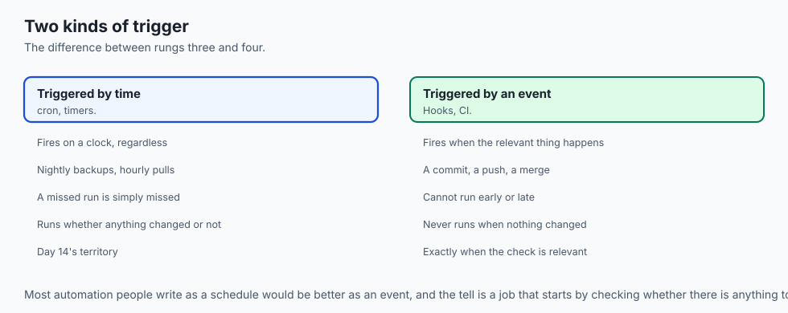
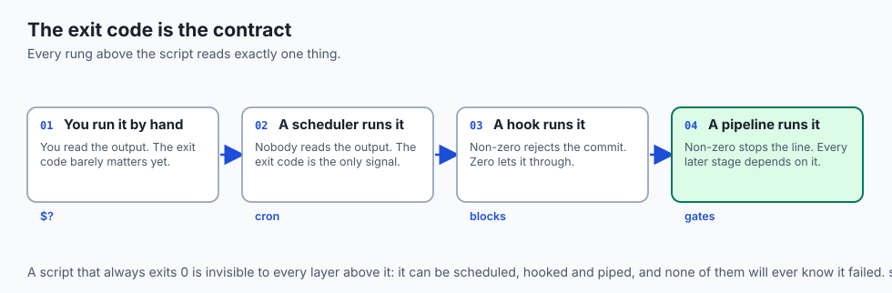
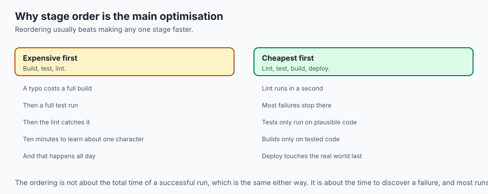
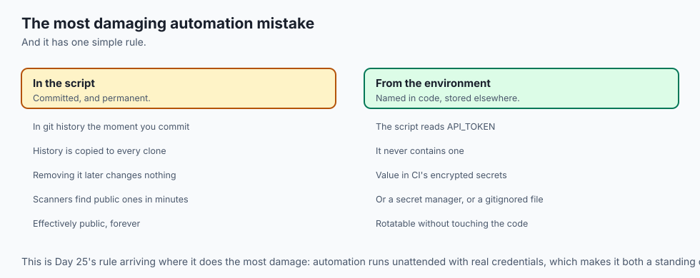
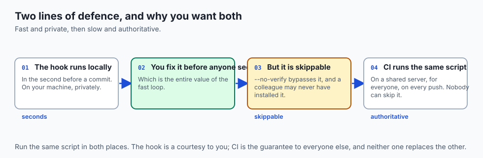
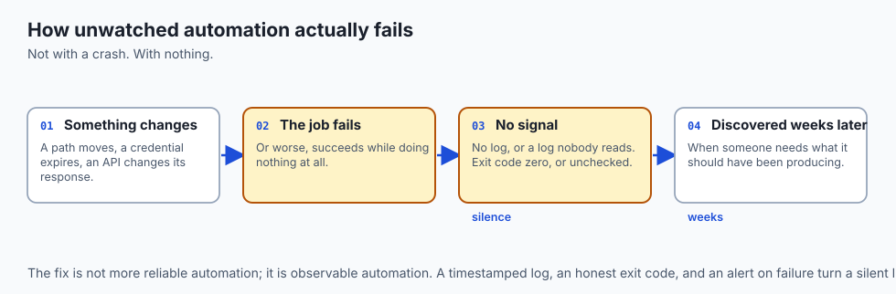
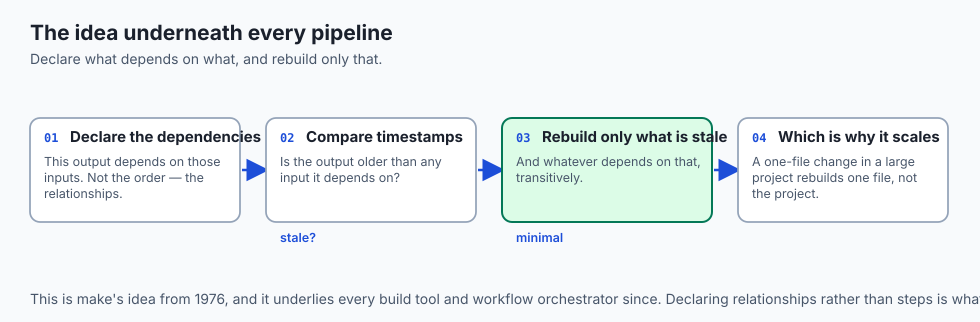
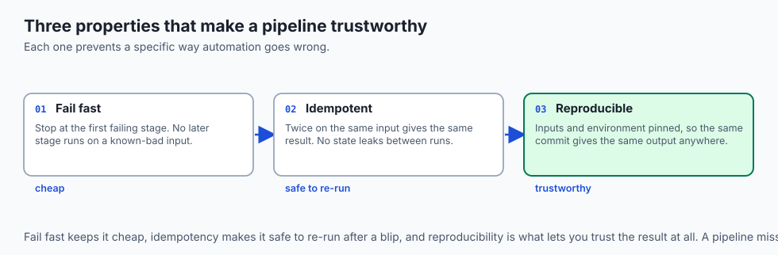
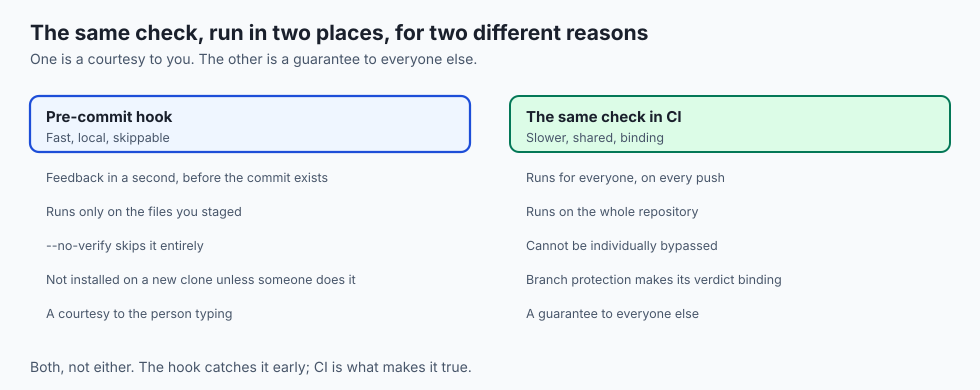
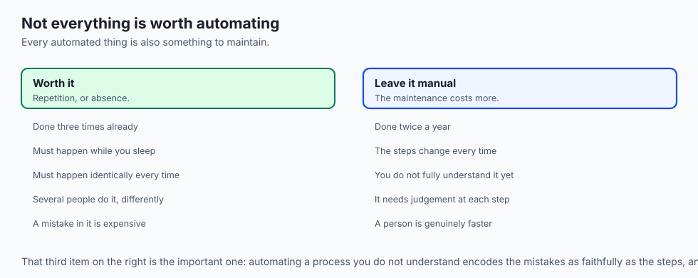

## Why this matters

- **This is where the whole section composes.** Scripts, cron, hooks, tests and
  observability become one thing today.
- **Every AI project becomes a pipeline** — fetch, preprocess, train, evaluate, deploy —
  and each stage is something you already know how to write.
- **Automation that fails silently is worse than none**, because you believe you are
  covered.
- **A secret in an automated script is the most damaging mistake** in this whole
  section, and it has one simple rule.
- **The point is leverage**: work you do once that keeps working without you.

---

## The idea in plain language



- **There is a ladder.** Manual work, then a script, then a schedule, then a hook, then
  a pipeline — each rung reusing the one below.
- **Scheduling is about time**; hooks are about events. That is the whole difference
  between rungs three and four.
- **A pipeline is ordered stages**, each of which must pass before the next runs.
- **Cheapest checks first**, so most failures cost a second rather than ten minutes.
- **You never replace the script.** You only change what pulls the trigger.

---

## Historical background

- **`make`, 1976**, was the first widely used pipeline: declare what depends on what,
  and it rebuilds only what changed.
- **That dependency-graph idea underlies everything since**, including modern build
  tools and workflow orchestrators.
- **Continuous integration was named in the 1990s** as an extreme-programming practice:
  integrate often, and let a machine verify every integration.
- **Hosted CI made it universal.** Once running checks on every push cost nothing to
  set up, there was no argument left against it.
- **Containers made pipelines reproducible**, by pinning the environment as well as the
  code — which is what turned "works on my machine" into a solved problem.
- **The ladder itself has not changed.** Only the top rung has become dramatically
  cheaper.

---

## What it is — and what it is not

**Automation is:**

- Work encoded once, triggered by time, by an event, or by a person.
- A ladder, where each rung reuses what is below it.
- Only trustworthy when it is observable.

**It is not:**

- **Not free.** Every automated thing is something to maintain, debug and understand.
- **Not always worth it.** A task done twice a year is cheaper done by hand than
  maintained for a year.
- **Not reliable by default.** Unattended work fails silently unless you build the
  signal in.
- **Not a substitute for understanding.** A pipeline you cannot run by hand is one you
  cannot debug.

---

## Why it was created and what problems it solves

- **Repetition is where mistakes live.** A person doing seven steps in order will
  eventually do six.
- **Consistency.** The machine does it the same way every time, including at 3am.
- **Speed of feedback.** A check that runs on every push finds a problem in minutes
  rather than at review.
- **Enforcement.** A gate nobody can skip is what makes a standard real rather than
  aspirational.
- **Leverage.** The whole point: work done once that keeps working without you.

---

## How it works

### The ladder, rung by rung




- **Scripts** are the foundation. The moment you have typed the same three commands
  twice, they belong in a script with a clear name.
- **Everything above reuses the script.** You never replace it; you change what pulls
  the trigger.
- **Scheduling with `cron`** runs a command on a clock: five time fields, then the
  command. `0 2 * * * /path/to/backup.sh` is 2am daily.
- **Scheduling suits work tied to time** rather than to a change — nightly backups,
  hourly pulls, a weekly report.
- **Git hooks fire on events.** `pre-commit` runs before a commit is recorded and can
  reject it by exiting non-zero; `pre-push` runs before commits leave.
- **A hook only takes effect if it is executable**, and it lives in `.git/hooks/`.
- **CI runs your checks on every push**, in a fresh environment, for the whole team. CD
  extends that to packaging and releasing when they pass.
- **Because CI runs on a shared server nobody can skip**, it catches what a local hook
  missed — including the commits of a teammate who never installed one.

### The pipeline




- **The canonical shape is lint → test → build → deploy.**
- **The ordering is cheap-first, deliberately.** Linting takes a second and catches
  typos; tests take longer; building longer still; deploying touches the real world.
- **So most mistakes are caught in the first second**, and you rarely pay for the
  expensive stages on code that was never going to pass.

Three properties make a pipeline trustworthy:

- **Fail fast.** The moment a stage fails the pipeline stops and reports, so no later
  stage runs on a known-bad input.
- **Idempotency.** Running twice on the same input gives the same result, with no
  leftover state leaking between runs. A stage that appends where it should overwrite
  is not idempotent, and will surprise you.
- **Reproducibility.** Inputs and environment are pinned, so the same commit produces
  the same output on your laptop and on the server, next week as much as today.

### Secrets in automation



- **The rule is absolute**, and ties straight back to Day 25: never hard-code a secret
  into a script, and never commit one.
- **Once a secret is in git history it is effectively public**, because history is
  permanent and copied to every clone.
- **Pass secrets through the environment.** The script reads `API_TOKEN`; it never
  contains one.
- **Store the value somewhere access-controlled**: your CI system's encrypted secrets, a
  cloud secret manager, or a gitignored local file.
- **The script refers to the secret by name**; the value lives out of version control.
  This one discipline prevents the most damaging automation mistake there is.

### Making it observable





- **Automation that runs unwatched fails silently** — the nightly job that stopped three
  weeks ago, discovered when someone needs what it should have produced.
- **Every automated job should write a clear log**: what it did, when, and whether it
  succeeded.
- **And exit with a distinct status**, so success and failure are machine-readable and
  the scheduler or CI system can detect them.
- **Design for re-runs.** Networks blip and machines restart, so a job should be safe to
  run again and should fail cleanly rather than half-finishing.
- **Automation you cannot see is automation you cannot trust.**

---

## An everyday analogy



A factory production line.

| The factory | Automation |
| --- | --- |
| A written work instruction | A script |
| The shift bell | A schedule |
| A sensor that stops the line on a defect | A hook |
| The line itself, station by station | A pipeline |
| Quick visual check first, load test last | Cheap checks first |
| The line halting on a fault | Fail fast |
| The shift log | Logging |

- **You write the instruction once**, and it is followed identically every time.
- **Checking cheaply at the start** means you rarely waste the expensive station on a
  part that was already wrong.
- **A line with no log** is one where nobody notices a station stopped until the order
  is late.

---

## Examples in practice





- **A pre-commit hook rejecting a key**, which is the cheapest possible place to catch
  it.
- **A CI pipeline failing on a formatting rule** three seconds into a run, before any
  test consumed a minute.
- **A nightly job that stopped silently in March**, noticed in April when the data was
  needed.
- **A deploy that half-finished** and left the system in a state neither old nor new,
  because the stage was not idempotent.
- **A colleague's `--no-verify`** landing exactly what the hook existed to prevent —
  which is why CI is the gate and the hook is only the courtesy.

---

## Implications: security, privacy, performance, scalability, and cost

- **Security: automation runs unattended with real credentials**, which makes it a
  standing capability and a target.
- **Give each pipeline the narrowest credentials it needs.** A deploy token that can
  also read your source is broader than the job requires.
- **CI running on untrusted pull requests** with secrets available is how tokens leak
  from open-source projects; platforms restrict this deliberately.
- **Privacy: logs from automated jobs accumulate**, often containing more than intended.
  Decide retention on purpose.
- **Performance: cheap-first ordering is the whole optimisation.** Reordering stages is
  usually a larger win than making any one of them faster.
- **Cost: an automated job that fails and retries forever is an unbounded bill**, which
  is Day 27's lesson arriving in a new place. Cap the attempts.

---

## Alternatives: free, open source, and commercial

| Tool | Type | Where it fits |
| --- | --- | --- |
| Shell scripts | Free, built in | The foundation. Everything above reuses them. |
| `cron` / systemd timers | Free, built in | Time-triggered work on one machine |
| `pre-commit` | Free, open source | Managing hooks consistently across a team |
| GitHub Actions, GitLab CI | Free tiers | Event-triggered checks, for everyone, unskippable |
| `make`, `just` | Free, open source | Local task running with dependency ordering |
| Airflow, Dagster, Prefect | Free, open source | Data pipelines with dependencies, retries and backfills |

- **Reach for a workflow orchestrator when stages depend on each other** and need
  retries and backfills. Three cron jobs timed to run "far enough apart" is a race
  condition with a schedule attached.
- **Keep the logic in a script the pipeline calls.** A pipeline whose logic lives only
  in its own configuration cannot be run or debugged locally.

---

## Comparison with related concepts

| Term | What it actually is |
| --- | --- |
| **Script** | Commands in a file, run top to bottom |
| **Schedule** | A trigger based on time |
| **Hook** | A trigger based on an event |
| **Pipeline** | Ordered stages, each gating the next |
| **CI** | Checks run on every push, for everyone |
| **CD** | Packaging and releasing automatically when they pass |
| **Idempotent** | Safe to run more than once |

---

## When to use it — and when not to



- **Automate anything you have done three times**, or anything that must happen when you
  are asleep.
- **Put cheap checks first**, always.
- **Run the same checks locally and in CI**, so the gate never surprises you.
- **Keep the logic in a script**, and let the pipeline call it. That is what makes it
  debuggable.
- **Do not automate a task done twice a year.** The maintenance costs more than the
  task.
- **Do not automate a process you do not understand.** You are encoding the mistakes as
  well as the steps.
- **Do not schedule anything without a log and an exit code.** Silent failure is the
  characteristic way automation goes wrong.

---

## The AI connection

- **An AI project is a pipeline**: fetch data, preprocess, train, evaluate, deploy — and
  each stage is a script you already know how to write.
- **Evaluation belongs in the pipeline as a gate.** A model that scores worse than the
  current one should not be able to deploy, and that is a stage, not a policy.
- **Retraining on a schedule is a cron job**, with everything Day 14 said about
  unattended work applying exactly.
- **The idempotency requirement is sharper with data.** A preprocessing stage that
  appends rather than overwrites silently doubles your training set.
- **Pipelines are what make an experiment reproducible.** The commit, the config, the
  data version and the result, all recorded by the same run.

---

## Knowledge check

```yaml
quiz:
  question: "A team has a pre-commit hook that blocks commits containing credentials. A secret still reaches the shared repository. What is the most likely explanation?"
  options:
    - "Hooks are local and skippable, so a teammate without it installed — or using --no-verify — bypassed the check entirely"
    - "The hook only inspects staged files, and the secret was committed unstaged"
    - "The hook ran but its non-zero exit status was ignored by git"
    - "Pre-commit hooks cannot inspect file contents, only file names"
  answer_index: 0
  explanation: "A hook lives in the local .git directory, does not travel with a clone, and can be bypassed with a flag. That is precisely why the same check belongs in CI as well: the hook is fast feedback for you, and CI is the gate that applies to everyone."
```

---

## Hands-on exercise

Climb the ladder on one real task. Worked through fully in the Day 41 lab directory.

| What you are doing | Command |
| --- | --- |
| Write the script | `check.sh`, with `set -euo pipefail` from Day 12 |
| Run it by hand | `./check.sh` — confirm it exits 0 and non-zero correctly |
| Schedule it | A crontab line, with output redirected and `2>&1` |
| Make it a hook | `.git/hooks/pre-commit`, then `chmod +x` |
| Prove the hook blocks | Try to commit something it rejects |
| Prove it is skippable | `git commit --no-verify` |
| Add cheap-first stages | Lint, then test, then build — in that order |

### Expected output

```text
$ ./check.sh; echo "exit=$?"
lint: ok
test: 12 passed
exit=0

$ git commit -m "add key"
pre-commit: possible credential in config.py — rejected
$ git commit -m "add key" --no-verify
[main 4f2a1c8] add key
```

- **The exit code is what every layer above reads.** A script that always exits 0 cannot
  be automated.
- **`--no-verify` succeeded**, which is the whole argument for CI as the real gate.

### Validate your work

- [ ] Your script exits non-zero on failure and 0 on success
- [ ] You scheduled it and confirmed it ran with cron's minimal environment
- [ ] Your hook blocks a commit, and you demonstrated that it can be bypassed
- [ ] Your stages run cheapest first, and you can say why
- [ ] Your job writes a log with a timestamp and an outcome
- [ ] `bash tests/run_tests.sh` reports 0 failures

### Troubleshooting

- **The hook does not run.** It needs the exact name, no extension, and the execute bit.
- **The cron job fails but the hook works.** Cron's environment, from Day 14. Absolute
  paths, and set what you need at the top of the script.
- **The pipeline passes locally and fails in CI.** Something is on your machine and not
  on the server. That difference is the finding.
- **The job succeeds while doing nothing.** Your script swallowed an error. Add
  `set -euo pipefail`.

### Common mistakes

- **A script that always exits 0**, which makes every layer above it blind.
- **Expensive stages first**, so a typo costs ten minutes.
- **A secret in the script**, rather than read from the environment.
- **Assuming a hook protects the team.** It protects you, until you pass one flag.

---

## Practice assignment

- **Take one manual task and climb every rung**: script it, schedule it, hook it, and
  put it in a pipeline. Note what each rung added.
- **Deliberately make a stage non-idempotent**, run it twice, and observe the damage.
- **Reorder a pipeline** from expensive-first to cheap-first and measure the difference
  in time-to-failure.
- **Move a hard-coded secret** out of a script and into the environment, then confirm
  with `grep` that nothing remains.

---

## Extension challenge

- **Build a full pipeline for a small project**: lint, test, build, and a deploy that
  only runs on the main branch.
- **Add a quality gate to a model pipeline**: fail the build if evaluation on a held-out
  set is worse than the current best.
- **Make one stage genuinely reproducible** by pinning its environment in a container,
  and prove it by running the same commit on two different machines.
- **Instrument the pipeline itself** with the Day 40 signals: how long each stage takes,
  how often each fails, and which one fails most. That data usually changes what you
  optimise.

---

