## Why this matters

- **Six weeks of separate topics are one system**, and today is where that becomes
  visible.
- **You can now trace any action through the stack** and know, at each step, what is
  happening and how to look inside it.
- **That is the difference between a foundation and a pile of facts.**
- **Everything after this course assumes all of it** — the next courses will not
  re-explain a process, a request or a commit.
- **The gaps you find today are cheap to close now** and expensive to discover later.

---

## The idea in plain language

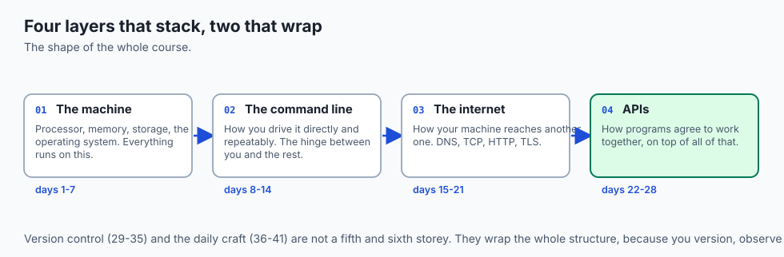

- **Six areas, one system.** The machine, the command line, the internet, APIs, version
  control, and the daily craft.
- **The first four stack on each other.** Each one runs on the layer below.
- **The last two wrap the whole thing**, because you version, observe and automate at
  every layer.
- **One ordinary command touches nearly all of them** in the space of a heartbeat.
- **Understanding means being able to look inside each step**, not being able to
  recite it.

---

## Historical background

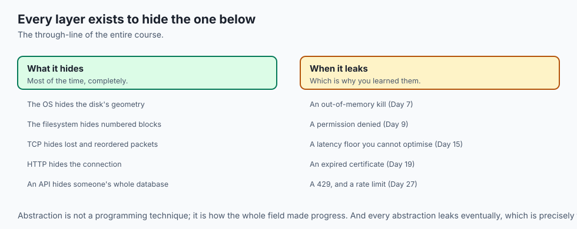

- **Each layer was invented to hide the one below it**, and each took decades.
- **The stored-program machine, the operating system, the shell, the network, the
  protocol, the API** — every one of them exists because the layer beneath was too hard
  to use directly.
- **That is the through-line of the whole course.** Abstraction is not a programming
  technique; it is how the entire field made progress.
- **The layers leak, which is why you learned them.** A slow query, a certificate error,
  an out-of-memory kill — each is a lower layer becoming visible.
- **Nothing here is new.** The oldest ideas in this course are from the 1960s and 70s,
  and you will use them unchanged for your whole career.
- **What changes is the top.** Frameworks and models turn over constantly; the
  foundation does not.

---

## What it is — and what it is not

**This foundation is:**

- A model of how computation, communication and collaboration actually work.
- Durable. Almost none of it will be obsolete in ten years.
- The thing that makes debugging possible, because you know where to look.

**It is not:**

- **Not complete.** It is a foundation, and the point of a foundation is what gets built
  on it.
- **Not memorised.** You will look things up forever, and that is correct. What you have
  is the map, not the contents.
- **Not the interesting part.** It is what makes the interesting part possible.
- **Not a substitute for building things.** Six weeks of understanding needs a project
  to become skill.

---

## Why it was created and what problems it solves

- **Debugging requires a model.** Without one, every problem is equally mysterious and
  you change things at random.
- **AI work sits on all of it.** A training job is a process, reading files, over a
  network, from an API, versioned in Git, watched by logs.
- **The failures are almost never in the model.** They are in the data path, the
  environment, the permissions, the version, the network.
- **Reading other people's work requires the vocabulary.** Every README assumes this
  course.
- **Judgement needs foundations.** Knowing which store, which workflow, which retry
  policy is not a lookup; it follows from understanding the trade-offs.

---

## How it works

### The six areas

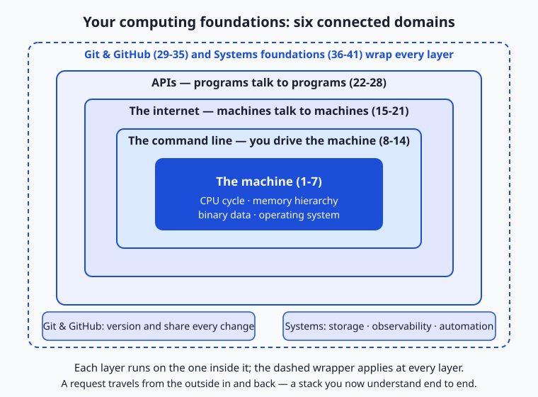

- **The machine** (days 1–7) is at the centre: transistors, fetch-decode-execute, the
  memory hierarchy, binary, and the operating system scheduling it all. Everything else
  runs *on* this.
- **The command line** (days 8–14) wraps it: navigating the filesystem, transforming
  text with pipes, environment variables, scripting. The shell is the hinge between you
  and everything else.
- **The internet** (days 15–21) is how your machine talks to other machines: DNS to find
  them, TCP and ports to connect, HTTP and TLS to exchange, `curl` to inspect.
- **APIs** (days 22–28) are how *programs* talk to each other: REST, JSON,
  authentication, and the realities of rate limits, pagination and errors.
- **Git** (days 29–35) tracks every change: commits, branches, merges, remotes, review,
  and the ability to undo almost anything.
- **The daily craft** (days 36–41): an editor, debuggers and linters, regular
  expressions, storage choices, observability, and automation.
- **The last two are not on top of the stack.** They wrap the whole thing, because you
  version and observe and automate at every layer.

### One action, traced

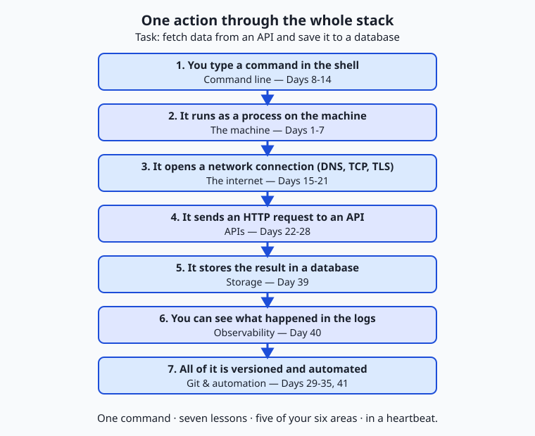

*Fetch some data from a public API and save it to a database.*

1. **You type a command in the shell** (8–14). The shell parses the line, expands
   variables and globs, and prepares to run it.
2. **It runs as a process** (1–7). The kernel loads it, gives it memory and a slice of
   CPU, and it executes — Day 1's cycle, now running your program.
3. **It opens a network connection** (15–21). DNS resolves the name, TCP opens a
   connection, TLS encrypts it. All of Week 3 fires here, in a fraction of a second.
4. **It sends an HTTP request** (22–28). A `GET` with an `Authorization` header; the
   server checks the key, applies rate limits, and returns JSON with a status code you
   can interpret.
5. **The result is stored** (39). You parse the JSON and write it somewhere deliberate,
   having chosen the store on purpose.
6. **You can see what happened** (40). Logs record the request and its status; a failure
   leaves a trail rather than a shrug.
7. **All of it is versioned and automated** (29–35, 41). The script is in a repository, a
   commit records the change, and a hook or pipeline could run it on a schedule.

- **One command. Seven lessons, five of the six areas, in a heartbeat.**
- **Before this course that was one opaque event** — "the program got the data". Now it
  is a sequence of layers you can look inside.

---

## An everyday analogy

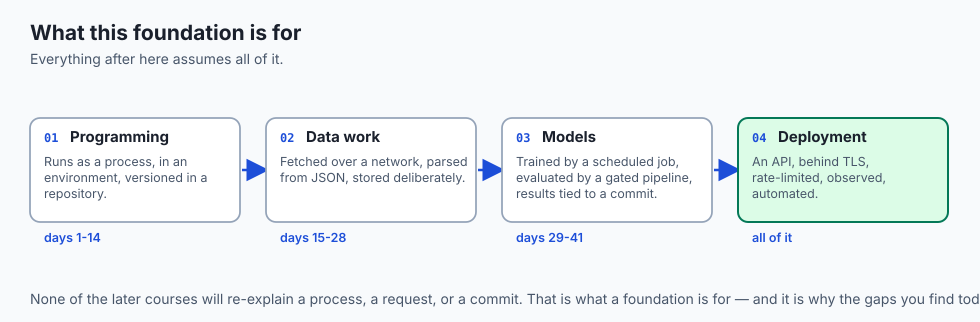

Learning to read a city.

| The city | The foundation |
| --- | --- |
| The buildings and roads | The machine |
| Knowing how to get anywhere on foot | The command line |
| The transport network | The internet |
| The agreed way businesses trade | APIs |
| Public records of who changed what | Version control |
| Tools, maps and habits | The daily craft |

- **A tourist follows directions.** A resident understands the layout and can find a way
  when the directions are wrong.
- **You are not expected to know every street.** You are expected to know how streets
  work, so an unfamiliar one is navigable.
- **The city keeps changing at street level** and almost never at the level of how a
  city works.

---

## Examples in practice

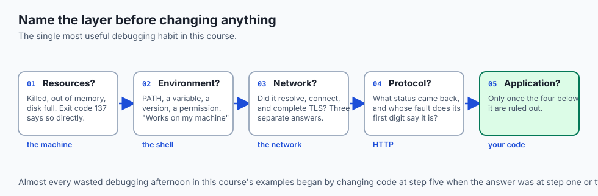

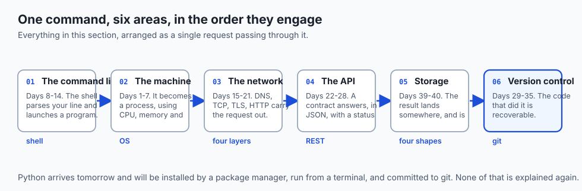

- **"The training job died."** Exit code 137 — the kernel killed it for memory (Day 7).
- **"The API is slow."** Time the four phases and find out whether it is DNS, TLS or the
  server (Days 15, 21).
- **"It works on my machine."** Compare `PATH`, the environment and the versions (Days
  11, 13).
- **"Permission denied."** Read the ownership and the mode bits (Day 9).
- **"Nobody can reproduce the result."** No commit hash was recorded with it (Days 29,
  35).

---

## Implications: security, privacy, performance, scalability, and cost

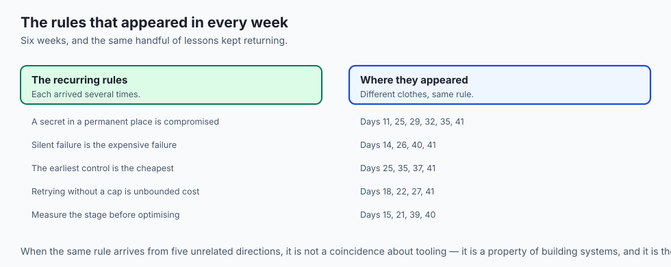

- **Security ran through every week**, and the same rule kept appearing: a secret that
  reaches a permanent place is compromised, and revocation is the only real remedy.
- **The layers where secrets leak** — the environment, a URL, a commit, a log, a metric
  label, a copied command — are each a lesson you have now had.
- **Privacy: your data path is now visible to you.** You know where personal data can
  land, which is what makes retention a decision rather than an accident.
- **Performance: almost every "slow" has a layer.** Compute, memory, disk, network, or
  waiting. Naming the layer is most of the fix.
- **Cost: the recurring shape is that the expensive mistake is silent.** A failed cron
  job, an unpinned dependency, a cache with no expiry, a retry with no cap.
- **The cheapest control is always the earliest one**, which is the argument the whole
  final week was making.

---

## Alternatives: free, open source, and commercial

| To go deeper on | Free resource |
| --- | --- |
| The machine | *Computer Systems: A Programmer's Perspective*; Nand2Tetris |
| The command line | *The Linux Command Line*, by William Shotts |
| Networking | *High Performance Browser Networking*, by Ilya Grigorik |
| Git | *Pro Git*, free online, and its chapter on internals |
| APIs and HTTP | The MDN HTTP documentation |
| Observability and reliability | Google's *Site Reliability Engineering*, free online |

- **Every one of these is free and excellent**, and each goes a layer deeper than this
  course could.
- **Read one, not six.** Depth in one area teaches the habit of depth, which transfers.

---

## Comparison with related concepts

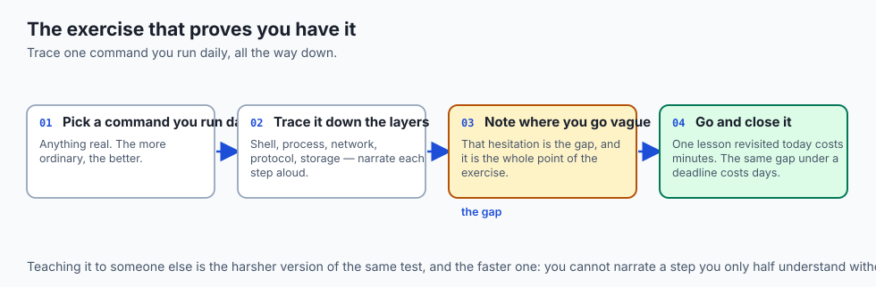

| Area | The question it answers |
| --- | --- |
| **The machine** | What is actually executing, and with what resources |
| **The command line** | How do I drive it directly and repeatably |
| **The internet** | How does my machine reach another one |
| **APIs** | How do programs agree to work together |
| **Version control** | What changed, when, by whom, and how do I undo it |
| **The craft** | How do I work well, and how do I know it is working |

---

## When to use it — and when not to

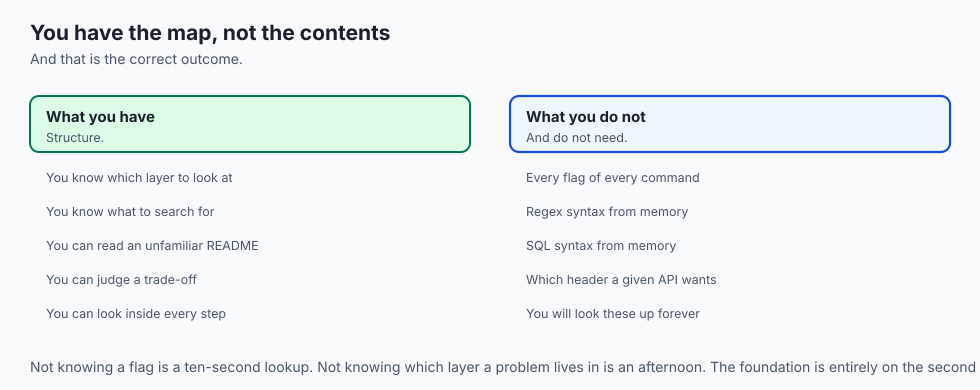

- **Use the layer model whenever something is wrong.** Name the layer before changing
  anything.
- **Use the cheapest diagnostic first.** `dig`, `curl -v`, `git status`, `ls -l` — all
  read-only, all instant.
- **Reach for a lower layer only when the one above does not explain it.** Most problems
  are one layer down, not five.
- **Do not try to hold it all in your head.** Hold the map; look up the contents.
- **Do not stop here.** A foundation with nothing built on it decays quickly, and the
  next course starts immediately.
- **Do not skip the review.** The gaps you find today cost minutes; the same gaps found
  during a deadline cost days.

---

## The AI connection

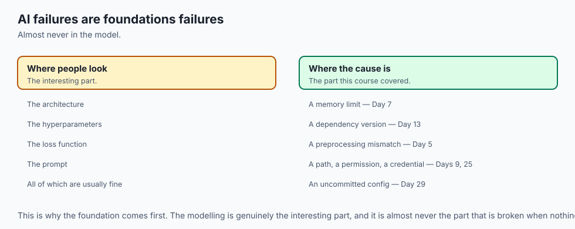

- **A training run is every layer at once**: a process, with memory limits, reading files
  over a network, from an API, in a versioned repository, watched by logs.
- **AI failures are rarely in the model.** They are in the data path, the environment,
  the permissions, the version, or the network — every one of which you now understand.
- **Reproducibility is a foundations problem**, not a modelling one. Commit, config,
  data version, and a recorded hash.
- **Cost control is a foundations problem too**: caching, batching, retry caps and spend
  limits, all of which you met before any model did.
- **The next courses build on this without re-explaining it.** That is the point of a
  foundation, and it is why the gaps matter now.

---

## Knowledge check

```yaml
quiz:
  question: "A training job runs fine locally and is killed on a server with no traceback, logging only exit code 137. Which layer should you examine first?"
  options:
    - "Memory — 137 is 128 + 9, meaning the kernel sent SIGKILL, typically for exceeding a memory limit"
    - "The network, since the job may have lost its connection to the data source"
    - "Permissions, since the server user may lack access to the output directory"
    - "The Python environment, since a missing dependency would terminate the process"
  answer_index: 0
  explanation: "SIGKILL cannot be caught, so no cleanup runs and no traceback is written — which is exactly why the log simply ends. The number itself names the layer: this is the operating system reclaiming memory, not anything about the model or the code."
```

---

## Hands-on exercise

Build one small thing that uses every area. Worked through fully in the Day 42 lab
directory.

| Area | What you do |
| --- | --- |
| Git | `git init`, a `.gitignore` written before the first commit |
| Shell | A script with `set -euo pipefail` and an argument with a default |
| Network and API | `curl` a public endpoint, checking the status before parsing |
| Data | Parse the JSON and store it deliberately — SQLite or a file |
| Observability | A structured log line per run, with a timestamp and an outcome |
| Automation | A `pre-commit` hook, and a crontab line to run it nightly |
| Craft | Format, lint, and a commit message that says why |

### Expected output

```text
{"ts":"2026-08-31T09:00:04Z","event":"fetch_ok","records":142,"ms":318}
$ sqlite3 data.db "SELECT COUNT(*) FROM records;"
142
$ git log --oneline
7c3d9a1 feat: store fetched records in sqlite
9f1b2e8 chore: add pre-commit hook and gitignore
```

### Validate your work

- [ ] The script exits non-zero when the request fails, and you tested that path
- [ ] No credential appears anywhere in the repository
- [ ] Each run appends one structured, queryable log line
- [ ] The hook rejects a commit it should reject
- [ ] You can trace your own command through all seven steps of the journey above
- [ ] `bash tests/run_tests.sh` reports 0 failures

### Troubleshooting

- **Anything that goes wrong here is a lesson from this course.** Name the layer first.
- **`command not found` under cron** — Day 14. **A parse error on an error page** — Day
  28. **`Permission denied`** — Day 9.
- **The hook does not fire.** Day 35: name, location, execute bit.
- **The log is unqueryable.** Day 40: fields, not sentences.

### Common mistakes

- **Skipping the review** because it feels like repetition. It is the pass where gaps
  surface.
- **Building nothing.** Understanding without a project does not become skill.
- **Assuming the next course will re-explain this.** It will not.

---

## Practice assignment

- **Rate yourself on each of the six areas**, honestly, and pick the two weakest.
- **Re-do one lab from each weak area** without looking at the solution.
- **Trace a real action you perform daily** through all seven steps, and note every step
  you could not explain.
- **Write the whole section's map from memory**, then compare it with the diagram. What
  is missing is what to revisit.

---

## Extension challenge

- **Build something small and complete** that uses all six areas and runs unattended:
  fetch, store, log, version, schedule, and alert on failure. That project is the real
  exit exam for this course.
- **Explain the request journey to someone else** without notes. Teaching it is the
  fastest way to find the steps you only half know.
- **Go one layer deeper in your weakest area**, using one of the free resources above,
  for a week.
- **Come back to your Day 1 notes** and read them now. The distance is the measure of
  the six weeks.

---

