## Why this matters

Welcome to **Course 05: Deep Learning**!

In Course 04, you mastered classical machine learning algorithms. You built decision trees, evaluated gradient boosted ensembles, tuned hyperplanes with support vector machines, and segmented data using unsupervised manifolds. In all of those algorithms, **feature representation was handcrafted by human engineers**: you computed logarithms, designed polynomial combinations, and extracted autoregressive lags.

Deep Learning revolutionizes computational intelligence through **Representation Learning**: instead of manually hand-engineering feature representations, multi-layered artificial neural networks automatically discover hierarchical feature abstractions directly from raw data.

At the heart of every modern deep neural network — from simple multi-layer perceptrons to convolutional vision networks and 100-billion parameter Large Language Model Transformers — lies a single, foundational mathematical atom: **The Artificial Perceptron**.

Invented by psychologist Frank Rosenblatt in 1958 at Cornell Aeronautical Laboratory, the Perceptron was the very first algorithmic model of a learning biological neuron. Understanding its mathematical mechanics, its convergence guarantees, and its famous geometric limitations (the XOR barrier) is the essential starting point for mastering Deep Learning.

---

## The idea in plain language

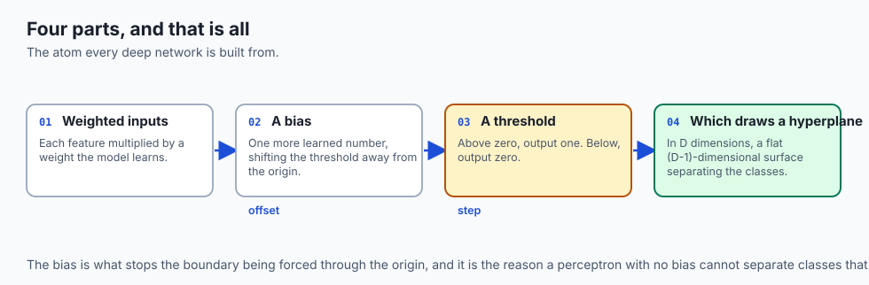

Imagine a smart thermostat deciding whether to turn on an air conditioning unit:

- The thermostat receives several sensory inputs:
  1. **x1 (Room Temperature):** 78 degrees F (Hot).
  2. **x2 (Humidity):** 85% (High).
  3. **x3 (Electricity Price):** $0.45 / kWh (Expensive peak rate).
- The thermostat has internal importance dials (**Weights w1, w2, w3**):
  - It assigns high positive weight to temperature (`w1 = +2.0`).
  - It assigns positive weight to humidity (`w2 = +1.0`).
  - It assigns negative weight to electricity cost (`w3 = -3.0`).
- It has an internal baseline comfort threshold (**Bias b = -5.0**).
- **The Decision Math:** The thermostat computes a weighted score:
  ```
  Score = (78 * 2.0) + (85 * 1.0) + (0.45 * -3.0) - 5.0 = 239.65
  ```

- If `Score >= 0`, the unit fires on (`y_hat = 1`). If `Score < 0`, it stays off (`y_hat = 0`).
- **Learning from Mistakes:** If the homeowner complains that they are freezing cold, the thermostat adjusts its weights and threshold slightly to prevent future mistakes.

---

## Historical background

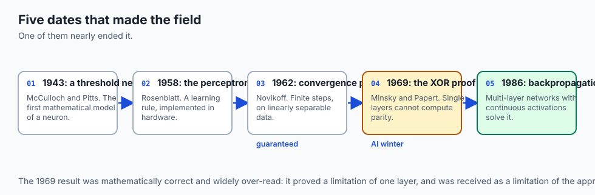

1. **1943 (Warren McCulloch & Walter Pitts):** Published *A Logical Calculus of the Ideas Immanent in Nervous Activity*, proposing the first mathematical threshold model of a biological neuron.
2. **1958 (Frank Rosenblatt):** Published *The Perceptron: A Probabilistic Model for Information Storage and Organization in the Brain*, introducing the Perceptron and the automated **Perceptron Learning Rule** implemented on the custom *Mark I Perceptron* hardware computer at Cornell.
3. **1962 (Albert Novikoff):** Proved the **Perceptron Convergence Theorem**, establishing that the learning rule is guaranteed to find a separating hyperplane in finite iterations on linearly separable data.
4. **1969 (Marvin Minsky & Seymour Papert):** Published their influential book *Perceptrons*, mathematically proving that single-layer perceptrons cannot solve non-linear boolean logic (specifically the XOR parity function). This triggered the first catastrophic **AI Winter**, freezing neural network funding for over 15 years.
5. **1986 (Rumelhart, Hinton, & Williams):** Revitalized neural networks by demonstrating that multi-layer networks with continuous activations and **Backpropagation** seamlessly solve the XOR problem and complex non-linear manifolds.

---

## What it is — and what it is not

### What the Perceptron IS:
- **A Linear Binary Classifier:** A mathematical unit that partitions N-dimensional feature space using an (N-1)-dimensional flat hyperplane.
- **An Online Supervised Learning Algorithm:** Adjusting its parameters sample-by-sample whenever a misclassification error occurs.

### What it is NOT:
- **Not a Multi-Layer Deep Neural Network:** A single perceptron has zero hidden layers and zero non-linear representational capacity.
- **Not Logistic Regression:** The classic Rosenblatt perceptron uses a discontinuous step threshold (`y in {0, 1}`) rather than a continuous, differentiable logistic sigmoid probability curve.

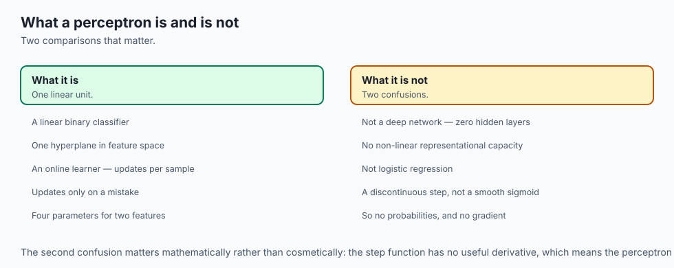

---

## Why it was created and what problems it solves

Prior to 1958, computational systems were hard-coded: programmers wrote explicit, deterministic logic rules by hand. If an engineer wanted a computer to recognize a handwritten letter "A", they had to specify exact coordinate positions for every line segment.

Rosenblatt created the Perceptron to answer a profound scientific question: **Can a physical machine learn to classify visual sensory patterns automatically through trial and error?**

The Perceptron solved this by introducing weight adaptation driven by empirical error feedback.

---

## How it works

Let us dissect the mathematical architecture of the Artificial Perceptron, the Perceptron Learning Rule, the Convergence Theorem, and the XOR linear separability barrier.

### 1. The Perceptron Architecture

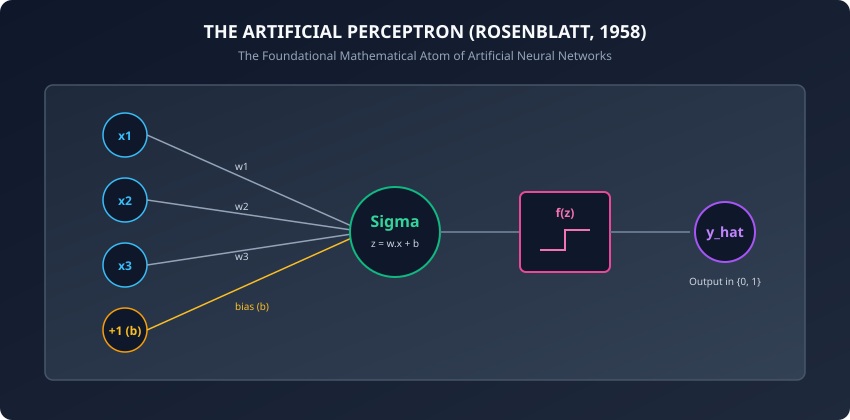

Given an input feature vector `x = [x_1, x_2, ..., x_D]^T in R^D`:

#### Step 1: Linear Combination (Pre-Activation)
Compute the dot product of input vector `x` with weight vector `w = [w_1, w_2, ..., w_D]^T` plus scalar bias `b`:
```
z = sum_{j=1}^D w_j * x_j + b = w^T x + b
```

#### Step 2: Heaviside Step Activation
Apply the discontinuous step threshold function:
```
y_hat = f(z) = 1  if z >= 0
             = 0  if z < 0
```

The geometric decision boundary separating class 0 and class 1 is the linear hyperplane defined by:
```
w^T x + b = 0
```

---

### 2. The Perceptron Learning Algorithm

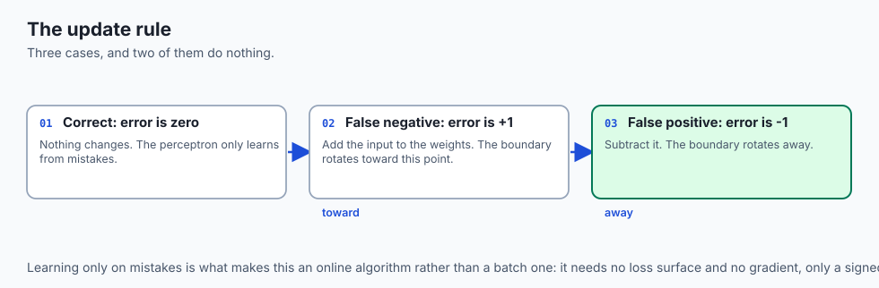

The Perceptron updates its weights and bias iteratively in response to misclassified training samples:

#### Algorithm:
1. Initialize weights `w = [0, 0, ..., 0]^T` and bias `b = 0` (or small random values).
2. Choose a learning rate `eta in (0, 1]` (typically `eta = 0.1` or `1.0`).
3. For each training epoch, iterate through training pairs `(x^{(i)}, y^{(i)})`:
   - Compute predicted output: `y_hat^{(i)} = f(w^T x^{(i)} + b)`.
   - Compute classification error: `error^{(i)} = y^{(i)} - y_hat^{(i)}`.
   - Update weights and bias:
     ```
     w_j <- w_j + eta * (y^{(i)} - y_hat^{(i)}) * x_j^{(i)}
     b   <- b   + eta * (y^{(i)} - y_hat^{(i)})
     ```

4. Repeat until all training samples are classified correctly (`error = 0` for all i) or maximum epochs are reached.

#### The Intuition Behind the Update:
- **Case 1: Correct Classification (`y = y_hat`):** Error is 0. Weights and bias remain unchanged.
- **Case 2: False Negative (`y = 1, y_hat = 0`):** Error is `+1`. The update adds `eta * x` to `w`, rotating the weight vector toward `x` and increasing `w^T x + b` for the next pass.
- **Case 3: False Positive (`y = 0, y_hat = 1`):** Error is `-1`. The update subtracts `eta * x` from `w`, rotating the weight vector away from `x` and decreasing `w^T x + b`.

---

### 3. The Perceptron Convergence Theorem (Novikoff, 1962)

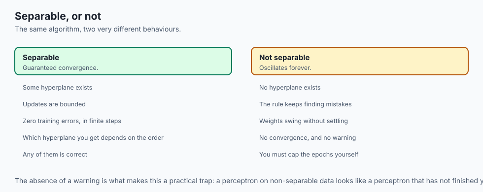

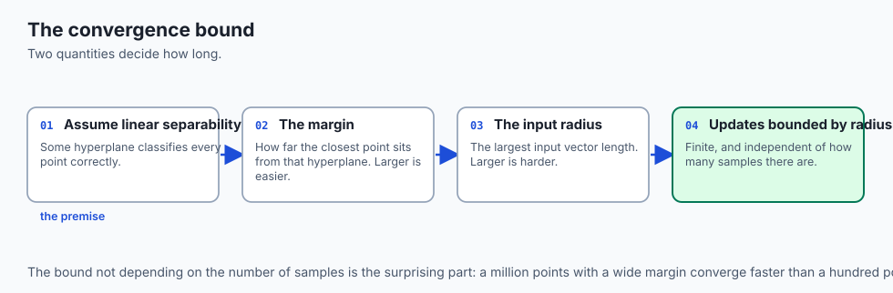

If a training dataset `D = {(x^{(1)}, y^{(1)}), ..., (x^{(N)}, y^{(N)})}` is **linearly separable**, there exists an optimal unit weight vector `w*` (with `||w*|| = 1`) and a positive margin `gamma > 0` such that for all samples:
```
(2 * y^{(i)} - 1) * (w*^T x^{(i)} + b*) >= gamma
```

Let `R = max_i ||x^{(i)}||` be the maximum Euclidean radius of the training inputs.

**Novikoff's Theorem proves that the maximum number of weight updates k before total convergence is strictly bounded by:**
```
k <= (R / gamma)^2
```

*Implication:* If the data is linearly separable, the Perceptron will 100% guaranteed converge to zero errors in finite steps. If the data is NOT linearly separable, the algorithm will oscillate indefinitely without ever converging.

---

### 4. Linear Separability and the XOR Barrier

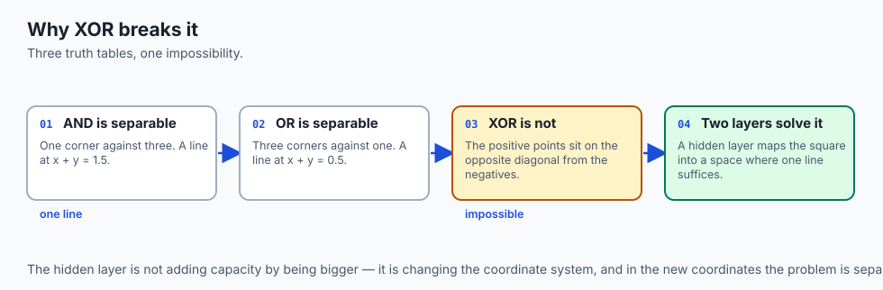

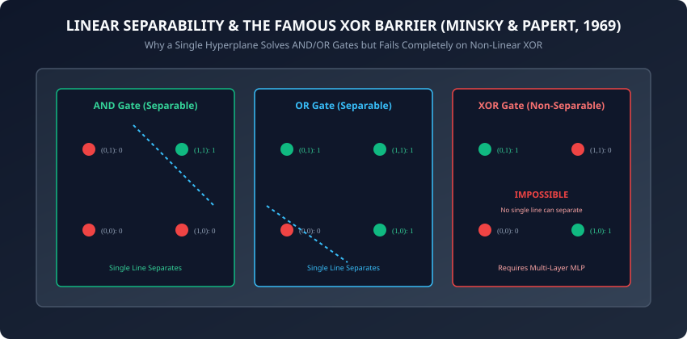

Let us examine why a single-layer perceptron can solve the boolean AND and OR functions, but fails catastrophically on XOR (Exclusive OR):

#### A. The AND Gate Truth Table:
- `(0, 0) -> 0`
- `(1, 0) -> 0`
- `(0, 1) -> 0`
- `(1, 1) -> 1`
*Linear Solution:* `w_1 = 1.0, w_2 = 1.0, b = -1.5`. Hyperplane `x_1 + x_2 - 1.5 = 0` cleanly separates `(1, 1)` from the rest.

#### B. The OR Gate Truth Table:
- `(0, 0) -> 0`
- `(1, 0) -> 1`
- `(0, 1) -> 1`
- `(1, 1) -> 1`
*Linear Solution:* `w_1 = 1.0, w_2 = 1.0, b = -0.5`. Hyperplane `x_1 + x_2 - 0.5 = 0` cleanly separates `(0, 0)` from the rest.

#### C. The XOR Gate Truth Table:
- `(0, 0) -> 0`
- `(1, 0) -> 1`
- `(0, 1) -> 1`
- `(1, 1) -> 0`

In 2D geometric space, the positive points `(1, 0)` and `(0, 1)` lie on the opposite diagonal from the negative points `(0, 0)` and `(1, 1)`. **It is mathematically impossible for any single straight line to divide the positive points from the negative points.**

To solve XOR, we must compose multiple perceptrons into a **Multi-Layer Perceptron (MLP)**:

- Hidden Neuron 1 computes `NAND(x_1, x_2)`.
- Hidden Neuron 2 computes `OR(x_1, x_2)`.
- Output Neuron computes `AND(Hidden 1, Hidden 2)`.
```
XOR(x_1, x_2) = AND(NAND(x_1, x_2), OR(x_1, x_2))
```
The hidden layer maps the 2D non-separable input space into a new feature space where a linear hyperplane can separate the classes.

---

## An everyday analogy

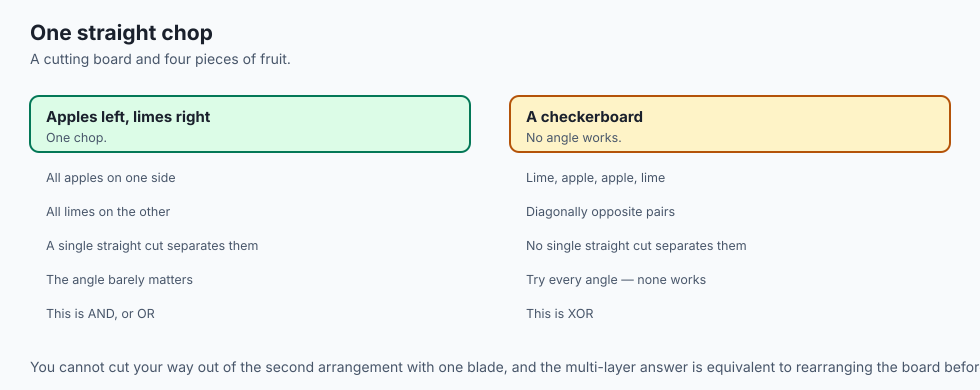

Think of cutting a piece of fruit on a cutting board with a single straight chef's knife blade:

- **Linearly Separable (AND/OR):** You have red apples on the left and green limes on the right. You make a single straight chop with your knife, cleanly separating all apples from all limes.
- **The XOR Problem:** You have 4 fruit pieces arranged in a checkerboard square: top-left is green lime, top-right is red apple, bottom-left is red apple, bottom-right is green lime.
- No matter what single straight angle you slice with your knife, you cannot separate all red apples from all green limes in one cut.
- To separate them, you need **two knife cuts** (a multi-layer neural network with multiple decision boundaries).

---

## Examples in practice

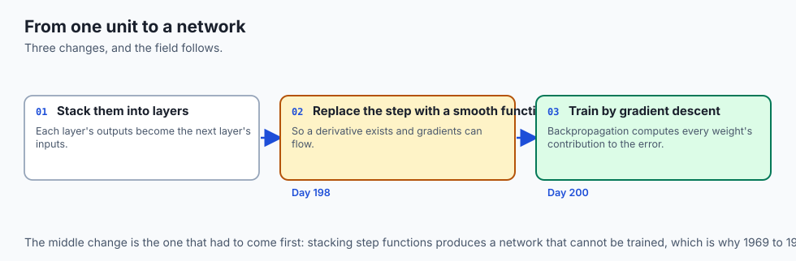

Let us inspect a pure Python and NumPy implementation of Rosenblatt's Perceptron, trained on linearly separable boolean logic gates:

```python
import numpy as np
from typing import Tuple, List

class Perceptron:
    def __init__(self, learning_rate: float = 0.1, max_epochs: int = 100):
        self.lr = learning_rate
        self.max_epochs = max_epochs
        self.weights = None
        self.bias = 0.0
        self.errors_per_epoch = []

    def predict(self, X: np.ndarray) -> np.ndarray:
        # Linear combination: z = X.w + b
        z = np.dot(X, self.weights) + self.bias
        # Heaviside step activation
        return np.where(z >= 0.0, 1, 0)

    def fit(self, X: np.ndarray, y: np.ndarray) -> "Perceptron":
        n_samples, n_features = X.shape
        self.weights = np.zeros(n_features, dtype=float)
        self.bias = 0.0
        self.errors_per_epoch = []

        for epoch in range(self.max_epochs):
            total_errors = 0
            for i in range(n_samples):
                xi = X[i]
                target = y[i]
                y_hat = 1 if (np.dot(xi, self.weights) + self.bias) >= 0.0 else 0
                error = target - y_hat

                if error != 0:
                    # Weight and bias update rule
                    self.weights += self.lr * error * xi
                    self.bias += self.lr * error
                    total_errors += 1

            self.errors_per_epoch.append(total_errors)
            if total_errors == 0:
                break # Converged!

        return self

def solve_xor_with_two_layers(x1: int, x2: int) -> int:
    # Layer 1: Hidden Neurons (NAND and OR)
    # NAND weights: w=[-2.0, -2.0], bias=3.0
    h_nand = 1 if (-2.0 * x1 + -2.0 * x2 + 3.0) >= 0.0 else 0
    # OR weights: w=[2.0, 2.0], bias=-1.0
    h_or = 1 if (2.0 * x1 + 2.0 * x2 - 1.0) >= 0.0 else 0

    # Layer 2: Output Neuron (AND of hidden activations)
    # AND weights: w=[2.0, 2.0], bias=-3.0
    y_xor = 1 if (2.0 * h_nand + 2.0 * h_or - 3.0) >= 0.0 else 0
    return y_xor
```

---

## Implications: security, privacy, performance, scalability, and cost

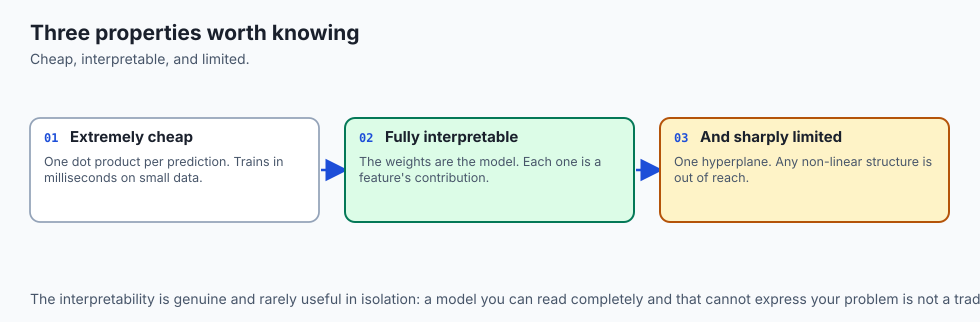

1. **Why the Step Function Prevented Deep Stacking:**
   - The derivative of the Heaviside step function is `d(step)/dz = 0` everywhere except at `z = 0` (where it is undefined).
   - In 1958, there was no way to train multi-layer perceptrons via gradient descent because multiplying zeros during the chain rule completely killed backpropagated error signals.
   - This architectural barrier was only resolved decades later by substituting smooth, continuous activation functions (Sigmoid, Tanh, and ReLU).
2. **Computational Complexity:**
   - Perceptron forward inference requires a single dot product `O(D)` operations, making it hardware-synthesizable in single-cycle FPGA / ASIC logic.

---

## Alternatives: free, open source, and commercial

| Model / Architecture | Decision Boundary | Activation Function | Optimization Algorithm |
| :--- | :--- | :--- | :--- |
| **Rosenblatt Perceptron** | Linear Hyperplane | Heaviside Step (`{0, 1}`) | Perceptron Learning Rule |
| **Adaline (Widrow-Hoff)** | Linear Hyperplane | Identity / Linear | Least Mean Squares (LMS) / SGD |
| **Logistic Regression** | Linear Hyperplane | Sigmoid (`[0, 1]`) | Maximum Likelihood (Log Loss) |
| **Linear SVM** | Maximum Margin Linear | Sign (`{-1, +1}`) | Hinge Loss / Quadratic Prog |
| **Multi-Layer Perceptron** | Non-Linear Manifold | ReLU / GeLU / Sigmoid | Backpropagation & Adam |

---

## Comparison with related concepts

```
┌────────────────────────────────────────────────────────────────────────┐
│                   SINGLE-LAYER LINEAR MODEL COMPARISON                 │
├────────────────────────────────────────────────────────────────────────┤
│ Model              │ Loss / Update Criterion│ Output Type  │ Differentiable│
├────────────────────┼────────────────────────┼──────────────┼───────────────┤
│ Perceptron (1958)  │ Error * x_j            │ Binary {0, 1}│ No (Step)     │
│ Adaline (1960)     │ MSE on Linear Score    │ Continuous   │ Yes           │
│ Logistic Reg (1970)│ Cross-Entropy Log Loss │ Probability  │ Yes (Smooth)  │
│ Multi-Layer MLP    │ Backpropagation SGD    │ Any Output   │ Yes (Deep)    │
└────────────────────────────────────────────────────────────────────────┘
```

---

## When to use it — and when not to

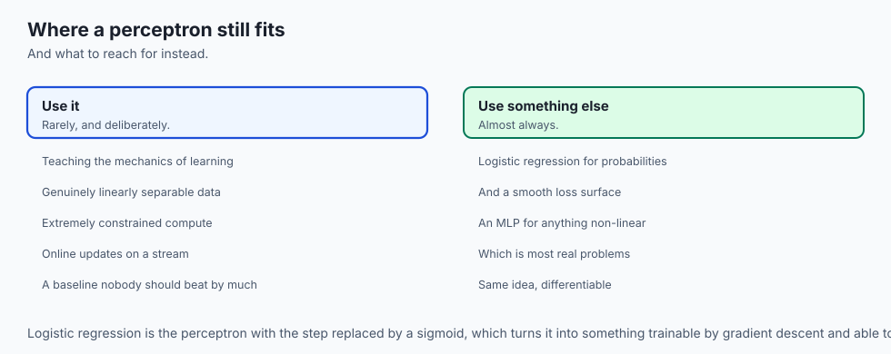

### When to USE the Perceptron:
- To understand the foundational physics and historical lineage of artificial neurons.
- Fast, ultra-simple streaming classification on guaranteed linearly separable data streams.

### When NOT to use it:
- Any real-world non-linear tabular, vision, or text classification problem (use modern Multi-Layer Perceptrons, GBDTs, or Transformers).
- When calibrated probability scores are required (use Logistic Regression).

---

## The AI connection

- **Every deep network is made of this unit.** A weighted sum, a bias and a
  non-linearity is the atom that scales from four parameters to hundreds of billions.

- **The XOR barrier is why depth exists.** A single layer draws one hyperplane, and the
  hidden layer's job is to map the input into a space where one is enough.

- **The convergence guarantee is also a warning**: it holds only for linearly separable
  data, and on anything else the update rule oscillates forever without telling you.

- **The step function is what had to go.** It has no useful derivative, so no gradient
  can flow through it — which is the whole reason Day 198 exists.

- **Representation learning is the shift this begins.** Features stop being designed and
  start being discovered, which is the defining property of the field.

## Knowledge check

1. What is the exact mathematical update equation for weights in Rosenblatt's Perceptron?
2. What conditions are required for the Perceptron Convergence Theorem to guarantee finite convergence?
3. Why is the boolean XOR function geometrically impossible for a single-layer perceptron to separate?
4. How does composing multiple perceptrons into a two-layer Multi-Layer Perceptron (MLP) solve the XOR parity problem?
5. Why did the zero derivative of the Heaviside step function prevent multi-layer gradient descent in 1958?

---

## Hands-on exercise

In this lab, you will implement `Perceptron` in pure NumPy: train it on boolean AND and OR logic truth tables, verify finite epoch convergence, plot error trajectories, prove that a single perceptron fails on XOR, and implement a two-layer manual MLP solving XOR parity.

### Expected output
```
[Perceptron Neural Foundations]
Training Perceptron on AND Gate: Converged in 6 epochs (Weights: [0.2, 0.2], Bias: -0.3)
Training Perceptron on OR Gate:  Converged in 4 epochs (Weights: [0.2, 0.2], Bias: -0.1)
Training Perceptron on XOR Gate: Failed to converge in 100 epochs (Oscillating errors)
Evaluating 2-Layer MLP on XOR Truth Table:
  XOR(0, 0) = 0 [CORRECT]
  XOR(1, 0) = 1 [CORRECT]
  XOR(0, 1) = 1 [CORRECT]
  XOR(1, 1) = 0 [CORRECT]
Accuracy on XOR Parity: 100.0%
Test Suite: 2 passed in 0.08s
```

### Validate your work
Run the automated test runner:
```bash
./tests/run_tests.sh
```

### Troubleshooting
- If the perceptron oscillates forever on XOR, verify that you set `max_epochs` to prevent infinite loops.
- Ensure step activation returns integer `1` when `z >= 0.0` and `0` when `z < 0.0`.

### Common mistakes
- **Expecting Single Perceptron to Learn XOR:** A single linear hyperplane cannot partition opposite diagonal corners in 2D space.

---

## Practice assignment

1. Implement the **Adaline (Adaptive Linear Neuron)** algorithm using mean squared error (MSE) linear score updates and compare convergence rates against Rosenblatt's perceptron.
2. Build an interactive decision boundary visualizer that renders the rotating hyperplane on each training epoch.

---

## Extension challenge

Implement a **Three-Input Parity Network (3-Bit XOR)**:

- Formulate the truth table for `f(x1, x2, x3) = x1 ^ x2 ^ x3`.
- Construct a minimal 2-layer neural network architecture with hidden NAND/OR gates.
- Verify 100% classification accuracy across all 8 possible 3-bit binary input combinations.
