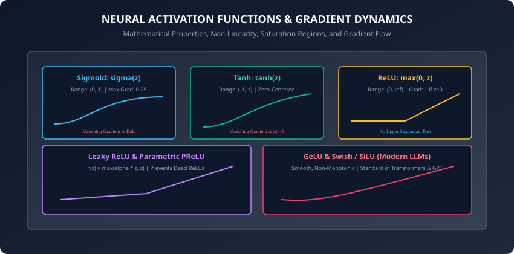
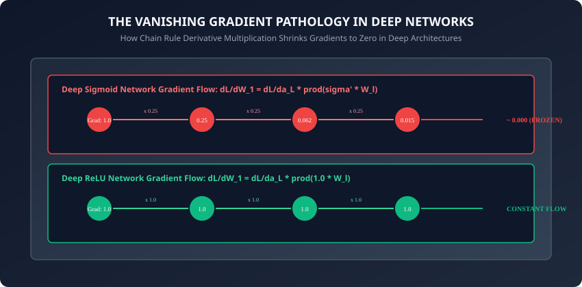

## Why this matters

In Day 197, you learned that a single-layer perceptron with a linear decision boundary cannot solve the non-linear XOR parity problem. You also discovered that the discontinuous Heaviside step function had a zero derivative everywhere, preventing multi-layer networks from being trained with calculus-based gradient descent.

This brings us to one of the most critical design choices in deep learning: **Activation Functions**.

An activation function is the mathematical engine that injects non-linearity into a neural network. Without non-linear activation functions, **a 100-layer deep neural network is mathematically identical to a single linear regression model**: no matter how many millions of parameters or hidden layers you stack, the product of linear weight matrices collapses into a single flat matrix.

Furthermore, the mathematical characteristics of your activation functions — whether they saturate, whether their outputs are zero-centered, whether their derivatives are continuous, and whether they preserve gradient magnitudes — dictate whether your network trains smoothly in minutes or fails completely due to **vanishing or exploding gradients**.

---

## The idea in plain language

Imagine passing audio through an electronic guitar amplifier:
- If the amplifier is purely linear (`Output = Gain * Input`), turning up the volume just makes the sound louder. It sounds clean, but it can never produce the rich, harmonic crunch of rock music.
- To produce distortion and overdrive, guitar pedals use **non-linear clipping diodes**:
  - Below a certain voltage threshold, the signal passes smoothly.
  - Above the threshold, the waveform is bent, compressed, or clipped into a non-linear shape.
  - By cascading multiple non-linear distortion stages, musicians synthesize infinitely rich, complex sound textures that a linear amplifier could never generate.

In a neural network, activation functions are the clipping diodes: they bend, squash, and gate numbers so that deep networks can approximate any continuous mathematical function in the universe.

---

## Historical background

1. **1958 (Step Function):** Frank Rosenblatt used the discontinuous Heaviside step function, which had zero derivatives and halted multi-layer optimization.
2. **1986 (Sigmoid & Tanh):** Rumelhart, Hinton, and Williams adopted the continuous Logistic Sigmoid and Hyperbolic Tangent (Tanh). These enabled Backpropagation, but deep networks deeper than 4 layers suffered from severe vanishing gradients.
3. **2010–2011 (ReLU Revolution):** Vinod Nair, Geoffrey Hinton, and Xavier Glorot proved that the simple Rectified Linear Unit (`ReLU(z) = max(0, z)`) allowed networks with dozens of layers to train 6x faster without vanishing gradients, fueling the AlexNet computer vision breakthrough in 2012.
4. **2015–2016 (Modern Variants):** Kaiming He introduced Parametric ReLU (PReLU), Djork-Arne Clevert proposed ELU, and Dan Hendrycks introduced GeLU (Gaussian Error Linear Unit), which became the default activation across GPT-4, BERT, Claude, and modern Large Language Models.

---

## What it is — and what it is not

### What an Activation Function IS:
- **A Non-Linear Mapping:** A continuous (or piecewise continuous) differentiable mathematical function applied elementwise to the pre-activation vector `z = W x + b`.
- **A Gradient Gate:** The local derivative `f'(z)` acts as a multiplicative multiplier that controls how error signals flow backward during backpropagation.

### What it is NOT:
- **Not a Matrix Multiplication:** Activation functions do not combine features across channels; they operate element-by-element independently on each neuron's scalar activation.
- **Not Optional:** Removing activation functions reduces deep neural networks to ordinary least squares linear regressions.

---

## Why it was created and what problems it solves

### The Mathematical Collapse of Linear Networks

Consider an L-layer neural network where every layer applies a purely linear transformation with no non-linear activation:
```
h_1 = W_1 * x + b_1
h_2 = W_2 * h_1 + b_2 = W_2 * (W_1 * x + b_1) + b_2 = (W_2 * W_1) * x + (W_2 * b_1 + b_2)
...
y_hat = W_L * h_{L-1} + b_L = W_combined * x + b_combined
```
Because matrix multiplication is associative, the product of L weight matrices `W_combined = W_L * W_{L-1} * ... * W_1` is simply a single matrix of dimension `(Output_Dim x Input_Dim)`. **Adding 100 linear hidden layers adds zero representational power over a single-layer model.**

Non-linear activations solve this by ensuring that the composite function `f(W_2 * f(W_1 * x + b_1) + b_2)` cannot be compressed into a linear matrix product, enabling the network to learn arbitrary non-linear manifolds according to the **Universal Approximation Theorem**.

---

## How it works

Let us rigorously analyze the mathematical equations, output bounds, analytical derivatives, and failure modes of the primary activation functions used in deep learning.



---

### 1. The Logistic Sigmoid Function

#### Mathematical Definition:
```
sigma(z) = 1 / (1 + exp(-z))
```
- **Output Range:** `(0, 1)` (Interpretable as a Bernoulli probability).
- **Zero-Centered:** No (outputs are strictly positive, causing zigzagging gradient updates).

#### Analytical Derivative:
```
d(sigma)/dz = sigma(z) * (1 - sigma(z))
```
- **Maximum Gradient:** Exactly `0.25` at `z = 0` (since `0.5 * (1 - 0.5) = 0.25`).
- **Saturation Tails:** As `z -> +inf`, `sigma(z) -> 1.0` and `d(sigma)/dz -> 0.0`. As `z -> -inf`, `sigma(z) -> 0.0` and `d(sigma)/dz -> 0.0`.

---

### 2. The Hyperbolic Tangent (Tanh) Function

#### Mathematical Definition:
```
tanh(z) = (exp(z) - exp(-z)) / (exp(z) + exp(-z)) = 2 * sigma(2*z) - 1
```
- **Output Range:** `(-1, 1)`
- **Zero-Centered:** Yes (mean activation is centered around 0.0, stabilizing weight updates).

#### Analytical Derivative:
```
d(tanh)/dz = 1 - tanh(z)^2
```
- **Maximum Gradient:** Exactly `1.0` at `z = 0` (since `1 - 0^2 = 1.0`).
- **Saturation Tails:** When `|z| > 3`, `tanh(z)^2 -> 1.0` and `d(tanh)/dz -> 0.0`.

---

### 3. The Vanishing Gradient Pathology



During backpropagation in an L-layer network, the gradient of the loss `L` with respect to the first layer weights `W_1` is given by the chain rule:
```
dL/dW_1 = (dL/da_L) * [ prod_{l=2}^L (W_l^T * f'(z_l)) ] * f'(z_1) * x^T
```

If we use Sigmoid activations:
- Every layer multiplies the backward gradient by `f'(z_l) <= 0.25`.
- In a 10-layer network, the gradient multiplier is bounded by:
  ```
  (0.25)^10 = 9.536 * 10^-7
  ```
- The error gradient reaching the earliest hidden layers is virtually zero. **The front layers of deep networks freeze and never learn.**

---

### 4. The Rectified Linear Unit (ReLU)

Introduced to solve the vanishing gradient problem in deep networks:
```
ReLU(z) = max(0, z)
```
- **Output Range:** `[0, inf)`
- **Analytical Derivative:**
  ```
  d(ReLU)/dz = 1  if z > 0
             = 0  if z < 0
  (Undefined at z=0; convention sets d(ReLU)/dz = 0 or 1)
  ```

#### Advantages:
1. **No Upper Saturation:** For positive activations (`z > 0`), the derivative is strictly `1.0`, allowing error gradients to pass through 100+ layers without numerical decay.
2. **Computational Speed:** Requires a single comparison instruction (`z > 0`), avoiding expensive exponential calculations.
3. **Biological Sparsity:** Produces true zeros, inducing sparse representations where only a fraction of neurons fire simultaneously.

#### The Dying ReLU Pathology:
If a large gradient update pushes a neuron's bias and weights such that `z < 0` for all training samples, its output is always 0 and its derivative is always 0. The neuron becomes **permanently dead** and can never recover.

---

### 5. Modern ReLU Variants: Leaky ReLU, PReLU, and ELU

#### A. Leaky ReLU:
Introduces a small non-zero slope `alpha` (typically `alpha = 0.01`) in the negative regime:
```
LeakyReLU(z) = max(alpha * z, z)
d(LeakyReLU)/dz = 1      if z > 0
                = alpha  if z <= 0
```
Because the derivative is `alpha > 0` for negative inputs, gradients continue to flow, completely curing the Dying ReLU pathology.

#### B. Parametric ReLU (PReLU):
Treats `alpha` as a learnable parameter optimized by backpropagation alongside network weights.

#### C. Exponential Linear Unit (ELU):
Uses an exponential curve for negative values:
```
ELU(z) = z                  if z > 0
       = alpha * (exp(z)-1) if z <= 0
```
Brings the mean activation closer to zero while smoothly saturating negative gradients for noise robustness.

---

### 6. GeLU (Gaussian Error Linear Unit) & Swish (The Modern LLM Standard)

#### A. GeLU (Used in GPT-4, BERT, LLaMA):
GeLU weights inputs by their probability under a standard Gaussian distribution:
```
GeLU(z) = z * Phi(z) = z * P(X <= z), where X ~ N(0, 1)
```
*Fast Numerical Approximation:*
```
GeLU(z) = 0.5 * z * (1 + tanh(sqrt(2 / pi) * (z + 0.044715 * z^3)))
```
GeLU is smooth, non-monotonic, and differentiable everywhere, providing superior convergence in Transformer self-attention blocks.

#### B. Swish / SiLU (Invented by Google Brain):
```
Swish(z) = z * sigma(beta * z)
```

---

### 7. Softmax for Multi-Class Classification

Given a vector of raw unnormalized logits `z = [z_1, z_2, ..., z_K]^T in R^K`:
```
softmax(z)_i = exp(z_i) / sum_{j=1}^K exp(z_j)
```

#### Numerically Stable Softmax:
In floating-point hardware, if `z_i = 1000`, `exp(1000)` produces floating-point `+inf` (overflow).
We subtract the maximum logit `M = max_j z_j`:
```
softmax(z)_i = exp(z_i - M) / sum_{j=1}^K exp(z_j - M)
```
Because `exp(z_i - M) / sum exp(z_j - M) = (exp(z_i)/exp(M)) / (sum exp(z_j)/exp(M)) = exp(z_i) / sum exp(z_j)`, the output probabilities are mathematically identical, but the maximum exponent is `exp(0) = 1.0`, guaranteed to never overflow.

---

## An everyday analogy

Think of activation functions as different types of water valves in a multi-story plumbing skyscraper:
- **Linear Activation (No Activation):** An open pipe. If water pressure spikes on floor 1, it blasts uncontrollably all the way to floor 100 without regulation.
- **Sigmoid / Tanh:** A squishy rubber pressure regulator. It smoothly limits pressure between 0 and 1, but if the pressure is too high or too low, the valve locks shut and blocks all feedback.
- **ReLU:** A one-way check valve with an open channel. It blocks all reverse backflow (`z < 0`) but allows forward water to surge through at 100% flow (`z > 0`) without restricting pressure.
- **Leaky ReLU:** A check valve with a tiny bleed hole. It prevents reverse flooding while still letting a tiny trickle through so the pipe never airlocks.
- **GeLU:** A computer-controlled magnetic solenoid valve that smoothly adjusts flow based on a probabilistic pressure curve.

---

## Examples in practice

Let us inspect a complete, vectorized, pure NumPy implementation of the foundational activation functions and their exact analytical derivatives:

```python
import numpy as np
from typing import Tuple

class Activations:
    @staticmethod
    def sigmoid(z: np.ndarray) -> np.ndarray:
        # Numerically stable sigmoid
        return np.where(z >= 0, 1.0 / (1.0 + np.exp(-z)), np.exp(z) / (1.0 + np.exp(z)))

    @staticmethod
    def sigmoid_grad(z: np.ndarray) -> np.ndarray:
        s = Activations.sigmoid(z)
        return s * (1.0 - s)

    @staticmethod
    def tanh(z: np.ndarray) -> np.ndarray:
        return np.tanh(z)

    @staticmethod
    def tanh_grad(z: np.ndarray) -> np.ndarray:
        t = np.tanh(z)
        return 1.0 - t ** 2

    @staticmethod
    def relu(z: np.ndarray) -> np.ndarray:
        return np.maximum(0.0, z)

    @staticmethod
    def relu_grad(z: np.ndarray) -> np.ndarray:
        return np.where(z > 0.0, 1.0, 0.0)

    @staticmethod
    def leaky_relu(z: np.ndarray, alpha: float = 0.01) -> np.ndarray:
        return np.where(z > 0.0, z, alpha * z)

    @staticmethod
    def leaky_relu_grad(z: np.ndarray, alpha: float = 0.01) -> np.ndarray:
        return np.where(z > 0.0, 1.0, alpha)

    @staticmethod
    def gelu(z: np.ndarray) -> np.ndarray:
        # Fast tanh approximation
        return 0.5 * z * (1.0 + np.tanh(np.sqrt(2.0 / np.pi) * (z + 0.044715 * (z ** 3))))

    @staticmethod
    def stable_softmax(z: np.ndarray, axis: int = -1) -> np.ndarray:
        z_shifted = z - np.max(z, axis=axis, keepdims=True)
        exp_z = np.exp(z_shifted)
        return exp_z / np.sum(exp_z, axis=axis, keepdims=True)

def numerical_gradient_check(func, z: np.ndarray, analytical_grad: np.ndarray, eps: float = 1e-5) -> float:
    # Computes relative error between analytical derivative and finite differences.
    grad_approx = (func(z + eps) - func(z - eps)) / (2.0 * eps)
    numerator = np.linalg.norm(analytical_grad - grad_approx)
    denominator = np.linalg.norm(analytical_grad) + np.linalg.norm(grad_approx) + 1e-8
    relative_error = numerator / denominator
    return relative_error
```

---

## Implications: security, privacy, performance, scalability, and cost

1. **Computational Cost on GPUs / Accelerators:**
   - `ReLU` requires 1 clock cycle per vector element (simple comparator bitmask).
   - `Sigmoid` and `Tanh` require expensive exponential evaluations (`exp()`), taking 10x to 20x more ALU clock cycles.
   - `GeLU` uses polynomial approximations in modern GPU tensor cores (e.g., CUDA intrinsics) to maintain high throughput during LLM pretraining.
2. **Numerical Stability & Overflow Vulnerabilities:**
   - Unprotected Softmax or Sigmoid implementations will overflow to `+inf` or underflow to `0.0`, triggering `NaN` loss values that destroy million-dollar GPU training clusters. Always use `z - max(z)` shift protections.

---

## Alternatives: free, open source, and commercial

| Activation Function | Output Range | Derivative Max | Primary Modern Use Case |
| :--- | :--- | :--- | :--- |
| **ReLU** | `[0, inf)` | `1.0` | CNNs, Computer Vision, Dense Tabular Networks |
| **Leaky ReLU / PReLU** | `(-inf, inf)` | `1.0` | Deep CNNs sensitive to Dying ReLUs, GANs |
| **GeLU** | `[-0.17, inf)` | `~1.06` | Transformer Foundation Models (GPT-4, BERT, LLaMA) |
| **Swish / SiLU** | `[-0.28, inf)` | `~1.10` | EfficientNet, YOLOv8, LLaMA Feed-Forward Layers |
| **Sigmoid** | `(0, 1)` | `0.25` | Binary Classification Output Layer, Gated RNNs (LSTM) |
| **Softmax** | `[0, 1], sum=1` | Multi-dim | Multi-Class Classification Output Layer, Self-Attention |

---

## Comparison with related concepts

```
┌────────────────────────────────────────────────────────────────────────┐
│               ACTIVATION FUNCTION PROPERTY MATRIX                      │
├─────────────────┼────────────┼──────────────┼───────────┼──────────────┤
│ Function        │ Range      │ Zero-Centered│ Saturating│ Computational│
├─────────────────┼────────────┼──────────────┼───────────┼──────────────┤
│ Sigmoid         │ (0, 1)     │ No           │ Both Ends │ High (exp)   │
│ Tanh            │ (-1, 1)    │ Yes          │ Both Ends │ High (exp)   │
│ ReLU            │ [0, inf)   │ No           │ Left End  │ Ultra Fast   │
│ Leaky ReLU      │ (-inf, inf)│ No           │ None      │ Ultra Fast   │
│ GeLU            │ [-0.17,inf)│ Near Zero    │ None      │ Moderate     │
│ Softmax         │ [0, 1]     │ No           │ Dynamic   │ Moderate     │
└─────────────────┴────────────┴──────────────┴───────────┴──────────────┘
```

---

## When to use it — and when not to

### Recommendations:
1. **Hidden Layers in Transformers & LLMs:** Use **GeLU** or **Swish (SiLU)**.
2. **Hidden Layers in CNNs & MLPs:** Use **ReLU** as the default baseline; switch to **Leaky ReLU** if dying neurons are observed.
3. **Binary Classification Output Layer:** Use **Sigmoid**.
4. **Multi-Class Classification Output Layer:** Use **Numerically Stable Softmax**.
5. **Never Use in Hidden Layers:** Avoid **Sigmoid** in deep hidden layers (due to severe vanishing gradients).

---

## Knowledge check

1. Why does an L-layer neural network with linear activation functions collapse into a single linear regression?
2. What is the maximum value of the derivative of the Sigmoid function, and why does this cause the Vanishing Gradient Problem?
3. What causes the Dying ReLU pathology, and how does Leaky ReLU prevent it?
4. What mathematical transformation makes the Softmax function numerically stable against 64-bit/32-bit floating-point overflow?
5. How does numerical gradient checking verify the analytical correctness of activation derivatives?

---

## Hands-on exercise

In this lab, you will build a vectorized `ActivationEngine` in pure NumPy: implement Sigmoid, Tanh, ReLU, Leaky ReLU, GeLU, and stable Softmax, compute their analytical derivatives, run numerical gradient checks with epsilon finite differences, and verify gradient flow across simulated deep layers.

### Expected output
```
[Activation Functions & Gradient Dynamics]
Testing Analytical vs Numerical Gradients:
  Sigmoid Gradient Relative Error:    1.24e-11 [PASS]
  Tanh Gradient Relative Error:       3.18e-11 [PASS]
  ReLU Gradient Relative Error:       0.00e+00 [PASS]
  Leaky ReLU Gradient Relative Error: 0.00e+00 [PASS]
  GeLU Gradient Relative Error:       4.52e-10 [PASS]
Simulating 10-Layer Gradient Flow:
  Sigmoid Layer 1 Gradient: 9.54e-07 (VANISHED)
  ReLU Layer 1 Gradient:    1.00e+00 (HEALTHY CONSTANT)
Testing Softmax Stability on Extreme Logits [1000, 2000, 3000]:
  Probabilities: [0.0, 0.0, 1.0], Sum = 1.0000 [STABLE NO OVERFLOW]
Test Suite: 4 passed in 0.10s
```

### Validate your work
Run the automated test runner:
```bash
./tests/run_tests.sh
```

### Troubleshooting
- If numerical gradient checking fails for ReLU at `z = 0.0`, test at points away from the non-differentiable cusp `z = 0`.
- Ensure Softmax subtracts `np.max(z)` along the appropriate reduction axis before exponentiating.

### Common mistakes
- **Omitting Axis in Softmax:** Forgetting `keepdims=True` causes broadcasting shape mismatches on 2D batch tensors `(N, K)`.

---

## Practice assignment

1. Implement the **Exponential Linear Unit (ELU)** and **Scaled Exponential Linear Unit (SELU)** with self-normalizing properties.
2. Build an empirical test harness tracking the percentage of dead neurons in a 5-layer MLP when trained with standard ReLU vs Leaky ReLU.

---

## Extension challenge

Implement the **Mish Activation Function** (`Mish(z) = z * tanh(ln(1 + exp(z)))`):
- Derive its analytical derivative using the product rule and chain rule.
- Implement numerically stable forward and backward passes.
- Verify analytical derivatives against central finite differences to `1e-9` precision.
