## Why this matters

In Day 197 and Day 198, you studied the biological inspiration of individual artificial neurons and analyzed the non-linear activation functions that give neural networks their expressive power.

Now, we assemble these components into a unified, multi-layered computational system: **Forward Propagation**.

Forward propagation is the foundational execution pipeline of all deep learning models. Whether you are classifying digits in a handwritten image, detecting objects in autonomous vehicle video feeds, or generating text with a 70-billion-parameter Large Language Model, **inference begins with a forward pass**: taking input features, propagating them through successive layers of linear matrix multiplications and non-linear activations, and producing output predictions.

To build deep learning systems that scale to massive datasets, you must master **vectorized batch algebra**: eliminating slow Python loops and structuring layer computations as compact matrix multiplications that execute at peak hardware efficiency.

---

## The idea in plain language

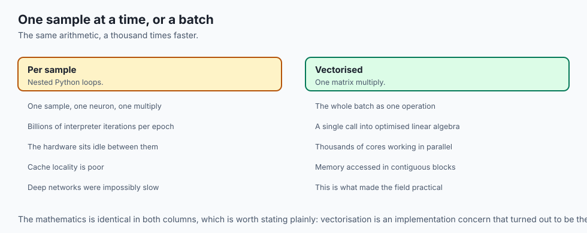

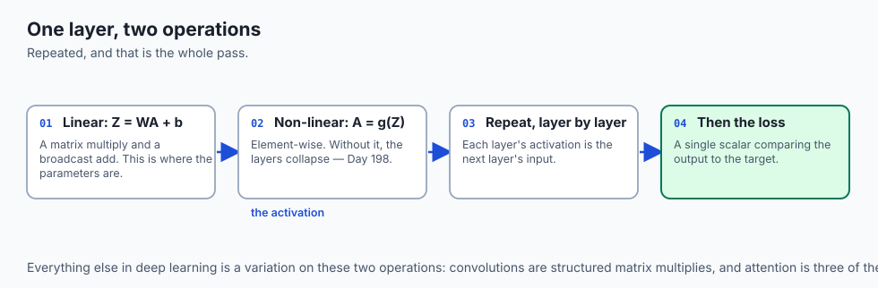

Imagine an assembly line in an automotive manufacturing plant:

- **Station 0 (Input X):** Raw steel sheets and bolts arrive at the loading dock.
- **Station 1 (Hidden Layer 1):** Robotic arms stamp the steel into a chassis frame (`Z^[1] = W^[1] X + b^[1]`), and quality control welds the seams (`A^[1] = ReLU(Z^[1])`).
- **Station 2 (Hidden Layer 2):** Assembly technicians install the engine, transmission, and wiring harness on top of the chassis (`Z^[2] = W^[2] A^[1] + b^[2]`), securing all connectors (`A^[2] = ReLU(Z^[2])`).
- **Station 3 (Output Layer):** Painting robots apply the exterior coat and sensors run a diagnostic test (`y_hat = Softmax(Z^[3])`).
- **Inspection Station (Loss Function):** Inspectors measure the vehicle against engineering blueprints (`Loss L(y_hat, y)`), recording exact millimeter deviations to calibrate the robots for the next shift.

In forward propagation, data flows in one direction from input to output, with each layer transforming raw numbers into increasingly rich, abstract representations.

---

## Historical background

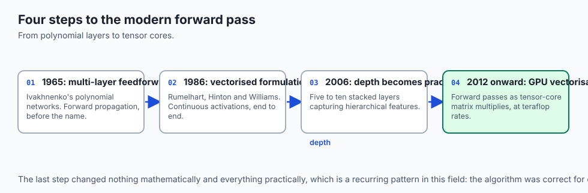

1. **1965 (Alexey Ivakhnenko):** Published the *Group Method of Data Handling (GMDH)*, demonstrating the first working multi-layer feedforward polynomial networks with forward polynomial propagation.
2. **1986 (David Rumelhart, Geoffrey Hinton, Ronald Williams):** Formalized modern vectorized forward and backward propagation in multi-layer perceptrons, proving how continuous activations enable end-to-end representation learning.
3. **2006 (Geoffrey Hinton, Ruslan Salakhutdinov):** Introduced Deep Autoencoders and Deep Belief Networks, demonstrating that deep architectures with 5 to 10 stacked forward layers capture superior hierarchical feature manifolds.
4. **2012–Present (The GPU Vectorization Era):** Deep learning frameworks (PyTorch, TensorFlow, JAX) optimized forward propagation on CUDA Tensor Cores, executing billions of floating-point operations per second (TFLOPS) on mini-batch matrices.

---

## What it is — and what it is not

### What Forward Propagation IS:
- **A Deterministic Composite Function:** Computing the composite mathematical function `y_hat = f_L(W_L * ... * f_1(W_1 * x + b_1) ... + b_L)`.
- **A Vectorized Batch Operation:** Processing hundreds or thousands of input samples simultaneously using 2D matrix-matrix multiplications.
- **A State-Caching Pass:** Recording intermediate activations `A^[l]` and pre-activations `Z^[l]` in memory for downstream backpropagation.

### What it is NOT:
- **Not Model Training:** Forward propagation only computes predictions and loss; it does not update weights or optimize parameters (that occurs during Backward Propagation and Optimizer Steps).
- **Not Recurrent Loopback:** In standard feedforward networks, activations flow strictly forward from layer `l-1` to layer `l` without cycles or feedback connections.

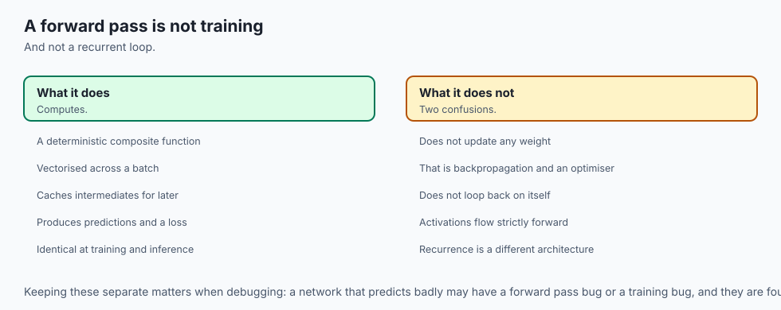

---

## Why it was created and what problems it solves

Early neural network implementations in the 1960s and 1970s processed samples one at a time using nested `for` loops in CPU memory. For a dataset with 50,000 images and 1,000 neurons, running a single training epoch required billions of individual scalar loop iterations, making deep networks impossibly slow to compute.

Vectorized Forward Propagation solved this bottleneck by restructuring all sample operations into **BLAS (Basic Linear Algebra Subprograms) Level 3 GEMM (General Matrix Multiply)** operations:

- A single GPU call multiplies the entire batch matrix `X in R^{D x M}` against weight matrix `W in R^{H x D}` in parallel across thousands of hardware ALU cores.

---

## How it works

Let us dissect the mathematical formulation of multi-layer networks, strict matrix dimension contracts, activation caching, and loss calculation.

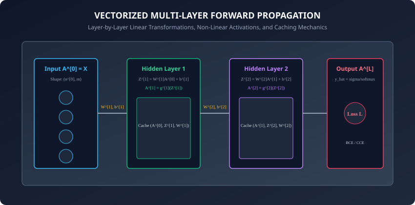

---

### 1. Mathematical Notation and Conventions

We adopt standard Deep Learning notation for an L-layer network:

- `L`: Total number of layers (excluding input layer `l = 0`).
- `n^[l]`: Number of neurons in layer `l` (e.g., `n^[0] = 784`, `n^[1] = 128`, `n^[2] = 64`, `n^[3] = 10`).
- `m`: Mini-batch size (number of training examples processed simultaneously).
- `W^[l]`: Weight matrix connecting layer `l-1` to layer `l`.
- `b^[l]`: Bias vector for layer `l`.
- `Z^[l]`: Linear pre-activation matrix for layer `l`.
- `A^[l]`: Non-linear activation matrix for layer `l` (with `A^[0] = X`).
- `g^[l]`: Activation function applied at layer `l` (e.g., ReLU, Tanh, Softmax).

---

### 2. Strict Matrix Dimension Contracts

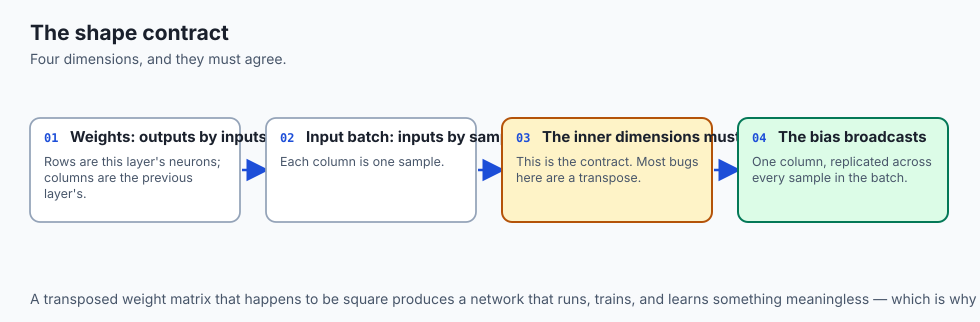

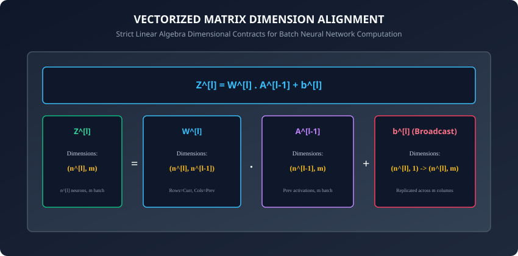

In vectorized forward propagation with `m` samples in column-vector orientation:

```
┌────────────────────────────────────────────────────────────────────────┐
│               FORWARD PROPAGATION DIMENSIONAL CONTRACT                 │
├───────────────────┼────────────────────────────┼───────────────────────┤
│ Variable / Tensor │ Notation                   │ Matrix Shape          │
├───────────────────┼────────────────────────────┼───────────────────────┤
│ Input Features X  │ A^[0]                      │ (n^[0], m)            │
│ Weight Matrix     │ W^[l]                      │ (n^[l], n^[l-1])      │
│ Bias Vector       │ b^[l]                      │ (n^[l], 1)            │
│ Linear Combo      │ Z^[l] = W^[l] A^[l-1] + b  │ (n^[l], m)            │
│ Activation Matrix │ A^[l] = g^[l](Z^[l])       │ (n^[l], m)            │
│ Output Prediction │ A^[L] = y_hat              │ (n^[L], m)            │
│ Ground Truth      │ Y                          │ (n^[L], m)            │
└───────────────────┴────────────────────────────┴───────────────────────┘
```

#### Verification of Matrix Multiplication:
```
(n^[l], n^[l-1])  x  (n^[l-1], m)  =  (n^[l], m)
     [W^[l]]            [A^[l-1]]         [Z^[l]]
```
The inner dimensions `n^[l-1]` match perfectly. Adding `b^[l]` of shape `(n^[l], 1)` utilizes NumPy broadcasting to replicate the column vector across all `m` columns.

---

### 3. Layer-by-Layer Propagation Equations

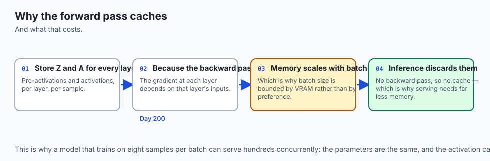

For an arbitrary L-layer neural network:

#### Initialization:
```
A^[0] = X
```

#### For each hidden layer l = 1, 2, ..., L-1:
```
Z^[l] = np.dot(W^[l], A^[l-1]) + b^[l]
A^[l] = g^[l](Z^[l])
Cache^[l] = (A^[l-1], Z^[l], W^[l], b^[l])
```

#### Output Layer L (Multi-Class Classification):
```
Z^[L] = np.dot(W^[L], A^[L-1]) + b^[L]
A^[L] = Softmax(Z^[L])
Cache^[L] = (A^[L-1], Z^[L], W^[L], b^[L])
```

---

### 4. Loss Function Computation

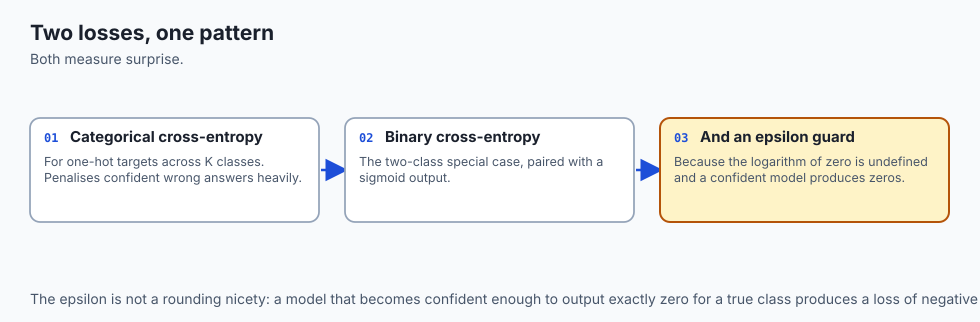

Once the network computes output predictions `A^[L] in R^{K x m}`, we evaluate the scalar empirical risk (loss) across all `m` mini-batch samples:

#### A. Categorical Cross-Entropy (CCE) Loss (Multi-Class):
For one-hot encoded ground truth `Y in {0, 1}^{K x m}`:
```
Loss(A^[L], Y) = - (1 / m) * sum_{i=1}^m sum_{k=1}^K Y_{k, i} * ln(A^[L]_{k, i} + eps)
```
where `eps = 1e-15` prevents `ln(0)` domain errors.

#### B. Binary Cross-Entropy (BCE) Loss (Binary Classification, K=1):
```
Loss(A^[L], Y) = - (1 / m) * sum_{i=1}^m [ Y_i * ln(A^[L]_i + eps) + (1 - Y_i) * ln(1 - A^[L]_i + eps) ]
```

#### C. Mean Squared Error (MSE) Loss (Regression):
```
Loss(A^[L], Y) = (1 / (2 * m)) * sum_{i=1}^m || A^[L]_i - Y_i ||^2
```

---

### 5. Tensor Orientation Conventions: Column-Major vs Row-Major in Practice

A frequent source of bugs and cognitive friction when moving between theoretical literature and industrial deep learning frameworks is **tensor orientation**:

#### A. Column-Vector Orientation (Andrew Ng / Theoretical Literature Convention):
- Input matrix `X` has shape `(n^[0], m)`: rows correspond to feature dimensions and columns correspond to individual training samples.
- Layer equation: `Z^[l] = W^[l] * A^[l-1] + b^[l]`.
- Weight matrix `W^[l]` has shape `(n^[l], n^[l-1])`.
- Advantage: Direct alignment with classic linear algebra textbooks where vectors are vertical column matrices.

#### B. Row-Vector Orientation (PyTorch, TensorFlow, JAX Convention):
- Input matrix `X` has shape `(m, n^[0])`: rows correspond to batch samples and columns correspond to feature channels.
- Layer equation: `Z^[l] = A^[l-1] * (W^[l])^T + b^[l]` (or `X * W` where `W` is pre-transposed).
- Weight matrix `W` has shape `(n^[l-1], n^[l])`.
- Advantage: Seamless streaming memory access where adjacent elements of a sample are contiguous in C-order memory buffers.

#### C. GEMM Hardware Acceleration and Memory Strides:
When modern GPU tensor cores execute a forward layer:

- The computation is compiled into a single optimized **General Matrix Multiply (GEMM)** kernel call: `C = alpha * A * B + beta * C`.
- By aligning mini-batch sizes to multiples of 32 (warp size on NVIDIA GPUs) or 64 (wavefront on AMD GPUs), hardware memory controllers achieve coalesced memory reads, saturating DRAM bandwidth and computing trillions of floating-point operations per second.

By understanding both column-vector mathematical derivations and row-vector framework conventions, you can effortlessly translate research papers into production deep learning code across any framework or hardware runtime.

---

## An everyday analogy

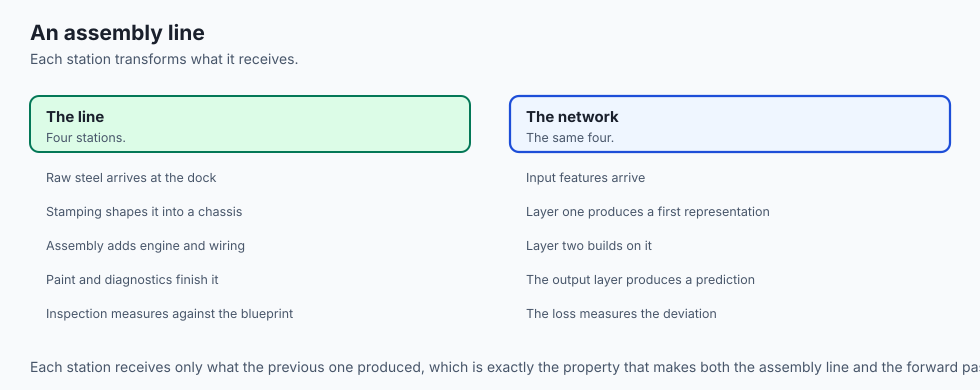

Think of a package moving through an automated postal sorting facility:

- **Input X:** 10,000 parcels enter the facility on main conveyor belts.
- **Scanner 1 (Layer 1):** Optical cameras read the destination ZIP codes and route parcels onto 10 regional chutes (`Z^[1]`, `A^[1]`).
- **Scanner 2 (Layer 2):** Sub-scanners sort parcels by street number and carrier route (`Z^[2]`, `A^[2]`).
- **Output (Layer 3):** Delivery vans receive parcels arranged in delivery sequence (`y_hat`).
- **Quality Audit (Loss):** Supervisors compare delivery addresses against parcel tracking logs to compute routing accuracy.

If a scanner barcode reader is miscalibrated (`W^[l]`), parcels get sorted into the wrong bin, producing high loss that triggers calibration adjustments.

---

## Examples in practice

Let us inspect a modular, object-oriented implementation of an L-Layer Forward Propagation network in pure NumPy:

```python
import numpy as np
from typing import List, Tuple, Dict, Any

class DenseLayer:
    def __init__(self, in_features: int, out_features: int, activation: str = "relu"):
        # He initialization for ReLU
        limit = np.sqrt(2.0 / in_features) if activation == "relu" else np.sqrt(1.0 / in_features)
        self.W = np.random.randn(out_features, in_features) * limit
        self.b = np.zeros((out_features, 1))
        self.activation = activation

    def forward(self, A_prev: np.ndarray) -> Tuple[np.ndarray, Dict[str, np.ndarray]]:
        Z = np.dot(self.W, A_prev) + self.b

        if self.activation == "relu":
            A = np.maximum(0.0, Z)
        elif self.activation == "sigmoid":
            A = np.where(Z >= 0, 1.0 / (1.0 + np.exp(-Z)), np.exp(Z) / (1.0 + np.exp(Z)))
        elif self.activation == "softmax":
            Z_shift = Z - np.max(Z, axis=0, keepdims=True)
            exp_Z = np.exp(Z_shift)
            A = exp_Z / np.sum(exp_Z, axis=0, keepdims=True)
        else:
            A = Z # Linear

        cache = {"A_prev": A_prev, "Z": Z, "W": self.W, "b": self.b}
        return A, cache

class MultiLayerNetwork:
    def __init__(self, layer_dims: List[int], activations: List[str]):
        self.layers = []
        for i in range(len(layer_dims) - 1):
            self.layers.append(DenseLayer(layer_dims[i], layer_dims[i+1], activations[i]))

    def forward(self, X: np.ndarray) -> Tuple[np.ndarray, List[Dict[str, np.ndarray]]]:
        A = X
        caches = []
        for layer in self.layers:
            A, cache = layer.forward(A)
            caches.append(cache)
        return A, caches

    @staticmethod
    def compute_categorical_crossentropy(A_last: np.ndarray, Y_onehot: np.ndarray) -> float:
        m = Y_onehot.shape[1]
        eps = 1e-15
        loss = - (1.0 / m) * np.sum(Y_onehot * np.log(A_last + eps))
        return float(loss)
```

---

## Implications: security, privacy, performance, scalability, and cost

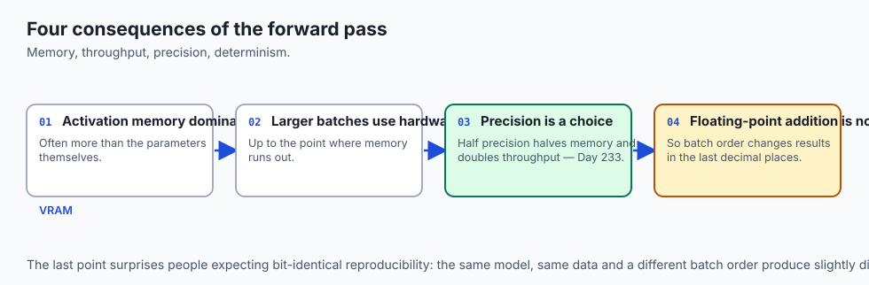

1. **Memory Allocation for Activation Caching:**
   - In deep networks (e.g. 100+ layers), caching `A^[l]` and `Z^[l]` for large batch sizes consumes gigabytes of VRAM.
   - Modern frameworks use **Activation Checkpointing (Gradient Checkpointing)**: discarding intermediate activations during forward pass and recomputing them on-demand during backprop to reduce memory by 75%.
2. **Cache Locality and GEMM Optimization:**
   - Aligning tensor dimensions to multiples of 8 or 16 (e.g. batch size 64, hidden dimension 512) maximizes hardware cache line utilization and Tensor Core matrix execution.

---

## Alternatives: free, open source, and commercial

| Framework / Architecture | Forward Execution Mode | Memory Management | Primary Platform |
| :--- | :--- | :--- | :--- |
| **Pure NumPy** | CPU Synchronous | Manual Array Caching | Education, Prototyping, Embedded |
| **PyTorch (`torch.nn`)** | Dynamic Eager Graph | Autograd Tape Caching | Research, Production Deep Learning |
| **JAX (`jax.lax`)** | Functional XLA JIT | Pure Functional Trace | Large Scale ML, Scientific AI |
| **TensorRT / ONNX Runtime**| Graph-Fused Engine | Fixed Memory Arena | Low-Latency Production Serving |

---

## Comparison with related concepts

```
┌────────────────────────────────────────────────────────────────────────┐
│                   FORWARD PASS EXECUTION PATTERNS                      │
├────────────────────┼───────────────────────┼───────────────────────────┤
│ Execution Strategy │ Advantages            │ Trade-offs                │
├────────────────────┼───────────────────────┼───────────────────────────┤
│ Per-Sample Loop    │ Low memory footprint  │ 100x slower (CPU bound)   │
│ Mini-Batch GEMM    │ Massive GPU parallelism│ Requires VRAM for caches  │
│ Checkpointed Batch │ Minimal VRAM footprint│ 20% slower (recomputation)│
│ Graph-Fused Engine │ Ultra-low latency     │ Static graph constraints  │
└────────────────────┴───────────────────────┴───────────────────────────┘
```

---

## When to use it — and when not to

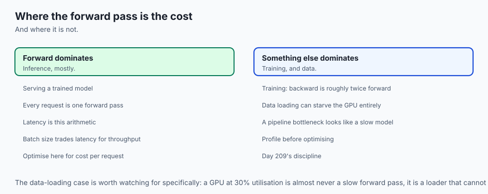

### When to USE Multi-Layer Forward Propagation:
- Inference and prediction on trained neural networks.
- The forward evaluation phase of supervised, unsupervised, and reinforcement learning loops.

### When NOT to use it:
- Simple linear datasets where closed-form linear regression or logistic regression provides identical results with lower latency.
- Tabular datasets with small sample sizes (< 1,000 rows) where GBDTs (XGBoost/LightGBM) outperform deep networks.

---

## The AI connection

- **Inference is a forward pass**, so everything you will later measure as latency or
  cost is the arithmetic in this lesson, executed once per request.
- **Vectorisation is what makes deep learning possible at all** — a batch as one matrix
  multiply is the difference between a GPU running at capacity and a Python loop.
- **The cached activations are why training needs so much memory.** Every intermediate
  result is kept for the backward pass, which is why batch size is bounded by VRAM.
- **The same forward code serves training and inference**, which is why a model that is
  fast to train is usually fast to serve.
- **Matrix shape contracts are where most bugs live.** A transposed weight matrix
  produces a runnable network that learns nothing recognisable.

## Knowledge check

1. What are the exact matrix dimensions of weight matrix `W^[l]` and bias vector `b^[l]` in a layer with `n^[l]` neurons receiving `n^[l-1]` inputs?
2. Why is activation caching strictly required during the forward pass of a trainable network?
3. How does NumPy broadcasting handle vector bias addition `Z^[l] = W^[l] A^[l-1] + b^[l]`?
4. What is the mathematical formulation of Categorical Cross-Entropy loss for mini-batch training?
5. How does Activation Checkpointing trade computational time for GPU memory efficiency?

---

## Hands-on exercise

In this lab, you will build a vectorized `MultiLayerNetwork` forward propagation engine in pure NumPy: construct a 3-layer architecture `[784, 128, 64, 10]`, execute forward propagation across mini-batches, verify exact tensor shapes and activation caches, and compute numerically stable Categorical Cross-Entropy loss.

### Expected output
```
[Forward Propagation Engine]
Constructing 3-Layer Network Architecture [784 -> 128 (ReLU) -> 64 (ReLU) -> 10 (Softmax)]
Executing Mini-Batch Forward Pass (Batch Size m = 64):
  Input Shape A^[0]:      (784, 64)
  Hidden 1 Shape A^[1]:   (128, 64) [Cached Z^[1], W^[1]]
  Hidden 2 Shape A^[2]:   (64, 64)  [Cached Z^[2], W^[2]]
  Output Shape A^[3]:     (10, 64)  [Probabilities Sum = 1.0000]
Evaluating Initial Categorical Cross-Entropy Loss:
  CCE Loss on Random Weights: 2.3026 [EXPECTED ln(10)]
Test Suite: 3 passed in 0.09s
```

### Validate your work
Run the automated test runner:
```bash
./tests/run_tests.sh
```

### Troubleshooting
- If matrix multiplication errors occur, verify that input matrices are transposed to `(features, batch_size)` format.
- Ensure Softmax sums to 1.0 across `axis=0` when samples are columns.

### Common mistakes
- **Inverted Dimensions:** Initializing `W^[l]` with shape `(n^[l-1], n^[l])` instead of `(n^[l], n^[l-1])`.

---

## Practice assignment

1. Implement **Binary Cross-Entropy (BCE)** forward evaluation and compare output probabilities against ground-truth binary targets.
2. Build an inference benchmark comparing the latency of single-sample loops vs mini-batch matrix multiplication across batch sizes `m in [1, 16, 64, 256, 1024]`.

---

## Extension challenge

Implement a **Forward Pass with Dropout Regularization**:

- For each hidden layer, generate a binary inverted dropout mask `D^[l] ~ Bernoulli(p_keep) / p_keep`.
- Apply elementwise mask `A^[l] = A^[l] * D^[l]` during training forward pass.
- Cache the dropout mask in `Cache^[l]` for use during backpropagation.
