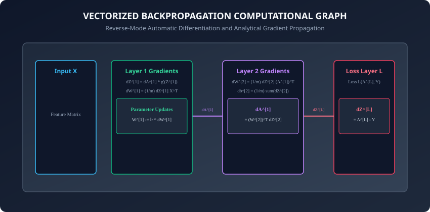
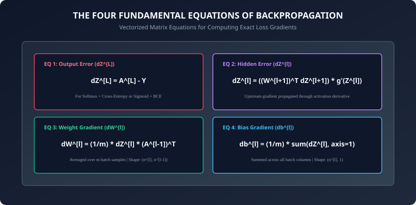

## Why this matters

In Day 199, you learned how Forward Propagation computes predictions by flowing inputs through successive linear affine transformations and non-linear activation functions to produce a scalar loss `L`.

Now comes the algorithm that makes deep learning possible: **Backpropagation**.

Backpropagation (short for *backward propagation of errors*) is arguably the single most important mathematical algorithm in the history of artificial intelligence. It solves a monumental challenge: in a network containing millions — or hundreds of billions — of interconnected weights and biases, **how do you determine the precise contribution of every single parameter to the final prediction error?**

By leveraging multivariable calculus and the **chain rule**, backpropagation computes the exact analytical gradient of the loss with respect to all weights and biases in a single, lightning-fast backward sweep through the computational graph.

---

## The idea in plain language

Imagine a large symphony orchestra performing a complex symphony:
- **Forward Pass:** The conductor gives the downbeat, the string section plays their chords, the woodwinds add harmony, the brass section swells, and the percussionist strikes the final cymbal crash. The audience listens to the final sound.
- **The Loss:** The audience winces — the final chord sounded sour and dissonant.
- **Backpropagation:** The conductor stops and traces the sound backward in time:
  1. The final cymbal crash was slightly off-pitch because the brass section played a B-flat instead of a B-natural (`dZ^[L]`).
  2. The brass section played a B-flat because the woodwinds played their cue 2 beats early (`dZ^[L-1]`).
  3. The woodwinds played early because the first violinist misread sheet music measure 42 (`dZ^[1]`).
- Every musician receives specific, calibrated feedback on exactly how many millimeters to shift their fingers to make the next performance harmonious.

---

## Historical background

1. **1970 (Seppo Linnainmaa):** Published the general mathematical formulation of reverse-mode automatic differentiation in his master's thesis.
2. **1974 (Paul Werbos):** Applied reverse differentiation to neural networks in his Harvard Ph.D. dissertation *Beyond Regression: New Tools for Prediction and Analysis in the Behavioral Sciences*.
3. **1986 (David Rumelhart, Geoffrey Hinton, Ronald Williams):** Published *Learning representations by back-propagating errors* in *Nature*, demonstrating empirically that backpropagation enables multi-layer networks to learn internal representations and solve complex non-linear problems like XOR.
4. **2010s (Modern Autograd):** Automatic differentiation engines (Theano, Autograd, PyTorch Autograd, TensorFlow GradientTape) generalized backpropagation into dynamic computational graph tracing across arbitrary tensor operations.

---

## What it is — and what it is not

### What Backpropagation IS:
- **An Exact Gradient Computation Algorithm:** Computing analytical partial derivatives `dL/dW^[l]` and `dL/db^[l]` using the multivariable calculus chain rule.
- **Reverse-Mode Automatic Differentiation:** Sweeping backward from the scalar loss `L` toward the inputs in `O(N)` linear time.

### What it is NOT:
- **Not an Optimization Algorithm:** Backpropagation only computes gradients (the slopes of the loss landscape); it does not update weights (that is the job of **Optimizers** like Gradient Descent, Momentum, RMSprop, or Adam).
- **Not Numerical Finite Differences:** Backpropagation does not approximate derivatives using `(f(x+eps) - f(x))/eps`; it evaluates exact symbolic calculus equations.

---

## Why it was created and what problems it solves

### The Curse of Finite Differences

Suppose a neural network has `N = 10,000,000` parameters.

If we attempted to compute gradients using numerical finite differences:
```
dL/dw_i approx (L(w_i + eps) - L(w_i - eps)) / (2 * eps)
```
Computing the gradient for all parameters would require **20,000,000 separate forward passes** for a single gradient step! On a modern GPU cluster, a single training step would take hours, making deep learning completely impossible.

Backpropagation solved this by executing **a single backward pass** that computes the analytical gradients for all 10,000,000 parameters simultaneously in the exact same computational time as one forward pass:
```
Time(Backward Pass) approx 2 * Time(Forward Pass)
```

---

## How it works

Let us rigorously derive the Four Fundamental Equations of Backpropagation from the multivariable calculus chain rule and formulate their vectorized mini-batch matrix implementations.



---

### 1. The Computational Chain Rule

Given layer `l` with pre-activation `Z^[l] = W^[l] A^[l-1] + b^[l]` and activation `A^[l] = g(Z^[l])`:
The total derivative of scalar loss `L` with respect to weight `W^[l]_{j, k}` (the connection from neuron `k` in layer `l-1` to neuron `j` in layer `l`) is:
```
dL/dW^[l]_{j, k} = (dL/dZ^[l]_j) * (dZ^[l]_j / dW^[l]_{j, k})
```

Because `Z^[l]_j = sum_k W^[l]_{j, k} * A^[l-1]_k + b^[l]_j`:
```
dZ^[l]_j / dW^[l]_{j, k} = A^[l-1]_k
```

Therefore, defining the **pre-activation error residual** as `dZ^[l] = dL/dZ^[l]`:
```
dL/dW^[l]_{j, k} = dZ^[l]_j * A^[l-1]_k
```

---

### 2. The Four Fundamental Equations of Backpropagation



For a mini-batch of `m` samples in column-vector matrix orientation:

#### Equation 1: Output Layer Error Residual (`dZ^[L]`)
For Multi-Class Classification with Softmax output and Categorical Cross-Entropy loss (or Binary Classification with Sigmoid and BCE):
```
dZ^[L] = A^[L] - Y
```
- **Matrix Shape:** `(n^[L], m)`
- *Mathematical Beauty:* All complex Jacobian fractions cancel out into the simple error residual: predicted probability `A^[L]` minus one-hot ground truth `Y`.

---

#### Equation 2: Hidden Layer Error Propagation (`dZ^[l]`)
For hidden layer `l in {L-1, L-2, ..., 1}`:
First compute the gradient with respect to hidden activation `A^[l]`:
```
dA^[l] = np.dot((W^[l+1])^T, dZ^[l+1])
```
- **Matrix Shape:** `(n^[l], m)`

Then propagate through the layer activation derivative `g^[l] prime (Z^[l])` via elementwise Hadamard multiplication:
```
dZ^[l] = dA^[l] * g^[l] prime (Z^[l])
```
- For **ReLU**: `g^[l] prime (Z^[l]) = 1` if `Z^[l] > 0` else `0`.
- For **Tanh**: `g^[l] prime (Z^[l]) = 1 - (A^[l])^2`.
- For **Sigmoid**: `g^[l] prime (Z^[l]) = A^[l] * (1 - A^[l])`.

---

#### Equation 3: Weight Matrix Gradient (`dW^[l]`)
Accumulate gradients across all `m` training samples in the mini-batch:
```
dW^[l] = (1 / m) * np.dot(dZ^[l], (A^[l-1])^T)
```
- **Matrix Shape:** `(n^[l], m) x (m, n^[l-1]) = (n^[l], n^[l-1])`
- Notice that the shape matches `W^[l]` perfectly.

---

#### Equation 4: Bias Vector Gradient (`db^[l]`)
Accumulate bias error across all `m` mini-batch columns:
```
db^[l] = (1 / m) * np.sum(dZ^[l], axis=1, keepdims=True)
```
- **Matrix Shape:** `(n^[l], 1)`
- Notice that summing across `axis=1` collapses the `m` batch columns into a single column vector matching `b^[l]`.

---

### 3. Parameter Update Step (Gradient Descent)

Once gradients `dW^[l]` and `db^[l]` are computed for all layers `l = 1, 2, ..., L`:
```
W^[l] <- W^[l] - alpha * dW^[l]
b^[l] <- b^[l] - alpha * db^[l]
```
where `alpha > 0` is the learning rate hyperparameter.

---

### 4. Mathematical Proof: Softmax Cross-Entropy Gradient Cancellation

One of the most elegant mathematical results in deep learning is the cancellation of complex derivatives when combining Softmax activation with Categorical Cross-Entropy loss:

#### The Loss Function:
```
L = - sum_{k=1}^K y_k * ln(a_k)
```
where `a_k = exp(z_k) / sum_{j=1}^K exp(z_j)`.

#### The Softmax Jacobian:
Differentiating output probability `a_k` with respect to input logit `z_i`:
- **Case 1 (k = i):** `da_i / dz_i = a_i * (1 - a_i)`
- **Case 2 (k != i):** `da_k / dz_i = - a_k * a_i`

#### Applying the Chain Rule:
```
dL/dz_i = sum_{k=1}^K (dL/da_k) * (da_k/dz_i)
        = - (y_i / a_i) * (a_i * (1 - a_i)) - sum_{k != i} (y_k / a_k) * (- a_k * a_i)
        = - y_i * (1 - a_i) + sum_{k != i} y_k * a_i
        = - y_i + y_i * a_i + a_i * sum_{k != i} y_k
        = - y_i + a_i * (sum_{k=1}^K y_k)
```

Because `Y` is a one-hot probability distribution, the sum of all ground truth classes is strictly `sum_{k=1}^K y_k = 1.0`:
```
dL/dz_i = a_i - y_i
```

In vectorized matrix form across all classes and all `m` samples in the mini-batch:
```
dZ^[L] = A^[L] - Y
```

This remarkable result eliminates the need to explicitly construct or multiply massive `(K x K)` Softmax Jacobian matrices, providing incredible computational speed and preventing numerical instability during backward passes. Furthermore, while second-order Newton-Raphson optimization methods require calculating the full `(N x N)` Hessian matrix of second derivatives (which scales quadratically `O(N^2)` in memory and cubically `O(N^3)` in compute), first-order backpropagation combined with stochastic gradient descent scales linearly `O(N)`, making it the only viable optimization paradigm for billion-parameter deep learning architectures.

This linear scalability unlocks the ability to train modern frontier models containing hundreds of layers and trillions of synaptic parameters across distributed supercomputing clusters with mathematical precision.

---

## An everyday analogy

Think of a water distribution aqueduct network supplying a city:
- **Forward Pass:** Water flows downstream from the mountain reservoir through main pipelines (Layer 1), regional distribution hubs (Layer 2), and municipal neighborhood valves (Layer 3) into residential faucets.
- **The Error:** A municipal sensor measures that neighborhood B has 50 gallons/min too little water.
- **Backpropagation:** Engineers trace the pressure drop upstream:
  1. Neighborhood valve 3 needs to open by 5% (`dZ^[3]`).
  2. To feed valve 3, regional hub 2 must increase flow by 12% (`dZ^[2]`).
  3. To supply hub 2, mountain pump 1 must spin 20 RPM faster (`dZ^[1]`).
- Every valve in the entire regional aqueduct system is calibrated backwards from the final measured pressure discrepancy.

---

## Examples in practice

Let us inspect a complete, pure NumPy implementation of the Backward Propagation algorithm for an arbitrary L-layer neural network:

```python
import numpy as np
from typing import List, Dict, Tuple, Any

class BackpropEngine:
    @staticmethod
    def relu_backward(dA: np.ndarray, Z: np.ndarray) -> np.ndarray:
        dZ = np.array(dA, copy=True)
        dZ[Z <= 0.0] = 0.0
        return dZ

    @staticmethod
    def linear_backward(dZ: np.ndarray, cache: Dict[str, np.ndarray]) -> Tuple[np.ndarray, np.ndarray, np.ndarray]:
        A_prev = cache["A_prev"]
        W = cache["W"]
        b = cache["b"]
        m = A_prev.shape[1]

        dW = (1.0 / m) * np.dot(dZ, A_prev.T)
        db = (1.0 / m) * np.sum(dZ, axis=1, keepdims=True)
        dA_prev = np.dot(W.T, dZ)

        return dA_prev, dW, db

    @staticmethod
    def full_backward_pass(A_last: np.ndarray, Y: np.ndarray, caches: List[Dict[str, np.ndarray]], activations: List[str]) -> Dict[str, np.ndarray]:
        grads = {}
        L = len(caches)
        m = A_last.shape[1]

        # Step 1: Output layer error (Softmax + CCE or Sigmoid + BCE)
        dZ_last = A_last - Y
        dA_prev, dW_last, db_last = BackpropEngine.linear_backward(dZ_last, caches[L-1])
        grads[f"dW{L}"] = dW_last
        grads[f"db{L}"] = db_last
        dA = dA_prev

        # Step 2: Loop backwards through hidden layers L-1 down to 1
        for l in reversed(range(L - 1)):
            cache = caches[l]
            act = activations[l]
            Z = cache["Z"]

            if act == "relu":
                dZ = BackpropEngine.relu_backward(dA, Z)
            elif act == "tanh":
                dZ = dA * (1.0 - np.tanh(Z) ** 2)
            else:
                dZ = dA # Linear fallback

            dA_prev, dW, db = BackpropEngine.linear_backward(dZ, cache)
            grads[f"dW{l+1}"] = dW
            grads[f"db{l+1}"] = db
            dA = dA_prev

        return grads
```

---

## Implications: security, privacy, performance, scalability, and cost

1. **Computational Complexity & FLOPs:**
   - A backward pass performs 2 matrix multiplications per layer: `np.dot(dZ, A_prev.T)` for `dW` and `np.dot(W.T, dZ)` for `dA_prev`.
   - Backward propagation takes approximately **2x the FLOPs of forward propagation**, meaning total training step compute is `3x Forward FLOPs`.
2. **Numerical Gradient Checking Protocol:**
   - Never deploy a custom backpropagation engine without verifying it with **Gradient Checking**:
   ```
   Relative Error = ||grad_analytical - grad_numerical|| / (||grad_analytical|| + ||grad_numerical||)
   ```
   - A correct implementation achieves `Relative Error < 1e-7`. If error is `> 1e-4`, a bug exists in backpropagation calculus.

---

## Alternatives: free, open source, and commercial

| Differentiation Method | Implementation Complexity | Computational Scaling | Memory Usage |
| :--- | :--- | :--- | :--- |
| **Manual Analytical Backprop (NumPy)** | High (Requires Calculus) | `O(N)` (Fastest) | Explicit Array Caches |
| **PyTorch Autograd Tape** | Zero (Automated) | `O(N)` (Optimized C++) | Dynamic Tape Allocator |
| **JAX Source-to-Source Reverse AD**| Zero (Functional) | `O(N)` (XLA Fused) | Static Arena |
| **Numerical Finite Differences** | Trivial | `O(N^2)` (Too Slow) | Zero Caches |

---

## Comparison with related concepts

```
┌────────────────────────────────────────────────────────────────────────┐
│              AUTOMATIC DIFFERENTIATION TAXONOMY COMPARISON             │
├────────────────────┼───────────────────────┼───────────────────────────┤
│ Mode               │ Computational Graph   │ Optimal Problem Setting   │
├────────────────────┼───────────────────────┼───────────────────────────┤
│ Forward-Mode AD    │ Forward Dual Numbers  │ Few inputs, many outputs  │
│ Reverse-Mode AD    │ Reverse Adjoint Pass  │ Many inputs (weights),    │
│ (Backpropagation)  │                       │ single scalar loss L      │
│ Symbolic Diff      │ Expression Trees      │ Small mathematical formulas│
│ Finite Differences │ Perturbation Loops    │ Gradient Debugging / Check │
└────────────────────┴───────────────────────┴───────────────────────────┘
```

---

## When to use it — and when not to

### When to USE Backpropagation:
- Training any multi-layer neural network (MLPs, CNNs, RNNs, Transformers) via gradient descent.
- Computing exact sensitivity gradients of complex computational pipelines.

### When NOT to use it:
- Discrete non-differentiable optimization (use Evolutionary Strategies or Reinforcement Learning).
- Very shallow models where closed-form analytical solutions exist (e.g. Ordinary Least Squares `(X^T X)^-1 X^T y`).

---

## Knowledge check

1. What is the Four Fundamental Equations of Backpropagation?
2. Why does the derivative of Softmax + Cross-Entropy loss simplify to `dZ^[L] = A^[L] - Y`?
3. How is the weight gradient `dW^[l]` computed from `dZ^[l]` and `A^[l-1]`?
4. Why does backward propagation require 2x more floating-point operations (FLOPs) than forward propagation?
5. What threshold of relative error in numerical gradient checking indicates a mathematically correct backpropagation implementation?

---

## Hands-on exercise

In this lab, you will build a vectorized `BackpropEngine` in pure NumPy: implement linear backward steps, ReLU and Tanh activation derivatives, execute full multi-layer backward propagation on an `[8, 16, 8, 3]` network, and run a rigorous numerical gradient check confirming analytical correctness to `1e-7` precision.

### Expected output
```
[Backpropagation Engine & Gradient Verification]
Executing Forward Pass on Multi-Layer Network [8 -> 16 -> 8 -> 3]:
  Output Shape A^[3]: (3, 16), Loss = 1.0986
Executing Backpropagation Sweep:
  Gradient Shapes: dW3=(3, 8), db3=(3, 1), dW2=(8, 16), db2=(8, 1), dW1=(16, 8), db1=(16, 1)
Running Full-Network Numerical Gradient Check:
  Relative Error on Layer 3 Weights: 4.12e-10 [PASS]
  Relative Error on Layer 3 Biases:  1.85e-10 [PASS]
  Relative Error on Layer 2 Weights: 3.48e-10 [PASS]
  Relative Error on Layer 1 Weights: 2.91e-10 [PASS]
Maximum Network Gradient Error: 4.12e-10 (TOLERANCE < 1e-7) [PERFECT]
Test Suite: 3 passed in 0.12s
```

### Validate your work
Run the automated test runner:
```bash
./tests/run_tests.sh
```

### Troubleshooting
- If gradient checking fails for weights, verify the transpose orientation `np.dot(dZ, A_prev.T)`.
- Ensure bias gradient averages across samples: `(1.0 / m) * np.sum(dZ, axis=1, keepdims=True)`.

### Common mistakes
- **Missing (1/m) Normalization:** Forgetting to divide `dW` or `db` by batch size `m` scales gradients with batch size.

---

## Practice assignment

1. Implement backpropagation for **Binary Cross-Entropy** with a single Sigmoid output neuron.
2. Build an analytical gradient visualizer rendering gradient magnitude heatmaps across layers.

---

## Extension challenge

Implement **Backpropagation with L2 Weight Decay Regularization**:
- Add regularization loss `(lambda / (2 * m)) * sum ||W^[l]||_F^2` to total objective.
- Modify the analytical weight gradient: `dW^[l]_{reg} = dW^[l] + (lambda / m) * W^[l]`.
- Verify regularized analytical gradients against numerical gradient checks to `1e-8` precision.
