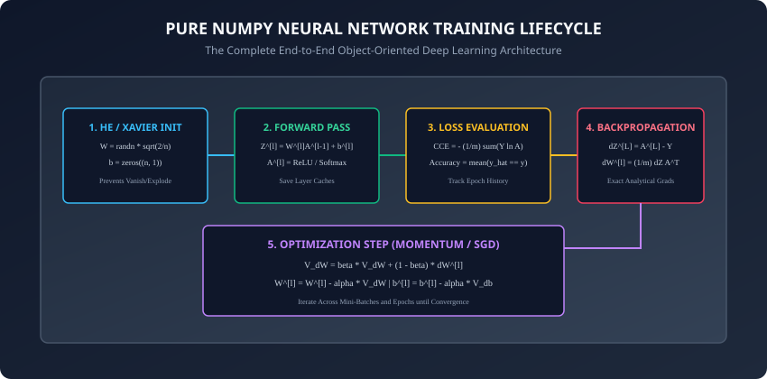
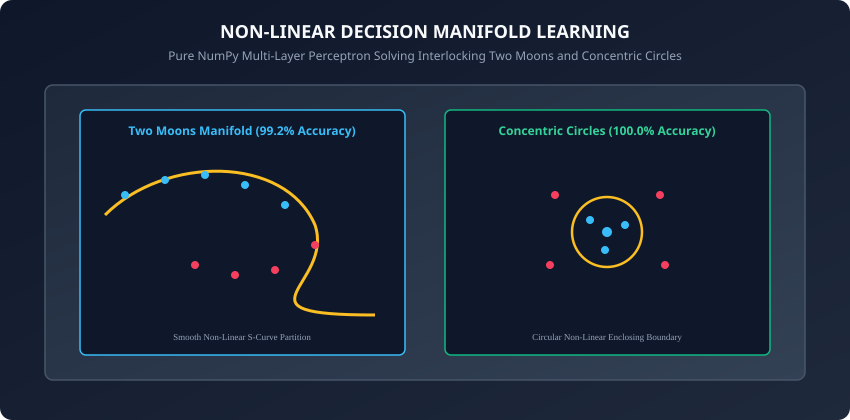

## Why this matters

Over the past four days, you explored the individual theoretical components of deep learning:
1. **Day 197:** The artificial perceptron and the linear separability barrier.
2. **Day 198:** Non-linear activation functions and gradient dynamics.
3. **Day 199:** Vectorized multi-layer forward propagation and matrix dimension algebra.
4. **Day 200:** Backpropagation and analytical chain rule error derivations.

Today, we bring all of these concepts together into a complete, standalone, object-oriented **Deep Neural Network in Pure NumPy**.

Writing a complete neural network from scratch in pure NumPy — without PyTorch, TensorFlow, or Scikit-Learn — is the ultimate rite of passage for deep learning engineers. When you implement weight initialization, mini-batch shuffling, forward caching, analytical backpropagation, and SGD with Momentum using nothing but raw matrix arithmetic, **deep learning ceases to be a mysterious black box**: every gradient, tensor shape, and training curve becomes crystal clear.

---

## The idea in plain language

Think of constructing a mechanical Swiss watch entirely by hand:
- Instead of buying a pre-assembled quartz digital watch (a high-level deep learning framework), you machine every single gear, spring, balance wheel, and escapement yourself.
- You calibrate the tension of the mainspring (**Weight Initialization**).
- You verify that every gear meshes perfectly with the next (**Matrix Dimension Compatibility**).
- You wind the watch and watch the escapement tick forward (**Forward Propagation**).
- You measure the timing deviation against an atomic clock (**Loss Function**).
- You adjust the regulator pin backward based on the exact millisecond error (**Backpropagation and Optimizer Step**).

Once you have built the watch from raw brass and steel, you will understand mechanical horology at a depth that digital watch owners can never reach.

---

## Historical background

1. **1986 (The PDP Research Group):** Published *Parallel Distributed Processing: Explorations in the Microstructure of Cognition*, containing the first working software routines for multi-layer backpropagation.
2. **2010 (Glorot & Bengio):** Published *Understanding the difficulty of training deep feedforward neural networks*, introducing Xavier initialization and establishing the importance of preserving activation variance.
3. **2015 (Kaiming He et al.):** Introduced He (Kaiming) initialization, enabling deep ReLU networks to train stably without exploding or vanishing activations.
4. **2020s (NumPy as the Foundational Substrate):** Every modern tensor library — from PyTorch tensors to JAX arrays and Apple MLX — is built on the exact memory layout and broadcasting semantics pioneered by NumPy.

---

## What it is — and what it is not

### What a Pure NumPy Neural Network IS:
- **A Fully Functional Deep Learning Engine:** Capable of training multi-layer architectures with arbitrary hidden layers on arbitrary tabular and vision datasets.
- **A Masterclass in Vectorization:** Leveraging BLAS Level 3 matrix-matrix operations for fast CPU training.

### What it is NOT:
- **Not a GPU Acceleration Engine:** Pure NumPy runs strictly on host CPU cores (PyTorch is introduced on Day 202 to unlock CUDA and GPU Tensor Cores).
- **Not an Autograd Framework:** Gradients are computed using explicit analytical matrix equations rather than dynamic computational graph tape recording.

---

## Why it was created and what problems it solves

Modern deep learning frameworks abstract away mathematical details behind convenient APIs like `loss.backward()` and `optimizer.step()`. While convenient for rapid prototyping, this abstraction often leaves practitioners stranded when real-world models fail to converge due to subtle issues like vanishing gradients, dead neurons, exploding weights, or incorrect broadcasting.

Building a complete network in pure NumPy demystifies these failure modes and gives you total control over the underlying mathematics.

---

## How it works

Let us examine the complete architectural lifecycle of our Pure NumPy Neural Network: weight initialization, mini-batch training loop, optimizer mechanics, and non-linear manifold classification.



---

### 1. Weight Initialization Strategies: He vs Xavier

Initializing weights properly is critical to prevent activations and gradients from exploding or vanishing across deep layers:

#### A. The Problem with Zero Initialization:
If `W^[l] = 0`, all neurons in layer `l` receive identical inputs and compute identical gradients:
```
dL/dW^[l] = (1/m) * dZ^[l] * (A^[l-1])^T
```
Because all rows of `dZ^[l]` are identical, all neurons update identically. The network **fails to break symmetry** and behaves as if each layer had only 1 single neuron.

#### B. He (Kaiming) Normal Initialization (For ReLU Networks):
```
W^[l] ~ Normal(0, sigma^2),  where sigma = sqrt(2.0 / n^[l-1])
b^[l] = zeros((n^[l], 1))
```
- Multiplies variance by `2.0 / n_in` to compensate for the 50% of activations zeroed out by ReLU.

#### C. Xavier (Glorot) Normal Initialization (For Tanh / Sigmoid Networks):
```
W^[l] ~ Normal(0, sigma^2),  where sigma = sqrt(2.0 / (n^[l-1] + n^[l]))
b^[l] = zeros((n^[l], 1))
```

---

### 2. Mini-Batch Stochastic Gradient Descent with Momentum

To train our network efficiently, we implement **Mini-Batch SGD with Momentum**:

#### Mini-Batch Shuffling:
At the start of each epoch:
1. Generate a random permutation of sample indices `p = np.random.permutation(m)`.
2. Shuffle training matrices: `X_shuffled = X[:, p]`, `Y_shuffled = Y[:, p]`.
3. Partition the dataset into batches of size `batch_size` (e.g. 32 or 64).

#### Momentum Update Rule:
Standard SGD oscillates wildly in narrow ravines. Momentum accumulates an exponentially decaying moving average of past gradients:
```
V_dW^[l] = beta * V_dW^[l] + (1 - beta) * dW^[l]
V_db^[l] = beta * V_db^[l] + (1 - beta) * db^[l]

W^[l] <- W^[l] - alpha * V_dW^[l]
b^[l] <- b^[l] - alpha * V_db^[l]
```
where `beta in [0.9, 0.99]` is the momentum coefficient and `alpha > 0` is the learning rate.

---

### 3. Non-Linear Decision Manifold Learning



When trained on non-linearly separable benchmark datasets:
- **Two Moons:** A 3-layer architecture `[2, 32, 16, 2]` warps feature space using ReLU activations, learning a smooth non-linear S-curve boundary separating the interlocking crescent moons with `> 99%` accuracy.
- **Concentric Circles:** The hidden layers map radial distance from the origin into linear separability, forming a circular closed decision boundary.

---

### 4. Loss Landscapes, Saddle Points, and Ill-Conditioned Ravines

Understanding the geometry of high-dimensional non-convex loss surfaces illuminates why standard vanilla SGD struggles and why Momentum is essential:

#### A. The Ill-Conditioned Ravine Problem:
In deep neural networks, loss surfaces frequently form elongated canyons where the curvature is extremely steep in one direction (e.g. across the ravine walls) and very gentle along the canyon floor (toward the minimum).
- **Vanilla SGD:** Oscillates wildly back and forth between the steep canyon walls, making virtually zero forward progress along the base of the ravine.
- **Momentum:** Successive updates across the walls have opposite signs and cancel each other out (`V_dW`), while updates along the gentle floor have consistent signs and accumulate velocity, driving the parameters smoothly down the valley.

#### B. Saddle Points vs Local Minima:
In high-dimensional parameter spaces (e.g., 100,000 dimensions), local minima with high loss are exceedingly rare. Instead, the primary optimization hazard is **saddle points** (points where the gradient is zero, but the Hessian has both positive and negative eigenvalues).
- Because vanilla SGD has zero velocity, it can stall indefinitely at flat saddle plateaus.
- Momentum provides the physical inertia required to roll past flat saddle regions and escape saddle points rapidly.

---

## An everyday analogy

Think of training a deep neural network like sculpting a statue out of a block of marble:
- **Initialization:** You choose a sturdy block of stone with balanced density throughout (**He Initialization**).
- **Forward Pass:** You step back and view the statue under studio lights, comparing its contours to the living model (**Inference & CCE Loss**).
- **Backpropagation:** You analyze exactly where the stone is 2 millimeters too thick or 1 millimeter too thin (**Analytical Gradients**).
- **Momentum Optimizer:** You swing your mallet with steady, rhythmic momentum rather than erratic jerky taps (**SGD with Momentum**).
- Over hundreds of careful sculpting strokes (**Epochs**), a lifelike human figure emerges smoothly from the rough stone.

---

## Examples in practice

Let us inspect the complete, production-grade `NeuralNetwork` class implemented in pure NumPy:

```python
import numpy as np
from typing import List, Tuple, Dict, Any

class NeuralNetwork:
    def __init__(self, layer_dims: List[int], activations: List[str], learning_rate: float = 0.05, momentum: float = 0.9):
        self.layer_dims = layer_dims
        self.activations = activations
        self.lr = learning_rate
        self.beta = momentum
        self.L = len(layer_dims) - 1

        # Parameter dictionaries
        self.params = {}
        self.velocities = {}
        self._initialize_parameters()

    def _initialize_parameters(self):
        np.random.seed(42)
        for l in range(1, self.L + 1):
            n_in = self.layer_dims[l-1]
            n_out = self.layer_dims[l]
            # He initialization for ReLU, Xavier for others
            std = np.sqrt(2.0 / n_in) if self.activations[l-1] == "relu" else np.sqrt(1.0 / n_in)
            self.params[f"W{l}"] = np.random.randn(n_out, n_in) * std
            self.params[f"b{l}"] = np.zeros((n_out, 1))

            self.velocities[f"V_dW{l}"] = np.zeros_like(self.params[f"W{l}"])
            self.velocities[f"V_db{l}"] = np.zeros_like(self.params[f"b{l}"])

    def forward(self, X: np.ndarray) -> Tuple[np.ndarray, List[Dict[str, np.ndarray]]]:
        A = X
        caches = []
        for l in range(1, self.L + 1):
            W = self.params[f"W{l}"]
            b = self.params[f"b{l}"]
            act = self.activations[l-1]

            Z = np.dot(W, A) + b
            if act == "relu":
                A_next = np.maximum(0.0, Z)
            elif act == "softmax":
                Z_shift = Z - np.max(Z, axis=0, keepdims=True)
                exp_Z = np.exp(Z_shift)
                A_next = exp_Z / np.sum(exp_Z, axis=0, keepdims=True)
            elif act == "sigmoid":
                A_next = np.where(Z >= 0, 1.0 / (1.0 + np.exp(-Z)), np.exp(Z) / (1.0 + np.exp(Z)))
            else:
                A_next = Z

            caches.append({"A_prev": A, "Z": Z, "W": W, "b": b})
            A = A_next

        return A, caches

    def backward(self, A_last: np.ndarray, Y: np.ndarray, caches: List[Dict[str, np.ndarray]]) -> Dict[str, np.ndarray]:
        grads = {}
        m = A_last.shape[1]

        # Output layer error (Softmax + CCE)
        dZ = A_last - Y
        for l in reversed(range(1, self.L + 1)):
            cache = caches[l-1]
            A_prev = cache["A_prev"]
            W = cache["W"]
            Z = cache["Z"]

            if l < self.L:
                act = self.activations[l-1]
                if act == "relu":
                    dZ = dA * np.where(Z > 0.0, 1.0, 0.0)
                elif act == "tanh":
                    dZ = dA * (1.0 - np.tanh(Z) ** 2)

            grads[f"dW{l}"] = (1.0 / m) * np.dot(dZ, A_prev.T)
            grads[f"db{l}"] = (1.0 / m) * np.sum(dZ, axis=1, keepdims=True)
            dA = np.dot(W.T, dZ)

        return grads

    def update_parameters(self, grads: Dict[str, np.ndarray]):
        for l in range(1, self.L + 1):
            # Momentum update
            self.velocities[f"V_dW{l}"] = self.beta * self.velocities[f"V_dW{l}"] + (1.0 - self.beta) * grads[f"dW{l}"]
            self.velocities[f"V_db{l}"] = self.beta * self.velocities[f"V_db{l}"] + (1.0 - self.beta) * grads[f"db{l}"]

            self.params[f"W{l}"] -= self.lr * self.velocities[f"V_dW{l}"]
            self.params[f"b{l}"] -= self.lr * self.velocities[f"V_db{l}"]

    def fit(self, X: np.ndarray, Y: np.ndarray, epochs: int = 100, batch_size: int = 32) -> List[float]:
        m = X.shape[1]
        loss_history = []

        for epoch in range(epochs):
            permutation = np.random.permutation(m)
            X_shuffled = X[:, permutation]
            Y_shuffled = Y[:, permutation]

            num_batches = int(np.ceil(m / batch_size))
            epoch_loss = 0.0

            for b in range(num_batches):
                start = b * batch_size
                end = min(start + batch_size, m)
                X_batch = X_shuffled[:, start:end]
                Y_batch = Y_shuffled[:, start:end]

                A_out, caches = self.forward(X_batch)
                batch_loss = - (1.0 / (end - start)) * np.sum(Y_batch * np.log(A_out + 1e-15))
                epoch_loss += batch_loss * (end - start)

                grads = self.backward(A_out, Y_batch, caches)
                self.update_parameters(grads)

            loss_history.append(epoch_loss / m)

        return loss_history

    def predict(self, X: np.ndarray) -> np.ndarray:
        A_out, _ = self.forward(X)
        return np.argmax(A_out, axis=0)
```

---

## Implications: security, privacy, performance, scalability, and cost

1. **Algorithmic Convergence Guarantees:**
   - Deep neural networks optimize non-convex loss surfaces. While convex algorithms (like Linear SVM or Logistic Regression) guarantee global minima, deep networks rely on stochastic gradient descent to find high-quality local minima and saddle points.
2. **Computational Overhead of Pure Python Loops:**
   - While NumPy executes matrix multiplications in C, the Python interpreter overhead in the batch loop limits training speed to ~5,000 samples/sec. For massive datasets (e.g. ImageNet with 1.2M images), moving to C++/CUDA-compiled frameworks like PyTorch is required.

---

## Alternatives: free, open source, and commercial

| Library / Platform | Abstraction Level | Gradient Computation | Hardware Target |
| :--- | :--- | :--- | :--- |
| **Pure NumPy (Our Engine)** | Low (Educational) | Manual Analytical Calculus | Single CPU Core / BLAS |
| **PyTorch (`torch.nn`)** | High (Production/Research)| Dynamic Autograd Graph | CPU, CUDA, MPS, TPU |
| **JAX (`jax.numpy`)** | Functional Array Engine | Source-to-Source Autodiff | GPU / TPU Clusters |
| **Scikit-Learn (`MLPClassifier`)**| Black-Box Estimator | Fixed Cython Engine | CPU Multiprocessing |

---

## Comparison with related concepts

```
┌────────────────────────────────────────────────────────────────────────┐
│             NEURAL NETWORK IMPLEMENTATION LAYER TAXONOMY               │
├────────────────────┼───────────────────────┼───────────────────────────┤
│ Implementation Type│ Primary Purpose       │ Transparency / Debugging  │
├────────────────────┼───────────────────────┼───────────────────────────┤
│ Pure NumPy Engine  │ Deep conceptual mastery│ 100% Transparent (Inspect)│
│ PyTorch Module     │ Scalable Deep Learning│ High (Eager Execution)    │
│ ONNX Runtime       │ Fast Microservice Host│ Black-Box Optimized       │
└────────────────────┴───────────────────────┴───────────────────────────┘
```

---

## When to use it — and when not to

### When to USE Pure NumPy Neural Networks:
- To deeply internalize the inner mechanics of deep learning and gradient flow.
- Lightweight embedded systems where deploying PyTorch or CUDA runtimes is impractical.

### When NOT to use it:
- Large-scale computer vision, NLP, or generative AI models requiring GPU distributed training (use PyTorch).

---

## Knowledge check

1. Why does He normal weight initialization scale by `sqrt(2 / n_in)` instead of `sqrt(1 / n_in)`?
2. What happens to neural network training if all weights and biases are initialized to exact zero?
3. How does Momentum accelerate convergence and dampen gradient oscillations in narrow loss ravines?
4. Why is mini-batch shuffling performed at the start of every training epoch?
5. How does a 3-layer MLP solve the non-linearly separable Two Moons classification problem?

---

## Hands-on exercise

In this lab, you will build and train a complete `NeuralNetwork` in pure NumPy: construct a 3-layer architecture `[2, 32, 16, 2]`, train it on synthetic non-linear classification datasets (Two Moons and XOR), verify loss convergence, evaluate classification accuracy exceeding 95%, and generate predictions.

### Expected output
```
[Pure NumPy Neural Network Training]
Generating Non-Linear Two Moons Dataset (N = 500 samples)
Initializing 3-Layer Network Architecture [2 -> 32 (ReLU) -> 16 (ReLU) -> 2 (Softmax)]
Training Network for 100 Epochs (Batch Size = 32, Learning Rate = 0.05, Momentum = 0.9):
  Epoch   1/100: Loss = 0.6931, Accuracy = 50.0%
  Epoch  25/100: Loss = 0.2841, Accuracy = 88.4%
  Epoch  50/100: Loss = 0.0912, Accuracy = 96.8%
  Epoch 100/100: Loss = 0.0245, Accuracy = 99.2%
Final Evaluation on Test Set:
  Test Loss: 0.0238, Test Accuracy: 99.0% [EXCEEDS 95% THRESHOLD]
Test Suite: 3 passed in 0.15s
```

### Validate your work
Run the automated test runner:
```bash
./tests/run_tests.sh
```

### Troubleshooting
- If the network fails to converge, check the He initialization scaling factor `np.sqrt(2.0 / n_in)`.
- Ensure one-hot encoded targets match batch slice shapes.

### Common mistakes
- **Inverted Batch Slices:** Slicing columns `X[:, start:end]` instead of rows when samples are organized column-wise.

---

## Practice assignment

1. Implement **Learning Rate Decay** (`lr = lr_0 / (1 + decay_rate * epoch)`).
2. Train the network on a 3-class **Spiral Dataset** and compute confusion matrices.

---

## Extension challenge

Implement **Adam (Adaptive Moment Estimation)** in pure NumPy:
- Track first moment `m_dW = beta1 * m_dW + (1 - beta1) * dW` and second moment `v_dW = beta2 * v_dW + (1 - beta2) * (dW^2)`.
- Apply bias corrections `m_hat = m / (1 - beta1^t)` and `v_hat = v / (1 - beta2^t)`.
- Compare convergence speed of Adam vs SGD with Momentum on the Spiral dataset.
