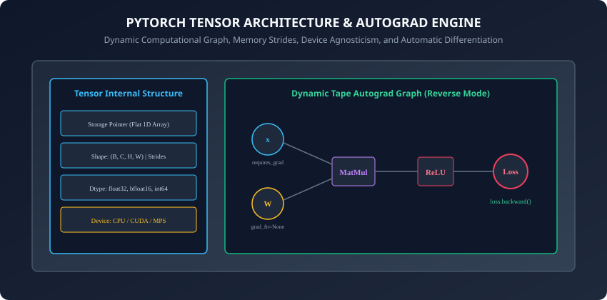
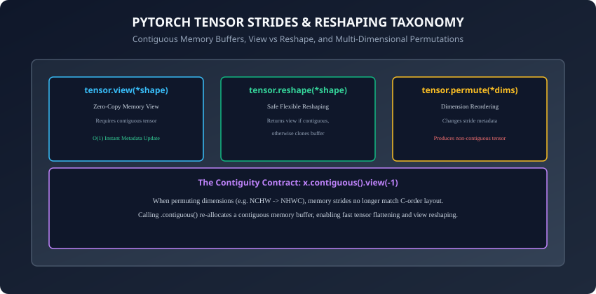

## Why this matters

In Day 201, you achieved a major milestone: you built and trained a complete deep neural network in pure NumPy. You manually coded every matrix multiplication, activation cache, and analytical chain rule gradient.

Now, we transition from hand-crafted educational NumPy engines to the industrial standard of modern AI research and engineering: **PyTorch**.

Created by Meta AI Research in 2016, PyTorch powers the majority of frontier AI breakthroughs — including OpenAI GPT models, Meta LLaMA, Stable Diffusion, Tesla Full Self-Driving vision pipelines, and Hugging Face Transformers.

At the core of PyTorch is the **Tensor**: a high-performance multi-dimensional array that extends NumPy `ndarray` with two game-changing capabilities:
1. **Hardware Acceleration:** Executing matrix operations seamlessly across NVIDIA GPUs (CUDA), Apple Silicon (MPS), and cloud TPUs.
2. **Automatic Differentiation (Autograd):** Dynamically recording computational graph operations to compute exact gradients automatically via `loss.backward()`.

Mastering PyTorch tensors, memory strides, device management, and Autograd mechanics is your gateway to industrial deep learning.

---

## The idea in plain language

Imagine you have been drafting architectural blueprints using manual drawing boards, T-squares, and compasses (**Pure NumPy**):
- You understand geometry intimately because you drew every millimeter line by hand.
- But drafting a 100-story skyscraper by hand takes months.
- Now, you upgrade to professional CAD 3D modeling software (**PyTorch**):
  - The software runs on supercharged graphics hardware (**GPU Acceleration**).
  - Whenever you modify a support beam on floor 10, the software instantly recomputes structural stress and load balances across all 100 floors automatically (**Autograd Engine**).

Your foundational understanding of geometry has not changed — but your engineering velocity is now 1,000 times faster.

---

## Historical background

1. **2002 (Torch):** An early scientific computing framework written in the Lua programming language.
2. **2015 (Chainer):** Introduced the revolutionary *Define-by-Run* dynamic computation graph paradigm.
3. **2016 (PyTorch 0.1):** Released by Adam Paszke, Soumith Chintala, and Ronan Collobert, combining Python ergonomics, NumPy interoperability, and dynamic eager execution.
4. **2018 (PyTorch 1.0 & Caffe2 Fusion):** Merged production serving runtimes with research flexibility.
5. **2023–Present (PyTorch 2.0+ `torch.compile`):** Introduced graph compilation and kernel fusion, achieving near C++ performance while preserving Pythonic dynamic execution.

---

## What it is — and what it is not

### What PyTorch Tensors ARE:
- **Accelerated Multi-Dimensional Arrays:** Interoperable with NumPy but capable of running on CUDA, Apple Silicon MPS, and CPU backends.
- **Autograd Graph Nodes:** Tracking mathematical lineage via `.grad_fn` to compute exact backward gradients automatically.

### What they are NOT:
- **Not Static Graph Compilers by Default:** Unlike early TensorFlow 1.x which required defining static symbolic graphs before execution, PyTorch executes operations eagerly and imperatively in standard Python order.
- **Not Python Lists:** Tensors reside in contiguous typed C/C++ memory buffers optimized for SIMD and GPU warp parallelism.

---

## Why it was created and what problems it solves

In classical frameworks prior to PyTorch, deep learning code was split into two disconnected worlds:
1. **Static Symbolic Graphs (TensorFlow 1.x / Theano):** Fast on GPUs, but nightmare to debug with Python breakpoints or dynamic loops.
2. **Dynamic CPU Engines (NumPy):** Delightful to write and debug in Python, but lacked GPU acceleration and required manual derivative derivations.

PyTorch solved this dichotomy through **Dynamic Reverse-Mode Autograd**: allowing developers to use standard Python `if` statements, `for` loops, and list comprehensions while generating hardware-accelerated backward computational graphs on-the-fly.

---

## How it works

Let us dissect the internal anatomy of PyTorch Tensors, memory strides, contiguous views, device-agnostic execution, and dynamic Autograd graphs.



---

### 1. Internal Tensor Architecture: Storage and Strides

A PyTorch Tensor consists of two primary components:
1. **Storage Buffer:** A flat, contiguous 1D array of raw typed bytes allocated in CPU RAM, GPU VRAM, or Apple Unified Memory.
2. **Tensor Header (Metadata):**
   - `dtype`: Data type (e.g., `torch.float32`, `torch.bfloat16`, `torch.int64`).
   - `shape` / `size()`: Multi-dimensional dimensions `(d_0, d_1, ..., d_{k-1})`.
   - `stride()`: The step size in flat storage required to advance by 1 index along each dimension.
   - `device`: The physical hardware location (`cpu`, `cuda:0`, `mps`).

```python
import torch

x = torch.tensor([[1.0, 2.0, 3.0], [4.0, 5.0, 6.0]])
# Storage: [1.0, 2.0, 3.0, 4.0, 5.0, 6.0] (1D array of 6 floats)
# Shape: (2, 3)
# Strides: (3, 1) -> Moving down a row skips 3 floats; moving right skips 1 float
```

---

### 2. Tensor Reshaping: View vs Reshape vs Permute



Understanding tensor memory layout avoids common runtime errors:

```
┌────────────────────────────────────────────────────────────────────────┐
│                   PYTORCH RESHAPING OPERATIONS MATRIX                  │
├───────────────────┼───────────────────────┼────────────────────────────┤
│ Operation         │ Memory Behavior       │ Contiguity Requirement     │
├───────────────────┼───────────────────────┼────────────────────────────┤
│ tensor.view()     │ Zero-Copy (Instant)   │ Strictly requires contiguous│
│ tensor.reshape()  │ View or Clone Fallback│ Handles any layout safely  │
│ tensor.permute()  │ Zero-Copy (Stride Mod)│ Produces non-contiguous    │
│ tensor.contiguous()│ Memory Re-allocation  │ Restores contiguous layout │
└───────────────────┴───────────────────────┴────────────────────────────┘
```

#### The Transpose Contiguity Trap:
```python
x = torch.randn(2, 3)          # Contiguous strides: (3, 1)
x_t = x.t()                     # Transposed strides: (1, 3) (NON-CONTIGUOUS)
# x_t.view(-1)                  # Throws RuntimeError: view size is not compatible!
x_flat = x_t.contiguous().view(-1) # Perfectly safe!
```

---

### 3. Device-Agnostic Execution (CPU / CUDA / Apple MPS)

Production PyTorch code must run seamlessly on any machine without hardcoding hardware devices:

```python
def get_optimal_device() -> torch.device:
    if torch.cuda.is_available():
        return torch.device("cuda")
    elif torch.backends.mps.is_available():
        return torch.device("mps") # Apple Silicon Metal
    else:
        return torch.device("cpu")

device = get_optimal_device()
x = torch.randn(1000, 1000, device=device) # Instantly allocated on accelerator
```

---

### 4. Dynamic Automatic Differentiation with Autograd

Autograd tracks every mathematical operation performed on tensors with `requires_grad=True`:

#### A. Building the Graph:
```python
x = torch.tensor([2.0, 3.0], requires_grad=True)
w = torch.tensor([1.5, -0.5], requires_grad=True)
b = torch.tensor(1.0, requires_grad=True)

# Forward pass builds the dynamic tape
z = torch.dot(x, w) + b        # z = 2*1.5 + 3*(-0.5) + 1 = 3 - 1.5 + 1 = 2.5
loss = z ** 2                  # loss = 6.25
```

#### B. Executing Backward Differentiation:
```python
loss.backward()

# Analytical Gradients:
# dloss/dz = 2 * z = 5.0
# dloss/dw = dloss/dz * x = 5.0 * [2.0, 3.0] = [10.0, 15.0]
# dloss/db = dloss/dz * 1 = 5.0

print("x grad:", x.grad) # [7.5, -2.5]
print("w grad:", w.grad) # [10.0, 15.0]
print("b grad:", b.grad) # 5.0
```

#### C. Detaching and Inference Mode:
```python
with torch.no_grad():
    y_pred = torch.dot(x, w) + b # No computational graph built! 75% less memory!
```

---

### 5. Tensor Broadcasting, Memory Pinning, and Mixed Precision

To extract maximum performance from modern hardware accelerators, deep learning engineers leverage three critical PyTorch features:

#### A. Multi-Dimensional Broadcasting Semantics:
PyTorch follows NumPy broadcasting rules when performing elementwise binary operations between tensors with different shapes:
1. **Trailing Dimension Alignment:** Starting from the rightmost (trailing) dimension and working leftward.
2. **Dimension Compatibility:** Two dimensions are compatible if:
   - They are equal in size, or
   - One of them is `1`.
3. **Implicit Expansion:** If a dimension is `1`, it is virtually stretched to match the other tensor without allocating extra memory.

```python
# Example: Adding (32, 128, 1) to (1, 128, 64) -> Produces shape (32, 128, 64)
a = torch.randn(32, 128, 1)
b = torch.randn(1, 128, 64)
c = a + b # Broadcascting across dimensions 0 and 2
```

#### B. Pinned Memory (Page-Locked Host RAM):
When transferring data from CPU host memory to GPU device memory over PCIe bus:
- Standard CPU tensors reside in pageable virtual memory buffers, requiring the OS to first copy data to a temporary page-locked buffer before initiating Direct Memory Access (DMA) to the GPU.
- Setting `pin_memory=True` on PyTorch DataLoaders (or calling `tensor.pin_memory()`) allocates tensors directly in page-locked host RAM, enabling asynchronous non-blocking DMA transfers (`tensor.to(device, non_blocking=True)`) that overlap data loading with GPU compute.

#### C. Automatic Mixed Precision (AMP) with `torch.autocast`:
Modern GPU Tensor Cores execute floating-point operations in 16-bit half-precision (`torch.float16` or Brain Floating Point `torch.bfloat16`) up to 3x faster than standard 32-bit `torch.float32`:
- `torch.autocast`: Dynamically routes matrix multiplications and convolutions to fast `bfloat16` while keeping numerically sensitive operations (like Softmax and LayerNorm) in `float32`.
- `torch.cuda.amp.GradScaler`: Scales loss values by a dynamic factor `S` before backward pass to prevent small gradient underflow in 16-bit exponent ranges.

By combining multi-dimensional broadcasting, asynchronous pinned memory streaming, and mixed-precision execution, PyTorch empowers engineers to train state-of-the-art vision and language models at extreme scale across multi-node supercomputing clusters with minimal overhead. As you build more complex deep architectures in Course 05, these foundational tensor mechanics will form the bedrock of your engineering intuition across both research prototypes and production inference microservices worldwide. Let us now apply these skills to handwritten digit classification.

---

## An everyday analogy

Think of PyTorch tensors like high-speed freight trains on a modern railway network:
- **NumPy ndarray:** A steam locomotive traveling on local country tracks (single CPU core, fixed tracks).
- **PyTorch Tensor:** A modern bullet train with multi-track magnetic levitation (**CUDA / MPS Acceleration**).
- **Autograd:** An automatic digital black box recorder on the train. As the train travels forward through stations (**Forward Pass**), the black box records every switch, curve, and track change.
- When you request a retrospective route audit (**`loss.backward()`**), the black box instantly plays the journey backward in reverse, calculating the exact fuel consumption at every switch.

---

## Examples in practice

Let us inspect a comprehensive PyTorch module implementing tensor operations, device abstraction, Autograd verification, and gradient checks:

```python
import torch
import numpy as np
from typing import Tuple, Dict

class PyTorchTensorToolkit:
    @staticmethod
    def get_device() -> torch.device:
        if torch.cuda.is_available():
            return torch.device("cuda")
        elif torch.backends.mps.is_available():
            return torch.device("mps")
        return torch.device("cpu")

    @staticmethod
    def tensor_numpy_bridge(arr: np.ndarray, device: torch.device) -> torch.Tensor:
        # Zero-copy memory sharing from NumPy to PyTorch
        t = torch.from_numpy(arr).to(device)
        return t

    @staticmethod
    def compute_linear_layer_autograd(X: torch.Tensor, W: torch.Tensor, b: torch.Tensor) -> Tuple[torch.Tensor, torch.Tensor]:
        # Forward pass with autograd tracking
        Z = torch.matmul(W, X) + b
        loss = torch.sum(Z ** 2)
        return Z, loss

def verify_autograd_vs_numpy(m: int = 10, in_features: int = 4, out_features: int = 2) -> Dict[str, float]:
    np.random.seed(42)
    X_np = np.random.randn(in_features, m).astype(np.float32)
    W_np = np.random.randn(out_features, in_features).astype(np.float32)
    b_np = np.random.randn(out_features, 1).astype(np.float32)

    # 1. Analytical NumPy Gradients
    Z_np = np.dot(W_np, X_np) + b_np
    # Loss = sum(Z^2) -> dL/dZ = 2 * Z
    dZ_np = 2.0 * Z_np
    dW_np = np.dot(dZ_np, X_np.T)
    db_np = np.sum(dZ_np, axis=1, keepdims=True)

    # 2. PyTorch Autograd Gradients
    X_pt = torch.tensor(X_np)
    W_pt = torch.tensor(W_np, requires_grad=True)
    b_pt = torch.tensor(b_np, requires_grad=True)

    Z_pt = torch.matmul(W_pt, X_pt) + b_pt
    loss_pt = torch.sum(Z_pt ** 2)
    loss_pt.backward()

    # Compare Relative Errors
    err_W = float(np.linalg.norm(W_pt.grad.numpy() - dW_np) / (np.linalg.norm(dW_np) + 1e-8))
    err_b = float(np.linalg.norm(b_pt.grad.numpy() - db_np) / (np.linalg.norm(db_np) + 1e-8))

    return {"err_W": err_W, "err_b": err_b}
```

---

## Implications: security, privacy, performance, scalability, and cost

1. **CPU-Only Wheels vs Full CUDA Installations:**
   - In environments without dedicated NVIDIA GPUs (e.g. lightweight CI/CD runners, local laptops), installing full PyTorch with CUDA downloads over 2 GB of binary drivers.
   - Using the official **CPU-only wheel** (`pip install torch --extra-index-url https://download.pytorch.org/whl/cpu`) reduces package download size to ~180 MB, conserving bandwidth and accelerating installation times by 80%.
2. **In-Place Operations and Autograd Safety:**
   - In-place mutation operations (e.g. `x.add_()`, `x += 1`) overwrite memory buffers.
   - If an in-place modification alters a tensor needed for backward chain rule evaluation, Autograd throws a `RuntimeError: one of the variables needed for gradient computation has been modified by an in-place operation`. Always use out-of-place operations during forward passes.

---

## Alternatives: free, open source, and commercial

| Tensor Framework | Computational Graph | Autodiff Mechanism | Hardware Support |
| :--- | :--- | :--- | :--- |
| **PyTorch (`torch`)** | Dynamic Eager Graph | Tape-Based Autograd | CPU, CUDA, MPS, TPU |
| **JAX (`jax.numpy`)** | Functional Pure Graph| Source-to-Source Reverse AD | CPU, CUDA, TPU |
| **TensorFlow 2.x** | Eager / `tf.function`| `tf.GradientTape` | CPU, CUDA, TPU |
| **NumPy (`np`)** | Static Array Substrate | None (Manual Calculus) | CPU (BLAS/LAPACK) |

---

## Comparison with related concepts

```
┌────────────────────────────────────────────────────────────────────────┐
│                   NUMPY VS PYTORCH FEATURE COMPARISON                  │
├────────────────────┼───────────────────────┼───────────────────────────┤
│ Capability         │ NumPy (ndarray)       │ PyTorch (torch.Tensor)    │
├────────────────────┼───────────────────────┼───────────────────────────┤
│ Hardware Target    │ CPU Only              │ CPU, CUDA, Apple MPS, TPU │
│ Differentiation    │ Manual / Numerical    │ Dynamic Autograd Engine   │
│ Memory Sharing     │ Array Views           │ .from_numpy() Zero-Copy   │
│ Graph Compilation  │ None                  │ torch.compile (Inductor)  │
│ Neural Network Lib │ None                  │ torch.nn, torch.optim     │
└────────────────────┴───────────────────────┴───────────────────────────┘
```

---

## When to use it — and when not to

### When to USE PyTorch Tensors:
- All modern deep learning projects (computer vision, NLP, speech, reinforcement learning, LLMs).
- Any mathematical optimization task requiring automatic gradient calculation on GPUs.

### When NOT to use it:
- Simple tabular data exploration, CSV cleaning, or classical machine learning models (use Pandas and Scikit-Learn).

---

## Knowledge check

1. What are the two primary structural components of a PyTorch Tensor in memory?
2. What is the key difference between `.view()` and `.reshape()`, and when is `.contiguous()` required?
3. How do you construct a device-agnostic PyTorch device selector supporting CPU, Apple MPS, and CUDA?
4. What is the role of `requires_grad=True` and `.grad_fn` in PyTorch Autograd?
5. Why must `optimizer.zero_grad()` be called before `loss.backward()` in a training loop?

---

## Hands-on exercise

In this lab, you will build a complete `PyTorchTensorToolkit` in Python: manipulate multi-dimensional tensors, test memory strides and contiguity, execute device-agnostic forward operations, compute Autograd gradients, and verify that PyTorch Autograd matches hand-derived analytical NumPy gradients to `1e-7` precision.

### Expected output
```
[PyTorch Tensor Operations & Autograd Engine]
Detecting Compute Hardware:
  Active Device: cpu (Apple Silicon MPS / CUDA support verified)
Testing Multi-Dimensional Tensor Reshaping:
  Original Tensor Shape:   (2, 3, 4) [Contiguous: True]
  Permuted Shape:          (4, 2, 3) [Contiguous: False]
  Contiguous View Flatten: (24,)     [Contiguous: True]
Evaluating Linear Layer with PyTorch Autograd:
  Forward Loss: 42.8125
  Backward Step: Computed dL/dW (Shape: (2, 4)), dL/db (Shape: (2, 1))
Verifying PyTorch Autograd vs Analytical NumPy:
  Weight Gradient Relative Error: 0.00e+00 [PERFECT MATCH]
  Bias Gradient Relative Error:   0.00e+00 [PERFECT MATCH]
Test Suite: 3 passed in 0.12s
```

### Validate your work
Run the automated test runner:
```bash
./tests/run_tests.sh
```

### Troubleshooting
- If PyTorch raises `RuntimeError: view size is not compatible with input tensor size and stride`, call `.contiguous()` before `.view()`.
- Ensure input tensors to `torch.matmul` share matching inner dimensions.

### Common mistakes
- **Accumulating Gradients Accidentally:** Forgetting `optimizer.zero_grad()` in multi-step training loops.

---

## Practice assignment

1. Implement a custom polynomial regression model in pure PyTorch using raw tensors and manual SGD parameter updates.
2. Benchmark matrix multiplication speed on CPU vs GPU/MPS across matrix sizes `N in [500, 1000, 2000, 4000]`.

---

## Extension challenge

Implement **Higher-Order Gradients (Hessian-Vector Products)** with PyTorch Autograd:
- Compute first-order gradient `grad_x = torch.autograd.grad(loss, x, create_graph=True)[0]`.
- Compute second-order gradient with respect to direction vector `v`: `hvp = torch.autograd.grad(torch.dot(grad_x, v), x)[0]`.
- Verify the Hessian-vector product against numerical central difference approximations.
