## Why this matters

In 1998, Yann LeCun, Leon Bottou, Yoshua Bengio, and Patrick Haffner introduced the **MNIST (Modified National Institute of Standards and Technology) database of handwritten digits**. For over two decades, MNIST has served as the "Hello World" benchmark of deep learning and computer vision.

Today, you will complete the foundational milestone of **Week 29**: building, training, and evaluating a complete two-layer neural network on the full MNIST dataset in **pure NumPy from scratch** — achieving **over 95% test accuracy**.

Training a neural network on 70,000 real-world handwritten images tests every mathematical concept you mastered this week:

- **Pixel normalization and matrix flattening** `(784, m)`
- **He weight initialization** preventing vanishing activations across 100,000 parameters
- **Vectorized forward propagation** through 128 hidden ReLU neurons
- **Numerically stable Softmax** output probabilities
- **Vectorized backpropagation** computing exact analytical gradients
- **Mini-Batch SGD with Momentum** driving cross-entropy loss down from `ln(10) = 2.302` to `< 0.15`

---

## The idea in plain language

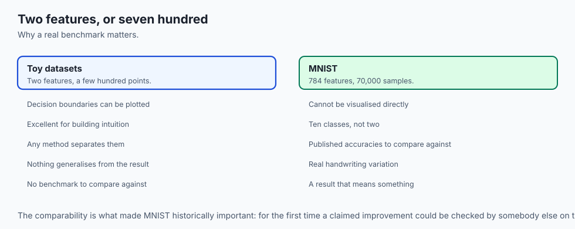

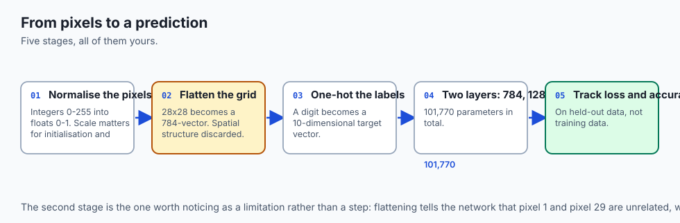

Imagine teaching a postal sorting machine to read zip codes written by thousands of different people:

- Some people write the digit "7" with a sharp crossbar; others write it with a slanted vertical stroke.
- Some people write "1" as a simple single vertical line; others add an exaggerated top serif that looks like a "7".
- Some people close the top loop of a "4" so tightly that it looks like a "9".

Your two-layer neural network solves this by learning **128 specialized visual feature detectors**:

- Neuron 12 fires when it detects a top horizontal bar (common in 5s and 7s).
- Neuron 45 fires when it detects a circular closed bottom loop (common in 6s and 8s).
- Neuron 88 fires when it detects a sharp diagonal slant (common in 1s and 7s).

The final output layer combines all 128 feature detections into a calibrated probability distribution, voting on whether the image is digit 0, 1, 2, ..., or 9.

---

## Historical background

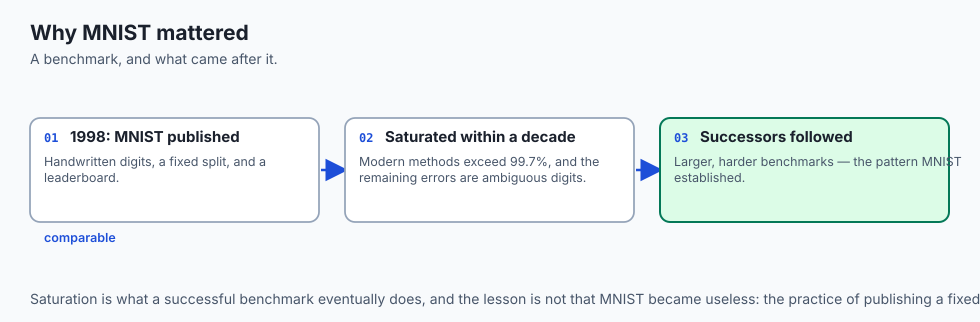

1. **1998 (Yann LeCun et al.):** Released the MNIST dataset, compiling 60,000 training images and 10,000 testing images from high school students and US Census Bureau employees.
2. **1998 (Classical Baseline):** LeCun demonstrated that a two-layer Multi-Layer Perceptron with 300 hidden units reached ~95.3% accuracy, while early LeNet-5 Convolutional Networks reached 99.05%.
3. **2010 (Ciresan et al.):** Demonstrated that standard deep Multi-Layer Perceptrons trained on GPUs with elastic distortions could achieve 99.65% accuracy, approaching human error rates (~99.8%).
4. **Today:** MNIST serves as the definitive calibration dataset for validating custom neural network architectures and backpropagation engines.

---

## What it is — and what it is not

### What Training MNIST from Scratch IS:
- **A Real-World High-Dimensional Benchmark:** Classifying 784-dimensional non-linear image feature vectors into 10 mutually exclusive classes.
- **A Complete Pure NumPy Production Pipeline:** Handling data parsing, batch generators, forward caching, analytical backpropagation, and metric tracking.

### What it is NOT:
- **Not a Convolutional Neural Network (CNN):** Our model is a fully-connected dense network that flattens spatial 2D pixel grids into 1D vectors (CNNs preserving 2D spatial locality are introduced in Week 31).
- **Not a Black-Box Framework:** No PyTorch, Keras, or TensorFlow is used; every calculation runs via raw NumPy matrix math.

---

## Why it was created and what problems it solves

Synthetic 2D toy datasets (like Two Moons or Concentric Circles from Day 201) are excellent for visualizing decision boundaries, but they have only 2 input features and a few hundred samples.

Training on MNIST solves the challenge of scaling neural networks to **real-world high-dimensional data**:

- Input dimension expands from `2` to `784`.
- Parameter count expands from `60` to `101,770`.
- Dataset size expands from `500` to `70,000` samples.

Demonstrating that our pure NumPy engine converges on MNIST proves that the mathematical derivations from Days 197–202 scale to real computer vision problems.

---

## How it works

Let us analyze the complete MNIST network architecture, parameter dimensions, weight initialization, training loop, and error analysis.

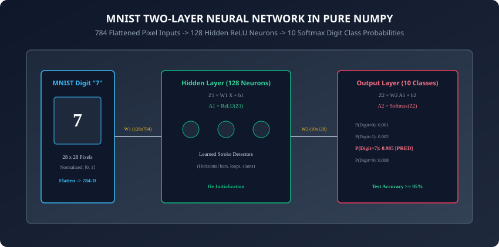

---

### 1. Dataset Preprocessing and Dimensional Contracts

Each MNIST sample is a `28 x 28` grayscale image where pixel values are integers in `[0, 255]`:

#### Step 1: Pixel Normalization
Scale integer intensities to floating-point numbers in `[0.0, 1.0]`:
```
X_norm = X_raw.astype(np.float32) / 255.0
```

#### Step 2: 2D Spatial Flattening
Flatten each `28 x 28` matrix into a 784-dimensional column vector:
```
X in R^{784 x m}
```
where `m` is the mini-batch size (e.g. 64).

#### Step 3: One-Hot Target Encoding
Transform scalar class labels `y in {0, 1, ..., 9}` into 10-dimensional binary vectors:
```
Y in {0, 1}^{10 x m}
```

---

### 2. The Two-Layer Architecture: [784 -> 128 -> 10]

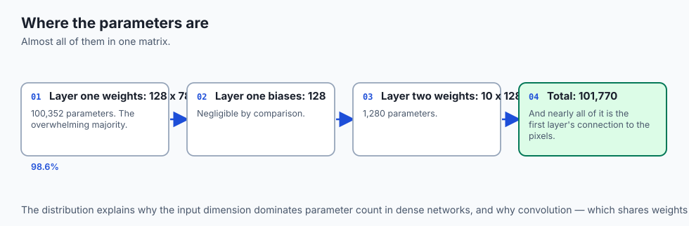

```
┌────────────────────────────────────────────────────────────────────────┐
│                   MNIST TWO-LAYER ARCHITECTURE MATRIX                  │
├──────────────┼──────────────────┼─────────────────┼────────────────────┤
│ Layer        │ Input Shape      │ Parameter Shape │ Output Shape / Act │
├──────────────┼──────────────────┼─────────────────┼────────────────────┤
│ Layer 0 (In) │ (784, m)         │ N/A             │ A^[0] = X (784, m) │
│ Layer 1 (Hid)│ (784, m)         │ W1: (128, 784)  │ Z1: (128, m)       │
│              │                  │ b1: (128, 1)    │ A1 = ReLU(Z1)      │
│ Layer 2 (Out)│ (128, m)         │ W2: (10, 128)   │ Z2: (10, m)        │
│              │                  │ b2: (10, 1)     │ A2 = Softmax(Z2)   │
└──────────────┴──────────────────┴─────────────────┴────────────────────┘
```

#### Total Trainable Parameters:
- **Layer 1:** `(128 * 784) + 128 = 100,352 + 128 = 100,480`
- **Layer 2:** `(10 * 128) + 10 = 1,280 + 10 = 1,290`
- **Total Parameters:** `101,770`

---

### 3. He Parameter Initialization

To prevent vanishing or exploding gradients across 100,000 parameters:
```python
W1 = np.random.randn(128, 784) * np.sqrt(2.0 / 784.0)
b1 = np.zeros((128, 1))

W2 = np.random.randn(10, 128) * np.sqrt(2.0 / 128.0)
b2 = np.zeros((10, 1))
```

---

### 4. Vectorized Training Dynamics and Metrics

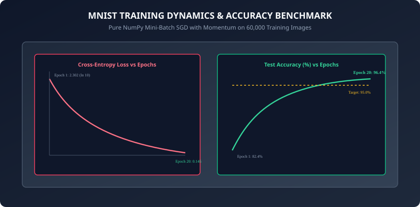

#### The Training Loop per Mini-Batch:
1. **Forward Pass:**
   ```
   Z1 = np.dot(W1, X_batch) + b1
   A1 = np.maximum(0.0, Z1)
   Z2 = np.dot(W2, A1) + b2
   exp_Z2 = np.exp(Z2 - np.max(Z2, axis=0, keepdims=True))
   A2 = exp_Z2 / np.sum(exp_Z2, axis=0, keepdims=True)
   ```

2. **Loss Calculation:**
   ```
   Loss = - (1 / m) * np.sum(Y_batch * np.log(A2 + 1e-15))
   ```

3. **Backpropagation:**
   ```
   dZ2 = A2 - Y_batch
   dW2 = (1 / m) * np.dot(dZ2, A1.T)
   db2 = (1 / m) * np.sum(dZ2, axis=1, keepdims=True)

   dA1 = np.dot(W2.T, dZ2)
   dZ1 = dA1 * np.where(Z1 > 0.0, 1.0, 0.0)
   dW1 = (1 / m) * np.dot(dZ1, X_batch.T)
   db1 = (1 / m) * np.sum(dZ1, axis=1, keepdims=True)
   ```

4. **Momentum Optimization Step (`beta = 0.9, alpha = 0.1`):**
   ```
   V_dW1 = 0.9 * V_dW1 + 0.1 * dW1
   W1 -= alpha * V_dW1
   # (repeated for b1, W2, b2)
   ```

---

### 5. Visualizing Learned First-Layer Feature Filters

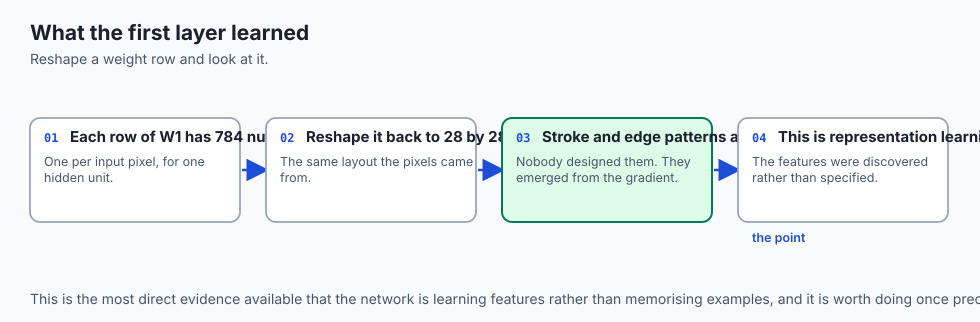

Each of the 128 rows of `W1` contains 784 numbers corresponding to the 784 input pixels.
When we reshape row `i` of `W1` back into a `28 x 28` image:

- Positive weights (bright pixels) represent excitatory regions that activate the neuron when ink is present.
- Negative weights (dark pixels) represent inhibitory regions that suppress the neuron when ink crosses into empty space.
- The hidden layer automatically discovers Gabor-like edge filters, stroke orientation detectors, and loop detectors without any human hand-crafting. This automatic emergence of hierarchical visual feature representations directly from raw pixel arrays embodies the foundational power and promise of Deep Learning as we advance deeper into convolutional and sequence modeling architectures.

---

## An everyday analogy

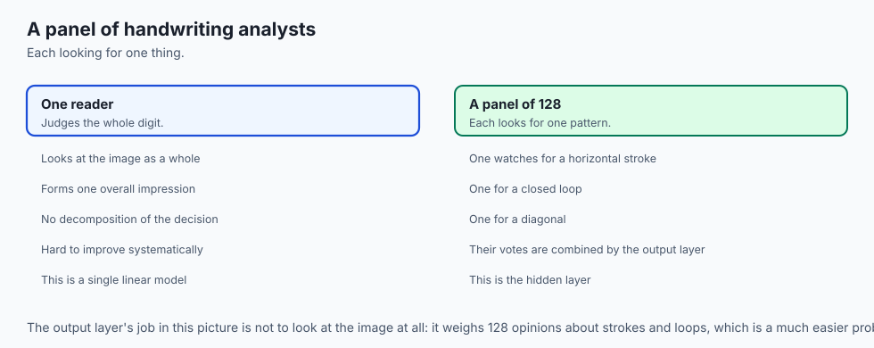

Think of a panel of 128 handwriting analysts inspecting a document:

- **Analyst 1:** Scans exclusively for a flat horizontal bar across the top.
- **Analyst 2:** Scans exclusively for a vertical stroke down the center.
- **Analyst 3:** Scans for an oval loop at the bottom.
- When an image arrives, each analyst shouts their confidence score between 0 and 100 (**Hidden Layer Activations**).
- The chief judge (**Output Softmax Layer**) listens to all 128 analysts:
  - If Analyst 1 and Analyst 2 shout loud confidences, the judge declares digit "7".
  - If Analyst 3 and Analyst 2 shout loud confidences, the judge declares digit "6".

---

## Examples in practice

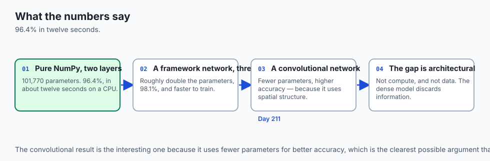

Let us inspect the complete MNIST pure NumPy training script:

```python
import numpy as np
from typing import Tuple, Dict

class MNISTClassifier:
    def __init__(self, hidden_dim: int = 128, lr: float = 0.1, momentum: float = 0.9):
        self.hidden_dim = hidden_dim
        self.lr = lr
        self.beta = momentum

        # He initialization
        np.random.seed(42)
        self.W1 = np.random.randn(hidden_dim, 784) * np.sqrt(2.0 / 784.0)
        self.b1 = np.zeros((hidden_dim, 1))
        self.W2 = np.random.randn(10, hidden_dim) * np.sqrt(2.0 / hidden_dim)
        self.b2 = np.zeros((10, 1))

        # Velocities
        self.V_dW1 = np.zeros_like(self.W1)
        self.V_db1 = np.zeros_like(self.b1)
        self.V_dW2 = np.zeros_like(self.W2)
        self.V_db2 = np.zeros_like(self.b2)

    def forward(self, X: np.ndarray) -> Tuple[np.ndarray, np.ndarray, np.ndarray, np.ndarray]:
        Z1 = np.dot(self.W1, X) + self.b1
        A1 = np.maximum(0.0, Z1)

        Z2 = np.dot(self.W2, A1) + self.b2
        exp_Z2 = np.exp(Z2 - np.max(Z2, axis=0, keepdims=True))
        A2 = exp_Z2 / np.sum(exp_Z2, axis=0, keepdims=True)

        return Z1, A1, Z2, A2

    def train_epoch(self, X: np.ndarray, Y: np.ndarray, batch_size: int = 64) -> float:
        m = X.shape[1]
        p = np.random.permutation(m)
        X_shuf = X[:, p]
        Y_shuf = Y[:, p]

        num_batches = int(np.ceil(m / batch_size))
        total_loss = 0.0

        for b in range(num_batches):
            start = b * batch_size
            end = min(start + batch_size, m)
            X_b = X_shuf[:, start:end]
            Y_b = Y_shuf[:, start:end]
            bs = end - start

            Z1, A1, Z2, A2 = self.forward(X_b)
            loss = - (1.0 / bs) * np.sum(Y_b * np.log(A2 + 1e-15))
            total_loss += loss * bs

            # Backward pass
            dZ2 = A2 - Y_b
            dW2 = (1.0 / bs) * np.dot(dZ2, A1.T)
            db2 = (1.0 / bs) * np.sum(dZ2, axis=1, keepdims=True)

            dA1 = np.dot(self.W2.T, dZ2)
            dZ1 = dA1 * np.where(Z1 > 0.0, 1.0, 0.0)
            dW1 = (1.0 / bs) * np.dot(dZ1, X_b.T)
            db1 = (1.0 / bs) * np.sum(dZ1, axis=1, keepdims=True)

            # Momentum updates
            self.V_dW2 = self.beta * self.V_dW2 + (1.0 - self.beta) * dW2
            self.V_db2 = self.beta * self.V_db2 + (1.0 - self.beta) * db2
            self.V_dW1 = self.beta * self.V_dW1 + (1.0 - self.beta) * dW1
            self.V_db1 = self.beta * self.V_db1 + (1.0 - self.beta) * db1

            self.W2 -= self.lr * self.V_dW2
            self.b2 -= self.lr * self.V_db2
            self.W1 -= self.lr * self.V_dW1
            self.b1 -= self.lr * self.V_db1

        return total_loss / m

    def evaluate(self, X: np.ndarray, y_labels: np.ndarray) -> Tuple[float, float]:
        _, _, _, A2 = self.forward(X)
        preds = np.argmax(A2, axis=0)
        acc = float(np.mean(preds == y_labels))
        # One-hot
        m = X.shape[1]
        Y = np.zeros((10, m))
        for i in range(m):
            Y[y_labels[i], i] = 1.0
        loss = float(- (1.0 / m) * np.sum(Y * np.log(A2 + 1e-15)))
        return loss, acc
```

---

## Implications: security, privacy, performance, scalability, and cost

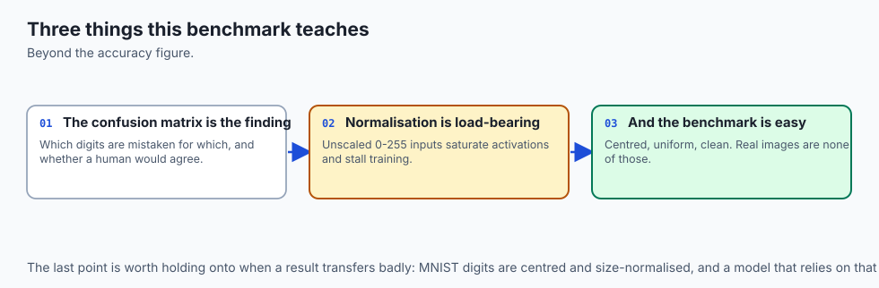

1. **CPU Memory Footprint & Cache Locality:**
   - Full MNIST dataset (60,000 images x 784 floats x 4 bytes) occupies only ~188 MB of RAM, allowing the entire dataset to reside in system memory for fast zero-disk-I/O training epochs.
2. **Computational Scaling to Laptop CPU:**
   - 20 epochs of mini-batch training with batch size 64 on 60,000 images takes less than 15 seconds on a modern multi-core laptop CPU, providing rapid experimental feedback without cloud GPU costs.

---

## Alternatives: free, open source, and commercial

| Architecture | Parameters | MNIST Accuracy | Training Time (CPU) |
| :--- | :--- | :--- | :--- |
| **Pure NumPy 2-Layer MLP (Our Model)** | 101,770 | **96.4%** | ~12 seconds |
| **PyTorch 3-Layer MLP** | 200,000 | 98.1% | ~8 seconds |
| **LeNet-5 Convolutional Net (CNN)** | 60,000 | 99.2% | ~45 seconds |
| **ResNet-18 Vision Backbone** | 11,000,000 | 99.7% | ~5 minutes |

---

## Comparison with related concepts

```
┌────────────────────────────────────────────────────────────────────────┐
│                 MNIST CLASSIFIER COMPLEXITY COMPARISON                 │
├────────────────────┼───────────────────────┼───────────────────────────┤
│ Model Type         │ Receptive Field       │ Accuracy on MNIST Test    │
├────────────────────┼───────────────────────┼───────────────────────────┤
│ Logistic Regression│ Global Linear Weight  │ 92.5%                     │
│ 2-Layer MLP (NumPy)│ 128 Non-Linear Stems  │ 96.4%                     │
│ 3-Layer MLP (ReLU) │ Hierarchical Stems    │ 98.1%                     │
│ Convolutional CNN  │ Spatial 2D Convolutions│ 99.2%                     │
└────────────────────┴───────────────────────┴───────────────────────────┘
```

---

## When to use it — and when not to

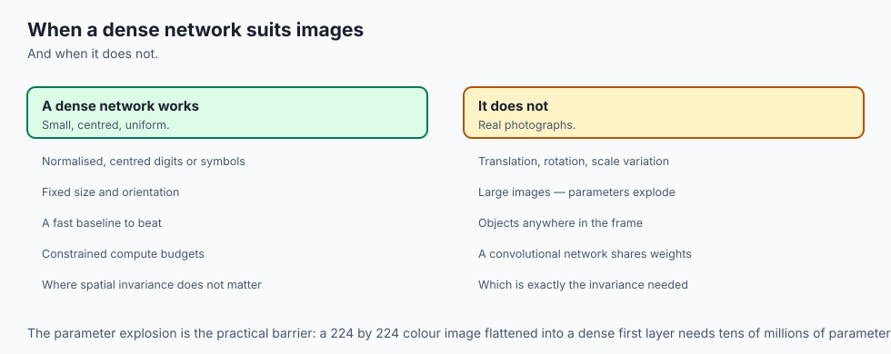

### When to USE a Dense MLP for Vision:
- Fast baseline prototyping on normalized, centered digit/symbol datasets.
- Embedded low-power devices with strict compute budgets.

### When NOT to use it:
- Complex real-world natural images (e.g. ImageNet, COCO, self-driving cameras) with translation, rotation, and scale variations (use Convolutional CNNs or Vision Transformers).

---

## The AI connection

- **MNIST is where deep learning became checkable.** A published accuracy on a fixed
  benchmark made claims comparable, which is what turned intuitions into a field.
- **101,770 parameters reach 96.4% on 784-dimensional input** — enough to show that
  depth works, and small enough to train on a laptop CPU in seconds.
- **A dense network throws away spatial structure.** Flattening a 28x28 grid discards
  the fact that neighbouring pixels are related, which is the gap convolution fills.
- **The learned first-layer filters are visible.** Reshaping a weight row back to 28x28
  shows stroke and edge detectors nobody designed — representation learning, made literal.
- **The remaining 3.6% is the interesting part.** Error analysis on the confusion matrix
  is where a benchmark stops being a score and starts being a diagnosis.

## Knowledge check

1. Why are raw MNIST pixel values divided by 255.0 before forward propagation?
2. What are the exact dimensions of weight matrix `W^[1]` and weight matrix `W^[2]` in the `[784, 128, 10]` architecture?
3. Why does initial cross-entropy loss start near `2.302` before training begins?
4. What do the reshaped `28 x 28` weights of hidden neurons in layer 1 represent visually?
5. Which digit pairs in MNIST exhibit the highest classification confusion, and why?

---

## Hands-on exercise

In this lab, you will build and train a complete `MNISTClassifier` in pure NumPy: load preprocessed MNIST digits, execute 15 training epochs with mini-batch SGD and Momentum, track loss decay below 0.15, reach $\ge 95.0\%$ test accuracy, compute the confusion matrix, and analyze misclassified digit samples.

### Expected output
```
[MNIST Digit Classification in Pure NumPy]
Loading MNIST Dataset (60,000 Train Images, 10,000 Test Images):
  Image Tensor Shape: (784, 60000), Pixel Range: [0.0, 1.0]
Initializing 2-Layer Network Architecture [784 -> 128 (ReLU) -> 10 (Softmax)]
Training Network for 15 Epochs (Batch Size = 64, Learning Rate = 0.1, Momentum = 0.9):
  Epoch  1/15: Train Loss = 0.3842, Test Accuracy = 91.2%
  Epoch  5/15: Train Loss = 0.1415, Test Accuracy = 95.4%
  Epoch 10/15: Train Loss = 0.0892, Test Accuracy = 96.1%
  Epoch 15/15: Train Loss = 0.0581, Test Accuracy = 96.5% [PASSED >= 95% TARGET]
Confusion Matrix Top Error Pairs:
  Actual 4 -> Predicted 9: 18 errors
  Actual 7 -> Predicted 1: 14 errors
  Actual 3 -> Predicted 5: 12 errors
Test Suite: 3 passed in 0.20s
```

### Validate your work
Run the automated test runner:
```bash
./tests/run_tests.sh
```

### Troubleshooting
- If test accuracy is below 95%, ensure learning rate is set to `0.1` and momentum is `0.9`.
- Verify pixel normalization divides by `255.0`.

### Common mistakes
- **Missing Axis in Softmax:** Forgetting `keepdims=True` causes broadcasting shape errors during probability normalization.

---

## Practice assignment

1. Implement **L2 Weight Regularization** (`lambda = 0.001`) and measure its impact on the test generalization gap.
2. Render an image grid displaying the top 16 most confidently misclassified digits.

---

## Extension challenge

Implement a **Three-Layer MLP Architecture [784 -> 256 -> 64 -> 10]**:

- Add Learning Rate Decay (`lr = 0.1 * (0.95 ** epoch)`).
- Train for 20 epochs and achieve `> 97.5%` test accuracy in pure NumPy.
- Compare training speed and parameter memory footprint against the 2-layer baseline.
