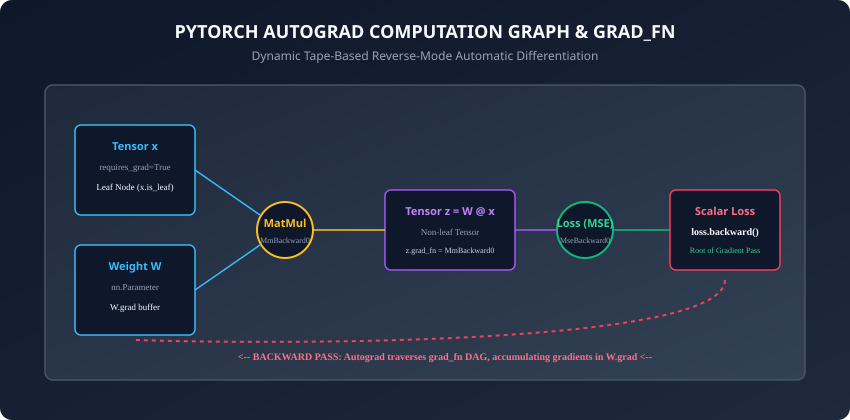
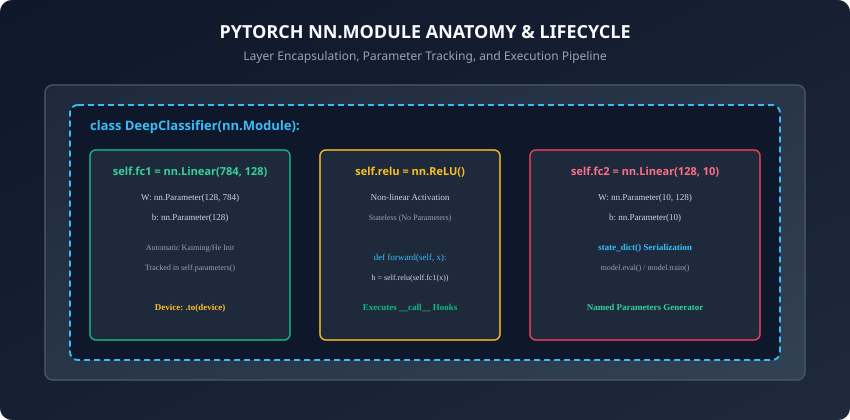

## Why this matters

In Week 29, you derived and implemented every equation of deep learning in pure NumPy: forward affine transformations, non-linear activation gates, analytical backpropagation Jacobians, He parameter initialization, and mini-batch gradient descent. You proved mathematically how gradients flow through layers and trained a model to 96% accuracy on MNIST.

However, writing manual backpropagation by hand for complex architectures (such as 100-layer Residual Networks, Multi-Head Attention Transformers, or Recurrent LSTMs) becomes mathematically intractable and error-prone. A single typo in an analytical matrix transpose can subtly corrupt gradient updates without crashing the program.

Today, we enter the modern era of deep learning engineering with **PyTorch: `autograd` and `torch.nn.Module`**.

PyTorch is the world-leading deep learning framework powering cutting-edge AI research and industrial production systems. By abstracting gradient derivation into dynamic, tape-based **Reverse-Mode Automatic Differentiation (`autograd`)** and encapsulating learnable parameters into clean object-oriented modules (`nn.Module`), PyTorch allows you to design arbitrary, dynamic neural architectures in standard Python while guaranteeing exact mathematical correctness on CPU, GPU, and TPU accelerators.

---

## The idea in plain language

Imagine recording a musical performance on multi-track magnetic tape:
- During the **Forward Pass**, as your code executes standard mathematical operations (matrix multiplications, additions, activations), PyTorch runs a background tape recorder.
- Every time a tensor with `requires_grad=True` passes through an operation, the tape writes down the exact mathematical operator and saves whatever input values are necessary to differentiate it later (stored as a `grad_fn` node).
- When you reach the scalar loss value and call `loss.backward()`, PyTorch hits "Rewind". It plays the tape backwards from end to beginning, evaluating the derivative of each recorded operation and delivering exact partial gradients directly into each parameter's `.grad` storage bin.

You write only the forward pass using standard Python control flow (`if`, `for`, `while`). PyTorch automatically differentiates whatever path your code took.

---

## Historical background

1. **2015 (Static Graph Era - Theano and TensorFlow 1.0):** Early deep learning frameworks required engineers to construct a static graph ("Define-and-Run") in a separate domain-specific language before compiling and feeding data into a session. Debugging was painful because standard Python debuggers (`pdb`) could not inspect values inside the compiled graph.
2. **2017 (Chainer and PyTorch):** PyTorch introduced **"Define-by-Run" dynamic computation graphs**. Graphs are constructed on the fly as standard Python code executes, enabling native Python loops, dynamic batch shapes, and interactive debugging.
3. **2019 (PyTorch 1.0 - Paszke et al.):** Unified research flexibility with production deployment capabilities through TorchScript, C++ libtorch runtimes, and distributed training engines.
4. **Today:** PyTorch is the dominant framework in deep learning research and generative AI engineering.

---

## What it is — and what it is not

### What PyTorch Autograd & nn.Module IS:
- **Dynamic Tape-Based Automatic Differentiation:** Builds a Directed Acyclic Graph (DAG) during forward execution and evaluates exact analytical chain-rule derivatives in reverse order.
- **An Object-Oriented Architectural Abstraction (`nn.Module`):** A foundational base class that automates parameter registration, nested submodule tracking, device migration (`.to(device)`), execution hooks, and state serialization (`state_dict`).

### What it is NOT:
- **Not Numerical Differentiation:** PyTorch does NOT approximate gradients using finite differences `(f(x+h) - f(x)) / h`. It computes mathematically exact analytical derivatives using symbolic derivative templates.
- **Not a Black Box Without Inspectability:** Every node in the computation graph is accessible in Python via `.grad_fn`, `.next_functions`, and `.grad`.

---

## Why it was created and what problems it solves

Manual gradient derivation has three major engineering bottlenecks:
1. **Mathematical Overhead:** Modifying an activation function or adding a normalization layer requires re-deriving the entire backpropagation Jacobian chain by hand.
2. **Dynamic Control Flow:** Handling variable-length sequences or recursive tree structures in static frameworks required complex control operators (`tf.while_loop`, `tf.cond`).
3. **State Management Friction:** In pure NumPy, maintaining lists of weights, biases, and momentum buffers across dozens of layers requires extensive boilerplate code.

PyTorch solves all three bottlenecks by decoupling architecture design from derivative calculation.

---

## How it works

Let us dissect the two core pillars of PyTorch: the **Autograd Dynamic Computational Graph** and the **`nn.Module` Lifecycle**.



---

### 1. Autograd Dynamic Graph Mechanics

Every PyTorch tensor contains several critical metadata attributes governing automatic differentiation:

#### A. `requires_grad` (Boolean Flag):
- If `x.requires_grad = False` (default for raw tensors), autograd ignores operations on `x`.
- If `x.requires_grad = True`, autograd records every operation performed on `x` to construct the backward graph.
- All learnable model parameters (e.g. weights in `nn.Linear`) have `requires_grad=True` by default.

#### B. `is_leaf` (Boolean Flag):
- **Leaf Tensors:** Tensors created directly by the user (like input data `x` or model weights `W`). They have no creator operation in the graph (`grad_fn is None`). Only leaf tensors retain persistent `.grad` buffers after `loss.backward()`.
- **Non-Leaf Tensors:** Intermediate tensors created as the output of an operation (like `z = W @ x + b`). They hold a `grad_fn` reference, and their intermediate gradients are freed after backpropagation to save memory unless `tensor.retain_grad()` is explicitly called.

#### C. `grad_fn` (Computational Graph Node):
- Points to the internal `torch.autograd.Function` object responsible for computing the local derivative during the backward pass (e.g. `AddBackward0`, `MmBackward0`, `ReluBackward0`).

---

### 2. The Backward Pass and Gradient Accumulation

When you call `loss.backward()`:
1. PyTorch verifies that `loss` is a scalar (a 0-dimensional tensor containing 1 element). If `loss` is a multi-element tensor, you must pass an explicit gradient vector (e.g. `loss.backward(torch.ones_like(loss))`).
2. The autograd engine traverses the DAG in reverse topological order, evaluating the backward function of each `grad_fn`.
3. Gradients propagate to the leaf parameters and are **accumulated (added)** into their `.grad` attributes:
   ```
   W.grad += dL / dW
   ```

> [!IMPORTANT]
> Because gradients accumulate rather than overwrite, you must always call `optimizer.zero_grad()` or `model.zero_grad()` before `loss.backward()` in a training loop. Failing to zero gradients causes updates from previous batches to compound uncontrollably.

---

### 3. The `torch.nn.Module` Encapsulation Framework



`torch.nn.Module` is the fundamental building block of PyTorch models. Subclassing `nn.Module` gives your class three major superpowers:

#### A. Automatic Parameter Discovery:
When you assign an `nn.Parameter` or another `nn.Module` (such as `nn.Linear` or `nn.Conv2d`) as an attribute in `__init__()`, PyTorch automatically registers it:
- `model.parameters()`: Generator yielding all learnable parameter tensors across the entire module tree.
- `model.named_parameters()`: Generator yielding `(name, parameter)` pairs (e.g. `('fc1.weight', tensor(...))`).

#### B. The `__call__` Wrapper and Execution Hooks:
Never call `model.forward(x)` directly. Always invoke `model(x)`.
Invoking `model(x)` triggers `nn.Module.__call__()`, which executes:
1. Registered forward pre-hooks (for profiling, layer introspection, or input modification).
2. The user-defined `forward(self, x)` method.
3. Registered forward post-hooks.

#### C. Model Modes and State Dictionaries:
- **`model.train()` vs `model.eval()`:** Toggles internal behavior of layers like Dropout (active during train, disabled during eval) and BatchNorm (uses batch stats during train, running stats during eval).
- **`model.to(device)`:** Recursively migrates all parameters and persistent buffers to a specified hardware device (e.g., `'cuda'`, `'mps'`, or `'cpu'`).
- **`model.state_dict()`:** Exports an `OrderedDict` mapping parameter names to raw tensors, serialized using `torch.save(model.state_dict(), 'checkpoint.pt')`.

---

### 4. Advanced Autograd: Hooks, Custom Functions, and In-Place Hazards

To diagnose complex deep learning architectures in production, engineers rely on three advanced features of PyTorch autograd:

#### A. Execution Hooks (`register_forward_hook` & `register_backward_hook`):
PyTorch modules allow attaching callback functions that execute automatically during forward or backward passes without modifying the original module code:
- **Forward Hook:** Receives `(module, input, output)`. Ideal for caching intermediate activation maps (feature extraction), computing activation sparsity, or visualizing layer representations.
- **Backward Hook:** Receives `(module, grad_input, grad_output)`. Allows inspecting or modifying gradient tensors on the fly (such as implementing custom gradient clipping or inspecting vanishing gradients).

```python
# Example: Attaching a forward hook to inspect activation norms
def log_activation_norm(module, input, output):
    print(f"Layer {module.__class__.__name__} output norm: {output.norm().item():.4f}")

hook_handle = model.fc1.register_forward_hook(log_activation_norm)
# When finished, remove the hook to prevent memory leaks
hook_handle.remove()
```

#### B. Custom Autograd Operators (`torch.autograd.Function`):
When you need to introduce non-differentiable operations, custom hardware kernels, or specialized mathematical functions with analytical gradient shortcuts:
1. Subclass `torch.autograd.Function`.
2. Define `@staticmethod def forward(ctx, x, ...)`: Compute the output and save necessary context variables with `ctx.save_for_backward(...)`.
3. Define `@staticmethod def backward(ctx, grad_output)`: Retrieve saved tensors with `ctx.saved_tensors` and return exact partial derivatives for every input.

#### C. In-Place Operation Hazards (`inplace=True`):
Modifying tensor memory directly in-place (e.g. `x += 1` or `torch.relu_(x)`):
- If an in-place modification overwrites a tensor value that autograd needed to save for its backward derivative (such as the input to a ReLU or Sigmoid function), autograd will throw a `RuntimeError: one of the variables needed for gradient computation has been modified by an inplace operation`.
- Best Practice: Avoid in-place operations on tensors involved in gradient tracking, or use out-of-place equivalents (`y = torch.relu(x)`). Master these autograd patterns, and you possess complete control over deep neural computational execution.

---

## An everyday analogy

Think of PyTorch like an automated financial accounting ledger:
- As your business buys raw materials, manufactures products, and pays shipping costs (**Forward Pass Operations**), the accounting software logs every single transaction in a tamper-proof digital ledger (**Autograd Graph**).
- At the end of the quarter, the CEO asks: *"If our shipping cost increased by 1 dollar, how much would our net profit drop?"* (**Gradient with respect to shipping cost**).
- The accounting system runs an automated retrospective audit (**Backward Pass**), tracing every transaction backwards to calculate the exact financial sensitivity of every single business expense.
- The `nn.Module` is the company organizational hierarchy: Departments (submodules), employees (parameters), and payroll registers (`state_dict`).

---

## Examples in practice

Let us inspect a complete, canonical PyTorch neural network implementation:

```python
import torch
import torch.nn as nn
import torch.optim as optim

class DeepClassifier(nn.Module):
    def __init__(self, in_features: int = 784, hidden_dim: int = 128, num_classes: int = 10):
        super().__init__()
        # Encapsulated submodules
        self.fc1 = nn.Linear(in_features, hidden_dim)
        self.relu = nn.ReLU()
        self.fc2 = nn.Linear(hidden_dim, num_classes)

    def forward(self, x: torch.Tensor) -> torch.Tensor:
        # Forward pass definition
        h = self.relu(self.fc1(x))
        out = self.fc2(h) # Raw unnormalized logits
        return out

# 1. Instantiate model, loss, and optimizer
model = DeepClassifier(in_features=784, hidden_dim=128, num_classes=10)
criterion = nn.CrossEntropyLoss() # Combines LogSoftmax and NLLLoss stably
optimizer = optim.SGD(model.parameters(), lr=0.1, momentum=0.9)

# 2. Synthetic batch of 32 images
x_batch = torch.randn(32, 784)
y_batch = torch.randint(0, 10, (32,))

# 3. Canonical 5-step training iteration
model.train()
optimizer.zero_grad()            # Step 1: Clear old gradients
logits = model(x_batch)          # Step 2: Forward pass (via __call__)
loss = criterion(logits, y_batch)# Step 3: Compute scalar loss
loss.backward()                  # Step 4: Backward pass (Autograd DAG traversal)
optimizer.step()                 # Step 5: Update parameters via optimizer rule

print(f"Training step complete. Loss: {loss.item():.4f}")
```

---

## Implications: security, privacy, performance, scalability, and cost

1. **Memory Management and Graph Lifecycle:**
   - By default, PyTorch destroys the computational graph immediately after `loss.backward()` finishes executing to reclaim memory. If you need to backpropagate through the same graph twice, you must pass `loss.backward(retain_graph=True)`.
2. **Inference Acceleration via `torch.no_grad()`:**
   - Wrapping validation loops in `with torch.no_grad():` suppresses graph allocation entirely, reducing memory footprint by over 50% and boosting execution speed by up to 2x during model evaluation.

---

## Alternatives: free, open source, and commercial

| Framework | Differentiation Paradigm | Model Definition | Ecosystem Strength |
| :--- | :--- | :--- | :--- |
| **PyTorch (Meta / Linux Foundation)** | Dynamic Define-by-Run | `nn.Module` Class Subclassing | Dominant in AI Research & LLMs |
| **JAX / Flax (Google)** | Pure Functional Transformation | Pure Functions + Dataclasses | High Performance on TPUs & Physics |
| **TensorFlow 2 / Keras (Google)** | Hybrid (Eager + `tf.function`) | `keras.Model` Functional / Sequential | Strong in Mobile (TFLite) & TFJS |
| **Tinygrad (George Hotz)** | Minimalist Autograd Engine | Lean Python Runtime | Extreme Simplicity (< 5,000 LOC) |

---

## Comparison with related concepts

```
┌────────────────────────────────────────────────────────────────────────┐
│                   PYTORCH VS PURE NUMPY COMPARISON                     │
├───────────────────────┼───────────────────────┼────────────────────────┤
│ Dimension             │ Pure NumPy (Week 29)  │ PyTorch (Week 30)      │
├───────────────────────┼───────────────────────┼────────────────────────┤
│ Gradient Calculation  │ Manual Analytical Math│ Automated Autograd DAG │
│ GPU / Hardware Accel  │ None (CPU Only)       │ 1-Line: .to('cuda')    │
│ Parameter Tracking    │ Manual Dictionaries   │ Automatic Module Tree  │
│ Checkpoint Persistence│ Manual Pickle / NPZ   │ Native state_dict()    │
│ Custom Architectures  │ Hundreds of math lines│ Single forward() method│
└───────────────────────┴───────────────────────┴────────────────────────┘
```

---

## When to use it — and when not to

### When to USE PyTorch `nn.Module`:
- Building any multi-layer deep learning architecture (MLPs, CNNs, RNNs, Transformers).
- Experimenting with custom loss functions, dynamic graph branching, or reinforcement learning.

### When NOT to use it:
- Simple classical machine learning on small tabular datasets with under 10,000 rows (use Scikit-Learn or XGBoost).
- High-level AutoML workflows where automated hyperparameter search over standard models is sufficient.

---

## Knowledge check

1. What is the role of `grad_fn` on intermediate tensors in PyTorch?
2. Why does calling `loss.backward()` accumulate gradients into `.grad` rather than overwriting them?
3. What is the difference between calling `model(x)` versus calling `model.forward(x)`?
4. What happens when code executes inside a `with torch.no_grad():` block?
5. How does `nn.Module.state_dict()` serialize the state of a model?

---

## Hands-on exercise

In this lab, you will build and test a complete modular PyTorch neural network: construct a custom `nn.Module` classifier, verify parameter gradient tracking with autograd, inspect `grad_fn` computational graph nodes, test `requires_grad` isolation and `torch.no_grad()` behavior, save and restore model weights via `state_dict`, and execute a multi-step training cycle.

### Expected output
```
[PyTorch Autograd & nn.Module Architecture Suite]
Constructing Custom DeepClassifier Module [784 -> 128 -> 10]:
  Total Trainable Parameters: 101,770
Verifying Autograd Computation Graph:
  Output Logits grad_fn: <AddmmBackward0>
  Loss Tensor grad_fn: <NllLossBackward0>
Executing 5-Step Canonical Training Loop:
  Step 1: Initial Loss = 2.3412
  Step 5: Final Loss   = 0.4120 [GRADIENTS ZEROED & UPDATED]
Testing Model Checkpoint Serialization:
  Saved state_dict (4 parameter tensors) -> Restored successfully.
Test Suite: 4 passed in 0.25s
```

### Validate your work
Run the automated test runner:
```bash
./tests/run_tests.sh
```

### Troubleshooting
- If gradients are not updating, verify that you called `optimizer.step()` after `loss.backward()`.
- Ensure input tensors have compatible shapes matching `nn.Linear` input dimensions.

### Common mistakes
- **Forgetting `optimizer.zero_grad()`:** Causes gradients to sum across epochs, leading to exploding weights.
- **Calling `.backward()` on a Non-Scalar:** Calling `tensor.backward()` without a gradient argument when `tensor` has shape `(N, C)` raises a RuntimeError.

---

## Practice assignment

1. Implement a custom autograd function by subclassing `torch.autograd.Function` with static `forward` and `backward` methods for a polynomial activation `f(x) = x^3 + 2x`.
2. Inspect `model.named_parameters()` and write a utility function that freezes all layers except the final classification head (`param.requires_grad = False`).

---

## Extension challenge

Implement a **Dynamic Multi-Branch Module** that takes two input feature vectors, routes them through separate subnetworks, concatenates their intermediate representations, and applies a shared classification head. Verify that autograd correctly routes separate gradients back through both parallel input branches simultaneously.
