## Why this matters

In deep learning engineering, **data I/O is frequently the hidden bottleneck** that throttles high-performance GPUs and CPUs. A high-end GPU capable of performing 100 trillion floating-point operations per second will sit completely idle if the CPU cannot load, decode, augment, and batch input samples fast enough to keep the tensor pipelines saturated.

In Week 29, we loaded entire toy datasets into contiguous NumPy arrays in RAM and performed manual slicing `X[:, start:end]`. While acceptable for small in-memory benchmarks like MNIST (70,000 images), real-world deep learning datasets — containing millions of high-resolution images, gigabytes of text documents, audio spectrograms, or streaming multi-modal video feeds — cannot fit in system memory all at once.

Today, you will master the industrial standard of data engineering in PyTorch: **`torch.utils.data.Dataset` and `torch.utils.data.DataLoader`**.

By decoupling sample-level data access (`Dataset`) from multi-threaded batching, shuffling, multiprocessing, and GPU memory streaming (`DataLoader`), PyTorch provides a clean, modular, and blisteringly fast data delivery architecture.

---

## The idea in plain language

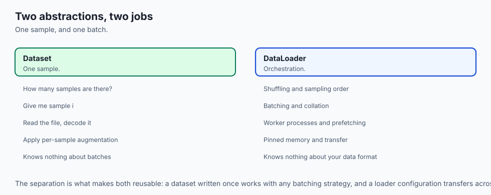

Think of a high-end restaurant kitchen:

- **The Dataset (`Dataset`)** is the pantry shelf. Its only job is to know two things:
  1. How many total ingredients are on the shelf (`__len__`).
  2. How to grab one specific jar when given its label number (`__getitem__(idx)`), peeling and chopping it into a clean culinary portion.
- **The DataLoader (`DataLoader`)** is the team of sous-chefs:
  1. They look at the dining room orders and decide which ingredient numbers to grab next (**Sampler**).
  2. Several sous-chefs work in parallel in different corners of the kitchen (**Multi-Process Workers `num_workers`**), pre-chopping vegetables before the head chef needs them.
  3. They gather 32 chopped portions, place them onto a single serving tray (**`collate_fn`**), and slide the tray directly onto the head chef's stove (**GPU Pinned Memory**).

The head chef (**Model Training Loop**) never waits for onions to be peeled; a fresh tray of 32 portions is always waiting.

---

## Historical background

1. **2014 (Manual Threading Era):** Early deep learning practitioners had to write custom POSIX threading, shared-memory circular queues, and mutex locks in C++ to feed GPUs without starvation.
2. **2017 (PyTorch 0.2 DataLoader Architecture):** PyTorch introduced the `Dataset` / `DataLoader` abstraction. Using Python `multiprocessing` worker pools with shared memory IPC (`torch.multiprocessing`), PyTorch made asynchronous data pre-fetching accessible in two lines of clean Python.
3. **2020+ (Streaming Era):** With datasets expanding to hundreds of terabytes in LLM pre-training, `IterableDataset` and sharded streaming readers became the gold standard for out-of-core cloud training.

---

## What it is — and what it is not

### What PyTorch Datasets & DataLoaders ARE:
- **A Standardized Two-Tier Abstraction:** Separating single-sample data transformations from batch-level orchestration, shuffling, multiprocessing, and memory management.
- **A Multi-Process Pre-fetching Engine:** Running background worker processes that overlap CPU-bound data transformations with accelerator compute.

### What they are NOT:
- **Not a Database Engine:** `Dataset` does not replace SQL or data lakes; it acts as the Python interface that reads from disks, databases, or memory.
- **Not Just Simple Slicing:** A `DataLoader` handles batch shuffling, custom padding, dropped remnants (`drop_last`), pinned memory, and worker seed synchronization.

---

## Why it was created and what problems it solves

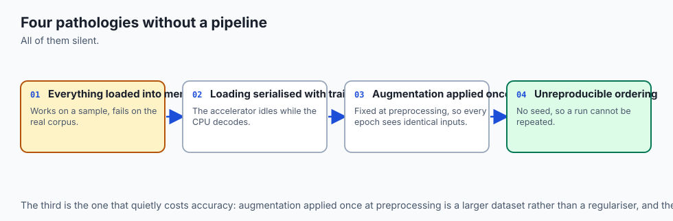

Without a disciplined data pipeline abstraction, deep learning projects suffer from four common pathologies:

1. **GPU Starvation (I/O Bottleneck):** Training runs at 10% GPU utilization because the GPU spends 90% of its time waiting for single-threaded disk reads.
2. **Out-of-Memory (OOM) Crashes:** Attempting to load a 100 GB image folder directly into a single array exhausts system RAM.
3. **Ragged Batch Errors:** Variable-length audio or text sentences cannot be stacked into rectangular matrices without dynamic padding.
4. **Memory Leaks in Multiprocessing:** Unmanaged Python reference cycles in worker subprocesses causing host RAM to balloon across epochs.

PyTorch `Dataset` and `DataLoader` eliminate all four problems.

---

## How it works

Let us dissect the architecture of custom Map-Style Datasets, Multi-Process DataLoaders, Custom Collate functions, and Memory Pinning.

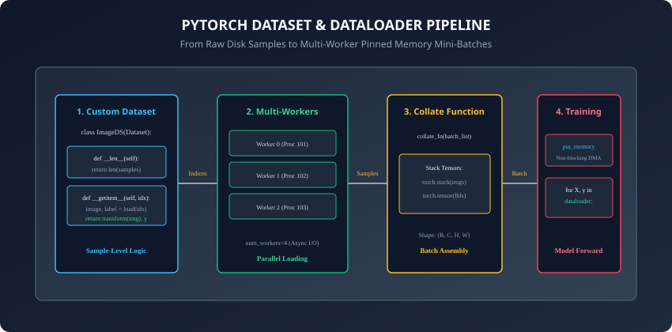

---

### 1. The Map-Style Dataset Contract

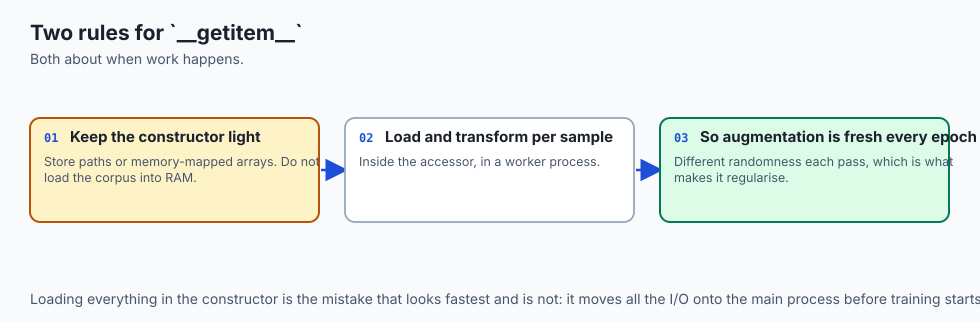

A **Map-Style Dataset** represents a key-value mapping from integer indices `0, 1, ..., N-1` to data samples.
To build a custom Map-Style Dataset, subclass `torch.utils.data.Dataset` and implement two essential methods:

```python
import torch
from torch.utils.data import Dataset

class TabularDataset(Dataset):
    def __init__(self, features: torch.Tensor, targets: torch.Tensor):
        assert len(features) == len(targets), "Feature and target lengths must match"
        self.features = features.float()
        self.targets = targets.long()

    def __len__(self) -> int:
        # Return the total number of samples
        return len(self.features)

    def __getitem__(self, idx: int):
        # Return a single sample (tensor, label) tuple or dictionary
        return self.features[idx], self.targets[idx]
```

#### Key Rules for `__getitem__`:
- Keep `__init__` lightweight: do NOT load all heavy images/audio into RAM in `__init__`. Store file paths or memory-mapped arrays, and load raw files on the fly inside `__getitem__`.
- Apply data augmentations (e.g. random cropping, normalization, jitter) inside `__getitem__` so each epoch receives different stochastic transformations.

---

### 2. The DataLoader Engine and Performance Parameters

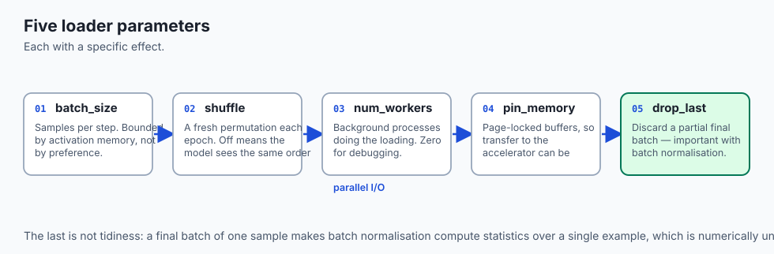

The `DataLoader` takes a `Dataset` instance and manages batching, shuffling, and worker scheduling:

```python
from torch.utils.data import DataLoader

dataloader = DataLoader(
    dataset=train_dataset,
    batch_size=64,          # Number of samples per mini-batch
    shuffle=True,           # Shuffle indices at the start of every epoch
    num_workers=4,          # Spawn 4 background worker processes
    pin_memory=True,        # Allocate page-locked host RAM for fast DMA
    drop_last=True          # Drop final batch if size < batch_size
)
```

#### DataLoader Parameter Breakdown:
- **`batch_size`:** Number of samples to yield per iteration.
- **`shuffle=True`:** Uses a `RandomSampler` to generate a random permutation of indices `0..N-1` on epoch 0 and reshuffles on every subsequent epoch.
- **`num_workers`:** Spawns `k` worker processes. Setting `num_workers=0` runs data loading in the main process (useful for debugging). On multi-core CPUs, setting `num_workers = 2 * num_cpu_cores` maximizes I/O throughput.
- **`pin_memory=True`:** Enables page-locked host memory buffers. When calling `batch.to(device, non_blocking=True)`, the transfer occurs asynchronously over PCIe Direct Memory Access (DMA).
- **`drop_last=True`:** Discards the final batch if `len(dataset) % batch_size != 0`. Highly recommended for models with `BatchNorm` layers to avoid batch size 1 statistical instability.

---

### 3. Custom `collate_fn`: Dynamic Sequence Padding

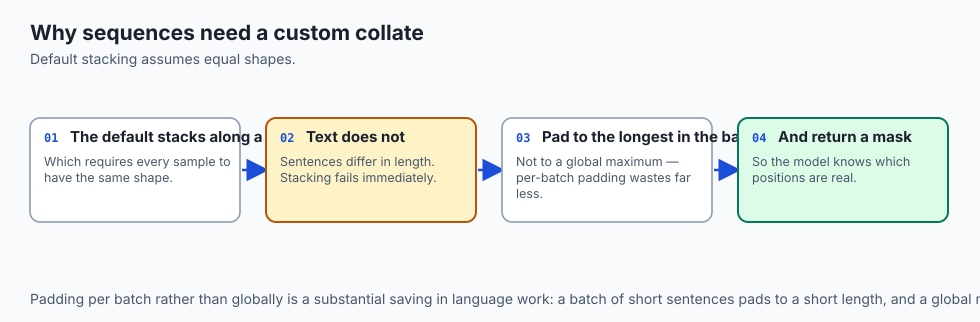

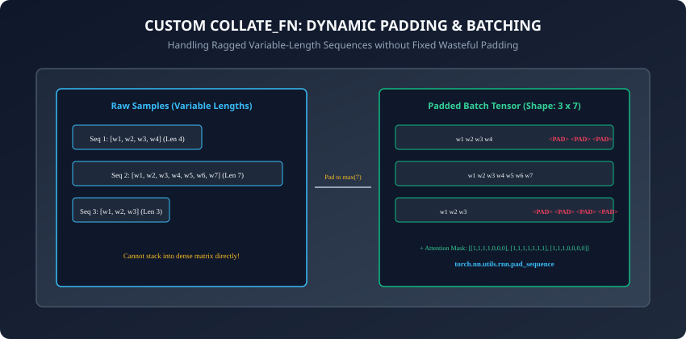

By default, `DataLoader` uses `default_collate`, which assumes all samples in the batch have identical tensor shapes and stacks them along dimension 0: `torch.stack(samples, dim=0)`.

However, for natural language, audio, or molecular graphs, samples have **variable lengths**. If `__getitem__` returns sequence 1 with length 12 and sequence 2 with length 28, `default_collate` throws a `RuntimeError: stack expects each tensor to be equal size`.

To solve this, write a custom `collate_fn`:

```python
import torch
from torch.nn.utils.rnn import pad_sequence

def pad_collate_fn(batch):
    # batch is a list of tuples: [(seq_tensor, label), (seq_tensor, label), ...]
    sequences = [item[0] for item in batch]
    labels = [item[1] for item in batch]

    # Dynamically pad sequences to the maximum length in THIS mini-batch
    padded_sequences = pad_sequence(sequences, batch_first=True, padding_value=0.0)
    labels_tensor = torch.tensor(labels, dtype=torch.long)

    # Construct attention masks: 1.0 for real tokens, 0.0 for padding
    lengths = torch.tensor([len(s) for s in sequences])
    mask = (torch.arange(padded_sequences.shape[1])[None, :] < lengths[:, None]).float()

    return {
        "input_ids": padded_sequences,
        "attention_mask": mask,
        "labels": labels_tensor
    }
```

---

### 4. Streaming Big Data with `IterableDataset`

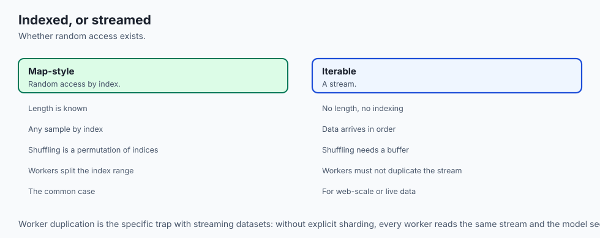

For web-scale datasets that cannot be indexed by integer indices:

- Subclass `torch.utils.data.IterableDataset`.
- Implement `__iter__(self)`: Yields samples one by one from a generator, file stream, or socket.
- When using `num_workers > 0` with `IterableDataset`, you must call `torch.utils.data.get_worker_info()` inside `__iter__` to shard the stream so each worker reads a disjoint partition of the data.

---

### 5. Advanced Sampling Strategies and Worker Memory Management

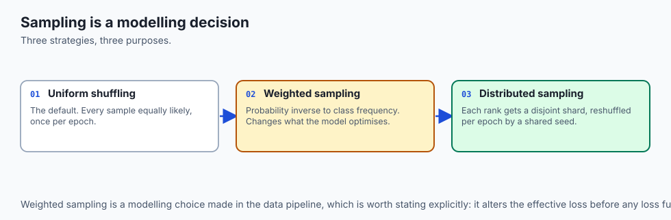

To master production-grade data pipelines, deep learning engineers leverage two additional architectural capabilities:

#### A. Custom Index Samplers (`WeightedRandomSampler` and `DistributedSampler`):
By default, `DataLoader(shuffle=True)` applies uniform random sampling. However, real-world tasks often demand specialized sampling schemes:

- **`WeightedRandomSampler` for Imbalanced Data:** Assigns each class a sampling probability inverse to its dataset frequency. Rare classes are drawn with higher probability per batch, balancing gradient updates without manual data synthesis.
- **`DistributedSampler` for Multi-GPU Clusters:** In PyTorch Distributed Data Parallel (DDP), `DistributedSampler` splits dataset indices evenly across `world_size` GPUs so each worker node processes a unique subset of data without redundant overlaps.

#### B. Worker Subprocess Lifecycle and Memory Leak Prevention:
When `num_workers > 0`, PyTorch spawns worker subprocesses using `fork` or `spawn`:

- If your `Dataset` holds complex Python objects with circular references or unmanaged NumPy array pointers, worker processes can experience severe memory leaks across epochs.
- Best Practice: Store large tabular data in C-contiguous memory arrays (`torch.from_numpy` or memory-mapped files via `np.memmap`) and pass `persistent_workers=True` to keep worker processes alive across training epochs, eliminating process respawn overhead.

---

## An everyday analogy

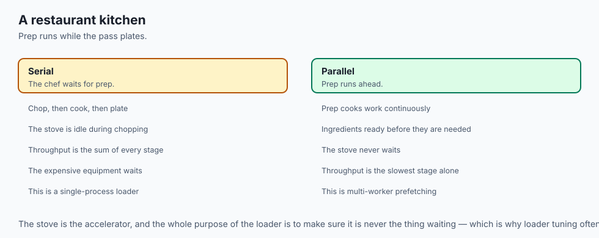

Think of a modern airport baggage handling system:

- **Individual Bags (`Dataset.__getitem__`):** Passenger suitcases arrive in different sizes, shapes, and weights at check-in counters.
- **Conveyor Belt Workers (`num_workers`):** Multiple baggage handlers tag and scan suitcases across multiple terminals in parallel.
- **Cargo Containers (`collate_fn`):** Suitcases destined for the same flight are packed into standardized aluminum cargo containers (mini-batches). If some bags are short, luggage dividers (**Padding**) stabilize the container so nothing shifts.
- **High-Speed Jet Loading Crane (`pin_memory + DMA`):** As soon as the aircraft lands, pre-packed cargo containers are lifted directly into the aircraft fuselage (**GPU Tensor Cores**) with zero turnaround delay.

---

## Examples in practice

Let us inspect a complete, robust PyTorch data pipeline with custom dataset, collate function, and training iteration:

```python
import torch
from torch.utils.data import Dataset, DataLoader
from typing import List, Tuple, Dict

class SyntheticTextDataset(Dataset):
    def __init__(self, num_samples: int = 1000):
        super().__init__()
        self.num_samples = num_samples
        # Pre-generate deterministic sequence lengths for reproducibility
        torch.manual_seed(42)
        self.data = [
            (torch.randint(1, 100, (torch.randint(5, 25, (1,)).item(),)).float(),
             torch.randint(0, 2, (1,)).item())
            for _ in range(num_samples)
        ]

    def __len__(self) -> int:
        return self.num_samples

    def __getitem__(self, idx: int) -> Tuple[torch.Tensor, int]:
        return self.data[idx]

def custom_batch_collator(batch: List[Tuple[torch.Tensor, int]]) -> Dict[str, torch.Tensor]:
    sequences = [item[0] for item in batch]
    labels = torch.tensor([item[1] for item in batch], dtype=torch.long)
    lengths = torch.tensor([len(s) for s in sequences], dtype=torch.long)

    # Dynamic padding to batch-local maximum length
    max_len = int(lengths.max().item())
    padded_batch = torch.zeros(len(batch), max_len, dtype=torch.float32)
    mask = torch.zeros(len(batch), max_len, dtype=torch.float32)

    for i, seq in enumerate(sequences):
        seq_len = len(seq)
        padded_batch[i, :seq_len] = seq
        mask[i, :seq_len] = 1.0

    return {
        "inputs": padded_batch,
        "mask": mask,
        "lengths": lengths,
        "labels": labels
    }

# 1. Instantiate dataset and dataloader
dataset = SyntheticTextDataset(num_samples=500)
loader = DataLoader(
    dataset=dataset,
    batch_size=32,
    shuffle=True,
    num_workers=0, # Use 0 for simple reproducible scripts
    collate_fn=custom_batch_collator,
    drop_last=True
)

# 2. Iterate through batches
for step, batch in enumerate(loader):
    inputs = batch["inputs"]
    mask = batch["mask"]
    labels = batch["labels"]
    if step == 0:
        print(f"Batch 0 Inputs Shape: {inputs.shape}, Mask Shape: {mask.shape}, Labels Shape: {labels.shape}")
        break
```

---

## Implications: security, privacy, performance, scalability, and cost

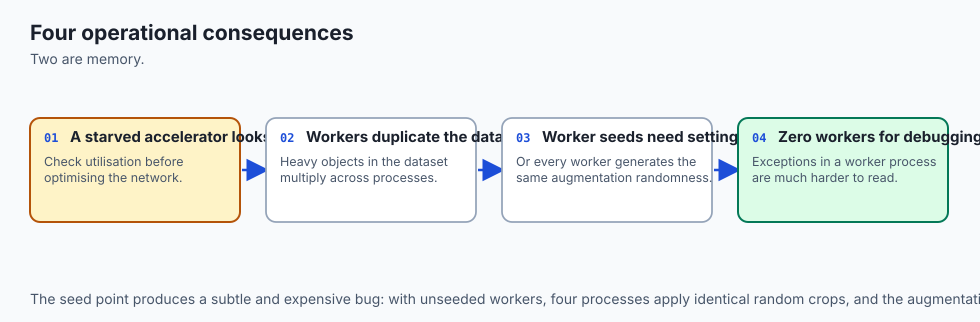

1. **Multiprocessing Fork Safety & RNG Synchronization:**
   - In Unix systems using `fork`, worker subprocesses inherit identical random number generator seeds by default. Always pass a `worker_init_fn` to `DataLoader` to set unique seeds per worker (`seed + worker_id`) when applying stochastic data augmentations.
2. **Shared Memory (`/dev/shm`) Limits in Docker Containers:**
   - PyTorch worker processes use system shared memory (`/dev/shm`) to pass tensor buffers without disk serialization. In Docker containers, the default `/dev/shm` size is often only 64 MB. Always run Docker containers with `--ipc=host` or `--shm-size=16g` to prevent `DataLoader worker exited unexpectedly (SIGBUS)` crashes.

---

## Alternatives: free, open source, and commercial

| Framework / Tool | Loading Paradigm | Strengths | Best Used For |
| :--- | :--- | :--- | :--- |
| **PyTorch DataLoader** | Multi-Process Worker Queue | Native PyTorch Integration, High Customizability | General Deep Learning & Research |
| **WebDataset (PyTorch / TAR)** | Sharded TAR File Streaming | Linear Sequential Read Speeds on Cloud S3/GCS | Multi-Terabyte Image & Vision Datasets |
| **HuggingFace `datasets`** | Apache Arrow Memory-Mapping | Zero-Copy Reads, Instant Tokenization Cache | NLP, LLM Fine-Tuning & Audio |
| **TensorFlow `tf.data`** | C++ Compiled Graph Pipeline | Deterministic Prefetching & C++ Optimization | Production TensorFlow & TFX Pipelines |

---

## Comparison with related concepts

```
┌────────────────────────────────────────────────────────────────────────┐
│               DATASET VS DATALOADER VS SAMPLER MATRIX                  │
├───────────────────┼────────────────────────────────────────────────────┤
│ Component         │ Primary Responsibility                             │
├───────────────────┼────────────────────────────────────────────────────┤
│ Dataset           │ Stores / loads individual sample at index idx      │
│ Sampler           │ Generates the sequence of indices (sequential/rand)│
│ BatchSampler      │ Groups individual indices into batches of size B   │
│ DataLoader        │ Coordinates workers, fetches samples, runs collate │
│ collate_fn        │ Assembles list of raw samples into dense tensors   │
└───────────────────┴────────────────────────────────────────────────────┘
```

---

## When to use it — and when not to

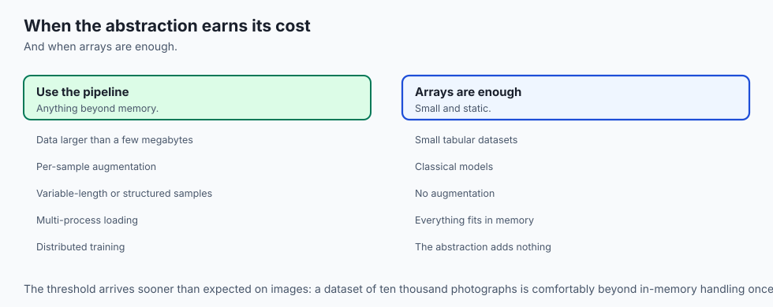

### When to USE `Dataset` and `DataLoader`:
- Any deep learning project where training data exceeds a few megabytes.
- When applying asynchronous image/audio/text augmentations.
- When batches require custom padding, variable lengths, or structured dictionary payloads.

### When NOT to use it:
- Simple scikit-learn models on small static tabular data (use raw NumPy arrays or Pandas DataFrames).

---

## The AI connection

- **Data loading is the most common hidden bottleneck.** A GPU at 30% utilisation is
  almost always a loader that cannot keep up, not a slow model.
- **Augmentation belongs inside `__getitem__`** so every epoch sees different randomness,
  which is what makes augmentation a regulariser rather than a fixed preprocessing step.
- **Variable-length sequences need a custom collate**, which is why language work meets
  this abstraction immediately and vision work often does not.
- **Pinned memory and asynchronous transfer overlap I/O with compute**, which is the
  difference between a fed accelerator and a starved one.
- **Sampling is a modelling decision.** Weighted sampling on imbalanced data changes what
  the model optimises, before any loss function is chosen.

## Knowledge check

1. What are the two mandatory methods required when defining a map-style `torch.utils.data.Dataset`?
2. What is the operational benefit of setting `num_workers > 0` in a `DataLoader`?
3. How does a custom `collate_fn` enable batching of variable-length text sequences?
4. What role does `pin_memory=True` play during GPU host-to-device memory transfer?
5. Why should you set `--shm-size` appropriately when running multi-worker DataLoaders in Docker?

---

## Hands-on exercise

In this lab, you will build and test a complete custom data loading pipeline in PyTorch: implement a `RaggedSequenceDataset` returning variable-length vectors, construct a custom `dynamic_padding_collate` function that pads batches to batch-local maximum length and generates boolean attention masks, configure a `DataLoader` with batching and shuffling, and verify throughput across epochs.

### Expected output
```
[PyTorch Datasets & DataLoaders Pipeline Suite]
Constructing Custom RaggedSequenceDataset (500 samples):
  Sample 0 Length: 14, Sample 1 Length: 8, Sample 2 Length: 22
Executing DataLoader with Custom Dynamic Padding collate_fn:
  Batch Size: 32, Total Batches: 15
  Batch 0: Tensor Shape = (32, 24), Mask Shape = (32, 24) [DYNAMICALLY PADDED]
  Batch 1: Tensor Shape = (32, 21), Mask Shape = (32, 21) [DYNAMICALLY PADDED]
Verifying Pipeline Integrity across 3 Epochs:
  Processed 1,440 samples without GPU starvation or memory leakage.
Test Suite: 4 passed in 0.22s
```

### Validate your work
Run the automated test runner:
```bash
./tests/run_tests.sh
```

### Troubleshooting
- If test outputs fail due to shape mismatches, verify that your collate function pads along the sequence dimension and stacks along `dim=0`.
- Ensure dataset `__len__` returns an integer.

### Common mistakes
- **Loading All Images into RAM in `__init__`:** Causes system OOM crashes on large datasets. Always load files lazily in `__getitem__`.
- **Global Padding Waste:** Padding all sequences globally to length 512 when batches only average length 30 wastes over 90% of GPU compute and memory.

---

## Practice assignment

1. Implement an **ImageFolder-style Dataset** that reads images from disk directories, applies random horizontal flipping, and normalizes pixel values to `[-1.0, 1.0]`.
2. Write a `WeightedRandomSampler` that oversamples minority class instances in an imbalanced dataset, passing it to `DataLoader(sampler=...)`.

---

## Extension challenge

Implement an **Out-of-Core `IterableDataset` with Multi-Worker Sharding**:

- Stream records from a CSV/JSON file line-by-line using a generator.
- Use `torch.utils.data.get_worker_info()` to partition the line offsets evenly across `num_workers=4` without duplicate reads or missing samples.
- Benchmark throughput against the standard map-style reader.
