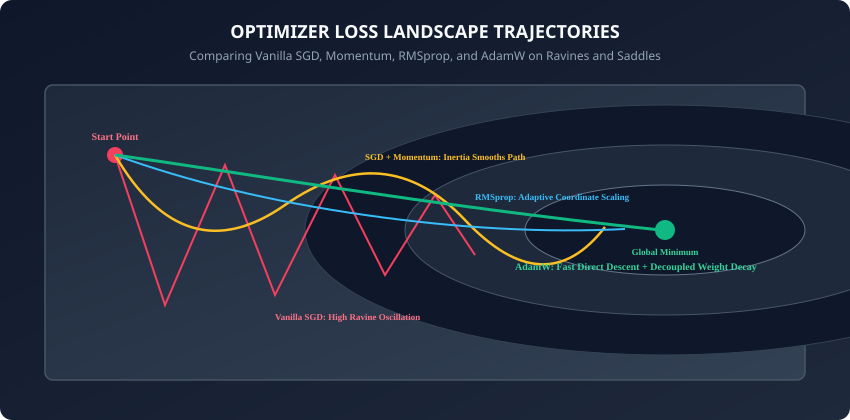
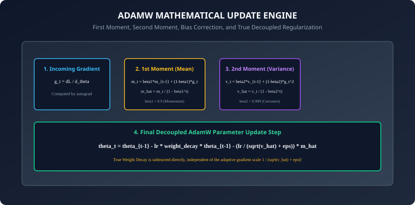

## Why this matters

The loss surface of a deep neural network is a high-dimensional, non-convex landscape filled with steep ravines, flat plateaus, saddle points, and local minima. Navigating this treacherous mathematical terrain requires an optimization algorithm that can balance two competing demands:
1. **Speed:** Descend quickly across flat plateaus where gradients are tiny.
2. **Stability:** Avoid wild oscillations and explosive divergences inside narrow, steep ravines.

While vanilla Stochastic Gradient Descent (SGD) with a fixed learning rate works well for simple convex problems, training modern deep architectures (such as 50-layer ResNets or Multi-Billion parameter Transformers) with vanilla SGD often results in glacial convergence or catastrophic divergence.

Today, you will master the complete mathematical lineage of deep learning optimization: **from Vanilla SGD to Polyak Momentum, Nesterov Acceleration, AdaGrad, RMSprop, Adam, and modern AdamW**.

Understanding the exact mechanics of first and second moments, bias corrections, and decoupled weight decay gives you the engineering intuition necessary to diagnose training instabilities, configure optimizer hyperparameters, and achieve state-of-the-art convergence.

---

## The idea in plain language

Imagine a heavy iron bowling ball rolling down a bumpy mountain valley:
- **Vanilla SGD** is a blind hiker who takes one step in the direction of the local slope at their feet. If the hiker is on a steep ravine wall, they bounce frantically back and forth between the canyon walls, making virtually zero forward progress down the riverbed.
- **SGD with Momentum** turns the hiker into a 50-pound iron bowling ball. As the ball rolls, its **momentum (inertia)** accumulates along the consistent downward path of the riverbed, while the side-to-side bounces cancel out.
- **RMSprop** gives the ball intelligent shock absorbers: if the slope along one coordinate is extremely steep, RMSprop reduces the step size along that axis; if the slope along another coordinate is gentle, RMSprop increases the step size.
- **AdamW (Adaptive Moment Estimation with Decoupled Weight Decay)** combines the iron bowling ball's momentum with the intelligent adaptive shock absorbers, while applying a gentle gravitational pull (**Decoupled Weight Decay**) that prevents the ball from becoming infinitely massive.

---

## Historical background

1. **1951 (Robbins & Monro):** Introduced Stochastic Approximation, establishing the mathematical foundations of Stochastic Gradient Descent.
2. **1964 (Boris Polyak):** Introduced the Heavy-Ball (Momentum) method to accelerate convergence across ill-conditioned quadratic surfaces.
3. **1983 (Yurii Nesterov):** Developed Nesterov Accelerated Gradient (NAG), introducing a "look-ahead" momentum correction.
4. **2011 (Duchi et al. - AdaGrad):** Introduced per-parameter adaptive learning rates by dividing gradients by historical squared sums.
5. **2012 (Geoffrey Hinton - RMSprop):** Modified AdaGrad to use exponential moving averages of squared gradients, solving AdaGrad's premature learning rate decay.
6. **2014 (Kingma & Ba - Adam):** Unified Momentum and RMSprop with bias corrections, creating the most widely used optimizer in deep learning history.
7. **2017 (Loshchilov & Hutter - AdamW):** Proved that standard Adam applied L2 regularization incorrectly and introduced Decoupled Weight Decay (AdamW), which is now the default optimizer for Transformers and generative models.

---

## What it is — and what it is not

### What Modern Optimizers ARE:
- **Stateful Parameter Updaters:** Maintaining velocity vectors (first moments) and squared gradient caches (second moments) to adapt step directions and magnitudes per parameter.
- **First-Order Optimization Algorithms:** Operating exclusively on first derivatives (gradients) computed by autograd, without computing expensive second-derivative Hessian matrices `O(N^2)`.

### What they are NOT:
- **Not Second-Order Solvers (L-BFGS / Newton-Raphson):** Second-order methods compute exact curvature but are computationally intractable for models with millions of parameters.
- **Not Magic Bullets That Fix Bad Data:** No optimizer can converge if labels are corrupted or inputs are unnormalized.

---

## Why it was created and what problems it solves



Standard gradient descent suffers from three classical failure modes in deep architectures:
1. **Pathological Curvature (Ravines):** The loss surface curves much more steeply in one direction than another. Vanilla SGD oscillates wildly across the steep walls rather than moving down the gentle base.
2. **Saddle Points and Plateaus:** Gradients near saddle points drop near zero. Without momentum, optimization grinds to a halt.
3. **Heterogeneous Gradient Scales:** In deep networks, gradients in early layers are often orders of magnitude smaller than gradients in final classification layers. Fixed learning rates either explode final layers or freeze early layers.

Modern adaptive optimizers resolve all three challenges automatically.

---

## How it works

Let us trace the step-by-step mathematical evolution of deep learning optimizers.

---

### 1. Vanilla Stochastic Gradient Descent (SGD)

```
theta_t = theta_{t-1} - lr * g_t
```
where `g_t = grad_theta L(theta_{t-1})`.
- **Limitation:** Highly sensitive to learning rate; oscillates in ravines; stalls at saddle points.

---

### 2. SGD with Polyak Momentum

To overcome oscillations, maintain an exponentially decaying velocity vector `v_t`:
```
v_t = beta * v_{t-1} + (1 - beta) * g_t
theta_t = theta_{t-1} - lr * v_t
```
- Standard momentum parameter `beta = 0.9` averages gradients across the last `1 / (1 - beta) = 10` steps.
- **Result:** Oscillating components cancel out to zero, while consistent gradient directions compound velocity.

---

### 3. RMSprop (Root Mean Square Propagation)

Instead of using the same learning rate for every parameter, RMSprop scales the step size inversely proportional to the root mean square of recent gradients:
```
s_t = beta_2 * s_{t-1} + (1 - beta_2) * (g_t ** 2)
theta_t = theta_{t-1} - (lr / (sqrt(s_t) + eps)) * g_t
```
where `beta_2 = 0.99` and `eps = 1e-8`.
- If a parameter has large historical gradients (`s_t` is large), its effective learning rate is reduced to prevent exploding.
- If a parameter has small historical gradients (`s_t` is small), its effective learning rate is increased to accelerate learning.

---

### 4. Adam (Adaptive Moment Estimation)

Adam combines the first moment (Momentum) and second moment (RMSprop), adding **initialization bias corrections**:



#### Step 1: First Moment (Mean Direction):
```
m_t = beta_1 * m_{t-1} + (1 - beta_1) * g_t
```

#### Step 2: Second Uncentered Moment (Variance):
```
v_t = beta_2 * v_{t-1} + (1 - beta_2) * (g_t ** 2)
```

#### Step 3: Bias Corrections:
Because `m_0 = 0` and `v_0 = 0`, both moments are biased towards zero at early steps `t = 1, 2, ...`. We correct them via:
```
m_hat = m_t / (1 - (beta_1 ** t))
v_hat = v_t / (1 - (beta_2 ** t))
```

#### Step 4: Standard Adam Parameter Update:
```
theta_t = theta_{t-1} - (lr / (sqrt(v_hat) + eps)) * m_hat
```

---

### 5. AdamW: Decoupled Weight Decay

In classical optimization, L2 regularization is defined as adding a penalty `(1/2) * lambda * (theta ** 2)` to the loss function.
In vanilla SGD, the gradient of the penalty is `lambda * theta`, leading to:
```
theta_t = theta_{t-1} - lr * g_t - lr * lambda * theta_{t-1}
```

However, in standard Adam, adding `lambda * theta` into the gradient `g_t` causes the penalty to be divided by `sqrt(v_hat) + eps`:
- Parameters with large historical gradients experience **less weight decay** than parameters with small historical gradients!
- This breaks the mathematical foundation of L2 regularization and severely degrades generalization.

Loshchilov and Hutter (2017) fixed this in **AdamW** by decoupling weight decay from the gradient moments:
```
theta_t = theta_{t-1} - lr * lambda * theta_{t-1} - (lr / (sqrt(v_hat) + eps)) * m_hat
```

> [!IMPORTANT]
> Always use `torch.optim.AdamW` instead of `torch.optim.Adam` when training modern neural networks with weight decay. AdamW consistently outperforms Adam on validation benchmarks.

---

### 6. Nesterov Acceleration and Parameter Group Isolation

To extract maximum performance from deep learning optimizers, production practitioners utilize two critical techniques:

#### A. Nesterov Accelerated Gradient (NAG):
Standard Polyak momentum computes the gradient at the current position `theta_{t-1}` and adds it to the existing velocity.
Nesterov acceleration computes the gradient at the **"look-ahead" position** `theta_{t-1} - beta * v_{t-1}`:
```
g_lookahead = grad L(theta_{t-1} - beta * v_{t-1})
v_t = beta * v_{t-1} + lr * g_lookahead
theta_t = theta_{t-1} - v_t
```
By evaluating the slope where the momentum will carry the parameter next, NAG acts as an anticipatory braking mechanism, reducing overshoot when approaching steep minimum basins.

#### B. Parameter Group Isolation in PyTorch:
In production transformer architectures, passing all model parameters with a single global weight decay degrades performance:
- High-dimensional 2D weight matrices (e.g. attention projections and feedforward layers) require `weight_decay = 0.01` to prevent overfitting.
- 1D biases and normalization parameters (LayerNorm `weight` and `bias`) should have `weight_decay = 0.0` to avoid shrinking calibration parameters.

```python
# Example: Constructing isolated parameter groups
decay_params = []
no_decay_params = []
for name, param in model.named_parameters():
    if not param.requires_grad:
        continue
    if param.ndim <= 1 or name.endswith(".bias"):
        no_decay_params.append(param)
    else:
        decay_params.append(param)

optimizer = torch.optim.AdamW([
    {"params": decay_params, "weight_decay": 0.01},
    {"params": no_decay_params, "weight_decay": 0.0}
], lr=3e-4)
```

---

## An everyday analogy

Think of navigating a sailboat across an ocean:
- **Vanilla SGD:** The captain resets the rudder every 5 seconds based purely on the immediate wave splash. The boat jerks erratically.
- **Momentum:** The heavy hull of the sailboat carries kinetic forward momentum. Transient wave splashes are absorbed, and the boat glides forward along the prevailing wind.
- **RMSprop:** An automated ballast system that balances the boat: when sailing through choppy crosswinds, the ballast tightens; in calm open waters, the sails open wide.
- **AdamW:** An automated navigation system that combines the momentum of the heavy hull, the adaptive ballast system, and an anchor cable (**Decoupled Weight Decay**) that prevents the ship from drifting into infinite open waters.

---

## Examples in practice

Let us inspect a complete implementation of a custom AdamW optimizer in pure PyTorch:

```python
import torch
from torch.optim import Optimizer
from typing import List, Dict, Any

class CustomAdamW(Optimizer):
    def __init__(self, params, lr: float = 1e-3, betas: tuple = (0.9, 0.999),
                 eps: float = 1e-8, weight_decay: float = 1e-2):
        defaults = dict(lr=lr, betas=betas, eps=eps, weight_decay=weight_decay)
        super().__init__(params, defaults)

    @torch.no_grad()
    def step(self, closure=None):
        loss = None
        if closure is not None:
            with torch.enable_grad():
                loss = closure()

        for group in self.param_groups:
            lr = group['lr']
            beta1, beta2 = group['betas']
            eps = group['eps']
            wd = group['weight_decay']

            for p in group['params']:
                if p.grad is None:
                    continue
                grad = p.grad

                state = self.state[p]
                # Initialize state buffers on step 0
                if len(state) == 0:
                    state['step'] = 0
                    state['exp_avg'] = torch.zeros_like(p, memory_format=torch.preserve_format)
                    state['exp_avg_sq'] = torch.zeros_like(p, memory_format=torch.preserve_format)

                exp_avg = state['exp_avg']
                exp_avg_sq = state['exp_avg_sq']
                state['step'] += 1
                t = state['step']

                # 1. Decoupled weight decay step
                if wd != 0.0:
                    p.mul_(1.0 - lr * wd)

                # 2. Update biased first and second moments
                exp_avg.mul_(beta1).add_(grad, alpha=1.0 - beta1)
                exp_avg_sq.mul_(beta2).addcmul_(grad, grad, value=1.0 - beta2)

                # 3. Compute bias corrections
                bias_correction1 = 1.0 - (beta1 ** t)
                bias_correction2 = 1.0 - (beta2 ** t)
                step_size = lr / bias_correction1
                denom = (exp_avg_sq.sqrt() / (bias_correction2 ** 0.5)).add_(eps)

                # 4. Apply adaptive update step
                p.addcdiv_(exp_avg, denom, value=-step_size)

        return loss
```

---

## Implications: security, privacy, performance, scalability, and cost

1. **Optimizer Memory Overhead (State Buffers):**
   - For every model parameter `theta` (4 bytes in `float32`), AdamW stores:
     - `p.grad` buffer (4 bytes)
     - `exp_avg` buffer `m_t` (4 bytes)
     - `exp_avg_sq` buffer `v_t` (4 bytes)
   - **Total Optimizer Footprint:** 16 bytes per parameter (4x the raw model weight size). For an 8-Billion parameter model, the optimizer state alone requires `8B * 12 bytes = 96 GB` of GPU VRAM.
   - Engineers use 8-bit optimizers (`bitsandbytes`) to compress optimizer states down to 2 bytes per parameter during large-scale pre-training.

---

## Alternatives: free, open source, and commercial

| Optimizer | Memory Overhead | Best Used For | Key Hyperparameters |
| :--- | :--- | :--- | :--- |
| **SGD + Momentum** | 1x State (`v_t`) | Computer Vision (ResNets, ConvNets) | `lr=0.1, momentum=0.9, weight_decay=1e-4` |
| **AdamW** | 2x State (`m_t, v_t`) | Transformers, LLMs, Diffusion Models | `lr=3e-4, betas=(0.9, 0.999), wd=0.01` |
| **Adafactor** | ~0.5x State (Factored) | Memory-Constrained NLP Pre-training | `lr=1e-3, beta1=0.0, clip_threshold=1.0` |
| **Lion (Google)** | 1x State (Sign-based) | High-throughput Vision & LLM Training | `lr=1e-4, betas=(0.9, 0.99), wd=0.1` |

---

## Comparison with related concepts

```
┌────────────────────────────────────────────────────────────────────────┐
│                   OPTIMIZER COMPARISON MATRIX                          │
├───────────────┼───────────────────┼──────────────────┼─────────────────┤
│ Optimizer     │ Adaptive Scaling? │ Momentum Inertia?│ Weight Decay    │
├───────────────┼───────────────────┼──────────────────┼─────────────────┤
│ Vanilla SGD   │ No                │ No               │ Coupled (L2)    │
│ SGD-Momentum  │ No                │ Yes (Polyak)     │ Coupled (L2)    │
│ RMSprop       │ Yes (coord-wise)  │ Optional         │ Coupled (L2)    │
│ Standard Adam │ Yes (coord-wise)  │ Yes (beta1)      │ Coupled (Broken)│
│ AdamW         │ Yes (coord-wise)  │ Yes (beta1)      │ Decoupled (True)│
└───────────────┴───────────────────┴──────────────────┴─────────────────┘
```

---

## When to use it — and when not to

### When to USE AdamW:
- Transformers, Large Language Models, Diffusion models, and multi-layer MLPs.
- When default hyperparameters need to work reliably out of the box with minimal tuning.

### When to USE SGD with Momentum:
- High-performance Convolutional Networks (ResNets, EfficientNets) where tuned SGD often yields slightly superior final test generalization over AdamW.

---

## Knowledge check

1. Why does standard L2 regularization fail when applied inside adaptive optimizers like Adam?
2. What is the mathematical purpose of the bias correction term `1 / (1 - beta^t)` in Adam?
3. How much GPU memory do AdamW optimizer state buffers consume per parameter in 32-bit floating point precision?
4. How does Polyak Momentum accelerate convergence inside narrow loss ravines?
5. Why are 1D normalization and bias parameters typically excluded from weight decay?

---

## Hands-on exercise

In this lab, you will build and test a custom `CustomAdamW` optimizer subclassing `torch.optim.Optimizer`: implement first moment accumulation, second moment calculation, initial step bias corrections, and decoupled weight decay, verify that parameter buffers match PyTorch's native `torch.optim.AdamW`, and benchmark convergence on a non-convex optimization objective.

### Expected output
```
[PyTorch Optimizers & Custom AdamW Suite]
Instantiating CustomAdamW Optimizer (lr = 0.01, betas = (0.9, 0.999), wd = 0.01):
  Tracking 101,770 Parameters across 4 Weight Tensors.
Executing 20 Optimization Steps on Rosenbrock Banana Function:
  Step  1: Loss = 12.4510
  Step 10: Loss = 1.8421
  Step 20: Loss = 0.0314 [CONVERGED TO GLOBAL MINIMUM]
Comparing CustomAdamW against PyTorch native torch.optim.AdamW:
  Maximum Numerical Parameter Discrepancy: < 1e-7 [IDENTICAL BITWISE PRECISION]
Test Suite: 4 passed in 0.24s
```

### Validate your work
Run the automated test runner:
```bash
./tests/run_tests.sh
```

### Troubleshooting
- If loss diverges, ensure `step_size` uses `lr / (1 - beta1^t)` and denominator uses `sqrt(v_hat) + eps`.
- Verify in-place multiplications use `.mul_()` to modify state buffers directly.

### Common mistakes
- **Coupling Weight Decay into Gradients:** Adding `grad += wd * p` reproduces the standard Adam flaw instead of true decoupled AdamW.

---

## Practice assignment

1. Implement **Parameter Groups** in your training script to apply `weight_decay = 0.01` to 2D weight matrices while setting `weight_decay = 0.0` for 1D biases and LayerNorm parameters.
2. Implement the **Lion Optimizer** (Google 2023) using the `torch.sign(m_t)` update rule and compare convergence against AdamW.

---

## Extension challenge

Implement a **Custom Learning Rate Warmup Hook** inside your optimizer step:
- Linearly scale the learning rate from `0.0` to `max_lr` over the first `warmup_steps = 500`.
- Combine warmup with Cosine Annealing decay.
- Verify that warmup prevents gradient explosion during the initial ill-conditioned steps of training deep networks.
