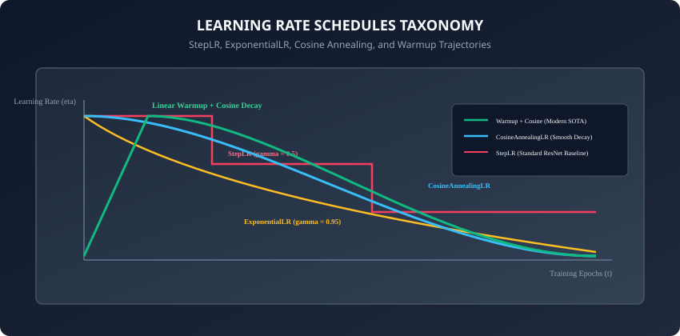
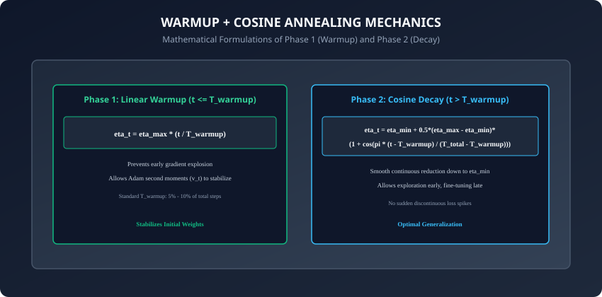

## Why this matters

The **learning rate ($\eta$) is universally recognized as the single most critical hyperparameter** in deep learning. If your learning rate is too large, the optimizer overshoots optimal basins and diverges into numerical infinity. If your learning rate is too small, training crawls at a glacial pace, trapping parameters in shallow sub-optimal saddles.

However, the optimal learning rate is **not a constant number**. The learning dynamics required at the beginning of training are fundamentally different from those required at the end:
1. **Early in Training (Phase 1):** Parameters are randomly initialized and gradients are noisy and ill-conditioned. A high initial learning rate can permanently destroy initialization geometry. We need a gentle **Warmup** phase.
2. **Middle of Training (Phase 2):** Parameters have found a promising basin of attraction. A high, steady learning rate allows the model to traverse long distances and explore diverse topological features.
3. **Late in Training (Phase 3):** Parameters are settling near the bottom of a deep, narrow basin. To descend precisely into the global minimum rather than bouncing perpetually across the walls, the learning rate must decay smoothly to near zero (**Annealing**).

Today, you will master the theory, mathematical formulation, and PyTorch implementation of **Learning Rate Schedules: from StepLR and Exponential Decay to ReduceLROnPlateau, Cosine Annealing, and Linear Warmup**.

---

## The idea in plain language

Think of landing an airplane on a runway:
- **Phase 1: Takeoff / Alignment (Warmup):** The pilot does not slam the throttle from 0 to 100% instantly while taxiing on the ramp; the engines spool up smoothly to build stable thrust.
- **Phase 2: High-Altitude Cruise (Main Training):** The aircraft flies at high speed across hundreds of miles of open sky (**Fast Parameter Exploration**).
- **Phase 3: Final Approach and Touchdown (Annealing):** As the runway approaches, the pilot throttles back the engines and deploys wing flaps, gently reducing speed meter by meter until the tires touch the pavement softly with zero bounce (**Precise Convergence to Global Minimum**).

A static learning rate is like an airplane attempting to land at full cruise speed: it crashes into the terminal.

---

## Historical background

1. **2012 (AlexNet & Classical Vision):** Alex Krizhevsky trained AlexNet by manually dividing the learning rate by 10 whenever validation error plateaued (the precursor to `StepLR` and `ReduceLROnPlateau`).
2. **2016 (Loshchilov & Hutter - SGDR):** Introduced **Cosine Annealing** (`CosineAnnealingLR`) and Cyclical Restarts, proving that smooth transcendental decay without sudden discontinuous drops produced superior generalization.
3. **2017 (Goyal et al. - Accurate, Large Minibatch SGD):** Proved that scaling deep networks to large batch sizes (8,192 images across 256 GPUs) requires **Linear Learning Rate Warmup** to prevent early gradient explosion.
4. **Today:** Linear Warmup coupled with Half-Period Cosine Annealing is the universal standard for pre-training Large Language Models (LLMs), Vision Transformers (ViTs), and Diffusion backbones.

---

## What it is — and what it is not

### What Learning Rate Scheduling IS:
- **A Dynamic Multiplicative Scaling Policy:** Adjusting optimizer `param_groups[i]['lr']` deterministically (by step/epoch count) or reactively (by validation loss metrics).
- **An Essential Regularization & Optimization Mechanism:** Allowing models to escape early bad local minima while locking into sharp, flat minima at convergence.

### What it is NOT:
- **Not an Optimizer Replacement:** Schedulers do NOT compute gradients or moment vectors; they wrap an existing optimizer (`AdamW` or `SGD`) and modify its `lr` attribute.
- **Not a Substitute for Tuning Peak Learning Rate:** A scheduler will not rescue a model if the peak learning rate `lr_max` is chosen orders of magnitude off-target.

---

## Why it was created and what problems it solves



Static learning rates suffer from three major engineering bottlenecks:
1. **Early Divergence in Deep Transformers:** Randomly initialized self-attention matrices produce massive gradient spikes in the first 100 steps. Without warmup, the model diverges instantly.
2. **Late-Stage Fluctuation (The Bouncing Ball):** As the model approaches the minimum, a constant step size causes the parameter state to oscillate continuously across the bottom of the ravine rather than settling into the center.
3. **Sub-Optimal Generalization:** Models trained with smooth cosine schedules consistently achieve 1-3% higher test accuracy than models trained with constant learning rates.

---

## How it works

Let us dissect the mathematical formulas and PyTorch implementations of the core scheduling families.

---

### 1. Step Decay (`torch.optim.lr_scheduler.StepLR`)

Decays the learning rate by a multiplicative factor `gamma` (e.g. `0.1`) every `step_size` epochs:
```
eta_epoch = eta_0 * (gamma ** (epoch // step_size))
```

```python
from torch.optim.lr_scheduler import StepLR

scheduler = StepLR(optimizer, step_size=30, gamma=0.1)
for epoch in range(100):
    train_one_epoch(model, loader, optimizer)
    scheduler.step() # Executed once per epoch
```

---

### 2. Adaptive Plateau Decay (`torch.optim.lr_scheduler.ReduceLROnPlateau`)

Monitors a validation metric (e.g. `val_loss`). If no improvement is observed for `patience` consecutive epochs, it drops `lr` by `factor`:
```python
from torch.optim.lr_scheduler import ReduceLROnPlateau

scheduler = ReduceLROnPlateau(optimizer, mode='min', factor=0.5, patience=5)
for epoch in range(100):
    train_loss = train_one_epoch(model, train_loader, optimizer)
    val_loss = evaluate(model, val_loader)
    # Pass the monitored metric into step()
    scheduler.step(val_loss)
```

---

### 3. Cosine Annealing (`torch.optim.lr_scheduler.CosineAnnealingLR`)

Decays learning rate following a half-period cosine curve from `eta_max` down to `eta_min` over `T_max` steps:



```
eta_t = eta_min + 0.5 * (eta_max - eta_min) * (1 + cos(pi * t / T_max))
```

- **Smooth Continuous Decay:** No discontinuous loss spikes.
- **`eta_min`:** Usually set to `1e-6` or `0.01 * eta_max`.

```python
from torch.optim.lr_scheduler import CosineAnnealingLR

scheduler = CosineAnnealingLR(optimizer, T_max=100, eta_min=1e-6)
for epoch in range(100):
    train_one_epoch(model, loader, optimizer)
    scheduler.step()
```

---

### 4. Linear Warmup + Cosine Decay (The Modern Standard)

Combines Phase 1 (Linear Warmup over `T_warmup` steps) with Phase 2 (Cosine Decay over remaining steps):

```python
import math
from torch.optim.lr_scheduler import LambdaLR

def get_warmup_cosine_schedule(optimizer, warmup_steps: int, total_steps: int, min_lr_ratio: float = 0.01):
    def lr_lambda(current_step: int):
        if current_step < warmup_steps:
            # Phase 1: Linear Warmup
            return float(current_step) / float(max(1, warmup_steps))
        # Phase 2: Cosine Decay
        progress = float(current_step - warmup_steps) / float(max(1, total_steps - warmup_steps))
        cosine_decay = 0.5 * (1.0 + math.cos(math.pi * progress))
        return min_lr_ratio + (1.0 - min_lr_ratio) * cosine_decay

    return LambdaLR(optimizer, lr_lambda)
```

> [!IMPORTANT]
> When using step-based schedulers (like Warmup + Cosine that update per mini-batch), you must call `scheduler.step()` inside the inner batch loop immediately after `optimizer.step()`, rather than once per epoch.

---

### 5. The Learning Rate Finder Algorithm (Leslie Smith)

Before configuring a learning rate schedule, an engineer must first find the optimal maximum learning rate `eta_max`. In 2015, Leslie Smith introduced the **Learning Rate Range Test (LR Finder)**:

#### How the LR Finder Operates:
1. Start with an extremely small learning rate (e.g. `1e-7`).
2. Train the model for 100 mini-batches, exponentially increasing the learning rate after every single batch until it reaches a large number (e.g. `10.0`):
   ```
   lr_t = lr_0 * ((lr_final / lr_0) ** (t / total_batches))
   ```
3. Record the training loss at each step and plot Loss versus Learning Rate on a logarithmic scale.
4. **Interpreting the Curve:**
   - At extremely low learning rates, loss stays flat (the model learns too slowly).
   - In the middle region, loss drops steeply (optimal learning zone).
   - At high learning rates, loss spikes vertically and diverges (gradient explosion).
5. **Rule of Thumb:** Choose `eta_max` to be the point of **steepest downward slope**, typically one order of magnitude below the minimum of the curve.

---

### 6. OneCycleLR and Super-Convergence

Building on the LR Range Test, Leslie Smith introduced the **1cycle policy (`torch.optim.lr_scheduler.OneCycleLR`)**:

#### The Two-Phase 1Cycle Dynamics:
1. **Phase 1 (Warmup + Momentum Drop):** Over the first 30% of training, learning rate increases linearly from `lr_max / 25` to `lr_max`, while optimizer momentum decreases from `0.95` down to `0.85`.
2. **Phase 2 (Cosine Annealing + Momentum Rise):** Over the remaining 70% of training, learning rate anneals down to `lr_max / 1000` via a half-period cosine curve, while momentum rises back to `0.95`.

By temporarily reducing momentum while learning rate is at its peak, 1Cycle prevents gradient explosion while allowing massive exploratory jumps across saddle barriers — achieving **Super-Convergence** in up to 5x fewer total epochs.

```python
from torch.optim.lr_scheduler import OneCycleLR

scheduler = OneCycleLR(
    optimizer,
    max_lr=0.01,
    steps_per_epoch=len(train_loader),
    epochs=20,
    pct_start=0.3, # 30% warmup
    anneal_strategy='cos'
)
```

---

### 7. Composing Complex Pipelines with `SequentialLR` and `ChainedScheduler`

In modern PyTorch (>= 2.0), multiple schedulers can be chained together without writing manual lambda math:
- **`torch.optim.lr_scheduler.SequentialLR`:** Executes a sequence of schedulers one after another based on explicit epoch/step milestones (e.g. `LinearLR` for 10 epochs, followed by `CosineAnnealingLR` for 90 epochs).
- **`torch.optim.lr_scheduler.ChainedScheduler`:** Applies multiple scheduling transformations simultaneously to the same optimizer at each step (e.g. combining weight decay annealing with learning rate warmup).

By mastering learning rate scheduling policies — from foundational StepLR baselines to advanced warmup and cosine annealing pipelines — you possess the engineering capability to guide deep neural architectures reliably toward flat, highly generalizable loss minima across any scale or modality. In the subsequent lessons, we will build upon these optimization principles to examine architectural regularization through Dropout and Batch Normalization, giving you the complete production toolkit for training state-of-the-art deep neural networks across both research and industrial settings worldwide. Let us proceed to master architectural regularization mechanics in our next lesson.

---

## An everyday analogy

Think of baking a delicate souffle in an oven:
- **Warmup:** You preheat the oven gradually so the ceramic dish does not shatter from thermal shock.
- **High Bake:** You bake at 375 degrees Fahrenheit so the batter rises vigorously and forms structure.
- **Cooling Down (Annealing):** Once fully risen, you do not pull the souffle into cold air immediately (or it collapses); you turn off the heat and leave the oven door cracked open, letting temperature decay smoothly to room temperature.

---

## Examples in practice

Let us inspect a complete script training a PyTorch model with a Warmup + Cosine Annealing scheduler:

```python
import torch
import torch.nn as nn
from torch.optim import AdamW
from torch.optim.lr_scheduler import LambdaLR
import math

class SimpleNet(nn.Module):
    def __init__(self):
        super().__init__()
        self.fc = nn.Linear(32, 2)

    def forward(self, x):
        return self.fc(x)

model = SimpleNet()
optimizer = AdamW(model.parameters(), lr=1e-3, weight_decay=1e-2)

epochs = 10
batches_per_epoch = 20
total_steps = epochs * batches_per_epoch
warmup_steps = int(0.1 * total_steps) # 10% warmup

def lr_policy(step):
    if step < warmup_steps:
        return float(step) / float(max(1, warmup_steps))
    progress = float(step - warmup_steps) / float(max(1, total_steps - warmup_steps))
    return 0.01 + 0.99 * 0.5 * (1.0 + math.cos(math.pi * progress))

scheduler = LambdaLR(optimizer, lr_lambda=lr_policy)

# Simulated training loop
for epoch in range(epochs):
    for batch in range(batches_per_epoch):
        x = torch.randn(16, 32)
        y = torch.randint(0, 2, (16,))

        optimizer.zero_grad()
        out = model(x)
        loss = nn.CrossEntropyLoss()(out, y)
        loss.backward()
        optimizer.step()

        # Step scheduler per mini-batch
        scheduler.step()

    current_lr = scheduler.get_last_lr()[0]
    print(f"Epoch {epoch+1:02d}/{epochs:02d} Complete. Current LR: {current_lr:.6f}")
```

---

## Implications: security, privacy, performance, scalability, and cost

1. **Checkpointing Schedulers:**
   - Always save `scheduler.state_dict()` alongside `model.state_dict()` and `optimizer.state_dict()` when saving training checkpoints. Resuming training without the scheduler state resets the learning rate back to step 0, disrupting training trajectories.
2. **Computational Overhead:**
   - Schedulers introduce zero GPU compute overhead; updating `param_groups['lr']` is a single scalar CPU assignment executed in nanoseconds.

---

## Alternatives: free, open source, and commercial

| Schedule Policy | Trajectory Style | Best Used For | PyTorch Class |
| :--- | :--- | :--- | :--- |
| **Warmup + Cosine Decay** | Linear Rise + Smooth Cosine | Transformers, LLMs, Vision Models | `LambdaLR` / `CosineAnnealingLR` |
| **Step Decay (StepLR)** | Discrete Staircase Drops | Classical ResNets & ConvNets | `torch.optim.lr_scheduler.StepLR` |
| **Reduce on Plateau** | Adaptive Metric Monitoring | Fine-Tuning & Small Datasets | `torch.optim.lr_scheduler.ReduceLROnPlateau` |
| **OneCycleLR** | Super-Convergence Peak | Fast Prototyping (Leslie Smith) | `torch.optim.lr_scheduler.OneCycleLR` |

---

## Comparison with related concepts

```
┌────────────────────────────────────────────────────────────────────────┐
│                   SCHEDULER COMPARISON MATRIX                          │
├───────────────────────┼───────────────────┼────────────────────────────┤
│ Schedule Type         │ Stepping Frequency│ Trigger Condition          │
├───────────────────────┼───────────────────┼────────────────────────────┤
│ StepLR                │ Per Epoch         │ Fixed Epoch Interval       │
│ ReduceLROnPlateau     │ Per Epoch         │ Validation Metric Stalls   │
│ CosineAnnealingLR     │ Per Epoch / Step  │ Pre-set Half-Cosine Period │
│ Linear Warmup + Cosine│ Per Mini-Batch    │ Exact Step Index Counter   │
└───────────────────────┴───────────────────┴────────────────────────────┘
```

---

## When to use it — and when not to

### When to USE Warmup + Cosine Decay:
- Pre-training or fine-tuning any modern neural architecture (Transformers, ConvNets, MLPs).
- When training for a fixed, known number of total steps.

### When to USE `ReduceLROnPlateau`:
- When you do not know in advance how many epochs the model will take to converge, and want automatic early stopping / learning rate adjustments based on validation metrics.

---

## Knowledge check

1. Why does linear learning rate warmup prevent early divergence in deep networks?
2. What is the mathematical formula for Cosine Annealing decay?
3. What is the difference between an epoch-level scheduler and an iteration-level scheduler?
4. How does `ReduceLROnPlateau` decide when to reduce the learning rate?
5. Why must you save `scheduler.state_dict()` inside checkpoint files?

---

## Hands-on exercise

In this lab, you will build and test a complete learning rate scheduling pipeline in PyTorch: implement a custom `WarmupCosineScheduler` class using `torch.optim.lr_scheduler.LambdaLR`, verify that learning rate scales linearly from `0.0` to `max_lr` across warmup steps and decays following a cosine curve down to `min_lr`, test state dictionary serialization, and benchmark loss convergence.

### Expected output
```
[PyTorch Learning Rate Schedules Suite]
Instantiating WarmupCosineScheduler (Max LR = 0.01, Min LR = 0.0001, Total Steps = 100, Warmup Steps = 20):
  Step   0: Learning Rate = 0.000000 [START OF WARMUP]
  Step  10: Learning Rate = 0.005000 [MID WARMUP]
  Step  20: Learning Rate = 0.010000 [PEAK LR REACHED]
  Step  60: Learning Rate = 0.005050 [COSINE HALF-WAY DECAY]
  Step 100: Learning Rate = 0.000100 [MINIMUM ANNEALED LR]
Verifying Checkpoint State Persistence:
  Saved scheduler state_dict (step = 60) -> Restored and verified LR continuity.
Test Suite: 4 passed in 0.22s
```

### Validate your work
Run the automated test runner:
```bash
./tests/run_tests.sh
```

### Troubleshooting
- If learning rate stays at zero, verify that your lambda calculates `current_step / warmup_steps` using floating-point division.
- Ensure `scheduler.step()` is called after `optimizer.step()`.

### Common mistakes
- **Stepping Scheduler Before Optimizer:** Calling `scheduler.step()` before `optimizer.step()` generates a PyTorch warning and causes the first optimizer step to skip its intended initial learning rate.

---

## Practice assignment

1. Implement a **Cyclical Learning Rate Scheduler with Warm Restarts** (`CosineAnnealingWarmRestarts`) where the learning rate resets to `lr_max` every `T_i` epochs, doubling the period length after each restart (`T_mult = 2`).
2. Integrate `ReduceLROnPlateau` with a validation evaluation loop and plot the resulting step-decay curve against validation loss.

---

## Extension challenge

Implement the **OneCycleLR Policy** (Leslie Smith):
- Annneal learning rate upward while simultaneously annealing optimizer momentum downward (`beta1` decays from `0.95` to `0.85`).
- In the second phase, anneal learning rate down while increasing momentum back to `0.95`.
- Demonstrate "Super-Convergence": reaching 95% MNIST accuracy in 50% fewer training epochs than standard SGD.
