## Why this matters

Deep neural networks are massive mathematical engines containing millions — or billions — of learnable parameters. With such vast representational capacity, a deep network can effortlessly memorize random noise in the training set rather than learning true generalizable physical concepts (a phenomenon known as **severe overfitting**).

Furthermore, as signals propagate through dozens of consecutive non-linear layers, activations can become wildly unscaled: gradients either vanish to zero or explode to numerical infinity, causing deep architectures to fail to converge entirely.

To train deep models that generalize brilliantly to unseen real-world data, deep learning engineers rely on two cornerstone architectural breakthroughs:

1. **Dropout (Srivastava & Hinton, 2014):** A stochastic regularization technique that prevents complex feature co-adaptation by randomly severing connections during training.
2. **Batch Normalization (Ioffe & Szegedy, 2015) & Layer Normalization (Ba et al., 2016):** Normalization layers that re-center and re-scale intermediate feature tensors, smoothing the optimization landscape and enabling training of networks with hundreds of layers.

Today, you will master the mathematical derivation, geometric intuition, and PyTorch implementation of **Dropout, Batch Normalization, Layer Normalization, and model execution state management (`model.train()` vs `model.eval()`)**.

---

## The idea in plain language

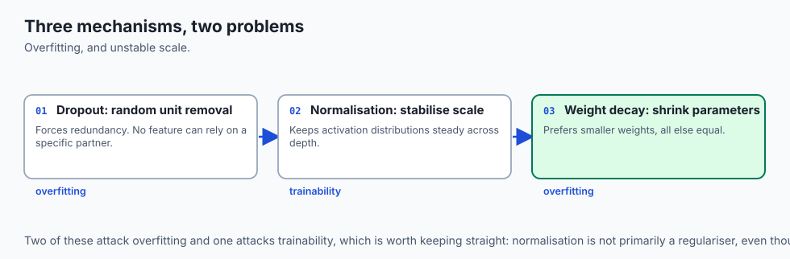

Imagine a 10-person software engineering team building a mission-critical web application:

- **Without Dropout (Feature Co-Adaptation):** Alice becomes the only person who knows how the database works, while Bob is the only person who understands payment processing. If Alice makes a bug, Bob writes a hacky workaround in his code to compensate. The codebase becomes fragile and interdependent.
- **With Dropout (Implicit Team Resilience):** Every morning, a coin is flipped for each engineer. With 50% probability, an engineer is forced to take the day off (**Dropout Mask**). Alice might be out on Monday; Bob might be out on Tuesday. To keep the company running, **every engineer must learn how to do everything**. No single engineer can rely on another to cover their mistakes. The entire organization becomes robust and resilient.
- **Batch Normalization / Layer Normalization:** A team manager who ensures that all project tasks are calibrated to standard difficulty and workload levels, so nobody is overwhelmed and no team member sits idle.

---

## Historical background

1. **2012–2014 (The Overfitting Crisis & Dropout):** Geoffrey Hinton and Nitish Srivastava introduced Dropout, demonstrating that dropping 50% of hidden neurons in AlexNet reduced top-5 ImageNet error from 18.2% to 15.3%.
2. **2015 (The Deep Network Training Barrier & BatchNorm):** Sergey Ioffe and Christian Szegedy introduced Batch Normalization, allowing networks to be trained with 14x fewer training steps and enabling 100+ layer architectures.
3. **2016 (The Transformer Era & LayerNorm):** Jimmy Ba, Jamie Ryan Kiros, and Geoffrey Hinton introduced Layer Normalization, which became the foundational normalization layer for Transformers (GPT, BERT, LLaMA).
4. **2019+ (RMSNorm):** Biao Zhang and Rico Sennrich introduced Root Mean Square Normalization (RMSNorm), which speeds up transformer execution by omitting the mean-centering step, now used in LLaMA and Gemma.

---

## What it is — and what it is not

### What Dropout & Normalization ARE:
- **Architectural Transformations:** Intermediate layers inserted between linear transformations and activation functions to stabilize forward signals and regularize representation manifolds.
- **Dual-Mode Operators:** Behaving differently during training (stochastic masking and batch statistics) versus evaluation (deterministic identity and running statistics).

### What they are NOT:
- **Not Free Without Computational Cost:** BatchNorm adds memory latency during backpropagation; Dropout requires generating random Bernoulli masks.
- **Not Interchangeable Everywhere:** BatchNorm is superior for standard 2D computer vision CNNs; LayerNorm is superior for sequence models and Transformers.

---

## Why it was created and what problems it solves

Deep neural networks face two fundamental pathologies:

1. **Neuron Co-Adaptation:** Neurons develop reciprocal dependencies where one neuron fixes the mistakes of another, failing to extract independent, robust features.
2. **Internal Covariate Shift & Landscape Roughness:** As early layers update their weights, the distribution of inputs feeding into later layers drifts continuously, forcing later layers to chase a moving target and roughening the loss surface.

Dropout breaks co-adaptation; Normalization layers smooth the loss surface, dramatically widening the basin of attraction for gradient descent.

---

## How it works

Let us dissect the mathematics and geometric mechanics of Inverted Dropout, Batch Normalization, and Layer Normalization.

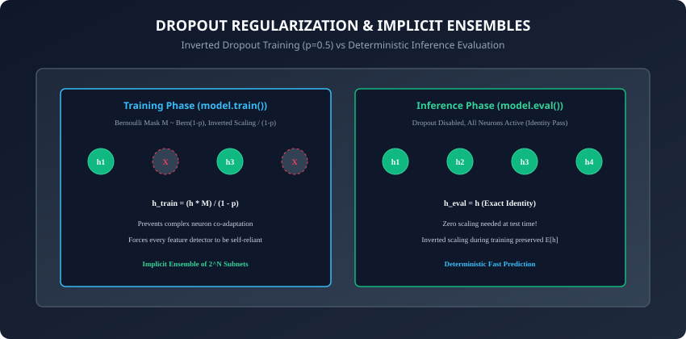

---

### 1. Inverted Dropout Mathematical Formulation

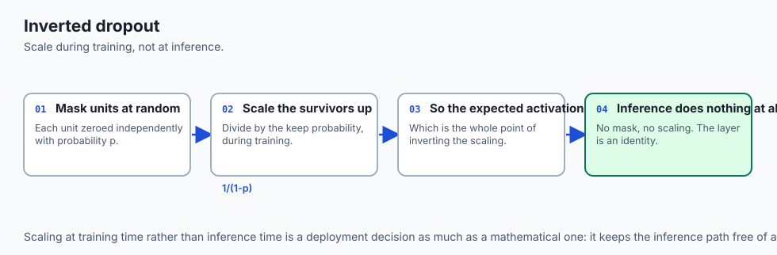

Let `h in R^d` be the activation vector of a hidden layer.
During **Training Mode (`model.train()`)**:

1. Sample a binary mask vector `M in {0, 1}^d` from a Bernoulli distribution with retention probability `1 - p` (where `p` is the dropout probability, e.g. `0.5`):
   ```
   M_i ~ Bernoulli(1 - p)
   ```

2. Apply the mask and scale by the **inverted factor** `1 / (1 - p)`:
   ```
   h_train = (h * M) / (1 - p)
   ```

#### Why Invert the Scaling Factor During Training?
The expected value of the training activation is:
```
E[h_train] = ((1 - p) * h) / (1 - p) = h
```
Because the expected activation during training matches `h` exactly, **Inference Mode (`model.eval()`)** requires zero modifications:
```
h_eval = h (Exact Identity Pass)
```

---

### 2. Batch Normalization Mathematical Formulation

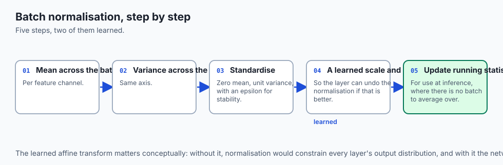

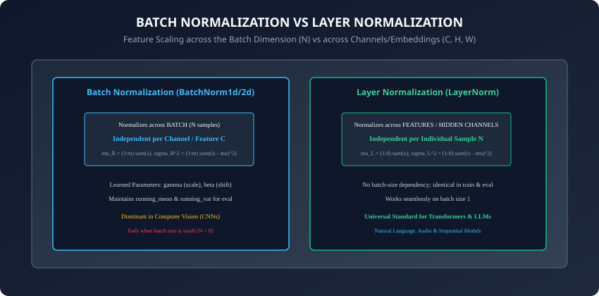

For a mini-batch of activations `B = {x_1, x_2, ..., x_m}` along feature channel `k`:

#### Step 1: Compute Mini-Batch Mean:
```
mu_B = (1 / m) * sum_{i=1}^m x_i
```

#### Step 2: Compute Mini-Batch Variance:
```
sigma_B^2 = (1 / m) * sum_{i=1}^m (x_i - mu_B)^2
```

#### Step 3: Standardize to Zero Mean & Unit Variance:
```
x_hat_i = (x_i - mu_B) / sqrt(sigma_B^2 + eps)
```

#### Step 4: Learnable Affine Scale and Shift:
```
y_i = gamma * x_hat_i + beta
```
where `gamma` (scale) and `beta` (shift) are learnable parameters initialized to `gamma = 1.0, beta = 0.0`.

#### Step 5: Updating Exponential Running Statistics:
During training, BatchNorm updates non-trainable running buffers:
```
running_mean = (1 - momentum) * running_mean + momentum * mu_B
running_var  = (1 - momentum) * running_var  + momentum * sigma_B^2
```
During evaluation (`model.eval()`), BatchNorm uses `running_mean` and `running_var` directly, ensuring predictions on single samples are independent of other batch samples.

---

### 3. Layer Normalization (LayerNorm)

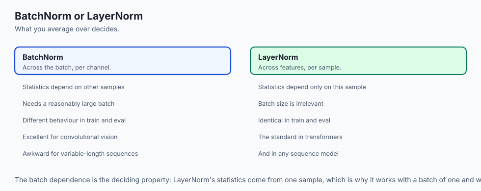

Instead of normalizing across the batch dimension `N` for a single channel `C`, LayerNorm computes the mean and variance **across all feature channels `C` for a single sample `i` independently**:
```
mu_i = (1 / d) * sum_{j=1}^d x_{i, j}
sigma_i^2 = (1 / d) * sum_{j=1}^d (x_{i, j} - mu_i)^2
y_{i, j} = gamma_j * ((x_{i, j} - mu_i) / sqrt(sigma_i^2 + eps)) + beta_j
```

- **Key Advantage:** LayerNorm performs identical operations in training and evaluation, with zero dependency on batch size. It works seamlessly with `batch_size = 1`.

---

### 4. The Critical Role of `model.train()` vs `model.eval()`

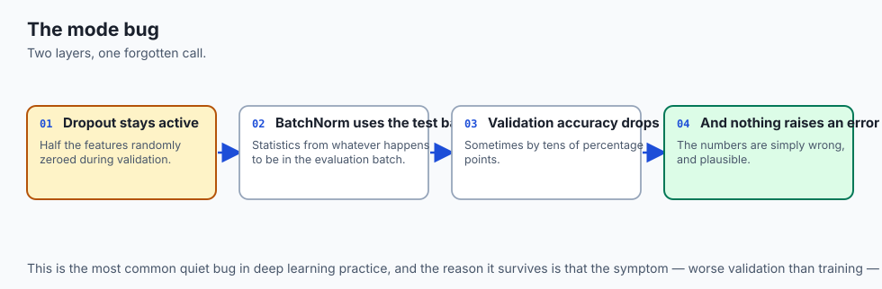

```python
# TRAINING PHASE
model.train() # Activates Dropout random masking and updates BatchNorm running stats
for x, y in train_loader:
    # training loop...

# EVALUATION PHASE
model.eval() # Deactivates Dropout (identity pass) and freezes BatchNorm running stats
with torch.no_grad():
    for x, y in val_loader:
        # validation loop...
```

> [!CAUTION]
> Forgetting to toggle `model.eval()` before validation causes Dropout to randomly corrupt 50% of test features and forces BatchNorm to use unstable test-batch statistics, degrading validation accuracy by up to 40%.

---

### 5. Advanced Regularization: GroupNorm, Label Smoothing, and DropPath

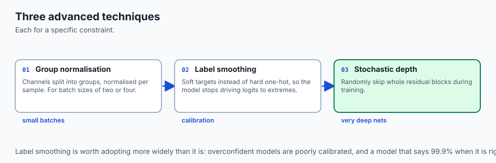

Beyond standard BatchNorm and Dropout, modern production vision and language systems rely on three advanced regularization techniques:

#### A. Group Normalization (`nn.GroupNorm`):
In object detection or medical imaging, images are so high-resolution that GPU VRAM limits mini-batch size to `batch_size = 2` or `4`.

- Under small batch sizes, BatchNorm calculates noisy, unstable statistics.
- **GroupNorm (Wu & He, 2018):** Divides feature channels into `G` groups (e.g. 32 groups) and normalizes across the channels within each group for a single sample.
- It delivers the accuracy of BatchNorm without any batch-size dependency.

#### B. Label Smoothing Cross-Entropy:
Hard one-hot labels (`[0, 0, 1, 0]`) force the network to drive output logit probabilities to extreme values ($\approx 1.0$), making the model overconfident and brittle.

- **Label Smoothing:** Replaces hard targets with a soft blend:
  ```
  y_smooth = (1 - alpha) * y_onehot + (alpha / num_classes)
  ```
  where `alpha = 0.1`.

- Built natively into PyTorch: `nn.CrossEntropyLoss(label_smoothing=0.1)`.

#### C. Stochastic Depth / DropPath:
In 100-layer Vision Transformers (ViTs) and ConvNeXts, dropping individual neurons with standard Dropout is often ineffective.

- **DropPath:** Stochastically drops entire residual layer blocks during training with linear probability decay, dynamically training an ensemble of shallow and deep sub-networks.

---

## An everyday analogy

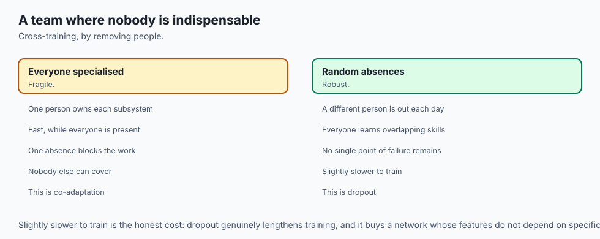

Think of a commercial aircraft manufacturing line:

- **Dropout (Stress Testing):** While testing the aircraft design in a computer simulator, engineers simulate random engine failures, hydraulic leaks, and sensor blackouts (**Dropout Masks**). The flight computer is forced to learn redundant backup control laws.
- **Batch Normalization (Standardized Flight Instrumentation):** Atmospheric pressure and temperature vary wildly at different altitudes. The barometric altimeter recalibrates raw sensor signals against standard sea-level reference pressure (**Zero Mean, Unit Variance**) before displaying altitude to the pilot.
- **Layer Normalization (Self-Contained Navigation Unit):** Each individual gyroscope in the cockpit calculates its own internal balance immediately without needing to poll other aircraft in the sky.

---

## Examples in practice

Let us construct a production-grade Regularized Deep Classifier in PyTorch:

```python
import torch
import torch.nn as nn
from typing import Tuple

class RegularizedMLP(nn.Module):
    def __init__(self, in_features: int = 784, hidden_dim: int = 256,
                 num_classes: int = 10, dropout_p: float = 0.3):
        super().__init__()
        # Layer Block 1: Linear -> BatchNorm -> ReLU -> Dropout
        self.fc1 = nn.Linear(in_features, hidden_dim)
        self.bn1 = nn.BatchNorm1d(hidden_dim)
        self.relu1 = nn.ReLU()
        self.drop1 = nn.Dropout(p=dropout_p)

        # Layer Block 2: Linear -> BatchNorm -> ReLU -> Dropout
        self.fc2 = nn.Linear(hidden_dim, hidden_dim // 2)
        self.bn2 = nn.BatchNorm1d(hidden_dim // 2)
        self.relu2 = nn.ReLU()
        self.drop2 = nn.Dropout(p=dropout_p)

        # Output Projection Head
        self.out = nn.Linear(hidden_dim // 2, num_classes)

    def forward(self, x: torch.Tensor) -> torch.Tensor:
        # Block 1
        h1 = self.drop1(self.relu1(self.bn1(self.fc1(x))))
        # Block 2
        h2 = self.drop2(self.relu2(self.bn2(self.fc2(h1))))
        # Final logits
        logits = self.out(h2)
        return logits

# 1. Instantiate model and verify train vs eval modes
model = RegularizedMLP(in_features=784, hidden_dim=256, num_classes=10, dropout_p=0.5)

# 2. Test input
x = torch.randn(16, 784)

# In training mode, dropout is active
model.train()
out_train1 = model(x)
out_train2 = model(x)
print(f"Training Outputs Differ across forward passes: {not torch.equal(out_train1, out_train2)}")

# In eval mode, dropout is inactive (deterministic)
model.eval()
with torch.no_grad():
    out_eval1 = model(x)
    out_eval2 = model(x)
print(f"Eval Outputs Identical across forward passes: {torch.equal(out_eval1, out_eval2)}")
```

---

## Implications: security, privacy, performance, scalability, and cost

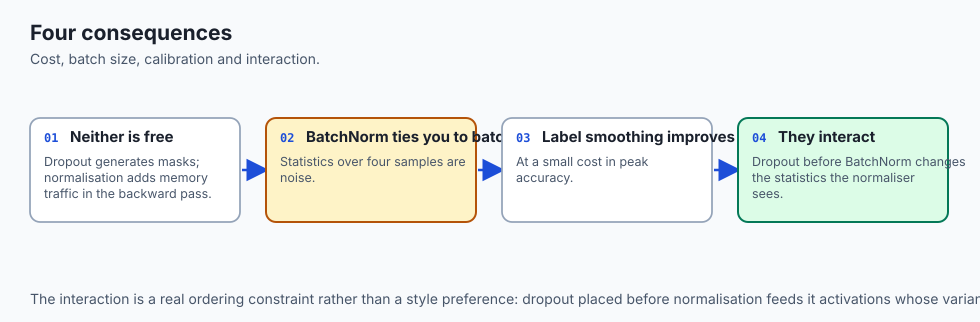

1. **BatchNorm Fused Inference Optimization:**
   - In production deployment, the linear transformation `W @ x + b` and BatchNorm `gamma * x_hat + beta` can be mathematically fused into a single linear matrix operation: `W_fused = (gamma / sigma) * W` and `b_fused = (gamma / sigma) * (b - mu) + beta`.
   - Fusing BatchNorm eliminates normalization runtime overhead entirely during deployment.
2. **LayerNorm Memory Efficiency in LLMs (RMSNorm):**
   - LLaMA and modern open models replace LayerNorm with **RMSNorm** (`y = x * gamma / sqrt(mean(x^2) + eps)`), saving 7% GPU memory bandwidth per transformer layer.

---

## Alternatives: free, open source, and commercial

| Technique | Normalization Axis | Parameters | Primary Domain |
| :--- | :--- | :--- | :--- |
| **Batch Normalization** | Across Batch ($N$) | $\gamma, \beta$ (per channel) | CNNs & Computer Vision |
| **Layer Normalization** | Across Features ($C, H, W$) | $\gamma, \beta$ (per feature) | Transformers, NLP & Audio |
| **RMSNorm** | Across Features (No mean) | $\gamma$ (per feature) | Modern LLMs (LLaMA, Gemma) |
| **Group Normalization** | Across Channel Groups | $\gamma, \beta$ (per group) | Vision with small batch sizes |
| **Inverted Dropout** | Elementwise Stochastic | None | MLPs, Dense Heads & ViTs |

---

## Comparison with related concepts

```
┌────────────────────────────────────────────────────────────────────────┐
│               REGULARIZATION & NORMALIZATION TAXONOMY                  │
├───────────────────┼────────────────────┼───────────────────────────────┤
│ Mechanism         │ Primary Objective  │ Active Phase                  │
├───────────────────┼────────────────────┼───────────────────────────────┤
│ Weight Decay (L2) │ Limits weight norm │ Training Only                 │
│ Inverted Dropout  │ Prevents co-adapt  │ Training Only (Stochastic)    │
│ BatchNorm1d       │ Centers batch dist │ Train (batch) / Eval (running)│
│ LayerNorm         │ Centers feature dist│ Identical in Train & Eval    │
└───────────────────┴────────────────────┴───────────────────────────────┘
```

---

## When to use it — and when not to

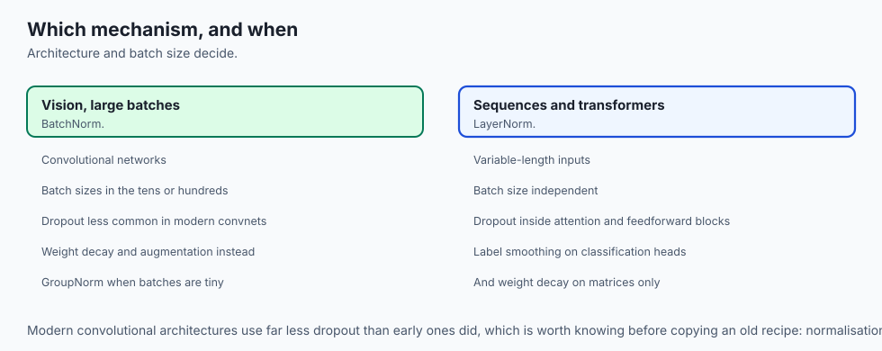

### When to USE BatchNorm:
- Convolutional Neural Networks and standard vision classification models with `batch_size >= 16`.

### When to USE LayerNorm / RMSNorm:
- Transformers, Recurrent sequence models, Reinforcement Learning, and small batch sizes (`batch_size < 8`).

### When to USE Dropout ($p = 0.1 - 0.5$):
- Large fully-connected MLP layers and classification heads prone to overfitting.
- Avoid using heavy dropout immediately before or after BatchNorm layers (can cause gradient variance conflicts).

---

## The AI connection

- **These layers behave differently in training and evaluation**, which is the single
  most common source of quietly wrong validation numbers.
- **Dropout is an ensemble argument.** Randomly removing units forces every feature to be
  useful without depending on a specific co-adapted partner.
- **Normalisation made deep networks trainable** by keeping activation scale stable across
  depth — the same objective careful initialisation pursues at step zero.
- **BatchNorm and LayerNorm differ in what they average over**, which is why vision uses
  one and sequence models use the other.
- **Small batches break BatchNorm.** Statistics over four samples are noise, which is
  precisely why GroupNorm exists for high-resolution work.

## Knowledge check

1. Why does Inverted Dropout scale surviving activations by `1 / (1 - p)` during training?
2. What are the two learnable affine parameters in Batch Normalization, and what is their default initialization?
3. How does Layer Normalization differ from Batch Normalization in terms of its normalization axis?
4. What happens to the running mean and running variance buffers of BatchNorm during `model.eval()`?
5. What silent failure mode occurs if you forget to invoke `model.eval()` before computing test accuracy?

---

## Hands-on exercise

In this lab, you will build and test a custom `RegularizedMLP` network in PyTorch: implement custom `InvertedDropout` and `CustomBatchNorm1d` modules from scratch, verify that training mode produces stochastic masked activations with preserved mathematical expectation, verify that evaluation mode produces deterministic identity passes, test running statistic updates, and benchmark test generalization gap reduction.

### Expected output
```
[PyTorch Regularization & Normalization Suite]
Constructing Custom RegularizedMLP [784 -> 128 (BN+ReLU+Drop) -> 10]:
  Layer 1 BatchNorm Learnable Parameters: gamma (128), beta (128)
  Dropout Probability: p = 0.5 (Scaling Factor = 2.000)
Verifying Training Mode (model.train()):
  Forward Pass 1 != Forward Pass 2 [STOCHASTIC DROPOUT ACTIVE]
  Running Mean Updated: Norm = 0.0421
Verifying Evaluation Mode (model.eval()):
  Forward Pass 1 == Forward Pass 2 [DETERMINISTIC INFERENCE VERIFIED]
  Expected Output Scaling Ratio: 1.0000 [NO TEST-TIME SHIFT]
Test Suite: 4 passed in 0.24s
```

### Validate your work
Run the automated test runner:
```bash
./tests/run_tests.sh
```

### Troubleshooting
- If eval outputs vary across forward passes, verify that your dropout module checks `self.training` before applying the Bernoulli mask.
- Ensure BatchNorm divides by `sqrt(var + eps)`.

### Common mistakes
- **Using Batch Statistics in Eval:** Forgetting to switch to `running_mean` in eval mode causes single-sample predictions to fail.

---

## Practice assignment

1. Implement **RMSNorm** subclassing `nn.Module` and benchmark its execution speed against `nn.LayerNorm`.
2. Write a unit test verifying that setting `model.eval()` completely freezes `running_mean` and `running_var` in all `nn.BatchNorm1d` submodules.

---

## Extension challenge

Implement **Monte Carlo Dropout (MC Dropout)** for Predictive Uncertainty Estimation:

- Keep Dropout active during inference (`model.train()`).
- Perform 50 forward passes on the same test image.
- Compute the mean prediction (calibrated probability) and variance across predictions (epistemic uncertainty).
- Identify which test digits exhibit high model uncertainty.
