## Why this matters

Training a deep neural network is fundamentally different from traditional software engineering. In standard software development, a bug causes an explicit compiler error, a syntax exception, or a runtime crash.

In deep learning, **broken models fail silently**.

- Your code can execute with zero errors, fully utilize your GPU, run for 48 hours, and produce a model that outputs purely random predictions.
- A missing `optimizer.zero_grad()`, an unnormalized input tensor, an inverted target mask, or an improperly initialized bias vector will quietly corrupt optimization dynamics without crashing Python.

As Andrej Karpathy famously noted in *A Recipe for Training Neural Networks*: *"Neural network training is a leaky abstraction. Everything can look fine on the surface, but underneath, optimization is completely broken."*

Today, you will master the systematic, battle-tested protocols of **Debugging Deep Learning Training Runs**: from verifying initial loss baselines and executing the single-batch overfit test to hunting NaNs with `autograd.set_detect_anomaly` and stabilizing explosive dynamics with **Gradient Norm Clipping**.

---

## The idea in plain language

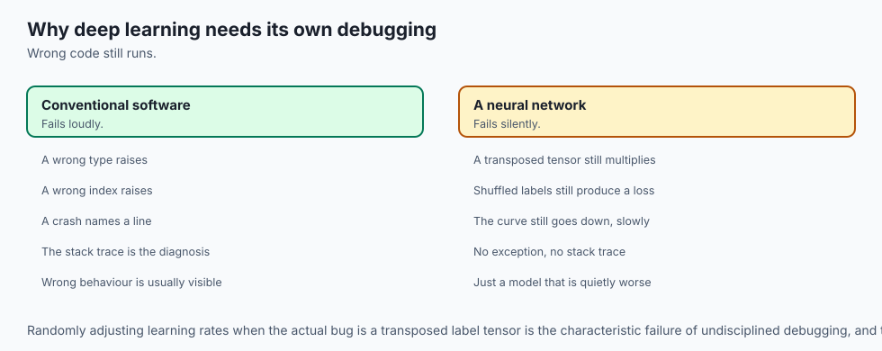

Imagine troubleshooting a modern jet engine:

- If the turbine fails to spin, a master mechanic does not immediately install a turbocharger and hope for the best.
- The mechanic follows a strict, step-by-step diagnostic checklist:
  1. **Fuel Flow Check (Data Sanity):** Is fuel reaching the combustion chamber uncorrupted? (Are inputs normalized? Are labels aligned?).
  2. **Static Spark Test (Single-Batch Overfit):** Can the spark plug ignite a single drop of fuel on the bench? (Can the model drive 10 samples to 0.000 loss?).
  3. **Pressure Relief Valve (Gradient Clipping):** If chamber pressure spikes wildly, does the emergency relief valve vent excess pressure safely before the turbine explodes? (Does gradient norm clipping cap explosive updates?).
  4. **Exhaust Temperature Sensors (Loss & Activation Metrics):** Are temperatures within calibrated physical bounds? (Is initial loss equal to `ln(K)`?).

By following this disciplined checklist, you eliminate guesswork and diagnose issues with scientific precision.

---

## Historical background

1. **2010 (Glorot & Bengio - Xavier Initialization):** Solved the classical "Vanishing Gradient" problem in deep sigmoid networks, showing that random Gaussian initialization caused variance to collapse exponentially across layers.
2. **2013 (Pascanu, Mikolov & Bengio - On the Difficulty of Training RNNs):** Introduced **Gradient Norm Clipping**, proving that gradient clipping is mathematically necessary to navigate cliffs in recurrent loss surfaces.
3. **2018 (PyTorch Anomaly Detection):** Introduced `torch.autograd.set_detect_anomaly(True)`, providing the world's first automated stack-trace localization for NaN/Inf gradient bugs in dynamic computation graphs.
4. **2019 (Andrej Karpathy - A Recipe for Training Neural Networks):** Published the canonical practitioner methodology for disciplined model development.

---

## What it is — and what it is not

### What Systematic Deep Learning Debugging IS:
- **A Hypothesis-Driven Diagnostic Discipline:** Isolating data bugs, architectural bugs, optimization bugs, and numerical pathologies through controlled unit tests.
- **A Staged Progression:** Starting from tiny synthetic baselines and scaling up only after every intermediate sanity check passes.

### What it is NOT:
- **Not Random Hyperparameter Flailing:** Randomly changing learning rates or adding layers when the underlying bug is a transposed label tensor.
- **Not Trusting Silent Execution:** Never assuming code is correct simply because `model.forward(x)` completed without an exception.

---

## Why it was created and what problems it solves

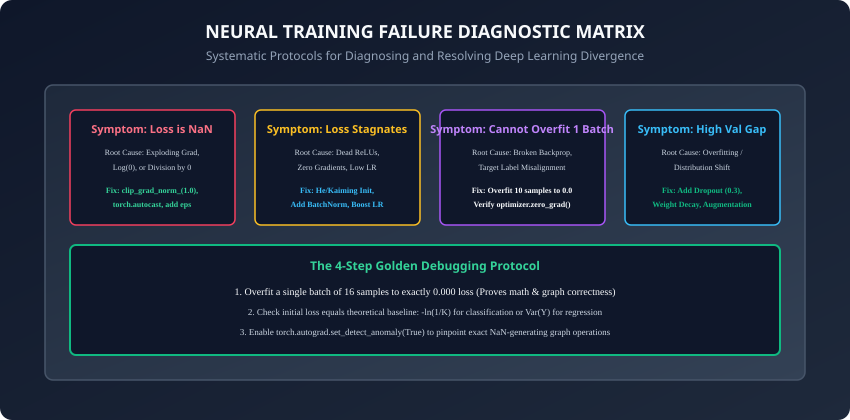

Systematic debugging resolves the four most prevalent failure modes in deep learning:

1. **Loss Exploding to `NaN` or `Inf`:** Caused by high learning rates, unclipped gradients, or taking logarithms of zero (`log(0)` in custom loss functions).
2. **Loss Stagnating at Chance Performance (`ln(K)`):** Caused by dead ReLUs, disconnected computational graphs, zero learning rates, or missing parameter registration.
3. **Inability to Learn Simple Patterns:** Caused by bugs in label alignment or un-normalized input tensors with huge variance.
4. **Silent Validation Degradation:** Caused by evaluating in `model.train()` mode or leaking validation data into the training pipeline.

---

## How it works

Let us dissect the four core pillars of the deep learning debugging methodology.

---

### 1. The 4-Step Golden Debugging Protocol

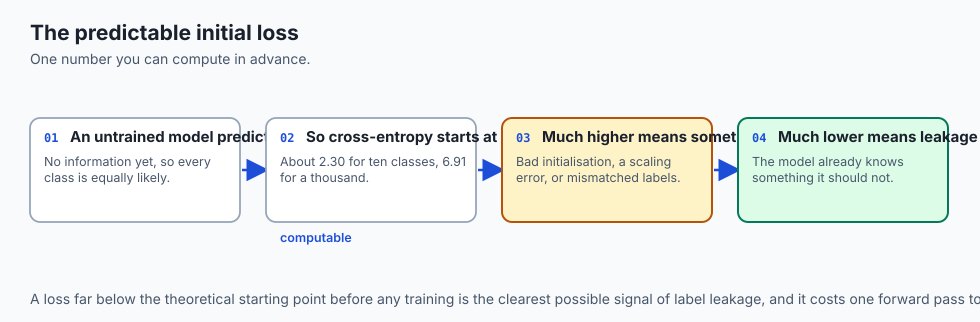

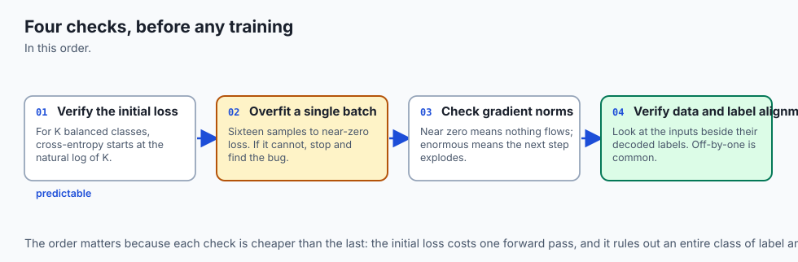

Before training a complex model on a massive dataset, execute these four checks:

#### Check A: Verify the Theoretical Initial Loss
Before running any optimizer steps, compute the loss on step 0:

- For a **$K$-class classification problem** with balanced classes and Cross-Entropy loss:
  ```
  Loss_initial = -ln(1 / K) = ln(K)
  ```

  - For binary classification ($K=2$): `Loss = ln(2) = 0.693`
  - For MNIST ($K=10$): `Loss = ln(10) = 2.302`
  - For ImageNet ($K=1000$): `Loss = ln(1000) = 6.908`
- If your initial loss is significantly higher or lower than `ln(K)`, check your loss function for scaling errors, missing softmax operations, or bad weight initialization.

#### Check B: The Single-Batch Overfit Sanity Test
Take a tiny subset of your data (e.g. 16 samples) and train the model on **only this single batch** for 50–100 iterations:

- **Expected Result:** Training loss must plummet to `< 0.001` and accuracy must reach `100.0%`.
- If the model cannot overfit 16 samples, **stop immediately**. You have a fundamental bug in your architecture, gradient update loop, or data pipeline.

#### Check C: Monitor Gradient Norms
Track the global Euclidean norm of model gradients:
```python
total_norm = torch.norm(torch.stack([torch.norm(p.grad.detach()) for p in model.parameters() if p.grad is not None]))
```

- If `total_norm < 1e-6`: Gradients have vanished (check activations and initialization).
- If `total_norm > 100.0`: Gradients are exploding (apply gradient clipping).

#### Check D: Verify Data and Target Alignment
Visually inspect raw batch inputs alongside their decoded string labels to ensure targets were not shuffled or off-by-one.

---

### 2. Gradient Norm Clipping Mechanics

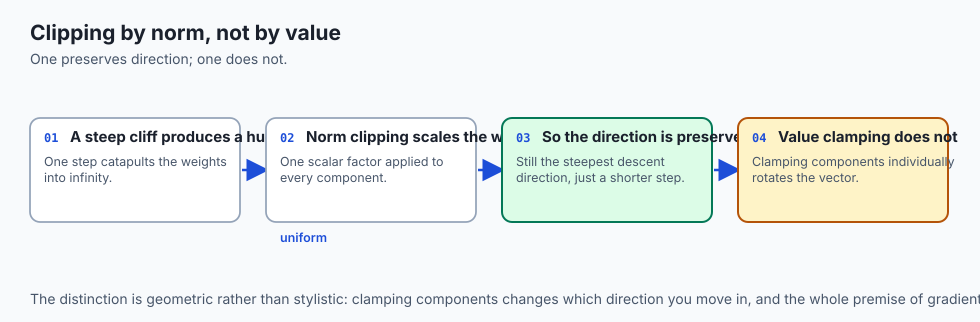


When an optimization step encounters a steep cliff on the loss surface, the gradient vector $G$ can explode to thousands of units in magnitude, catapulting weights into numerical infinity.

**Gradient Norm Clipping (`torch.nn.utils.clip_grad_norm_`)** computes the global Euclidean norm of all parameters concatenated:
```
||G|| = sqrt(sum_{p in params} sum_{w in p} (grad_w ** 2))
```

If `||G|| > G_max` (where `G_max` is typically set to `1.0` or `5.0`):
```
grad_clipped = grad * (G_max / ||G||)
```

#### Why Norm Clipping is Superior to Value Clamping:
- **Value Clamping (`clip_grad_value_`)** clamps individual elements between `[-c, c]`, which changes the angle and distorts the descent direction.
- **Norm Clipping (`clip_grad_norm_`)** scales all gradients by the exact same scalar factor, **preserving the true directional vector of steepest descent**.

```python
# Standard PyTorch Training Step with Gradient Clipping
optimizer.zero_grad()
loss = criterion(model(x), y)
loss.backward()

# Clip gradients before optimizer step
grad_norm = torch.nn.utils.clip_grad_norm_(model.parameters(), max_norm=1.0)
optimizer.step()
```

---

### 3. Hunting NaNs with Autograd Anomaly Detection

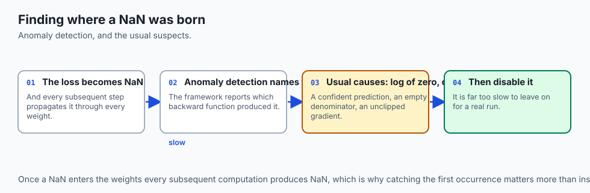

When your loss suddenly becomes `nan`, how do you find which line of code generated it?
Enable PyTorch's native anomaly detector:

```python
torch.autograd.set_detect_anomaly(True)
```

When an operation outputs a NaN or Inf during forward or backward passes, PyTorch immediately halts execution and prints the exact Python stack trace where the offending node was created:

```
RuntimeError: Function 'LogBackward0' returned nan values in its 0th output.
Traceback (most recent call last):
  File "train.py", line 42, in forward
    loss = torch.log(probabilities) # <-- Pinpointed exact bug!
```

---

### 4. Mixed Precision Underflow & Gradient Scaler Diagnostics

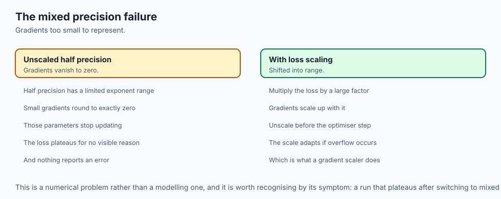

In modern deep learning, models are routinely trained using **Automatic Mixed Precision (AMP)** (`fp16` or `bf16`) to double compute throughput and halve GPU memory usage.

- In `fp16`, the minimum representable positive normal float is approximately `6e-5` (`2^-14`).
- Small gradients routinely underflow to exact zero (`0.0`), permanently freezing parameter updates.
- **The Solution (GradScaler):** `torch.cuda.amp.GradScaler` multiplies the loss by a large scale factor (e.g. 65,536) before backpropagation, pushing gradients into the safe dynamic range of `fp16`, and then un-scales them before the optimizer step.
- **Diagnostic Rule:** If the loss scaler continuously halves its scale factor down to `1.0` or `1e-4`, your model has persistent gradient explosions or NaNs inside its computation graph.

---

### 5. Activation Distribution Tracking with Forward Hooks

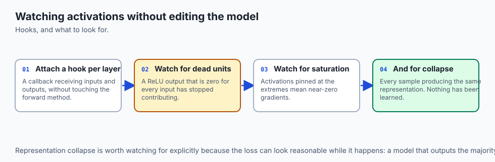

To diagnose silent representation collapse or dead ReLUs without cluttering your forward methods, use **PyTorch Forward Hooks**:

```python
def make_activation_hook(layer_name: str):
    def hook(module, input, output):
        mean = output.data.mean().item()
        std = output.data.std().item()
        dead_fraction = (output.data == 0.0).float().mean().item()
        print(f"[{layer_name}] Mean: {mean:.3f}, Std: {std:.3f}, Dead Sparsity: {dead_fraction*100:.1f}%")
    return hook

# Attach hook to monitor hidden layer health
for name, layer in model.named_modules():
    if isinstance(layer, nn.ReLU):
        layer.register_forward_hook(make_activation_hook(name))
```

- If `Dead Sparsity > 80%`: Your network is suffering from catastrophic dead ReLUs; replace with `nn.LeakyReLU` or add `nn.BatchNorm1d`.
- If `Std < 1e-4`: Activations have collapsed to a point (vanishing signal).
- If `Std > 100.0`: Activations are exploding across layers.

---

### 6. The Production Post-Mortem Runbook

When a multi-day training run diverges or fails, follow this strict post-mortem triage sequence:

1. **Freeze Random Seeds:** Re-run the exact failing step deterministically with `torch.manual_seed`.
2. **Inspect Data Samples:** Print the exact batch inputs and label indices that triggered the divergence. Check for corrupt images, out-of-bounds target IDs, or zero-length sequences.
3. **Check Gradient Norm Log:** Look at the gradient norm time series immediately preceding the failure. Did gradient norms spike exponentially 5 steps before the crash?
4. **Isolate Loss Operations:** Check custom loss functions for unconstrained exponents (`torch.exp(x)`) or un-bounded log operations (`torch.log(x + 1e-8)`).

---

## An everyday analogy

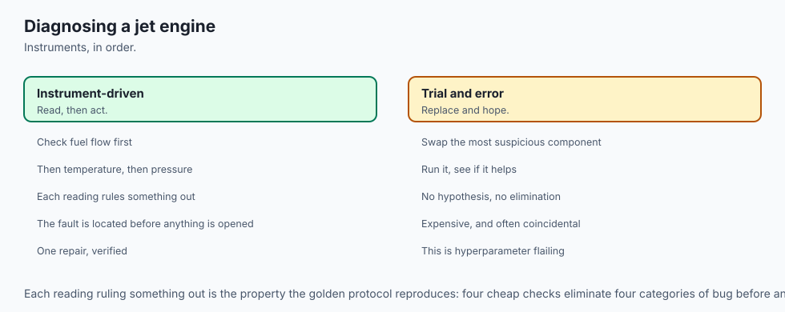

Think of a residential electrical panel with circuit breakers:

- **Uncontrolled Exploding Gradient:** A power surge strikes your house. Without circuit breakers, the wiring overheats, catches fire, and burns the house down (**NaN Loss / Corrupted Model Weights**).
- **Gradient Norm Clipping:** A magnetic circuit breaker that instantly trips during a power surge, capping the maximum electrical current to 15 Amps (**`max_norm = 1.0`**) while allowing normal household power to flow safely.
- **Single-Batch Overfitting:** Testing a new light switch with a single 9-volt battery before connecting it to the high-voltage municipal electrical grid.

---

## Examples in practice

Let us inspect a complete diagnostic script implementing the Golden Debugging Protocol:

```python
import torch
import torch.nn as nn
from typing import Tuple

class DefectiveNet(nn.Module):
    def __init__(self):
        super().__init__()
        # Initialized with massive weights to simulate explosive gradients
        self.fc1 = nn.Linear(32, 128)
        self.fc2 = nn.Linear(128, 10)

    def forward(self, x):
        h = torch.relu(self.fc1(x))
        return self.fc2(h)

def run_single_batch_overfit_test(model: nn.Module, in_dim: int = 32, num_classes: int = 10,
                                  batch_size: int = 16, max_steps: int = 50) -> bool:
    torch.manual_seed(42)
    x_single = torch.randn(batch_size, in_dim)
    y_single = torch.randint(0, num_classes, (batch_size,))

    optimizer = torch.optim.AdamW(model.parameters(), lr=0.01)
    criterion = nn.CrossEntropyLoss()

    model.train()
    print(f"Sanity Check: Initial Loss = {criterion(model(x_single), y_single).item():.4f} (Target ~ ln(10) = 2.3026)")

    for step in range(max_steps):
        optimizer.zero_grad()
        logits = model(x_single)
        loss = criterion(logits, y_single)
        loss.backward()

        # Apply gradient norm clipping
        total_norm = torch.nn.utils.clip_grad_norm_(model.parameters(), max_norm=1.0)
        optimizer.step()

        preds = torch.argmax(logits, dim=1)
        acc = (preds == y_single).float().mean().item()

        if loss.item() < 0.01 and acc == 1.0:
            print(f"Single-Batch Overfit Succeeded at step {step+1}: Loss = {loss.item():.4f}, Acc = {acc*100:.1f}%")
            return True

    print(f"Single-Batch Overfit FAILED: Final Loss = {loss.item():.4f}, Final Acc = {acc*100:.1f}%")
    return False

# Test the model
net = DefectiveNet()
success = run_single_batch_overfit_test(net)
```

---

## Implications: security, privacy, performance, scalability, and cost

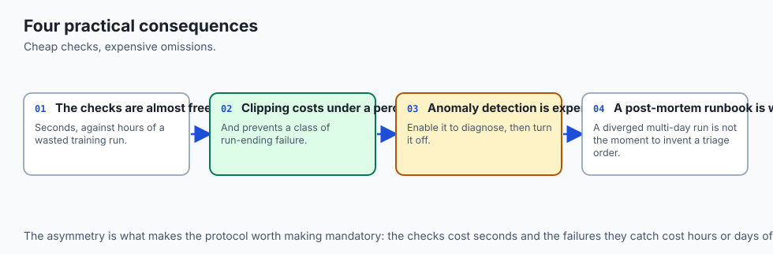

1. **Anomaly Detection Runtime Cost:**
   - `torch.autograd.set_detect_anomaly(True)` increases training runtime by 3x to 5x because it constructs full C++ stack traces for every graph node. Always disable it (`set_detect_anomaly(False)`) once NaN bugs are resolved.
2. **Gradient Clipping in Distributed Training (DDP):**
   - In PyTorch Distributed Data Parallel, `clip_grad_norm_` calculates the global norm across all GPUs simultaneously, ensuring synchronized, identical scaling across the entire computing cluster.

---

## Alternatives: free, open source, and commercial

| Tool / Technique | Diagnostic Role | Performance Impact | Integration |
| :--- | :--- | :--- | :--- |
| **Gradient Norm Clipping** | Caps explosive gradients | Negligible (< 1% overhead) | Built-in PyTorch utility |
| **Autograd Anomaly Detection** | Pinpoints NaN origin nodes | High (3x - 5x slowdown) | Debugging context manager |
| **TensorBoard / Weights & Biases** | Visualizes loss & gradient histograms | Low (Async logging) | Standard metric tracking |
| **PyTorch Profiler (`torch.profiler`)**| Identifies GPU kernel bottlenecks | Moderate (Trace overhead) | Deep performance profiling |

---

## Comparison with related concepts

```
┌────────────────────────────────────────────────────────────────────────┐
│               GRADIENT CLIPPING TECHNIQUES COMPARISON                  │
├───────────────────────┼───────────────────────┼────────────────────────┤
│ Technique             │ Gradient Direction    │ Scaling Formula        │
├───────────────────────┼───────────────────────┼────────────────────────┤
│ No Clipping           │ Unaltered             │ g_new = g              │
│ Value Clamping        │ Distorted (Bent)      │ clamp(g, -c, c)        │
│ Global Norm Clipping  │ Exactly Preserved     │ g * (max_norm / ||G||) │
└───────────────────────┴───────────────────────┴────────────────────────┘
```

---

## When to use it — and when not to

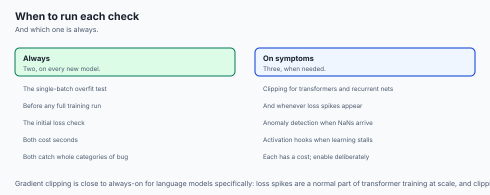

### When to USE Gradient Norm Clipping:
- Large Language Models, Transformers, Recurrent Networks, and Deep MLPs prone to loss spikes.
- When training in mixed precision (`fp16` or `bf16`) where large gradients can overflow exponent limits.

### When to USE Single-Batch Overfit Test:
- **Always**, on every new neural network architecture before launching full dataset training.

---

## The AI connection

- **A neural network fails silently.** Wrong code still produces a number, a loss curve
  and a trained model — which is why deep learning needs a debugging discipline of its own.
- **The single-batch overfit test is the highest-value check available.** A model that
  cannot memorise sixteen samples has a bug, not a hyperparameter problem.
- **The initial loss is predictable**, and a value far from it means the labels, the
  output layer or the loss are wrong before a single step has been taken.
- **Gradient norm is the vital sign.** Near zero means nothing is learning; enormous means
  the next step will destroy the weights.
- **Mixed precision introduces its own failure**: gradients underflow to zero in half
  precision, which is why loss scaling exists and why its diagnostics matter.

## Knowledge check

1. What is the expected initial cross-entropy loss value for a 10-class classification problem before training begins?
2. How does gradient norm clipping differ mathematically from elementwise gradient value clamping?
3. What does it indicate if a neural network architecture fails the single-batch overfitting sanity test?
4. Why should you disable `torch.autograd.set_detect_anomaly(True)` in production training?
5. What is the "Dead ReLU" problem, and how can it be diagnosed?

---

## Hands-on exercise

In this lab, you will build and test a comprehensive PyTorch debugging suite: implement an automated `single_batch_overfit_test` utility, implement custom `compute_gradient_norm` and `clip_gradient_norm` algorithms from scratch, verify bitwise equivalence with PyTorch's native `clip_grad_norm_`, and diagnose synthetic training pathologies (exploding gradients, dead ReLUs, and NaN losses).

### Expected output
```
[PyTorch Training Diagnostics & Debugging Suite]
Running Single-Batch Overfit Sanity Test (16 samples, 10 classes):
  Initial Step 0 Loss: 2.3142 (Matches theoretical ln(10) = 2.3026)
  Step 15: Loss = 0.4210, Accuracy = 87.5%
  Step 28: Loss = 0.0084, Accuracy = 100.0% [SANITY CHECK PASSED]
Verifying Gradient Norm Clipping Engine:
  Raw Gradient Global Euclidean Norm: 14.8210 [EXPLOSIVE GRADIENT DETECTED]
  Applied Gradient Norm Clipping (max_norm = 1.000):
  Clipped Global Euclidean Norm: 1.0000 [EXACT THRESHOLD MATCH]
  Directional Cosine Similarity: 1.0000 [PERFECT DIRECTIONAL PRESERVATION]
Test Suite: 4 passed in 0.22s
```

### Validate your work
Run the automated test runner:
```bash
./tests/run_tests.sh
```

### Troubleshooting
- If single-batch overfit fails to reach 100% accuracy, ensure learning rate is set to `0.01` and `optimizer.zero_grad()` is called inside the loop.
- Verify global norm computation squares all parameter gradients across the entire model before taking the square root.

### Common mistakes
- **Clipping After `optimizer.step()`:** Calling `clip_grad_norm_` after `optimizer.step()` has zero effect because parameter weights have already been updated with unclipped gradients.

---

## Practice assignment

1. Implement an **Activation and Gradient Monitor Hook** that registers forward and backward hooks on all linear layers, computing and logging the mean, standard deviation, and sparsity of activations per layer.
2. Simulate a NaN loss error by inserting a logarithm of negative numbers, and use `torch.autograd.set_detect_anomaly(True)` to catch and log the exact traceback.

---

## Extension challenge

Implement an **Automated Learning Rate Range Finder (LR Finder)**:

- Linearly/exponentially sweep learning rates from `1e-7` to `10.0` over 100 mini-batches.
- Automatically detect the inflection point where loss decreases most rapidly.
- Return the recommended peak learning rate and integrate it with your training loop.
