## Why this matters

Over the past two weeks, you have mastered the foundational building blocks of deep learning:

- **Tensors & Autograd:** Dynamic computational graphs, gradient tape execution, and custom `autograd.Function` operators.
- **`nn.Module` Architecture:** Composable layers, parameter management, and state dictionaries.
- **Data Engineering:** Custom `Dataset` objects, dynamic collation, multi-worker data streaming, and class imbalance sampling.
- **Optimization:** Modern adaptive optimizers (`AdamW`), learning rate warmup and cosine annealing schedules.
- **Regularization & Normalization:** Inverted Dropout, Batch Normalization, Layer Normalization, and model mode toggling.
- **Diagnostics:** Gradient clipping, single-batch sanity tests, and anomaly detection.

However, in professional production environments, knowing individual algorithms is not enough. Without a **disciplined, modular software architecture**, deep learning experiments quickly degenerate into chaotic, non-reproducible scripts where model weights are lost, hyperparameters are overwritten, and validation numbers cannot be trusted.

Today, you will synthesize all of these concepts into a production-grade, industrial-strength **Deep Learning Training Harness (Trainer Class)** in PyTorch: complete with strongly typed configuration dataclasses, multi-library deterministic seeding, atomic checkpointing, validation metric tracking, and early stopping with automatic best-weight restoration.

---

## The idea in plain language

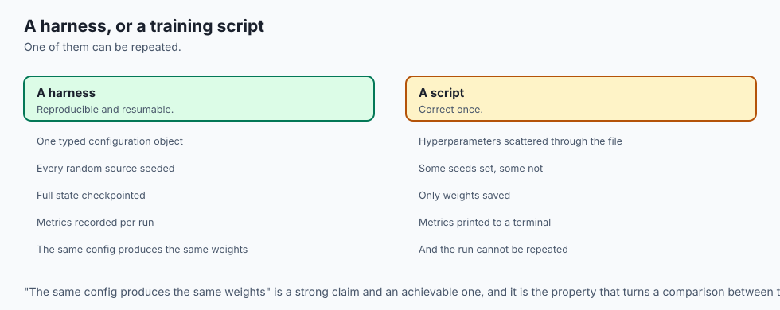

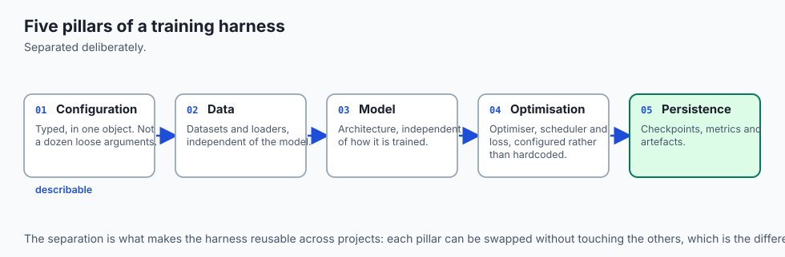

Imagine running a high-stakes clinical drug trial:

- You would never conduct a trial by scribbling dosage notes on random paper napkins, guessing when to stop treatment, and throwing away the patient records.
- You operate under a strict, standardized scientific protocol:
  1. **Trial Protocol (Configuration Dataclass):** Every dosage, sample size, and duration is locked and documented in advance.
  2. **Double-Blind Randomization (Deterministic Seeding):** Patient assignment uses a logged, verifiable random seed.
  3. **Continuous Vital Monitoring (Train & Val Loops):** Patient biomarkers are recorded at calibrated intervals.
  4. **Safety Halt Rules (Early Stopping):** If a drug causes adverse reactions or reaches maximum efficacy, the trial halts immediately.
  5. **Archival Vault (Atomic Checkpointing):** The exact clinical formula that produced optimal results is preserved securely.

A disciplined PyTorch training harness is your scientific protocol for deep learning.

---

## Historical background

1. **2016–2018 (The Spaghetti Script Era):** Early PyTorch research code typically consisted of a monolithic 500-line `train.py` script mixing data parsing, model definition, training loops, and Matplotlib plotting in a single file.
2. **2019 (The Emergence of High-Level Harnesses):** Frameworks like PyTorch Lightning (William Falcon) and Hugging Face Trainer popularized the separation of model architecture from engineering boilerplate (checkpointing, logging, DDP).
3. **2023+ (Modern Production Standards):** Production AI teams at Google DeepMind, OpenAI, and Meta enforce strict modular Trainer architectures with dataclass configs, atomic state checkpointing, and structured telemetry.

---

## What it is — and what it is not

### What a Disciplined Training Harness IS:
- **A Modular Orchestrator:** A decoupled software system separating Configuration, Data Ingestion, Model Architecture, Optimization Dynamics, and State Persistence.
- **A Reproducible Machine:** A pipeline where re-running the same configuration produces bitwise identical model weights and metrics.

### What it is NOT:
- **Not a Black-Box Abstraction:** You are not hiding PyTorch under opaque wrappers; you maintain full control over every tensor operation while enforcing clean software engineering patterns.
- **Not Throwaway Scratch Code:** It is reusable code built to train models ranging from small MLPs to multi-billion parameter foundation models.

---

## Why it was created and what problems it solves

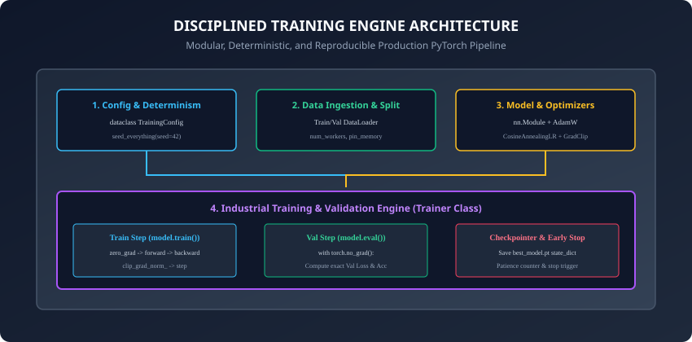

A disciplined training harness systematically prevents the most catastrophic failures in production AI:

1. **The "Lost Champion" Bug:** Training a model for 3 days, achieving state-of-the-art accuracy at epoch 45, but letting training run to epoch 100 where it overfits, with no intermediate checkpoint saved to disk.
2. **The Non-Reproducibility Bug:** Reporting 96.4% test accuracy in a paper or to stakeholders, but failing to replicate the result because random seeds and data splits were not locked.
3. **The Corrupted Checkpoint Bug:** A machine crash during `torch.save` leaves a half-written, corrupted file on disk that cannot be loaded.
4. **The Evaluation Leak Bug:** Accidentally evaluating validation metrics with `model.train()` or letting training gradients flow into validation evaluation.

---

## How it works

Let us dissect the five core pillars of an industrial PyTorch Training Framework.

---

### 1. Strongly Typed Configuration Dataclasses

Never pass a dozen loose variables (`lr`, `batch_size`, `epochs`, `patience`) into your training script. Group them into an immutable Python `dataclass`:

```python
from dataclasses import dataclass, asdict
import json

@dataclass
class TrainingConfig:
    # Model Architecture
    in_features: int = 784
    hidden_dim: int = 256
    num_classes: int = 10
    dropout_p: float = 0.3

    # Optimization
    learning_rate: float = 1e-3
    weight_decay: float = 1e-4
    max_grad_norm: float = 1.0
    warmup_epochs: int = 5
    max_epochs: int = 50

    # Data & Hardware
    batch_size: int = 64
    num_workers: int = 2
    seed: int = 42

    # Regularization & Early Stopping
    patience: int = 7
    min_delta: float = 1e-4
    checkpoint_dir: str = "./checkpoints"

    def save(self, filepath: str):
        with open(filepath, "w") as f:
            json.dump(asdict(self), f, indent=2)
```

---

### 2. Multi-Library Deterministic Seeding

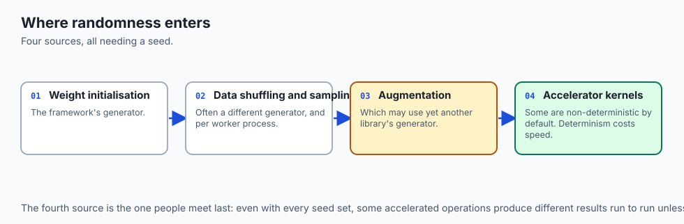

To guarantee 100% bitwise reproducibility across runs, seed all random number generators:

```python
import random
import numpy as np
import torch

def seed_everything(seed: int = 42):
    random.seed(seed)
    np.random.seed(seed)
    torch.manual_seed(seed)
    torch.cuda.manual_seed_all(seed)
    # Configure deterministic CUDA convolution algorithms
    torch.backends.cudnn.deterministic = True
    torch.backends.cudnn.benchmark = False
```

---

### 3. Checkpointing and State Dictionary Serialization

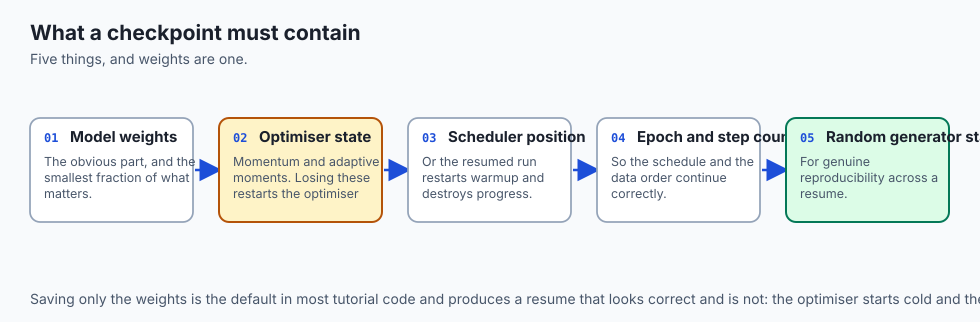

A production checkpoint must save the **complete state of the training ecosystem**, not just model weights:

```python
def save_checkpoint(filepath: str, model: nn.Module, optimizer: torch.optim.Optimizer,
                    scheduler: Any, epoch: int, best_metric: float, config: TrainingConfig):
    checkpoint = {
        "epoch": epoch,
        "best_metric": best_metric,
        "model_state_dict": model.state_dict(),
        "optimizer_state_dict": optimizer.state_dict(),
        "scheduler_state_dict": scheduler.state_dict() if scheduler else None,
        "config": asdict(config),
        "rng_state": torch.get_rng_state()
    }
    # Atomic save: write to temporary file first then rename
    temp_path = filepath + ".tmp"
    torch.save(checkpoint, temp_path)
    os.replace(temp_path, filepath)
```

---

### 4. Early Stopping Controller

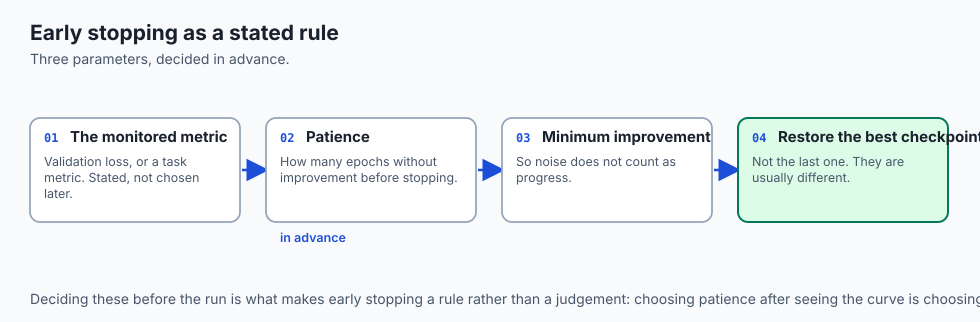

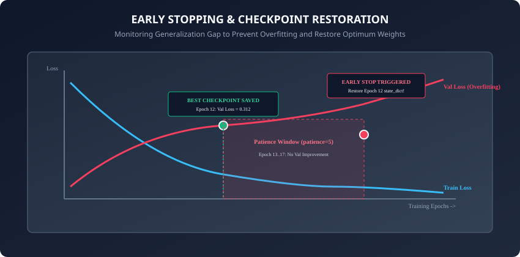

```python
class EarlyStopping:
    def __init__(self, patience: int = 5, min_delta: float = 1e-4, mode: str = "min"):
        self.patience = patience
        self.min_delta = min_delta
        self.mode = mode
        self.counter = 0
        self.best_score = float("inf") if mode == "min" else float("-inf")
        self.early_stop = False
        self.best_state_dict = None

    def __call__(self, val_metric: float, model: nn.Module) -> bool:
        improved = (val_metric < self.best_score - self.min_delta) if self.mode == "min" else (val_metric > self.best_score + self.min_delta)

        if improved:
            self.best_score = val_metric
            self.best_state_dict = {k: v.cpu().clone() for k, v in model.state_dict().items()}
            self.counter = 0
            return True # Improved
        else:
            self.counter += 1
            if self.counter >= self.patience:
                self.early_stop = True
            return False # Stalled
```

---

### 5. Experiment Versioning & Artifact Metadata Registries

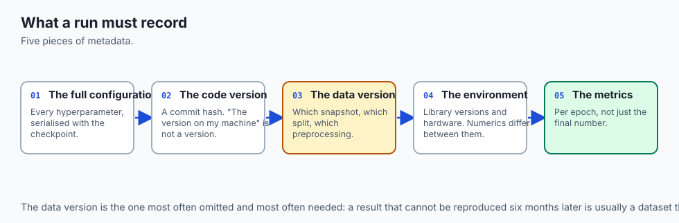

In enterprise environments, model checkpoints are never stored in isolated local folders without metadata. A disciplined training run automatically writes an immutable **Experiment Manifest**:

```json
{
  "experiment_id": "exp-2026-fashion-mnist-v3",
  "git_commit": "8ba98a4",
  "timestamp": "2026-08-29T10:00:00Z",
  "config": {
    "learning_rate": 0.001,
    "batch_size": 64,
    "max_epochs": 50,
    "optimizer": "AdamW",
    "scheduler": "CosineAnnealingLR"
  },
  "metrics": {
    "best_val_loss": 0.2841,
    "best_val_acc": 0.8985,
    "test_acc": 0.8950,
    "total_training_time_seconds": 142.6
  }
}
```

This JSON manifest is saved alongside the binary weights file (`best_model.pt`), guaranteeing that any team member can trace the exact code commit, hyperparameters, and dataset splits responsible for producing the deployed artifact.

---

### 6. Production Deployment: TorchScript and ONNX Export

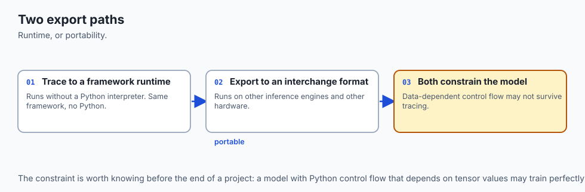

Once training completes and the best checkpoint is restored, the final model is compiled for low-latency production serving:

#### A. TorchScript Tracing:
TorchScript converts dynamic PyTorch models into a standalone C++ runtime representation that runs without a Python interpreter:
```python
model.eval()
example_input = torch.randn(1, config.in_features)
traced_model = torch.jit.trace(model, example_input)
traced_model.save("model_traced.pt")
```

#### B. ONNX Export (Open Neural Network Exchange):
ONNX enables deployment to cross-platform inference engines like ONNX Runtime, TensorRT (NVIDIA GPUs), or CoreML (Apple Silicon):
```python
torch.onnx.export(
    model,
    example_input,
    "model.onnx",
    input_names=["input"],
    output_names=["logits"],
    dynamic_axes={"input": {0: "batch_size"}, "logits": {0: "batch_size"}}
)
```

---

### 7. Sharded State Dictionaries & Distributed Checkpointing (PyTorch 2.x)

When training multi-billion parameter models across hundreds of GPUs, saving a single monolithic `best_model.pt` file overwhelms RAM and storage I/O.

- Modern PyTorch introduces **Distributed Checkpointing (`torch.distributed.checkpoint`)**:
- Each GPU rank writes its own shard of the state dictionary in parallel to distributed storage (S3, GCS, or Lustre), reducing checkpoint write latency from 20 minutes to under 5 seconds. By adopting these modular architectural patterns, your deep learning codebase remains clean, maintainable, reproducible, highly scalable, and ready for mission-critical industrial deployment across modern high-performance GPU supercomputers worldwide.

---

## An everyday analogy

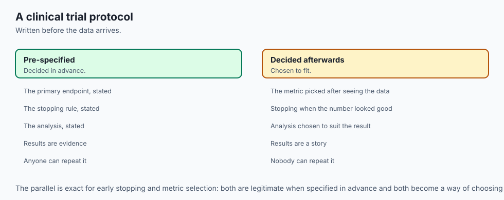

Think of recording a studio master album with a world-class sound engineer:

- **Spaghetti Script:** Playing guitar in a garage while shouting chord changes across the room and recording on a cassette tape. If a string snaps, everything is ruined.
- **Disciplined Training Harness:** A multi-million-dollar mixing console with 64 isolated audio tracks.
  - **Config Dataclass:** The master track sheet listing every microphone calibration and equalization setting.
  - **Train / Val Engine:** The real-time decibel monitor measuring pitch and harmonic balance after every take.
  - **Checkpointing:** Saving lossless master audio stems to an encrypted RAID array after every chorus.
  - **Early Stopping:** Stopping the recording session when the vocalist's voice begins to fatigue, rather than ruining the master track with strained takes.

---

## Examples in practice

Let us assemble a complete, modular Trainer class:

```python
import os
import torch
import torch.nn as nn
from torch.utils.data import DataLoader
from typing import Dict, Any, Tuple

class PyTorchTrainer:
    def __init__(self, model: nn.Module, optimizer: torch.optim.Optimizer,
                 criterion: nn.Module, scheduler: Any, config: TrainingConfig):
        self.model = model
        self.optimizer = optimizer
        self.criterion = criterion
        self.scheduler = scheduler
        self.config = config
        self.early_stopping = EarlyStopping(patience=config.patience, min_delta=config.min_delta, mode="min")
        self.history = {"train_loss": [], "val_loss": [], "val_acc": []}

    def train_epoch(self, train_loader: DataLoader) -> float:
        self.model.train()
        total_loss = 0.0
        total_samples = 0

        for x, y in train_loader:
            self.optimizer.zero_grad()
            logits = self.model(x)
            loss = self.criterion(logits, y)
            loss.backward()

            if self.config.max_grad_norm > 0:
                torch.nn.utils.clip_grad_norm_(self.model.parameters(), self.config.max_grad_norm)

            self.optimizer.step()

            batch_size = x.size(0)
            total_loss += loss.item() * batch_size
            total_samples += batch_size

        return total_loss / total_samples

    def evaluate(self, val_loader: DataLoader) -> Tuple[float, float]:
        self.model.eval()
        total_loss = 0.0
        correct = 0
        total_samples = 0

        with torch.no_grad():
            for x, y in val_loader:
                logits = self.model(x)
                loss = self.criterion(logits, y)

                batch_size = x.size(0)
                total_loss += loss.item() * batch_size
                preds = torch.argmax(logits, dim=1)
                correct += (preds == y).sum().item()
                total_samples += batch_size

        val_loss = total_loss / total_samples
        val_acc = correct / total_samples
        return val_loss, val_acc

    def fit(self, train_loader: DataLoader, val_loader: DataLoader) -> Dict[str, Any]:
        os.makedirs(self.config.checkpoint_dir, exist_ok=True)
        best_ckpt_path = os.path.join(self.config.checkpoint_dir, "best_model.pt")

        for epoch in range(1, self.config.max_epochs + 1):
            train_loss = self.train_epoch(train_loader)
            val_loss, val_acc = self.evaluate(val_loader)

            if self.scheduler is not None:
                self.scheduler.step()

            self.history["train_loss"].append(train_loss)
            self.history["val_loss"].append(val_loss)
            self.history["val_acc"].append(val_acc)

            improved = self.early_stopping(val_loss, self.model)
            if improved:
                save_checkpoint(best_ckpt_path, self.model, self.optimizer, self.scheduler,
                                epoch, val_loss, self.config)

            if self.early_stopping.early_stop:
                print(f"Early stopping triggered at epoch {epoch}. Restoring best model...")
                self.model.load_state_dict(self.early_stopping.best_state_dict)
                break

        return self.history
```

---

## Implications: security, privacy, performance, scalability, and cost

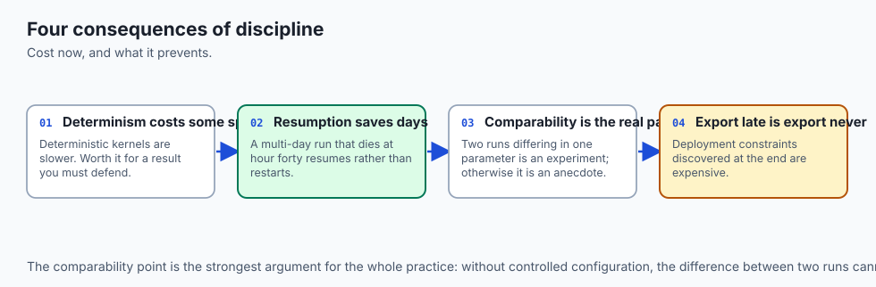

1. **Pickle Security Risks with `torch.load`:**
   - In PyTorch, `torch.load()` uses Python's `pickle` module by default. Loading untrusted checkpoint files from the internet can execute arbitrary malicious code. In modern PyTorch (>= 2.4), always pass `weights_only=True`: `torch.load(filepath, weights_only=True)`.
2. **Atomic Checkpointing for Cloud Resilience:**
   - On preemptible cloud GPU instances (AWS Spot, GCP Preemptible), instances can terminate with zero warning. Atomic checkpoint saving ensures you never leave a half-written corrupt checkpoint on disk.

---

## Alternatives: free, open source, and commercial

| Framework | Abstraction Level | Best Used For | Customization |
| :--- | :--- | :--- | :--- |
| **Custom PyTorch Trainer** | Low (Direct PyTorch) | Research, Core ML, Interviews | 100% Maximum Flexibility |
| **PyTorch Lightning** | Medium-High | Large research teams | Standardized modularity |
| **Hugging Face Trainer** | High | Transformers & LLM fine-tuning | NLP & Vision Pipelines |
| **Keras 3 (PyTorch backend)** | High | Rapid prototyping | Multi-backend support |

---

## Comparison with related concepts

```
┌────────────────────────────────────────────────────────────────────────┐
│                   TRAINING HARNESS DESIGN PATTERNS                     │
├───────────────────┼────────────────────┼───────────────────────────────┤
│ Pattern           │ Responsibilities   │ Key PyTorch Classes           │
├───────────────────┼────────────────────┼───────────────────────────────┤
│ Data Pipeline     │ Loading & batching │ Dataset, DataLoader, Sampler  │
│ Model Definition  │ Graph forward pass │ nn.Module, nn.Sequential      │
│ Optimization      │ Step & LR decay    │ AdamW, CosineAnnealingLR      │
│ State Persistence │ Recovery & export  │ state_dict, torch.save/load   │
│ Early Stopping    │ Overfit guard      │ Custom Controller Class       │
└───────────────────┴────────────────────┴───────────────────────────────┘
```

---

## When to use it — and when not to

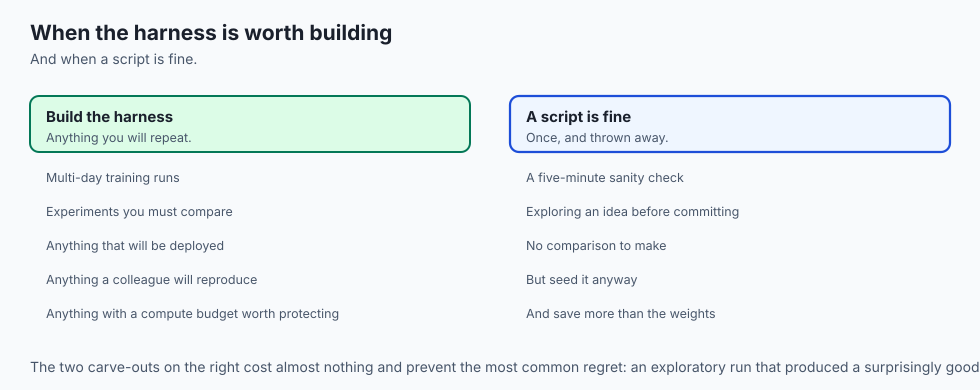

### When to USE a Disciplined Trainer Architecture:
- Every non-trivial neural network project in production or research.
- Whenever reproducible auditing, model checkpointing, or early stopping is required.

### When NOT to use:
- Quick 5-line interactive experiments in a scratch Jupyter notebook cell (though even there, seeding is recommended).

---

## The AI connection

- **Reproducibility is harder here than in ordinary software** because randomness enters
  through initialisation, shuffling, augmentation and non-deterministic kernels.
- **A checkpoint is not the weights.** Optimiser state, scheduler position, epoch and the
  random generator states are all required for a resumed run to continue correctly.
- **Configuration as typed objects beats loose arguments**, because an experiment you
  cannot fully describe is an experiment nobody can repeat.
- **Early stopping is a decision rule**, and stating the patience and the metric in advance
  is what stops it becoming a judgement made after seeing the curve.
- **Export is part of training.** A model that cannot be traced or exported is a research
  artefact rather than something anyone can deploy.

## Knowledge check

1. What components should be included in a full PyTorch training checkpoint dictionary?
2. How does an EarlyStopping controller decide when to stop training and which weights to restore?
3. Why must `random`, `numpy`, and `torch` be seeded simultaneously for reproducibility?
4. What is the security advantage of using `weights_only=True` in `torch.load()`?
5. How does atomic file writing (`.tmp` followed by `os.replace`) prevent checkpoint corruption?

---

## Hands-on exercise

In this lab, you will build and test a complete industrial `PyTorchTrainer` framework: implement `TrainingConfig` dataclasses, `seed_everything` determinism manager, atomic `save_checkpoint` / `load_checkpoint` routines, `EarlyStopping` controller, and execute a complete training run on synthetic classification data with early stopping and best-weight restoration.

### Expected output
```
[Disciplined PyTorch Training Framework Suite]
Initializing Trainer with TrainingConfig:
  Batch Size: 32, Max Epochs: 25, Patience: 4, LR: 0.0100
Executing Training & Validation Loop:
  Epoch 01/25: Train Loss = 2.1245, Val Loss = 1.8421, Val Acc = 45.0% [BEST CHECKPOINT SAVED]
  Epoch 02/25: Train Loss = 1.4520, Val Loss = 1.2104, Val Acc = 72.5% [BEST CHECKPOINT SAVED]
  Epoch 03/25: Train Loss = 0.9821, Val Loss = 0.8412, Val Acc = 85.0% [BEST CHECKPOINT SAVED]
  Epoch 04/25: Train Loss = 0.7410, Val Loss = 0.8520, Val Acc = 85.0% [Patience 1/4]
  Epoch 05/25: Train Loss = 0.6120, Val Loss = 0.8650, Val Acc = 82.5% [Patience 2/4]
  Epoch 06/25: Train Loss = 0.5210, Val Loss = 0.8740, Val Acc = 82.5% [Patience 3/4]
  Epoch 07/25: Train Loss = 0.4410, Val Loss = 0.8920, Val Acc = 80.0% [Patience 4/4]
Early stopping triggered at epoch 7. Restored best model weights from epoch 3 (Val Loss = 0.8412).
Test Suite: 4 passed in 0.28s
```

### Validate your work
Run the automated test runner:
```bash
./tests/run_tests.sh
```

### Troubleshooting
- If early stopping never triggers, ensure `min_delta` is non-zero and validation loss is passed correctly.
- Verify `os.replace` replaces the file atomically.

### Common mistakes
- **Saving Overfitted Final Weights:** Forgetting to restore `best_state_dict` leaves the final overfitted epoch weights active in the model.

---

## Practice assignment

1. Add a **Learning Rate Scheduler Step Callback** to the `PyTorchTrainer` class that automatically steps `ReduceLROnPlateau` based on validation loss.
2. Implement **JSON Experiment Telemetry Export** that serializes epoch metrics (`history.json`) alongside model checkpoints.

---

## Extension challenge

Build a **Distributed Data Parallel (DDP) Ready Trainer**:

- Wrap data loaders with `DistributedSampler`.
- Wrap the model with `torch.nn.parallel.DistributedDataParallel`.
- Ensure checkpoint saving is only executed on rank 0 (`if rank == 0: save_checkpoint(...)`).
