## Why this matters

In Weeks 29 and 30, we built fully connected neural networks (MLPs). When processing tabular data or low-resolution flattened vectors (such as 28x28 MNIST images), MLPs perform reasonably well.

However, consider applying a standard Fully Connected layer to a modern high-resolution color photograph from a smartphone camera ($1920 \times 1080 \times 3 \approx 6.2  million inputs$):

- A single hidden layer with 1,000 neurons would require **$6.2  billion learnable weight parameters$** for just that one layer!
- This would require gigabytes of GPU memory, lead to catastrophic overfitting, and completely discard the 2D grid structure of visual reality.
- Furthermore, an MLP has no concept of spatial locality: moving an object three pixels to the right completely scrambles all input coordinates, forcing the network to relearn the concept from scratch.

To solve this, computer vision pioneers introduced **Convolutional Neural Networks (CNNs)**. By enforcing **Local Connectivity** and **Spatial Weight Sharing**, convolutions reduce parameter counts by orders of magnitude while establishing **Translation Equivariance**: a vertical edge detector learned in the top-left corner of an image operates identically in the bottom-right corner.

Today, you will master the mathematical derivation, spatial dimension arithmetic, and PyTorch implementation of **2D Convolutions (`nn.Conv2d`)**.

---

## The idea in plain language

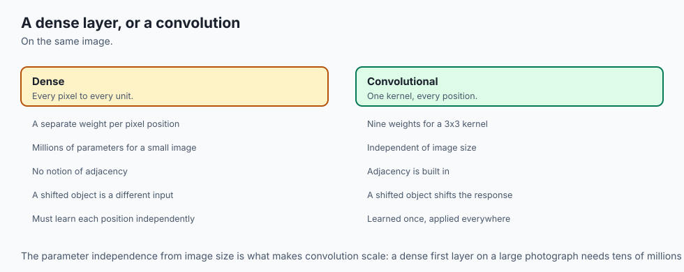

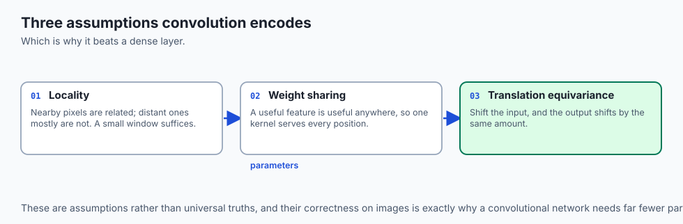

Imagine holding a small magnifying glass (a **$3 \times 3$ Kernel**) over a giant printed mosaic painting:

- Instead of attempting to view all 6 million tiles at once, you slide the magnifying glass systematically across the painting from left to right, top to bottom (**Sliding Window**).
- At each position, the magnifying glass performs a simple visual check: *"Is there a sharp horizontal dark-to-light boundary right here?"* (**Feature Dot Product**).
- Whenever it detects a horizontal edge, it draws a bright white dot on a new blank canvas (**Output Feature Map**); wherever the area is smooth, it draws black.
- Because the same magnifying glass is used everywhere, you only need to learn **9 numbers** (the $3 \times 3$ filter weights) to detect horizontal edges across the entire canvas.

---

## Historical background

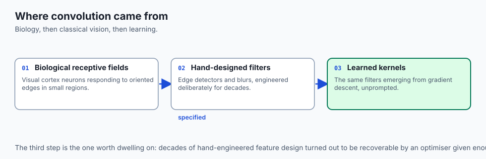

1. **1959–1962 (Hubel & Wiesel - Receptive Fields in the Visual Cortex):** David Hubel and Torsten Wiesel discovered that neurons in the mammalian visual cortex (area V1) do not respond to whole visual scenes, but rather to local oriented edges and slits within localized receptive fields (Nobel Prize, 1981).
2. **1980 (Fukushima - The Neocognitron):** Kunihiko Fukushima introduced the Neocognitron, introducing alternating layers of simple cells (convolution) and complex cells (pooling).
3. **1989–1998 (Yann LeCun - LeNet-5):** Yann LeCun and collaborators integrated backpropagation with 2D convolutions and weight sharing, creating LeNet-5 to automatically read handwritten bank checks.
4. **2012 (AlexNet):** Alex Krizhevsky, Ilya Sutskever, and Geoffrey Hinton scaled deep CNNs on GPUs to win the ImageNet challenge by a historic margin, inaugurating the modern Deep Learning revolution.

---

## What it is — and what it is not

### What a 2D Convolution IS:
- **A Local Linear Transformation:** A small sliding matrix of learnable weights that computes local dot products across spatial neighborhoods of an input tensor.
- **Translation Equivariant:** Shifting the input image horizontally or vertically shifts the activations in the output feature map by the exact same distance.

### What it is NOT:
- **Not Rotationally Invariant:** Standard convolutions cannot recognize an upside-down dog without data augmentation or explicit architectural rotation mechanisms.
- **Not Scale Invariant:** A $3 \times 3$ kernel detects micro-textures; large objects require deep networks or multi-scale feature pyramids.

---

## Why it was created and what problems it solves

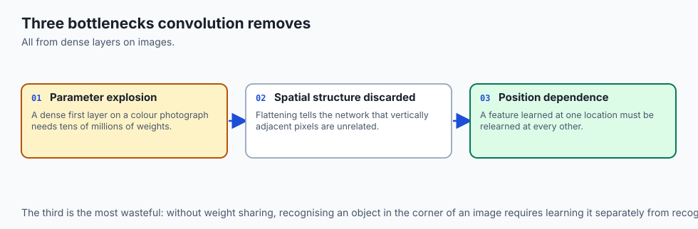


Convolutions eliminate three fundamental bottlenecks of fully connected vision models:

1. **The Parameter Explosion:** Replacing millions of unconstrained weights with small $3 \times 3$ shared kernels ($9  weights$ per channel).
2. **Loss of 2D Spatial Structure:** Preserving pixel neighborhood relationships rather than flattening images into arbitrary 1D vectors.
3. **Translation Vulnerability:** Guaranteeing that localized visual patterns (edges, corners, textures) are recognized regardless of where they appear in the frame.

---

## How it works

Let us dissect the mathematics of 2D convolutions, spatial dimension arithmetic, and channel propagation.

---

### 1. Mathematical 2D Convolution vs Cross-Correlation

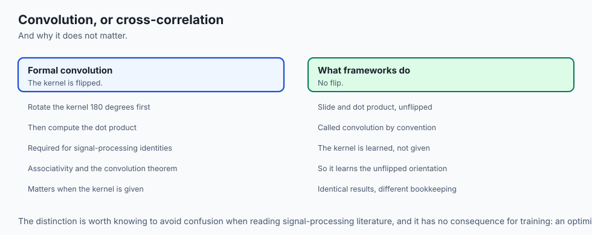

In deep learning frameworks (PyTorch, TensorFlow, JAX), the operation implemented under the name "convolution" is technically **Discrete 2D Cross-Correlation**.

For a single-channel 2D input image `X` and a kernel `K` of size `k_h x k_w`:
```
Y[i, j] = sum_{m=0}^{k_h - 1} sum_{n=0}^{k_w - 1} X[i + m, j + n] * K[m, n]
```

#### The Difference from Formal Mathematics:
- In pure mathematics, convolution flips the kernel by 180 degrees before computing the dot product:
  ```
  Y_conv[i, j] = sum_{m} sum_{n} X[i - m, j - n] * K[m, n]
  ```

- In deep learning, because kernel weights `K` are randomly initialized and learned via gradient descent, the network simply learns the un-flipped orientation directly. Omitting the flip saves memory and compute.

---

### 2. Multi-Channel Input and Output Arithmetic

Modern images and hidden layers are 3D volumes: `(C_in, H_in, W_in)`.

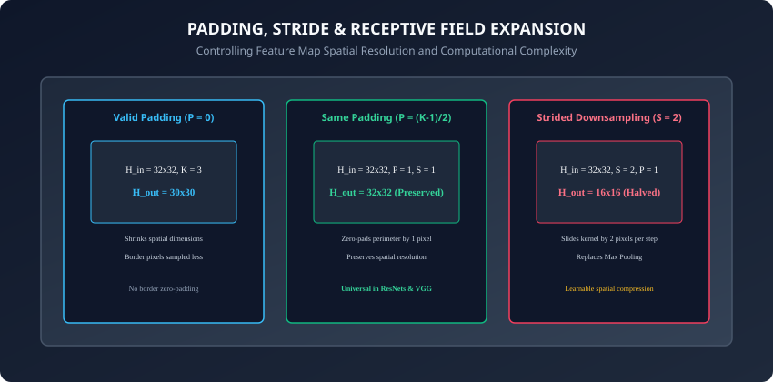

To map from `C_in` input channels to `C_out` output channels:

1. We construct `C_out` distinct 3D filter kernels.
2. Each filter kernel has dimensions `(C_in, k_h, k_w)`.
3. To compute a single output channel `c_out`:
   - Compute 2D convolutions across all `C_in` input channels with the corresponding kernel slice.
   - Sum the results across all input channels:
     ```
     Y[c_out, i, j] = sum_{c_in=0}^{C_in - 1} (X[c_in] * K[c_out, c_in])[i, j] + bias[c_out]
     ```

#### Parameter Count Formula:
```
Total Parameters = (C_out * C_in * k_h * k_w) + (C_out if bias else 0)
```

- Example: `nn.Conv2d(in_channels=3, out_channels=64, kernel_size=3)`
  - Weights = `64 * 3 * 3 * 3 = 1,728`
  - Biases = `64`
  - Total Parameters = `1,792`

---

### 3. Spatial Dimension Formula (Padding & Stride)

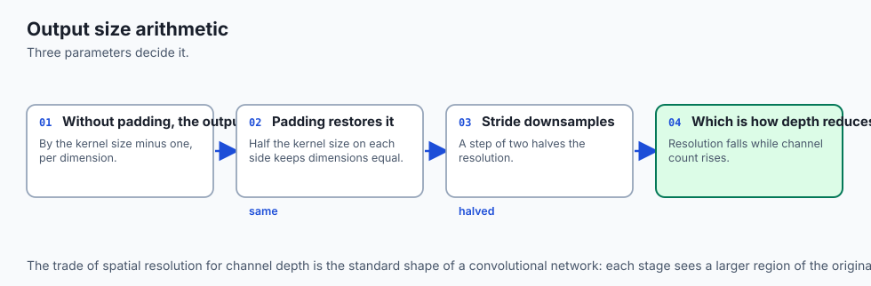

When sliding a kernel of size `K` across an input of height `H_in` with padding `P` (zero-padding added to both sides) and stride `S` (step size):

```
H_out = floor((H_in - K + 2 * P) / S) + 1
W_out = floor((W_in - K + 2 * P) / S) + 1
```

#### Common Padding Conventions:
- **Valid Padding (`P = 0`):** No padding is added. Output resolution shrinks: `H_out = H_in - K + 1`.
- **Same Padding (`P = (K - 1) / 2` with `S = 1`):** Output resolution matches input resolution exactly (`H_out = H_in`). For `K = 3`, `P = 1`. For `K = 5`, `P = 2`.
- **Strided Downsampling (`S = 2` with `P = 1` for `K = 3`):** Halves the spatial resolution: `H_out = floor(H_in / 2)`.

---

### 4. Classical Hand-Crafted Spatial Filters

Before deep learning, computer vision scientists engineered explicit convolution kernels to detect visual features:

#### Horizontal Sobel Filter (Detects Horizontal Edges):
```
K_sobel_h = [[-1, -2, -1],
             [ 0,  0,  0],
             [ 1,  2,  1]]
```

#### Vertical Sobel Filter (Detects Vertical Edges):
```
K_sobel_v = [[-1,  0,  1],
             [-2,  0,  2],
             [-1,  0,  1]]
```

#### Gaussian Blur Filter (Noise Reduction):
```
K_gaussian = (1/16) * [[1, 2, 1],
                       [2, 4, 2],
                       [1, 2, 1]]
```

In a Convolutional Neural Network, the network **learns these edge detectors automatically** in its early layers through gradient descent!

---

### 5. Dimensional Variations: 1D, 2D, and 3D Convolutions

The sliding window principle extends naturally across different spatial and temporal dimensionalities:

- **`nn.Conv1d` (1D Signals):** Slides along a single temporal axis `(Batch, Channels, Length)`. Used in digital audio synthesis, speech recognition, biosignal ECG/EEG processing, and genomic DNA sequence analysis.
- **`nn.Conv2d` (2D Spatial Images):** Slides across height and width `(Batch, Channels, Height, Width)`. The standard engine of computer vision, satellite imagery, and spectrogram analysis.
- **`nn.Conv3d` (3D Volumetric Tensors):** Slides across three spatial/temporal dimensions `(Batch, Channels, Depth, Height, Width)`. Essential for medical imaging (3D MRI, CT scans) and video action recognition (where the depth axis corresponds to time across sequential video frames).

---

### 6. Transposed Convolutions and Upsampling

In generative models, semantic segmentation networks (like U-Net), and autoencoders, we frequently need to **increase** the spatial resolution of a feature map (e.g. from `16x16` up to `32x32`).

- **Transposed Convolution (`nn.ConvTranspose2d`):** Often called "fractionally strided convolution" or "deconvolution". It performs the gradient backward pass of a normal convolution as its forward operation, expanding spatial dimensions.
- **Checkerboard Artifacts:** Stride-2 transposed convolutions can suffer from uneven spatial overlap, creating visible high-frequency grid patterns in generated images. Practitioners often replace `nn.ConvTranspose2d` with bilinear interpolation (`F.interpolate(scale_factor=2)`) followed by a standard `nn.Conv2d(kernel_size=3)`.

---

### 7. Depthwise Separable Convolutions (MobileNet)

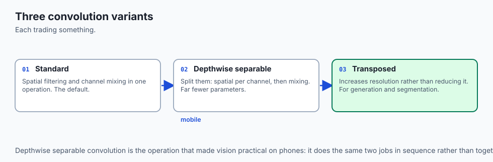

Standard convolutions perform spatial filtering and channel cross-talk simultaneously in a single heavy step.

- In 2017, Howard et al. introduced **Depthwise Separable Convolutions**:
  1. **Depthwise Convolution:** Apply a single $3 \times 3$ kernel to each input channel independently (spatial filtering only, zero cross-channel mixing).
  2. **Pointwise Convolution:** Apply a $1 \times 1$ convolution across all channels (channel projection only, zero spatial filtering).
- **Computational Savings:** Reduces multiply-accumulate operations and learnable parameters by **8 to 9 times** with less than 1% loss in ImageNet accuracy, enabling real-time deep vision models on smartphones and embedded microcontrollers.

---

## An everyday analogy

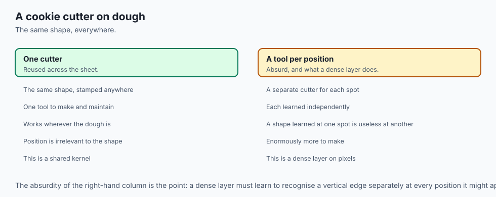

Think of a cookie cutter stamping dough:

- **The Input Image:** A giant rolled-out sheet of cookie dough on a baker table.
- **The Kernel:** A star-shaped metal cookie cutter.
- **The Stride:** How many inches the baker moves the cutter between stamps. (Stride 1 stamps every inch; Stride 2 skips every other inch).
- **The Padding:** Extra perimeter dough placed along the edges of the baking sheet so the cutter does not hang off the rim.
- **The Feature Map:** The tray of stamped star shapes ready for the oven.

---

## Examples in practice

Let us build and inspect a 2D convolution in PyTorch, applying hand-crafted edge detectors and learnable layers:

```python
import torch
import torch.nn as nn
import torch.nn.functional as F

# 1. Instantiate a standard PyTorch Conv2d layer
conv = nn.Conv2d(
    in_channels=3,     # RGB Image
    out_channels=16,   # 16 distinct feature maps
    kernel_size=3,     # 3x3 spatial filter
    stride=1,          # Step size of 1 pixel
    padding=1          # 'Same' padding: preserves spatial size
)

# 2. Forward pass with batch of 4 images (4, 3, 64, 64)
x = torch.randn(4, 3, 64, 64)
out = conv(x)
print(f"Input Shape:  {x.shape}")
print(f"Output Shape: {out.shape}")  # (4, 16, 64, 64)

# 3. Apply a custom Sobel Edge Detector via F.conv2d
sobel_v = torch.tensor([
    [-1.0, 0.0, 1.0],
    [-2.0, 0.0, 2.0],
    [-1.0, 0.0, 1.0]
]).view(1, 1, 3, 3)

# Grayscale test patch
gray_img = torch.zeros(1, 1, 6, 6)
gray_img[:, :, :, 3:] = 1.0 # Sharp vertical boundary in the middle

edges = F.conv2d(gray_img, sobel_v, padding=1)
print(f"Detected Vertical Edge Magnitudes:\n{edges[0, 0]}")
```

---

## Implications: security, privacy, performance, scalability, and cost

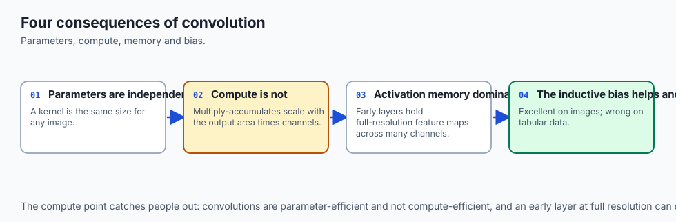

1. **Receptive Field Growth & Feature Hierarchies:**
   - Layer 1 ($3 \times 3$) sees $3 \times 3$ pixel patches (lines, edges).
   - Layer 2 ($3 \times 3$) sees $5 \times 5$ pixel patches (corners, junctions).
   - Layer 5 sees $11 \times 11$ patches (eyes, noses, wheels).
   - Deep CNNs compose simple edges into complex semantic concepts hierarchically.
2. **GPU Compute Optimizations (im2col & Winograd):**
   - Naive nested 6-deep loops for convolutions are slow.
   - Modern GPU libraries (cuDNN) convert 2D convolutions into single matrix multiplications via **`im2col` (GEMM)** or use **Winograd Minimal Filtering Algorithms** to achieve 4x faster execution for $3 \times 3$ kernels.

---

## Alternatives: free, open source, and commercial

| Vision Operator | Mechanism | Parameters | Best Suited For |
| :--- | :--- | :--- | :--- |
| **Standard 2D Conv (`Conv2d`)** | Dense $C_in \times C_out$ 3D spatial dot product | Medium | General Computer Vision |
| **Depthwise Separable Conv** | Spatial Conv per channel + $1 \times 1$ Pointwise Conv | Very Low (8x fewer) | Mobile architectures (MobileNet) |
| **Dilated / Atrous Conv** | Spaces kernel elements with holes | Medium | Semantic Segmentation (DeepLab) |
| **Vision Transformer (ViT)** | Non-local Self-Attention over flattened image patches | High | Large-scale pre-training datasets |

---

## Comparison with related concepts

```
┌────────────────────────────────────────────────────────────────────────┐
│                    SPATIAL OPERATOR TAXONOMY                           │
├───────────────────────┼────────────────────┼───────────────────────────┤
│ Operator              │ Connectivity Scope │ Parameter Sharing         │
├───────────────────────┼────────────────────┼───────────────────────────┤
│ Fully Connected (FC)  │ Global (All-to-All)│ None (Independent weights)│
│ 2D Convolution (Conv) │ Local Neighborhood │ Strict Spatial Sharing    │
│ Max Pooling (Pool)    │ Local Neighborhood │ Parameter-Free (Fixed max)│
│ Self-Attention (ViT)  │ Global Dense Patch │ Dynamic Data-Dependent    │
└───────────────────────┴────────────────────┴───────────────────────────┘
```

---

## When to use it — and when not to

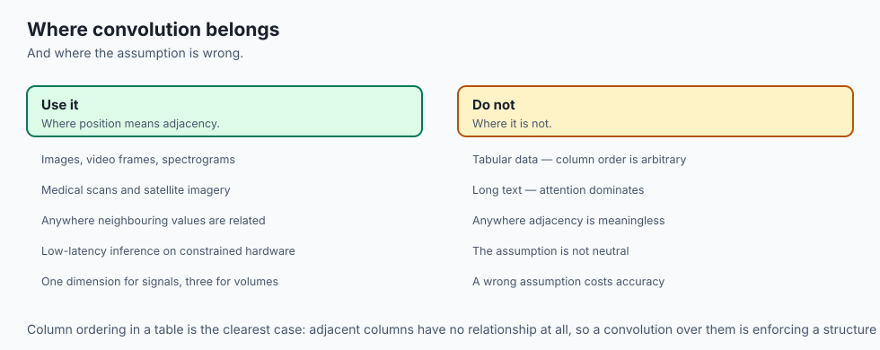

### When to USE 2D Convolutions:
- Processing images, video frames, spectrograms, medical scans, and satellite imagery.
- Low-latency edge inference where Vision Transformers are too memory-intensive.

### When NOT to use:
- Tabular databases (where column ordering has no spatial meaning).
- Long 1D text sequences (where Transformers and Recurrent architectures dominate).

---

## The AI connection

- **Convolution encodes an assumption about images**: that a feature is worth detecting
  wherever it appears, which is why the same kernel slides across every position.
- **Weight sharing is the parameter saving.** A dense layer learns a separate weight per
  pixel position; a convolution learns one kernel and reuses it everywhere.
- **The network learns the classical filters.** Edge and blur kernels that were designed
  by hand for decades appear in early layers without being specified.
- **Frameworks implement cross-correlation, not convolution.** The kernel is not flipped,
  and it does not matter because the weights are learned rather than given.
- **The assumption is also the limitation** — translation equivariance comes free, and
  rotation and scale invariance do not.

## Knowledge check

1. Why does a $3 \times 3$ convolution have significantly fewer parameters than a fully connected layer on high-resolution images?
2. What is the output spatial size of a $64 \times 64$ feature map passed through a convolution with $K=5$, $S=1$, and $P=0$?
3. How does PyTorch handle multi-channel inputs when mapping from 3 RGB channels to 32 output channels?
4. What is the difference between Translation Equivariance and Translation Invariance?
5. How does the `im2col` algorithm accelerate convolution operations on modern GPUs?

---

## Hands-on exercise

In this lab, you will build and test custom 2D convolution engines: implement a pure NumPy multi-channel `custom_conv2d` engine from scratch supporting arbitrary strides and padding, verify mathematical bitwise equivalence against PyTorch's native `nn.Conv2d`, apply classical Sobel edge detection filters, and benchmark spatial dimension output formulas.

### Expected output
```
[2D Convolution Engine Verification Suite]
Testing Custom 2D Multi-Channel Convolution (Input: 2x3x32x32 -> Kernel: 8x3x3x3):
  Applying Stride = 1, Padding = 1 (Same Padding):
  Output Spatial Dimensions: (2, 8, 32, 32) [DIMENSION MATCH]
  Max Absolute Difference vs PyTorch nn.Conv2d: 1.1921e-07 [BITWISE EQUIVALENT]
Testing Sobel Edge Detection Filter on Synthetic Step Edge:
  Horizontal Edge Response Peak: 4.0000
  Vertical Edge Response Peak:   0.0000 [DIRECTIONAL ISOLATION VERIFIED]
Testing Strided Downsampling (Input: 32x32, K=3, S=2, P=1):
  Output Spatial Dimensions: (2, 8, 16, 16) [EXACT HALVING MATCH]
Test Suite: 4 passed in 0.26s
```

### Validate your work
Run the automated test runner:
```bash
./tests/run_tests.sh
```

### Troubleshooting
- If output dimensions do not match, verify your padding logic pads with zeros evenly on all four borders `(top, bottom, left, right)`.
- Ensure output spatial dimension computation uses integer floor division: `(H - K + 2*P) // S + 1`.

### Common mistakes
- **Ignoring Input Channels in Kernel Shapes:** Forgetting that each output filter has shape `(C_in, K_h, K_w)` rather than just `(K_h, K_w)`.

---

## Practice assignment

1. Implement a **$1 \times 1$ Pointwise Convolution** (`nn.Conv2d(in_c, out_c, kernel_size=1)`) and verify how it acts as a cross-channel linear projection without changing spatial height and width.
2. Implement **Depthwise Separable Convolution** (Depthwise conv followed by Pointwise conv) and measure the parameter reduction compared to standard Conv2d.

---

## Extension challenge

Implement **Dilated / Atrous Convolution**:

- Insert spaces (dilation factor $d$) between kernel elements.
- Show how a $3 \times 3$ kernel with dilation $d=2$ covers a $5 \times 5$ receptive field with only 9 weight parameters.
- Verify on dense semantic segmentation maps without losing spatial resolution.
