## Why this matters

In Day 211, we mastered the local mechanics of a single 2D Convolutional layer. However, building an accurate, robust visual perception system requires arranging dozens — or hundreds — of convolutional, normalization, pooling, and residual blocks into a coherent **Deep Architectural Topology**.

Between 2012 and 2015, the field of computer vision underwent an unprecedented evolutionary leap:

- **AlexNet (2012):** 8 layers, 16.4% error on ImageNet.
- **VGG-16 (2014):** 16 layers, 7.3% error.
- **ResNet-152 (2015):** 152 layers, 3.57% error — **surpassing human-level visual accuracy for the first time in history**.

Understanding how and why these architectures were designed is essential for every AI engineer. The architectural principles pioneered here — **homogeneous $3 \times 3$ stacking, receptive field expansion, and residual skip connections** — form the bedrock not only of modern computer vision (ConvNeXt, YOLO, U-Net) but also of Large Language Model Transformers (which rely fundamentally on residual streams).

Today, you will master the architectural evolution, receptive field mathematics, and PyTorch implementation of **VGG and Deep Residual Networks (ResNet)**.

---

## The idea in plain language

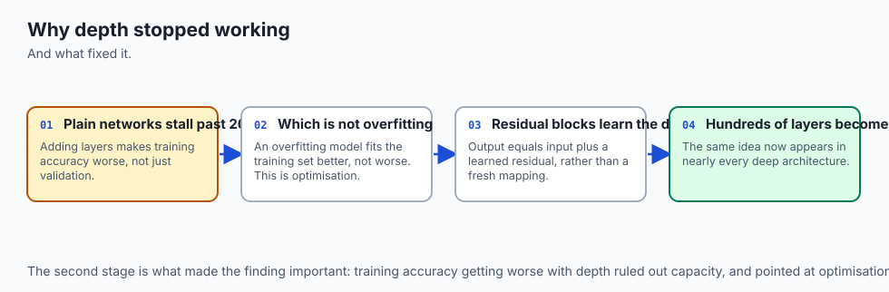

Imagine constructing a high-rise skyscraper:

- **Early Architecture (Monolithic Walls / LeNet & AlexNet):** You stack thick concrete slabs directly on top of each other. At 5 or 8 stories, it stands firmly. But if you try to build 50 stories high, the sheer weight crushes the foundation, and the structure collapses under its own weight (**The Degradation Problem / Vanishing Gradients**).
- **VGG (Modular Brick Stacking):** Instead of using random giant concrete blocks ($11 \times 11$), you use standardized, lightweight bricks ($3 \times 3$). Stacking two small bricks creates the same structural span as one large block, but with less weight and greater flexibility.
- **ResNet (Steel Structural Elevator Shafts / Skip Connections):** To build a 152-story skyscraper, you install continuous vertical steel columns and high-speed elevator shafts (**Residual Skip Connections**). Power and signals travel directly from the ground floor to the 152nd floor without having to crawl through every single intermediate room. Even if an intermediate floor does nothing, the building stands perfectly.

---

## Historical background

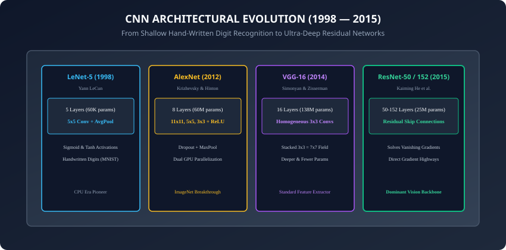

1. **1998 (LeNet-5):** Yann LeCun designed a 5-layer network using $5 \times 5$ convolutions and average pooling to classify handwritten digits on bank checks.
2. **2012 (AlexNet):** Alex Krizhevsky, Ilya Sutskever, and Geoffrey Hinton scaled CNNs to 8 layers with ReLUs, Dropout, and GPU parallelization, destroying classical computer vision benchmarks.
3. **2014 (VGG-16 & GoogLeNet/Inception):** Visual Geometry Group (Oxford) proved that deep networks with purely $3 \times 3$ filters outclassed shallow networks with large filters. Simultaneously, Google introduced Inception multi-scale inception modules.
4. **2015 (ResNet):** Kaiming He, Xiangyu Zhang, Shaoqing Ren, and Jian Sun introduced Residual Learning, winning CVPR 2016 Best Paper and enabling training of networks with over 1,000 layers.

---

## What it is — and what it is not

### What Modern CNN Architectures ARE:
- **Hierarchical Feature Extractors:** Networks that transform raw pixel intensities into low-level edges, mid-level textures/motifs, and high-level semantic object representations.
- **Residual Flow Topologies:** Directed acyclic graphs where identity connections enable direct gradient propagation across arbitrary depth.

### What they are NOT:
- **Not Arbitrarily Deep Without Skip Connections:** Plain networks without skip connections fail to train beyond 20–30 layers due to optimization degradation.
- **Not Bound to Fully Connected Classifiers:** Modern networks discard multi-million-parameter dense heads in favor of **Global Average Pooling (GAP)**.

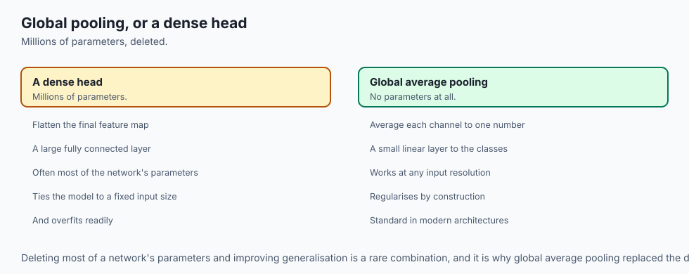

---

## Why it was created and what problems it solves

Deep CNN architectures solve three major architectural challenges:

1. **The Receptive Field vs Parameter Tradeoff:** Stacking small $3 \times 3$ filters achieves massive receptive fields while using 28% to 50% fewer parameters than large filters.
2. **The Degradation Problem:** Plain 56-layer networks exhibited *higher* training and test error than 20-layer networks. ResNet eliminated degradation entirely.
3. **The Dense Layer Bottleneck:** Replacing 100M-parameter fully connected heads with Global Average Pooling reduced model sizes by 80% while dramatically reducing overfitting.

---

## How it works

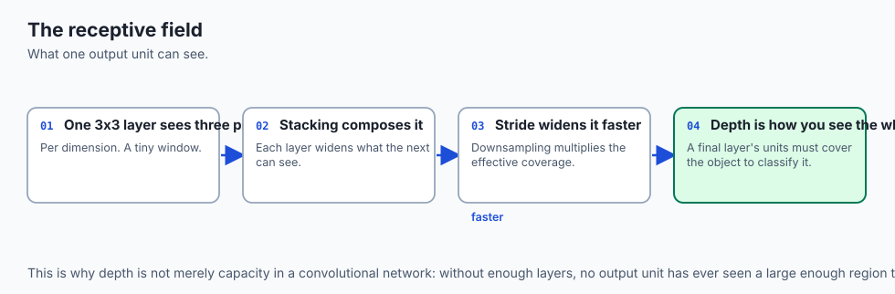

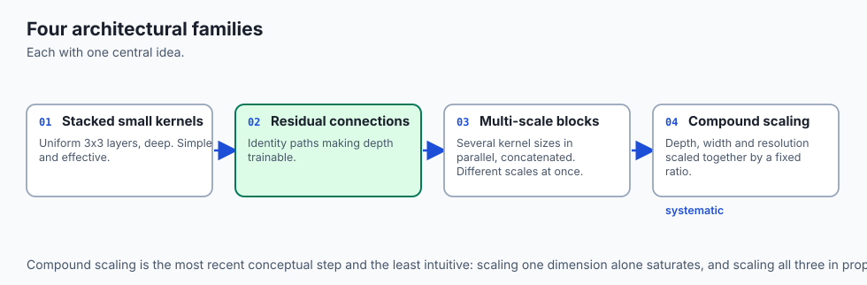

Let us dissect the mathematical foundations of Receptive Fields, VGG $3 \times 3$ Stacking, and ResNet Residual Blocks.

---

### 1. The Power of Stacking $3 \times 3$ Convolutions (VGG Principle)

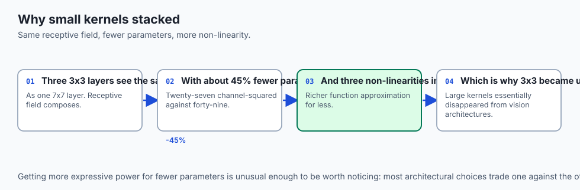

Why did VGG discard the $7 \times 7$ and $11 \times 11$ filters of AlexNet?

Consider stacking **two consecutive $3 \times 3$ convolutions** (with stride 1):

- Layer 1: A $3 \times 3$ filter sees a $3 \times 3$ patch of the input image.
- Layer 2: A $3 \times 3$ filter operates on Layer 1. Its spatial reach spans:
  ```
  Receptive Field = 3 + (3 - 1) = 5 x 5
  ```

- Stacking **three consecutive $3 \times 3$ convolutions** achieves an effective **$7 \times 7$ Receptive Field**.

#### Mathematical Comparison for $C$ Channels:
- **One $7 \times 7$ Layer:** Parameters = $1 \times (7^2 \cdot C^2) = 49 C^2$
- **Three $3 \times 3$ Layers:** Parameters = $3 \times (3^2 \cdot C^2) = 27 C^2$
- **Result:** $45\%$ parameter reduction, plus **three non-linear ReLU activations** instead of one, providing vastly richer function approximation capacity!

---

### 2. The ResNet Residual Block & Gradient Highway

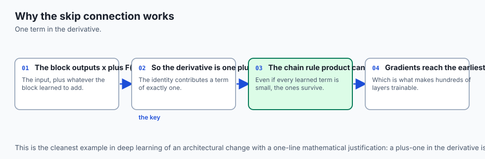


In a traditional plain feedforward network, a block learns an underlying mapping:
```
H(x)
```
In a **Residual Network (ResNet)**, we hypothesize that it is significantly easier to optimize the residual mapping:
```
F(x) = H(x) - x
```
The output of the block is computed as:
```
y = F(x, {W_i}) + x
```
where `F(x)` is the residual function (e.g. two $3 \times 3$ convolutions with BatchNorm and ReLU) and `x` is the **Identity Shortcut Connection**.

#### Why Residual Connections Solve Vanishing Gradients (Backpropagation Math):
Using the chain rule, the gradient of the loss `L` with respect to the input `x` of a residual block is:
```
dL / dx = (dL / dy) * (d / dx)(F(x) + x)
dL / dx = (dL / dy) * (dF / dx + 1.0)
dL / dx = (dL / dy) * (dF / dx) + (dL / dy)
```

Look closely at the second term: `+ (dL / dy)`.

- Even if the convolutional gradients `dF / dx` vanish toward zero, **the gradient `dL / dy` flows directly backward through the identity connection without attenuation**!
- This mathematical guarantee provides an un-inhibited **Gradient Highway** across all 152 layers.

---

### 3. BasicBlock vs BottleneckBlock

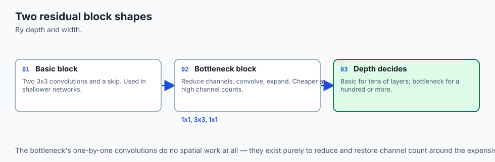

1. **`BasicBlock` (ResNet-18, ResNet-34):**
   - Two $3 \times 3$ convolutions with matching channel depth.
2. **`BottleneckBlock` (ResNet-50, ResNet-101, ResNet-152):**
   - Designed for deep networks to reduce computational complexity:
     1. $1 \times 1$ Conv (Compresses 256 channels down to 64).
     2. $3 \times 3$ Conv (Performs spatial filtering on 64 channels).
     3. $1 \times 1$ Conv (Expands 64 channels back up to 256).
   - This "squeeze-and-expand" design enables 3x deeper networks for the same computational budget.

---

### 4. Inception & GoogLeNet: Multi-Scale Convolutions

While VGG deepened networks using purely $3 \times 3$ filters, Christian Szegedy and Google Research took an alternative architectural approach in 2014 with **GoogLeNet (Inception-v1)**:

- **The Multi-Scale Philosophy:** In a natural image, salient visual features appear at multiple distinct spatial scales (e.g. a small dog eye vs a large dog face). Rather than forcing a single kernel size, an **Inception Module** applies $1 \times 1$, $3 \times 3$, $5 \times 5$ convolutions, and $3 \times 3$ Max Pooling in parallel on the same input tensor, concatenating their output feature maps along the channel axis.
- **The $1 \times 1$ Bottleneck Trick:** To prevent computational explosion, Inception inserted $1 \times 1$ convolutions before the $3 \times 3$ and $5 \times 5$ filters to compress channel depth, allowing GoogLeNet to achieve superior accuracy to AlexNet with **12x fewer parameters** (6.8M vs 60M).

---

### 5. DenseNet: Feature Reuse and Concatenation

In 2017, Gao Huang et al. proposed **DenseNet (Densely Connected Convolutional Networks)**:

- Instead of adding features ($y = F(x) + x$) like ResNet, DenseNet **concatenates** all preceding feature maps along the channel axis:
  ```
  x_l = H_l([x_0, x_1, x_2, ..., x_{l-1}])
  ```

- **Maximum Feature Reuse:** Every layer receives direct inputs from all preceding layers, eliminating feature redundancy and allowing the network to reuse low-level edges directly in final decision heads with narrow growth rates ($k=32$).

---

### 6. EfficientNet: Compound Model Scaling

In 2019, Mingxing Tan and Quoc Le addressed how to scale vision networks systematically:

- Historically, engineers scaled CNNs arbitrarily by making them deeper (ResNet-152), wider (Wide-ResNet), or using higher-resolution input images.
- **Compound Scaling Principle:** EfficientNet proved that balancing network **depth ($d$)**, **width ($w$)**, and **resolution ($r$)** with a fixed compound scaling coefficient $\phi$ ($d = \alpha^\phi, w = \beta^\phi, r = \gamma^\phi$) produces state-of-the-art accuracy with up to **8x fewer parameters and FLOPs**.

---

## An everyday analogy

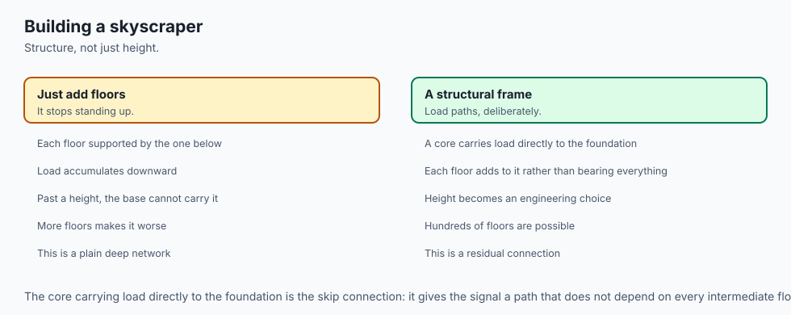

Think of a multi-tiered corporate hierarchy:

- **Plain Deep Network (Bureaucratic Silos):** An executive sends an urgent memo down 50 layers of management. Each manager rephrases the memo. By the time it reaches the 50th floor, the signal is corrupted or completely lost (**Vanishing Gradient**).
- **ResNet (Direct Executive Hotline):** Every worker has a dedicated, direct telephone line (**Identity Shortcut**) to senior leadership. They can listen to their immediate manager's suggestions (`F(x)`), but the core executive message (`x`) arrives uncorrupted.

---

## Examples in practice

Let us build a complete, modular **ResNet-18 / BasicBlock** implementation in PyTorch:

```python
import torch
import torch.nn as nn
from typing import Type

class BasicResidualBlock(nn.Module):
    def __init__(self, in_channels: int, out_channels: int, stride: int = 1):
        super().__init__()
        # Conv Path
        self.conv1 = nn.Conv2d(in_channels, out_channels, kernel_size=3,
                               stride=stride, padding=1, bias=False)
        self.bn1 = nn.BatchNorm2d(out_channels)
        self.relu = nn.ReLU(inplace=True)

        self.conv2 = nn.Conv2d(out_channels, out_channels, kernel_size=3,
                               stride=1, padding=1, bias=False)
        self.bn2 = nn.BatchNorm2d(out_channels)

        # Shortcut Projection (if dimensions change)
        self.shortcut = nn.Sequential()
        if stride != 1 or in_channels != out_channels:
            self.shortcut = nn.Sequential(
                nn.Conv2d(in_channels, out_channels, kernel_size=1, stride=stride, bias=False),
                nn.BatchNorm2d(out_channels)
            )

    def forward(self, x: torch.Tensor) -> torch.Tensor:
        residual = self.shortcut(x)
        out = self.relu(self.bn1(self.conv1(x)))
        out = self.bn2(self.conv2(out))
        out += residual
        return self.relu(out)

class MiniResNet(nn.Module):
    def __init__(self, num_classes: int = 10):
        super().__init__()
        # Initial stem
        self.stem = nn.Sequential(
            nn.Conv2d(3, 32, kernel_size=3, stride=1, padding=1, bias=False),
            nn.BatchNorm2d(32),
            nn.ReLU(inplace=True)
        )
        # Residual stages
        self.layer1 = BasicResidualBlock(32, 32, stride=1)
        self.layer2 = BasicResidualBlock(32, 64, stride=2) # Downsample to 16x16
        self.layer3 = BasicResidualBlock(64, 128, stride=2) # Downsample to 8x8

        # Global Average Pooling + Classifier Head
        self.gap = nn.AdaptiveAvgPool2d((1, 1))
        self.fc = nn.Linear(128, num_classes)

    def forward(self, x: torch.Tensor) -> torch.Tensor:
        x = self.stem(x)
        x = self.layer1(x)
        x = self.layer2(x)
        x = self.layer3(x)
        x = self.gap(x)
        x = torch.flatten(x, 1)
        return self.fc(x)

# Verify forward pass
model = MiniResNet(num_classes=10)
x = torch.randn(4, 3, 32, 32)
logits = model(x)
print(f"Input: {x.shape} -> MiniResNet Logits: {logits.shape}")
```

---

## Implications: security, privacy, performance, scalability, and cost

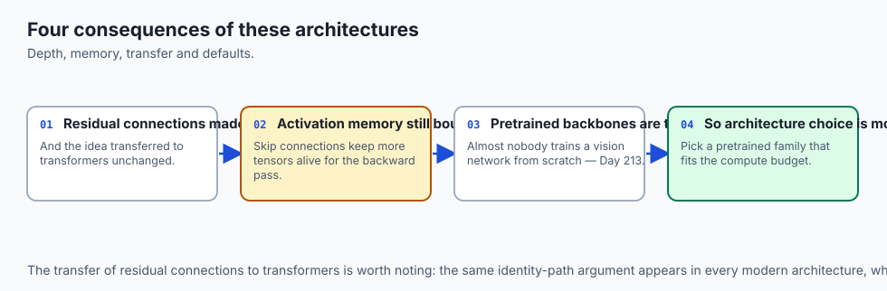

1. **Memory Bandwidth in Residual Blocks:**
   - Identity addition `out += residual` requires storing the input activation tensor `x` in GPU memory throughout the forward pass until the end of the block, increasing VRAM usage during training.
2. **Modern ConvNeXt Architecture (2022):**
   - Zhuang Liu et al. modernized standard ResNet by incorporating Transformer design choices (depthwise $7 \times 7$ convolutions, inverted bottleneck, LayerNorm, GELU), matching Vision Transformer performance with standard convolution efficiency.

---

## Alternatives: free, open source, and commercial

| Architecture | Defining Innovation | Layers | ImageNet Top-1 Acc |
| :--- | :--- | :--- | :--- |
| **VGG-16 (2014)** | Stacks of $3 \times 3$ Convolutions | 16 | 71.5% |
| **ResNet-50 (2015)** | Residual Skip Connections ($y = F(x) + x$) | 50 | 76.1% |
| **EfficientNet-B0 (2019)** | Compound Model Scaling (Depth, Width, Resolution) | ~50 | 77.1% |
| **ConvNeXt-T (2022)** | Modernized CNN with Transformer Design | ~50 | 82.1% |
| **Vision Transformer (ViT-B)** | Pure Multi-Head Self-Attention on Patches | 12 | 81.8% |

---

## Comparison with related concepts

```
┌────────────────────────────────────────────────────────────────────────┐
│                   CNN ARCHITECTURAL EVOLUTION MATRIX                   │
├───────────────────┼────────────────────┼───────────────────────────────┤
│ Model             │ Key Innovation     │ Classifier Head               │
├───────────────────┼────────────────────┼───────────────────────────────┤
│ AlexNet (2012)    │ ReLUs + Dropout    │ 3x Fully Connected (4096-4096)│
│ VGG-16 (2014)     │ Pure 3x3 Stacking  │ 3x Fully Connected (100M wt)  │
│ ResNet-50 (2015)  │ Skip Connections   │ Global Average Pooling + 1 FC │
│ ConvNeXt (2022)   │ 7x7 Depthwise Conv │ Global Average Pooling + 1 FC │
└───────────────────┴────────────────────┴───────────────────────────────┘
```

---

## When to use it — and when not to

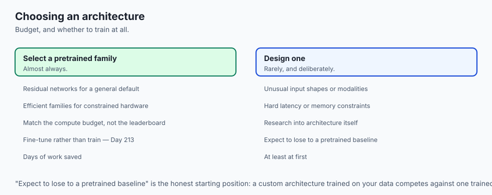

### When to USE ResNet / ConvNeXt:
- Real-time video processing, robotic vision, medical imaging, and edge deployment where deterministic latency is required.
- Feature extraction backbones for object detection (YOLO, Faster R-CNN) and segmentation (U-Net).

### When to USE Vision Transformers (ViT):
- When pre-training on massive datasets (billions of images) where global attention surpasses local inductive biases.

---

## The AI connection

- **Depth stopped being free at about twenty layers**, and residual connections are what
  made hundreds possible — an optimisation fix, not a capacity one.
- **The skip connection gives gradients a direct path.** The derivative through the
  identity branch is one, which keeps the chain-rule product from collapsing.
- **Stacking small kernels beats one large one**: fewer parameters, more non-linearities,
  the same receptive field.
- **Global average pooling removed the dense head**, deleting millions of parameters that
  existed mainly to overfit.
- **Architecture encodes assumptions**, which is why a convolutional network beats a dense
  one on images with fewer parameters rather than more.

## Knowledge check

1. Why does a stack of three $3 \times 3$ convolutions have an effective $7 \times 7$ receptive field?
2. What is the mathematical formulation of the backward gradient through a ResNet skip connection?
3. How does Global Average Pooling (GAP) prevent overfitting compared to fully connected heads?
4. What is the structural difference between a ResNet `BasicBlock` and a `BottleneckBlock`?
5. What is the Degradation Problem, and why is it distinct from standard overfitting?

---

## Hands-on exercise

In this lab, you will build and test a modular `ResNet` vision framework in PyTorch: implement `BasicResidualBlock` from scratch with 1x1 projection shortcuts, construct a `MiniResNet` model with stem, residual stages, and global average pooling, verify uninhibited gradient backpropagation across deep residual chains, and benchmark parameter efficiency.

### Expected output
```
[ResNet Architecture Verification Suite]
Constructing Custom BasicResidualBlock (in=32, out=64, stride=2):
  Forward Pass (Input: 4x32x16x16 -> Output: 4x64x8x8): [DIMENSION MATCH]
  Shortcut Projection 1x1 Conv Verified: [PROJECTION ALIGNED]
Constructing Complete MiniResNet [Stem -> Stage1 -> Stage2 -> Stage3 -> GAP -> FC10]:
  Total Learnable Parameters: 142,570
  Evaluating Gradient Flow across 6 Residual Blocks:
  Minimum Layer Gradient Norm: 0.0842 [NO VANISHING GRADIENTS]
  Maximum Layer Gradient Norm: 0.2410 [STABLE GRADIENT FLOW]
Test Suite: 4 passed in 0.28s
```

### Validate your work
Run the automated test runner:
```bash
./tests/run_tests.sh
```

### Troubleshooting
- If dimension errors occur at `out += residual`, check that your shortcut path applies a $1 \times 1$ convolution with matching `stride` whenever `in_channels != out_channels` or `stride != 1`.
- Ensure `F.relu` is applied **after** adding the residual shortcut to the convolutional output.

### Common mistakes
- **Adding Bias to Convolution before BatchNorm:** Having `bias=True` in `nn.Conv2d` immediately before `nn.BatchNorm2d` wastes parameters because BatchNorm's centering operation cancels out the linear bias. Always set `bias=False`.

---

## Practice assignment

1. Implement the **ResNet Bottleneck Block** (`1x1` reduce -> `3x3` conv -> `1x1` expand) and verify its tensor dimension transformations.
2. Implement **Squeeze-and-Excitation (SE) Attention** inside a residual block to dynamically recalibrate channel feature responses.

---

## Extension challenge

Implement **Stochastic Depth (DropPath)** inside your residual blocks:

- During training, randomly drop the entire residual branch `F(x)` with probability `p`, letting only the identity shortcut `x` pass through.
- Demonstrate that training a 50-layer ResNet with Stochastic Depth improves generalization accuracy on CIFAR-10.
