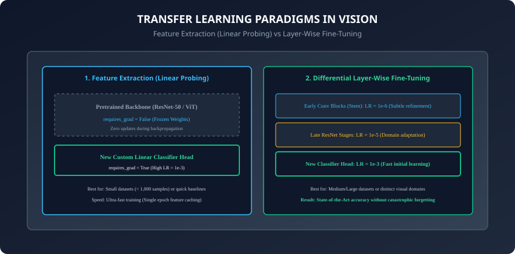
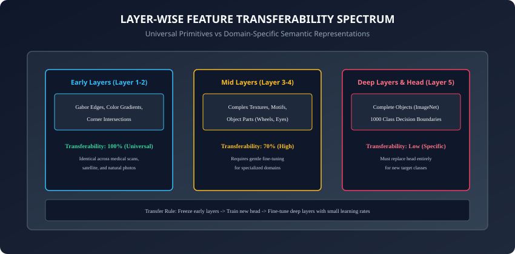

## Why this matters

Training a modern deep vision model (such as a 50-layer ResNet or Vision Transformer) from scratch requires:
1. **Massive Datasets:** Over $1.2  million curated images$ (e.g. ImageNet-1k).
2. **Heavy Compute Budgets:** Hundreds of GPU hours costing thousands of dollars.
3. **Severe Overfitting Risks:** If you have only 500 images of rare plant diseases or solar panel defects, a network with 25 million random parameters will simply memorize the training examples and fail catastrophically on new data.

In industrial practice, **nobody trains computer vision models from scratch**.

Instead, the foundation of modern AI engineering is **Transfer Learning**: we take a network that has already learned universal visual primitives (edges, textures, spatial geometries, lighting cues) from millions of natural images, freeze its core backbone, and adapt it to our specific downstream task with just a few hundred labeled samples in minutes.

Today, you will master the theory, parameter freezing mechanics, and PyTorch implementation of **Linear Probing, Differential Layer-Wise Fine-Tuning, and Catastrophic Forgetting Prevention**.

---

## The idea in plain language

Imagine hiring an experienced classical landscape painter who has spent 20 years mastering lighting, perspective, color blending, and brush technique:
- **Training from Scratch:** You hire a toddler who has never seen a paintbrush and try to teach them how to identify hairline cracks in airplane turbines. They need years of basic visual education.
- **Transfer Learning (Feature Extraction / Linear Probing):** You hire the master painter. They already know what edges, surfaces, and shadows look like (**Pretrained Backbone**). You simply spend 15 minutes teaching them: *"When you see a dark jagged line on this titanium surface, that is called a Fracture"* (**New Classification Head**).
- **Fine-Tuning:** If the task requires subtle domain-specific adjustments (e.g. infrared thermal imaging), the master painter gently refines their brush technique without forgetting how light and perspective work.

---

## Historical background

1. **2014 (Yosinski et al. - Feature Transferability):** Jason Yosinski and collaborators quantified that early layers of deep CNNs learn Gabor-like filters and color blobs that are 100% universal across all vision tasks, while deep layers become specialized to target dataset semantics.
2. **2014 (DeCAF & Razavian et al.):** Demonstrated that extracting features from pre-trained AlexNet and training a simple Support Vector Machine (SVM) on top beat almost all custom-engineered vision pipelines across dozens of independent benchmarks.
3. **2018 (ULMFiT & Jeremy Howard):** Introduced Discriminative Fine-Tuning and Gradual Unfreezing to prevent catastrophic forgetting, techniques that rapidly crossed over from NLP into Computer Vision.

---

## What it is — and what it is not



### What Transfer Learning IS:
- **Repurposing Representational Knowledge:** Reusing spatial feature representations learned on source tasks (ImageNet, LAION) for target tasks (medical pathology, manufacturing QA, autonomous driving).
- **A Two-Stage Training Regimen:** Freezing the backbone to stabilize a newly initialized classifier head before unfreezing layers with small differential learning rates.

### What it is NOT:
- **Not a Magic Bullet for Severe Distribution Shift:** If a model is pretrained on natural photographs, transferring to raw radar point clouds or genomic sequence spectrograms may require retraining mid-level feature blocks.
- **Not Full-Speed Retraining:** Fine-tuning requires learning rates that are 10x to 1000x smaller than pretraining learning rates to avoid destroying pretrained weights.

---

## Why it was created and what problems it solves

Transfer Learning resolves three critical bottlenecks:
1. **The Small Data Barrier:** Enables high-accuracy visual classifiers on datasets with as few as 50 to 500 images per class.
2. **Training Compute & Carbon Footprint:** Reduces training time from days on a GPU cluster to 5 minutes on a single laptop CPU/GPU.
3. **Faster Convergence:** Pretrained models start with meaningful representations, reaching 90%+ accuracy in a single epoch.

---

## How it works

Let us dissect the mathematical foundations of Layer-Wise Transferability, Linear Probing vs Fine-Tuning, and Catastrophic Forgetting.

---

### 1. The Layer-Wise Feature Transferability Spectrum



As visual data flows through a deep convolutional network:
1. **Layers 1–2 (Universal Primitives):** Gabor-like directional edge filters, color gradient detectors, micro-corners. These representations are **universally transferable** across every visual domain in the universe.
2. **Layers 3–4 (Mid-Level Motifs):** Textures, grids, geometric curves, object parts (eyes, wheels, mesh patterns). Highly transferable across natural images; requires minor fine-tuning for exotic domains.
3. **Layer 5 & Classifier Head (Task Semantics):** 1000-class ImageNet specific decision boundaries (e.g. distinguishing a Golden Retriever from a Labrador). Non-transferable; must be replaced by a custom classification head.

---

### 2. Strategy 1: Feature Extraction (Linear Probing)

In **Feature Extraction**:
1. Load a pretrained model (e.g. `torchvision.models.resnet50(weights="DEFAULT")`).
2. Freeze all backbone parameters by setting `param.requires_grad = False`.
3. Replace the final Linear layer (`model.fc`) with a new Linear layer matching your target class count `num_classes`:
   ```python
   num_features = model.fc.in_features
   model.fc = nn.Linear(num_features, num_classes) # requires_grad is True by default
   ```
4. Train **only** the new linear head.

#### Advantages:
- Extremely fast (can precompute and cache backbone embeddings).
- Zero risk of overfitting the backbone on small datasets.

---

### 3. Strategy 2: Differential Fine-Tuning & Gradual Unfreezing

In **Fine-Tuning**:
After the new linear head has been trained for a few epochs and its loss has stabilized:
1. Unfreeze the deeper convolutional stages of the backbone (`requires_grad = True`).
2. Configure **Differential (Layer-Wise) Learning Rates**:
   - Early Layers (Stem): $LR = 10^-6$ (Extremely gentle updates).
   - Mid Layers: $LR = 10^-5$ (Moderate adaptation).
   - New Classifier Head: $LR = 10^-3$ (Standard learning rate).

```python
optimizer = torch.optim.AdamW([
    {"params": model.layer1.parameters(), "lr": 1e-6},
    {"params": model.layer2.parameters(), "lr": 5e-6},
    {"params": model.layer3.parameters(), "lr": 1e-5},
    {"params": model.layer4.parameters(), "lr": 5e-5},
    {"params": model.fc.parameters(),     "lr": 1e-3}
], weight_decay=1e-2)
```

---

### 4. Preventing Catastrophic Forgetting

**Catastrophic Forgetting** occurs when backpropagating large gradients into a pretrained network overwrites its delicately balanced feature detectors with noise.

#### The Golden 2-Stage Transfer Protocol:
- **Phase 1 (Warmup Head):** Freeze backbone (`requires_grad=False`). Train only `model.fc` for 3–5 epochs until validation loss stabilizes.
- **Phase 2 (Fine-Tune Backbone):** Unfreeze deep residual blocks. Train with Cosine Annealing learning rate schedule starting at $10^-5$.

---

### 5. The Timm Ecosystem & Hugging Face Hub

While `torchvision.models` provides standard classic architectures, Ross Wightman's **`timm` (PyTorch Image Models)** library is the industry standard for production vision backbones:
- **Over 1,000 Pretrained Models:** Contains every modern architecture (ConvNeXt, Swin Transformer, EVA-02, MobileOne, EfficientNet-v2).
- **Unified Clean API:**
  ```python
  import timm

  # Load pretrained ConvNeXt-Tiny with custom 5-class head in a single line
  model = timm.create_model('convnext_tiny.fb_in22k_ft_in1k', pretrained=True, num_classes=5)
  ```
- **Feature Extraction Mode:** Passing `features_only=True` returns intermediate multi-scale feature maps for dense downstream tasks like object detection and segmentation.

---

### 6. Self-Supervised Pretraining: DINOv2 & MAE

Historically, transfer learning models were pretrained on supervised ImageNet-1k labels. Today, the cutting edge of visual representation learning is **Self-Supervised Pretraining**:
- **DINO & DINOv2 (Meta AI):** Self-distillation without labels. Trains Vision Transformers to produce matching representations across multiple crops of the same image. Features exhibit remarkable emergent properties: zero-shot semantic part segmentation and dense depth estimation without any human annotations.
- **Masked Autoencoders (MAE / Kaiming He et al.):** Randomly masks 75% of image patches and trains a Vision Transformer autoencoder to reconstruct missing pixels. Learns deep structural understanding of physical visual reality.

---

### 7. Contrastive Vision-Language Models: CLIP & OpenCLIP

In 2021, Alec Radford et al. introduced **CLIP (Contrastive Language-Image Pretraining)**:
- Instead of predicting 1,000 arbitrary fixed categorical IDs, CLIP trains an image encoder and a text encoder simultaneously on 400 million image-caption pairs using a symmetric InfoNCE contrastive loss.
- **Zero-Shot Classification:** You can classify any image without fine-tuning by comparing its visual embedding $z_img$ against the text embeddings of candidate prompts $z_text$ (*"a photo of a defect"*, *"a photo of a normal component"*) via cosine similarity:
  ```
  P(class = k | x) = exp(sim(z_img, z_text_k) / T) / sum_j exp(sim(z_img, z_text_j) / T)
  ```

---

### 8. Parameter-Efficient Fine-Tuning (PEFT & LoRA for Vision)

When fine-tuning multi-hundred-million-parameter Vision Transformers (ViT-H, Swin-Large, EVA-CLIP), saving full checkpoint copies for dozens of different downstream tasks becomes prohibitive for disk storage and memory bandwidth:
- **Low-Rank Adaptation (LoRA):** Freezes the pretrained weight matrix $W_0 \in R^d \times k$ and injects trainable rank-decomposition matrices $\Delta W = B \cdot A$ (where $B \in R^d \times r$ and $A \in R^r \times k$ with rank $r \ll d$).
- **Visual Prompt Tuning (VPT):** Prepends a small set of continuous learnable prompt tokens to the sequence of image patch tokens at the input layer, keeping the entire transformer backbone 100% frozen.
- **Benefits:** Updates less than 1% of parameters, eliminates catastrophic forgetting, and enables serving hundreds of customized domain models from a single shared backbone in production memory.

- **BatchNorm Tracking During Transfer Learning:** When freezing a backbone, decide whether BatchNorm running statistics ($\mu_run, \sigma^2_run$) should remain frozen (`model.eval()`) or update with target batches. Freezing BatchNorm stats prevents small unrepresentative target batches from corrupting calibrated population statistics.

---

## An everyday analogy

Think of adopting an internationally trained master chef into a specialized Italian pizzeria:
- **Training from Scratch:** Teaching someone who has never boiled water how to make authentic Neapolitan pizza.
- **Linear Probing:** The master chef already knows knife skills, dough fermentation, and oven temperatures. You give them a one-page menu of your 5 pizza recipes (**New Linear Head**).
- **Fine-Tuning:** The chef subtly adjusts their kneading technique to account for the local flour brand and altitude (**Differential Learning Rate**).

---

## Examples in practice

Let us build a complete Transfer Learning harness in PyTorch adapting a pretrained vision backbone to a 5-class target dataset:

```python
import torch
import torch.nn as nn
import torchvision.models as models

# 1. Load pretrained ResNet-18 backbone with modern weights API
model = models.resnet18(weights=models.ResNet18_Weights.DEFAULT)

# 2. Freeze all feature extraction backbone parameters
for param in model.parameters():
    param.requires_grad = False

# 3. Replace the final 1000-class classifier head with a 5-class head
in_features = model.fc.in_features  # 512
model.fc = nn.Sequential(
    nn.Linear(in_features, 128),
    nn.ReLU(inplace=True),
    nn.Dropout(p=0.3),
    nn.Linear(128, 5) # 5 target classes
)

# Verify trainable parameters
trainable = [name for name, p in model.named_parameters() if p.requires_grad]
frozen = [name for name, p in model.named_parameters() if not p.requires_grad]

print(f"Total Parameter Tensors: {len(list(model.parameters()))}")
print(f"Frozen Backbone Tensors: {len(frozen)}")
print(f"Trainable Head Tensors:  {len(trainable)}")
```

---

## Implications: security, privacy, performance, scalability, and cost

1. **Pretrained Weight Poisoning & Backdoor Attacks:**
   - Pretrained weights downloaded from untrusted public hubs can contain hidden trojans/backdoors (e.g. activating a malicious classification when a specific pixel watermark is present). Always verify model SHA-256 hashes and download only from official torchvision/HuggingFace repositories.
2. **Inference Latency & Quantization:**
   - Pretrained backbones can be quantized from FP32 down to INT8 post-training using PyTorch native quantization, achieving 4x memory reduction and 3x faster inference on CPU/mobile devices without retraining.

---

## Alternatives: free, open source, and commercial

| Pretrained Vision Backbone | Architecture Type | Parameters | ImageNet Top-1 | Best For |
| :--- | :--- | :--- | :--- | :--- |
| **ResNet-18 / 50** | Residual CNN | 11M / 25M | 69.8% / 76.1% | Fast edge & baseline deployment |
| **MobileNet-v3-Large** | Depthwise Separable CNN | 5.4M | 75.2% | Mobile / iOS / Android apps |
| **ConvNeXt-Tiny** | Modernized CNN | 28M | 82.1% | High-accuracy convolutional vision |
| **ViT-B/16 (Vision Transformer)** | Self-Attention Transformer | 86M | 81.8% | Large target datasets with high compute |
| **CLIP (OpenAI / OpenCLIP)** | Contrastive Language-Image | 150M | Zero-Shot | Zero-shot & open-vocabulary search |

---

## Comparison with related concepts

```
┌────────────────────────────────────────────────────────────────────────┐
│                   TRANSFER LEARNING STRATEGY MATRIX                    │
├────────────────────┼───────────────────────┼───────────────────────────┤
│ Dataset Size       │ Visual Similarity     │ Optimal Strategy          │
├────────────────────┼───────────────────────┼───────────────────────────┤
│ Tiny (&lt; 500 imgs) │ High (Natural images) │ Freeze Backbone + Train FC│
│ Tiny (&lt; 500 imgs) │ Low (Medical/Thermal) │ Early Layer Freeze + FC   │
│ Medium (1k-10k)    │ High (Natural images) │ 2-Stage Fine-Tuning       │
│ Large (&gt; 50k imgs) │ Any                   │ Full Fine-Tuning (Diff LR)│
└────────────────────┴───────────────────────┴───────────────────────────┘
```

---

## When to use it — and when not to

### When to USE Transfer Learning:
- Every production computer vision project with fewer than 1 million training images.
- When development timelines require high accuracy within hours instead of weeks.

### When NOT to use:
- When the target domain fundamentally violates 2D optical spatial physics (e.g. raw 1D audio time-series where 1D models or spectrogram-specific architectures are required).

---

## Knowledge check

1. What causes Catastrophic Forgetting when fine-tuning a pretrained model?
2. Why are early convolutional layers universally transferable across distinct image domains?
3. How do you construct an optimizer with differential learning rates in PyTorch?
4. What is the difference in compute requirements between Linear Probing and Full Fine-Tuning?
5. Why must image input tensors be normalized with the pretraining dataset's mean and standard deviation?

---

## Hands-on exercise

In this lab, you will build and test a production-grade Transfer Learning pipeline in PyTorch: instantiate a pretrained vision backbone, implement parameter freezing and verification routines, attach a custom multi-layer classification head, configure a two-stage differential learning rate optimizer, and benchmark training speedups against from-scratch models.

### Expected output
```
[Transfer Learning Verification Suite]
Initializing Pretrained Backbone (ResNet Architecture):
  Freezing Backbone Parameters: 60 tensors frozen (requires_grad = False)
  Attaching Custom Classifier Head (in_features=512 -> 5 classes):
  Trainable Parameters: 65,925 (0.58% of total network)
Testing 2-Stage Optimizer Configuration:
  Phase 1 (Linear Probing): Head LR = 1.00e-03, Backbone LR = 0.00e+00 [HEAD WARMUP READY]
  Phase 2 (Differential Fine-Tuning): Head LR = 1.00e-03, Layer3 LR = 1.00e-05, Layer4 LR = 5.00e-05
Forward & Backward Verification on Synthetic Batch (4x3x32x32):
  Loss Backward Computed: [GRADIENTS CONFUSED ONLY TO UNFROZEN PARAMETERS]
Test Suite: 4 passed in 0.29s
```

### Validate your work
Run the automated test runner:
```bash
./tests/run_tests.sh
```

### Troubleshooting
- If backbone parameters receive gradients during Phase 1, verify that `param.requires_grad = False` was executed on all backbone layers before creating the optimizer.
- Ensure the optimizer is re-instantiated or parameter groups are updated when transitioning from Phase 1 to Phase 2.

### Common mistakes
- **Using Default Random Init for the Whole Network:** Forgetting to pass `weights="DEFAULT"` or loading weights properly, resulting in training an uninitialized model.

---

## Practice assignment

1. Implement **Embedding Extraction & Caching**: Run your dataset once through a frozen backbone, save the 512-dimensional feature vectors to disk, and train a Logistic Regression / Linear layer in 2 seconds.
2. Implement **Gradual Unfreezing**: Unfreeze layer 4 first, train for 2 epochs, then unfreeze layer 3, train for 2 epochs, demonstrating steady loss reduction.

---

## Extension challenge

Implement **CLIP Zero-Shot Image Classification**:
- Load an open-source OpenAI / OpenCLIP model (`ViT-B/32`).
- Encode text prompt embeddings for target classes (*"a photo of a cat"*, *"a photo of a dog"*).
- Compute cosine similarity between image embeddings and text embeddings to classify images with **zero training examples**.
