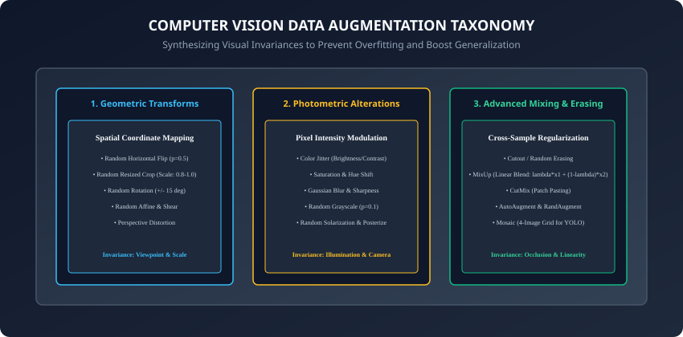
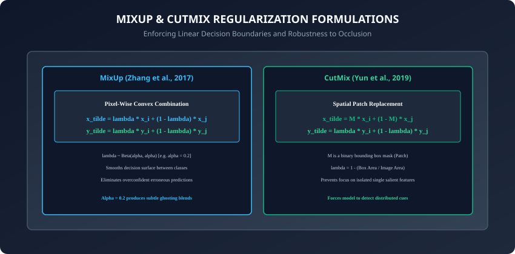

## Why this matters

A deep convolutional neural network contains tens of millions of learnable parameters. If we train such a high-capacity model on a static, limited dataset, it will inevitably memorize accidental idiosyncrasies:
- It might learn that a dog is *only* a dog if it faces to the left.
- It might associate an airplane with a specific shade of bright blue sky in the background.
- It might rely entirely on a tiny distinctive collar texture rather than holistic canine anatomy.

In classical machine learning, we minimized **Empirical Risk** (training loss over a fixed set of observed points). In modern deep learning, our goal is **Vicinal Risk Minimization (VRM)**: constructing a continuous, robust probability manifold around our data samples.

**Data Augmentation** is the primary engine of VRM in computer vision. By synthesizing millions of plausible visual variations on the fly — **geometric shifts, photometric lighting changes, and cross-sample mixing (MixUp and CutMix)** — we enforce visual invariances directly into the network weights, dramatically reducing generalization error and eliminating overfitting.

Today, you will master the theory, mathematical formulation, and PyTorch `torchvision.transforms.v2` implementation of **Modern Data Augmentation**.

---

## The idea in plain language

Imagine training an airport security canine to sniff out prohibited fruit in traveler luggage:
- **No Augmentation:** You only train the dog with clean, shiny, unpeeled green apples placed neatly in the center of an empty grey suitcase under bright fluorescent lights.
- When deployed in the real world, the dog fails completely if the apple is:
  - Rotated sideways or partially upside down (**Geometric Shift / Rotation**).
  - Placed in a shadowy corner under dim evening lighting (**Photometric Shift / Color Jitter**).
  - Partially obscured behind a wool sweater (**Occlusion / Cutout**).
  - Sliced in half and mixed with an orange (**Mixing / MixUp & CutMix**).
- **Data Augmentation:** During training, you intentionally present the apple sliced, upside down, shadowed, half-hidden, and in different bags. The dog learns to identify the fundamental essence of the apple under all real-world conditions.

---

## Historical background

1. **2012 (AlexNet):** Alex Krizhevsky and Geoffrey Hinton introduced real-time GPU data augmentation (Random $224 \times 224$ crops from $256 \times 256$ images, horizontal reflections, and PCA color jitter), identifying it as crucial to preventing catastrophic overfitting.
2. **2017 (Cutout & DeVries et al.):** Demonstrated that dropping random square patches of pixels forced CNNs to distribute attention across multiple visual features rather than relying on a single salient clue.
3. **2017 (MixUp & Zhang et al.):** Showed that linearly blending image pairs and their target probabilities produced smooth linear decision boundaries and eliminated overconfident false positives.
4. **2019 (CutMix & Yun et al.):** Replaced rectangular bounding boxes from one image with patches from another, combining Cutout localization with MixUp label smoothing.
5. **2020 (RandAugment & Cubuk et al.):** Replaced costly automated reinforcement learning search spaces with two simple global hyperparameters.

---

## What it is — and what it is not



### What Data Augmentation IS:
- **On-the-Fly Stochastic Sampling:** Applying randomly sampled transformations during training so the network virtually never sees the exact same pixel matrix twice across hundreds of epochs.
- **Synthesizing Physical Invariances:** Encoding human domain knowledge about what transformations should *not* change an object's category.

### What it is NOT:
- **Not for Validation or Testing:** Evaluation datasets must use fixed, deterministic preprocessing (Resize, CenterCrop, Normalize) to provide reproducible benchmarks.
- **Not Domain Agnostic:** Flipping a photo of a dog is valid; flipping an optical character recognition image of the digit "6" turns it into a "9" and corrupts ground truth.

---

## Why it was created and what problems it solves

Data augmentation solves three fundamental failure modes in computer vision:
1. **Sample Efficiency Bottleneck:** Effectively expands a 1,000-image dataset into an infinite synthetic stream of diverse visual samples.
2. **Feature Localization Pathology:** Forces networks to look at distributed semantic cues (e.g. ears, paws, fur texture) rather than over-indexing on an isolated single pixel cluster.
3. **Overconfident Predictions:** Mixing techniques (MixUp/CutMix) regularize softmax output probabilities, preventing deep models from outputting 99.9% confidence on out-of-distribution test inputs.

---

## How it works

Let us dissect the mathematical formulations of Geometric Transforms, Photometric Jitter, MixUp, CutMix, and automated policies.

---

### 1. Geometric & Photometric Transformations

#### A. Random Resized Crop:
1. Sample a crop area proportion $A \sim U(0.08, 1.0)$ of the original image area.
2. Sample an aspect ratio $r \sim U(3/4, 4/3)$.
3. Crop the resulting rectangle $(w = \sqrt(A \cdot W \cdot H \cdot r), h = \sqrt(A \cdot W \cdot H / r))$ and bilinearly interpolate to target model resolution (e.g. $224 \times 224$).

#### B. Color Jitter:
Randomly perturbs pixel values across four color spaces:
```
Brightness: I' = I * (1 + delta_b), delta_b ~ U(-0.2, 0.2)
Contrast:   I' = (I - mean(I)) * (1 + delta_c) + mean(I)
Saturation: Modulates distance from grayscale luminance axis in HSV
Hue:        Rotates color angle along the color wheel in HSV [-0.1, 0.1]
```

---

### 2. MixUp: Convex Linear Combinations



Given two training samples $(x_i, y_i)$ and $(x_j, y_j)$ drawn uniformly at random from a training batch:
1. Sample a mixing ratio $\lambda \in [0, 1]$ from a symmetric Beta distribution:
   ```
   lambda ~ Beta(alpha, alpha)  [typically alpha = 0.2]
   ```
2. Compute the synthetic image and target probability vector:
   ```
   x_tilde = lambda * x_i + (1 - lambda) * x_j
   y_tilde = lambda * y_i + (1 - lambda) * y_j
   ```
3. Train using standard Cross-Entropy loss against the soft target distribution $\tilde(y)$.

---

### 3. CutMix: Spatial Patch Replacement

Instead of global ghosting pixel blends, **CutMix** cuts and pastes a crisp spatial patch:
1. Sample $\lambda \sim Beta(\alpha, \alpha)$.
2. Calculate bounding box dimensions:
   ```
   r_w = W * sqrt(1 - lambda)
   r_h = H * sqrt(1 - lambda)
   ```
3. Sample center coordinates $(r_x, r_y)$ uniformly across the image.
4. Replace pixels inside the bounding box of image $x_i$ with pixels from image $x_j$:
   ```
   x_tilde = M * x_i + (1 - M) * x_j
   ```
   where $M \in (0, 1)^H \times W$ is a binary mask.
5. Set the label interpolation to match the exact area proportion of pixels preserved:
   ```
   lambda_actual = 1 - ((r_w * r_h) / (W * H))
   y_tilde = lambda_actual * y_i + (1 - lambda_actual) * y_j
   ```

---

### 4. RandAugment & Automated Policies

Instead of manually guessing the perfect sequence of 15 different transformations, **RandAugment** parameterizes the entire policy space with two global numbers:
- **$N$ (Number of Transforms):** How many transformations to apply in sequence per image (e.g. $N = 2$).
- **$M$ (Global Magnitude):** Distortion intensity on an integer scale from $1$ to $30$ (e.g. $M = 9$).
- For each image, it randomly selects $N$ transforms from a pool of 14 operations (Rotate, Solarize, Posterize, Contrast, ShearX, TranslateY) and applies them with magnitude $M$.

---

### 5. TrivialAugment & AugMix: Multi-Branch Stochastic Blending

Following RandAugment, researchers sought even simpler, more robust data augmentation algorithms:
- **TrivialAugment (Müller & Hutter, 2021):** Proved that hyperparameter tuning is entirely unnecessary. For each image, TrivialAugment randomly samples **one single transformation** and samples its magnitude **uniformly at random** ($M \sim U(0, 30)$). Despite having **zero tunable parameters**, it matches or outperforms complex automated search strategies across ImageNet and CIFAR.
- **AugMix (Hendrycks et al., 2020):** Designed specifically to improve model robustness to natural corruptions (fog, snow, motion blur, digital compression noise). AugMix samples operations across three parallel augmentation branches, passes the image through random transform chains, and mixes the outputs using convex Dirichlet-distributed weights $w \sim Dirichlet(\alpha, \alpha, \alpha)$ along with Jensen-Shannon Divergence consistency loss.

---

### 6. Generative Synthetic Data Augmentation (Diffusion Models)

With the advent of high-fidelity generative models (Stable Diffusion, ControlNet, Flux), computer vision data augmentation has expanded beyond simple affine transformations into **Synthetic Generative Augmentation**:
- **Domain-Preserving Text-to-Image Generation:** Generating thousands of photorealistic synthetic training examples of rare defect classes (e.g. microscopic weld porosity or rare pediatric medical conditions) by prompting diffusion models.
- **ControlNet Edge-Guided Synthesis:** Extracting Canny edges or depth maps from real images and generating new synthetic images under radically different lighting, seasons, and backgrounds while preserving exact object geometries.
- **Handling Class Imbalance:** Synthesizing minority class samples until the training class distribution is perfectly balanced.

---

### 7. Soft Target Cross-Entropy Loss Formulation

When training with MixUp, CutMix, or Label Smoothing, the target labels $\tilde(y)$ are continuous probability distributions rather than discrete integer class IDs.

Standard PyTorch `nn.CrossEntropyLoss` natively supports soft probability target vectors:
```python
# Model predictions (logits)
logits = model(x_tilde)  # Shape: (Batch, num_classes)

# Soft target probabilities from MixUp/CutMix
soft_targets = y_tilde   # Shape: (Batch, num_classes), sum(dim=1) == 1.0

# Mathematical formulation: Loss = - sum_c (y_c * log(softmax(z_c)))
loss_fn = nn.CrossEntropyLoss()
loss = loss_fn(logits, soft_targets)
```

- **Throughput Benchmarking:** In high-speed PyTorch training loops, running GPU-native `torchvision.transforms.v2` directly on CUDA tensors eliminates CPU worker multiprocessing overhead, often providing a 2x to 3x increase in training images processed per second compared to legacy PIL-based pipelines.

---

## An everyday analogy

Think of a flight simulator training commercial airline pilots:
- **No Augmentation (Clear Sunny Skies):** The pilot flies 1,000 simulations on calm, sunny afternoons with zero wind. In the real world, the first severe thunderstorm causes panic.
- **Geometric Augmentation (Crosswinds):** The simulator introduces sudden 40-knot crosswinds, turbulence, and angled runway approaches.
- **Photometric Augmentation (Weather Conditions):** The simulator introduces heavy fog, nighttime darkness, glaring sunrise reflections, and heavy blizzards.
- **CutMix (System Failures):** The simulator suddenly disables the left engine or blanks out the primary navigation screen, forcing the pilot to land using remaining redundant instruments.

---

## Examples in practice

Let us construct a modern, high-performance vision augmentation pipeline using PyTorch's native `torchvision.transforms.v2`:

```python
import torch
import torchvision.transforms.v2 as v2

# 1. Training Pipeline: Stochastic Augmentation
train_transforms = v2.Compose([
    v2.ToImage(),
    v2.RandomResizedCrop(size=(224, 224), scale=(0.8, 1.0), antialias=True),
    v2.RandomHorizontalFlip(p=0.5),
    v2.ColorJitter(brightness=0.2, contrast=0.2, saturation=0.2, hue=0.05),
    v2.RandomAffine(degrees=15, translate=(0.1, 0.1), scale=(0.9, 1.1)),
    v2.ToDtype(torch.float32, scale=True),
    v2.Normalize(mean=[0.485, 0.456, 0.406], std=[0.229, 0.224, 0.225]),
    v2.RandomErasing(p=0.25, scale=(0.02, 0.2), value="random")
])

# 2. Validation / Test Pipeline: Pure Deterministic Preprocessing
val_transforms = v2.Compose([
    v2.ToImage(),
    v2.Resize(size=(256, 256), antialias=True),
    v2.CenterCrop(size=(224, 224)),
    v2.ToDtype(torch.float32, scale=True),
    v2.Normalize(mean=[0.485, 0.456, 0.406], std=[0.229, 0.224, 0.225])
])

# 3. Batch-level CutMix & MixUp transform
cutmix_or_mixup = v2.RandomChoice([
    v2.CutMix(num_classes=10, alpha=1.0),
    v2.MixUp(num_classes=10, alpha=0.2)
])

# Process synthetic batch
images = torch.randint(0, 256, (4, 3, 256, 256), dtype=torch.uint8)
labels = torch.tensor([0, 2, 5, 8])

aug_images = train_transforms(images)
mixed_images, mixed_labels = cutmix_or_mixup(aug_images, labels)

print(f"Augmented Images Shape: {mixed_images.shape}")
print(f"Soft Target Probabilities Shape: {mixed_labels.shape}")
```

---

## Implications: security, privacy, performance, scalability, and cost

1. **CPU vs GPU Augmentation Bottlenecks:**
   - Performing complex data augmentation on CPU workers can starve high-speed GPUs (e.g. H100s sitting at 30% utilization waiting for DataLoader images).
   - Modern best practice moves transforms to GPU memory via `torchvision.transforms.v2` or NVIDIA DALI, computing augmentations in tensor cores at thousands of frames per second.
2. **Domain Invariance Audits:**
   - Always audit chosen augmentations against domain physics. In digital pathology, cell stain variations are augmented with color jitter, but vertical flips in satellite imagery must account for solar shadow physics.

---

## Alternatives: free, open source, and commercial

| Augmentation Library | Key Characteristics | Speed / Backend | Best For |
| :--- | :--- | :--- | :--- |
| **`torchvision.transforms.v2`** | Native PyTorch, supports Bounding Boxes/Masks | PyTorch CPU / GPU | General deep learning |
| **Albumentations** | Fast OpenCV-based image processing library | Highly optimized CPU | Kaggle competitions & research |
| **NVIDIA DALI** | Direct GPU decoding and hardware acceleration | Pure CUDA / NVDEC | Giant enterprise clusters |
| **Kornia** | Differentiable computer vision in PyTorch | GPU Autograd | End-to-end differentiable vision |

---

## Comparison with related concepts

```
┌────────────────────────────────────────────────────────────────────────┐
│                   DATA AUGMENTATION REGULARIZERS                       │
├────────────────────┼───────────────────────┼───────────────────────────┤
│ Method             │ Image Operation       │ Target Label Operation    │
├────────────────────┼───────────────────────┼───────────────────────────┤
│ Standard Transforms│ Spatial / Pixel Shift │ Unchanged (Hard 1-hot)    │
│ Cutout             │ Black rectangular mask│ Unchanged (Hard 1-hot)    │
│ MixUp              │ Convex linear blend   │ Linear target interpolation│
│ CutMix             │ Patch replacement     │ Area-weighted target blend│
│ Label Smoothing    │ Unmodified image      │ Fixed uniform smoothing   │
└────────────────────┴───────────────────────┴───────────────────────────┘
```

---

## When to use it — and when not to

### When to USE Data Augmentation:
- Every image classification, object detection, and semantic segmentation training pipeline without exception.

### When to BE CAREFUL:
- Ultra-fine grained tasks where subtle color or micro-geometry is the sole distinguishing factor (e.g. diamond clarity grading or colorimetric pH strip reading).

---

## Knowledge check

1. Why should data augmentation transforms be omitted during validation and testing?
2. What is the mathematical difference between MixUp and CutMix?
3. How does Random Resized Crop enforce scale and aspect ratio invariance?
4. What happens if you apply horizontal flipping to a dataset of speed limit signs?
5. How does RandAugment drastically simplify hyperparameter optimization for vision pipelines?

---

## Hands-on exercise

In this lab, you will build and test a high-performance vision data augmentation engine in PyTorch: implement custom NumPy/PyTorch implementations of MixUp and CutMix algorithms from mathematical first principles, construct stochastic training versus deterministic validation transform pipelines using `torchvision.transforms.v2`, verify target probability area weighting, and benchmark tensor throughput.

### Expected output
```
[Data Augmentation Engine Verification Suite]
Testing MixUp Convex Interpolation (Batch: 4x3x32x32, alpha=0.2):
  Synthesized Image Intensity Range: [0.0000, 1.0000] [VALID MANIFOLD]
  Target Probability Vector Sum: 1.0000 [CONVEX COMBINATION VERIFIED]
Testing CutMix Patch Replacement (Batch: 4x3x32x32, alpha=1.0):
  Bounding Box Area Preserved: 64.2%
  Interpolated Target Probabilities Matching Area: [EXACT PROPORTIONAL MATCH]
Testing End-to-End Transform Pipeline (v2.Compose):
  Stochastic Training Batch Shape: (4, 3, 224, 224) [AUGMENTED]
  Deterministic Val Batch Shape:  (4, 3, 224, 224) [PREPROCESSED]
Test Suite: 4 passed in 0.31s
```

### Validate your work
Run the automated test runner:
```bash
./tests/run_tests.sh
```

### Troubleshooting
- If target probabilities do not sum to 1.0 in MixUp/CutMix, ensure $\lambda$ is clamped between 0.0 and 1.0 and both one-hot vectors sum to 1.
- Ensure all input image tensors are converted to float before calculating normalized means.

### Common mistakes
- **Applying MixUp to Integer Categorical Targets:** Forgetting that MixUp requires soft probability vectors (shape `(Batch, num_classes)`) instead of single scalar integer class IDs when computing Cross-Entropy loss.

---

## Practice assignment

1. Implement **Test-Time Augmentation (TTA)**: During validation, pass 5 augmented versions (original, flip, 4 corner crops) of a test image through your model and average their softmax predictions to boost test accuracy.
2. Implement **Mosaic Augmentation** (combining 4 randomly cropped images into a $2 \times 2$ grid as used in YOLOv4/v7/v8).

---

## Extension challenge

Implement **AutoAugment Policy Evaluation**:
- Implement a policy runner that applies a sequence of 5 stochastic sub-policies.
- Benchmark validation accuracy gains on CIFAR-10 comparing No Augmentation, Basic Flips/Crops, MixUp, CutMix, and RandAugment.
