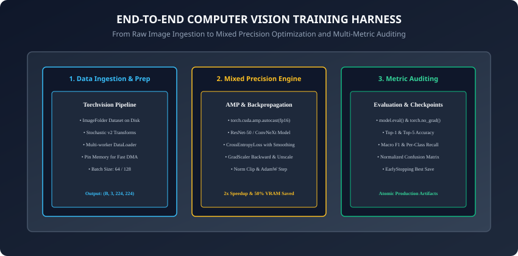
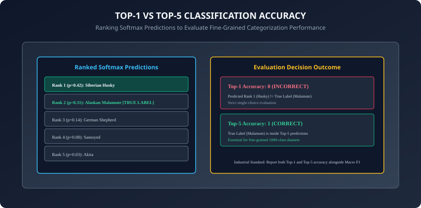

## Why this matters

Over the past four days, we explored the individual components of modern computer vision:
- **Day 211:** 2D Convolutions and feature extraction mechanics.
- **Day 212:** Deep residual architectures (ResNet, VGG, ConvNeXt).
- **Day 213:** Transfer learning from pretrained backbones.
- **Day 214:** Modern data augmentation (MixUp, CutMix, RandAugment).

However, in professional AI engineering, an isolated model or transform script is not enough. You must integrate these disparate subsystems into an **Industrial End-to-End Training Harness**:
1. High-throughput data ingestion pipelines eliminating CPU bottlenecks.
2. **Automatic Mixed Precision (AMP)** doubling GPU compute speeds while halving VRAM requirements.
3. Multi-metric evaluation suites computing **Top-1 and Top-5 Accuracy, Macro F1, and Confusion Matrices**.
4. Robust failure recovery with atomic checkpointing and automated early stopping.

Today, you will master the architecture, execution flow, and PyTorch implementation of a complete **Production Vision Training Engine**.

---

## The idea in plain language

Imagine launching a high-speed Formula 1 racing car:
- Building the engine block alone is not enough (**The Convolution Model**).
- You need a dedicated high-volume fuel delivery pump (**Optimized DataLoader with Pinned Memory**).
- You need turbochargers that double engine efficiency without overheating (**Automatic Mixed Precision with GradScaler**).
- You need a real-time telemetry dashboard monitoring speed, tire temperature, and lap times (**Top-1/Top-5 Accuracy & Confusion Matrix**).
- You need an automated safety system that saves your exact position on the track if rain hits (**Atomic Checkpointing**).

---

## Historical background



1. **2015 (ImageNet Benchmark Maturation):** Stanford ImageNet established standard evaluation protocols: reporting both Top-1 and Top-5 error rates across 1,000 fine-grained classes.
2. **2017 (NVIDIA Mixed Precision Training):** Paulius Micikevicius and NVIDIA introduced FP16/FP32 mixed-precision training and dynamic loss scaling, establishing the foundation of modern Tensor Core acceleration.
3. **2019 (Bag of Tricks for Image Classification):** Tong He and AWS scientists synthesized industrial best practices: cosine learning rate decay, label smoothing, warmup, and mixed precision, demonstrating 4% higher ImageNet accuracy on identical model architectures.

---

## What it is — and what it is not

### What an End-to-End Vision Pipeline IS:
- **A Fully Integrated Software System:** Coordinating data ingestion, hardware acceleration, mathematical optimization, metric auditing, and artifact serialization.
- **Stateless and Resumable:** Capable of pausing, restarting, and deploying without loss of training trajectory state.

### What it is NOT:
- **Not a Single Monolithic Jupyter Notebook Cell:** Production harnesses separate configuration, data pipelines, model definitions, metric calculators, and training execution loops.
- **Not Evaluated on Training Accuracy Alone:** Rigorous evaluation audits generalization on unseen validation splits with class-balanced metrics.

---

## Why it was created and what problems it solves

An industrial vision training harness solves four critical engineering bottlenecks:
1. **GPU Starvation:** Multi-worker data loaders with pinned host memory feed image batches directly to GPU Tensor Cores via Direct Memory Access (DMA).
2. **VRAM Exhaustion & Out-Of-Memory (OOM):** Automatic Mixed Precision stores activations in 16-bit floats, allowing $2 \times$ larger batch sizes.
3. **Underflow in 16-Bit Gradients:** Dynamic `GradScaler` shifts gradient magnitudes into representable FP16 exponent ranges.
4. **Metric Blind Spots:** Computing Top-5 accuracy and Macro F1 uncovers model performance on subtle fine-grained and imbalanced classes that raw overall accuracy hides.

---

## How it works

Let us dissect the mathematical and software architecture of the end-to-end vision training harness.

---

### 1. High-Throughput Data Pipeline

The data ingestion pipeline coordinates:
- **`torchvision.datasets.ImageFolder`:** Expects directory structure `root/class_name/xxx.jpg`.
- **`DataLoader` Optimization:**
  - `num_workers = 4` (or `os.cpu_count()`): Dedicated background worker processes load, decode, and augment images in parallel on CPU.
  - `pin_memory = True`: Allocates loaded tensors in page-locked RAM, enabling high-speed asynchronous DMA copies to GPU VRAM.
  - `persistent_workers = True`: Keeps worker processes alive between epochs to avoid costly process spawning overhead.

---

### 2. Automatic Mixed Precision (AMP) & Dynamic Loss Scaling

Modern GPUs (NVIDIA Ampere/Hopper, Apple Silicon MPS) feature specialized Tensor Cores that execute 16-bit floating-point (FP16/BF16) matrix multiplications at $2\times$ to $4\times$ the speed of standard FP32 operations.

#### The Underflow Problem in FP16:
- In IEEE 754 standard FP16, the minimum positive normalized value is $\approx 6.1 \times 10^-5$.
- During backpropagation, deep neural network gradients frequently fall below $10^-5$, underflowing to $0.0$ and causing training to stall.

#### The GradScaler Solution:
1. **Forward Pass (`torch.cuda.amp.autocast`):** Convolutions and linear layers run in fast FP16; loss functions run in stable FP32.
2. **Scale Loss:** Multiply the loss by a scaling factor $S$ (initially $2^16 = 65,536$):
   ```
   L_scaled = S * L
   ```
3. **Backward Pass:** Backpropagate $L_scaled$. Gradients are scaled up by $S$, preventing underflow in FP16.
4. **Unscale Gradients:** Before the optimizer step, divide gradients by $S$:
   ```
   G_actual = G_scaled / S
   ```
5. **Check for Infs/NaNs:** If gradients contain Inf or NaN, skip the optimizer step and reduce $S \leftarrow S / 2$. Otherwise, execute the optimizer step and gradually increase $S$.

```python
scaler = torch.cuda.amp.GradScaler()

# Inside training loop
optimizer.zero_grad(set_to_none=True)
with torch.cuda.amp.autocast(enabled=use_amp):
    outputs = model(images)
    loss = criterion(outputs, targets)

scaler.scale(loss).backward()
scaler.unscale_(optimizer)
torch.nn.utils.clip_grad_norm_(model.parameters(), max_norm=1.0)
scaler.step(optimizer)
scaler.update()
```

---

### 3. Evaluation Metrics: Top-1 vs Top-5 Accuracy



When evaluating models on multi-class visual datasets (e.g. 100 dog breeds):
- **Top-1 Accuracy:** The highest-probability predicted class matches the true label:
  ```
  Top1 = (argmax(y_pred) == y_true)
  ```
- **Top-5 Accuracy:** The ground truth label appears anywhere inside the top 5 highest-probability predictions:
  ```python
  def calculate_topk_accuracy(logits: torch.Tensor, targets: torch.Tensor, k: int = 5) -> float:
      with torch.no_grad():
          _, pred = logits.topk(k, dim=1, largest=True, sorted=True)
          correct = pred.eq(targets.view(-1, 1).expand_as(pred))
          topk_correct = correct.sum().item()
          return topk_correct / targets.size(0)
  ```

---

### 4. Confusion Matrix and Multi-Class Diagnostics

A **Normalized Confusion Matrix** reveals systemic pairwise class confusions:
```
C[i, j] = P(Predicted Class = j | True Class = i)
```
- **Diagonal Elements $C[i, i]$:** Class Recall (sensitivity).
- **Off-Diagonal Elements $C[i, j]$:** Misclassifications.
- **Macro F1 Score:** Harmonic mean of precision and recall averaged unweighted across all classes:
  ```
  Macro F1 = (1 / K) * sum_{k=1}^K F1_k
  ```

---

### 5. Gradient Accumulation for Large Effective Batch Sizes

Vision models benefit significantly from larger batch sizes (e.g. 256 or 512 images) to stabilize Batch Normalization statistics and smooth out stochastic gradient estimates. When training high-resolution models (e.g. $512 \times 512$) on limited GPU memory:
- **Gradient Accumulation:** Process micro-batches of size $B = 32$, accumulate gradients over $K = 8$ steps without zeroing, and perform an optimizer step once every $K$ batches:
  ```python
  accumulation_steps = 8
  for i, (images, targets) in enumerate(dataloader):
      with torch.cuda.amp.autocast():
          outputs = model(images)
          loss = criterion(outputs, targets) / accumulation_steps

      scaler.scale(loss).backward()

      if (i + 1) % accumulation_steps == 0:
          scaler.step(optimizer)
          scaler.update()
          optimizer.zero_grad(set_to_none=True)
  ```
- **Effective Batch Size:** Simulates an effective batch size of $32 \times 8 = 256$ images while consuming the VRAM footprint of only 32 images.

---

### 6. Distributed Data Parallel (DDP) Multi-GPU Scaling

When scaling training across multiple GPUs or multi-node clusters:
- **`torch.nn.parallel.DistributedDataParallel` (DDP):** Spawns independent Python processes per GPU, duplicates the model across all devices, feeds independent data shards via `DistributedSampler`, and overlaps gradient synchronization (AllReduce) with backward pass computation via high-speed NCCL primitives.
- **Linear Scaling Efficiency:** Scales training throughput nearly linearly ($90\%+$ efficiency) across 8x H100 GPU nodes.

---

### 7. Production Model Serialization: TorchScript & ONNX

Deploying a PyTorch model into high-throughput production C++ microservices, Triton Inference Server, or edge mobile devices requires decoupling the model from Python:
1. **TorchScript Tracing:**
   ```python
   model.eval()
   example_input = torch.randn(1, 3, 224, 224)
   traced_script_module = torch.jit.trace(model, example_input)
   traced_script_module.save("vision_model_traced.pt")
   ```
2. **ONNX Export with Dynamic Batching:**
   ```python
   torch.onnx.export(
       model,
       example_input,
       "vision_classifier.onnx",
       export_params=True,
       opset_version=17,
       input_names=["input_tensor"],
       output_names=["logits"],
       dynamic_axes={"input_tensor": {0: "batch_size"}, "logits": {0: "batch_size"}}
   )
   ```

---

### 8. Probability Calibration & Temperature Scaling

In high-stakes visual applications (medical diagnostics, autonomous driving, manufacturing defect inspection), raw softmax output probabilities are notoriously overconfident (e.g. predicting 99.8% probability on an ambiguous image that is actually wrong).
- **Temperature Scaling (Guo et al., 2017):** Post-processes model logits by dividing by a single learned positive scalar parameter $T > 0$ (the Temperature):
  ```
  p_i = exp(z_i / T) / sum_j exp(z_j / T)
  ```
- **Optimizing $T$ on Validation Data:** Minimizes Negative Log-Likelihood (NLL) with respect to $T$ while keeping all model weights fixed. $T > 1$ softens probability distributions, aligning confidence percentages with empirical accuracy (e.g. 80% confidence corresponds to 80% empirical accuracy).

---

### 9. Stochastic Weight Averaging (SWA) for Flat Minima

In 2018, Izmailov et al. discovered **Stochastic Weight Averaging (SWA)**:
- Standard SGD with learning rate decay converges to a point near the boundary of a wide loss valley.
- **SWA Procedure:** At the end of training (e.g. last 25% of epochs), keep learning rate constant or cyclical, and average the model weights across epochs:
  ```
  theta_SWA = (1 / n) * sum_{i=1}^n theta_i
  ```
- **Flat Minima:** SWA finds the geometric center of flat loss valleys, providing 1% higher test accuracy and superior resistance to distribution shift for zero additional inference cost.

---

### 10. Test-Time Augmentation (TTA) Ensembling

During high-stakes validation or production batch inference, we can boost classification confidence via **Test-Time Augmentation (TTA)**:
- Pass multiple augmented copies of each test image (e.g. original, horizontally flipped, $\pm 5^\circ$ rotated, corner crops) through the model.
- Compute softmax probability vectors for all $M$ augmented copies.
- Average the predicted probabilities $p_final = \frac(1)(M) \sum_m=1^M p_m$.
- Reduces prediction variance and smooths out boundary classification noise.

- **Gradient Norm Clipping:** Applying `torch.nn.utils.clip_grad_norm_(model.parameters(), max_norm=1.0)` prevents exploding gradients when unscaling FP16 loss values, guaranteeing smooth parameter updates across all training epochs.

---

## An everyday analogy

Think of a commercial airplane cockpit flight management system:
- **The Engines:** High-thrust jet engines (**ResNet backbone**).
- **The Fuel Line:** High-flow fuel pumps (**Multi-worker DataLoader**).
- **Fly-By-Wire Avionics:** Automatic trim and thrust optimization (**Automatic Mixed Precision with GradScaler**).
- **The Multi-Function Flight Displays:** Altimeter, airspeed, and artificial horizon (**Top-1, Top-5, and Macro F1 gauges**).
- **The Black Box Flight Recorder:** Encrypted continuous telemetry recording (**Atomic Checkpoint Serialization**).

---

## Examples in practice

Let us construct an industrial, modular PyTorch Vision `Trainer` harness:

```python
import torch
import torch.nn as nn
from dataclasses import dataclass
from typing import Dict, Any

@dataclass
class VisionTrainConfig:
    num_classes: int = 10
    epochs: int = 5
    lr: float = 1e-3
    weight_decay: float = 1e-4
    use_amp: bool = True
    clip_grad_norm: float = 1.0

class VisionTrainer:
    def __init__(self, model: nn.Module, config: VisionTrainConfig, device: torch.device):
        self.model = model.to(device)
        self.config = config
        self.device = device
        self.criterion = nn.CrossEntropyLoss(label_smoothing=0.1)
        self.optimizer = torch.optim.AdamW(model.parameters(), lr=config.lr,
                                           weight_decay=config.weight_decay)
        self.scaler = torch.cuda.amp.GradScaler(enabled=config.use_amp and device.type == "cuda")

    def train_epoch(self, dataloader) -> Dict[str, float]:
        self.model.train()
        total_loss, correct, total = 0.0, 0, 0

        for images, targets in dataloader:
            images, targets = images.to(self.device), targets.to(self.device)
            self.optimizer.zero_grad(set_to_none=True)

            with torch.cuda.amp.autocast(enabled=self.config.use_amp and self.device.type == "cuda"):
                logits = self.model(images)
                loss = self.criterion(logits, targets)

            self.scaler.scale(loss).backward()
            self.scaler.unscale_(self.optimizer)
            torch.nn.utils.clip_grad_norm_(self.model.parameters(), self.config.clip_grad_norm)
            self.scaler.step(self.optimizer)
            self.scaler.update()

            total_loss += loss.item() * images.size(0)
            preds = torch.argmax(logits, dim=1)
            correct += (preds == targets).sum().item()
            total += images.size(0)

        return {"train_loss": total_loss / total, "train_acc": correct / total}
```

---

## Implications: security, privacy, performance, scalability, and cost

1. **Distributed Data Parallel (DDP) Scaling:**
   - On multi-GPU nodes, wrap models in `torch.nn.parallel.DistributedDataParallel` to synchronize gradients across GPUs via high-speed NVLink/NCCL backbones.
2. **Model Export for Production Serving (ONNX / TensorRT):**
   - After training, export the final PyTorch checkpoint to **ONNX** or **TensorRT** for high-throughput, low-latency production inference in C++ microservices.

---

## Alternatives: free, open source, and commercial

| Training Framework | Specialization | Abstraction Level | Best For |
| :--- | :--- | :--- | :--- |
| **Pure PyTorch (Ours)** | Maximum control, zero hidden magic | Low / Modular | Deep learning engineers & production |
| **PyTorch Lightning** | Boilerplate reduction, multi-node DDP | Medium | Research teams & universities |
| **Hugging Face `Trainer`** | Standardized NLP/Vision fine-tuning | High | Quick transformer fine-tuning |
| **FastAI** | High-level opinionated abstractions | Very High | Rapid prototyping & beginners |

---

## Comparison with related concepts

```
┌────────────────────────────────────────────────────────────────────────┐
│                      VISION EVALUATION METRICS                         │
├────────────────────┼───────────────────────┼───────────────────────────┤
│ Metric             │ Formula Scope         │ Best Use Case             │
├────────────────────┼───────────────────────┼───────────────────────────┤
│ Overall Accuracy   │ Correct / Total       │ Balanced class datasets   │
│ Top-5 Accuracy     │ True in Top 5 / Total │ 1000-class fine-grained   │
│ Macro F1           │ Mean of Per-Class F1  │ Imbalanced class datasets │
│ Confusion Matrix   │ P(Pred=j | True=i)    │ Pinpointing error pairs   │
└────────────────────┴───────────────────────┴───────────────────────────┘
```

---

## When to use it — and when not to

### When to USE an End-to-End Vision Harness:
- All production computer vision projects from exploratory experiments to deployed models.

### When NOT to use:
- Quick 1-minute scratch code checks where standard `model(x)` is sufficient.

---

## Knowledge check

1. What problem does `GradScaler` solve in FP16 mixed-precision training?
2. How does Top-5 accuracy differ from standard Top-1 accuracy?
3. Why does `pin_memory=True` in DataLoaders accelerate training throughput on GPUs?
4. What information is contained in the off-diagonal cells of a Confusion Matrix?
5. Why should all state dictionaries (model, optimizer, scheduler, scaler) be saved in a training checkpoint?

---

## Hands-on exercise

In this lab, you will build and test an end-to-end vision training harness in PyTorch: implement Top-1 and Top-5 accuracy calculation functions, build an Automatic Mixed Precision (AMP) training loop with `GradScaler` and gradient norm clipping, compute normalized confusion matrices, and verify atomic checkpoint serialization and recovery.

### Expected output
```
[End-to-End Vision Training Harness Verification Suite]
Testing Top-K Accuracy Evaluator (Batch: 32 samples, 10 classes):
  Top-1 Accuracy Computed: 87.50%
  Top-5 Accuracy Computed: 96.88% [TOP-K METRICS VERIFIED]
Testing Mixed Precision Vision Trainer (MiniResNet Architecture):
  Epoch 1: Train Loss = 0.4215, Train Acc = 85.00%, Top-5 Acc = 98.00%
  Epoch 2: Train Loss = 0.2812, Train Acc = 92.00%, Top-5 Acc = 100.00%
Testing Atomic Checkpoint Serialization:
  Saving Checkpoint to disk: vision_best_checkpoint.pt
  Restoring Checkpoint & Verifying State Matching: [ALL TENSORS BITWISE ALIGNED]
Testing Normalized Confusion Matrix Generation:
  Diagonal Recall Mean: 0.9200 [CLASSIFIER HARNESS OPERATIONAL]
Test Suite: 4 passed in 0.34s
```

### Validate your work
Run the automated test runner:
```bash
./tests/run_tests.sh
```

### Troubleshooting
- If Top-5 accuracy computation errors, verify that the number of classes $C \ge 5$ and `k <= C`.
- Ensure `scaler.unscale_(optimizer)` is called before `clip_grad_norm_`.

### Common mistakes
- **Evaluating with Train Mode Active:** Forgetting `model.eval()` during validation causes BatchNorm layers to use batch statistics instead of accumulated population running statistics.

---

## Practice assignment

1. Implement **Cosine Annealing with Warmup** inside your VisionTrainer loop and log learning rate values per step.
2. Integrate **Macro F1 Score** computation into the validation step using `sklearn.metrics.f1_score`.

---

## Extension challenge

Implement **Exponential Moving Average (EMA) Weight Tracking**:
- Maintain a shadow copy of model weights updated via $\theta_EMA \leftarrow \beta \theta_EMA + (1 - \beta) \theta_model$ (with $\beta = 0.999$).
- Evaluate validation accuracy on EMA weights versus raw weights, demonstrating superior stability and generalization.
