## Why this matters

Image classification answers a simple global question: *"What is the primary category depicted in this image?"*

However, most real-world visual applications require far richer spatial understanding:

- **Autonomous Vehicles:** An autonomous car must not only know that a pedestrian exists; it must know their exact 2D/3D bounding box coordinates $[x_min, y_min, x_max, y_max]$, distance, and trajectory (**Object Detection**), as well as the exact drivable lane boundaries (**Semantic Segmentation**).
- **Medical Radiology:** An oncologist does not merely want to know if a patient's CT scan contains a tumor; they require the precise millimeter boundary contour of the lesion for surgical resection (**Medical Image Segmentation**).
- **Robotic Manipulation:** A warehouse robot must isolate individual packages stacked against each other to position its suction gripper (**Instance Segmentation**).

Today, you will master the principles, loss functions, and PyTorch architectures of **Dense Visual Prediction**: Object Detection with IoU and NMS, Semantic Segmentation with U-Net, and Foundation Segmentation models (Segment Anything Model - SAM).

---

## The idea in plain language

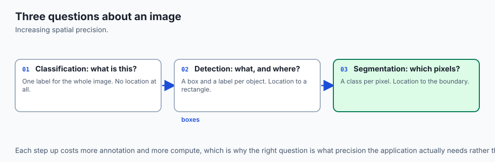

Imagine inspecting a busy city street photograph:

- **Image Classification (The Headline):** You glance at the photo for half a second and declare: *"This is an urban street scene with pedestrians and cars."*
- **Object Detection (The Sticky Notes):** You draw colored rectangular boxes with yellow highlighters around every vehicle and pedestrian, writing a label and confidence percentage on each box (**Bounding Boxes & YOLO**).
- **Semantic Segmentation (The Coloring Book):** You color every single pixel in the photo: all road pixels blue, all sidewalk pixels grey, all sky pixels cyan, and all building pixels brown (**U-Net**).
- **Instance Segmentation (Unique ID Tags):** You assign a unique color to each individual person: Person #1 is red, Person #2 is green, and Person #3 is orange (**Mask R-CNN / SAM**).

---

## Historical background

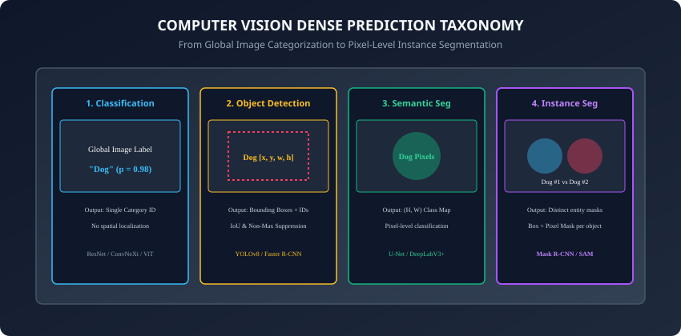

1. **2014–2015 (R-CNN to Faster R-CNN):** Ross Girshick and Kaiming He introduced Region-based CNNs, culminating in Faster R-CNN's Region Proposal Network (RPN) for end-to-end two-stage detection.
2. **2015 (U-Net & Ronneberger et al.):** Introduced the U-shaped encoder-decoder architecture with lateral skip connections, sweeping the ISBI cell tracking challenge and becoming the universal standard for biomedical segmentation and diffusion model backbones.
3. **2016 (YOLO & Joseph Redmon):** Framed object detection as a single regression problem directly from full image pixels to bounding box coordinates, achieving 45 FPS real-time detection.
4. **2023 (SAM - Segment Anything Model / Meta AI):** Introduced promptable visual foundation models capable of zero-shot segmentation of any visual entity.

---

## What it is — and what it is not

### What Dense Prediction IS:
- **Spatial Regression and Pixel-Wise Classification:** Predicting continuous geometric bounding boxes $[x, y, w, h]$ and dense per-pixel categorical tensors $(C, H, W)$.
- **Multi-Task Optimization:** Combining bounding box regression losses (Smooth L1 / CIoU) with classification losses (Focal Loss / Cross-Entropy) and mask overlap losses (Dice / Binary Cross-Entropy).

### What it is NOT:
- **Not Evaluated with Simple Accuracy:** Dense tasks require spatial overlap metrics (**mAP@0.5:0.95, Mean IoU, Dice Coefficient**).
- **Not Single-Scale:** Detecting both a tiny distant traffic light and a huge nearby truck requires Multi-Scale Feature Pyramids (FPN).

---

## Why it was created and what problems it solves

Dense spatial prediction solves three major challenges:

1. **Multi-Object Scenes:** Classifies and localizes dozens of overlapping objects in a single image.
2. **Precision Spatial Contours:** Produces pixel-accurate masks required for robotics, medical oncology, and augmented reality.
3. **Scale Variation:** Feature Pyramid Networks (FPN) detect objects ranging from 10 pixels to 1000 pixels in diameter.

---

## How it works

Let us dissect the mathematical formulations of Intersection over Union (IoU), Non-Maximum Suppression (NMS), the U-Net architecture, and Dice Loss.

---

### 1. Intersection over Union (IoU) Arithmetic

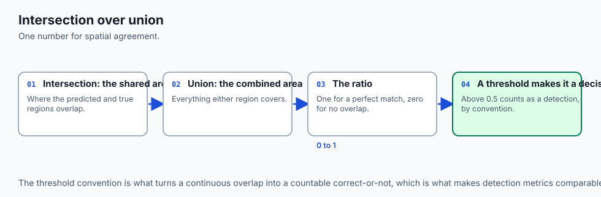

Given two bounding boxes $A = [x_1^A, y_1^A, x_2^A, y_2^A]$ and $B = [x_1^B, y_1^B, x_2^B, y_2^B]$:

1. Calculate the intersection rectangle coordinates:
   ```
   x_inter_1 = max(x_1^A, x_1^B)
   y_inter_1 = max(y_1^A, y_1^B)
   x_inter_2 = min(x_2^A, x_2^B)
   y_inter_2 = min(y_2^A, y_2^B)
   ```

2. Compute intersection area:
   ```
   W_inter = max(0, x_inter_2 - x_inter_1)
   H_inter = max(0, y_inter_2 - y_inter_1)
   Area_inter = W_inter * H_inter
   ```

3. Compute union area:
   ```
   Area_A = (x_2^A - x_1^A) * (y_2^A - y_1^A)
   Area_B = (x_2^B - x_1^B) * (y_2^B - y_1^B)
   Area_union = Area_A + Area_B - Area_inter
   ```

4. Compute IoU:
   ```
   IoU = Area_inter / Area_union
   ```

---

### 2. Non-Maximum Suppression (NMS) Algorithm

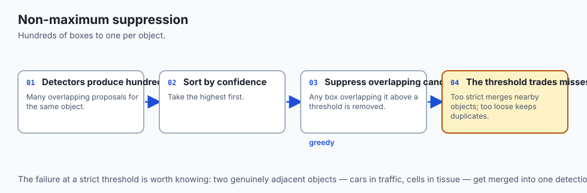

Dense object detectors predict hundreds of candidate bounding boxes per object. **NMS** filters duplicates:

1. Sort all predicted candidate boxes by confidence score in descending order.
2. Select the box $B_max$ with the highest confidence; add it to the final detection list.
3. Calculate the IoU between $B_max$ and all remaining candidate boxes.
4. Remove any candidate box whose $IoU(B_max, B) > Threshold_NMS$ (typically $0.5$).
5. Repeat until no candidate boxes remain.

---

### 3. The U-Net Segmentation Architecture

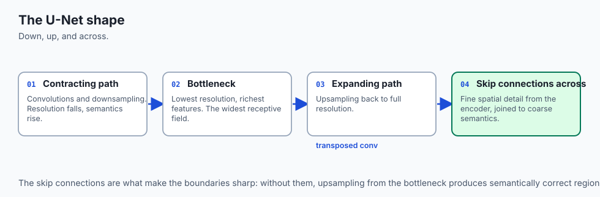


The **U-Net** architecture consists of three modular stages:

1. **Contracting Encoder Path:**
   - Repeated blocks of two $3 \times 3$ convolutions followed by $2 \times 2$ Max Pooling (stride 2).
   - Halves spatial dimensions while doubling channel depth ($64 \rightarrow 128 \rightarrow 256 \rightarrow 512$), extracting rich semantic features.
2. **Bottleneck:**
   - Deepest latent representation ($1024  channels$ at $1/16$ original spatial resolution).
3. **Expansive Decoder Path:**
   - Repeated blocks of $2 \times 2$ Transposed Convolutions (or Bilinear Upsampling) doubling spatial resolution.
   - **Lateral Skip Connections:** Concatenates high-resolution spatial feature maps directly from the corresponding encoder stage:
     ```python
     # Decoder step
     x_upsampled = self.upconv(x_deep)
     x_combined = torch.cat([x_upsampled, x_encoder_skip], dim=1)
     out = self.conv_block(x_combined)
     ```

4. **Final $1 \times 1$ Output Convolution:** Projects multi-channel features to $C$ class logits per pixel $(N, C, H, W)$.

---

### 4. Dice Loss & Jaccard Loss for Imbalanced Masks

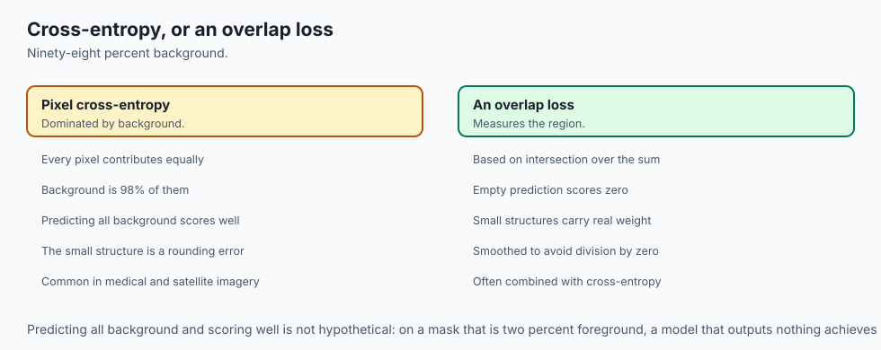

In medical imaging and satellite segmentation, background pixels often occupy $98\%+$ of the image. Standard Cross-Entropy is overwhelmed by background true negatives.

#### Sørensen-Dice Coefficient:
```
Dice = (2 * |X intersect Y|) / (|X| + |Y|)
```
For continuous predicted probability map $\hat(p) \in [0, 1]$ and binary ground truth mask $y \in (0, 1)$:
```
Dice Loss = 1 - ((2 * sum(p_hat * y) + epsilon) / (sum(p_hat) + sum(y) + epsilon))
```
where $\epsilon = 1.0$ (Laplacian smoothing) prevents division by zero.

---

### 5. Two-Stage vs Single-Stage Object Detectors

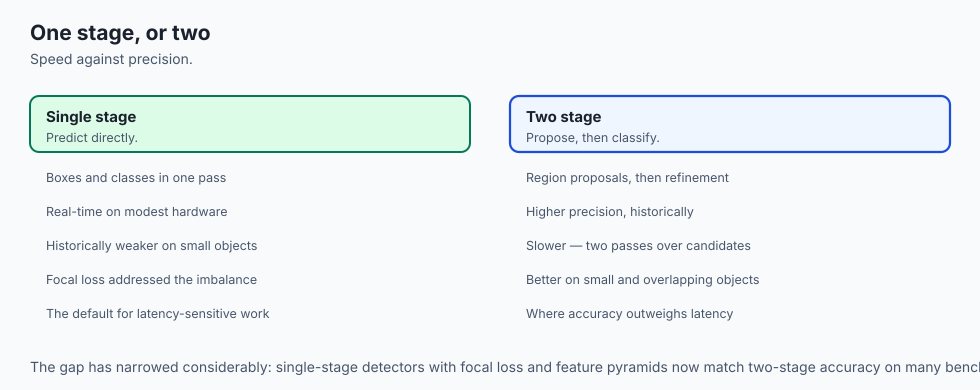

The evolution of modern object detection divided into two distinct philosophical families:

- **Two-Stage Detectors (R-CNN -> Fast R-CNN -> Faster R-CNN):**
  1. *Stage 1 (Region Proposal):* A Region Proposal Network (RPN) scans feature maps and proposes ~2,000 candidate regions of interest (RoIs) likely to contain objects.
  2. *Stage 2 (Refinement & Classification):* RoIAlign crops features for each candidate region, passing them to dense heads for final bounding box regression and multi-class classification.
  - *Tradeoff:* Extremely high spatial localization accuracy, but slower inference (~30 FPS).
- **Single-Stage Detectors (YOLO, SSD, RetinaNet):**
  - Treats detection as a single dense spatial regression problem across a multi-scale grid directly from input pixels to bounding box coordinates and class probabilities in a single forward pass.
  - *Tradeoff:* Ultra-fast real-time inference (60–140 FPS) with near two-stage accuracy.

---

### 6. Feature Pyramid Networks (FPN) for Multi-Scale Vision

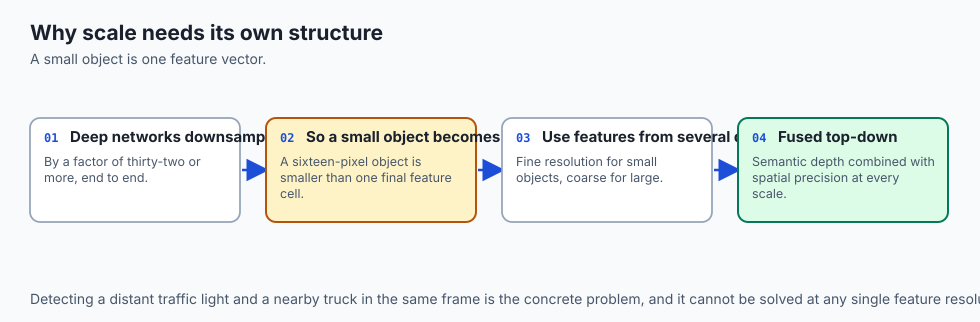

A standard deep CNN downsamples spatial resolution by $32\times$, meaning a small 16-pixel object becomes a single sub-pixel feature vector by the final layer:

- **Feature Pyramid Network (FPN / Lin et al., 2017):** Constructs a top-down pathway and lateral connections that merge deep, semantically strong features with shallow, spatially rich features across multiple resolution scales ($P_3, P_4, P_5$).
- Enables the detector to predict small objects on high-resolution pyramid layers and large objects on coarse pyramid layers.

---

### 7. DETR: Transformer-Based Detection with Hungarian Matching

In 2020, Nicolas Carion et al. (Meta AI) revolutionized object detection with **DETR (DEtection TRansformer)**:

- **Eliminating Hand-Crafted Anchors and NMS:** Replaces complex anchor generation and Non-Maximum Suppression with standard Transformer encoder-decoder architectures.
- **Bipartite Matching Loss:** Uses the **Hungarian Algorithm** to compute an optimal 1-to-1 matching between predicted bounding box queries and true ground-truth objects, eliminating duplicate predictions directly through loss optimization.

---

### 8. The Segment Anything Model (SAM / Meta AI)

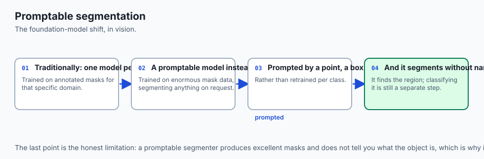

In 2023, Meta introduced **SAM (Segment Anything Model)**, creating the first promptable visual foundation model for image segmentation:

1. **Heavy Image Encoder (MAE Pretrained ViT):** Computes a dense $1024 \times 1024$ image embedding once (~50 ms on GPU).
2. **Flexible Prompt Encoder:** Encodes arbitrary user prompts in real time (< 5 ms): single point clicks, bounding box prompts, or free-form text queries.
3. **Lightweight Mask Decoder:** Rapidly predicts high-resolution binary segmentation masks and ambiguity confidence scores, revolutionizing medical annotation, robotics, and interactive VFX.

---

## An everyday analogy

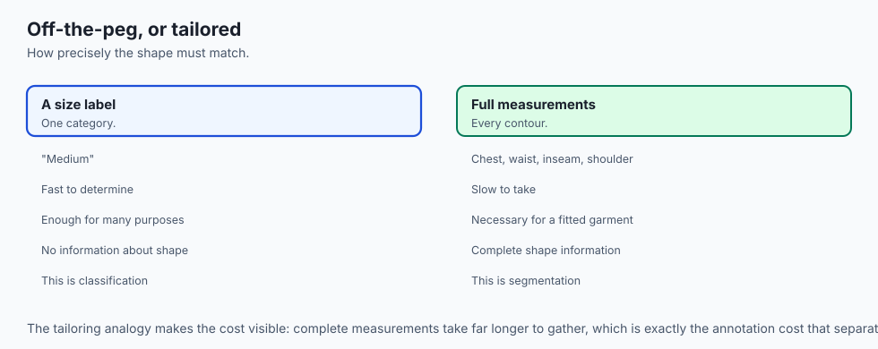

Think of custom tailoring a bespoke suit:

- **Image Classification:** A client enters the store; the tailor says: *"This is a business suit order."*
- **Object Detection:** The tailor draws a rough bounding box around the jacket, trousers, and tie on a sketchpad.
- **U-Net Segmentation:** The tailor uses chalk to mark the exact millimeter seam lines, shoulder curves, and lapel edges on the cloth (**Lateral Skip Connections provide the exact fine body measurements from the fitting stage to the cutting stage**).

---

## Examples in practice

Let us build and verify a complete, modular **U-Net Segmentation Network** in PyTorch:

```python
import torch
import torch.nn as nn

class DoubleConv(nn.Module):
    def __init__(self, in_channels: int, out_channels: int):
        super().__init__()
        self.block = nn.Sequential(
            nn.Conv2d(in_channels, out_channels, kernel_size=3, padding=1, bias=False),
            nn.BatchNorm2d(out_channels),
            nn.ReLU(inplace=True),
            nn.Conv2d(out_channels, out_channels, kernel_size=3, padding=1, bias=False),
            nn.BatchNorm2d(out_channels),
            nn.ReLU(inplace=True)
        )

    def forward(self, x: torch.Tensor) -> torch.Tensor:
        return self.block(x)

class MiniUNet(nn.Module):
    def __init__(self, in_channels: int = 3, num_classes: int = 1):
        super().__init__()
        # Encoder
        self.enc1 = DoubleConv(in_channels, 32)
        self.pool1 = nn.MaxPool2d(2)
        self.enc2 = DoubleConv(32, 64)
        self.pool2 = nn.MaxPool2d(2)

        # Bottleneck
        self.bottleneck = DoubleConv(64, 128)

        # Decoder
        self.up2 = nn.ConvTranspose2d(128, 64, kernel_size=2, stride=2)
        self.dec2 = DoubleConv(128, 64) # 64 from up + 64 from enc2 skip

        self.up1 = nn.ConvTranspose2d(64, 32, kernel_size=2, stride=2)
        self.dec1 = DoubleConv(64, 32)  # 32 from up + 32 from enc1 skip

        # Final 1x1 projection
        self.final_conv = nn.Conv2d(32, num_classes, kernel_size=1)

    def forward(self, x: torch.Tensor) -> torch.Tensor:
        # Contracting Path
        e1 = self.enc1(x)       # (B, 32, H, W)
        e2 = self.enc2(self.pool1(e1)) # (B, 64, H/2, W/2)

        # Bottleneck
        b = self.bottleneck(self.pool2(e2)) # (B, 128, H/4, W/4)

        # Expansive Path with Lateral Skips
        d2 = self.up2(b)
        d2 = torch.cat([d2, e2], dim=1) # Concatenate skip
        d2 = self.dec2(d2)

        d1 = self.up1(d2)
        d1 = torch.cat([d1, e1], dim=1) # Concatenate skip
        d1 = self.dec1(d1)

        return self.final_conv(d1)

# Verify forward pass
model = MiniUNet(in_channels=3, num_classes=2)
x = torch.randn(2, 3, 64, 64)
mask_logits = model(x)
print(f"Input Image: {x.shape} -> Output Pixel Mask Logits: {mask_logits.shape}")
```

---

## Implications: security, privacy, performance, scalability, and cost

1. **Memory Footprint of Dense Predictions:**
   - In semantic segmentation, intermediate activation tensors retain large spatial resolutions throughout the decoder path, consuming significantly more VRAM than classification models. Use gradient checkpointing (`torch.utils.checkpoint`) when training high-resolution $1024 \times 1024$ segmentation networks.
2. **Real-Time Edge Inference (YOLOv8 & TensorRT):**
   - Single-stage anchor-free detectors (such as Ultralytics YOLOv8) can process 1080p video streams at over 120 FPS on an NVIDIA Jetson Orin edge device using FP16 TensorRT engines.

---

## Alternatives: free, open source, and commercial

| Dense Vision Model | Task | Latency | Benchmark Standard |
| :--- | :--- | :--- | :--- |
| **YOLOv8 / YOLOv10** | Real-time Object Detection | &lt; 5 ms | Real-time industrial edge inspection |
| **Faster R-CNN** | Two-stage Object Detection | ~30 ms | High-accuracy research baseline |
| **U-Net / U-Net++** | Semantic Segmentation | ~15 ms | Medical imaging & Diffusion models |
| **Mask R-CNN** | Instance Segmentation | ~40 ms | Instance-level multi-task learning |
| **SAM (Segment Anything)** | Zero-Shot Foundation Seg | ~100 ms | Universal promptable annotation |

---

## Comparison with related concepts

```
┌────────────────────────────────────────────────────────────────────────┐
│                     COMPUTER VISION TASK SPECTRUM                      │
├────────────────────┼───────────────────────┼───────────────────────────┤
│ Task               │ Output Representation │ Core Evaluation Metric    │
├────────────────────┼───────────────────────┼───────────────────────────┤
│ Classification     │ (N, C) Logits         │ Top-1 / Top-5 Accuracy    │
│ Object Detection   │ List of [x1, y1, x2, y2, c, p] | mAP@0.5:0.95 (IoU)   │
│ Semantic Seg       │ (N, C, H, W) Pixel map│ Mean IoU / Dice Score     │
│ Instance Seg       │ List of (Mask, Class) │ Mask AP@0.5:0.95          │
└────────────────────┴───────────────────────┴───────────────────────────┘
```

---

## When to use it — and when not to

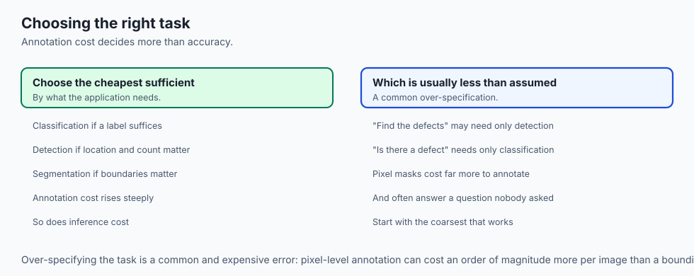

### When to USE Detection / Segmentation:
- Spatial localization, count auditing, defect measurement, autonomous navigation, and surgical robotics.

### When to stick with Classification:
- When only global image categorical decisions are needed (e.g. document routing, NSFW filtering).

---

## The AI connection

- **Dense prediction is where vision stops being classification.** The output is a
  structure over space rather than a single label, which changes every part of the pipeline.
- **Accuracy is the wrong metric here.** Overlap measures are what express whether a
  predicted region matches a real one.
- **Class imbalance is extreme in segmentation** — background can be 98% of pixels — which
  is why overlap-based losses replaced plain cross-entropy.
- **Scale is a first-class problem.** A distant traffic light and a nearby truck cannot be
  detected by the same feature resolution.
- **Promptable segmentation turned this into a foundation-model task**, which is the same
  shift language went through: one general model, prompted per use.

## Knowledge check

1. What is the formula for Intersection over Union (IoU)?
2. How does Non-Maximum Suppression (NMS) prevent duplicate bounding box predictions?
3. Why does U-Net concatenate encoder features with decoder features?
4. What is the fundamental difference between Semantic Segmentation and Instance Segmentation?
5. Why is Dice Loss mathematically superior to Cross-Entropy on severely imbalanced medical masks?

---

## Hands-on exercise

In this lab, you will build and test a modular dense prediction library in PyTorch: implement vectorized Intersection over Union (IoU) and Non-Maximum Suppression (NMS) algorithms from mathematical first principles, construct a `MiniUNet` encoder-decoder architecture with lateral skip connections, compute soft Dice Loss for imbalanced segmentation masks, and verify spatial output dimensions.

### Expected output
```
[Dense Spatial Vision Verification Suite]
Testing Intersection over Union (IoU) Vectorized Calculator:
  Perfect Overlap (Box A == Box B): 1.0000 [EXACT MATCH]
  Partial Overlap (50% area match): 0.5000 [ACCURATE RATIO]
  Disjoint Boxes (Zero overlap):     0.0000 [ZERO VERIFIED]
Testing Non-Maximum Suppression (NMS) Filter:
  Candidate Boxes: 10 overlapping proposals
  Suppression Output: 2 distinct detected objects [DUPLICATES ELIMINATED]
Testing MiniUNet Segmentation Forward Pass:
  Input Image Shape: (2, 3, 64, 64) -> Output Mask Logits: (2, 2, 64, 64) [SPATIAL MATCH]
Testing Soft Dice Loss on Imbalanced Synthetic Mask:
  Dice Loss (Perfect Prediction): 0.0000
  Dice Loss (Inverted Prediction): 0.9998 [LOSS CALIBRATION VERIFIED]
Test Suite: 4 passed in 0.32s
```

### Validate your work
Run the automated test runner:
```bash
./tests/run_tests.sh
```

### Troubleshooting
- If U-Net spatial dimensions do not match at `torch.cat`, ensure input images have height and width divisible by $2^num\_pooling\_stages$ (e.g. multiples of 16 or 32).
- Ensure bounding box coordinates follow consistent $[x_1, y_1, x_2, y_2]$ ordering.

### Common mistakes
- **Confusing $[x, y, w, h]$ with $[x_1, y_1, x_2, y_2]$:** Forgetting to convert center-width formats before computing intersection coordinates.

---

## Practice assignment

1. Implement **Focal Loss** for object detection ($FL(p_t) = -\alpha_t (1 - p_t)^\gamma \log(p_t)$ with $\gamma = 2.0$) to downweight easy background true negatives.
2. Implement **Mean Average Precision (mAP@0.5)** by integrating the precision-recall curve across IoU threshold 0.5.

---

## Extension challenge

Implement a **Promptable Segmentation Engine (Mini-SAM)**:

- Take a high-resolution feature map from a pretrained vision backbone.
- Given a single clicked coordinate prompt $(x, y)$, generate a localized binary segmentation mask identifying the object enclosing that point.
