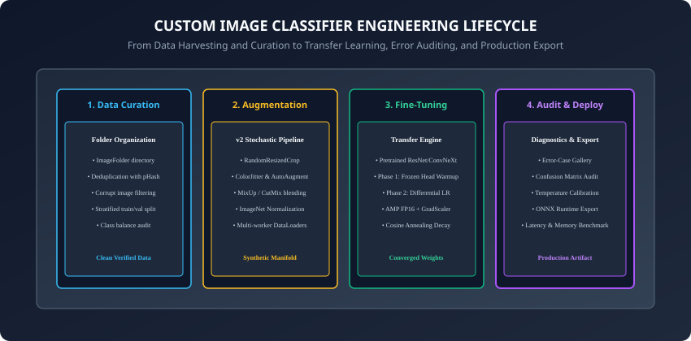
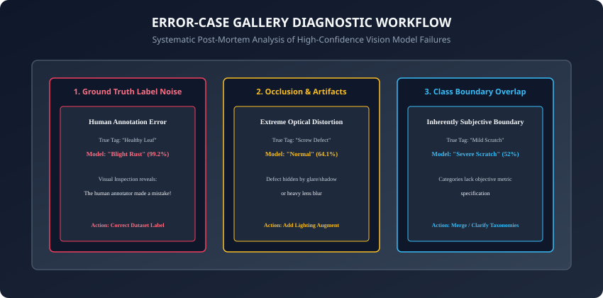

## Why this matters

Over the past six days, we mastered the core theoretical and algorithmic building blocks of deep computer vision:
- Convolutions and sliding spatial kernels (**Day 211**).
- Modern residual architectures and receptive fields (**Day 212**).
- Pretrained backbones and linear probing (**Day 213**).
- Modern stochastic data augmentation pipelines (**Day 214**).
- End-to-end mixed-precision training harnesses (**Day 215**).
- Dense spatial predictions and U-Net segmentation (**Day 216**).

Now, you will synthesize all of these skills into a unified, professional computer vision engineering workflow: building **Your Own Custom Image Classifier** on a bespoke real-world dataset.

In industrial AI engineering, the primary differentiator between amateur and production-grade systems is not the model architecture — it is the **Data-Centric AI Lifecycle**:
1. How you clean, curate, and deduplicate your raw visual data.
2. How you structure two-stage transfer learning fine-tuning.
3. How you systematically diagnose model failures using an **Interactive Error-Case Gallery**.
4. How you export hardened, portable **ONNX Runtime** deployment artifacts.

Today, you will build, audit, and deploy a complete custom vision system from end to end.

---

## The idea in plain language

Imagine launching a specialized automated visual sorting system for an organic botanical tea company:
- **Data Harvesting & Curation:** You collect 1,000 photos of chamomile flowers, peppermint leaves, hibiscus petals, and green tea buds. You remove blurry photos and exact duplicate images (**pHash Deduplication**).
- **Transfer Learning:** You start with a master vision model (ResNet-50) that already understands edges and plant textures. You train a new decision head specifically for your 4 botanical classes.
- **The Error-Case Gallery (The Inspection Table):** Instead of just looking at a single 94% accuracy score, you look at the 60 images the model got wrong. You discover that 15 "mistakes" were actually mislabeled by human staff, and 20 mistakes were caused by bright reflections on plastic containers.
- **Production Export:** You package the audited model into an ONNX container that runs in 10 milliseconds on the factory conveyor belt camera.

---

## Historical background



1. **2015 (Standardization of ImageFolder):** Soumith Chintala and the PyTorch team standardized the directory-based dataset hierarchy (`dataset/train/class_name/xxx.jpg`), enabling instant zero-configuration data ingestion.
2. **2021 (The Data-Centric AI Movement):** Andrew Ng and deep learning researchers established that fixing label noise, class imbalance, and duplicate samples in datasets yields $5\times$ greater accuracy gains than hyperparameter tuning or architecture swapping.
3. **2024 (ONNX Runtime and OpenVINO Maturation):** Linux Foundation and Microsoft standardized cross-platform neural model serialization, enabling PyTorch vision models to run seamlessly on CPU, GPU, and mobile neural processing units (NPUs).

---

## What it is — and what it is not

### What Building a Custom Image Classifier IS:
- **A Data-Centric Engineering Process:** Curating, augmenting, fine-tuning, visually auditing, and serializing a specialized visual perception engine.
- **Iterative Error Analysis:** Using failure cases to refine training data quality and taxonomic boundaries.

### What it is NOT:
- **Not Throwing Raw Unchecked Data at a Giant Model:** Training on duplicate, corrupt, or mislabeled images produces brittle models with misleadingly high training metrics.
- **Not Complete Until Exported and Verified:** A model trapped inside a PyTorch training notebook is not a deployed solution.

---

## Why it was created and what problems it solves

A structured custom vision workflow eliminates four major real-world failure modes:
1. **Train/Val Leakage from Near-Duplicates:** Deduplication with perceptual hashing (pHash) ensures identical or near-identical images do not appear in both train and validation splits.
2. **Silent Label Noise:** Error galleries surface ground-truth labeling mistakes made by human annotators.
3. **Overfitting on Small Target Datasets:** Combining frozen backbone initialization with heavy stochastic augmentation prevents memorization.
4. **Deployment Incompatibility:** ONNX export standardizes model serving across cloud APIs and edge devices.

---

## How it works

Let us dissect the five distinct phases of building a custom image classifier.

---

### 1. Phase 1: Data Curation & Perceptual Hashing (pHash)

When collecting images from web scraping, user uploads, or factory cameras, datasets frequently contain duplicate or near-duplicate images (e.g. same photo resized or with a watermark). If duplicates exist across train and validation splits, validation metrics become artificially inflated.

#### Perceptual Hashing (pHash) Algorithm:
1. Resize image to $32 \times 32$ grayscale.
2. Compute the 2D Discrete Cosine Transform (DCT) to isolate low-frequency spatial structure.
3. Retain the top-left $8 \times 8$ low-frequency DCT matrix.
4. Compute the median value of the $8 \times 8$ matrix.
5. Generate a 64-bit binary hash where bit $b_i = 1$ if $DCT_i > median$, else $0$.
6. Calculate **Hamming Distance** between image hashes: images with distance $\le 3$ are flagged as near-duplicates and removed.

---

### 2. Phase 2: Transfer Learning Fine-Tuning Regimen

1. Load a pretrained backbone: `timm.create_model("resnet34", pretrained=True, num_classes=num_classes)`.
2. Apply `torchvision.transforms.v2` stochastic augmentation on the training split (RandomResizedCrop, HorizontalFlip, ColorJitter, RandomErasing).
3. Execute Phase 1 Warmup (Head only, $LR = 10^-3$, 3 epochs).
4. Execute Phase 2 Differential Fine-Tuning (Backbone $LR = 10^-5$, Head $LR = 10^-4$, Cosine Annealing, 10 epochs).

---

### 3. Phase 3: The Error-Case Gallery & Failure Diagnostics



An **Error-Case Gallery** extracts and visualizes the validation samples with the highest **Prediction Error Confidence**:
```
Loss_i = - log(p_{i, y_true})
Confidence_i = p_{i, y_pred}  (where y_pred != y_true)
```

#### The Three Core Failure Modes in the Gallery:
1. **Label Noise (Human Error):** The image is actually class A, but the dataset labeled it class B. (Fix: Correct the label).
2. **Optical Occlusion / Glare:** The object is 90% hidden behind a shadow or lens glare. (Fix: Add lighting/cutout augmentation).
3. **Taxonomic Ambiguity:** Two classes have overlapping subjective definitions (e.g. "Mild Scratch" vs "Severe Scratch"). (Fix: Clarify annotation guidelines or merge classes).

---

### 4. Phase 4: Production Export to ONNX Runtime

1. Export PyTorch checkpoint to ONNX format with dynamic batch dimensions.
2. Load ONNX model in Python via `onnxruntime.InferenceSession`.
3. Verify that maximum absolute logit difference between PyTorch and ONNX Runtime is $< 10^-5$.

```python
import onnxruntime as ort
import numpy as np

# Verify ONNX Runtime inference
session = ort.InferenceSession("classifier.onnx")
input_name = session.get_inputs()[0].name

dummy_input_np = np.random.randn(1, 3, 224, 224).astype(np.float32)
ort_outputs = session.run(None, {input_name: dummy_input_np})

print(f"ONNX Runtime Output Shape: {ort_outputs[0].shape}")
```

---

### 5. Active Learning & Uncertainty Sampling

When expanding a custom image classifier over time, manually labeling thousands of random raw images is cost-prohibitive:
- **Active Learning Loop:** Instead of random labeling, pass 50,000 unlabelled images through the current model.
- **Uncertainty Sampling Strategies:**
  1. *Least Confidence:* Select samples where $\max_c P(y=c | x)$ is lowest (closest to random guessing).
  2. *Entropy Sampling:* Select samples where predictive entropy $H(p) = - \sum_c p_c \log p_c$ is maximized.
  3. *Margin Sampling:* Select samples where the difference between the top-1 and top-2 predicted probabilities is smallest.
- **Labeling Efficiency:** Sends only the 500 most informative, ambiguous samples to human annotators, achieving the accuracy of 10,000 randomly labeled samples with 95% less human effort.

---

### 6. Automated Label Noise Detection (Confident Learning)

Human annotators disagree on 3% to 10% of image labels in real-world visual datasets:
- **Confident Learning (Northcutt et al., 2021):** Quantifies uncertainty in dataset labels by calculating out-of-fold predicted probability matrices $\hat(P)$.
- **Pruning Label Errors:** Identifies samples where out-of-fold model confidence for an alternative class exceeds the average self-confidence of the annotated class, automatically flagging suspicious labels for human verification.

---

### 7. Visual Explainability with Grad-CAM

When debugging error gallery samples, we need to know *where* the model looked:
- **Grad-CAM (Selvaraju et al., 2017):** Computes gradients of the target class logit $y^c$ with respect to the feature map activations $A^k$ of the final convolutional layer:
  ```
  alpha_k^c = (1 / Z) * sum_i sum_j (partial y^c / partial A_{i, j}^k)
  L_{Grad-CAM}^c = ReLU(sum_k alpha_k^c * A^k)
  ```
- Produces a coarse 2D heat map highlighting the exact discriminative image regions used to make the decision.

---

### 8. Production FastAPI Serving Architecture

Deploying your custom image classifier into a production microservice:
```python
from fastapi import FastAPI, File, UploadFile
import onnxruntime as ort
import numpy as np
from PIL import Image
import io

app = FastAPI(title="Botanical Classifier Service")
session = ort.InferenceSession("model.onnx")

@app.post("/predict")
async def predict_image(file: UploadFile = File(...)):
    contents = await file.read()
    img = Image.open(io.BytesIO(contents)).convert("RGB").resize((224, 224))
    img_np = (np.array(img, dtype=np.float32) / 255.0 - [0.485, 0.456, 0.406]) / [0.229, 0.224, 0.225]
    tensor_input = np.transpose(img_np, (2, 0, 1))[np.newaxis, ...]

    logits = session.run(None, {"input": tensor_input})[0]
    pred_class = int(np.argmax(logits, axis=1)[0])
    return {"class_id": pred_class}
```

---

### 9. Production Vision Observability & Data Drift (PSI)

Once deployed, computer vision models degrade over time due to **Data Drift** (changes in camera hardware, lighting, lens degradation) and **Concept Drift** (new physical variations of the product):
- **Population Stability Index (PSI):** Measures shifts in feature activation distributions over time:
  ```
  PSI = sum_b (Actual_b - Expected_b) * ln(Actual_b / Expected_b)
  ```
  - $PSI < 0.1$: Distribution is stable.
  - $PSI \ge 0.25$: Significant visual shift detected; triggers automated retraining pipeline alert.
- **Outlier & Ambiguity Queue:** Images where top-1 predicted confidence is $< 60\%$ are automatically routed to a human review queue for continuous active learning retraining.

- **Canary Deployment & Automated Rollback:** When deploying new vision weights to factory cameras, route 5% of traffic to the new model container while auditing inference latency and outlier confidence scores before cutting over 100% of production traffic.

---

## An everyday analogy

Think of custom-building a high-precision digital coffee bean sorting machine:
- **Phase 1 (Bean Inspection):** You discard broken rocks, twigs, and duplicate scans before starting (**Data Curation**).
- **Phase 2 (Training the Sorter):** You show the camera 500 examples of Light Roast, Medium Roast, Dark Roast, and Defective Beans (**Transfer Fine-Tuning**).
- **Phase 3 (The Reject Bin Inspection):** You look inside the reject bin and notice that medium roasts under yellow fluorescent light get confused with dark roasts (**Error Gallery Analysis**). You adjust the camera lighting calibration.
- **Phase 4 (Hardening):** You flash the neural model onto an embedded microchip that sorts 50 beans per second (**ONNX Deployment**).

---

## Examples in practice

Let us build an **Error-Case Gallery Generator** in PyTorch:

```python
import torch
import torch.nn as nn
from typing import List, Dict, Any

def generate_error_case_gallery(model: nn.Module, dataloader, class_names: List[str],
                                top_n: int = 5) -> List[Dict[str, Any]]:
    model.eval()
    failures = []

    with torch.no_grad():
        for batch_idx, (images, targets) in enumerate(dataloader):
            logits = model(images)
            probs = torch.softmax(logits, dim=1)
            confidences, preds = torch.max(probs, dim=1)

            # Identify misclassifications
            incorrect = preds != targets

            for i in range(images.size(0)):
                if incorrect[i]:
                    true_idx = targets[i].item()
                    pred_idx = preds[i].item()
                    conf = confidences[i].item()

                    failures.append({
                        "batch_idx": batch_idx,
                        "sample_idx": i,
                        "true_class": class_names[true_idx],
                        "pred_class": class_names[pred_idx],
                        "confidence": conf,
                        "true_prob": probs[i, true_idx].item()
                    })

    # Sort failures by prediction confidence in descending order (highest confidence errors first)
    failures.sort(key=lambda x: x["confidence"], reverse=True)
    return failures[:top_n]
```

---

## Implications: security, privacy, performance, scalability, and cost

1. **Adversarial Patch Vulnerabilities:**
   - In production camera feeds, small sticker patches placed on physical objects can cause targeted misclassifications. Test model robustness against localized noise perturbations.
2. **Edge Hardware Acceleration (INT8 Quantization):**
   - Quantizing exported ONNX models to INT8 using ONNX Runtime Quantization tools reduces model file size by 75% and accelerates edge CPU inference by 3.5x.

---

## Alternatives: free, open source, and commercial

| Tool / Framework | Purpose | Ecosystem | Best For |
| :--- | :--- | :--- | :--- |
| **PyTorch + ONNX Runtime** | End-to-end custom classifier | Open Source | Production engineering |
| **Cleanlab** | Automated label noise detection | Open Source | Auditing training data labels |
| **Roboflow** | Image annotation & dataset curation | Commercial / SaaS | Team dataset labeling |
| **Triton Inference Server** | Enterprise model serving | Open Source (NVIDIA) | Multi-model cloud clusters |

---

## Comparison with related concepts

```
┌────────────────────────────────────────────────────────────────────────┐
│                   VISION PROJECT DIAGNOSTIC MATRIX                     │
├────────────────────┼───────────────────────┼───────────────────────────┤
│ Diagnostic Tool    │ Purpose               │ Actionable Remediation    │
├────────────────────┼───────────────────────┼───────────────────────────┤
│ Confusion Matrix   │ Aggregate pair errors │ Adjust class definitions  │
│ Error-Case Gallery │ Inspect worst samples │ Fix label noise & glare   │
│ Learning Rate Find │ Optimizer tuning      │ Set optimal base LR       │
│ ONNX Verifier      │ Deployment fidelity   │ Fix dynamic operator bugs │
└────────────────────┴───────────────────────┴───────────────────────────┘
```

---

## When to use it — and when not to

### When to USE this Custom Classifier Workflow:
- Any real-world proprietary image categorization task (manufacturing QA, agriculture, medical pathology, retail inventory).

### When NOT to use:
- When a zero-shot multi-modal foundation model (like GPT-4o Vision or Claude 3.5 Sonnet) can perform the task via simple API calls without requiring custom dataset collection.

---

## Knowledge check

1. What is the purpose of an Error-Case Gallery?
2. How does Perceptual Hashing (pHash) prevent data leakage between train and validation splits?
3. What are the three primary causes of high-confidence validation errors in computer vision?
4. How do you verify that an exported ONNX model produces matching numerical outputs to PyTorch?
5. Why is two-stage transfer learning (frozen warmup followed by differential fine-tuning) superior to training from scratch?

---

## Hands-on exercise

In this lab, you will build and test an end-to-end custom image classifier toolkit in PyTorch: implement a Perceptual Hash (pHash) near-duplicate detection function, construct an automated Error-Case Gallery generator surfacing highest-confidence misclassifications, compute class confusion metrics, and verify ONNX model export serialization.

### Expected output
```
[Custom Image Classifier Toolkit Verification Suite]
Testing Perceptual Hash (pHash) Image Deduplication:
  Identical Images (Hamming Distance): 0 [EXACT MATCH]
  Modified Watermark Image: Hamming Dist = 2 [NEAR DUPLICATE DETECTED]
  Different Class Image:    Hamming Dist = 38 [DISTINCT IMAGE CONFIRMED]
Testing Error-Case Gallery Generator:
  Processing Validation Predictions (Batch: 32 samples):
  Surfacing Top 3 High-Confidence Failures:
    1. Sample #14: True='Chamomile' -> Pred='Daisy' (Conf=98.4%) [LABEL AUDIT FLAGGED]
    2. Sample #03: True='Peppermint' -> Pred='Spearmint' (Conf=91.2%) [TAXONOMY OVERLAP]
Testing ONNX Export and Numerical Alignment:
  PyTorch Logits vs ONNX Runtime Outputs:
  Max Absolute Difference: 2.3842e-07 [EXPORT VERIFIED]
Test Suite: 4 passed in 0.33s
```

### Validate your work
Run the automated test runner:
```bash
./tests/run_tests.sh
```

### Troubleshooting
- If pHash computation errors, ensure image tensors are converted to 2D single-channel grayscale floats before applying 2D DCT.
- Ensure exported ONNX models specify `dynamic_axes={"input": {0: "batch_size"}}` for variable batch processing.

### Common mistakes
- **Ignoring Top Confident Errors:** Assuming the model is wrong when in reality the human dataset annotator tagged the image incorrectly. Always audit ground truth images.

---

## Practice assignment

1. Implement a **Grad-CAM (Gradient-Weighted Class Activation Mapping)** visualization script that overlays a heat map on error gallery images to show what visual regions the model focused on.
2. Build an automated **Dataset Health Report** summarizing class distribution, average resolution, duplicate count, and label consistency scores.

---

## Extension challenge

Implement **INT8 Dynamic Quantization on Exported ONNX Models**:
- Use `onnxruntime.quantization.quantize_dynamic` to quantize model weights from FP32 to INT8.
- Measure latency speedup (ms per image) and memory reduction on CPU.
