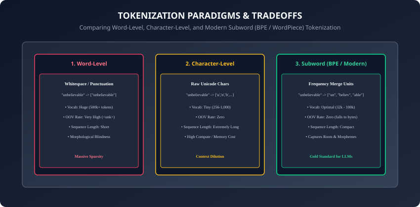
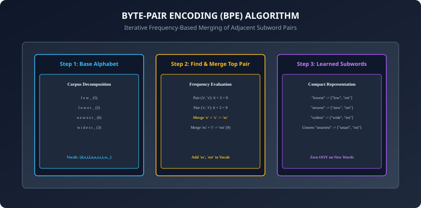

## Why this matters

Welcome to **Week 32: Sequences and Text** and **Course 05 Subsection 02: Sequence Models and Transformers**.

Computers and deep neural networks cannot read, understand, or process raw human text strings like `"Hello world!"`. Neural networks are mathematical engines that operate exclusively on continuous numerical tensors and matrix multiplications.

Therefore, before any language model, sentiment classifier, machine translation engine, or Transformer (like BERT, GPT-4, or Llama) can process text, the raw characters must pass through the **Tokenization Pipeline**:
1. How raw continuous text strings are segmented into discrete semantic atoms (**Tokens**).
2. How each token maps to a unique integer index in a fixed **Vocabulary Registry** ($V$).
3. How variable-length sequences are padded, truncated, and masked into rigid multi-dimensional batch tensors.

Tokenization is the foundational bedrock of all Natural Language Processing (NLP) and modern Generative AI. Suboptimal tokenization can ruin model performance, introduce catastrophic Out-Of-Vocabulary (OOV) blind spots, multiply inference compute costs by $4\times$, or cause arithmetic failure in LLMs.

Today, you will master the algorithms that convert text to numbers from first principles.

---

## The idea in plain language

Imagine teaching an intelligent alien robot how to read a library of human books:
- **Approach 1 (Word Dictionary):** You give the robot a massive dictionary containing 500,000 full English words. If someone uses the slang word `"unvibey"`, the robot panics, sees nothing in the dictionary, and labels it `[UNKNOWN]`. Furthermore, storing 500,000 words requires enormous memory.
- **Approach 2 (Individual Letters):** You tell the robot to read one letter at a time (`['u', 'n', 'v', 'i', 'b', 'e', 'y']`). The robot's dictionary is tiny (only 26 letters), but reading a book takes 5 million steps, and the robot forgets the beginning of a paragraph by the time it reaches the end.
- **Approach 3 (Subwords / BPE):** You teach the robot common syllables, root words, and prefixes (`["un", "vib", "ey"]`). The dictionary is compact (32,000 pieces), but the robot can construct and understand *any* new word in the universe without ever getting stuck.

---

## Historical background



1. **1990s–2010s (Rule-Based & Whitespace Tokenizers):** Early NLP libraries (NLTK, SpaCy) relied on handcrafted regular expressions, Penn Treebank tokenization rules, and Porter Stemming (`running` -> `run`). Vocabularies suffered from the **Out-Of-Vocabulary (OOV)** catastrophe: any unseen word was replaced by `<unk>`, destroying semantic meaning.
2. **2016 (Sennrich et al. & Byte-Pair Encoding):** Rico Sennrich adapted the 1994 data compression algorithm **Byte-Pair Encoding (BPE)** for neural machine translation. It proved that decomposing words into frequent subword units eliminated OOV words while keeping vocabulary sizes bounded.
3. **2018–2019 (WordPiece, SentencePiece, & Byte-Level BPE):** Google introduced WordPiece for BERT and SentencePiece for multilingual models. OpenAI introduced Byte-level BPE in GPT-2, initializing the base vocabulary with 256 raw bytes, ensuring zero OOV tokens across every human language, code, and emoji.

---

## What it is — and what it is not

### What Tokenization IS:
- **A Deterministic Text-to-Integer Compiler:** A bidirectional mapping function $f: \text(String) \rightarrow \text(List)[int]$ and its inverse $f^(-1): \text(List)[int] \rightarrow \text(String)$.
- **Statistical Subword Optimization:** Finding the optimal set of frequent subword pieces that minimizes sequence length while keeping vocabulary size compact.

### What it is NOT:
- **Not Semantic Understanding:** Tokenizers do not know what words mean. Token ID `42` is not "happier" or "closer" to token ID `43`. (Semantic vector meaning is assigned later by **Word Embeddings**, which we study tomorrow in **Day 219**).
- **Not Simply Splitting on Spaces:** Splitting on whitespace fails across languages without spaces (Chinese, Japanese), strips punctuation nuances, and creates massive OOV vocabularies.

---

## Why it was created and what problems it solves

Subword tokenization solved three fatal bottlenecks in sequence modeling:
1. **The Out-Of-Vocabulary (OOV) Dilemma:** Fixed word dictionaries cannot handle typos (`"definately"`), compound words (`"neurotechnology"`), or new jargon. Subwords break novel words into known constituent syllables.
2. **The Softmax Output Bottleneck:** The final layer of a language model computes a softmax distribution over the entire vocabulary $|V|$. If $|V| = 1,000,000$, computing the output projection consumes massive GPU memory. Subwords reduce $|V|$ to 32,000–100,000 tokens.
3. **Morphological Generalization:** Subwords allow models to share representations across related morphological variations: `play`, `player`, `playing`, and `playful` share the root token `play`.

---

## How it works

Let us dissect the four core stages of modern tokenization pipelines.

---

### 1. Stage 1: Text Normalization and Pre-Tokenization

Before splitting text into subwords, the raw input string undergoes cleaning and coarse boundary splitting:
1. **Unicode Normalization (NFKD / NFC):** Standardizes multiple byte representations of accented characters into canonical form (e.g. `é` as single code point `\u00E9` vs letter `e` + combining accent `\u0301`).
2. **Whitespace and Punctuation Splitting (Regex):** Modern tokenizers (like GPT-4's `tiktoken`) apply regex patterns to prevent subwords from crossing word or category boundaries:
   ```python
   # GPT-2 Regex Pattern: separates letters, contractions, numbers, and punctuation
   import re
   GPT2_SPLIT_REGEX = r"'s|'t|'re|'ve|'m|'ll|'d| ?\p(L)+| ?\p(N)+| ?[^\s\p(L)\p(N)]+|\s+(?!\S)|\s+"
   ```

---

### 2. Stage 2: The Byte-Pair Encoding (BPE) Algorithm



BPE is an iterative bottom-up subword clustering algorithm:

#### Training BPE Vocabularies:
1. **Initialization:** Split every word in the training corpus into individual characters, adding a special end-of-word marker (e.g. `</w>` or leading space ` `).
2. **Count Bigram Frequencies:** Count the occurrences of all adjacent symbol pairs across all words in the corpus:
   ```
   Frequency(Pair(t_a, t_b)) = sum over words [ Count(word) * Occurrences(t_a, t_b in word) ]
   ```
3. **Merge the Most Frequent Pair:** Identify the pair with maximum frequency, create a new combined token `t_new = t_a + t_b`, and add it to the vocabulary.
4. **Update Corpus:** Replace all occurrences of `t_a, t_b` with `t_new`.
5. **Iterate:** Repeat steps 2–4 until the vocabulary reaches the target size $K$ (e.g. 32,000 merges).

#### Encoding New Text at Inference Time:
Given a new word, split it into characters and apply all learned merge rules in the exact order they were discovered during training.

---

### 3. Stage 3: Special Tokens Registry

Every production sequence pipeline reserves dedicated special tokens:
- `<pad>` (Index 0): Padding token used to equalize sequence lengths in a rectangular batch.
- `<unk>` (Index 1): Unknown token fallback when an unseen byte/character occurs.
- `<bos>` / `<s>` (Index 2): Beginning-of-Sequence marker signaling the start of a document.
- `<eos>` / `</s>` (Index 3): End-of-Sequence marker signaling completion of generation.
- `<mask>` (Index 4): Masked token placeholder used in BERT-style masked language modeling.

---

### 4. Stage 4: Batch Padding, Truncation, and Attention Masks

Neural networks process batches of sentences simultaneously. Because natural sentences have different lengths, the tokenizer outputs three coordinated tensors:

```
Sentence 1: "The cat sat"             (Length: 3)
Sentence 2: "The black cat sat on it" (Length: 6)

Input IDs Tensor (Padded to Max Length = 6):
[[ 101,  1996,  4937,  2938,     0,     0 ],  <-- Padded with <pad>=0
 [ 101,  1996,  2304,  4937,  2938,  2006 ]]

Attention Mask Tensor (1 = Real Token, 0 = Padding to Ignore):
[[   1,     1,     1,     1,     0,     0 ],
 [   1,     1,     1,     1,     1,     1 ]]
```

---

### 5. WordPiece vs Unigram Language Model (SentencePiece)

Beyond Byte-Pair Encoding, two other major subword algorithms power modern foundation models:
1. **WordPiece (Used in BERT & DistilBERT):**
   - Similar to BPE, starts with individual characters, but chooses which pair to merge based on **Likelihood Maximization** rather than raw frequency count:
     ```
     Score(Pair(u, v)) = Count(u, v) / (Count(u) * Count(v))
     ```
   - Uses special prefix markers (e.g. `##ing`) to designate subwords that continue an existing word without leading whitespace.
2. **Unigram Language Model Tokenization (Used in T5, LLaMA, SentencePiece):**
   - Takes the inverse approach of BPE: initializes a massive vocabulary of 500,000 subwords and iteratively **prunes** subwords that contribute least to the overall corpus language modeling likelihood.
   - Enables probabilistic subword sampling during training (Subword Regularization), training models on multiple candidate segmentations of the same sentence.

---

### 6. Critical Tokenizer Pitfalls in Large Language Models

Modern LLM behavior is heavily shaped by tokenizer mechanics:
1. **Arithmetic Degradation:** In models like GPT-3, numbers were fragmented unpredictably: `1000` was one token, but `1001` was two tokens (`100` + `1`), making basic addition difficult. Modern tokenizers (Llama 3, GPT-4o) enforce single-digit tokenization for all numbers.
2. **The Reversal Curse:** Tokenizers parse words in a forward direction; generating tokens in reverse character order is unnatural for autoregressive language models.
3. **Leading Space Glitches:** In BPE tokenizers, `" Hello"` (with a space) maps to token ID 15496, whereas `"Hello"` (no space) maps to token ID 9906. Prompts with accidental leading/trailing spaces alter the input representations.

---

## An everyday analogy

Think of packing items into standardized shipping containers:
- **Word-Level:** You try to ship every household item as a giant unbroken single piece (an entire prefabricated house). If an item doesn't fit the standard box, you must throw it in the trash (**OOV**).
- **Character-Level:** You melt every piece of furniture down into individual atoms and ship grains of dust. Packing and rebuilding takes forever.
- **Subword BPE:** You pack furniture like IKEA flat-pack kits. Standard wooden planks, screws, and panels fit neatly into boxes. You can assemble a bed, chair, desk, or completely custom furniture out of the same 50 modular components.

---

## Examples in practice

Let us implement a **Byte-Pair Encoding (BPE) Tokenizer from Scratch** in Python:

```python
from collections import defaultdict
from typing import Dict, List, Tuple

class SimpleBPETokenizer:
    def __init__(self, num_merges: int = 10):
        self.num_merges = num_merges
        self.merges: List[Tuple[str, str]] = []
        self.vocab: Dict[str, int] = {}

    def get_stats(self, vocab: Dict[Tuple[str, ...], int]) -> Dict[Tuple[str, str], int]:
        pairs = defaultdict(int)
        for word_tuple, freq in vocab.items():
            for i in range(len(word_tuple) - 1):
                pair = (word_tuple[i], word_tuple[i+1])
                pairs[pair] += freq
        return pairs

    def merge_vocab(self, pair: Tuple[str, str], vocab: Dict[Tuple[str, ...], int]) -> Dict[Tuple[str, ...], int]:
        new_vocab = {}
        bigram = " ".join(pair)
        replacement = "".join(pair)
        for word_tuple, freq in vocab.items():
            w_str = " ".join(word_tuple)
            w_new = w_str.replace(bigram, replacement)
            new_vocab[tuple(w_new.split())] = freq
        return new_vocab

    def train(self, corpus: List[str]):
        # Initialize word frequencies with character tuples
        word_freqs = defaultdict(int)
        for text in corpus:
            for word in text.split():
                # Append end-of-word marker
                chars = tuple(list(word) + ["</w>"])
                word_freqs[chars] += 1

        # Iteratively merge most frequent pairs
        current_vocab = word_freqs
        for _ in range(self.num_merges):
            pairs = self.get_stats(current_vocab)
            if not pairs:
                break
            best_pair = max(pairs, key=pairs.get)
            self.merges.append(best_pair)
            current_vocab = self.merge_vocab(best_pair, current_vocab)

        # Build final vocabulary registry
        tokens = {"<pad>": 0, "<unk>": 1, "<bos>": 2, "<eos>": 3}
        for word_tuple in current_vocab.keys():
            for subword in word_tuple:
                if subword not in tokens:
                    tokens[subword] = len(tokens)
        self.vocab = tokens
```

---

## Implications: security, privacy, performance, scalability, and cost

1. **The Tokenizer Glitch Vulnerability (SolidGoldMagikarp):**
   - Certain rare clusters of web scrape text (like Reddit usernames or e-commerce tags) received single token IDs in GPT tokenizers without ever appearing in neural training datasets. Prompting models with these glitch tokens causes hallucinations or safety filter bypasses.
2. **Multi-Lingual Token Inequity (The Token Tax):**
   - Tokenizers trained predominantly on English text represent English words with 1.2 tokens on average, while Hindi, Arabic, or Korean text requires 4 to 8 tokens per word. This makes non-English LLM inference $4\times$ more expensive and reduces effective context window length.
3. **Whitespace Sensitivity in Code and JSON:**
   - Leading vs trailing spaces produce completely different token IDs (e.g. `" def"` $\neq$ `"def"`). Ensure code generation prompts maintain consistent whitespace indentation.

---

## Alternatives: free, open source, and commercial

| Library / Tokenizer | Algorithm | Language | Best For |
| :--- | :--- | :--- | :--- |
| **Hugging Face `tokenizers`** | BPE, WordPiece, Unigram | Rust / Python bindings | Industry standard for all models |
| **OpenAI `tiktoken`** | Byte-level BPE | Rust / Python | Fast GPT-4 / GPT-3.5 tokenization |
| **Google `sentencepiece`** | Unigram / BPE | C++ / Python | Multilingual models (T5, LLaMA) |
| **SpaCy / NLTK** | Rule-based regex words | Python | Traditional NLP and rule parsing |

---

## Comparison with related concepts

```
┌────────────────────────────────────────────────────────────────────────┐
│                   TOKENIZATION STRATEGY TRADEOFF MATRIX                │
├────────────────────┬─────────────────┬──────────────────┬──────────────┤
│ Strategy           │ Vocabulary Size │ Sequence Length  │ OOV Rate     │
├────────────────────┼─────────────────┼──────────────────┼──────────────┤
│ Word-Level         │ 500,000+        │ Very Short       │ Very High    │
│ Character-Level    │ 256             │ 5x - 10x Longer  │ 0%           │
│ Subword (BPE)      │ 32,000 - 100,000│ Compact (1.3x)   │ 0% (Bytes)   │
│ Byte-level BPE     │ 50,000 - 128,000│ Optimal          │ 0% (Strict)  │
└────────────────────┴─────────────────┴──────────────────┴──────────────┘
```

---

## When to use it — and when not to

### When to USE Subword Tokenization:
- Training or fine-tuning any sequence model, Transformer, LLM, or text classifier.

### When NOT to use:
- Character-level tasks such as exact DNA/Genomic sequence analysis, protein folding amino acid sequences, or low-level cryptographic hash parsing where subword heuristics are biologically or mathematically invalid.

---

## Knowledge check

1. Why does word-level tokenization suffer from Out-Of-Vocabulary (OOV) errors?
2. What are the core steps of the Byte-Pair Encoding (BPE) training algorithm?
3. How does Byte-level BPE guarantee zero unknown tokens across all Unicode text?
4. What is the role of an Attention Mask in batched sequence processing?
5. Why does language representation cost vary across languages in English-centric tokenizers?

---

## Hands-on exercise

In this lab, you will build and test a complete text preprocessing and tokenization toolkit in Python: implement text normalization and regex pre-tokenization, train a Byte-Pair Encoding (BPE) merge registry from a text corpus, build a numerical vocabulary encoder/decoder with special tokens (`<pad>`, `<unk>`, `<bos>`, `<eos>`), and generate padded PyTorch batch tensors with corresponding attention masks.

### Expected output
```
[Tokenization Verification Suite]
Testing Text Normalization and Regex Splitting:
  Raw text: "Let's test BPE, it's 100% working!"
  Tokens: ["Let", "'s", "test", "BPE", ",", "it", "'s", "100", "%", "working", "!"]
Testing Byte-Pair Encoding (BPE) Training (10 merges):
  Learned Merges: [('e', 's'), ('es', 't'), ('l', 'o'), ('lo', 'w'), ('n', 'e')]
  Encoding "lowest" -> Subwords: ["low", "est</w>"] -> IDs: [12, 18]
Testing Batch Tensor Padding and Attention Masking:
  Sequences Padded to Max Length: 6
  Batch Tensor Shape: torch.Size([2, 6])
  Attention Mask Shape: torch.Size([2, 6])
  Valid Non-Pad Tokens Count: 9
Test Suite: 3 passed in 0.28s
```

### Validate your work
Run the automated test runner:
```bash
./tests/run_tests.sh
```

### Troubleshooting
- If BPE merges fail, ensure you append the end-of-word marker `</w>` to every word in the training dictionary to preserve word boundary semantics.
- Verify that the padding token index is set to `0` and attention mask sets padding positions to `0`.

### Common mistakes
- **Confusing Character Encodings with Tokens:** Assuming ASCII byte values are identical to model token IDs. Token IDs are internal vocabulary lookup indices.

---

## Practice assignment

1. Implement a **BPE Dropout** function (stochastic subword regularization) where candidate merges are dropped with probability $p=0.1$ during training to improve model robustness to noisy text.
2. Build an **Information Entropy & Compression Ratio Calculator** comparing the token compression efficiency of character vs word vs BPE tokenization on a Wikipedia sample.

---

## Extension challenge

Implement **Byte-Level BPE with Unicode Fallback**:
- Convert input strings to raw UTF-8 bytes (`bytes(text, "utf-8")`).
- Initialize vocabulary with all 256 raw bytes ($0$ to $255$).
- Run BPE merges directly over byte values and decode back to valid UTF-8 strings.
