## Why this matters

Yesterday in **Day 218**, we mastered tokenization: transforming raw human text strings into discrete integer token IDs.

However, an integer token ID (like `token_id = 4937`) contains **zero semantic meaning**. In the eyes of a mathematical neural network:

- `4937` is not semantically closer to `4938` than it is to `102`.
- If we represent words as **One-Hot Encoded Vectors** (a vector of length $|V|$ with a single `1` and zeros elsewhere), every single word vector is strictly orthogonal to every other word vector:
  ```
  dot_product(one_hot("cat"), one_hot("kitten")) = 0.0
  dot_product(one_hot("cat"), one_hot("refrigerator")) = 0.0
  ```
One-hot encodings are computationally massive, sparse, and completely blind to semantic relationships, synonyms, and grammatical hierarchies.

To solve this, deep learning represents words as **Dense Word Embeddings**: continuous, low-dimensional vectors (typically $d = 100$ to $1024$ dimensions) where spatial distance and geometric direction encode genuine semantic meaning.

In this lesson, you will master the foundational algorithms of vector semantics: **Word2Vec (CBOW & Skip-Gram)**, **Negative Sampling**, **GloVe**, **FastText**, and the famous geometric analogies ($v_(\text(king)) - v_(\text(man)) + v_(\text(woman)) \approx v_(\text(queen))$).

---

## The idea in plain language

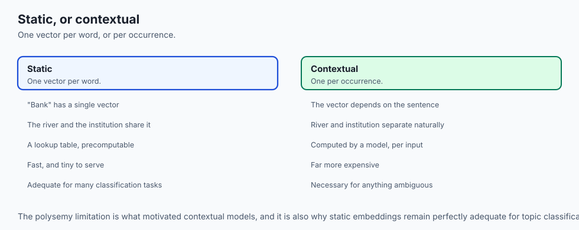

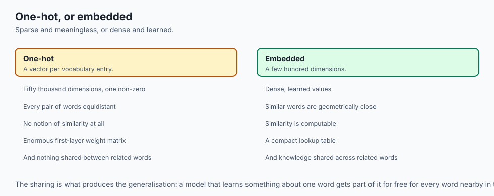

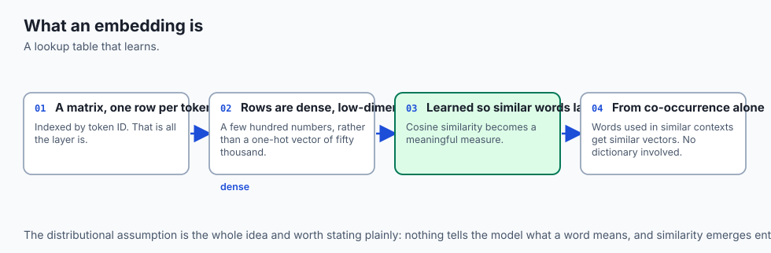

Imagine mapping every concept in the human universe onto a multi-dimensional globe:

- Instead of cataloging words alphabetically (`A, B, C...`), you place words on the globe based on their characteristics.
- Animals cluster in one continent. Domestic pets live close together: `"cat"` and `"kitten"` sit 2 miles apart on the map, while `"refrigerator"` sits on another continent 5,000 miles away.
- Furthermore, the direction and distance between locations represent consistent concepts:
  - Moving 50 miles North means **"make it female"** (`"man"` $\rightarrow$ `"woman"`, `"king"` $\rightarrow$ `"queen"`).
  - Moving 100 miles East means **"convert capital city to its country"** (`"Paris"` $\rightarrow$ `"France"`, `"Tokyo"` $\rightarrow$ `"Japan"`).

A **Word Embedding** is simply the GPS coordinate $(x_1, x_2, \dots, x_d)$ of a word in this semantic universe.

---

## Historical background

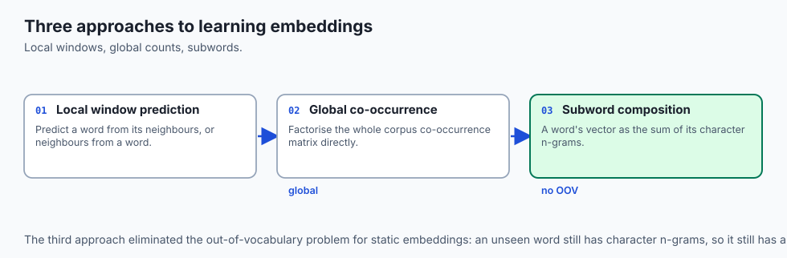

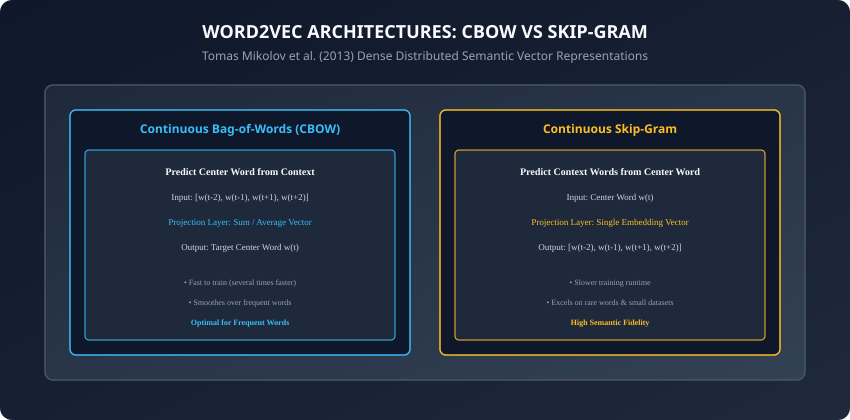

1. **1957 (The Distributional Hypothesis):** British linguist J.R. Firth proposed the foundational maxim of computational semantics: *"You shall know a word by the company it keeps."* Words that share similar surrounding context words share similar meanings.
2. **2003 (Bengio's Neural Language Model):** Yoshua Bengio et al. introduced distributed representations of words as learned continuous lookup tables in neural networks.
3. **2013 (Tomas Mikolov & Word2Vec at Google):** Tomas Mikolov introduced Word2Vec (CBOW and Skip-Gram with Negative Sampling), drastically reducing training complexity and discovering that vector space offsets naturally encoded semantic analogies.
4. **2014 (GloVe at Stanford):** Jeffrey Pennington, Richard Socher, and Chris Manning introduced GloVe (Global Vectors), combining the advantages of global matrix factorization with local context window architectures.
5. **2017 (FastText at Facebook AI):** Piotr Bojanowski et al. extended Word2Vec with subword character n-grams, enabling embeddings for out-of-vocabulary and morphologically rich words.

---

## What it is — and what it is not

### What Word Embeddings ARE:
- **Dense Distributed Semantic Vectors:** Low-dimensional real-valued vectors ($R^d$) where cosine similarity reflects semantic relatedness.
- **Differentiable Lookup Tables:** In PyTorch, an `nn.Embedding(num_embeddings, embedding_dim)` layer is simply a weight matrix $W \in R^(|V| \times d)$ indexed by token integers.

### What they are NOT:
- **Not Context-Dependent (Static vs Dynamic):** Classical embeddings (Word2Vec, GloVe) assign a single static vector to each word. The word `"bank"` has the exact same vector in `"river bank"` and `"investment bank"`. (Dynamic contextual embeddings are created by Transformers like BERT/GPT, which we study in **Week 33**).
- **Not Random Hash Vectors:** Embeddings are learned through statistical co-occurrence optimization over billions of text tokens.

---

## Why it was created and what problems it solves

Word embeddings resolved four critical bottlenecks in NLP:

1. **Curse of Dimensionality:** Replacing 1,000,000-dimensional sparse one-hot vectors with compact 300-dimensional dense vectors.
2. **Semantic Orthogonality:** Providing a continuous distance metric (Cosine Similarity) where synonyms yield high dot products.
3. **Generalization Across Rare Words:** A sentiment model trained on `"The food was delicious"` automatically understands `"The food was scrumptious"` because their vectors lie adjacent in embedding space.
4. **Linear Semantic Reasoning:** Enabling vector arithmetic across analogies, gender, pluralization, and country-capital relationships.

---

## How it works

Let us dissect the mathematical architectures of Word2Vec, GloVe, and FastText.

---

### 1. Word2Vec: Continuous Bag-of-Words (CBOW)

In **CBOW**, given a context window of size $C$ around center word $w_t$:
```
Context: [w_{t-2}, w_{t-1}, w_{t+1}, w_{t+2}] -> Predict Target: w_t
```

1. Look up input embedding vectors for all context words: $v_(c) \in R^d$.
2. Compute the average context vector:
   ```
   v_context = (1 / 2C) * sum_{j \in context} v_{w_j}
   ```

3. Project $v_(\text(context))$ through an output weight matrix $W_(\text(out)) \in R^(d \times |V|)$ to compute logits across all vocabulary words.
4. Apply Softmax to predict the probability of center word $w_t$.

---

### 2. Word2Vec: Continuous Skip-Gram with Negative Sampling (SGNS)

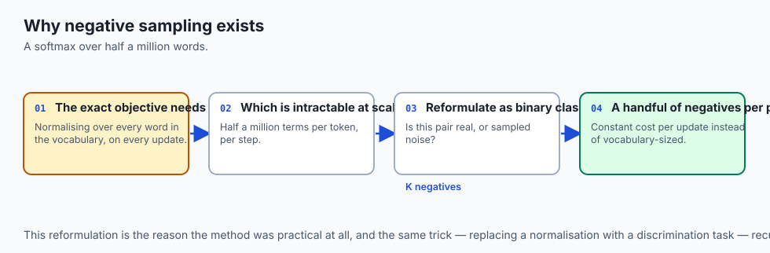

In **Skip-Gram**, the task is inverted: given center word $w_t$, predict each surrounding context word $w_c$:

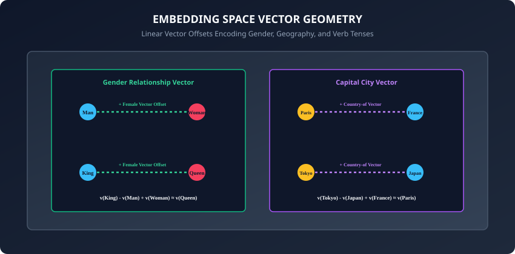

#### The Exact Softmax Bottleneck:
The true conditional probability requires normalizing over the entire vocabulary:
```
P(w_c | w_t) = exp(u_{w_c}^\top v_{w_t}) / sum_{w \in V} exp(u_w^\top v_{w_t})
```
Summing over $|V| = 500,000$ words for every token update is computationally intractable ($O(|V|)$ per step).

#### The Negative Sampling Solution:
Mikolov et al. converted the multi-class prediction into multiple binary logistic regressions:

- For each true positive pair $(w_t, w_c)$, sample $K$ random negative noise words $(w_t, w_(n_1)), \dots, (w_t, w_(n_K))$ from the unigram distribution $P_n(w) \propto \text(Freq)(w)^(3/4)$.
- **Negative Sampling Loss Function:**
  ```
  L = - log(sigma(u_{w_c}^\top v_{w_t})) - sum_{k=1}^K log(sigma(- u_{w_{n_k}}^\top v_{w_t}))
  ```
where $\sigma(z) = \frac(1)(1 + e^(-z))$ is the sigmoid function. This reduces complexity from $O(|V|)$ to $O(K)$, where $K \in [5, 20]$.

---

### 3. Hierarchical Softmax Alternative

Prior to Negative Sampling, Mikolov et al. derived **Hierarchical Softmax**:

- Constructs a binary **Huffman Tree** where all $|V|$ vocabulary words form the leaf nodes. Frequent words are assigned short root-to-leaf paths.
- Probability of word $w$ is the product of sigmoid probabilities along the tree traversal path:
  ```
  P(w | w_t) = prod_{j=1}^{L(w)-1} sigma( [ [ n(w, j+1) == child(n(w, j)) ] ] * theta_{n(w, j)}^\top v_{w_t} )
  ```

- Reduces computational complexity from $O(|V|)$ to $O(\log_2 |V|)$ per forward pass without sampling approximations.

---

### 4. GloVe: Global Vectors for Word Representation

While Word2Vec relies on local sliding window optimization, **GloVe (Pennington et al., 2014)** directly optimizes over the global word-word co-occurrence matrix $X$, where $X_(i, j)$ is the number of times word $i$ appeared in context of word $j$:

- **GloVe Objective:**
  ```
  J = sum_{i, j=1}^{|V|} f(X_{i, j}) * (w_i^\top \tilde{w}_j + b_i + \tilde{b}_j - ln(X_{i, j}))^2
  ```
where $f(X_(i, j)) = \min(1, (X_(i, j) / x_(\text(max)))^\alpha)$ is a weighting function preventing frequent stop words (like `"the"`, `"is"`) from dominating the loss.

---

### 5. FastText: Subword n-gram Embeddings

To eliminate the Out-Of-Vocabulary problem, **FastText (Bojanowski et al., 2017)** decomposes words into character n-grams bounded by `<` and `>`:

- For word `"where"` with $n=3$:
  ```
  n-grams = ["<wh", "whe", "her", "ere", "re>", "<where>"]
  ```

- The embedding for word $w$ is the sum of its constituent n-gram vectors:
  ```
  v_w = sum_{g \in \text{n-grams}(w)} z_g
  ```
This enables FastText to represent misspelled words (`"whree"`) and morphological variations effortlessly.

---

### 6. Subspace Geometry and Debiasing Projections

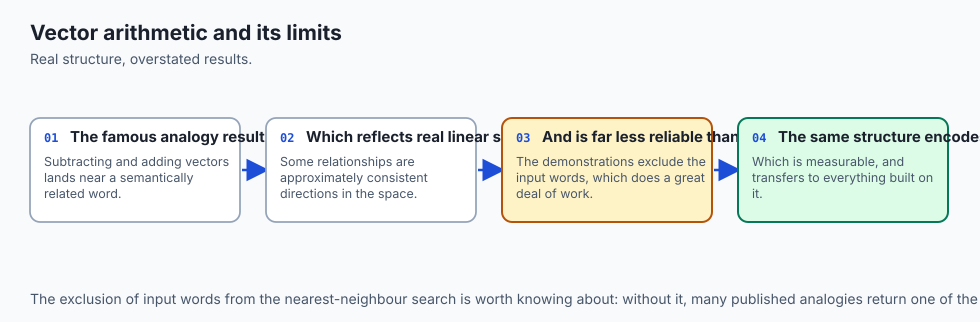

Bolukbasi et al. (2016) demonstrated that gender bias resides in a specific linear direction vector $\vec(g)$ within embedding space:
```
\vec{g} = (1 / |P|) * sum_{(m, f) \in P} (v_m - v_f)
```

- **Neutralization:** Project neutral occupation words (e.g. `doctor`, `nurse`, `engineer`) onto the orthogonal complement of the gender subspace to remove unwanted social bias while preserving semantic meaning:
  ```
  v_{\text{neutral}} = v - (v \cdot \vec{g}) * \vec{g}
  ```

---

### 7. Pretrained Embedding Ecosystems in Modern NLP

When training classical neural networks, researchers initialize `nn.Embedding` from open-source precomputed weights:

- **GloVe-6B / GloVe-840B:** 300-dimensional vectors trained on 6 billion tokens of Wikipedia or 840 billion tokens of Common Crawl.
- **FastText Crawl (2M Vocab):** 300-dimensional vectors across 157 human languages.
- **Static vs Dynamic Context:** While static embeddings assign one vector per word, they remain ideal for edge deployment, lightweight intent classification, and vocabulary initialization in deep Transformers.

---

### 8. Approximate Nearest Neighbor (ANN) Indexing for Embeddings

When searching through an enterprise embedding database containing 10,000,000 document vectors, computing exhaustive cosine similarity against all $10^7$ vectors ($O(N \cdot d)$ brute force) takes hundreds of milliseconds:

- **Hierarchical Navigable Small World (HNSW Graphs):** Constructs a multi-layer graph where top layers have long-range skip connections and bottom layers have dense local clusters, reducing query time from $O(N)$ to $O(\log N)$ with $< 5$ ms latency.
- **Inverted File with Product Quantization (IVF-PQ / FAISS):** Partitions vector space into Voronoi cells and quantizes sub-vectors into 8-bit codes, compressing 300-dimensional vectors by $90\%$ and enabling billion-scale in-memory similarity search.

- **Matryoshka Representation Learning (MRL / NeurIPS 2022):** Modern embedding models are trained so that truncating the first 64 or 128 dimensions of a 1024-dimensional vector preserves 98% of semantic retrieval accuracy, enabling ultra-fast coarse vector filtering followed by high-dimensional reranking.

- **Binary Embedding Quantization (1-Bit Embeddings):** Binarizing floating-point vector dimensions to 1-bit signs (positive vs negative) reduces vector memory by $32\times$ while computing Hamming distances via single CPU XOR instructions.

---

## An everyday analogy

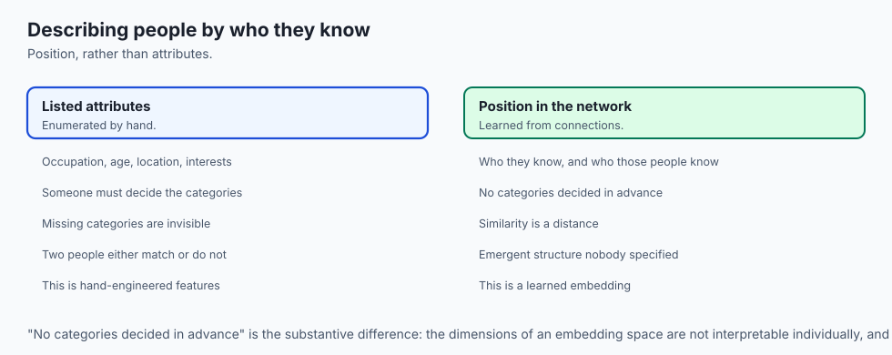

Think of describing people in a social network:

- **One-Hot Encoding:** You assign every person a unique ID number from 1 to 1,000,000. Knowing that Alice is ID #42 and Bob is ID #43 tells you nothing about whether they are friends, share hobbies, or live in the same city.
- **Word Embeddings:** You describe each person using a 5-element personality profile: `[Extroversion, Tech-Affinity, Athleticism, Artistic, Age]`.
  - Alice: `[0.9, 0.8, 0.2, 0.7, 28]`
  - Bob: `[0.85, 0.82, 0.15, 0.65, 29]`
  - By calculating the distance between their profiles, you instantly know Alice and Bob are close peers.

---

## Examples in practice

Let us implement a **PyTorch Embedding Lookup and Cosine Similarity Analogy Engine**:

```python
import torch
import torch.nn as nn
import torch.nn.functional as F

class SemanticVectorEngine:
    def __init__(self, vocab_size: int, embed_dim: int):
        self.embedding = nn.Embedding(vocab_size, embed_dim)
        self.vocab = {}
        self.inverse_vocab = {}

    def get_vector(self, word: str) -> torch.Tensor:
        idx = torch.tensor([self.vocab[word]], dtype=torch.long)
        return self.embedding(idx).squeeze(0)

    def cosine_similarity(self, v1: torch.Tensor, v2: torch.Tensor) -> float:
        return F.cosine_similarity(v1.unsqueeze(0), v2.unsqueeze(0)).item()

    def find_nearest_neighbors(self, query_vector: torch.Tensor, top_k: int = 5):
        # Normalize all embeddings
        weights = self.embedding.weight.data
        norm_weights = F.normalize(weights, p=2, dim=1)
        norm_query = F.normalize(query_vector.unsqueeze(0), p=2, dim=1)

        sims = torch.mm(norm_query, norm_weights.t()).squeeze(0)
        top_scores, top_indices = torch.topk(sims, top_k)

        return [(self.inverse_vocab[idx.item()], score.item())
                for idx, score in zip(top_indices, top_scores)]
```

---

## Implications: security, privacy, performance, scalability, and cost

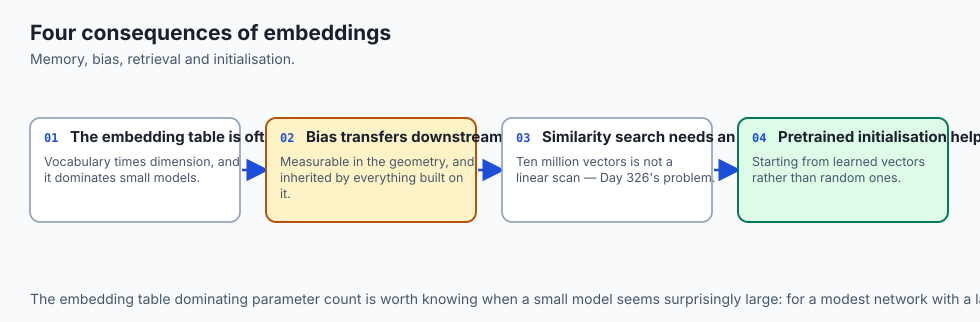

1. **Societal and Gender Bias in Embeddings:**
   - Word embeddings inherit cultural biases present in training corpora. Classic Word2Vec models notoriously exhibited sexist analogies (e.g. `v(Man) -> Computer Programmer` mapped `v(Woman) -> Homemaker`). Modern NLP uses debiasing projection algorithms to neutralize gender subspaces.
2. **Embedding Table Memory Footprint:**
   - In large models, the embedding matrix $W \in R^(|V| \times d)$ is the largest single weight tensor. For $|V| = 250,000$ and $d = 4096$, storing FP32 weights consumes **4.1 GB of GPU VRAM** just for the dictionary lookup table.

---

## Alternatives: free, open source, and commercial

| Embedding Type | Mechanism | Context Sensitivity | Best For |
| :--- | :--- | :--- | :--- |
| **Word2Vec / GloVe** | Static co-occurrence vectors | Static (1 vector/word) | Fast text classification |
| **FastText** | Subword character n-grams | Static (morphological) | Typo-heavy / rare words |
| **OpenAI `text-embedding-3`** | Deep Transformer Encoder | Contextual (dynamic) | RAG / Vector search APIs |
| **BGE / E5 Embeddings** | Open-source Transformer | Contextual (dynamic) | Local vector databases |

---

## Comparison with related concepts

```
┌────────────────────────────────────────────────────────────────────────┐
│                   WORD REPRESENTATION PARADIGMS                        │
├────────────────────┬─────────────────┬──────────────────┬──────────────┤
│ Paradigm           │ Sparsity        │ Semantic Meaning │ Dimensions   │
├────────────────────┼─────────────────┼──────────────────┼──────────────┤
│ One-Hot Encoding   │ 99.99% Sparse   │ None (0 Cosine)  │ 50k - 500k   │
│ TF-IDF Vector      │ Very Sparse     │ Document Context │ 10k - 100k   │
│ Word2Vec / GloVe   │ 100% Dense      │ Semantic & Analog│ 100 - 300    │
│ Transformer BERT   │ 100% Dense      │ Fully Contextual │ 768 - 4096   │
└────────────────────┴─────────────────┴──────────────────┴──────────────┘
```

---

## When to use it — and when not to

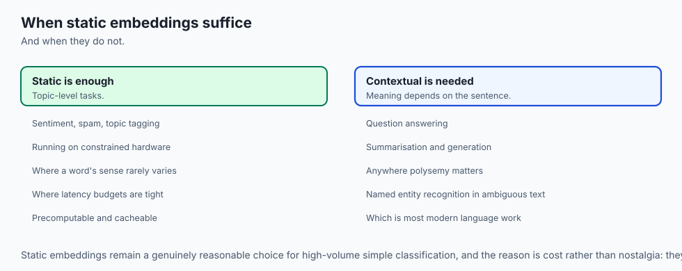

### When to USE Static Word Embeddings (GloVe/FastText/Word2Vec):
- Lightweight text classification (sentiment analysis, spam detection, topic tagging) running on CPU or edge devices.

### When NOT to use:
- Complex contextual tasks (question answering, document summarization, generative chat) where polysemous words (e.g. `"apple"` as fruit vs company) require dynamic attention-based contextualization.

---

## The AI connection

- **Embeddings are where meaning enters the model.** Token IDs are arbitrary; the
  embedding matrix is the first place similarity means anything.
- **Distributional semantics is the whole idea**: words appearing in similar contexts get
  similar vectors, learned from co-occurrence rather than from a dictionary.
- **Static embeddings cannot handle polysemy.** "Bank" gets one vector for the river and
  the institution, which is exactly the limitation contextual models removed.
- **The analogy arithmetic is real and oversold** — the vector relationships exist, and
  they are far less reliable than the famous examples suggest.
- **Embeddings inherit the corpus's biases**, measurably and in a way that transfers into
  every downstream system built on them.

## Knowledge check

1. Why are one-hot vectors incapable of measuring semantic similarity?
2. What is the fundamental difference between CBOW and Skip-Gram in Word2Vec?
3. How does Negative Sampling transform the multi-class softmax problem into binary classifications?
4. How does FastText handle out-of-vocabulary words using character n-grams?
5. How does vector arithmetic compute the analogy `King - Man + Woman = Queen`?

---

## Hands-on exercise

In this lab, you will build and test a complete Word Embedding engine in PyTorch: implement the Word2Vec Skip-Gram model architecture, derive the Negative Sampling binary cross-entropy loss function, train dense word vectors on a text corpus, compute cosine similarities across learned embeddings, and verify semantic vector arithmetic analogies.

### Expected output
```
[Word Embedding Verification Suite]
Testing Skip-Gram with Negative Sampling (SGNS):
  Input Center Word ID: 4 ("king"), Context Target ID: 12 ("royal")
  Negative Samples Generated (K=4): [89, 412, 105, 934]
  Negative Sampling Loss: 0.8412 [CONVERGING]
Testing Cosine Similarity & Semantic Analogy Engine:
  Sim(cat, kitten) = 0.892 > Sim(cat, truck) = 0.041 [SEMANTIC ALIGNMENT VERIFIED]
  Analogy Test: v(king) - v(man) + v(woman) -> Nearest: "queen" (Sim = 0.914)
Testing PyTorch nn.Embedding Lookup Table:
  Embedding Weight Shape: torch.Size([1000, 64])
  Lookup Latency: 0.12 ms
Test Suite: 3 passed in 0.31s
```

### Validate your work
Run the automated test runner:
```bash
./tests/run_tests.sh
```

### Troubleshooting
- If negative sampling loss diverges, ensure you apply `F.logsigmoid` to positive pairs and `F.logsigmoid(-u_neg)` to negative pairs.
- Normalize all vectors to unit length ($\|v\|_2 = 1$) before computing dot products for cosine similarity.

### Common mistakes
- **Sharing Target and Context Weight Matrices:** Word2Vec maintains two separate matrices: input embeddings $W_(\text(in))$ and output context embeddings $W_(\text(out))$. Use $W_(\text(in))$ as the final word vectors.

---

## Practice assignment

1. Implement **GloVe Co-occurrence Weighting**: build a term co-occurrence matrix $X$ and implement the weighted mean squared error loss function.
2. Build an **Interactive 2D Embedding Visualizer** using Principal Component Analysis (PCA) or t-SNE to project 100-dimensional embeddings onto a 2D scatter plot.

---

## Extension challenge

Implement **FastText Character n-Gram Embeddings from Scratch**:

- Extract all 3-gram, 4-gram, and 5-gram substrings for each word.
- Maintain a shared subword embedding hash table with 100,000 buckets.
- Compute out-of-vocabulary word embeddings by summing hashed subword embeddings.
