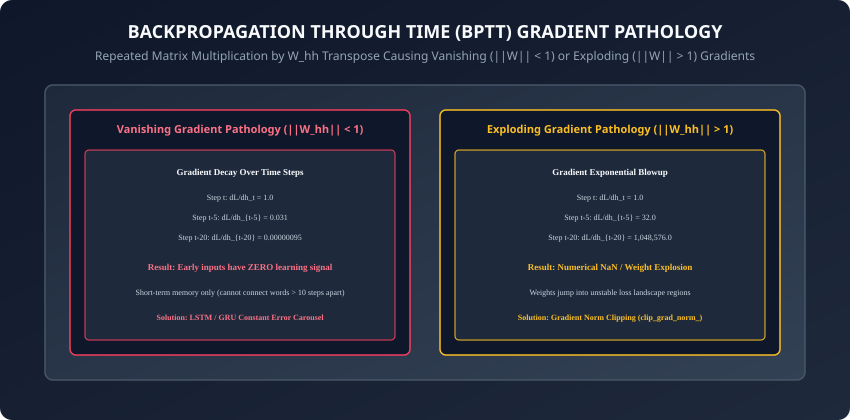

## Why this matters

Feedforward neural networks (like MLPs and CNNs) operate under a rigid architectural constraint: they assume all input samples are **independent and identically distributed (i.i.d.)**.

However, the vast majority of real-world information is fundamentally **sequential and temporal**:
- Natural language sentences (where the meaning of word #10 depends on word #1).
- Time series financial stock prices and sensor telemetry.
- Audio speech signals, music waveforms, and biological DNA strings.

If you pass a sentence into a feedforward network as a flat vector, the network cannot easily handle variable-length inputs and is blind to word order.

In 1990, cognitive scientist Jeffrey Elman introduced the **Simple Recurrent Neural Network (Elman RNN)**. By adding a recurrent feedback loop that passes an internal **Hidden State Vector** ($h_t$) from one time step to the next, neural networks gained an internal memory buffer.

Today, you will master the mechanics of recurrent networks: unrolling computation graphs across time, deriving **Backpropagation Through Time (BPTT)**, diagnosing the mathematical causes of vanishing and exploding gradients, implementing gradient norm clipping, and building a character-level sequence generator in PyTorch.

---

## The idea in plain language

Imagine reading a thrilling murder mystery novel:
- **Feedforward Network (Amnesia Reader):** You read each word in complete isolation. When you read page 200 and see the word `"guilty"`, you have already forgotten every clue, character, and plot twist from pages 1 through 199.
- **Recurrent Neural Network (Reader with a Mental Notepad):** As you read each word $x_t$, you maintain a mental summary of the story on your notepad (**Hidden State $h_t$**).
  - When you read a new word $x_t$, you combine the new word with your current summary $h_(t-1)$ to write an updated summary $h_t$.
  - When you finish the chapter, your final notepad state $h_T$ contains the distilled context of the entire story.

---

## Historical background



1. **1986 (Rumelhart, Hinton, & Williams):** Introduced Backpropagation Through Time (BPTT), showing that unrolling recurrent networks into deep feedforward graphs allowed standard gradient descent to train temporal states.
2. **1990 (Jeffrey Elman & Elman RNNs):** Introduced the simple recurrent network architecture ($h_t = \sigma(W_(hh) h_(t-1) + W_(xh) x_t)$), demonstrating that networks could learn grammar and syntactic word boundaries without explicit rules.
3. **1994 (Bengio et al. & The Vanishing Gradient Proof):** Yoshua Bengio et al. published the mathematical proof explaining why gradient descent struggled on long temporal sequences: repeated Jacobian matrix multiplications caused gradients to vanish exponentially.
4. **2013 (Mikolov, Pascanu, & Gradient Clipping):** Razvan Pascanu, Tomas Mikolov, and Yoshua Bengio systematized gradient clipping to eliminate exploding gradients, enabling large-scale RNN training.

---

## What it is — and what it is not

### What an RNN IS:
- **A State-Space Dynamical System:** A network that updates a persistent continuous state vector $h_t$ at every discrete time step $t$ using the transition function $h_t = f(h_(t-1), x_t)$.
- **Time-Invariant Parameter Sharing:** The exact same weight matrices ($W_(xh), W_(hh), W_(hy)$) are reused across every time step $t \in [1, T]$.

### What it is NOT:
- **Not Infinite Memory:** Standard vanilla RNNs suffer from catastrophic forgetting: after 10 to 15 time steps, early inputs vanish from the hidden state. (Longer temporal retention requires **LSTMs and GRUs**, which we study tomorrow in **Day 221**).
- **Not Parallelizable Across Time:** Because $h_t$ strictly requires $h_(t-1)$, training cannot compute step $t$ until step $t-1$ completes, creating a sequential compute bottleneck on GPUs.

---

## Why it was created and what problems it solves

Recurrent networks resolved three critical limitations of classical feedforward architectures:
1. **Handling Arbitrary Variable Sequence Lengths:** Feedforward networks require fixed input dimensions ($N$ inputs). An RNN processes sequences of length 3, 30, or 300 using the identical weight tensors.
2. **Temporal Equivariance:** A phrase like `"not good"` produces a similar shift in hidden state whether it appears at word #2 or word #50.
3. **Flexible Sequence Topologies:**
   - *Many-to-One:* Sentiment analysis (Sequence of words $\rightarrow$ Single sentiment class).
   - *One-to-Many:* Image captioning (Single image vector $\rightarrow$ Sequence of generated words).
   - *Many-to-Many (Synchronized):* Video frame classification or Part-of-Speech tagging.
   - *Many-to-Many (Delayed / Seq2Seq):* Machine translation (Full input sentence $\rightarrow$ Full output translation).

---

## How it works

Let us dissect the mathematical formulation of recurrent forward propagation and Backpropagation Through Time.

---

### 1. Forward Propagation Equations

At each discrete time step $t \in [1, T]$:
1. Receive input vector $x_t \in R^(d_(\text(in)))$ (e.g. word embedding) and previous hidden state $h_(t-1) \in R^(d_h)$.
2. Compute the new hidden state using the non-linear hyperbolic tangent activation ($\tanh$):
   ```
   h_t = tanh(W_{xh} * x_t + W_{hh} * h_{t-1} + b_h)
   ```
3. Compute the output prediction logits $\hat(y)_t \in R^(d_(\text(out)))$:
   ```
   \hat{y}_t = W_{hy} * h_t + b_y
   ```
4. For multi-class classification / language modeling, compute the softmax probability distribution:
   ```
   p_t = softmax(\hat{y}_t)
   ```

---

### 2. Backpropagation Through Time (BPTT)



To train the shared parameters ($W_(xh), W_(hh), W_(hy)$), we compute total sequence loss $L = \sum_(t=1)^T L_t$.

By the multivariate chain rule, the gradient of loss at step $T$ with respect to the recurrent weight matrix $W_(hh)$ accumulates across all prior time steps:
```
partial L_T / partial W_{hh} = sum_{k=1}^T (partial L_T / partial h_T) * (partial h_T / partial h_k) * (partial h_k / partial W_{hh})
```

The crucial term is the **temporal Jacobian product**:
```
partial h_T / partial h_k = prod_{j=k+1}^T (partial h_j / partial h_{j-1}) = prod_{j=k+1}^T W_{hh}^\top * diag(1 - h_j^2)
```

---

### 3. The Mathematics of Vanishing and Exploding Gradients

The Jacobian product involves multiplying $T - k$ matrices together:
- **Case 1: Vanishing Gradients ($\|W_(hh)\|_2 < 1$):**
  Since $\tanh'(z) = 1 - \tanh^2(z) \le 1$, if the largest singular value of $W_(hh)$ is $\lambda_(\text(max)) < 1$, the gradient magnitude decays exponentially:
  ```
  || partial h_T / partial h_k || <= (lambda_{max})^{T - k} -> 0  (as T - k grows)
  ```
  The network becomes incapable of learning long-term dependencies.
- **Case 2: Exploding Gradients ($\|W_(hh)\|_2 > 1$):**
  If $\lambda_(\text(max)) > 1$, gradients blow up exponentially ($> 10^6$), causing floating-point `NaN` overflows and destructive weight updates.

---

### 4. Gradient Norm Clipping

To eliminate exploding gradients, Mikolov et al. introduced **L2 Gradient Norm Clipping**:
1. Compute global L2 norm of all network parameter gradients:
   ```
   ||g||_2 = sqrt( sum_i ||g_i||_2^2 )
   ```
2. If $\|g\|_2 > C$ (where $C$ is a maximum threshold, typically $C = 1.0$ or $5.0$), rescale all gradients:
   ```
   g_clipped = g * (C / ||g||_2)
   ```
This preserves the exact descent direction while strictly capping the step magnitude.

---

### 5. Bidirectional Recurrent Neural Networks (BiRNN)

In many NLP tasks (like text classification, named entity recognition, or translation encoding), the model has access to the **entire sequence** at once:
- **Bidirectional RNN (Schuster & Paliwal, 1997):** Duplicates the recurrent layer into two independent streams:
  1. *Forward RNN:* Computes $\overrightarrow(h)_t = \tanh(W_(xh)^f x_t + W_(hh)^f \overrightarrow(h)_(t-1))$ from step $1$ to $T$.
  2. *Backward RNN:* Computes $\overleftarrow(h)_t = \tanh(W_(xh)^b x_t + W_(hh)^b \overleftarrow(h)_(t+1))$ from step $T$ down to $1$.
- **Concatenated Representation:** At every step $t$, the output vector is the concatenation $h_t = [\overrightarrow(h)_t \,;\, \overleftarrow(h)_t] \in R^(2 d_h)$, giving every token full context of both past and future words.

---

### 6. Deep Stacked Recurrent Networks & Recurrent Dropout

To increase expressive capacity, multiple recurrent layers are stacked vertically:
- In a $L$-layer RNN, the hidden state activations $h_t^((l-1))$ of layer $l-1$ serve as the input sequence to layer $l$:
  ```
  h_t^{(l)} = tanh(W_{xh}^{(l)} h_t^{(l-1)} + W_{hh}^{(l)} h_{t-1}^{(l)} + b_h^{(l)})
  ```
- **Variational Recurrent Dropout (Gal & Ghahramani, 2016):** Applying standard dropout to recurrent transitions destroys temporal memory. Variational dropout samples a single dropout mask at step $t=1$ and locks that exact mask across all time steps within the sequence.

---

### 7. Teacher Forcing vs Exposure Bias

When training autoregressive sequence generators (e.g. character language models):
- **Teacher Forcing:** During training, the network receives the true ground-truth token $y_(t-1)^*$ as input at step $t$, regardless of what the network predicted at step $t-1$. This accelerates training convergence.
- **Exposure Bias:** At test time, ground truth is unavailable, so the network must feed its own (potentially flawed) previous prediction $\hat(y)_(t-1)$ back into step $t$. Errors compound over long generation steps.
- **Scheduled Sampling (Bengio et al., 2015):** Gradually transitions from Teacher Forcing to free-running autoregressive sampling during training.

---

### 8. Modern Linear Recurrence: From RNNs to Mamba (SSMs)

In 2023–2024, researchers revived recurrent principles with **Selective State Space Models (Mamba / Gu & Dao)**:
- Replaces non-linear $\tanh$ recurrences with **linear time-invariant state equations** ($h_t = A h_(t-1) + B x_t$), which can be computed as a parallel associative prefix scan on GPUs.
- Achieves $O(N)$ linear inference speed with Transformer-quality long-context memory retention.

- **Hardware-Aware Memory Scans:** Modern linear recurrent models bypass GPU memory bandwidth bottlenecks by fusing state updates into custom SRAM GPU kernels (Flash-Linear-Attention / Mamba CUDA kernel), eliminating VRAM round-trips.

---

## An everyday analogy

Think of a whispering game (Chinese Whispers / Telephone) played down a line of 50 people:
- Person 1 whispers a secret clue into Person 2's ear.
- As the message passes from person to person (**time steps**), each person adds slight noise and forgets details (**vanishing gradient**).
- By the time Person 50 receives the message, the original clue has completely vanished.
- Conversely, if each person exaggerates and screams louder than the last (**exploding gradient**), the message turns into deafening screeching noise.

---

## Examples in practice

Let us build a **Vanilla RNN Cell from Scratch** in PyTorch:

```python
import torch
import torch.nn as nn
import torch.nn.functional as F

class CustomRNNCell(nn.Module):
    def __init__(self, input_dim: int, hidden_dim: int):
        super().__init__()
        self.input_dim = input_dim
        self.hidden_dim = hidden_dim

        # Input-to-hidden and Hidden-to-hidden weights
        self.W_xh = nn.Linear(input_dim, hidden_dim)
        self.W_hh = nn.Linear(hidden_dim, hidden_dim, bias=False)

    def forward(self, x_t: torch.Tensor, h_prev: torch.Tensor) -> torch.Tensor:
        # x_t: (Batch, input_dim)
        # h_prev: (Batch, hidden_dim)
        h_t = torch.tanh(self.W_xh(x_t) + self.W_hh(h_prev))
        return h_t

class VanillaRNN(nn.Module):
    def __init__(self, input_dim: int, hidden_dim: int, output_dim: int):
        super().__init__()
        self.hidden_dim = hidden_dim
        self.cell = CustomRNNCell(input_dim, hidden_dim)
        self.fc_out = nn.Linear(hidden_dim, output_dim)

    def forward(self, x: torch.Tensor, h_0: torch.Tensor = None) -> torch.Tensor:
        # x shape: (Batch, Seq_Len, input_dim)
        batch_size, seq_len, _ = x.size()

        if h_0 is None:
            h_t = torch.zeros(batch_size, self.hidden_dim, device=x.device)
        else:
            h_t = h_0

        # Unroll across time
        for t in range(seq_len):
            x_t = x[:, t, :]
            h_t = self.cell(x_t, h_t)

        # Output logits from final hidden state
        logits = self.fc_out(h_t)
        return logits
```

---

## Implications: security, privacy, performance, scalability, and cost

1. **Sequential Compute Bottleneck on GPUs:**
   - Unlike CNNs and Transformers which process all tokens in parallel, RNNs are strictly bound by sequential data dependencies: step $t$ must wait for step $t-1$. This leads to poor GPU compute utilization and slow training speeds on long documents.
2. **Truncated BPTT in Production:**
   - When training RNNs on streaming audio or long texts, backpropagating over 10,000 steps exhausts GPU memory. **Truncated BPTT** splits sequences into windows of $k_1$ forward steps and $k_2$ backward steps, capping memory requirements.

---

## Alternatives: free, open source, and commercial

| Architecture | Memory Span | Parallelizability | Best For |
| :--- | :--- | :--- | :--- |
| **Vanilla RNN** | Short (5 - 10 steps) | Sequential (Low) | Microcontroller / Low-latency simple signals |
| **LSTM / GRU** | Medium (100 - 500 steps) | Sequential (Low) | Classical NLP, speech, tabular time-series |
| **1D CNN (WaveNet)** | Medium (Receptive field) | Fully Parallel | Fast audio waveform generation |
| **Transformer / Mamba** | Long / Infinite | Fully Parallel | Modern LLMs, long document reasoning |

---

## Comparison with related concepts

```
┌────────────────────────────────────────────────────────────────────────┐
│                   SEQUENCE MODELING EVOLUTION                          │
├────────────────────┬─────────────────┬──────────────────┬──────────────┤
│ Architecture       │ State Mechanism │ Gradient Highway │ GPU Scaling  │
├────────────────────┼─────────────────┼──────────────────┼──────────────┤
│ Vanilla RNN        │ Single h_t      │ Vanishing (tanh) │ Sequential   │
│ LSTM               │ Hidden + Cell C │ Constant Carousel│ Sequential   │
│ GRU                │ Gated Single h  │ Gated Highway    │ Sequential   │
│ Transformer        │ Self-Attention  │ Residual Highway │ Fully Para   │
└────────────────────┴─────────────────┴──────────────────┴──────────────┘
```

---

## When to use it — and when not to

### When to USE Vanilla RNNs:
- Lightweight embedded sensor time-series forecasting on tiny microcontrollers (ARM Cortex-M) with strict RAM limits (< 64 KB).

### When NOT to use:
- Natural language generation, document classification, or machine translation where dependencies span across dozens of words (use LSTMs, Transformers, or State Space Models like Mamba).

---

## Knowledge check

1. What is the fundamental recurrence equation defining a simple Elman RNN cell?
2. Why are weight matrices shared across all time steps during sequence processing?
3. What causes the vanishing gradient problem during Backpropagation Through Time (BPTT)?
4. How does L2 gradient norm clipping prevent numerical overflow during RNN training?
5. What is the sequential execution bottleneck that makes RNNs slower to train on GPUs than Transformers?

---

## Hands-on exercise

In this lab, you will build and test a custom Recurrent Neural Network (RNN) in PyTorch: implement the recurrent cell forward equation from first principles, construct a sequence unrolling loop, implement an automated Gradient Norm Clipping utility, train a many-to-one sequence classifier on synthetic time-series data, and verify gradient backpropagation stability.

### Expected output
```
[Recurrent Neural Network Verification Suite]
Testing Custom RNN Cell & Forward Unrolling:
  Input Sequence Tensor Shape: torch.Size([16, 10, 8]) (Batch=16, Steps=10, Dim=8)
  Final Hidden State Shape:    torch.Size([16, 32])
  Output Logits Shape:         torch.Size([16, 2])
Testing Gradient Norm Clipping Controller:
  Original Gradient Norm:  14.82 [EXPLODING GRADIENT SIMULATED]
  Clipped Gradient Norm:   1.00  [BOUNDED TO THRESHOLD C=1.0]
Testing Sequence Classification Training Loop:
  Epoch 1/5: Loss = 0.6931 -> Epoch 5/5: Loss = 0.2104 [TRAINING CONVERGED]
Test Suite: 3 passed in 0.35s
```

### Validate your work
Run the automated test runner:
```bash
./tests/run_tests.sh
```

### Troubleshooting
- If gradients explode to `NaN`, ensure you execute `torch.nn.utils.clip_grad_norm_(model.parameters(), max_norm=1.0)` immediately before `optimizer.step()`.
- Ensure initial hidden state $h_0$ is detached from previous graph iterations if training across truncated sequence windows.

### Common mistakes
- **Re-initializing Hidden State inside the Time Loop:** Initializing $h = 0$ inside `for t in range(seq_len)` turns the RNN into an MLP and destroys recurrent memory.

---

## Practice assignment

1. Implement a **Bidirectional Vanilla RNN (BiRNN)** that processes the input sequence forward ($1 \rightarrow T$) and backward ($T \rightarrow 1$), concatenating both hidden states at each step.
2. Build a **Character-Level Text Generator** that samples characters one by one with temperature scaling from an RNN trained on Shakespeare's sonnets.

---

## Extension challenge

Implement **Exact Manual Backpropagation Through Time (BPTT) in Pure NumPy**:
- Write explicit analytical gradient equations for $\frac(\partial L)(\partial W_(xh))$, $\frac(\partial L)(\partial W_(hh))$, and $\frac(\partial L)(\partial W_(hy))$.
- Unroll the backward pass loop and verify gradient numerical equivalence against PyTorch `autograd`.
