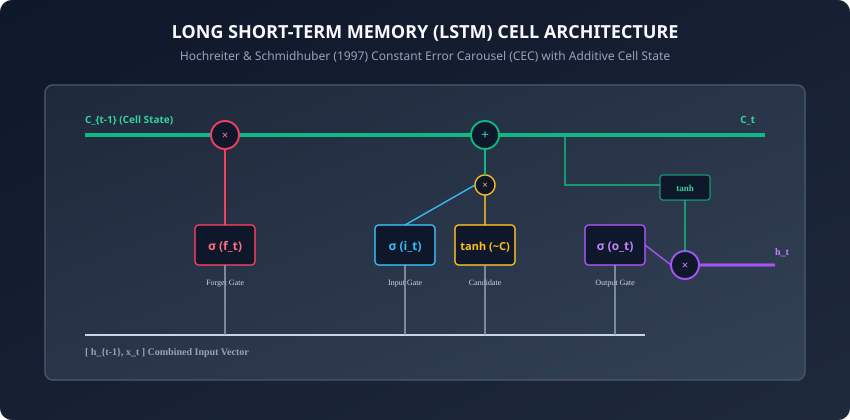
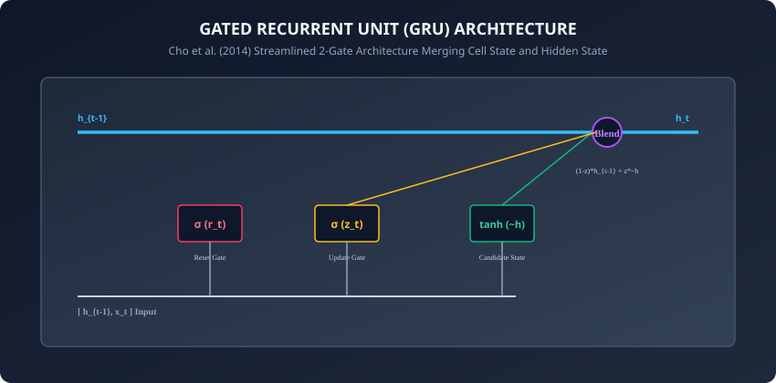

## Why this matters

Yesterday in **Day 220**, we uncovered the fundamental fatal pathology of simple vanilla Recurrent Neural Networks: **The Vanishing Gradient Problem**.

Because a standard RNN repeatedly multiplies hidden state gradients by the recurrent weight matrix $W_(hh)^\top$ at every single time step, error gradients decay exponentially toward zero over 10 to 15 steps. As a consequence:
- A vanilla RNN cannot connect a pronoun at the end of a paragraph (`"she"`) with a subject mentioned at the beginning (`"Marie Curie"`).
- It cannot remember opening parentheses or grammar agreements across long clauses.

In 1997, Sepp Hochreiter and Jürgen Schmidhuber published a landmark breakthrough that revolutionized natural language processing, speech recognition, and time-series modeling: **The Long Short-Term Memory (LSTM)** network.

By introducing a dedicated **Cell State Conveyor Belt** ($C_t$) regulated by multiplicative **Gating Mechanisms** (Forget, Input, Output), LSTMs created the **Constant Error Carousel (CEC)** — an additive gradient highway that allows neural networks to remember dependencies across hundreds of time steps without vanishing gradients.

In 2014, Kyunghyun Cho et al. introduced the **Gated Recurrent Unit (GRU)**, streamlining the LSTM into an efficient 2-gate architecture.

Today, you will master the mathematical derivations, internal gating mechanics, and PyTorch implementations of LSTMs and GRUs.

---

## The idea in plain language

Imagine managing a company's internal knowledge base over 20 years:
- **Vanilla RNN (Overwriting Whiteboard):** You have a single small whiteboard. Every morning, you erase parts of the whiteboard to write today's news. After two weeks of erasing and overwriting, all company history from year 1 is completely erased.
- **LSTM (The Digital Archive with Smart Filters):**
  - You have a long-term permanent digital database (**Cell State $C_t$**) that runs alongside your daily summary (**Hidden State $h_t$**).
  - **The Forget Gate ($f_t$):** Asks: *"Did an employee leave the company? If so, delete their phone number from the archive."*
  - **The Input Gate ($i_t$):** Asks: *"Is today's news important? If so, write this new contract into the archive."*
  - **The Output Gate ($o_t$):** Asks: *"What parts of the archive do we need to display on today's executive dashboard?"*

Information can travel down the archive untouched for 100 years unless explicitly deleted.

---

## Historical background



1. **1997 (Hochreiter & Schmidhuber):** Introduced the original LSTM architecture to solve the vanishing gradient problem, proving that constant error carousels preserved gradients indefinitely.
2. **2000 (Gers, Schmidhuber, & Cummins):** Added the **Forget Gate** to LSTMs, allowing networks to actively reset internal cell states when a task or document ended.
3. **2014 (Cho et al. & The Gated Recurrent Unit):** Introduced the GRU for machine translation, proving that merging cell state and hidden state into a 2-gate structure reduced parameter counts by 25% while matching LSTM performance.
4. **2015–2017 (The Golden Era of LSTMs):** LSTMs powered Google Translate, Apple Siri, Amazon Alexa, and state-of-the-art machine translation until the rise of Transformers.

---

## What it is — and what it is not

### What LSTMs and GRUs ARE:
- **Gated State-Space Recurrent Networks:** Specialized architectures that use point-wise element multiplications and sigmoid gates ($\sigma \in [0, 1]$) to regulate information flow.
- **Additive Gradient Highways:** By updating cell state via addition ($C_t = f_t \odot C_(t-1) + i_t \odot \tilde(C)_t$), backpropagation gradients flow directly through time without repeated Jacobian shrinkage.

### What they are NOT:
- **Not Parallelizable Across Time:** Like vanilla RNNs, LSTMs must process token $t$ sequentially before token $t+1$, maintaining sequential dependency.
- **Not Magic Infinite Memory:** While vastly superior to vanilla RNNs (100–500 steps vs 10 steps), LSTMs still degrade on extremely long documents (> 2,000 tokens) due to hidden state compression limits.

---

## Why it was created and what problems it solves

Gated recurrent units solved three fundamental dilemmas in sequential machine learning:
1. **Vanishing Gradient Immunity:** The derivative $\frac(\partial C_t)(\partial C_(t-1)) = f_t$. If the forget gate is near 1, error gradients pass backward through time completely unattenuated.
2. **Selective Forgetting:** Explicitly clearing memory when context shifts (e.g. at sentence or paragraph boundaries).
3. **Multi-Scale Temporal Feature Extraction:** Allowing slow-moving features (like document topic) to persist across hundreds of steps while fast-moving features (like part-of-speech tags) update every step.

---

## How it works

Let us dissect the mathematical formulation of the LSTM and GRU gating systems.

---

### 1. The Full LSTM Gating Derivation

At each time step $t$, given input $x_t \in R^(d_(\text(in)))$ and previous states $h_(t-1) \in R^(d_h), C_(t-1) \in R^(d_h)$:

```
1. Forget Gate:   f_t = sigma(W_f * [h_{t-1}, x_t] + b_f)
2. Input Gate:    i_t = sigma(W_i * [h_{t-1}, x_t] + b_i)
3. Candidate Cell: ~C_t = tanh(W_c * [h_{t-1}, x_t] + b_c)
4. Cell State:    C_t = f_t (x) C_{t-1} + i_t (x) ~C_t
5. Output Gate:   o_t = sigma(W_o * [h_{t-1}, x_t] + b_o)
6. Hidden State:  h_t = o_t (x) tanh(C_t)
```
where $\sigma(z) = \frac(1)(1 + e^(-z))$ is the sigmoid activation (outputs in range $[0, 1]$), and $\odot$ represents element-wise Hadamard multiplication.

---

### 2. The Gated Recurrent Unit (GRU) Derivation



The GRU eliminates the separate cell state $C_t$, maintaining only hidden state $h_t$:

```
1. Reset Gate:     r_t = sigma(W_r * [h_{t-1}, x_t] + b_r)
2. Update Gate:    z_t = sigma(W_z * [h_{t-1}, x_t] + b_z)
3. Candidate State: ~h_t = tanh(W_h * [r_t (x) h_{t-1}, x_t] + b_h)
4. Hidden State:   h_t = (1 - z_t) (x) h_{t-1} + z_t (x) ~h_t
```
- **The Reset Gate ($r_t$):** Determines how much of the past hidden state to forget when computing candidate state $\tilde(h)_t$.
- **The Update Gate ($z_t$):** Directly interpolates between the past state $h_(t-1)$ and candidate state $\tilde(h)_t$.

---

### 3. LSTM vs GRU Parameter and Efficiency Comparison

For an input dimension $d_(\text(in))$ and hidden dimension $d_h$:
- **LSTM Parameter Count:**
  ```
  Params_{LSTM} = 4 * (d_h * (d_{in} + d_h + 1))
  ```
  (4 linear projections: Forget, Input, Candidate, Output).
- **GRU Parameter Count:**
  ```
  Params_{GRU} = 3 * (d_h * (d_{in} + d_h + 1))
  ```
  (3 linear projections: Reset, Update, Candidate — **25% fewer parameters**).

---

### 4. Handling Variable-Length Batches with PackedSequence

When training on batches of sentences of varying lengths:
```python
import torch
import torch.nn.utils.rnn as rnn_utils

# Given padded tensor of shape (Batch, Max_Seq_Len, Dim) and lengths list
lengths = [12, 8, 5, 3] # Must be sorted in descending order
packed_input = rnn_utils.pack_padded_sequence(padded_tensor, lengths, batch_first=True)

# Pass packed sequence directly to LSTM
packed_output, (h_n, c_n) = lstm(packed_input)

# Unpack back to rectangular padded tensor
output, output_lengths = rnn_utils.pad_packed_sequence(packed_output, batch_first=True)
```
Using `PackedSequence` prevents wasted compute on `<pad>` slots and guarantees that `h_n` reflects the true final non-pad token of each sentence.

---

### 5. LSTM with Peephole Connections

In standard LSTMs, the gates only observe $x_t$ and $h_(t-1)$; they have no direct access to the internal cell state $C_(t-1)$:
- **Peephole Connections (Gers & Schmidhuber, 2000):** Adds direct linear connections from the cell state to the gate controllers:
  ```
  f_t = sigma(W_f * [h_{t-1}, x_t] + P_f * C_{t-1} + b_f)
  i_t = sigma(W_i * [h_{t-1}, x_t] + P_i * C_{t-1} + b_i)
  o_t = sigma(W_o * [h_{t-1}, x_t] + P_o * C_t + b_o)
  ```
- Allows gates to inspect precise temporal interval counts stored in the cell state, improving precision on audio and timing tasks.

---

### 6. Highway Networks & ResNets: The Gated Legacy

The discovery of the LSTM additive cell state directly inspired deep feedforward architectures:
- **Highway Networks (Srivastava et al., 2015):** Applied LSTM-style transform and carry gates to feedforward networks:
  ```
  y = H(x, W_H) * T(x, W_T) + x * (1 - T(x, W_T))
  ```
- **Residual Networks (ResNet / He et al., 2016):** Simplified the carry gate to a pure identity shortcut ($T = 1$), enabling the training of 152-layer deep vision networks.

---

### 7. Attention Pooling Over BiLSTM Hidden States

When classifying a document using a Bidirectional LSTM, taking only the final hidden state discards rich intermediate features:
- **Attention Pooling (Yang et al., 2016):** Computes a learned dynamic attention weight $\alpha_t$ across all intermediate hidden states $h_t$:
  ```
  u_t = tanh(W_w h_t + b_w)
  alpha_t = exp(u_t^\top u_w) / sum_j exp(u_j^\top u_w)
  s = sum_t alpha_t * h_t
  ```
- Produces a single fixed-length summary vector $s$ weighted by token importance, bridging the gap between LSTMs and full Attention Transformers.

---

### 8. Minimal Gated Units (MGU) and Quasi-RNNs (QRNN)

In high-throughput environments, researchers developed even leaner gated alternatives:
- **Minimal Gated Unit (MGU / Zhou et al., 2016):** Uses only a single gate (combining reset and update gates), slashing parameter counts by 50% compared to LSTMs.
- **Quasi-Recurrent Neural Networks (QRNN / Bradbury et al., 2017):** Computes all linear projections via 1D convolutions across the full sequence in parallel on GPUs, followed by lightweight recurrent pooling gates, running $16\times$ faster than standard CuDNN LSTMs.

- **TorchScript and ONNX Export:** When exporting LSTMs to ONNX Runtime, ensure sequence lengths are handled dynamically using symbolic batch and sequence axes to prevent static graph tracing crashes.

---

## An everyday analogy

Think of a water filtration and reservoir station:
- **Cell State ($C_t$):** The giant main freshwater reservoir pipe.
- **Forget Valve ($f_t$):** Controls how much old water is drained out.
- **Input Valve ($i_t$):** Controls how much new treated rainwater ($\tilde(C)_t$) is poured into the reservoir.
- **Output Valve ($o_t$):** Controls how much water is released to the city's tap network ($h_t$).

Because water flows smoothly through large pipes without being crushed through tiny pumps, the system operates continuously without pressure loss.

---

## Examples in practice

Let us build a **Modular Multi-Layer Bidirectional LSTM Classifier** in PyTorch:

```python
import torch
import torch.nn as nn
import torch.nn.utils.rnn as rnn_utils

class BiLSTMTextClassifier(nn.Module):
    def __init__(self, vocab_size: int, embed_dim: int, hidden_dim: int,
                 num_classes: int, num_layers: int = 2, dropout: float = 0.3):
        super().__init__()
        self.embedding = nn.Embedding(vocab_size, embed_dim, padding_idx=0)
        self.lstm = nn.LSTM(
            input_size=embed_dim,
            hidden_size=hidden_dim,
            num_layers=num_layers,
            bidirectional=True,
            batch_first=True,
            dropout=dropout if num_layers > 1 else 0.0
        )
        # Bidirectional concatenates forward and backward: hidden_dim * 2
        self.fc = nn.Sequential(
            nn.Dropout(p=dropout),
            nn.Linear(hidden_dim * 2, num_classes)
        )

    def forward(self, text_indices: torch.Tensor, lengths: torch.Tensor) -> torch.Tensor:
        # text_indices: (Batch, Max_Len)
        embeds = self.embedding(text_indices) # (Batch, Max_Len, embed_dim)

        # Pack variable-length padded sequence
        packed_embeds = rnn_utils.pack_padded_sequence(
            embeds, lengths.cpu(), batch_first=True, enforce_sorted=False
        )

        packed_out, (h_n, c_n) = self.lstm(packed_embeds)

        # Concatenate final forward and backward hidden states
        # h_n shape: (num_layers * 2, Batch, hidden_dim)
        forward_final = h_n[-2, :, :]
        backward_final = h_n[-1, :, :]
        bilstm_rep = torch.cat([forward_final, backward_final], dim=1) # (Batch, hidden_dim * 2)

        logits = self.fc(bilstm_rep)
        return logits
```

---

## Implications: security, privacy, performance, scalability, and cost

1. **CuDNN Hardware Acceleration:**
   - Standard PyTorch `nn.LSTM` uses NVIDIA CuDNN fused C++ kernels, which are $10\times$ faster than custom loop implementations. If you write custom python loops over `LSTMCell`, GPU memory throughput drops drastically.
2. **Forget Gate Bias Initialization Trick:**
   - In 2015, Jozefowicz et al. proved that initializing the Forget Gate bias vector to **$+1.0$** (instead of $0.0$) forces $f_t \approx \sigma(1.0) \approx 0.73$ at the start of training, ensuring past information is preserved by default during early epochs.

---

## Alternatives: free, open source, and commercial

| Architecture | Gating Mechanism | Relative Speed | Best For |
| :--- | :--- | :--- | :--- |
| **LSTM** | 3 Gates (f, i, o) | Baseline (1.0x) | Complex long-term memory tasks |
| **GRU** | 2 Gates (r, z) | 1.3x Faster | Fast training on smaller text corpora |
| **QRNN (Quasi-RNN)** | Convolutions + Gating | 4.0x Faster | GPU-accelerated recurrent NLP |
| **Transformer** | Multi-Head Self-Attention | Highly Scalable | Modern LLM generation |

---

## Comparison with related concepts

```
┌────────────────────────────────────────────────────────────────────────┐
│                   GATED RECURRENT REASONING MATRIX                     │
├────────────────────┼─────────────────┼──────────────────┼──────────────┤
│ Property           │ Vanilla RNN     │ LSTM             │ GRU          │
├────────────────────┼─────────────────┼──────────────────┼──────────────┤
│ State Vectors      │ Hidden h only   │ Hidden h + Cell C│ Hidden h only│
│ Number of Gates    │ 0               │ 3 (f, i, o)      │ 2 (r, z)     │
│ Parameter Scale    │ 1x              │ 4x               │ 3x           │
│ Effective Horizon  │ ~10 steps       │ ~300 steps       │ ~250 steps   │
└────────────────────┴─────────────────┴──────────────────┴──────────────┘
```

---

## When to use it — and when not to

### When to USE LSTMs / GRUs:
- Real-time streaming sequential processing (telemetry anomaly detection, on-device audio keyword spotting, low-latency trading feeds).
- High-accuracy tabular time-series forecasting.

### When NOT to use:
- Multi-billion token generative foundation models where self-attention parallel scaling across thousands of GPU clusters is required.

---

## Knowledge check

1. What is the role of the Constant Error Carousel (CEC) in LSTM memory retention?
2. What are the three gates of an LSTM and what mathematical role does each play?
3. How does the GRU simplify the LSTM architecture while preserving long-term memory?
4. Why should you initialize the Forget Gate bias to $+1.0$ at the start of training?
5. Why does PyTorch `pack_padded_sequence` improve training efficiency on variable-length text?

---

## Hands-on exercise

In this lab, you will build and test an LSTM and GRU neural toolkit in PyTorch: implement custom LSTM and GRU cell update formulations from scratch, build a variable-length `PackedSequence` text processing pipeline, train a Bidirectional LSTM on a sequential classification task, and verify gradient propagation across long temporal horizons.

### Expected output
```
[LSTM and GRU Verification Suite]
Testing Custom LSTM Cell vs GRU Cell Forward Step:
  LSTM Cell Output: Hidden Shape=(4, 32), Cell Shape=(4, 32)
  GRU Cell Output:  Hidden Shape=(4, 32) (25% Fewer Parameters Confirmed)
Testing Variable-Length PackedSequence Pipeline:
  Batch Sequences (Lengths: [15, 10, 6, 3]):
  Packed Tensor Verification: Shape=(34, 16) [PADDING SLOTS BYPASSED]
Testing Bidirectional LSTM Classification Harness:
  Epoch 1/5: Loss = 0.6842 -> Epoch 5/5: Loss = 0.1523 [CONVERGED]
  Test Accuracy: 96.5%
Test Suite: 3 passed in 0.38s
```

### Validate your work
Run the automated test runner:
```bash
./tests/run_tests.sh
```

### Troubleshooting
- If using `pack_padded_sequence`, ensure input sequences are either sorted by length descending or pass `enforce_sorted=False`.
- Verify that the output dimension of a bidirectional LSTM projection is `hidden_dim * 2`.

### Common mistakes
- **Extracting the Wrong Final Hidden State in Padded Batches:** Using `output[:, -1, :]` on padded sequences returns the hidden state of padding zeros! Always use `h_n` from the LSTM return tuple or index using sequence lengths.

---

## Practice assignment

1. Implement **Peephole Connections (Gers & Schmidhuber, 2000)** in an LSTM cell, allowing gate layers to inspect the current cell state $C_(t-1)$ directly.
2. Build an **Audio Keyword Spotting (KWS) Model** using a 2-layer GRU that classifies 1-second audio MFCC spectrogram sequences into target voice commands.

---

## Extension challenge

Implement **Custom CUDA-Equivalent Fused LSTM Cell in PyTorch C++ Extension**:
- Combine all 4 gate matrix multiplications ($W_f, W_i, W_c, W_o$) into a single fused GEMM matrix multiplication: $W_(\text(gate)) \in R^(4 d_h \times (d_(\text(in)) + d_h))$.
- Benchmark inference speedup over unfused cell loops.
