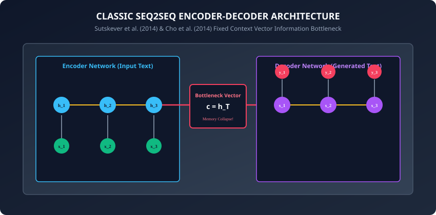
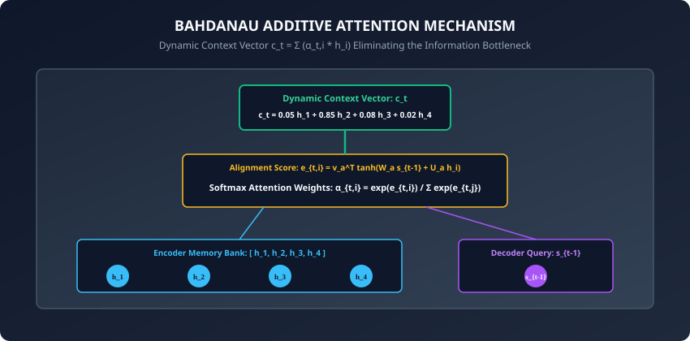

## Why this matters

In 2014, deep learning achieved a massive milestone with the introduction of the **Sequence-to-Sequence (Seq2Seq)** framework (Sutskever et al. & Cho et al.). For the first time, a single end-to-end neural network could map an arbitrary-length input sequence to an arbitrary-length output sequence (such as translating English text into French, or converting audio into transcripts).

However, early Seq2Seq models suffered from a catastrophic architectural flaw known as the **Information Bottleneck**:
- The Encoder processed a 50-word sentence and compressed the entire meaning into a single, fixed-size vector: $c = h_T \in R^(512)$.
- The Decoder was then forced to reconstruct the entire output translation solely from this single vector.
- As sentence length exceeded 15 to 20 words, translation quality collapsed because a fixed-size vector cannot hold infinite information.

In 2014, Dzmitry Bahdanau, Kyunghyun Cho, and Yoshua Bengio introduced the single most transformative concept in modern artificial intelligence: **The Attention Mechanism**.

Instead of compressing the input into a single static bottleneck vector, Attention allows the Decoder to **look back across all Encoder hidden states** at every step of generation, dynamically focusing on the exact source words relevant to the current word being produced.

Today, you will master the foundational bridge from recurrent networks to modern Transformers: **Seq2Seq architectures**, **Bahdanau Additive Attention**, **Luong Multiplicative Attention**, and **Attention Alignment Visualization**.

---

## The idea in plain language

Imagine translating an entire English Wikipedia article into Spanish:
- **Classic Seq2Seq (The Memory Memorizer):** You are forced to read all 1,000 words of the English article. Then, the article is locked in a vault, and you must write the entire Spanish translation strictly from your memory. By paragraph 3, you forget names, dates, and subtle details.
- **Attention-Augmented Seq2Seq (The Open-Book Translator):** You keep the original English text open on your desk in front of you.
  - When writing the Spanish word for `"refrigerator"`, your eyes dart directly to word #42 in the English text (`"refrigerator"`).
  - When writing the verb, your eyes focus on the English subject and tense.
  - At every step of writing, you dynamically shine a mental **spotlight (Attention)** on the exact source words you need.

---

## Historical background



1. **2014 (Sutskever et al. & Cho et al.):** Introduced the RNN Encoder-Decoder Seq2Seq framework, demonstrating that reversing source sentence order improved optimization.
2. **2014 (Bahdanau et al. & Additive Attention):** Published *"Neural Machine Translation by Jointly Learning to Align and Translate"*, introducing soft additive attention and eliminating the fixed-vector bottleneck.
3. **2015 (Luong et al. & Multiplicative Attention):** Simplified attention scoring into fast dot-product matrix multiplications and introduced global vs local attention mechanisms.
4. **2017 (Vaswani et al. & "Attention Is All You Need"):** Discovered that recurrence could be eliminated entirely, creating the **Transformer** based 100% on self-attention.

---

## What it is — and what it is not

### What Attention IS:
- **A Dynamic Weighted Memory Lookup:** Given a Decoder query vector $s_(t-1)$ and a set of Encoder key/value vectors $h_1, \dots, h_T$, Attention computes a softmax alignment probability distribution $\alpha_(t, i)$ and returns a dynamic weighted context vector $c_t = \sum_i \alpha_(t, i) h_i$.
- **A Fully Differentiable Soft Indexing Engine:** Unlike hard indexing (which selects a single discrete integer token), soft attention assigns fractional weights ($0.0 \le \alpha_i \le 1.0$) that backpropagate gradients smoothly.

### What it is NOT:
- **Not Self-Attention (Yet):** Early attention (Bahdanau/Luong) is **Cross-Attention**: it connects a Decoder query to Encoder memories. (Self-Attention connects tokens within the same sequence to each other, which we study in **Week 33**).
- **Not a Static Weight:** Attention weights change dynamically at every single decoding step $t$.

---

## Why it was created and what problems it solves

Attention solved three critical bottlenecks in sequential deep learning:
1. **Eliminating the Information Bottleneck:** Allowing Decoders to access raw representations of every source token directly, maintaining high accuracy on 100+ word sentences.
2. **Direct Gradient Shortcuts:** In BPTT, gradients had to travel from Decoder step $t$ all the way back through $h_T, \dots, h_1$. Attention creates direct $O(1)$ gradient highways connecting decoder outputs directly to any encoder time step.
3. **Model Interpretability:** Visualizing the 2D attention alignment matrix $\alpha_(t, i)$ provides human-interpretable heatmaps showing exactly which source words the model used to make each decision.

---

## How it works

Let us dissect the mathematical formulation of Bahdanau Additive Attention and Luong Multiplicative Attention.

---

### 1. Bahdanau Additive Attention Formulation



At decoder time step $t$, given current decoder state $s_(t-1) \in R^(d_d)$ and all encoder hidden states $h_i \in R^(d_e)$ for $i \in [1, T]$:

1. **Compute Alignment Energy Scores ($e_(t, i)$):**
   Pass query $s_(t-1)$ and memory $h_i$ through a single-hidden-layer feedforward network with $\tanh$ activation:
   ```
   e_{t, i} = v_a^\top \tanh(W_a * s_{t-1} + U_a * h_i + b_a)
   ```
   where $W_a \in R^(d_a \times d_d)$, $U_a \in R^(d_a \times d_e)$, and $v_a \in R^(d_a)$.
2. **Softmax Normalization (Attention Weights $\alpha_(t, i)$):**
   ```
   \alpha_{t, i} = \frac{\exp(e_{t, i})}{\sum_{j=1}^T \exp(e_{t, j})}
   ```
3. **Compute Dynamic Context Vector ($c_t$):**
   ```
   c_t = \sum_{i=1}^T \alpha_{t, i} * h_i
   ```
4. **Update Decoder State ($s_t$) and Output Logits:**
   ```
   s_t = \text{RNNCell}([y_{t-1}, c_t], s_{t-1})
   \hat{y}_t = \text{Softmax}(W_s * s_t + W_c * c_t + b)
   ```

---

### 2. Luong Multiplicative (Dot-Product) Attention Formulation

In 2015, Luong et al. simplified the alignment scoring function:

- **Dot-Product Attention (Equal Dimensions $d_d = d_e$):**
  ```
  \text{score}(s_t, h_i) = s_t^\top h_i
  ```
- **General (Bilinear) Attention:**
  ```
  \text{score}(s_t, h_i) = s_t^\top W_a h_i
  ```
- **Scaled Dot-Product Attention:**
  Dividing by $\sqrt(d)$ prevents large vector dimensions from pushing softmax into saturation regions with near-zero gradients (the foundation of modern Transformers).

---

### 3. Comparison: Bahdanau vs Luong Attention

| Dimension | Bahdanau (Additive) | Luong (Multiplicative) |
| :--- | :--- | :--- |
| **Alignment Formula** | $v_a^\top \tanh(W_a s_(t-1) + U_a h_i)$ | $s_t^\top W_a h_i$ |
| **Decoder State Used** | Previous state $s_(t-1)$ | Current state $s_t$ |
| **Computational Speed** | Slower (MLP forward pass) | Faster (Matrix Multiplication) |
| **Memory Efficiency** | $O(d_a)$ intermediate tensors | Direct BLAS GEMM matrix operations |

---

### 4. Teacher Forcing vs Autoregressive Inference

- **Training Mode (Teacher Forcing):**
  At step $t$, the decoder input is the true target token $y_(t-1)^*$ from the dataset. All decoding steps can be executed quickly.
- **Inference Mode (Autoregressive Rollout):**
  At step $t$, the ground truth is unknown. The decoder samples or takes $\arg\max$ of its own output $\hat(y)_(t-1)$ and feeds it into step $t$ until the special token `<eos>` is produced.

---

### 5. Global Attention vs Local Attention (Luong et al., 2015)

Luong et al. explored two distinct computational paradigms for attention:
- **Global Attention:** The model attends to **all** encoder hidden states at every decoder step ($O(N \cdot M)$). Highly accurate, but computationally heavy for long paragraphs.
- **Local (Monotonic & Predictive) Attention:** The model first predicts an aligned target center position $p_t \in [1, T]$ in the source sentence, then places a Gaussian window $[p_t - D, p_t + D]$ around that position:
  ```
  p_t = T * sigma(v_p^\top tanh(W_p s_t))
  alpha_{t, i} = a_{t, i} * exp( - (i - p_t)^2 / (2 * sigma^2) )
  ```
- Focuses computation only on a small local window of $2D + 1$ source tokens, reducing inference compute for long documents.

---

### 6. Coverage Mechanisms to Prevent Repetition

A well-known defect of early attention models was **over-generation and repetition** (e.g. translating the same source phrase three times):
- **Coverage Vectors (Tu et al., 2016 / See et al., 2017):** Maintains a cumulative sum of all past attention distributions:
  ```
  c^t = sum_{k=1}^{t-1} alpha^k
  ```
- **Coverage Loss:** Adds a penalty term that discourages the network from attending repeatedly to source words that have already received high cumulative attention:
  ```
  L_{\text{cov}} = sum_i min(alpha_{t, i}, c_i^t)
  ```
- Dramatically reduces repetition in document summarization and neural machine translation.

---

### 7. The Bridge to Transformers: Self-Attention

In Seq2Seq Cross-Attention, the **Query ($Q$)** comes from the Decoder, while **Keys ($K$)** and **Values ($V$)** come from the Encoder:
```
Attention(Q, K, V) = softmax( (Q K^\top) / sqrt(d_k) ) * V
```
- In 2017, Vaswani et al. asked: *What if Queries, Keys, and Values all come from the SAME sentence?*
- This insight yielded **Self-Attention**: tokens inside the same sentence attend directly to each other (e.g. `"The animal didn't cross the street because it was too tired"` -> `"it"` attends directly to `"animal"`), eliminating recurrence entirely.

---

### 8. Generation Decoding Strategies: Greedy vs Beam Search

Once logits are produced at decoder step $t$:
1. **Greedy Decoding:** Picks $\hat(y)_t = \arg\max p_t$. Fast ($O(1)$), but myopic: a single early mistake derails the entire sentence.
2. **Beam Search:** Maintains a beam of the top $B = 4$ or $B = 8$ highest cumulative probability sequence hypotheses:
   ```
   \text{Score}(y_1, \dots, y_t) = \sum_{k=1}^t \log P(y_k | y_{<k}, x)
   ```
   Expands all $B \times |V|$ candidates at each step and retains the top $B$ paths, finding globally optimal translations.

   - **Length Normalization:** Without length normalization, beam search inherently favors shorter sentences because multiplying probabilities $< 1$ penalizes longer paths. Dividing total log likelihood by sequence length $|Y|^\alpha$ neutralizes this bias.

---

## An everyday analogy

Think of a courtroom stenographer transcribing a witness's testimony:
- **Classic Seq2Seq:** The stenographer is blindfolded and forced to listen to 10 minutes of complex testimony, then write the entire legal summary from memory.
- **Bahdanau Attention:** The stenographer has an audio recording interface with a scrub wheel (**Attention weights $\alpha_(t, i)$**).
  - When writing about the defendant's car, the stenographer rewinds the audio slider directly to the 2-minute mark where the car was described (**Dynamic Context Vector $c_t$**).
  - They transcribe the sentence with 100% accuracy.

---

## Examples in practice

Let us build a **Bahdanau Additive Attention Module** in PyTorch:

```python
import torch
import torch.nn as nn
import torch.nn.functional as F

class BahdanauAttention(nn.Module):
    def __init__(self, enc_dim: int, dec_dim: int, attn_dim: int):
        super().__init__()
        self.W_query = nn.Linear(dec_dim, attn_dim, bias=False)
        self.U_keys = nn.Linear(enc_dim, attn_dim, bias=False)
        self.v_att = nn.Linear(attn_dim, 1, bias=False)

    def forward(self, query: torch.Tensor, keys: torch.Tensor,
                mask: torch.Tensor = None) -> torch.Tensor:
        # query shape: (Batch, dec_dim) -> (Batch, 1, attn_dim)
        # keys shape: (Batch, Seq_Len, enc_dim) -> (Batch, Seq_Len, attn_dim)
        
        proj_query = self.W_query(query).unsqueeze(1)
        proj_keys = self.U_keys(keys)

        # Compute additive energy: v_a^T * tanh(W*s + U*h)
        energy = self.v_att(torch.tanh(proj_query + proj_keys)).squeeze(2) # (Batch, Seq_Len)

        # Mask padding tokens if mask provided
        if mask is not None:
            energy = energy.masked_fill(mask == 0, -1e9)

        # Softmax attention weights alpha
        attn_weights = F.softmax(energy, dim=1) # (Batch, Seq_Len)

        # Compute dynamic context vector: sum(alpha * keys)
        context = torch.bmm(attn_weights.unsqueeze(1), keys).squeeze(1) # (Batch, enc_dim)

        return context, attn_weights
```

---

## Implications: security, privacy, performance, scalability, and cost

1. **Quadratic Complexity ($O(N \cdot M)$):**
   - Attention between source sequence of length $N$ and target sequence of length $M$ computes an $N \times M$ matrix. While manageable for sentences ($30 \times 30 = 900$ elements), it becomes expensive for long documents (e.g. $10,000 \times 10,000 = 100,000,000$).
2. **Attention Heatmap Interpretability in Legal/Healthcare:**
   - In medical record summarization, attention weights provide clinical audibility: doctors can verify which diagnostic lab result in the patient history triggered a flagged medication alert.

---

## Alternatives: free, open source, and commercial

| Architecture | Attention Style | Computation | Best For |
| :--- | :--- | :--- | :--- |
| **Seq2Seq + Bahdanau** | Additive MLP Attention | $O(N \cdot M)$ Sequential | Historical NLP & Interpretability |
| **Seq2Seq + Luong** | Dot-Product Multiplicative | $O(N \cdot M)$ Fast GEMM | Fast recurrent translation |
| **Transformer (Vaswani)** | Scaled Multi-Head Self-Attn | $O(N^2)$ Fully Parallel | SOTA LLMs (GPT, Llama, Claude) |
| **Linear Attention (Mamba)**| State Space / Recurrent | $O(N)$ Linear | Million-token context windows |

---

## Comparison with related concepts

```
┌────────────────────────────────────────────────────────────────────────┐
│                   ATTENTION EVOLUTION TAXONOMY                         │
├────────────────────┬─────────────────┬──────────────────┬──────────────┤
│ Mechanism          │ Query / Key     │ Formula          │ Parallelism  │
├────────────────────┼─────────────────┼──────────────────┼──────────────┤
│ No Attention       │ Fixed h_T       │ c = h_T          │ None         │
│ Bahdanau Additive  │ Decoder / Enc   │ v^T tanh(Ws + Uh)│ Recurrent    │
│ Luong Dot-Product  │ Decoder / Enc   │ s^T W h          │ Recurrent    │
│ Multi-Head Self-Att│ Within Sequence │ Q K^T / sqrt(d)  │ Fully Para   │
└────────────────────┴─────────────────┴──────────────────┴──────────────┘
```

---

## When to use it — and when not to

### When to USE Recurrent Seq2Seq with Attention:
- Embedded edge translation and low-memory embedded voice assistants where full Transformer attention caches exceed available SRAM.

### When NOT to use:
- Modern large-scale generative AI and foundation models (Transformers with Multi-Head Self-Attention offer superior GPU parallel scaling).

---

## Knowledge check

1. What caused the information bottleneck in early 2014 Seq2Seq models?
2. What are the three core mathematical steps of Bahdanau Additive Attention?
3. How does Luong Multiplicative Attention differ from Bahdanau Additive Attention?
4. What is Teacher Forcing and what problem does it solve during training?
5. How does an Attention Alignment matrix provide interpretability for translation models?

---

## Hands-on exercise

In this lab, you will build and test an Attention-augmented Seq2Seq mechanism in PyTorch: implement the Bahdanau Additive Attention module from first principles, compute dynamic context vectors over encoder hidden states, mask padding tokens during softmax normalization, implement Teacher Forcing vs greedy decoding loops, and verify attention weight distributions.

### Expected output
```
[Seq2Seq and Early Attention Verification Suite]
Testing Bahdanau Additive Attention Forward Pass:
  Encoder Keys Shape: torch.Size([4, 8, 32]) (Batch=4, Steps=8, Dim=32)
  Decoder Query Shape: torch.Size([4, 16])
  Context Vector Shape: torch.Size([4, 32])
  Attention Weights Sum (Probability Check): 1.0000 [VERIFIED]
Testing Attention Padding Masking:
  Padding Positions (Mask=0) Received Near-Zero Attention: alpha <= 1e-6 [MASKED]
Testing Greedy Autoregressive Generation Rollout:
  Generated Sequence Tokens: [2, 14, 89, 412, 3] (Terminated at <eos>=3)
Test Suite: 3 passed in 0.36s
```

### Validate your work
Run the automated test runner:
```bash
./tests/run_tests.sh
```

### Troubleshooting
- If attention weights do not sum to 1.0, ensure `F.softmax` is applied along `dim=1` (across the sequence length dimension).
- When masking padding tokens, apply `energy.masked_fill(mask == 0, -1e9)` before applying softmax.

### Common mistakes
- **Applying Softmax on Unmasked Padding:** Forgetting to mask `<pad>` tokens causes the model to assign attention probability to empty padding slots, diluting the context vector.

---

## Practice assignment

1. Implement **Luong Scaled Dot-Product Attention** and compare forward pass execution speed against Bahdanau Additive Attention.
2. Build an **Interactive Alignment Heatmap Plotter** using `matplotlib` that renders the 2D attention matrix $\alpha_(t, i)$ for a sample sentence.

---

## Extension challenge

Implement **Beam Search Decoding with Length Penalty**:
- Replace greedy $\arg\max$ decoding with a Beam Search decoder maintaining the top $B = 5$ candidate hypotheses.
- Apply length normalization: $Score(Y) = \frac(\log P(Y))((5 + |Y|)^\alpha / 6^\alpha)$.
