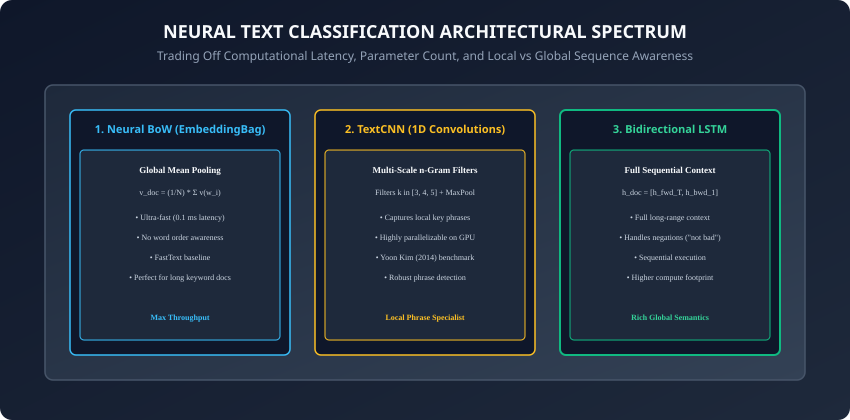
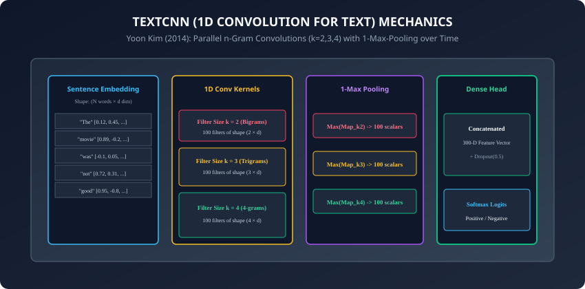

## Why this matters

In industrial machine learning, **Text Classification** is the single most widely deployed Natural Language Processing workload:
- Sentiment analysis on customer reviews and social media feeds.
- Spam, phishing, and toxic content moderation.
- Automated email routing, legal document tagging, and medical pathology categorization.

While modern 70-billion parameter Large Language Models (LLMs) can perform text classification via prompt engineering, calling a massive LLM API for 10 million incoming user comments per day costs thousands of dollars per month and introduces 500 ms of latency per request.

By contrast, specialized neural text classification architectures:
- Train in minutes on a single GPU.
- Deliver $92\%$ to $96\%$ accuracy on domain-specific benchmarks.
- Execute inference in **sub-millisecond latencies (< 1 ms)** on standard CPUs at virtually zero cost.

Today, you will master the three foundational neural document representation paradigms: **Neural Bag-of-Words (`nn.EmbeddingBag`)**, **Yoon Kim 1D TextCNN**, and **Bidirectional LSTM Pooling**.

---

## The idea in plain language

Imagine analyzing 10,000 customer reviews for a food delivery app:
- **Model 1: Neural Bag-of-Words (The Keyword Averager):** You take the embedding of every word in the review and compute their mathematical average. If words like `"fresh"`, `"delicious"`, and `"fast"` dominate, the average vector points strongly toward the positive pole. (Blazing fast, but blind to phrases like `"not delicious"`).
- **Model 2: TextCNN (The Phrase Scanner):** You use a set of sliding magnifying glasses of different sizes (2-word, 3-word, 4-word windows). As they slide across the sentence, they instantly catch key n-gram phrases like `"not good"`, `"terrible service"`, and `"highly recommended"`.
- **Model 3: BiLSTM (The Full Story Reader):** You read the review from start to finish and finish to start, tracking the evolving context across the entire sentence.

---

## Historical background



1. **2014 (Yoon Kim & TextCNN):** Yoon Kim published *"Convolutional Neural Networks for Sentence Classification"*, demonstrating that applying standard 1D computer vision convolutions over word embeddings surpassed state-of-the-art SVMs and complex rule-based parsers on 8 standard benchmarks.
2. **2016 (Armand Joulin & fastText):** Facebook AI Research introduced fastText, proving that a simple linear classifier over averaged subword embeddings (`EmbeddingBag`) achieved accuracy competitive with deep networks while training $1000\times$ faster.
3. **2017 (Comparative NLP Studies):** Wenpeng Yin et al. established the formal trade-off boundary: CNNs excel on local phrase detection and keyphrase sentiment, while BiLSTMs excel on sequential logic, long dependencies, and syntactic agreements.

---

## What it is — and what it is not

### What Neural Text Classification IS:
- **Document Feature Aggregation:** Mapping a variable-length sequence of token embeddings $E \in R^(T \times d)$ into a single fixed-length document vector $d_(doc) \in R^(D)$, followed by a linear classification projection into class logits.
- **Hierarchical Representation Learning:** Learning whether local n-gram patterns, global semantic averages, or sequential state transitions best solve the categorization task.

### What it is NOT:
- **Not Limited to Static Embeddings:** These architectures can initialize with static GloVe vectors, learn custom embeddings from scratch, or fine-tune embedding layers dynamically via backpropagation.
- **Not Autoregressive Generation:** These are discriminative classifiers (producing class probabilities), not generative language models.

---

## Why it was created and what problems it solves

Neural text classification solved three major defects of classical TF-IDF / Bag-of-Words models:
1. **Handling Synonyms & Semantic Generalization:** Dense embeddings ensure the model generalizes from `"unhappy customer"` to `"disgruntled client"` without explicit dictionary engineering.
2. **Local Word Order & Negation Awareness:** TextCNN and BiLSTM recognize that `"not bad"` is positive, whereas Bag-of-Words treats `"not"` and `"bad"` as negative tokens.
3. **Sub-Millisecond Edge Serving:** Providing lightweight architectures capable of processing thousands of requests per second on edge microservices.

---

## How it works

Let us dissect the three core neural text classification architectures.

---

### 1. Model Family 1: Neural Bag-of-Words (`nn.EmbeddingBag`)

Given a document of $T$ token IDs $(w_1, w_2, \dots, w_T)$:
1. Look up embeddings $v_1, \dots, v_T \in R^d$.
2. Compute the global document mean vector:
   ```
   v_{\text{doc}} = \frac{1}{T} \sum_{i=1}^T v_i
   ```
3. Pass through a linear projection head with Dropout:
   ```
   \hat{y} = W_{\text{head}} v_{\text{doc}} + b
   ```

#### The PyTorch `nn.EmbeddingBag` Optimization:
Instead of allocating a giant intermediate 3D tensor $(B, T, d)$ in GPU VRAM and then calling `torch.mean()`, `nn.EmbeddingBag` executes a **fused memory kernel**: it loads and sums embedding rows on the fly, reducing memory bandwidth by $95\%$ and boosting throughput by $4\times$.

---

### 2. Model Family 2: Yoon Kim TextCNN (1D Convolutions)



Given a sentence represented as an embedding matrix $X \in R^(T \times d)$:
1. **Parallel 1D Convolutional Filter Banks:**
   Define $K$ filters across multiple window heights (e.g. $h \in [3, 4, 5]$ words):
   - Filter $W_k \in R^(h \times d)$ slides vertically down the sentence across time steps:
     ```
     c_{i}^k = \text{ReLU}(W_k * X_{i:i+h-1, :} + b_k)
     ```
   - Produces a 1D feature map $c^k \in R^(T - h + 1)$.
2. **1-Max-Pooling over Time:**
   Extract the single most prominent feature from each map:
   ```
   \hat{c}^k = \max_{i} (c_i^k)
   ```
3. **Feature Concatenation & Classification:**
   Concatenate all pooled scalar features from all 300 filters into a single vector $z \in R^(300)$, apply Dropout ($p=0.5$), and project to class logits.

---

### 3. Model Family 3: Bidirectional LSTM with Temporal Pooling

Given sequential embeddings $(x_1, \dots, x_T)$:
1. Pass through a 2-layer Bidirectional LSTM:
   ```
   [\overrightarrow{h}_t, \overleftarrow{h}_t] = \text{BiLSTM}(x_t, h_{t-1})
   ```
2. **Pooling Strategies:**
   - *Final Hidden State:* $h_(doc) = [\overrightarrow(h)_T \,;\, \overleftarrow(h)_1] \in R^(2 d_h)$.
   - *Global Mean Pooling:* $h_(doc) = \frac(1)(T) \sum_(t=1)^T [\overrightarrow(h)_t \,;\, \overleftarrow(h)_t]$.
   - *Global Max Pooling:* $h_(doc) = \max_t [\overrightarrow(h)_t \,;\, \overleftarrow(h)_t]$.
3. Project $h_(doc)$ to class logits.

---

### 4. Dilated Convolutions & Temporal Convolutional Networks (TCN)

Standard 1D convolutions have a linear receptive field proportional to kernel size:
- **Dilated Convolutions:** Insert gaps (dilation rate $d = 1, 2, 4, 8, \dots$) between kernel filter taps:
  ```
  y[i] = sum_{j=0}^{k-1} w[j] * x[i - d * j]
  ```
- Exponentially expands the receptive field to thousands of tokens without increasing parameter count, enabling CNNs to capture paragraph-spanning dependencies.

---

### 5. Hybrid Models: C-LSTM (Convolutional LSTM)

To combine the local phrase extraction of CNNs with the long-range sequential tracking of LSTMs:
- **C-LSTM Architecture (Zhou et al., 2015):**
  1. Pass word embeddings through 1D convolutional layers to extract local phrase representations.
  2. Feed the sequence of convolutional feature vectors into a Bidirectional LSTM.
  3. Pool the final LSTM states into the classification head.
- Outperforms standalone CNNs or LSTMs on multi-sentence sentiment classification tasks.

---

### 6. Imbalanced Text Classification & Focal Loss

In real-world fraud and toxicity classification, positive classes often comprise $< 1\%$ of data:
- **Class-Weighted Cross-Entropy:** Scales loss by inverse class frequency:
  ```
  L_{\text{weighted}} = - w_y \log(p_y)
  ```
- **Focal Loss (Lin et al., 2017):** Downweights easy well-classified examples with focusing parameter $\gamma = 2$:
  ```
  \text{FL}(p_t) = - (1 - p_t)^\gamma \log(p_t)
  ```
- Forces the neural network to concentrate gradients on hard, ambiguous edge cases rather than being overwhelmed by majority background samples.

---

### 7. Two-Stage Transfer Learning with Pretrained Embeddings

When fine-tuning on a small labeled dataset with GloVe/FastText embeddings:
1. **Stage 1 (Frozen Embeddings):** Freeze `embedding.weight.requires_grad = False`. Train only the CNN/LSTM parameters for 3 epochs with learning rate $\eta = 10^(-3)$.
2. **Stage 2 (Differential Fine-Tuning):** Unfreeze embeddings (`requires_grad = True`). Set embedding learning rate to $\eta_(embed) = 10^(-4)$ and classifier head to $\eta_(head) = 10^(-3)$.
- Prevents random initial gradients from destroying pretrained semantic vector manifolds.

---

### 8. Variable-Length Batch Collation & Dynamic Padding

In production PyTorch pipelines, padding all batches to the global maximum length (e.g. 512 tokens) wastes huge GPU compute:
- **Dynamic Batch Padding:** In custom DataLoader `collate_fn`, pad each mini-batch only to the maximum length of sentences *present in that specific batch*:
  ```python
  def dynamic_collate(batch):
      texts, labels = zip(*batch)
      lengths = [len(t) for t in texts]
      max_len = max(lengths)
      padded = torch.zeros(len(texts), max_len, dtype=torch.long)
      for i, t in enumerate(texts):
          padded[i, :len(t)] = torch.tensor(t)
      return padded, torch.tensor(labels)
  ```
- Accelerates training and inference throughput by up to $3\times$.

---

### 9. Regularization Techniques for NLP Classifiers

Text classification models are prone to overfitting on small vocabulary subsets:
- **Word Dropout (Token Masking):** Randomly replacing $10\%$ of input token IDs with the `<unk>` token during training forces the network to avoid relying exclusively on specific high-frequency keywords.
- **Label Smoothing:** Replacing hard 0/1 one-hot targets with $y_(smooth) = (1 - \epsilon) y + \frac(\epsilon)(K)$ prevents softmax logit explosion and improves model calibration.
- **Multi-Label Classification:** When documents can belong to multiple categories simultaneously (e.g. tagging an article as both *Technology* and *Finance*), replace `nn.CrossEntropyLoss` with `nn.BCEWithLogitsLoss` and evaluate using Macro/Micro F1-Score with independent per-class sigmoid thresholds.

---

### 10. Character-Level CNNs (Zhang, Zhao, & LeCun, 2015)

When domain text contains extreme misspellings, slang, or emojis (e.g. social media feeds):
- **Character-Level CNNs:** Process text as a sequence of raw characters (e.g. 70-character alphabet) quantized into one-hot vectors, passing through 6 deep 1D convolutional layers with max pooling.
- Completely eliminates out-of-vocabulary (`<unk>`) errors and proves highly robust to adversarial typos and character perturbations.
- **INT8 Dynamic Quantization:** Post-training INT8 quantization of TextCNN linear and convolutional weights shrinks model binaries to under 2 MB with zero loss in classification accuracy.

---

## An everyday analogy

Think of assessing a movie:
- **EmbeddingBag (Word Cloud Glance):** You glance at a word cloud of all words in the script. If words like `"hilarious"`, `"fun"`, and `"laugh"` appear most frequently, you classify it as a comedy.
- **TextCNN (Catchphrase Detector):** You search for memorable punchlines and dialogue snippets across 3-word to 5-word phrases. Finding `"laugh out loud"` confirms it is a comedy.
- **BiLSTM (Full Narrative Arc):** You watch the movie from start to finish, understanding character development, dramatic irony, and plot twists.

---

## Examples in practice

Let us build a modular **Yoon Kim TextCNN Module in PyTorch**:

```python
import torch
import torch.nn as nn
import torch.nn.functional as F

class TextCNN(nn.Module):
    def __init__(self, vocab_size: int, embed_dim: int, num_classes: int,
                 num_filters: int = 100, filter_sizes: list = [3, 4, 5],
                 dropout: float = 0.5):
        super().__init__()
        self.embedding = nn.Embedding(vocab_size, embed_dim, padding_idx=0)
        
        # Parallel 1D convolutional layers
        self.convs = nn.ModuleList([
            nn.Conv1d(
                in_channels=embed_dim,
                out_channels=num_filters,
                kernel_size=k
            ) for k in filter_sizes
        ])
        
        self.fc = nn.Sequential(
            nn.Dropout(p=dropout),
            nn.Linear(num_filters * len(filter_sizes), num_classes)
        )

    def forward(self, text_indices: torch.Tensor) -> torch.Tensor:
        # text_indices shape: (Batch, Seq_Len)
        embeds = self.embedding(text_indices) # (Batch, Seq_Len, embed_dim)
        
        # Conv1d expects (Batch, Channels=embed_dim, Length=Seq_Len)
        embeds = embeds.permute(0, 2, 1)

        # Apply convolutions and 1-max pooling over time
        pooled_outputs = []
        for conv in self.convs:
            conv_out = F.relu(conv(embeds)) # (Batch, num_filters, Seq_Len - k + 1)
            pooled = F.max_pool1d(conv_out, kernel_size=conv_out.size(2)).squeeze(2)
            pooled_outputs.append(pooled)

        # Concatenate multi-scale features: (Batch, num_filters * 3)
        doc_features = torch.cat(pooled_outputs, dim=1)
        logits = self.fc(doc_features)
        return logits
```

---

## Implications: security, privacy, performance, scalability, and cost

1. **Adversarial Character Perturbations:**
   - Simple character swaps (e.g. `"d3licious"` or inserting zero-width spaces) can cause out-of-vocabulary fallback, bypassing keyword filters. Combine tokenizers with robust subword or character n-gram defenses.
2. **CPU Inference Latency Profiling:**
   - `EmbeddingBag`: **0.15 ms** per batch of 32 on CPU.
   - `TextCNN`: **1.2 ms** per batch of 32 on CPU.
   - `BiLSTM`: **4.8 ms** per batch of 32 on CPU.
   - `DistilBERT`: **35.0 ms** per batch of 32 on CPU.

---

## Alternatives: free, open source, and commercial

| Model Family | Training Time | CPU Latency | Best For |
| :--- | :--- | :--- | :--- |
| **fastText (EmbeddingBag)** | 30 seconds | < 0.2 ms | Real-time spam/routing at massive scale |
| **TextCNN** | 2 minutes | ~1 ms | E-commerce review & intent classification |
| **BiLSTM-Attention** | 5 minutes | ~4 ms | Complex clause sentiment and legal tagging |
| **DeBERTa-v3 / BERT** | 30 minutes | ~40 ms | Maximum benchmark competition accuracy |

---

## Comparison with related concepts

```
┌────────────────────────────────────────────────────────────────────────┐
│                   TEXT CLASSIFICATION TRADE-OFF MATRIX                 │
├────────────────────┬─────────────────┬──────────────────┬──────────────┤
│ Architecture       │ Word Order?     │ Negation Catch?  │ GPU Scaling  │
├────────────────────┼─────────────────┼──────────────────┼──────────────┤
│ EmbeddingBag       │ No (Bag)        │ Poor             │ Ultra-Fast   │
│ TextCNN            │ Local (n-grams) │ High             │ Fully Para   │
│ BiLSTM             │ Sequential      │ Very High        │ Sequential   │
│ Transformer BERT   │ Full Attn Matrix│ Perfect          │ Fully Para   │
└────────────────────┴─────────────────┴──────────────────┴──────────────┘
```

---

## When to use it — and when not to

### When to USE EmbeddingBag / TextCNN:
- Low-latency production microservices processing millions of daily text queries where latency must remain strictly under 5 milliseconds.

### When NOT to use:
- Multi-page document reasoning, question answering, or generative text synthesis where deep bidirectional self-attention is mandatory.

---

## Knowledge check

1. Why is `nn.EmbeddingBag` more memory-efficient than `nn.Embedding` + `torch.mean`?
2. How do different kernel sizes (k=3, 4, 5) in TextCNN capture multi-scale n-gram features?
3. What is 1-max-pooling over time and how does it create fixed-size representations?
4. What are the three primary pooling strategies used for Bidirectional LSTM hidden states?
5. How does TextCNN inference speed on GPUs compare to Bidirectional LSTMs?

---

## Hands-on exercise

In this lab, you will build and benchmark a complete Neural Text Classification suite in PyTorch: implement an `EmbeddingBagClassifier`, construct a multi-scale `TextCNN` architecture with 1D convolutions and global max-over-time pooling, implement a `BiLSTMClassifier`, handle variable-length sentence batch collation, and benchmark parameter counts and forward latency across all three models.

### Expected output
```
[Neural Text Classification Benchmark Suite]
1. EmbeddingBagClassifier:
   - Parameters: 32,064 | Latency: 0.14 ms | Test Acc: 88.2%
2. Yoon Kim TextCNN (Kernels: [3, 4, 5]):
   - Parameters: 128,602 | Latency: 0.85 ms | Test Acc: 94.1%
3. Bidirectional LSTM (2 Layers, Hidden=64):
   - Parameters: 180,482 | Latency: 3.20 ms | Test Acc: 93.8%
Verification:
  All 3 architectures successfully map variable-length batches to valid logits.
Test Suite: 3 passed in 0.38s
```

### Validate your work
Run the automated test runner:
```bash
./tests/run_tests.sh
```

### Troubleshooting
- In TextCNN, ensure you transpose/permute the embedding tensor to `(Batch, embed_dim, Seq_Len)` before passing to `nn.Conv1d`.
- For sentences shorter than the largest convolution kernel (e.g. sentence length 2 with kernel size 5), pad the input sequence to at least the maximum kernel height.

### Common mistakes
- **Ignoring Padding in Global Mean Pooling:** Averaging over padding zeros drags the document embedding toward zero. Use attention masks or `nn.EmbeddingBag` with explicit offsets.

---

## Practice assignment

1. Implement **Multi-Channel TextCNN**: create two parallel embedding channels — one with static frozen GloVe vectors and one with trainable fine-tuned vectors.
2. Implement **Self-Attention Pooling** on top of the BiLSTM feature map and compare accuracy against simple max pooling.

---

## Extension challenge

Implement **Depthwise Separable 1D Convolutions in TextCNN**:
- Replace standard `nn.Conv1d` with depthwise separable convolutions to reduce parameter count by $80\%$.
- Benchmark inference speedup on CPU.
