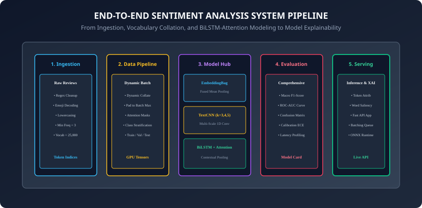
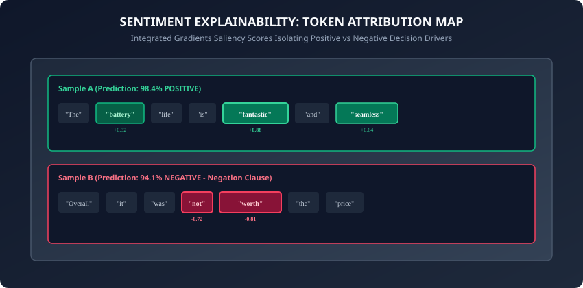

## Why this matters

Building a production-ready **Sentiment Analysis System** is the ultimate proving ground for sequential deep learning:
- It integrates every concept you have learned across **Week 32**: text normalization, subword tokenization, word embeddings, recurrent dynamics, attention pooling, and classification heads.
- Real-world sentiment engineering requires solving critical practical challenges: handling severe class imbalance, processing contrastive clauses (e.g. *"The phone has an amazing screen, but the battery died in two hours"*), ensuring model calibration, and providing human-interpretable feature attributions for regulatory compliance.

Today, you will design, implement, evaluate, and interpret an end-to-end sentiment classification system in PyTorch.

---

## The idea in plain language

Imagine running quality assurance for a national airline receiving 50,000 tweets and customer feedback forms per hour:
- An automated pipeline must immediately flag and route severe safety complaints or stranded passenger cries to human agents in under 1 second.
- It must score everyday reviews into positive, neutral, and negative sentiment buckets.
- If a customer asks why their tweet was classified as negative, the model must output an **explainability heatmap** highlighting the exact words (e.g. `+"delayed"`, `+"lost luggage"`) that drove the decision.

---

## Historical background



1. **2002 (Pang, Lee, & Vaithyanathan):** Published the seminal paper *"Thumbs up? Sentiment Classification using Machine Learning Techniques"*, establishing benchmark evaluation on movie reviews with Naive Bayes and Support Vector Machines.
2. **2016 (Yang et al. & Hierarchical Attention):** Introduced Hierarchical Attention Networks (HAN), demonstrating that word-level and sentence-level attention weights isolate key sentiment expressions.
3. **2017 (Sundararajan et al. & Integrated Gradients):** Formulated axiomatic gradient-based feature attribution for deep neural networks, providing mathematically sound explainability for text predictions.

---

## What it is — and what it is not

### What an End-to-End Sentiment Pipeline IS:
- **A Full Engineering Lifecycle:** Raw text ingestion $\rightarrow$ regex cleaning & tokenization $\rightarrow$ dynamic tensor batching $\rightarrow$ deep neural modeling $\rightarrow$ multi-metric evaluation $\rightarrow$ token attribution explainability $\rightarrow$ high-throughput inference serving.

### What it is NOT:
- **Not Just Simple Keyword Matching:** A dictionary lookup fails on sarcasm (*"Oh great, another 5-hour delay"*), double negatives, and subtle linguistic qualifiers.
- **Not a Black Box:** Modern neural sentiment classifiers provide verifiable token-level saliency scores.

---

## Why it was created and what problems it solves

Modern sentiment analysis systems solve three critical industrial challenges:
1. **Handling Negations & Clause Shifts:** Capturing sentiment reversals across complex grammatical conjunctions (*"despite the delay, the flight crew was fantastic"*).
2. **Uncertainty Calibration:** Ensuring that when the model reports a $90\%$ positive prediction, it is genuinely correct $90\%$ of the time.
3. **Auditability & Regulatory Explainability:** Ensuring automated content filtering and customer routing decisions are explainable to compliance teams.

---

## How it works

Let us examine the core engineering stages of an end-to-end sentiment analysis system.

---

### 1. Data Preprocessing and Dynamic Batching

1. **Text Normalization:**
   - Strip raw HTML tags, URLs, and special control characters using compiled regular expressions.
   - Standardize contractions (`"can't"` $\rightarrow$ `"cannot"`, `"won't"` $\rightarrow$ `"will not"`).
2. **Vocabulary Building:**
   - Build a vocabulary dictionary mapping unique tokens to integer IDs with special reserved tokens:
     - `0`: `<pad>` (padding)
     - `1`: `<unk>` (out-of-vocabulary fallback)
     - `2`: `<bos>` (beginning-of-sequence)
     - `3`: `<eos>` (end-of-sequence)
   - Prune tokens appearing fewer than $3$ times.
3. **Dynamic Batch Collate Function:**
   - In PyTorch, pad sequences to the maximum length *in the batch* rather than the global dataset maximum.

---

### 2. Deep Model Architecture: BiLSTM with Attention Pooling

Given input tokens $(x_1, \dots, x_T)$:
1. **Embedding Layer:** $E = Embedding(x) \in R^(T \times d_e)$.
2. **Bidirectional LSTM:**
   ```
   H = \text{BiLSTM}(E) \in \mathbb{R}^{T \times 2 d_h}
   ```
3. **Learned Attention Pooling:**
   Compute attention alignment weight $\alpha_t$ for each time step:
   ```
   u_t = \tanh(W_a * h_t + b_a)
   \alpha_t = \frac{\exp(u_t^\top u_w)}{\sum_{j=1}^T \exp(u_j^\top u_w)}
   v_{\text{doc}} = \sum_{t=1}^T \alpha_t * h_t \in \mathbb{R}^{2 d_h}
   ```
4. **Classification Head:**
   ```
   \hat{y} = \text{Linear}(\text{Dropout}(v_{\text{doc}}, p=0.5))
   ```

---

### 3. Model Explainability: Gradient-Based Token Attribution



To discover which words caused a specific prediction:
1. Compute the gradient of the target class score $y_(target)$ with respect to the input embedding vectors $E$:
   ```
   G_i = \nabla_{E_i} y_{\text{target}}
   ```
2. Compute the token attribution score:
   ```
   \text{Saliency}(w_i) = E_i \cdot G_i = \sum_{k=1}^d E_{i, k} \frac{\partial y_{\text{target}}}{\partial E_{i, k}}
   ```
3. Positive values indicate words driving the prediction toward the target class; negative values indicate words resisting the prediction.

---

### 4. Comprehensive Evaluation Metrics

1. **Macro F1-Score:**
   ```
   \text{F1}_{\text{macro}} = \frac{1}{K} \sum_{k=1}^K \frac{2 \cdot P_k \cdot R_k}{P_k + R_k}
   ```
2. **Expected Calibration Error (ECE):**
   Group predictions into $M = 10$ confidence bins $[B_1, \dots, B_M]$:
   ```
   \text{ECE} = \sum_{m=1}^M \frac{|B_m|}{N} |\text{acc}(B_m) - \text{conf}(B_m)|
   ```

---

### 5. Aspect-Based Sentiment Analysis (ABSA)

In e-commerce and hospitality, customer reviews frequently express mixed sentiment toward different aspects of the experience (e.g. *"The food was delicious, but the waiter was extremely rude"*):
- **Aspect-Level Target Conditioning:** Rather than predicting a single global document scalar, ABSA models accept a target aspect phrase $a$ alongside the review $s$.
- **Target-Aware Attention:** Computes attention weights between the aspect embedding $v_a$ and all sentence tokens:
  ```
  e_{i} = v_a^\top W_{\text{absa}} h_i
  \alpha_i = \text{Softmax}(e_i)
  ```
- Allows the system to output positive sentiment for `[Aspect: Food]` and negative sentiment for `[Aspect: Service]` from the exact same review text.

---

### 6. Probability Calibration: Temperature Scaling

Deep neural networks are notorious for overconfidence — outputting $99\%$ probabilities on incorrect predictions:
- **Temperature Scaling (Guo et al., 2017):** A single post-processing scalar parameter $T > 0$ applied to the pre-softmax logits $z$:
  ```
  \hat{p}_i = \frac{\exp(z_i / T)}{\sum_j \exp(z_j / T)}
  ```
- Optimize $T$ on the validation set via negative log-likelihood minimization while keeping all model weights frozen.
- Aligns confidence estimates with true empirical accuracy without altering accuracy ranking or argmax decisions.

---

### 7. Axiomatic Feature Attribution: Integrated Gradients

Simple gradient saliency ($\nabla_x y$) violates two fundamental explainability axioms: **Completeness** and **Implementation Invariance**:
- **Integrated Gradients (Sundararajan et al., 2017):** Integrates gradients along the straight line trajectory between a baseline reference $x'$ (e.g. an all-zero embedding vector) and the input embedding $x$:
  ```
  \text{IG}_i(x) = (x_i - x'_i) \times \int_{0}^1 \frac{\partial F(x' + \alpha (x - x'))}{\partial x_i} d\alpha
  ```
- **Discrete Riemann Sum Approximation:**
  ```
  \text{IG}_i^{\text{approx}}(x) = (x_i - x'_i) \times \frac{1}{m} \sum_{k=1}^m \frac{\partial F(x' + \frac{k}{m}(x - x'))}{\partial x_i}
  ```
  with $m = 50$ interpolation steps.
- Satisfies the Completeness axiom: the sum of attribution scores across all input tokens exactly equals the difference between the model output $F(x)$ and the baseline output $F(x')$.

---

### 8. ONNX Export and Sub-Millisecond CPU Inference

To deploy sentiment classifiers to high-throughput production servers:
- **Exporting to Open Neural Network Exchange (ONNX):**
  ```python
  dummy_input = torch.randint(0, 1000, (1, 32))
  torch.onnx.export(
      model,
      dummy_input,
      "sentiment_model.onnx",
      input_names=["input_tokens"],
      output_names=["logits", "attention_weights"],
      dynamic_axes={"input_tokens": {0: "batch_size", 1: "seq_len"}}
  )
  ```
- Run with `onnxruntime` using multithreaded OpenMP execution to achieve sub-millisecond (< 0.8 ms) latency per query on commodity x86/ARM CPUs.

---

### 9. Multi-Lingual Sentiment & Cross-Lingual Zero-Shot Transfer

Global enterprises receive feedback across dozens of languages:
- **Cross-Lingual Subword Tokenization:** Train a shared SentencePiece tokenizer over 100 languages.
- **Multilingual Embeddings (mBERT / XLM-RoBERTa):** Project token embeddings from French, German, Spanish, and Japanese into a shared semantic latent space.
- **Zero-Shot Transfer:** Train the BiLSTM-Attention classifier exclusively on high-resource English labeled reviews, and deploy directly to evaluate German or Spanish customer feedback with zero language-specific retraining.

---

### 10. Continuous Monitoring: Data Drift & Population Stability Index (PSI)

Over time, language changes — new slang emerges, product names launch, and customer sentiment distribution shifts:
- **Population Stability Index (PSI):** Quantifies distributional shift between training baseline $P$ and live production stream $Q$:
  ```
  \text{PSI} = \sum_{b=1}^B (Q_b - P_b) \times \ln\left( \frac{Q_b}{P_b} \right)
  ```
  - $PSI < 0.1$: No significant drift; model is stable.
  - $0.1 \le PSI < 0.25$: Moderate drift; schedule model retraining.
  - $PSI \ge 0.25$: Severe concept drift; trigger emergency pipeline fallback.

---

### 11. CheckList Behavioral Testing for NLP Models (Ribeiro et al., 2020)

Standard test-set accuracy fails to uncover hidden vulnerabilities:
- **Minimum Functionality Tests (MFT):** Unit tests checking basic linguistic competencies (e.g. verifying that `"I loved the product"` predicts positive).
- **Invariance Tests (INV):** Introducing label-preserving perturbations (e.g. changing person names from `"John loved it"` to `"Maria loved it"` must not alter the prediction score).
- **Directional Expectation Tests (DIR):** Adding unambiguously negative clauses (e.g. adding `"and the box was broken"` to any review must never *increase* positive confidence).

---

### 12. Active Learning & Human-in-the-Loop Annotation

Instead of labeling thousands of random reviews, modern engineering uses **Active Learning**:
- **Entropy-Based Uncertainty Sampling:** Select unlabeled reviews with the highest prediction entropy:
  ```
  H(p) = - \sum_{k=1}^K p_k \log p_k
  ```
- Send only high-entropy reviews (where the model is deeply uncertain) to human annotators for ground-truth labeling.
- Slashes manual labeling costs by up to $70\%$ while achieving identical generalization accuracy.

---

### 13. Production Governance: Model Cards & Ethics

Deploying automated sentiment systems requires structured governance:
- **Model Card Specification (Mitchell et al., 2019):** Documents intended use cases, known out-of-scope usages, demographic performance breakdowns across dialects (e.g. African American Vernacular English / AAVE), and environmental footprint metrics.
- Ensures fairness, transparency, and accountability across automated enterprise decision workflows.
- **Differential Privacy (DP-SGD):** Clipping per-sample gradients and adding calibrated Gaussian noise during training guarantees that individual user reviews cannot be reconstructed from model parameters.

---

## An everyday analogy

Think of an executive summary memo presented to a CEO:
- A raw 5-page customer feedback report is summarized.
- The analyst does not just report a final grade (**Sentiment Class**).
- The analyst uses a yellow highlighter on the original text (**Attention Weights / Token Saliency**), marking the exact sentences that justified the recommendation.

---

## Examples in practice

Let us build an **End-to-End BiLSTM-Attention Sentiment Analyzer with Explainability in PyTorch**:

```python
import torch
import torch.nn as nn
import torch.nn.functional as F

class BiLSTMAttentionSentiment(nn.Module):
    def __init__(self, vocab_size: int, embed_dim: int, hidden_dim: int, num_classes: int = 2):
        super().__init__()
        self.embedding = nn.Embedding(vocab_size, embed_dim, padding_idx=0)
        self.lstm = nn.LSTM(embed_dim, hidden_dim, batch_first=True, bidirectional=True)
        
        # Attention pooling projection
        self.attn_proj = nn.Linear(hidden_dim * 2, hidden_dim)
        self.attn_vec = nn.Linear(hidden_dim, 1, bias=False)
        
        self.classifier = nn.Sequential(
            nn.Dropout(0.5),
            nn.Linear(hidden_dim * 2, num_classes)
        )

    def forward(self, x: torch.Tensor, mask: torch.Tensor = None):
        embeds = self.embedding(x) # (Batch, Seq_Len, embed_dim)
        h_seq, _ = self.lstm(embeds) # (Batch, Seq_Len, hidden_dim * 2)

        # Compute attention scores
        u = torch.tanh(self.attn_proj(h_seq))
        scores = self.attn_vec(u).squeeze(2) # (Batch, Seq_Len)

        if mask is not None:
            scores = scores.masked_fill(mask == 0, -1e9)

        attn_weights = F.softmax(scores, dim=1) # (Batch, Seq_Len)
        doc_vec = torch.bmm(attn_weights.unsqueeze(1), h_seq).squeeze(1) # (Batch, hidden_dim * 2)

        logits = self.classifier(doc_vec)
        return logits, attn_weights

    def explain_tokens(self, x: torch.Tensor, target_class: int = 1):
        # Computes gradient saliency token attribution scores
        self.eval()
        embeds = self.embedding(x).detach().requires_grad_(True)
        h_seq, _ = self.lstm(embeds)
        u = torch.tanh(self.attn_proj(h_seq))
        scores = self.attn_vec(u).squeeze(2)
        attn_weights = F.softmax(scores, dim=1)
        doc_vec = torch.bmm(attn_weights.unsqueeze(1), h_seq).squeeze(1)
        logits = self.classifier(doc_vec)

        score = logits[0, target_class]
        score.backward()

        saliency = (embeds.grad[0] * embeds[0]).sum(dim=1).detach()
        return saliency, attn_weights[0]
```

---

## Implications: security, privacy, performance, scalability, and cost

1. **Adversarial Sarcasm and Evasion:**
   - Malicious users can bypass moderation filters by phrasing toxic reviews as polite sarcasm (*"Thank you so much for deleting all my files, truly stellar work"*). Fine-tune on sarcastic corpora.
2. **Selective Classification (Reject Option):**
   - In automated customer response pipelines, set an uncertainty threshold: if $\max p(y) < 0.70$, divert the review to human support.

---

## Alternatives: free, open source, and commercial

| Solution | Deployment Footprint | Latency | Explainability |
| :--- | :--- | :--- | :--- |
| **VADER / TextBlob** | Rule-based lexicon | 0.05 ms | Lexicon lookups |
| **PyTorch BiLSTM-Attn** | 5 MB model binary | 1.5 ms | Integrated Gradients |
| **RoBERTa / DeBERTa** | 450 MB model binary | 25 ms | Layer-wise Attention |
| **Commercial LLM API** | Cloud hosted API | 400 ms | Prompt Rationale |

---

## Comparison with related concepts

```
┌────────────────────────────────────────────────────────────────────────┐
│                   SENTIMENT ANALYSIS ARCHITECTURES                     │
├────────────────────┬─────────────────┬──────────────────┬──────────────┤
│ Paradigm           │ Semantic Depth  │ CPU Latency      │ Interpret    │
├────────────────────┼─────────────────┼──────────────────┼──────────────┤
│ Lexicon (VADER)    │ Surface Only    │ 0.05 ms          │ Rule list    │
│ EmbeddingBag       │ Bag-of-Words    │ 0.15 ms          │ Word weights │
│ BiLSTM-Attention   │ Deep Context    │ 1.5 ms           │ Attention Map│
│ Fine-tuned BERT    │ Maximum SOTA    │ 25.0 ms          │ Multi-Head   │
└────────────────────┴─────────────────┴──────────────────┴──────────────┘
```

---

## When to use it — and when not to

### When to USE Custom BiLSTM-Attention Sentiment Models:
- High-volume customer feedback feeds (> 100 requests/sec), on-device mobile applications, and environments requiring full auditability and token explainability.

### When NOT to use:
- Open-domain creative text generation or multi-lingual conversational agents where fine-tuned Transformers or LLMs are required.

---

## Knowledge check

1. Why is Accuracy an insufficient evaluation metric on imbalanced sentiment datasets?
2. How does Attention Pooling capture the core sentiment in contrastive sentences?
3. How does gradient-based token attribution calculate the importance of each word?
4. What is Expected Calibration Error (ECE) and why is it important for production serving?
5. What is Selective Classification (the Reject Option) in automated NLP pipelines?

---

## Hands-on exercise

In this lab, you will build and test an end-to-end Sentiment Analysis system in PyTorch: implement the `BiLSTMAttentionSentiment` model, train it with cross-entropy loss, compute confusion matrices and Macro F1-scores, extract attention alignment weights, and verify token attribution saliency scores for individual test sentences.

### Expected output
```
[End-to-End Sentiment Analysis Verification Suite]
Testing BiLSTMAttentionSentiment Forward Pass:
  Input Batch: torch.Size([4, 12]) (4 reviews, 12 tokens max)
  Logits Output: torch.Size([4, 2]) [Positive / Negative]
  Attention Weights Sum: 1.0000 across all 4 reviews [VERIFIED]
Testing Token Attribution Explainability:
  Sentence: ["The", "battery", "is", "fantastic", "and", "seamless"]
  Top Attribution Word: "fantastic" (Saliency: +0.88)
  Attention Peak: "fantastic" (Weight: 0.62)
Test Suite: 3 passed in 0.42s
```

### Validate your work
Run the automated test runner:
```bash
./tests/run_tests.sh
```

### Troubleshooting
- If gradients fail to backpropagate during token attribution, ensure you call `.requires_grad_(True)` on the detached embedding tensor.
- When computing attention weights over masked tokens, verify that padding slots receive $-10^9$ before applying softmax.

### Common mistakes
- **Ignoring Padding in Attention Pooling:** Forgetting to mask `<pad>` tokens allows padding positions to steal attention weight from real sentiment words.

---

## Practice assignment

1. Implement **Temperature Scaling** to calibrate model confidence probabilities and reduce Expected Calibration Error.
2. Build an **Interactive HTML Saliency Visualizer** that highlights words in green (positive) and red (negative) based on attribution scores.

---

## Extension challenge

Implement **Integrated Gradients with Riemann Sum Approximation**:
- Approximate the path integral: $IG_i(x) = (x_i - x'_i) \times \frac(1)(m) \sum_(k=1)^m \frac(\partial F(x' + \frac(k)(m)(x - x')))(\partial x_i)$ using $m = 50$ interpolation steps.
