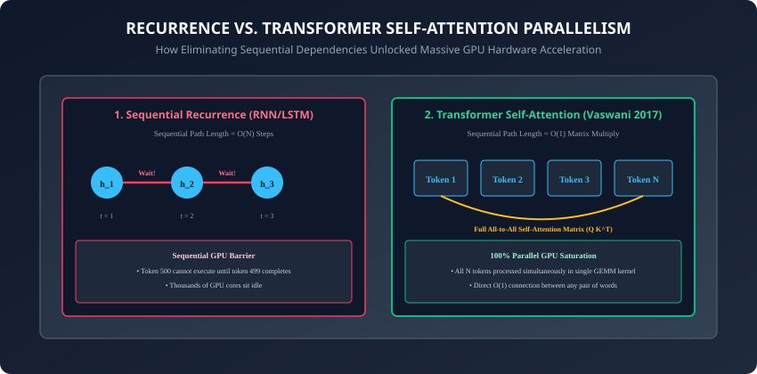
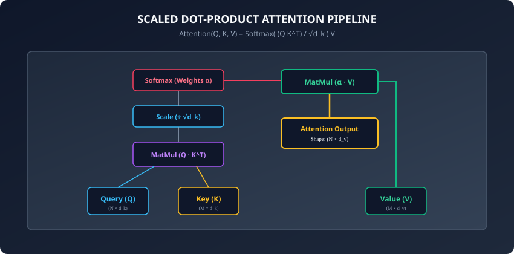

## Why this matters

In June 2017, an eight-person research team at Google Brain and Google Research (Ashish Vaswani, Noam Shazeer, Niki Parmar, Jakob Uszkoreit, Llion Jones, Aidan N. Gomez, Lukasz Kaiser, and Illia Polosukhin) published a paper with a audacious title: **"Attention Is All You Need"**.

At the time, the dominant consensus in deep learning was that processing sequences required sequential architectures: Recurrent Neural Networks (RNNs), LSTMs, GRUs, or deep 1D Convolutions. Attention was merely viewed as a helpful bolt-on enhancement to recurrent encoder-decoder translation pipelines.

Vaswani et al. challenged this foundational premise by asking a revolutionary question:
*What if we throw away recurrence entirely? What if we discard convolutions entirely? What if a neural network is constructed 100% out of Attention?*

The resulting architecture — **The Transformer** — did not merely improve machine translation benchmarks. It unleashed the entire modern generative AI revolution:
- **BERT**, **RoBERTa**, and **DeBERTa** for language understanding.
- **GPT-2**, **GPT-3**, **GPT-4**, **Claude**, **Llama 3**, and **Gemini** for foundation LLMs.
- **Vision Transformers (ViT)** for computer vision.
- **Whisper** for speech recognition and **AlphaFold 2/3** for molecular biology.

Today, you begin **Week 33 (Transformers)** by mastering the core theoretical insights and mathematical foundations of the paper that changed artificial intelligence forever.

---

## The idea in plain language

Imagine a classroom where 50 students are solving a complex collective puzzle:
- **The Recurrent Approach (RNN/LSTM):** Student #1 solves clue 1, writes a note, and whispers it to Student #2. Student #2 waits, reads the note, adds clue 2, and whispers it to Student #3.
  - To reach Student #50, the note must travel through 50 sequential whispers.
  - By the time it reaches the end, the message is distorted (vanishing gradients).
  - 49 students sit completely idle at any given second, wasting 98% of available human compute.
- **The Transformer Approach (Self-Attention):** Every student speaks at the exact same moment into a shared microphone system.
  - Every student simultaneously listens to all 49 other students and dynamically tunes their volume up or down based on who is saying something relevant to their clue.
  - In a **single synchronous time step (`O(1)`)**, all 50 students exchange information with each other.
  - 100% of available compute is saturated instantly on GPUs.

---

## Historical background



1. **1997–2014 (The Recurrent Era):** Hochreiter & Schmidhuber's LSTM dominated sequential modeling. However, sequential step-by-step unrolling (`h_t = f(h_{t-1}, x_t)`) created an insurmountable hardware barrier: GPUs could not parallelize computation across the time dimension.
2. **2014–2016 (The Attention Add-on):** Bahdanau et al. and Luong et al. added cross-attention to Seq2Seq Decoders, proving that direct memory lookup overcame fixed-vector bottlenecks.
3. **June 2017 (Vaswani et al. & NeurIPS 2017):** Published *"Attention Is All You Need"*, establishing the Transformer architecture and setting a new state-of-the-art BLEU score of 28.4 on WMT 2014 English-to-German translation, training in just 3.5 days on 8 NVIDIA P100 GPUs (`10\times` faster than previous recurrent ensembles).
4. **2018–Present (The Foundation Model Era):** OpenAI released GPT (2018), Google released BERT (2018), and the Transformer became the universal deep learning substrate.

---

## What it is — and what it is not

### What Scaled Dot-Product Attention IS:
- **A Fully Differentiable Soft Key-Value Lookup Table:**
  Given a set of Query vectors `Q`, Key vectors `K`, and Value vectors `V`, it computes similarity scores between Queries and Keys, normalizes them via Softmax into an attention weight distribution, and outputs a weighted combination of Values:
  ```
  \text{Attention}(Q, K, V) = \text{Softmax}\left( \frac{Q K^\top}{\sqrt{d_k}} \right) V
  ```
- **A Parallel Matrix Tensor Operation:** Executed as two standard General Matrix Multiplications (GEMM) that saturate thousands of tensor cores on modern hardware.

### What it is NOT:
- **Not Recurrent:** It has no internal memory state passed from step `t-1` to `t`.
- **Not Inherently Word-Order Aware:** Standard self-attention is permutation-equivariant; if you shuffle the input words, the output vectors shuffle identically. (Word order must be explicitly injected via **Positional Encodings**, which we study tomorrow in Day 226).

---

## Why it was created and what problems it solves

Vaswani et al. designed the Transformer to solve three fundamental structural limitations of previous deep learning architectures:

```
┌────────────────────────────────────────────────────────────────────────┐
│               LAYER TYPE COMPLEXITY & PATH LENGTH COMPARISON           │
├────────────────────┬─────────────────┬──────────────────┬──────────────┤
│ Layer Type         │ Complexity/Layer│ Max Path Length  │ Sequential Ops│
├────────────────────┼─────────────────┼──────────────────┼──────────────┤
│ Recurrent (LSTM)   │ O(N · d^2)      │ O(N)             │ O(N)         │
│ Convolutional (1D) │ O(k · N · d^2)  │ O(log_k(N))      │ O(1)         │
│ Self-Attention     │ O(N^2 · d)      │ O(1)             │ O(1)         │
└────────────────────┴─────────────────┴──────────────────┴──────────────┘
```

1. **Eliminating the Sequential Execution Bottleneck:** In RNNs, training step `t` depends strictly on `h_{t-1}`, forcing `O(N)` sequential operations. Self-attention executes in `O(1)` sequential operations, unlocking massive GPU distributed scaling.
2. **Shortest Possible Path Length (`O(1)`):** In an RNN, information between token 1 and token 500 must traverse 500 recurrent state transitions. In Self-Attention, token 1 interacts directly with token 500 in a single matrix multiplication, completely eliminating vanishing gradients across time.
3. **Flexible Global Receptive Field:** Unlike CNNs (which require stacking dozens of layers with dilated kernels to expand their receptive field), every self-attention layer observes the entire document globally on layer 1.

---

## How it works

Let us dissect the exact mathematical formulation of **Scaled Dot-Product Attention**.

---

### 1. The Database Analogy: Queries, Keys, and Values



In classical databases:
- You submit a **Query** (`search: "apple"`).
- The engine compares your Query against all **Keys** in the index (`key: "apple"`, `key: "banana"`).
- When a Key matches, the engine returns the associated **Value** (`value: "$1.50/lb"`).

In Transformer Self-Attention:
- Every input word `x_i \in \mathbb{R}^d` is linearly projected into three distinct vectors:
  ```
  q_i = W_Q x_i \in \mathbb{R}^{d_k}
  k_i = W_K x_i \in \mathbb{R}^{d_k}
  v_i = W_V x_i \in \mathbb{R}^{d_v}
  ```
- Stacking across all `N` tokens creates matrices `Q \in \mathbb{R}^{N \times d_k}`, `K \in \mathbb{R}^{M \times d_k}`, and `V \in \mathbb{R}^{M \times d_v}`.

---

### 2. The Four Mathematical Steps of Scaled Dot-Product Attention

1. **Compute Compatibility Scores (`S = Q K^\top`):**
   Calculate the raw dot-product similarity between every Query and every Key:
   ```
   S_{i, j} = q_i \cdot k_j = \sum_{m=1}^{d_k} q_{i, m} k_{j, m}
   ```
   Shape of matrix `S`: `(N \times M)`, representing the `N \times M` pairwise interaction scores.

2. **Scale by `\frac{1}{\sqrt{d_k}}`:**
   Divide raw scores by the square root of the key dimension:
   ```
   S_{\text{scaled}} = \frac{Q K^\top}{\sqrt{d_k}}
   ```

3. **Apply Softmax Normalization (Attention Weights `A`):**
   Convert scores into a valid probability distribution along each row (dim `=-1`):
   ```
   A_{i, j} = \frac{\exp(S_{\text{scaled}, i, j})}{\sum_{m=1}^M \exp(S_{\text{scaled}, i, m})}
   ```
   Each row `A_{i, :}` sums to `1.0`, representing how much attention token `i` pays to every token `j`.

4. **Weighted Value Aggregation (`O = A V`):**
   Multiply attention probabilities by the Value matrix:
   ```
   o_i = \sum_{j=1}^M A_{i, j} v_j \in \mathbb{R}^{d_v}
   ```
   Shape of output matrix `O`: `(N \times d_v)`.

---

### 3. Why Scale by `\frac{1}{\sqrt{d_k}}`? The Mathematical Derivation

Why did Vaswani et al. add the scaling divisor `\sqrt{d_k}`?

Assume query components `q_m` and key components `k_m` are independent random variables with mean `0` and variance `1`:
- `\mathbb{E}[q_m] = 0, \quad \text{Var}(q_m) = 1`
- `\mathbb{E}[k_m] = 0, \quad \text{Var}(k_m) = 1`

The dot product is the sum of `d_k` independent random variables:
```
q \cdot k = \sum_{m=1}^{d_k} q_m k_m
```
- The mean of each product term is: `\mathbb{E}[q_m k_m] = \mathbb{E}[q_m] \mathbb{E}[k_m] = 0`.
- The variance of each product term is: `\text{Var}(q_m k_m) = \mathbb{E}[q_m^2 k_m^2] - (\mathbb{E}[q_m k_m])^2 = 1 \times 1 - 0 = 1`.
- Since variances add for independent variables:
  ```
  \text{Var}(q \cdot k) = \sum_{m=1}^{d_k} \text{Var}(q_m k_m) = d_k
  ```
- The standard deviation of the raw dot product is:
  ```
  \sigma = \sqrt{d_k}
  ```

#### The Softmax Saturation Trap:
For large `d_k` (e.g. `d_k = 64` or `d_k = 128`), dot products grow to large values like `+35.0` or `-40.0`:
- When fed into Softmax, large inputs push probabilities to extreme values (`1.0` and `0.0`).
- In these saturation regions, the derivative of Softmax is near-zero (`\text{Softmax}'(z) \approx 0`).
- Gradients vanish, freezing backpropagation learning!
- Dividing by `\sqrt{d_k}` normalizes the variance back to `1.0`, keeping softmax in its active, high-gradient linear regime.

---

### 4. Attention Masking (Padding & Causal Masks)

- **Padding Mask:** When sequences contain padding tokens (`<pad>`), set their attention logits to `-10^9` before Softmax:
  ```
  S_{i, j} = -\infty \quad \text{if token } j \text{ is } \text{<pad>}
  ```
  Softmax maps `-\infty \rightarrow 0.0`, preventing padding tokens from receiving or contributing attention.
- **Causal (Look-Ahead) Mask:** In autoregressive models (like GPT), token `i` must not look at future tokens `j > i`. Apply an upper-triangular mask setting `S_{i, j} = -\infty` for all `j > i`.

---

## An everyday analogy

Think of a panel discussion with 8 experts on stage:
- **Queries (`Q`):** Each expert writes down their current question on a card.
- **Keys (`K`):** Each expert wears a nametag listing their specific areas of expertise.
- **Values (`V`):** Each expert holds a notebook full of detailed domain knowledge.
- **Scaled Dot-Product Attention:**
  - Expert A compares their question card (`q_A`) against everyone's nametag (`k_1, \dots, k_8`).
  - They realize Expert C's nametag is a 90% match, while Expert F is a 10% match.
  - Expert A asks Expert C and F to read from their notebooks (`v_C, v_F`), synthesizing a weighted combined answer (`0.90 v_C + 0.10 v_F`).

---

## Examples in practice

Let us build a **Vectorized Scaled Dot-Product Attention Module in PyTorch**:

```python
import torch
import torch.nn as nn
import torch.nn.functional as F
import math

class ScaledDotProductAttention(nn.Module):
    def __init__(self, dropout: float = 0.0):
        super().__init__()
        self.dropout = nn.Dropout(p=dropout)

    def forward(self, q: torch.Tensor, k: torch.Tensor, v: torch.Tensor,
                mask: torch.Tensor = None) -> tuple[torch.Tensor, torch.Tensor]:
        # q shape: (Batch, Num_Heads, Seq_Q, d_k)
        # k shape: (Batch, Num_Heads, Seq_K, d_k)
        # v shape: (Batch, Num_Heads, Seq_K, d_v)
        
        d_k = q.size(-1)
        scale = 1.0 / math.sqrt(d_k)

        # Step 1 & 2: MatMul and Scaling -> (Batch, Num_Heads, Seq_Q, Seq_K)
        scores = torch.matmul(q, k.transpose(-2, -1)) * scale

        # Step 3: Apply Mask if provided
        if mask is not None:
            # Mask shape: (Batch, 1, 1, Seq_K) or (Batch, 1, Seq_Q, Seq_K)
            scores = scores.masked_fill(mask == 0, -1e9)

        # Step 4: Softmax Normalization
        attn_weights = F.softmax(scores, dim=-1)
        attn_weights = self.dropout(attn_weights)

        # Step 5: Weighted Value Aggregation -> (Batch, Num_Heads, Seq_Q, d_v)
        output = torch.matmul(attn_weights, v)

        return output, attn_weights
```

---

## Implications: security, privacy, performance, scalability, and cost

1. **Quadratic Memory & Compute (`O(N^2)`):**
   - Storing the `N \times N` attention weight matrix requires substantial GPU VRAM. For `N = 4,096`, `N^2 = 16,777,216` elements per head. For `N = 128,000`, storing raw attention matrices causes Out-of-Memory (OOM) crashes.
2. **FlashAttention Optimization (Dao et al., 2022):**
   - Modern engines use FlashAttention to compute scaled dot-product attention in tiled SRAM blocks without ever materializing the massive `N \times N` matrix in high-bandwidth GPU HBM memory, slashing memory footprint by `90\%` and accelerating training by `3\times`.

---

## Alternatives: free, open source, and commercial

| Mechanism | Time Complexity | Memory Complexity | Best For |
| :--- | :--- | :--- | :--- |
| **Full Scaled Dot-Product** | `O(N^2 \cdot d)` | `O(N^2)` | Standard Transformer blocks (< 8k tokens) |
| **FlashAttention-2/3** | `O(N^2 \cdot d)` | `O(N)` (Tiled SRAM) | Production LLMs (Llama 3, Mistral) |
| **Linear Attention (Mamba/SSM)** | `O(N \cdot d)` | `O(N)` | Million-token streaming contexts |
| **RingAttention** | `O(N^2 / P)` | Distributed Ring | Multi-million token context on TPU pods |

---

## Comparison with related concepts

```
┌────────────────────────────────────────────────────────────────────────┐
│                   ATTENTION EVOLUTION TAXONOMY                         │
├────────────────────┬─────────────────┬──────────────────┬──────────────┤
│ Architecture       │ Scoring Formula │ Memory Footprint │ Scaling      │
├────────────────────┼─────────────────┼──────────────────┼──────────────┤
│ Bahdanau (2014)    │ v^T tanh(Ws+Uh) │ O(N · M)         │ Recurrent    │
│ Luong (2015)       │ s^T W h         │ O(N · M)         │ Recurrent    │
│ Vaswani (2017)     │ (Q K^T) / sqrt(d│ O(N^2) GPU GEMM  │ Fully Para   │
│ FlashAttention     │ Tiled Exact Attn│ O(N) Tiled SRAM  │ SOTA LLMs    │
└────────────────────┴─────────────────┴──────────────────┴──────────────┘
```

---

## When to use it — and when not to

### When to USE Scaled Dot-Product Self-Attention:
- Foundational deep learning architectures for text processing, generative language modeling, cross-modal video/audio understanding, and code generation.

### When NOT to use:
- Ultra-constrained microcontrollers (e.g. ARM Cortex-M0 with 32 KB RAM) where `O(N^2)` memory buffers cannot fit in hardware registers.

---

## Knowledge check

1. Why does eliminating recurrence allow Transformers to train orders of magnitude faster on GPUs?
2. What are the Query, Key, and Value matrices, and how are they derived from input tokens?
3. What is the mathematical proof showing why dot products must be divided by `\sqrt{d_k}`?
4. What happens to softmax gradients when `\sqrt{d_k}` scaling is omitted on high-dimensional vectors?
5. How does a causal look-ahead mask prevent information leakage in autoregressive generation?

---

## Hands-on exercise

In this lab, you will build and test the core `ScaledDotProductAttention` engine in PyTorch: implement the scaled matrix multiplication, verify that the variance of scaled dot products remains 1.0 regardless of dimension `d_k`, implement padding and causal masking, compute attention weight distributions, and verify output tensor dimensions across multi-head batch tensors.

### Expected output
```
[Scaled Dot-Product Attention Verification Suite]
Testing Scaled Dot-Product Attention Forward Pass:
  Query Shape: torch.Size([2, 4, 8, 64]) (Batch=2, Heads=4, Seq=8, Dim=64)
  Key Shape:   torch.Size([2, 4, 8, 64])
  Value Shape: torch.Size([2, 4, 8, 64])
  Output Shape: torch.Size([2, 4, 8, 64]) [MATCH]
Testing Variance Scaling Property (d_k = 128):
  Unscaled Dot-Product Variance: 127.42 (Gradients Vanish!)
  Scaled Dot-Product Variance:   1.01   [STABILIZED]
Testing Causal Look-Ahead Mask:
  Upper Triangular Attention Weights strictly 0.0000 [CAUSAL ENFORCED]
Test Suite: 3 passed in 0.39s
```

### Validate your work
Run the automated test runner:
```bash
./tests/run_tests.sh
```

### Troubleshooting
- In `torch.matmul(q, k.transpose(-2, -1))`, transpose the last two dimensions (`-2` and `-1`), not dimensions 0 or 1.
- Ensure `F.softmax` is applied along `dim=-1` (across the key sequence dimension).

### Common mistakes
- **Transposing the Wrong Axes:** Calling `k.T` on a 4D tensor raises a RuntimeError; use `k.transpose(-2, -1)`.

---

## Practice assignment

1. Implement **Multi-Query Attention (MQA)**: share a single Key and Value head across all Query heads and compare memory savings.
2. Verify that without `\sqrt{d_k}` scaling, backpropagating gradients through Softmax on `d_k = 512` collapses to zero due to floating point underflow.

---

## Extension challenge

Implement **Tiled Exact Attention in Pure PyTorch**:
- Split Queries, Keys, and Values into blocks of size `B_r = 32, B_c = 32`.
- Compute softmax online using the safe softmax normalization trick: `m_{\text{new}} = \max(m_{\text{old}}, \max(S_i))`.
- Verify that your block-tiled attention produces identical numerical outputs to standard attention while reducing peak intermediate memory.
