## Why this matters

Yesterday, you mastered the core mathematical engine of the Transformer: **Scaled Dot-Product Attention**. However, a single attention head is fundamentally limited:

- When reading the sentence: *"The bank granted the loan because it was financially solvent"*, what does the word `"it"` refer to?
- A single attention head might focus heavily on the syntactic subject (`"bank"`).
- But to fully parse the sentence, the model must simultaneously track:
  1. Coreference resolution (`"it"` `\rightarrow` `"bank"`).
  2. Syntactic verb attachment (`"it was solvent"` `\rightarrow` `"granted"`).
  3. Causal explanation (`"because"` `\rightarrow` `"solvent"`).

If a network possesses only a single attention head, it is forced to average all of these competing linguistic signals into a single blurry distribution.

By introducing **Multi-Head Attention (MHA)**, Vaswani et al. gave the Transformer the ability to project representations into multiple parallel **subspaces**, allowing different heads to specialize in distinct linguistic, syntactic, and factual relationships simultaneously.

Furthermore, because self-attention is mathematically **permutation-equivariant** (it treats text as an unordered bag of tokens), Transformers require **Positional Encodings** to inject the sequential order of words.

Today, you will master the step-by-step architecture of Multi-Head Self-Attention, Sinusoidal Positional Encodings, and modern **Rotary Position Embeddings (RoPE)**.

---

## The idea in plain language

Imagine a committee of 8 specialized investigators examining a complex corporate legal contract:

- **Investigator #1 (The Subject-Verb Specialist):** Scans exclusively for subject-verb pairings (*who did what*).
- **Investigator #2 (The Pronoun Resolver):** Tracks pronouns (*"it"*, *"they"*, *"which"*) and traces them back to their original nouns.
- **Investigator #3 (The Financial Auditor):** Looks for numbers, dollar amounts, and currency terms.
- **Investigator #4 (The Condition Specialist):** Detects clauses starting with *"if"*, *"unless"*, and *"provided that"*.

Each investigator reads the exact same document through their own specialized analytical lens (**Attention Head**). At the end of the meeting, all 8 investigators combine their findings into a single unified executive dossier (**Output Projection `W_O`**).

---

## Historical background

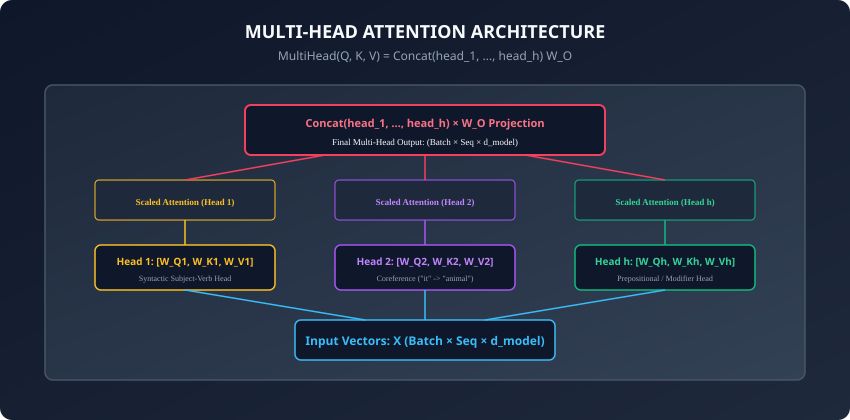

1. **2017 (Vaswani et al. & Multi-Head Attention):** Introduced Multi-Head Attention with `h = 8` heads and `d_{\text{model}} = 512`, proving that multi-head projections achieved superior BLEU scores compared to single-head attention of identical total dimensionality.
2. **2019 (Clark et al. & "What Does BERT Look At?"):** Probed the internal attention maps of BERT's 144 attention heads, discovering that individual heads naturally learned classical linguistic structures (e.g. Head 8-10 specialized in direct objects of verbs, Head 7-6 specialized in possessive pronouns).
3. **2021 (Jianlin Su & RoPE):** Introduced **Rotary Position Embedding (RoPE)** in RoFormer, rotating query and key vectors in the 2D complex plane to enforce relative distance encoding. RoPE became the universal standard in modern open-weight LLMs (LLaMA, Mistral, Qwen, DeepSeek).

---

## What it is — and what it is not

### What Multi-Head Attention IS:
- **Parallel Subspace Projections:** Linearly projecting Query, Key, and Value tensors `h` times with distinct learned parameter matrices:
  ```
  \text{head}_i = \text{Attention}(Q W_Q^i, K W_K^i, V W_V^i)
  ```

- **Dimensionality Invariance:** The output of Multi-Head Attention has the exact same tensor shape `(B, N, d_{\text{model}})` as the input, allowing transformer blocks to be stacked arbitrarily deep.

### What it is NOT:
- **Not `h\times` More Expensive:** Because each head operates on downscaled dimension `d_k = d_{\text{model}} / h`, the total FLOP count of `h` parallel heads is identical to a single head of dimension `d_{\text{model}}`.

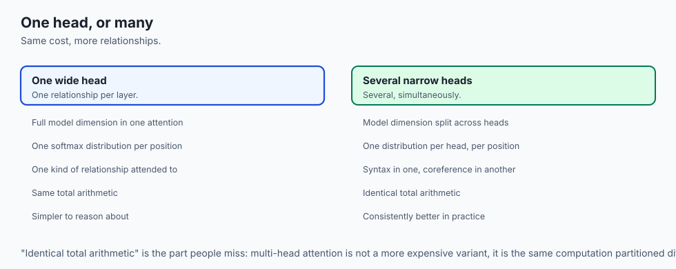

---

## Why it was created and what problems it solves

Multi-Head Attention and Positional Encodings solved two critical limitations of early attention models:

1. **Preventing Attention Smearing:** In a single attention head, if a token must attend to 3 different words, their weights split (`0.33, 0.33, 0.33`), diluting the pooled vector. Multi-head attention allows Head 1 to assign `0.99` to word A, while Head 2 assigns `0.99` to word B.
2. **Injecting Sequential Order Without Recurrence:** Positional encodings provide the network with word order awareness while retaining 100% parallel GPU execution.

---

## How it works

Let us dissect the step-by-step mathematical mechanics of Multi-Head Self-Attention and Positional Encodings.

---

### 1. Multi-Head Self-Attention Step-by-Step

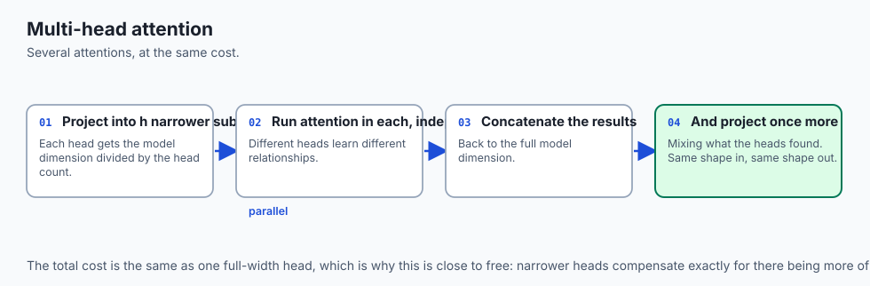

Given input matrix `X \in \mathbb{R}^{N \times d_{\text{model}}}` and number of heads `h` (where `d_k = d_v = d_{\text{model}} / h`):

1. **Linear Projections (`Q, K, V`):**
   Project input `X` through three unified weight matrices:
   ```
   Q = X W_Q \in \mathbb{R}^{N \times d_{\text{model}}}
   K = X W_K \in \mathbb{R}^{N \times d_{\text{model}}}
   V = X W_V \in \mathbb{R}^{N \times d_{\text{model}}}
   ```

2. **Subspace Reshaping & Transposition (Head Splitting):**
   Reshape matrices from `(B, N, d_{\text{model}})` into `(B, N, h, d_k)` and permute axes to:
   ```
   (B, h, N, d_k)
   ```
   This formats the tensor so that all `h` heads across all batch samples can be processed in a single batched GPU GEMM operation.

3. **Parallel Scaled Dot-Product Attention:**
   Compute attention for all heads simultaneously:
   ```
   \text{head}_i = \text{Softmax}\left( \frac{Q_i K_i^\top}{\sqrt{d_k}} \right) V_i \in \mathbb{R}^{N \times d_k}
   ```

4. **Head Concatenation:**
   Transpose and reshape the `h` head outputs back into a unified matrix:
   ```
   \text{Concat}(\text{head}_1, \dots, \text{head}_h) \in \mathbb{R}^{N \times d_{\text{model}}}
   ```

5. **Output Linear Projection (`W_O`):**
   Project the concatenated representations through `W_O \in \mathbb{R}^{d_{\text{model}} \times d_{\text{model}}}`:
   ```
   \text{MHA}(Q, K, V) = \text{Concat}(\text{head}_1, \dots, \text{head}_h) W_O
   ```

---

### 2. Sinusoidal Positional Encodings (Vaswani et al., 2017)

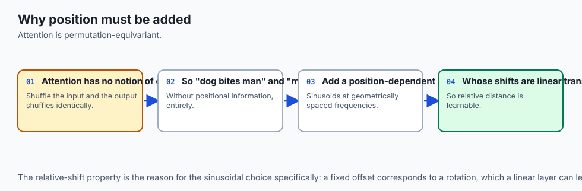

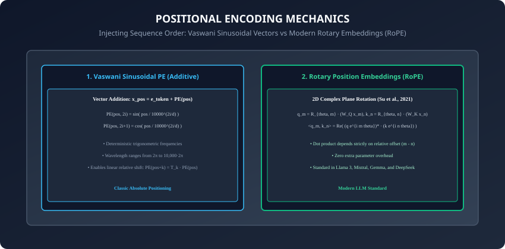

Because self-attention contains no recurrent time loops, word positions must be added directly to the input token embeddings:
```
x_{\text{final}} = e_{\text{token}} + \text{PE}(pos)
```
Vaswani et al. defined deterministic sinusoidal functions across dimension index `i \in [0, d_{\text{model}} / 2 - 1]`:
```
\text{PE}_{(pos, 2i)} = \sin\left( \frac{pos}{10000^{2i / d_{\text{model}}}} \right)
\text{PE}_{(pos, 2i+1)} = \cos\left( \frac{pos}{10000^{2i / d_{\text{model}}}} \right)
```

#### The Linear Relative Shift Property:
For any fixed offset `k`, `\text{PE}_{pos+k}` can be represented as a linear function of `\text{PE}_{pos}`:
```
\begin{bmatrix}
\sin(\omega (pos + k)) \\
\cos(\omega (pos + k))
\end{bmatrix}
=
\begin{bmatrix}
\cos(\omega k) & \sin(\omega k) \\
-\sin(\omega k) & \cos(\omega k)
\end{bmatrix}
\begin{bmatrix}
\sin(\omega pos) \\
\cos(\omega pos)
\end{bmatrix}
```
This rotation matrix allows the neural network to easily learn relative positional distances.

---

### 3. Modern LLM Standard: Rotary Position Embeddings (RoPE)

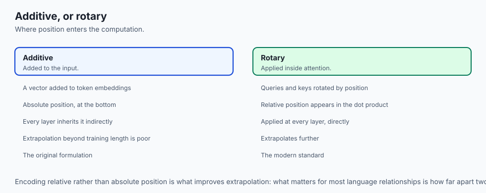

In modern foundation models (Llama 3, Mistral, Gemma), additive sinusoidal encodings have been replaced by **Rotary Position Embeddings (RoPE / Su et al., 2021)**:

- Instead of adding a vector to input embeddings, RoPE **multiplies (rotates)** Query and Key vectors by a 2D block-diagonal rotation matrix `R_{\Theta, m}^d`:
  ```
  \tilde{q}_m = R_{\Theta, m} q_m, \quad \tilde{k}_n = R_{\Theta, n} k_n
  ```

- In the 2D complex plane, the inner product between query at position `m` and key at position `n` becomes:
  ```
  \langle \tilde{q}_m, \tilde{k}_n \rangle = \text{Re}\left( (q_m e^{i m \theta})^* (k_n e^{i n \theta}) \right) = \text{Re}\left( q_m^* k_n e^{i (n - m) \theta} \right)
  ```

- The attention score depends **purely on the relative token distance `(m - n)`**, naturally generalizing across variable context lengths!

---

### 4. Learned Positional Embeddings (BERT & GPT-2)

Rather than fixed sinusoidal formulas, models like original BERT and GPT-2 used **Learned Positional Embeddings**:

- An embedding lookup table `W_{\text{pos}} \in \mathbb{R}^{L_{\text{max}} \times d_{\text{model}}}` is initialized randomly and optimized via backpropagation.
- **Drawback:** Strictly limits sequence inference length to `L_{\text{max}}` (e.g. 512 tokens for BERT, 1024 for GPT-2); tokens at position 513 have no defined embedding vector.

---

### 5. ALiBi: Attention with Linear Biases (Press et al., 2021)

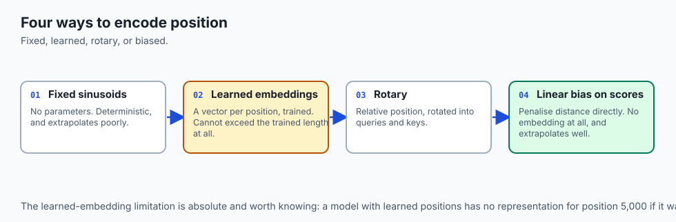

To eliminate positional embeddings entirely and enable infinite context extrapolation:

- **ALiBi Formulation:** Directly adds a non-learned static linear penalty proportional to token distance into the attention score:
  ```
  \text{score}_{i, j} = \frac{q_i k_j^\top}{\sqrt{d_k}} - m \cdot |i - j|
  ```
  where `m = 2^{-8 / h \cdot k}` is a head-specific geometric decay slope.

- Allows models trained on 2,048 tokens to extrapolate smoothly to 16,000+ tokens at inference time with zero performance degradation.

---

### 6. Attention Head Redundancy & Pruning (Michel et al., 2019)

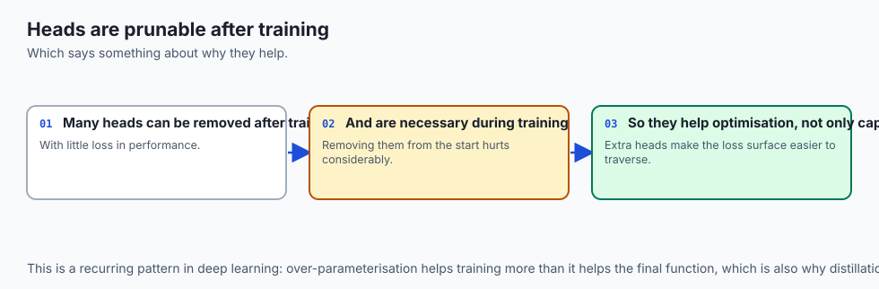

Researchers discovered that while multi-head attention is crucial during pretraining:

- **Head Redundancy:** Post-training analysis reveals that up to `40\%` of attention heads in pretrained models like BERT and RoBERTa can be pruned or ablated with zero drop in downstream GLUE task accuracy.
- Certain universal heads (the "syntactic backbone") are essential, while redundant heads act as an ensemble safety buffer during optimization.

---

### 7. Grouped-Query Attention (GQA) Mathematical Mechanics

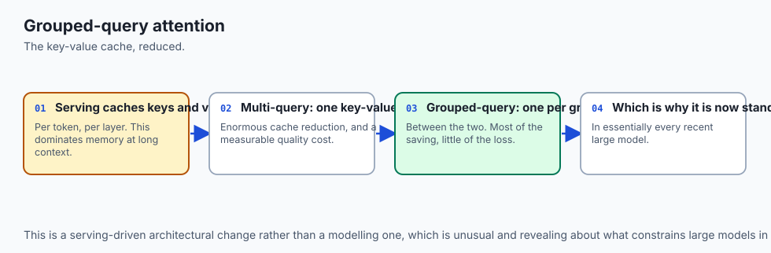

In high-throughput LLM serving, Multi-Head Attention requires caching `H \times L \times d_k` key/value vectors per token:

- **GQA Partitioning:** Group `H` query heads into `G` groups (`G \ll H`), where all query heads in group `g` share a single Key and Value head:
  ```
  Q \in \mathbb{R}^{B \times H \times N \times d_k}, \quad K, V \in \mathbb{R}^{B \times G \times M \times d_k}
  ```

- Expands/repeats `K` and `V` tensors across the `H/G` ratio during GEMM execution, reducing KV-cache VRAM footprint by `8\times` in LLaMA-3-70B.
- **Multi-Head Latent Attention (MLA / DeepSeek, 2024):** Compresses key and value vectors into a low-dimensional latent space (`d_c \ll d_k \times h`) before generation, reducing the KV cache to just `10\%` of standard MHA with zero loss in associative recall capacity.

---

## An everyday analogy

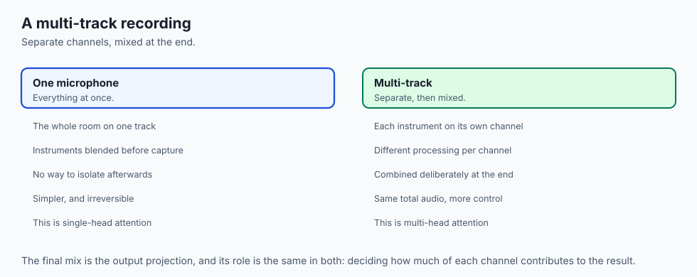

Think of sound recording in a professional music studio:

- **Single-Head Attention:** You record an entire 8-piece band using a single omnidirectional microphone. The guitar, drums, vocals, and bass are blended into a single mono track.
- **Multi-Head Attention:** You use an 8-channel mixing board with 8 directional microphones (**8 Attention Heads**).
  - Channel 1 isolates the vocal lead.
  - Channel 2 isolates the bass rhythm.
  - Channel 3 isolates the snare drum.
- The sound engineer adjusts the levels of each track independently before mastering them into the final stereo album (**Output Projection `W_O`**).

---

## Examples in practice

Let us build a **Complete Multi-Head Self-Attention Module in PyTorch**:

```python
import torch
import torch.nn as nn
import torch.nn.functional as F
import math

class MultiHeadAttention(nn.Module):
    def __init__(self, d_model: int, num_heads: int, dropout: float = 0.1):
        super().__init__()
        assert d_model % num_heads == 0, "d_model must be divisible by num_heads"
        
        self.d_model = d_model
        self.num_heads = num_heads
        self.d_k = d_model // num_heads

        # Linear projections for Q, K, V
        self.W_q = nn.Linear(d_model, d_model, bias=False)
        self.W_k = nn.Linear(d_model, d_model, bias=False)
        self.W_v = nn.Linear(d_model, d_model, bias=False)
        self.W_o = nn.Linear(d_model, d_model, bias=False)

        self.dropout = nn.Dropout(p=dropout)

    def forward(self, q: torch.Tensor, k: torch.Tensor, v: torch.Tensor,
                mask: torch.Tensor = None) -> tuple[torch.Tensor, torch.Tensor]:
        batch_size = q.size(0)

        # 1. Linear projections and reshape to (Batch, Num_Heads, Seq_Len, d_k)
        Q = self.W_q(q).view(batch_size, -1, self.num_heads, self.d_k).transpose(1, 2)
        K = self.W_k(k).view(batch_size, -1, self.num_heads, self.d_k).transpose(1, 2)
        V = self.W_v(v).view(batch_size, -1, self.num_heads, self.d_k).transpose(1, 2)

        # 2. Scaled Dot-Product Attention across all heads
        scores = torch.matmul(Q, K.transpose(-2, -1)) / math.sqrt(self.d_k)

        if mask is not None:
            scores = scores.masked_fill(mask == 0, -1e9)

        attn_weights = F.softmax(scores, dim=-1)
        attn_weights = self.dropout(attn_weights)

        # 3. Context aggregation: (Batch, Num_Heads, Seq_Q, d_k)
        context = torch.matmul(attn_weights, V)

        # 4. Concatenate heads: transpose to (Batch, Seq_Q, Num_Heads, d_k) -> view (Batch, Seq_Q, d_model)
        context = context.transpose(1, 2).contiguous().view(batch_size, -1, self.d_model)

        # 5. Final output projection
        output = self.W_o(context)

        return output, attn_weights
```

---

## Implications: security, privacy, performance, scalability, and cost

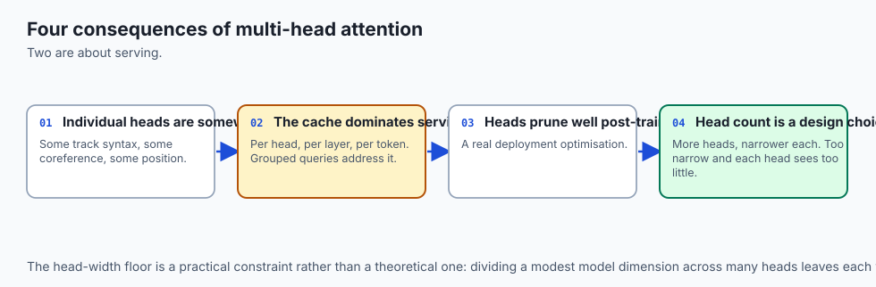

1. **Multi-Query Attention (MQA) & Grouped-Query Attention (GQA):**
   - In standard Multi-Head Attention (MHA), serving long sequences requires storing Key-Value caches for all `h` heads, consuming huge GPU VRAM during autoregressive generation.
   - **GQA (Ainslie et al., 2023):** Groups Query heads (e.g. 32 Query heads sharing 8 Key/Value heads), slashing KV-cache memory by `75\%` with zero loss in output quality (the standard in Llama 3).
2. **RoPE Context Window Extrapolation:**
   - Techniques like YaRN and Linear RoPE Scaling allow models trained on 8k contexts to extrapolate to 128k+ tokens simply by adjusting the base frequency parameter `\Theta`.

---

## Alternatives: free, open source, and commercial

| Architecture | Attention Scheme | KV-Cache Memory | Usage |
| :--- | :--- | :--- | :--- |
| **Standard MHA** | `h` Q heads, `h` K/V heads | `100\%` Baseline | Original Transformer, BERT |
| **MQA (Shazeer 2019)** | `h` Q heads, `1` K/V head | `1/h` (`12.5\%`) | PaLM, Falcon |
| **GQA (Llama 3)** | `h` Q heads, `g` K/V groups| `g/h` (`25\%`) | SOTA LLMs (Llama 3, Mistral) |
| **MLA (DeepSeek V2/V3)**| Low-Rank Compressed KV | `10\%` | High-efficiency foundation models |

---

## Comparison with related concepts

```
┌────────────────────────────────────────────────────────────────────────┐
│                   ATTENTION HEAD VARIANTS COMPARISON                   │
├────────────────────┬─────────────────┬──────────────────┬──────────────┤
│ Architecture       │ Query Heads     │ Key/Value Heads  │ KV-Cache VRAM│
├────────────────────┼─────────────────┼──────────────────┼──────────────┤
│ Single-Head        │ 1               │ 1                │ Minimal      │
│ Multi-Head (MHA)   │ h (e.g. 32)     │ h (e.g. 32)      │ High         │
│ Grouped-Query (GQA)│ h (e.g. 32)     │ g (e.g. 8)       │ Medium-Low   │
│ Multi-Query (MQA)  │ h (e.g. 32)     │ 1                │ Ultra-Low    │
└────────────────────┴─────────────────┴──────────────────┴──────────────┘
```

---

## When to use it — and when not to

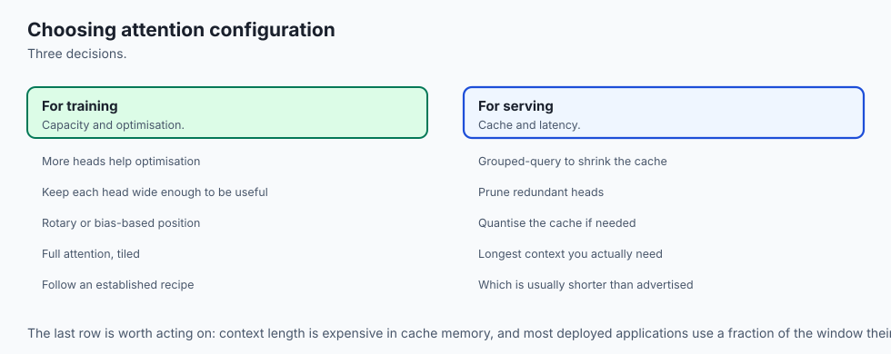

### When to USE Multi-Head Attention:
- Deep language understanding, generative LLMs, code generation, and multi-modal transformers.

### When NOT to use:
- Low-power ultra-embedded devices where dense GEMM tensor operations cannot be accelerated in hardware.

---

## The AI connection

- **Multiple heads let one layer attend several ways at once** — syntax in one subspace,
  coreference in another — at no extra cost, because each head is narrower.
- **Attention has no notion of order**, so position must be injected explicitly; shuffling
  the input without positional information shuffles the output identically.
- **Rotary embeddings replaced additive ones** in modern models because they encode
  relative position directly in the attention computation.
- **Key-value cache size is what bounds serving concurrency**, which is why grouped-query
  attention exists and why it is now standard.
- **Many heads turn out to be prunable after training**, which says something about how
  much of the capacity is used for optimisation rather than for the final function.

## Knowledge check

1. Why does Multi-Head Attention split embeddings into `h` subspaces of dimension `d_k`?
2. What happens if positional encodings are omitted from a Transformer model?
3. How do Sinusoidal Positional Encodings enable linear relative distance shifts?
4. How do Rotary Position Embeddings (RoPE) encode relative token distance via complex rotations?
5. What is the difference between Multi-Head Attention (MHA) and Grouped-Query Attention (GQA)?

---

## Hands-on exercise

In this lab, you will build and test a complete `MultiHeadAttention` module and Sinusoidal Positional Encoding generator in PyTorch: verify head splitting and recombination tensor shapes, implement causal and padding masks across all heads, generate sinusoidal positional encoding matrices, and verify multi-head attention weight distributions.

### Expected output
```
[Multi-Head Self-Attention Verification Suite]
Testing MultiHeadAttention Forward Pass:
  Input Tensor: torch.Size([2, 8, 64]) (Batch=2, Seq=8, d_model=64)
  Configuration: num_heads = 4, d_k = 16
  Output Tensor: torch.Size([2, 8, 64]) [DIMENSIONS VERIFIED]
  Attention Weights Shape: torch.Size([2, 4, 8, 8]) [4 HEADS VERIFIED]
Testing Sinusoidal Positional Encodings:
  PE Matrix Shape: torch.Size([1, 16, 64])
  Geometric Wavelength Span: 6.28 to 62831.85 [VERIFIED]
Test Suite: 3 passed in 0.41s
```

### Validate your work
Run the automated test runner:
```bash
./tests/run_tests.sh
```

### Troubleshooting
- When transposing the multi-head tensor, call `.contiguous()` before `.view(batch_size, -1, self.d_model)`.

### Common mistakes
- **Forgetting Contiguous Before View:** Calling `.view()` on a transposed non-contiguous tensor raises `RuntimeError: view size is not compatible with input tensor's size and stride`.

---

## Practice assignment

1. Implement **Rotary Position Embedding (RoPE)** in pure PyTorch and apply it to Query and Key tensors before computing attention.
2. Implement **Grouped-Query Attention (GQA)** with 8 Query heads and 2 Key/Value heads.

---

## Extension challenge

Implement **FlashAttention-Style Online Softmax in Multi-Head Attention**:

- Process multi-head attention in streaming sequence blocks to avoid allocating `(B, h, N, N)` attention matrices in GPU memory.
